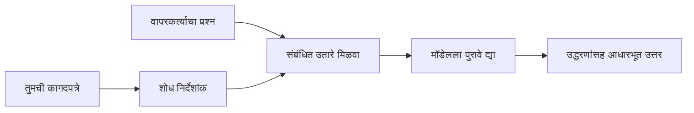

# आपले दस्तऐवजांवर आधारित प्रश्नांची उत्तरे देण्यासाठी AI ला शिकवा:
## मालिका 1: RAG, Azure विरुध्द Open-Source पर्याय, आणि जेव्हा Fine-Tuning अर्थपूर्ण ठरते

> 2026 मधील पहिला लेख जो माझ्या 2023 च्या Azure AI Search + Azure OpenAI दस्तऐवज प्रश्न-उत्तर ट्युटोरियल्सवर पुनरावलोकन करतो.

## 1. परिचय - एका पूर्वीच्या RAG ट्युटोरियलवर पुनरावलोकन

2023 मध्ये, मी Azure AI Search आणि Azure OpenAI वापरून PDF दस्तऐवजांमधील प्रश्नांची उत्तरे देण्यासाठी ChatGPT ला शिकवण्याबाबत दोन ट्युटोरियल्सवर काम केले. मी [LangChain आवृत्ती](https://techcommunity.microsoft.com/blog/educatordeveloperblog/teach-chatgpt-to-answer-questions-using-azure-ai-search--azure-openai-lang-chain/3969713) लिहिली, आणि मी [Lee Stott](https://developer.microsoft.com/en-us/advocates/lee-stott) सोबत सहलेखक म्हणून [Semantic Kernel आवृत्ती](https://techcommunity.microsoft.com/blog/educatordeveloperblog/teach-chatgpt-to-answer-questions-using-azure-ai-search--azure-openai-semantic-k/3985395) लिहिली, जे मायक्रोसॉफ्टमध्ये प्रिन्सिपल क्लाउड ऍडव्होकेट मॅनेजर आहेत. त्या काळी, "तुमच्या डेटावर ChatGPT" ची कल्पना अनेक विकासकांसाठी अजूनही नवीन वाटत होती. या ट्युटोरियल्समध्ये Azure Blob Storage, Azure AI Search, Azure OpenAI, LangChain, Semantic Kernel, आणि FAISS-शैलीच्या व्हेक्टर पुनर्प्राप्तीचा वापर करून PDF फाइल्समधून प्रश्नांची उत्तरे दिली गेली.

त्या आधीच्या लेखाचा लक्ष एक सोप्या पण महत्त्वाच्या वर्कफ्लोवर होता: दस्तऐवज अपलोड करा, त्यांना अनुक्रमित करा, संबंधित सामग्री शोधा, आणि त्या सामग्रीवर आधारित मॉडेलला उत्तर विचार करा.

2026 मध्ये, RAG पर्यावरण मोठ्या प्रमाणावर विकसित झाले आहे. Azure AI Search आता आधुनिक व्हेक्टर आणि हायब्रिड पुनर्प्राप्ती पद्धतींना समर्थन देते, Azure OpenAI हा व्यापक Microsoft Foundry Models पर्यावरणाचा भाग आहे, आणि नवीन v1 API साठी मानक OpenAI क्लायंट वापरता येतो ज्यासाठी मासिक `api-version` बदल आवश्यक नाहीत. त्याच वेळी, LangGraph, LlamaIndex, Haystack, Qdrant, Milvus, Weaviate, Chroma, Ollama, आणि vLLM सारखे open-source पर्याय खऱ्या RAG सिस्टमसाठी व्यावहारिक निवडी झाले आहेत.

म्हणूनच मला हा विषय पुन्हा पहायचा होता. आता प्रश्न फक्त "मी RAG कसे तयार करतो?" इतका नाही. आता याला बनवण्याचे अनेक मार्ग आहेत, आणि महत्वाचा प्रश्न असा आहे की "माझ्या परिस्थितीसाठी कोणती संरचना निवडायची?"

प्रमाणिकपणे, मूलभूत समस्या सुधारली नाही.

AI मॉडेल आपले दस्तऐवज आपोआप ओळखत नाही. उपयुक्त दस्तऐवज-प्रश्न-उत्तर प्रणाली तयार करण्यासाठी, आपल्याला विश्वासार्ह पुनर्प्राप्ती, आधारित करणे, मूल्यमापन, आणि कार्यप्रवाहांची गरज असते.

हा लेख आणखी एक संपूर्ण "PDF सह चॅट" ट्युटोरियल नाही. मला या अद्ययावत मालिकेची सुरुवात अशा प्रश्नावर करायची आहे जे मला आता अधिक महत्त्वाचे वाटते: आपण कधी व्यवस्थापित Azure आर्किटेक्चर निवडायचा, कधी open-source RAG स्टॅक निवडायचा, आणि कधी fine-tuning खरी अर्थपूर्ण ठरते?

हा मालिका भाग दस्तऐवज-आधारित AI सिस्टम्स तयार करण्याबाबत आहे. या पहिल्या भागात आपण आर्किटेक्चर निर्णयांवर लक्ष केंद्रित करू: RAG का महत्त्वाचा आहे, कधी Azure बेस्ड व्यवस्थापित सेवा उपयुक्त आहेत, कधी open-source पर्याय अर्थपूर्ण ठरतात, आणि fine-tuning कसा बसतो.

दस्तऐवज QA प्रणाली बांधून आणि पुनरावलोकन करून, मला डेमोमध्ये कोणते साधन चांगले दिसते यापेक्षा जास्त स्वारस्य आहे की कोणती आर्किटेक्चर खऱ्या वापरकर्त्यांसोबत, बदलत्या दस्तऐवजांसोबत, अधिकारांसोबत, अपयशांसोबत, आणि देखभालीसह टिकून राहते.

## 2. आपल्या AI ला शोध प्रणाली का आवश्यक आहे

मोठ्या भाषा मॉडेल्स सार्वजनिक आणि अनुज्ञापित डेटा वापरून प्रशिक्षण घेतले आहेत. त्यांना सामान्य विषयांबद्दल बरंच ज्ञान असू शकतं, पण ते आपली खाजगी PDF, अंतर्गत धोरणे, उद्योग प्रक्रिये, संशोधन अभिलेख, वर्ग सामग्री, ग्राहक सहाय्य नोट्स, किंवा अलीकडील अद्यतने आपोआप माहित नसतात.

RAG बद्दल सोप्या शब्दांत विचार करा: मॉडेलला प्रत्येक दस्तऐवज लक्षात ठेवण्याची अपेक्षा न ठेवता, आपण त्याला शोध प्रणाली देतो. वापरकर्ता प्रश्न विचारल्यावर, प्रणाली प्रथम सर्वांत संबंधित माहिती शोधते, आणि नंतर त्या तुकड्यांना संदर्भ म्हणून मॉडेलला देते.

हे महत्त्वाचं आहे कारण अनेक प्रत्यक्ष ज्ञान स्त्रोत खाजगी, सतत बदलणारे, परवानगी-सेन्सिटिव्ह, एकापेक्षा जास्त प्रणालींमध्ये संग्रहित, अनेक फॉरमॅट्समध्ये लिहिलेले, आणि प्रॉम्प्टमध्ये थेट चिकटवण्यासाठी फार मोठे असतात.

उदाहरणादाखल, जर शाळा, कंपनी, किंवा संशोधन संघाकडे 10,000 अंतर्गत दस्तऐवज असतील, तर मॉडेल त्या दस्तऐवजांमधून विश्वसनीयपणे उत्तर देऊ शकत नाही जर प्रणाली योग्य वेळी योग्य भाग शोधून न दिले.

हा निसर्गाने सामान्य प्रश्नाकडे नेतो:

मॉडेल फक्त fine-tune का करू नये?

Fine-tuning उपयुक्त असू शकते, पण बहुधा दस्तऐवजीक ज्ञानासाठी योग्य पहिली साधन नाही. जर ज्ञान वारंवार बदलत असेल, संदर्भ महत्वाचे असतील, किंवा प्रवेश परवानग्या महत्त्वाच्या असतील, तर RAG सहसा बटणाचा सुरुवातीचा बिंदू आहे. Fine-tuning वर्तन, शैली, आउटपुट फॉरमॅट, आणि कार्य पद्धती शिकवण्यासाठी अधिक योग्य आहे.

## 3. RAG आर्किटेक्चर प्रत्यक्षात

कल्पना करा की आपण शाळेसाठी एक AI सहाय्यक तयार करत आहात. सहाय्यकाला धोरण PDF, अभ्यासक्रम मार्गदर्शिका, अंतर्गत FAQ पृष्ठे, आणि अलीकडील प्रसिद्धीमधील प्रश्नांची उत्तरे द्यायची आहेत.

जर विद्यार्थी विचारतो, "मी माझ्या अंतिम प्रोजेक्टसाठी जनरेटिव्ह AI वापरू शकतो का?", तर प्रणाली मॉडेलच्या सामान्य स्मृतीवरून उत्तर देऊ नये. प्रथम ती संबंधित शाळेच्या धोरणास शोधेल, AI वापराविषयी विभाग प्राप्त करेल, आणि नंतर मॉडेलला त्या पुराव्यांसह उत्तर देण्यास सांगेल.

हेच RAG प्रत्यक्षात आहे.

उच्च स्तरावर, प्रवाह असा आहे:

तपशील अधिक सूक्ष्म होऊ शकतात, पण मूलभूत कल्पना सोपी आहे: मॉडेल एकटे उत्तर देत नाही. ते प्राप्त पुराव्यासह उत्तर देते.

सुरुवातीला, दस्तऐवज Azure Blob Storage, SharePoint, GitHub, किंवा अंतर्गत CMS सारख्या साठवण प्रणालींमधून घेतले जातात. नंतर प्रणाली त्यांना मजकूरात रूपांतरित करते, ज्यात शीर्षके, पृष्ठ क्रमांक, तक्ते, विभाग, आणि स्रोत स्थानांसारखी उपयुक्त रचना राखली जाते.

यानंतर, सामग्री तुकड्यांमध्ये विभागली जाते. हा चरण सोपा वाटू शकतो, पण प्रणालीतील सर्वात महत्त्वाच्या भागांपैकी एक आहे. जर तुकडा खूप लहान असेल तर तो आसपासचा संदर्भ गमावू शकतो. जर तुकडा जास्त मोठा असेल तर तो अवांछित माहितीचा समावेश करू शकतो आणि पुनर्प्राप्ती कमी अचूक होऊ शकते.

तुकड्यांनंतर, प्रणाली एम्बेडिंग तयार करते आणि त्यांना शोधण्यायोग्य निर्देशिकेमध्ये मूळ मजकूर आणि मेटाडेटासह फाइल नाव, पृष्ठ क्रमांक, परवानग्या, दस्तऐवज आवृत्ती, आणि स्रोत URL सह संग्रहित करते.

वापरकर्ता प्रश्न विचारल्यावर, प्रणाली किवर्ड शोध, व्हेक्टर शोध, किंवा हायब्रिड शोध वापरून उमेदवार तुकडे शोधते. नंतर प्रत्यायक पुनर्रचना करून त्या तुकड्यांना असे क्रम देते की सर्वात उपयुक्त पुरावा वरील बाजूस ठेवला जातो.

शेवटी, मॉडेलला प्रश्न आणि प्राप्त पुरावा दिला जातो. उत्तर त्या पुराव्यावर आधारित असावे आणि संदर्भ दाखवायला हवेत ज्यामुळे वापरकर्ता स्रोत तपासू शकतो.

महत्त्वाचा मुद्दा असा की RAG म्हणजे फक्त "PDFs व्हेक्टर डेटाबेसमध्ये ठेवा" इतकं नाही. उत्तराची गुणवत्ता संपूर्ण वर्कफ्लोवर अवलंबून असते: पार्सिंग, तुकड्यांमध्ये विभागणी, पुनर्प्राप्ती, पुनर्रचना, प्रॉम्प्टिंग, संदर्भ देणे, आणि मूल्यमापन.

म्हणूनच दस्तऐवज रचना महत्त्वाची आहे. PDF मध्ये शीर्षक, तक्ता, फूटनोट, किंवा पृष्ठाची सीमा एका परिच्छेदाचा अर्थ बदलू शकते. Azure वर, Document Layout कौशल्य Azure Document Intelligence ची लेआउट क्षमता वापरून संरचनासंगत आउटपुट तयार करते, ज्यामुळे RAG प्रणालींमध्ये तुकड्यांची विभागणी आणि पुनर्प्राप्तीची गुणवत्ता सुधारते.

## 4. 2023 नंतर काय बदलले?

2023 चा ट्युटोरियल त्याच्या काळासाठी चांगला प्रारंभ बिंदू होता:

- Azure Blob Storage मध्ये PDF फाइल्स संग्रहित केल्या.
- Azure AI Search ने सामग्री अनुक्रमित केली.
- LangChain ने पुनर्प्राप्ती Azure OpenAI शी जोडली.
- FAISS एक सोपा स्थानिक व्हेक्टर स्टोअर म्हणून काम केला.
- उदाहरणार्थ `gpt-35-turbo` आणि `text-embedding-ada-002` वापरले.

2026 मध्ये, एक आधुनिक आवृत्ती अनेक बदल प्रतिबिंबित करेल.

सर्वप्रथम, पुनर्प्राप्ती प्रगल्भ झाली आहे. 2023 मध्ये, अनेक डेमो सोप्या व्हेक्टर सादृश्य शोधाचा वापर करत होते. आज, गंभीर दस्तऐवज QA साठी हायब्रिड पुनर्प्राप्ती बहुधा मूळ प्रवाह आहे. Azure AI Search कीवर्ड आणि व्हेक्टर क्वेरी एका विनंतीत एकत्र करून हायब्रिड शोधांना समर्थन देते आणि Reciprocal Rank Fusion सह निकाल एकत्र करते. Semantic ranker नंतर पूर्ण-पाठ, व्हेक्टर, आणि हायब्रिड निकालांचा मजकूर बाजूचे पुनर्रचना करू शकतो.

दुसरे, संग्रहण अधिक प्रगत झाले आहे. प्रत्येक दस्तऐवज हाताने स्प्लिट करण्याऐवजी, Azure AI Search चं एकत्रित व्हेक्टरायझेशन chunking, embedding, आणि क्वेरी-वेळ व्हेक्टरायझेशनसाठी समर्थन करते. PDF आणि दस्तऐवज-भरपूर कामांसाठी Document Layout कौशल्य निश्चित आकाराच्या तुकड्यांपेक्षा अधिक रचना जपू शकते.

तिसरे, संघटन अधिक महत्त्वाची झाली आहे. कठीण भाग बहुधा LLM API कॉल नाही. कठीण भाग म्हणजे अपयश हाताळणे, पुनःप्रयत्न, जुना पुनर्प्राप्ती, तुकडा गुणवत्ता, दीर्घकालीन वर्कफ्लोज, मानवी पुनरावलोकन, आणि स्केलवर मूल्यमापन. हेथे LangGraph, LlamaIndex वर्कफ्लोज, Haystack पाइपलाइन, आणि प्लेटफॉर्म-स्तरीय मूल्यमापन व निरीक्षण उपकरणे महत्त्वाची ठरतात, एकसंध साखळीपेक्षा.

चौथे, मूल्यमापन आता ऐच्छिक नाही. एक प्रश्नाने डेमो प्रभावित करू शकतो. उत्पादन प्रणालीला चाचणी संच, पुनरावृत्ती तपासणी, पुनर्प्राप्ती मेट्रिक्स, आधारित तपासणी, आणि देखरेख आवश्यक आहे. मूल्यमापनांशिवाय, प्रणाली सुधारत आहे की फक्त बदलत आहे हे जाणून घेणं कठीण आहे.

## 5. Azure आणि Open-Source RAG स्टॅक्समधून निवड

मला वाटत नाही की उपयुक्त प्रश्न "Azure open source पेक्षा चांगले आहे का?" किंवा "open source Azure पेक्षा चांगले आहे का?" असा आहे.

उपयुक्त प्रश्न असा आहे: तुम्ही कोणत्या प्रकारची प्रणाली तयार करत आहात, कोण ती चालवणार आहे, कोणते बंधन आहेत, आणि कोणते अपयश प्रकार स्वीकार्य नाहीत?

जेव्हा मी दस्तऐवज QA उदाहरणे तयार करू लागलो, तेव्हा माझा मुख्य विचार होता पुनर्प्राप्ती कार्यरत आहे की नाही. PDF अपलोड करू शकतो, शोधू शकतो, आणि उत्तर तयार करू शकतो का? तो एक तर्कसंगत प्रारंभ बिंदू होता.

अधिक वास्तविक AI कार्यप्रवाहांतून काम केल्यावर, माझं मूल्यमापन बदलले. आता मी RAG स्टॅक निवडण्यापूर्वी चार गोष्टी पाहतो:

- ओळख आणि परवानग्या
- पुनर्प्राप्ती गुणवत्ता
- कार्यप्रवाह विश्वासार्हता
- ऑपरेशनल मालकी

ही चार क्षेत्र तुम्हाला मॉडेल बेंचमार्कच्या तुलनेत खूप अधिक सांगतात.

Azure आधारित आर्किटेक्चर सहसा उपयुक्त असतात जेव्हा उद्योगिक समाकलन हा कठीण भाग असतो. जर संघ आधीच Microsoft Entra ID, Microsoft 365, Azure Storage, खाजगी नेटवर्किंग, RBAC, आणि Azure मॉनिटरिंगवर अवलंबून असेल, तर Azure AI Search आणि Azure OpenAI खूप ऑपरेशनल गुंतागुंती कमी करू शकतात. अशा वातावरणात, Azure केवळ मॉडेल API नाही. मूल्य आजूबाजूच्या प्रणालीत आहे: ओळख, शासकीय नियंत्रण, व्यवस्थापित शोध, सुरक्षा समाकलन, सहाय्य, आणि परिचित ऑपरेशन्स.

Open-source आर्किटेक्चर सहसा उपयुक्त असतात जेव्हा लवचिकता हा कठीण भाग असतो. जर संघाला स्थानिक इन्फरन्स, क्लाउड पोर्टेबिलिटी, सानुकूल पुनर्प्राप्ती पाईपलाईन, विशेष पुनर्रचना, किंवा व्हेक्टर डेटाबेस आणि मॉडेल-सेवा थरावर थेट नियंत्रण आवश्यक असेल, तर open-source स्टॅक जास्त योग्य ठरू शकतो. त्याची किंमत म्हणजे संघ अधिक विश्वसनीयता काम භरणं: बॅकअप्स, स्केलिंग, विलंब, स्थलांतर, निरीक्षण, आणि सुरक्षा.

प्रत्यक्षात, अनेक उत्पादन AI सिस्टम्स केवळ क्लाउड-नेटिव्ह किंवा केवळ open-source नसतात. त्या बहुधा हायब्रिड सिस्टम असतात, जे ऑपरेशनल सुलभता, पोर्टेबिलिटी, शासकीय नियंत्रण, आणि अभियांत्रिकी लवचिकतेत समतोल राखतात.

उदाहरणार्थ, मला आश्चर्य वाटणार नाही की एक प्रणाली Azure OpenAI मॉडेल प्रवेशासाठी, LangGraph वर्कफ्लो संघटनासाठी, Azure होस्टिंग डिप्लॉयमेंटसाठी, आणि विशेष पुनर्प्राप्ती गरजेसाठी open-source व्हेक्टर डेटाबेस वापरते. हे आर्किटेक्चरल विसंगती नाही. ही त्या प्रणालीच्या प्रत्येक भागासाठी योग्य व्यवस्थापित सेवा आणि अभियांत्रिकी नियंत्रणाची निवड आहे.

मी हायब्रिड आर्किटेक्चरना प्राधान्य देतो जेव्हा व्यवस्थापित प्लॅटफॉर्म महत्त्वाच्या उद्योग समस्या सोडवते, तर open-source घटक संघाला खऱ्या अर्थाने महत्वाच्या जागी लवचिकता देतात.

## 6. एक व्यावहारिक निर्णय मार्गदर्शक

RAG स्टॅक निवडण्यापूर्वी मी संघासोबत वापरण्याचा निर्णय तक्ता असा आहे:

| निर्णय क्षेत्र | Azure व्यवस्थापित स्टॅक अधिक मजबूत कधी... | Open-source स्टॅक अधिक मजबूत कधी... |
| --- | --- | --- |
| ओळख आणि प्रवेश | Entra ID, RBAC, व्यवस्थापित ओळख, आणि उद्योग परवानग्या केंद्रीय असतील | सानुकूल प्रमाणीकृत, गैर-मायक्रोसॉफ्ट ओळख, किंवा ऍप-विशिष्ट प्रवेश लॉजिक प्रबळ असेल |
| ऑपरेशन | संघाला व्यवस्थापित पायाभूत सुविधा, समर्थन, SLA, आणि सोपे ऑनबोर्डिंग हवे असेल | संघ व्हेक्टर डेटाबेस, मॉडेल सेवा, बॅकअप, आणि स्केलिंग ऑपरेट करू शकेल |
| पुनर्प्राप्ती | हायब्रिड शोध, सेमॅंटिक रँकिंग, फिल्टर्स, आणि मेटाडेटा शोध जास्त गरजा पूर्ण करतील | संघाला सानुकूल पुनर्प्राप्ती, विशेष पुनर्रचना, किंवा प्रयोगशील अनुक्रमण आवश्यकता असेल |
| पोर्टेबिलिटी | Azure पर्यावरणाशी सुसंगतता स्वीकार्य किंवा प्राधान्य असेल | क्लाउड लॉक-इन टाळणे कठीण गरज असेल |
| इन्फरन्स | Azure OpenAI शासकीय, नेटवर्किंग, आणि उद्योग नियंत्रण महत्त्वाचे असतील | स्थानिक इन्फरन्स, सानुकूल मॉडेल, किंवा स्व-होस्टेड सेवा आवश्यक असेल |
| खर्च | अभियांत्रिकी आणि ऑपरेशन्स प्रयत्न कमी करणे महत्त्वाचे असेल | स्केल इतका मोठा की पायाभूत सुविधा अनुकूलन जेवढे काळजीपूर्वक हवे |
| प्रयोग | स्थिरता आणि उद्योग समाकलन जास्त महत्त्वाचे असेल, परिणामी घटक वारंवार बदलत नसतील | संघ एजंट्स, साधने, स्मृती, आणि पुनर्प्राप्ती वर्कफ्लोजवर जलद पुनरावृत्ती करत असेल |

माझा अंगठीचा नियम सोप्पा आहे:

- उद्योग समाकलन, सुरक्षा, आणि ऑपरेशनल सुलभता मुख्य धोके असतील तर Azure ने सुरुवात करा.
- पोर्टेबिलिटी, सानुकूलन, किंवा स्थानिक नियंत्रण मुख्य धोके असतील तर open source ने सुरुवात करा.
- दोन्ही बाजू खऱ्या असतील तर हायब्रिड स्टॅक वापरा.

म्हणूनच मी 2026 च्या RAG मालिकेस कोडपासून सुरुवात करीत नाही. कोड महत्त्वाचा आहे, पण आर्किटेक्चर निवडले म्हणूनच अंमलबजावणी येते. सोपा डेमो सर्वात कठीण निवडी लपवू शकतो. चांगली RAG प्रणाली त्या निवडी स्पष्टपणे व्यक्त करते.

## 7. Fine-Tuning कुठे बसतो

Fine-tuning सहसा RAG सोबत नाव घेतले जाते, पण मला वाटते की दोन्ही वेगळे करणे महत्त्वाचे आहे.

जेव्हा प्रणालीला ताजी, खाजगी, परवानगी-संवेदनशील, किंवा स्रोत-आधारित ज्ञान आवश्यक असते, तेव्हा RAG सहसा उत्तम पर्याय आहे. जर उत्तर दस्तऐवजांचा संदर्भ द्यायचा असेल, अलीकडील अद्यतने प्रतिबिंबित करायची असतील, किंवा वापरकर्त्याच्या प्रवेश नियमांचे पालन करायचे असेल, तेव्हा पुनर्प्राप्ती आर्किटेक्चरचा भाग असायला हवा.

Fine-tuning अधिक उपयोगी आहे जेव्हा ज्ञान मुख्य समस्या नाही. जेव्हा तुम्हाला मॉडेलला विशिष्ट आउटपुट फॉरमॅट अनुसरायला, विशिष्ट क्षेत्र-विशिष्ट प्रतिसाद शैलीशी जुळवून घ्यायचे, स्थिर कार्य अधिक सातत्याने करायचे, किंवा प्रत्येक प्रॉम्प्टमध्ये लागणाऱ्या सूचनांचे प्रमाण कमी करायचे असते तेव्हा हे मदत करू शकते.
व्यवहारात, हे दोन्ही एकत्र काम करू शकतात. एक सपोर्ट सहाय्यक नवीनतम धोरण पुनर्प्राप्त करण्यासाठी RAG वापरू शकतो, तर एक सूक्ष्म-संशोधित मॉडेल कंपनीच्या पसंतीच्या उत्तर संरचना आणि टोन शिकते.

चूक म्हणजे सूक्ष्म-संशोधनाला दस्तऐवज संग्रहासाठी पर्यायी म्हणून पाहणे. जेव्हा सिस्टमला ताजी, खाजगी किंवा परवानगी-संवेदनशील डेटामधून उत्तर द्यावे लागते तेव्हा पुनर्प्राप्तीची गरज कमी होत नाही.

## 8. पुढे ही मालिका कुठे जाते

हा लेख निर्णय घेण्याची थर आहे. कोड लिहिण्यापूर्वी, मी ट्रेडऑफ स्पष्ट करायचे इच्छित होतो: RAG विरुद्ध सूक्ष्म-संशोधन, Azure विरुद्ध मुक्त स्रोत, व्यवस्थापित सेवा विरुद्ध ऑपरेशनल नियंत्रण.

अंमलबजावणीमध्ये जाण्यापूर्वी, मला येथे एक मुद्दा ठेवायचा आहे: अनेक एंटरप्राईज AI सिस्टममध्ये, मॉडेल हा फक्त एक घटक असतो. पुनर्प्राप्तीची गुणवत्ता, समन्वय, मूल्यमापन, परवानग्या, आणि ऑपरेशनल विश्वसनीयता यांमुळेच बहुधा सिस्टम डेमो टप्प्यापलीकडे सफल ठरते.

या मालिकेच्या पुढील भागांत, मी दस्तऐवज-आधारित AI सिस्टमच्या व्यावहारिक बाजूवर अधिक खोलवर जाण्याचा मानस आहे: Azure-आधारित आर्किटेक्चर कसे तयार करायचे, मुक्त-स्रोत पर्याय व्यवहारात कसे तुलनात्मक आहेत, आणि RAG सिस्टम खरोखर कार्यरत आहे की नाही हे कसे मूल्यमापन करायचे.

मालिका वाढतांना मी क्रमात बदल करू शकतो, पण उद्दिष्ट तेच राहील: एक सोपा डेमो ओलांडून RAG सिस्टमविषयी विचार कसा करावा जे देखभाल, मूल्यमापन, आणि ऑपरेट केले जाऊ शकतील, हे दाखवणे.

## 9. संदर्भ आणि संसाधने

मूळ ट्युटोरियल्स:

- [Teach ChatGPT to Answer Questions: Using Azure AI Search & Azure OpenAI (Lang Chain)](https://techcommunity.microsoft.com/blog/educatordeveloperblog/teach-chatgpt-to-answer-questions-using-azure-ai-search--azure-openai-lang-chain/3969713)
- [Teach ChatGPT to Answer Questions: Using Azure AI Search & Azure OpenAI (Semantic Kernel)](https://techcommunity.microsoft.com/blog/educatordeveloperblog/teach-chatgpt-to-answer-questions-using-azure-ai-search--azure-openai-semantic-k/3985395)

Azure:

- [Azure AI Search REST API versions](https://learn.microsoft.com/en-us/rest/api/searchservice/search-service-api-versions)
- [Hybrid search in Azure AI Search](https://learn.microsoft.com/en-us/azure/search/hybrid-search-how-to-query)
- [Integrated vectorization in Azure AI Search](https://learn.microsoft.com/en-us/azure/search/vector-search-integrated-vectorization)
- [Document Layout skill in Azure AI Search](https://learn.microsoft.com/en-us/azure/search/cognitive-search-skill-document-intelligence-layout)
- [Chunk and vectorize by document layout](https://learn.microsoft.com/en-us/azure/search/search-how-to-semantic-chunking)
- [Semantic ranking in Azure AI Search](https://learn.microsoft.com/en-us/azure/search/semantic-search-overview)
- [Azure OpenAI / Microsoft Foundry API version lifecycle](https://learn.microsoft.com/en-us/azure/foundry/openai/api-version-lifecycle)
- [Foundry Models sold by Azure](https://learn.microsoft.com/en-us/azure/foundry/foundry-models/concepts/models-sold-directly-by-azure)
- [Microsoft Foundry fine-tuning considerations](https://learn.microsoft.com/en-us/azure/foundry/openai/concepts/fine-tuning-considerations)
- [Microsoft Foundry observability](https://learn.microsoft.com/en-us/azure/foundry/concepts/observability)
- [Run evaluations in Microsoft Foundry](https://learn.microsoft.com/en-us/azure/foundry/how-to/evaluate-generative-ai-app)

मुक्त-स्रोत:

- [LangGraph documentation](https://docs.langchain.com/oss/python/langgraph/overview)
- [LlamaIndex documentation](https://developers.llamaindex.ai/python/framework/)
- [Haystack documentation](https://docs.haystack.deepset.ai/)
- [Qdrant documentation](https://qdrant.tech/documentation/overview/)
- [Milvus documentation](https://milvus.io/docs/overview.md)
- [Weaviate documentation](https://docs.weaviate.io/weaviate/current/)
- [Chroma documentation](https://docs.trychroma.com/docs/overview/introduction)
- [Ollama embeddings](https://docs.ollama.com/capabilities/embeddings)
- [vLLM OpenAI-compatible server](https://docs.vllm.ai/en/latest/serving/openai_compatible_server.html)
- [BGE embedding models](https://huggingface.co/BAAI/bge-large-en-v1.5)
- [E5 embedding models](https://huggingface.co/intfloat/e5-large-v2)
- [Instructor embedding models](https://huggingface.co/hkunlp/instructor-large)

---

<!-- CO-OP TRANSLATOR DISCLAIMER START -->
**अस्वीकरण**:
हा दस्तऐवज AI भाषांतर सेवा [Co-op Translator](https://github.com/Azure/co-op-translator) चा वापर करून अनुवादित केला आहे. जरी आम्ही अचूकतेसाठी प्रयत्न करतो, तरी कृपया लक्षात घ्या की स्वयंचलित भाषांतरांमध्ये त्रुटी किंवा अचूकतेची कमतरता असू शकते. मूळ दस्तऐवज त्याच्या मूळ भाषेत अधिकृत स्रोत मानला पाहिजे. महत्त्वाची माहिती असल्यास, व्यावसायिक मानवी भाषांतराची शिफारस केली जाते. या भाषांतराच्या वापरामुळे उद्भवणाऱ्या कोणत्याही गैरसमज किंवा चुकीच्या अर्थलावणीसाठी आम्ही जबाबदार नाही.
<!-- CO-OP TRANSLATOR DISCLAIMER END -->