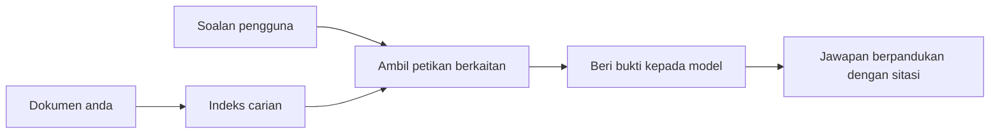

# Ajar AI Menjawab Soalan Berdasarkan Dokumen Anda:
## Siri 1: RAG, Azure vs Alternatif Sumber Terbuka, dan Bila Penalaan Halus Masuk Akal

> Artikel pertama dalam siri 2026 yang mengimbas kembali tutorial QA dokumen Azure AI Search + Azure OpenAI saya pada 2023.

Navigasi siri: [Laman utama repositori](../README.md) | Seterusnya: [Siri 2 - Bangunkan Sistem RAG Sumber Terbuka Tempatan dari Awal hingga Akhir](./series-2-open-source-rag-end-to-end.md)

## 1. Pengenalan - Mengimbas Kembali Tutorial RAG Awal

Pada tahun 2023, saya bekerja pada sepasang tutorial tentang mengajar ChatGPT menjawab soalan dari dokumen PDF menggunakan Azure AI Search dan Azure OpenAI. Saya menulis [versi LangChain](https://techcommunity.microsoft.com/blog/educatordeveloperblog/teach-chatgpt-to-answer-questions-using-azure-ai-search--azure-openai-lang-chain/3969713), dan saya juga bersama-sama menulis [versi Semantic Kernel pendamping](https://techcommunity.microsoft.com/blog/educatordeveloperblog/teach-chatgpt-to-answer-questions-using-azure-ai-search--azure-openai-semantic-k/3985395) dengan [Lee Stott](https://developer.microsoft.com/en-us/advocates/lee-stott), seorang Pengurus Utama Advocates Awan di Microsoft. Pada masa itu, idea "ChatGPT pada data anda" masih terasa baru bagi ramai pembangun. Tutorial tersebut menggunakan Azure Blob Storage, Azure AI Search, Azure OpenAI, LangChain, Semantic Kernel, dan pengambilan vektor gaya FAISS untuk menjawab soalan dari fail PDF.

Artikel awal itu memfokuskan pada aliran kerja mudah tetapi penting: muat naik dokumen, indekskan, ambil kandungan yang relevan, dan minta model menjawab berdasarkan kandungan itu.

Pada tahun 2026, ekosistem RAG telah berkembang dengan ketara. Azure AI Search kini menyokong corak pengambilan vektor moden dan hibrid, Azure OpenAI adalah sebahagian daripada ekosistem Model Foundry Microsoft yang lebih luas, dan API v1 yang lebih baru boleh menggunakan klien OpenAI standard tanpa memerlukan perubahan `api-version` bulanan. Pada masa yang sama, pilihan sumber terbuka seperti LangGraph, LlamaIndex, Haystack, Qdrant, Milvus, Weaviate, Chroma, Ollama, dan vLLM telah menjadi pilihan praktikal untuk sistem RAG sebenar.

Itulah sebabnya saya ingin mengimbas kembali topik ini. Soalannya bukan lagi hanya "Bagaimana saya membina RAG?" Kini terdapat banyak cara untuk membinanya, dan soalan yang lebih penting ialah "Arkitektur mana yang harus saya pilih untuk keadaan saya?"

Tetapi masalah teras tidak berubah.

Model AI tidak secara automatik mengetahui dokumen anda. Untuk membina sistem soal jawab dokumen yang berguna, anda masih memerlukan pengambilan yang boleh dipercayai, pemantapan, penilaian, dan aliran kerja operasi.

Artikel ini bukan tutorial “chat dengan PDF” secara menyeluruh. Saya ingin memulakan siri terkini ini dengan soalan yang kini lebih saya ambil berat: bila anda harus memilih arkitektur Azure terurus, bila anda harus memilih tumpukan RAG sumber terbuka, dan bila penalaan halus sebenarnya masuk akal?

Ini adalah artikel pertama dalam siri tentang membina sistem AI berasaskan dokumen. Dalam bahagian pertama ini, kita akan fokus pada keputusan arkitektur: mengapa RAG penting, bila perkhidmatan terurus berasaskan Azure berguna, bila alternatif sumber terbuka masuk akal, dan di mana penalaan halus sesuai.

Selepas membina dan mengimbas semula sistem QA dokumen, saya menjadi kurang berminat pada alat mana yang kelihatan terbaik dalam demo dan lebih berminat pada arkitektur mana yang boleh bertahan dengan pengguna sebenar, dokumen yang berubah, kebenaran, kegagalan, dan penyelenggaraan.

## 2. Mengapa AI Anda Memerlukan Sistem Carian

Model bahasa besar dilatih berdasarkan data awam dan berlesen yang luas. Mereka mungkin mengetahui banyak tentang topik umum, tetapi mereka tidak secara automatik mengetahui PDF peribadi anda, dasar dalaman, prosedur perusahaan, arkib penyelidikan, bahan kelas, nota sokongan pelanggan, atau dokumentasi yang dikemas kini baru-baru ini.

Cara mudah untuk memahami RAG ialah: daripada mengharapkan model untuk mengingat setiap dokumen, kita berikan sistem carian. Apabila pengguna bertanya soalan, sistem itu terlebih dahulu mencari maklumat yang paling relevan, kemudian memberikan maklumat tersebut kepada model sebagai konteks.

Ini penting kerana banyak sumber pengetahuan dunia sebenar adalah peribadi, sentiasa berubah, sensitif kepada kebenaran, disimpan dalam pelbagai sistem, ditulis dalam banyak format, dan terlalu besar untuk disalin terus ke dalam prompt.

Sebagai contoh, jika sebuah sekolah, syarikat, atau pasukan penyelidikan mempunyai 10,000 dokumen dalaman, model tidak boleh menjawab daripada dokumen tersebut dengan boleh dipercayai melainkan sistem mengambil bahagian yang tepat pada masa yang tepat.

Ini secara semula jadi membawa kepada soalan biasa:

Mengapa tidak hanya menala halus model?

Penalaan halus boleh berguna, tetapi ia biasanya bukan alat pertama yang sesuai untuk pengetahuan dokumen. Jika pengetahuan berubah kerap, jika sitasi penting, atau jika kebenaran akses penting, RAG biasanya adalah titik permulaan yang lebih baik. Penalaan halus lebih sesuai untuk mengajar tingkah laku, gaya, format keluaran, dan corak tugas.

## 3. Arkitektur RAG Dalam Praktik

Bayangkan anda sedang membina pembantu AI untuk sebuah sekolah. Pembantu itu perlu menjawab soalan dari PDF dasar, panduan kursus, halaman FAQ dalaman, dan pengumuman yang baru dikemas kini.

Jika seorang pelajar bertanya, "Bolehkah saya menggunakan AI generatif untuk tugasan akhir saya?", sistem tidak seharusnya menjawab berdasarkan memori umum model. Ia harus terlebih dahulu mencari dasar sekolah yang relevan, mengambil bahagian tentang penggunaan AI, dan kemudian meminta model menjawab menggunakan bukti itu.

Itulah RAG dalam praktik.

Pada tahap tinggi, anda boleh memikirkan alirannya seperti ini:

Perinciannya boleh menjadi lebih sofistikated, tetapi idea asasnya mudah: model tidak menjawab sendirian. Ia menjawab dengan bukti yang diambil.

Pertama, dokumen dimasukkan dari sistem penyimpanan seperti Azure Blob Storage, SharePoint, GitHub, atau CMS dalaman. Kemudian sistem memecahkannya menjadi teks sambil mengekalkan struktur berguna seperti tajuk, nombor halaman, jadual, seksyen, dan lokasi sumber.

Seterusnya, kandungan dibahagikan menjadi bahagian kecil. Langkah ini kedengaran mudah, tetapi ia adalah salah satu bahagian paling penting dalam sistem. Jika bahagian kecil terlalu kecil, ia mungkin kehilangan konteks sekeliling. Jika bahagian terlalu besar, ia mungkin mengandungi maklumat yang tidak berkaitan dan menjadikan pengambilan kurang tepat.

Selepas pecahan, sistem mencipta embedding dan menyimpannya dalam indeks yang boleh dicari bersama dengan teks asal dan metadata seperti nama fail, nombor halaman, kebenaran, versi dokumen, dan URL sumber.

Apabila pengguna bertanya soalan, sistem mengambil bahagian calon menggunakan carian kata kunci, carian vektor, atau carian hibrid. Penilai semula kemudian boleh menyusun semula bahagian tersebut supaya bukti paling berguna diletakkan di bahagian atas.

Akhirnya, model menerima soalan dan bukti yang diambil. Jawapan harus berasaskan bukti itu dan mengembalikan sitasi supaya pengguna boleh memeriksa sumber.

Poin penting ialah RAG bukan sahaja "masukkan PDF ke dalam pangkalan data vektor." Kualiti jawapan bergantung pada keseluruhan aliran kerja: penguraian, pecahan, pengambilan, penilaian semula, pemicu, sitasi, dan penilaian.

Itulah sebabnya struktur dokumen penting. Dalam PDF, tajuk, jadual, nota kaki, atau sempadan halaman boleh mengubah maksud sesuatu petikan. Di Azure, kemahiran Susun Atur Dokumen menggunakan keupayaan susun atur Azure Document Intelligence untuk menghasilkan keluaran yang peka struktur, yang boleh meningkatkan kualiti pecahan dan pengambilan untuk sistem RAG.

## 4. Apa Yang Berubah Sejak 2023?

Tutorial 2023 adalah titik mula yang baik pada masa itu:

- Azure Blob Storage menyimpan fail PDF.
- Azure AI Search mengindeks kandungan.
- LangChain menghubungkan pengambilan ke Azure OpenAI.
- FAISS berfungsi sebagai stor vektor tempatan mudah.
- Contoh menggunakan `gpt-35-turbo` dan `text-embedding-ada-002`.

Pada 2026, versi moden harus mencerminkan beberapa perubahan.

Pertama, pengambilan telah matang. Pada 2023, banyak demo menggunakan carian keserupaan vektor mudah. Hari ini, pengambilan hibrid sering menjadi titik mula lalai untuk QA dokumen serius. Azure AI Search menyokong carian hibrid dengan menggabungkan pertanyaan kata kunci dan vektor dalam satu permintaan dan menggabungkan hasil dengan Reciprocal Rank Fusion. Penilai semantik kemudian boleh menyusun semula bahagian teks hasil teks penuh, vektor, dan hibrid.

Kedua, pengambilan menjadi lebih sofistikated. Daripada membahagikan setiap dokumen secara manual dengan kod aplikasi, Azure AI Search menyokong vektorisasi terbina untuk pecahan, embedding, dan vektorisasi masa pertanyaan. Untuk beban kerja PDF dan dokumen berat, kemahiran Susun Atur Dokumen boleh mengekalkan lebih banyak struktur berbanding pecahan bersaiz tetap.

Ketiga, penyelarasan lebih penting. Bahagian sukar sering bukan panggilan API LLM itu sendiri. Bahagian sukar ialah mengendalikan kegagalan, cubaan semula, pengambilan lapuk, kualiti pecahan, aliran kerja jangka panjang, semakan manusia, dan penilaian pada skala besar. Di sinilah alat berorientasikan aliran kerja seperti LangGraph, aliran kerja LlamaIndex, paip Haystack, dan alat penilaian serta pengamatan tahap platform menjadi lebih relevan daripada rantai linear tunggal.

Keempat, penilaian tidak lagi pilihan. Demo boleh kelihatan mengagumkan dengan satu soalan. Sistem pengeluaran memerlukan set ujian, pemeriksaan regresi, metrik pengambilan, pemeriksaan kebertukaran, dan pemantauan. Tanpa penilaian, sukar untuk mengetahui sama ada sistem sedang bertambah baik atau hanya berubah.

## 5. Memilih Antara Tumpukan RAG Azure dan Sumber Terbuka

Saya tidak fikir soalan yang berguna ialah "Adakah Azure lebih baik daripada sumber terbuka?" atau "Adakah sumber terbuka lebih baik daripada Azure?"

Soalan yang berguna ialah: jenis sistem apa yang anda bina, siapa yang akan mengendalikannya, apa kekangan yang anda ada, dan mod kegagalan apa yang tidak boleh diterima?

Ketika saya mula membina contoh QA dokumen, saya kebanyakannya memikirkan sama ada pengambilan berfungsi. Bolehkah saya memuat naik PDF, mencarinya, dan menjana jawapan? Itu adalah titik mula yang munasabah.

Selepas melalui aliran kerja AI yang lebih realistik, penilaian saya berubah. Saya kini melihat empat perkara sebelum memilih tumpukan RAG:

- identiti dan kebenaran
- kualiti pengambilan
- kebolehpercayaan aliran kerja
- pemilikan operasi

Empat bidang itu memberitahu anda lebih banyak daripada penanda aras model sahaja.

Arkitektur berasaskan Azure biasanya masuk akal apabila integrasi perusahaan adalah bahagian sukar. Jika satu pasukan sudah bergantung pada Microsoft Entra ID, Microsoft 365, Azure Storage, rangkaian peribadi, RBAC, dan pemantauan Azure, Azure AI Search dan Azure OpenAI boleh mengurangkan banyak kerumitan operasi. Dalam persekitaran itu, Azure bukan hanya API model. Nilainya ialah sistem sekeliling: identiti, tadbir urus, carian terurus, integrasi keselamatan, sokongan, dan operasi yang biasa.

Arkitektur sumber terbuka biasanya masuk akal apabila fleksibiliti adalah bahagian sukar. Jika pasukan memerlukan inferens tempatan, portabiliti awan, paip pengambilan khusus, penilaian semula khusus, atau kawalan langsung ke atas pangkalan data vektor dan lapisan perkhidmatan model, tumpukan sumber terbuka boleh jadi pilihan lebih baik. Perdagangannya ialah pasukan memiliki lebih banyak kerja kebolehpercayaan: sandaran, penskalaan, latensi, migrasi, pemantauan, dan keselamatan.

Dalam praktik, banyak sistem AI pengeluaran bukan hanya asli awan atau sumber terbuka sepenuhnya. Mereka sering sistem hibrid yang mengimbangi kesederhanaan operasi, portabiliti, tadbir urus, dan fleksibiliti kejuruteraan.

Contohnya, saya tidak akan terkejut melihat sistem menggunakan Azure OpenAI untuk akses model, LangGraph untuk penyelarasan aliran kerja, hos Azure untuk penyebaran, dan pangkalan data vektor sumber terbuka untuk keperluan pengambilan khusus. Itu bukan ketidakkonsistenan arkitektur. Itu memilih tahap perkhidmatan terurus dan kawalan kejuruteraan yang betul untuk setiap bahagian sistem.

Saya suka arkitektur hibrid apabila platform terurus menyelesaikan masalah perusahaan penting, sementara komponen sumber terbuka memberi pasukan fleksibiliti di tempat yang benar-benar penting.

## 6. Panduan Keputusan Praktikal

Berikut adalah jadual keputusan yang saya akan gunakan dengan pasukan sebelum memilih tumpukan RAG:

| Kawasan keputusan | Tumpukan terurus Azure lebih kuat apabila... | Tumpukan sumber terbuka lebih kuat apabila... |
| --- | --- | --- |
| Identiti dan akses | Entra ID, RBAC, identiti terurus, dan kebenaran perusahaan adalah utama | pengesahan khusus, identiti bukan Microsoft, atau logik akses aplikasi mendominasi |
| Operasi | pasukan mahu infrastruktur terurus, sokongan, SLA, dan onboarding lebih mudah | pasukan boleh mengendalikan pangkalan data vektor, perkhidmatan model, sandaran, dan penskalaan |
| Pengambilan | carian hibrid, penarafan semantik, penapis, dan carian metadata memenuhi kebanyakan keperluan | pasukan memerlukan pengambilan khusus, penilaian semula khusus, atau pengindeksan eksperimen |
| Portabiliti | penjajaran ekosistem Azure boleh diterima atau diutamakan | mengelakkan kunci awan adalah syarat paling penting |
| Inferens | tadbir urus Azure OpenAI, rangkaian, dan kawalan perusahaan penting | inferens tempatan, model khusus, atau perkhidmatan sendiri diperlukan |
| Kos | mengurangkan usaha kejuruteraan dan operasi adalah lebih penting daripada pelarasan infrastruktur | skala cukup besar untuk membenarkan pengoptimuman infrastruktur yang teliti |
| Percubaan | kestabilan dan integrasi perusahaan lebih penting daripada perubahan kerap komponen | pasukan beriterasi dengan pantas pada agen, alat, memori, dan aliran pengambilan |

Peraturan saya mudah:

- Mulakan dengan Azure apabila integrasi perusahaan, keselamatan, dan kesederhanaan operasi adalah risiko utama.
- Mulakan dengan sumber terbuka apabila portabiliti, penyesuaian, atau kawalan tempatan adalah risiko utama.
- Gunakan tumpukan hibrid apabila kedua-duanya benar.

Ini juga sebab saya tidak akan memulakan siri RAG 2026 dengan kod dahulu. Kod penting, tetapi pemilihan arkitektur datang sebelum pelaksanaan. Demo mudah boleh menyembunyikan pilihan paling sukar. Sistem RAG yang baik menjadikan pilihan itu jelas.

## 7. Di Mana Penalaan Halus Sesuai

Penalaan halus sering disebut bersama dengan RAG, tetapi saya fikir penting untuk memisahkan kedua-duanya.

RAG biasanya pilihan lebih baik apabila sistem memerlukan pengetahuan yang segar, peribadi, sensitif kebenaran, atau berpangkalkan sumber. Jika jawapan harus menyebut dokumen, mencerminkan kemas kini terkini, atau menghormati peraturan akses khusus pengguna, pengambilan harus menjadi sebahagian daripada arkitektur.
Fine-tuning lebih berguna apabila pengetahuan bukanlah masalah utama. Ia boleh membantu apabila anda mahu model mengikuti format output tertentu, menyerasikan gaya respons khusus domain, melaksanakan tugas yang stabil dengan lebih konsisten, atau mengurangkan jumlah arahan yang diperlukan dalam setiap prompt.

Dalam praktiknya, kedua-duanya boleh bekerja bersama. Pembantu sokongan mungkin menggunakan RAG untuk mengambil dasar terkini, manakala model yang di-fine-tune mempelajari struktur jawapan dan nada yang disukai oleh syarikat.

Kesilapan adalah menganggap fine-tuning sebagai pengganti bagi stor dokumen. Ia tidak menghapuskan keperluan untuk pengambilan apabila sistem mesti menjawab dari data yang baru, peribadi, atau sensitif kepada kebenaran.

## 8. Ke Mana Siri Ini Akan Pergi Seterusnya

Artikel ini adalah lapisan membuat keputusan. Sebelum menulis kod, saya mahu membuat pertukaran secara jelas: RAG vs fine-tuning, Azure vs sumber terbuka, perkhidmatan terurus vs kawalan operasi.

Sebelum beralih ke pelaksanaan, saya ingin meninggalkan satu perkara di sini: dalam banyak sistem AI perusahaan, model hanyalah satu komponen. Kualiti pengambilan, orkestrasi, penilaian, kebenaran, dan kebolehpercayaan operasi sering menjadi penentu sama ada sistem berjaya melepasi tahap demo.

Dalam bahagian seterusnya siri ini, saya merancang untuk mendalami aspek praktikal sistem AI yang berpandukan dokumen: pertama membina aliran kerja RAG sumber terbuka tempatan, kemudian membina semula senario yang sama dengan Azure AI Search dan Azure OpenAI, dan kemudian menilai sama ada sistem itu benar-benar berfungsi.

Saya mungkin menyesuaikan susunan apabila siri ini berkembang, tetapi matlamat akan tetap sama: untuk bergerak melepasi demo ringkas dan menunjukkan cara berfikir tentang sistem RAG yang boleh diselenggara, dinilai, dan dioperasikan.

## 9. Rujukan dan Sumber

Tutorial asal:

- [Teach ChatGPT to Answer Questions: Using Azure AI Search & Azure OpenAI (Lang Chain)](https://techcommunity.microsoft.com/blog/educatordeveloperblog/teach-chatgpt-to-answer-questions-using-azure-ai-search--azure-openai-lang-chain/3969713)
- [Teach ChatGPT to Answer Questions: Using Azure AI Search & Azure OpenAI (Semantic Kernel)](https://techcommunity.microsoft.com/blog/educatordeveloperblog/teach-chatgpt-to-answer-questions-using-azure-ai-search--azure-openai-semantic-k/3985395)

Azure:

- [Versi API Azure AI Search REST](https://learn.microsoft.com/en-us/rest/api/searchservice/search-service-api-versions)
- [Carian hibrid dalam Azure AI Search](https://learn.microsoft.com/en-us/azure/search/hybrid-search-how-to-query)
- [Vektorisasi bersepadu dalam Azure AI Search](https://learn.microsoft.com/en-us/azure/search/vector-search-integrated-vectorization)
- [Kemahiran Susun Atur Dokumen dalam Azure AI Search](https://learn.microsoft.com/en-us/azure/search/cognitive-search-skill-document-intelligence-layout)
- [Potong dan vektorkan mengikut susun atur dokumen](https://learn.microsoft.com/en-us/azure/search/search-how-to-semantic-chunking)
- [Penarafan semantik dalam Azure AI Search](https://learn.microsoft.com/en-us/azure/search/semantic-search-overview)
- [Kitar hayat versi API Azure OpenAI / Microsoft Foundry](https://learn.microsoft.com/en-us/azure/foundry/openai/api-version-lifecycle)
- [Model Foundry yang dijual oleh Azure](https://learn.microsoft.com/en-us/azure/foundry/foundry-models/concepts/models-sold-directly-by-azure)
- [Pertimbangan fine-tuning Microsoft Foundry](https://learn.microsoft.com/en-us/azure/foundry/openai/concepts/fine-tuning-considerations)
- [Observabiliti Microsoft Foundry](https://learn.microsoft.com/en-us/azure/foundry/concepts/observability)
- [Jalankan penilaian dalam Microsoft Foundry](https://learn.microsoft.com/en-us/azure/foundry/how-to/evaluate-generative-ai-app)

Sumber Terbuka:

- [Dokumentasi LangGraph](https://docs.langchain.com/oss/python/langgraph/overview)
- [Dokumentasi LlamaIndex](https://developers.llamaindex.ai/python/framework/)
- [Dokumentasi Haystack](https://docs.haystack.deepset.ai/)
- [Dokumentasi Qdrant](https://qdrant.tech/documentation/overview/)
- [Dokumentasi Milvus](https://milvus.io/docs/overview.md)
- [Dokumentasi Weaviate](https://docs.weaviate.io/weaviate/current/)
- [Dokumentasi Chroma](https://docs.trychroma.com/docs/overview/introduction)
- [Ollama embeddings](https://docs.ollama.com/capabilities/embeddings)
- [Pelayan vLLM serasi OpenAI](https://docs.vllm.ai/en/latest/serving/openai_compatible_server.html)
- [Model embedding BGE](https://huggingface.co/BAAI/bge-large-en-v1.5)
- [Model embedding E5](https://huggingface.co/intfloat/e5-large-v2)
- [Model embedding Instructor](https://huggingface.co/hkunlp/instructor-large)

Seterusnya: [Siri 2 - Bina Sistem RAG Sumber Terbuka Tempatan dari Awal ke Akhir](./series-2-open-source-rag-end-to-end.md)

---

<!-- CO-OP TRANSLATOR DISCLAIMER START -->
**Penafian**:
Dokumen ini telah diterjemahkan menggunakan perkhidmatan terjemahan AI [Co-op Translator](https://github.com/Azure/co-op-translator). Walaupun kami berusaha untuk ketepatan, sila ambil maklum bahawa terjemahan automatik mungkin mengandungi kesilapan atau ketidaktepatan. Dokumen asal dalam bahasa asalnya harus dianggap sebagai sumber yang sahih. Untuk maklumat penting, terjemahan oleh manusia profesional adalah disyorkan. Kami tidak bertanggungjawab terhadap sebarang salah faham atau salah tafsir yang timbul daripada penggunaan terjemahan ini.
<!-- CO-OP TRANSLATOR DISCLAIMER END -->