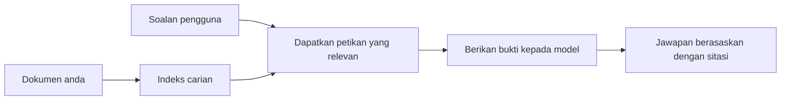

# Ajar AI Menjawab Soalan Berdasarkan Dokumen Anda:
## Siri 1: RAG, Azure vs Alternatif Sumber Terbuka, dan Bila Penalaan Halus Masuk Akal

> Artikel pertama dalam siri 2026 yang mengimbas kembali tutorial QA dokumen Azure AI Search + Azure OpenAI saya dari 2023.

## 1. Pengenalan - Mengimbas Kembali Tutorial RAG Sebelumnya

Pada 2023, saya telah bekerja pada sepasang tutorial tentang mengajar ChatGPT menjawab soalan daripada dokumen PDF menggunakan Azure AI Search dan Azure OpenAI. Saya menulis [versi LangChain](https://techcommunity.microsoft.com/blog/educatordeveloperblog/teach-chatgpt-to-answer-questions-using-azure-ai-search--azure-openai-lang-chain/3969713), dan saya juga turut menulis bersama versi [Semantic Kernel](https://techcommunity.microsoft.com/blog/educatordeveloperblog/teach-chatgpt-to-answer-questions-using-azure-ai-search--azure-openai-semantic-k/3985395) dengan [Lee Stott](https://developer.microsoft.com/en-us/advocates/lee-stott), seorang Pengurus Utama Advokat Awan di Microsoft. Pada masa itu, idea "ChatGPT pada data anda" masih terasa baru bagi ramai pembangun. Tutorial tersebut menggunakan Azure Blob Storage, Azure AI Search, Azure OpenAI, LangChain, Semantic Kernel, dan pengambilan vektor gaya FAISS untuk menjawab soalan daripada fail PDF.

Artikel terdahulu itu memberi tumpuan pada aliran kerja yang ringkas tetapi penting: memuat naik dokumen, mengindeksnya, mendapatkan kandungan yang relevan, dan meminta model menjawab berdasarkan kandungan itu.

Pada 2026, ekosistem RAG telah berkembang dengan ketara. Azure AI Search kini menyokong corak pengambilan vektor moden dan hibrid, Azure OpenAI adalah sebahagian daripada ekosistem Model Microsoft Foundry yang lebih luas, dan API v1 yang lebih baru boleh menggunakan klien OpenAI standard tanpa memerlukan perubahan `api-version` bulanan. Pada masa yang sama, pilihan sumber terbuka seperti LangGraph, LlamaIndex, Haystack, Qdrant, Milvus, Weaviate, Chroma, Ollama, dan vLLM telah menjadi pilihan praktikal untuk sistem RAG sebenar.

Itulah sebabnya saya mahu mengimbas kembali topik ini. Soalannya bukan lagi hanya "Bagaimana saya membina RAG?" Kini terdapat banyak cara untuk membinanya, dan soalan yang lebih penting ialah "Senibina mana yang harus saya pilih untuk situasi saya?"

Tetapi masalah teras tidak berubah.

Model AI tidak secara automatik tahu dokumen anda. Untuk membina sistem soal jawab dokumen yang berguna, anda masih memerlukan pengambilan yang boleh dipercayai, pengesahan, penilaian, dan aliran kerja operasi.

Artikel ini bukan tutorial "bual dengan PDF" hujung ke hujung yang lain. Saya mahu memulakan siri yang dikemas kini ini dengan soalan yang kini saya lebih peduli: bila anda harus memilih senibina Azure yang diuruskan, bila anda harus memilih tumpukan RAG sumber terbuka, dan bila penalaan halus sebenarnya masuk akal?

Ini adalah artikel pertama dalam siri tentang membina sistem AI berasaskan dokumen. Dalam bahagian pertama ini, kita akan menumpukan pada keputusan senibina: mengapa RAG penting, bila perkhidmatan diuruskan berasaskan Azure berguna, bila alternatif sumber terbuka masuk akal, dan di mana penalaan halus sesuai.

Setelah membina dan mengimbas kembali sistem QA dokumen, saya menjadi kurang berminat dengan alat mana yang kelihatan terbaik dalam demo dan lebih berminat dengan senibina mana yang dapat bertahan dengan pengguna sebenar, dokumen yang berubah, keizinan, kegagalan, dan penyelenggaraan.

## 2. Mengapa AI Anda Memerlukan Sistem Carian

Model bahasa besar dilatih pada data umum dan berlesen yang luas. Mereka mungkin tahu banyak tentang topik umum, tetapi mereka tidak secara automatik tahu PDF peribadi anda, dasar dalaman, prosedur perusahaan, arkib penyelidikan, bahan kelas, nota sokongan pelanggan, atau dokumentasi yang dikemas kini baru-baru ini.

Cara mudah untuk memikirkan RAG adalah ini: bukannya mengharapkan model mengingati setiap dokumen, kami memberinya sistem carian. Apabila pengguna mengemukakan soalan, sistem terlebih dahulu mencari maklumat yang paling relevan, kemudian memberikan maklumat tersebut kepada model sebagai konteks.

Ini penting kerana banyak sumber pengetahuan dunia sebenar adalah peribadi, sentiasa berubah, sensitif kepada kebenaran, disimpan merentasi pelbagai sistem, ditulis dalam banyak format, dan terlalu besar untuk ditampal terus ke dalam arahan.

Sebagai contoh, jika satu sekolah, syarikat, atau pasukan penyelidikan mempunyai 10,000 dokumen dalaman, model tidak boleh menjawab daripada dokumen-dokumen tersebut dengan boleh dipercayai kecuali sistem mendapatkan bahagian yang betul pada masa yang betul.

Ini secara semula jadi membawa kepada soalan biasa:

Mengapa tidak hanya melakukan penalaan halus model?

Penalaan halus boleh berguna, tetapi biasanya bukan alat pertama yang betul untuk pengetahuan dokumen. Jika pengetahuan berubah kerap, jika sitasi penting, atau jika kebenaran akses penting, RAG biasanya titik permulaan yang lebih baik. Penalaan halus lebih sesuai untuk mengajar tingkah laku, gaya, format output, dan corak tugas.

## 3. Senibina RAG dalam Amalan

Bayangkan anda membina pembantu AI untuk sekolah. Pembantu itu perlu menjawab soalan daripada PDF dasar, panduan kursus, halaman FAQ dalaman, dan pengumuman yang baru dikemas kini.

Jika seorang pelajar bertanya, "Bolehkah saya menggunakan AI generatif untuk tugasan akhir saya?", sistem tidak harus menjawab daripada memori umum model. Ia harus terlebih dahulu mencari dasar sekolah yang relevan, mendapatkan bahagian tentang penggunaan AI, dan kemudian meminta model menjawab menggunakan bukti tersebut.

Itulah RAG dalam amalan.

Pada peringkat tinggi, anda boleh memikirkan alirannya seperti ini:

Perincian boleh menjadi lebih sofistikated, tetapi idea asasnya ringkas: model tidak menjawab sendirian. Ia menjawab dengan bukti yang diperoleh.

Pertama, dokumen diambil dari sistem simpanan seperti Azure Blob Storage, SharePoint, GitHub, atau CMS dalaman. Kemudian sistem memparsinya ke dalam teks sambil mengekalkan struktur berguna seperti heading, nombor halaman, jadual, bahagian, dan lokasi sumber.

Seterusnya, kandungan dipecahkan kepada cebisan. Langkah ini kedengaran mudah, tetapi ia adalah salah satu bahagian paling penting dalam sistem. Jika cebisan terlalu kecil, ia mungkin hilang konteks sekeliling. Jika cebisan terlalu besar, ia mungkin termasuk maklumat yang tidak berkaitan dan menjadikan pengambilan kurang tepat.

Selepas pemecahan cebisan, sistem mencipta embeddings dan menyimpannya dalam indeks yang boleh dicari bersama teks asal dan metadata seperti nama fail, nombor halaman, kebenaran, versi dokumen, dan URL sumber.

Apabila pengguna mengemukakan soalan, sistem mengambil cebisan calon menggunakan carian kata kunci, carian vektor, atau carian hibrid. Penilai semula kemudian boleh menyusun semula cebisan tersebut supaya bukti yang paling berguna ditempatkan hampir ke atas.

Akhirnya, model menerima soalan dan bukti yang diperoleh. Jawapan harus berasaskan bukti tersebut dan memulangkan sitasi supaya pengguna boleh memeriksa sumber.

Perkara penting ialah RAG bukan hanya "memasukkan PDF ke dalam pangkalan data vektor." Kualiti jawapan bergantung pada keseluruhan aliran kerja: parsing, pemecahan cebisan, pengambilan, penilaian semula, arahan, sitasi, dan penilaian.

Inilah sebabnya struktur dokumen penting. Dalam PDF, heading, jadual, nota kaki, atau sempadan halaman boleh mengubah maksud sesuatu petikan. Di Azure, kemahiran Susun Atur Dokumen menggunakan keupayaan susun atur Azure Document Intelligence untuk menghasilkan output yang sedar struktur, yang boleh meningkatkan kualiti pemecahan cebisan dan pengambilan untuk sistem RAG.

## 4. Apa Yang Berubah Sejak 2023?

Tutorial 2023 adalah titik permulaan yang baik untuk masanya:

- Azure Blob Storage menyimpan fail PDF.
- Azure AI Search mengindeks kandungan.
- LangChain menghubungkan pengambilan dengan Azure OpenAI.
- FAISS berfungsi sebagai storan vektor tempatan yang mudah.
- Contoh menggunakan `gpt-35-turbo` dan `text-embedding-ada-002`.

Pada 2026, versi moden harus mencerminkan beberapa perubahan.

Pertama, pengambilan telah matang. Pada 2023, banyak demo menggunakan carian kesamaan vektor yang mudah. Hari ini, pengambilan hibrid sering menjadi titik permulaan lalai untuk QA dokumen yang serius. Azure AI Search menyokong carian hibrid dengan menggabungkan kata kunci dan pertanyaan vektor dalam satu permintaan dan menggabungkan keputusan dengan Reciprocal Rank Fusion. Penilai semantik kemudian boleh menyusun semula sisi teks keputusan penuh, vektor, dan hibrid.

Kedua, pengambilan kandungan lebih sofistikated. Daripada membahagi manual setiap dokumen dengan kod aplikasi, Azure AI Search menyokong vektorisasi terintegrasi untuk pemecahan cebisan, penciptaan embedding, dan vektorisasi masa pertanyaan. Untuk PDF dan beban kerja dokumen berat, kemahiran Susun Atur Dokumen boleh mengekalkan lebih banyak struktur berbanding cebisan saiz tetap.

Ketiga, orkestrasi menjadi lebih penting. Bahagian sukar selalunya bukanlah panggilan API LLM itu sendiri. Bahagian sukar adalah mengendalikan kegagalan, cuba semula, pengambilan lapuk, kualiti cebisan, aliran kerja jangka panjang, semakan manusia, dan penilaian pada skala besar. Di sinilah alat berorientasikan aliran kerja seperti LangGraph, aliran kerja LlamaIndex, saluran Haystack, dan alat penilaian serta observabiliti tahap platform menjadi lebih relevan berbanding rantaian linear tunggal.

Keempat, penilaian bukan lagi pilihan. Demo boleh nampak mengagumkan dengan satu soalan. Sistem produksi memerlukan set ujian, pemeriksaan regresi, metrik pengambilan, pemeriksaan berasas, dan pemantauan. Tanpa penilaian, sukar untuk tahu sama ada sistem sedang bertambah baik atau hanya berubah.

## 5. Memilih Antara Tumpukan RAG Azure dan Sumber Terbuka

Saya tidak fikir soalan berguna adalah "Adakah Azure lebih baik daripada sumber terbuka?" atau "Adakah sumber terbuka lebih baik daripada Azure?"

Soalan berguna adalah: jenis sistem apa yang anda bina, siapa yang akan mengoperasikannya, apakah kekangan yang anda ada, dan mod kegagalan mana yang tidak boleh diterima?

Apabila saya mula membina contoh QA dokumen, saya kebanyakannya memikirkan sama ada pengambilan berfungsi. Bolehkah saya memuat naik PDF, mencarinya, dan menghasilkan jawapan? Itu titik permulaan yang munasabah.

Setelah melalui aliran kerja AI yang lebih realistik, penilaian saya berubah. Kini saya melihat empat perkara sebelum memilih tumpukan RAG:

- identiti dan kebenaran akses
- kualiti pengambilan
- kebolehpercayaan aliran kerja
- pemilikan operasi

Empat bidang ini memberitahu anda jauh lebih banyak daripada hanya penanda aras model.

Senibina berasaskan Azure biasanya masuk akal apabila integrasi perusahaan adalah bahagian sukar. Jika satu pasukan sudah bergantung pada Microsoft Entra ID, Microsoft 365, Azure Storage, rangkaian peribadi, RBAC, dan pemantauan Azure, Azure AI Search dan Azure OpenAI boleh mengurangkan banyak kerumitan operasi. Dalam persekitaran itu, Azure bukan hanya API model. Nilainya adalah sistem sekeliling: identiti, tadbir urus, carian yang diuruskan, integrasi keselamatan, sokongan dan operasi yang biasa.

Senibina sumber terbuka biasanya masuk akal apabila fleksibiliti adalah bahagian sukar. Jika pasukan memerlukan inferens tempatan, kebolehpindahan awan, saluran pengambilan khas, penilaian semula khusus, atau kawalan terus ke atas pangkalan data vektor dan lapisan perkhidmatan model, tumpukan sumber terbuka boleh menjadi pilihan lebih sesuai. Tukaran adalah pasukan memiliki lebih banyak kerja kebolehpercayaan: sandaran, penskalaan, latensi, migrasi, pemantauan, dan keselamatan.

Dalam praktik, banyak sistem AI produksi bukan semata-mata asli awan atau semata-mata sumber terbuka. Mereka sering sistem hibrid yang seimbangkan kesederhanaan operasi, kebolehpindahan, tadbir urus, dan fleksibiliti kejuruteraan.

Sebagai contoh, saya tidak akan terkejut melihat sistem menggunakan Azure OpenAI untuk akses model, LangGraph untuk orkestrasi aliran kerja, hosting Azure untuk penerapan, dan pangkalan data vektor sumber terbuka untuk keperluan pengambilan tertentu. Itu bukan ketidakkonsistenan senibina. Itu memilih tahap perkhidmatan diuruskan dan kawalan kejuruteraan yang betul untuk setiap bahagian sistem.

Saya suka senibina hibrid apabila platform diuruskan menyelesaikan masalah perusahaan penting, sementara komponen sumber terbuka memberi pasukan fleksibiliti di tempat ia benar-benar penting.

## 6. Panduan Keputusan Praktikal

Berikut adalah jadual keputusan yang saya akan gunakan dengan pasukan sebelum memilih tumpukan RAG:

| Kawasan Keputusan | Tumpukan Azure diuruskan lebih kuat apabila... | Tumpukan sumber terbuka lebih kuat apabila... |
| --- | --- | --- |
| Identiti dan akses | Entra ID, RBAC, identiti diuruskan, dan kebenaran perusahaan adalah pusat | pengesahan tersuai, identiti bukan-Microsoft, atau logik akses khusus aplikasi mendominasi |
| Operasi | pasukan mahu infrastruktur diuruskan, sokongan, SLA, dan penyertaan lebih mudah | pasukan boleh mengendalikan pangkalan data vektor, perkhidmatan model, sandaran, dan penskalaan |
| Pengambilan | carian hibrid, penarafan semantik, penapis, dan carian metadata memenuhi kebanyakan keperluan | pasukan memerlukan pengambilan tersuai, penilaian semula khusus, atau pengindeksan eksperimen |
| Kebolehpindahan | penjajaran ekosistem Azure boleh diterima atau diutamakan | mengelakkan penguncian awan adalah keperluan tegas |
| Inferens | tadbir urus Azure OpenAI, rangkaian, dan kawalan perusahaan penting | inferens tempatan, model tersuai, atau perkhidmatan sendiri diperlukan |
| Kos | mengurangkan usaha kejuruteraan dan operasi lebih penting daripada pengoptimuman infrastruktur | skala cukup besar untuk mengesahkan pengoptimuman infrastruktur yang teliti |
| Percubaan | kestabilan dan integrasi perusahaan lebih penting daripada kerap menukar komponen | pasukan sedang iterasi pantas pada agen, alat, memori, dan aliran pengambilan |

Peraturan praktikal saya mudah:

- Mula dengan Azure apabila integrasi perusahaan, keselamatan, dan kesederhanaan operasi adalah risiko utama.
- Mula dengan sumber terbuka apabila kebolehpindahan, pengubahsuaian, atau kawalan tempatan adalah risiko utama.
- Gunakan tumpukan hibrid apabila kedua-duanya benar.

Ini juga sebab saya tidak akan memulakan siri RAG 2026 dengan kod dahulu. Kod penting, tetapi pemilihan senibina datang sebelum pelaksanaan. Demo ringkas boleh menyembunyikan pilihan paling sukar. Sistem RAG yang baik menjadikan pilihan itu jelas.

## 7. Di Mana Penalaan Halus Sesuai

Penalaan halus sering disebut bersama RAG, tetapi saya fikir penting untuk memisahkan kedua-duanya.

RAG biasanya pilihan yang lebih baik apabila sistem memerlukan pengetahuan segar, peribadi, sensitif kebenaran, atau berasaskan sumber. Jika jawapan perlu memetik dokumen, mencerminkan kemas kini terbaru, atau menghormati peraturan akses khusus pengguna, pengambilan harus menjadi sebahagian daripada senibina.

Penalaan halus lebih berguna apabila pengetahuan bukan masalah utama. Ia boleh membantu apabila anda mahu model mengikuti format output tertentu, memadankan gaya respons domain khusus, melaksanakan tugas stabil dengan lebih konsisten, atau mengurangkan jumlah arahan yang diperlukan dalam setiap arahan.
Dalam amalan, kedua-duanya boleh berfungsi bersama. Pembantu sokongan mungkin menggunakan RAG untuk mendapatkan dasar terkini, manakala model yang telah dihaluskan belajar struktur dan nada jawapan yang disukai oleh syarikat.

Kesilapan adalah menganggap halus-laras sebagai pengganti untuk penyimpanan dokumen. Ia tidak menghilangkan keperluan mendapatkan semula apabila sistem perlu menjawab dari data segar, peribadi, atau sensitif kepada kebenaran.

## 8. Ke Mana Siri Ini Akan Pergi Seterusnya

Artikel ini adalah lapisan membuat keputusan. Sebelum menulis kod, saya mahu menjadikan pertukaran itu jelas: RAG vs halus-laras, Azure vs sumber terbuka, perkhidmatan terurus vs kawalan operasi.

Sebelum beralih ke pelaksanaan, saya mahu meninggalkan satu perkara di sini: dalam banyak sistem AI perusahaan, model hanya salah satu komponen. Kualiti pengambilan semula, orkestrasi, penilaian, kebenaran, dan kebolehpercayaan operasi sering kali yang menentukan sama ada sistem berjaya melepasi peringkat demo.

Dalam bahagian seterusnya siri ini, saya merancang untuk meneroka lebih mendalam sisi praktikal sistem AI berasaskan dokumen: bagaimana membina seni bina berasaskan Azure, bagaimana alternatif sumber terbuka dibandingkan dalam amalan, dan bagaimana menilai sama ada sistem RAG benar-benar berfungsi.

Saya mungkin mengubah susunan semasa siri ini berkembang, tetapi matlamat akan tetap sama: untuk bergerak melepasi demo mudah dan menunjukkan bagaimana berfikir tentang sistem RAG yang boleh diselenggara, dinilai, dan dioperasikan.

## 9. Rujukan dan Sumber

Tutorial asal:

- [Teach ChatGPT to Answer Questions: Using Azure AI Search & Azure OpenAI (Lang Chain)](https://techcommunity.microsoft.com/blog/educatordeveloperblog/teach-chatgpt-to-answer-questions-using-azure-ai-search--azure-openai-lang-chain/3969713)
- [Teach ChatGPT to Answer Questions: Using Azure AI Search & Azure OpenAI (Semantic Kernel)](https://techcommunity.microsoft.com/blog/educatordeveloperblog/teach-chatgpt-to-answer-questions-using-azure-ai-search--azure-openai-semantic-k/3985395)

Azure:

- [Azure AI Search REST API versions](https://learn.microsoft.com/en-us/rest/api/searchservice/search-service-api-versions)
- [Hybrid search in Azure AI Search](https://learn.microsoft.com/en-us/azure/search/hybrid-search-how-to-query)
- [Integrated vectorization in Azure AI Search](https://learn.microsoft.com/en-us/azure/search/vector-search-integrated-vectorization)
- [Document Layout skill in Azure AI Search](https://learn.microsoft.com/en-us/azure/search/cognitive-search-skill-document-intelligence-layout)
- [Chunk and vectorize by document layout](https://learn.microsoft.com/en-us/azure/search/search-how-to-semantic-chunking)
- [Semantic ranking in Azure AI Search](https://learn.microsoft.com/en-us/azure/search/semantic-search-overview)
- [Azure OpenAI / Microsoft Foundry API version lifecycle](https://learn.microsoft.com/en-us/azure/foundry/openai/api-version-lifecycle)
- [Foundry Models sold by Azure](https://learn.microsoft.com/en-us/azure/foundry/foundry-models/concepts/models-sold-directly-by-azure)
- [Microsoft Foundry fine-tuning considerations](https://learn.microsoft.com/en-us/azure/foundry/openai/concepts/fine-tuning-considerations)
- [Microsoft Foundry observability](https://learn.microsoft.com/en-us/azure/foundry/concepts/observability)
- [Run evaluations in Microsoft Foundry](https://learn.microsoft.com/en-us/azure/foundry/how-to/evaluate-generative-ai-app)

Sumber terbuka:

- [LangGraph documentation](https://docs.langchain.com/oss/python/langgraph/overview)
- [LlamaIndex documentation](https://developers.llamaindex.ai/python/framework/)
- [Haystack documentation](https://docs.haystack.deepset.ai/)
- [Qdrant documentation](https://qdrant.tech/documentation/overview/)
- [Milvus documentation](https://milvus.io/docs/overview.md)
- [Weaviate documentation](https://docs.weaviate.io/weaviate/current/)
- [Chroma documentation](https://docs.trychroma.com/docs/overview/introduction)
- [Ollama embeddings](https://docs.ollama.com/capabilities/embeddings)
- [vLLM OpenAI-compatible server](https://docs.vllm.ai/en/latest/serving/openai_compatible_server.html)
- [BGE embedding models](https://huggingface.co/BAAI/bge-large-en-v1.5)
- [E5 embedding models](https://huggingface.co/intfloat/e5-large-v2)
- [Instructor embedding models](https://huggingface.co/hkunlp/instructor-large)

---

<!-- CO-OP TRANSLATOR DISCLAIMER START -->
**Penafian**:
Dokumen ini telah diterjemahkan menggunakan perkhidmatan terjemahan AI [Co-op Translator](https://github.com/Azure/co-op-translator). Walaupun kami berusaha untuk ketepatan, sila ambil maklum bahawa terjemahan automatik mungkin mengandungi kesilapan atau ketidaktepatan. Dokumen asal dalam bahasa asalnya harus dianggap sebagai sumber yang sahih. Untuk maklumat penting, terjemahan oleh manusia profesional adalah disyorkan. Kami tidak bertanggungjawab terhadap sebarang salah faham atau salah tafsir yang timbul daripada penggunaan terjemahan ini.
<!-- CO-OP TRANSLATOR DISCLAIMER END -->