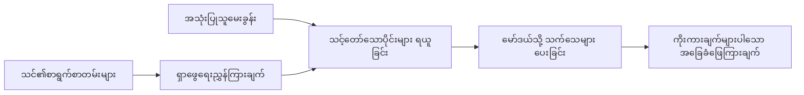

# မင်းရဲ့စာရွက်စာတမ်းတွေအပေါ် မူတည်ပြီး AI ကို မေးခွန်းဖြေခိုင်းခြင်း သင်ကြားခြင်း:
## စီးရီး ၁: RAG, Azure နှင့် Open-Source အစားထိုးတွေ၊ နှင့် Fine-Tuning အကျိုးရှိမှု

> ၂၀၂၃ တွင် ကျွန်တော် ရေးသားခဲ့သော Azure AI Search + Azure OpenAI စာရွက်စာတမ်း QA သင်ခန်းစာများကို ပြန်လည်သုံးသပ်သည့် ၂၀၂၆ စီးရီးသုံးပုဒ်တစ်ပုဒ်။

စီးရီးလမ်းညွှန်: [Repository home](../README.md) | နောက်တစ်ခု: [စီးရီး ၂ - End to End ပြီး ပြည်တွင်း Open-Source RAG စနစ် တည်ဆောက်ခြင်း](./series-2-open-source-rag-end-to-end.md)

## ၁. မိတ်ဆက် - ယခင် RAG သင်ခန်းစာ ပြန်လည်သုံးသပ်ခြင်း

၂၀၂၃ တွင် ကျွန်တော်သည် Azure AI Search နှင့် Azure OpenAI အသုံးပြု၍ PDF စာရွက်စာတမ်းများမှ မေးခွန်းများကိုဖြေဖို့ ChatGPT ကို သင်ကြားပေးသည့် သင်ခန်းစာ နှစ်ခုကိုလုပ်ခဲ့သည်။ ကျွန်တော်က [LangChain ဗားရှင်း](https://techcommunity.microsoft.com/blog/educatordeveloperblog/teach-chatgpt-to-answer-questions-using-azure-ai-search--azure-openai-lang-chain/3969713) ကိုရေးခဲ့ပြီး [Lee Stott](https://developer.microsoft.com/en-us/advocates/lee-stott) (Microsoft ၏ Principal Cloud Advocate Manager) နှင့် အတူ [Semantic Kernel ဗားရှင်း](https://techcommunity.microsoft.com/blog/educatordeveloperblog/teach-chatgpt-to-answer-questions-using-azure-ai-search--azure-openai-semantic-k/3985395) ကို ပူးတွဲရေးသားခဲ့သည်။ ထိုအချိန်တွင် "ChatGPT ကို မင်းဒေတာပေါ်မှာ အသုံးပြုခြင်း" ဆိုသည်မှာ Developer များအတွက် အသစ်သတိပေးမှုဖြစ်ခဲ့သည်။ သင်ခန်းစာများတွင် Azure Blob Storage, Azure AI Search, Azure OpenAI, LangChain, Semantic Kernel, FAISS-style vector retrieval များကို အသုံးပြုကာ PDF များမှမေးခွန်းများကို ဖြေခဲ့သည်။

ထိုယခင် ဆောင်းပါးသည် ရိုးရှင်းသော်လည်း အရေးကြီးသော workflow တစ်ခုကို အာရုံစိုက်ခဲ့သည် - စာရွက်စာတမ်းများကို upload လုပ်၊ index လုပ်၊ သက်ဆိုင်ရာ အချက်အလက် ရွာထုတ်ကာ မော်ဒယ်ထံ မေးခွန်းထုတ်မေးခြင်း။

၂၀၂၆ တွင် RAG စနစ် ecosystem သည် အလွန်ဖွံ့ဖြိုးပြောင်းလဲလာပြီး Azure AI Search သည် မော်ဒန် vector နှင့် hybrid retrieval နည်းလမ်းများကို ထောက်ပံ့ပေးသည်၊ Azure OpenAI သည် Microsoft Foundry Models အဖွဲ့အစည်းတစ်စိတ်တစ်ပိုင်းဖြစ်ပြီး v1 API အသစ်သည် သက်သောင့်သက်သာ OpenAI client အသုံးပြုနိုင်ပြီး လစဉ် `api-version` ပြောင်းလဲမှုမလိုအပ်တော့ပေ။ တစ်ပြိုင်နက်တွင် LangGraph, LlamaIndex, Haystack, Qdrant, Milvus, Weaviate, Chroma, Ollama, vLLM ကဲ့သို့သော open-source ရွေးချယ်မှုများသည် RAG စနစ်များအတွက် လက်တွေ့အသုံးပြုနိုင်လာပြီးဖြစ်သည်။

ဒါကြောင့် ဒီหัวข้อကို ပြန်လည်ဆွေးနွေးချင်ခဲ့တယ်။ မေးခွန်းကတော့ “RAG ဘယ်လိုတည်ဆောက်မလဲ” မဟုတ်တော့ပါဘူး။ အခုတော့စနစ်တည်ဆောက်ဖို့ နည်းလမ်းများစွာရှိပြီး အရေးကြီးဆုံး မေးခွန်းက “ကျွန်တော့်အခြေအနေနှင့် သင့်တော်တဲ့ architecture ဘယ်ဟာလဲ?” ဖြစ်သွားပါတယ်။

သို့သော် အဓိကပြဿနာ မပြောင်းလဲသေးပါဘူး။

AI မော်ဒယ်သည် မင်းစာရွက်စာတမ်းများကို ကိုယ်တိုင်မသိပါ။ အသုံးဝင်သော စာရွက်စာတမ်း မေးခွန်းဖြေစနစ်တစ်ရပ်တည်ဆောက်ဖို့အတွက် သေချာကျိုးကြောင်းဆီလျော်မှု၊ အခြေခံမှု၊ သုံးသပ်ခြင်းနှင့် လည်ပတ်မှု workflows အား လိုအပ်နေဆဲ ဖြစ်နေသည်။

ဤဆောင်းပါးသည် နောက်ဆုံးထိ “PDF ဖြင့် chat လုပ်ခြင်း” သင်ခန်းစာတစ်ခု မဟုတ်ပါ။ ဒီအပ်ဒိတ်ထားသော စီးရီးကို စ သောအခါတွင် ကျွန်တော် အခုအချိန်ပိုင်းစိတ်ဝင်စားတဲ့ မေးခွန်းသည် - managed Azure architecture ရွေးသင့်မှုဘယ်အခါ၊ open-source RAG stack တစ်ခု ရွေးသင့်မှုဘယ်အခါ၊ fine-tuning လုပ်ခြင်း ဘယ်အချိန်မမှန် စသည့် မေးခွန်းများဖြစ်သည်။

ဤဆောင်းပါး သည် စာရွက်စာတမ်းကို အခြေခံသည့် AI စနစ်များ တည်ဆောက်ခြင်းဆိုင်ရာ စီးရီး တစ်စိတ်တစ်ပိုင်း ပထမပုဒ်ဖြစ်သည်။ ပထမပိုင်းတွင် architecture ဆုံးဖြတ်ချက်များကို အာရုံစိုက်ပြီး RAG ၏ အရေးကြီးမှု၊ Azure managed services အသုံးဝင်ခြင်း၊ open-source အစားထိုးများ၏ အကျိုးရှိမှု၊ fine-tuning ၏ တည်နေရာတို့ သုံးသပ်သည်။

စာရွက်စာတမ်း QA စနစ်များ တည်ဆောက်ပြီး ပြန်လည်သုံးသပ်ချိန်တွင်၊ Demo ထဲတွင် ကောင်းပြတာမဟုတ်ဘဲ ရုပ်သိမ်းရေး လုပ်ငန်းများ၊ စာရွက်စာတမ်း ပြောင်းလဲမှုများ၊ ခွင့်ပြုချက်များ၊ မတည်မငြိမ်မှုများနှင့် ပြုပြင်ထိန်းသိမ်းမှုများကို ကင်းကြောင့်နေနိုင်သော architecture ရဲ့ အရေးပါမှုကို ပိုစိတ်ဝင်စားလာသည်။

## ၂. မင်း AI ကို ရှာဖွေရေး စနစ် လိုအပ်သည့် အကြောင်းရင်း

အကြီးစားဘာသာစကားမော်ဒယ်များကို ကမ္ဘာလုံးဆိုင်ရာ ပြည်သူ့နှင့်လိုင်စင်ရရှိသော ဒေတာအရပ်များပေါ်မှာ သင်ကြားထားသည်။ အထွေထွေပညာရပ်များအကြောင်း အများကြီးသိနိုင်သော်လည်း မင်းရဲ့ ပုဂ္ဂလိက PDF များ၊ အတွင်းရေးအမိန့်အချက်များ၊ စီးပွားရေးလုပ်ငန်းစဉ်များ, သုတေသနစာတမ်းများ, အတန်းစာအုပ်များ၊ ဖောက်သည်ထောက်ခံရေး မှတ်စုများ၊ သို့မဟုတ် လက်ရှိ ပြောင်းလဲထားသော စာရွက်စာတမ်းများကို ကိုယ်တိုင်မသိပါ။

RAG ကို ရိုးရှင်းစွာ အတွေးထုတ်မယ်ဆိုရင် - မြော်လင့်ချက်ရှိတာက မော်ဒယ်က စာရွက်စာတမ်းအားလုံးကို အမှတ်မစဉ်ဖြတ်မှတ်မထားဘဲ ရှာဖွေရေး စနစ်တစ်ခု ထားပေးခြင်းဖြစ်သည်။ အသုံးပြုသူမေးလိုက်သည့်အခါ၊ စနစ်သည် သက်ဆိုင်ရာ အချက်အလက် အစိတ်အပိုင်းများကို ရှာဖွေပြီး ထိုအချက်အလက်များကို မော်ဒယ်ထံ အကြောင်းအရာအဖြစ် ပေးသည်။

ဒီဟာ အရေးကြီးတာက အမှန်တကယ်သော သိချက်များမှာ ပုဂ္ဂလိက၊ မပြောင်းလဲမှုမရှိဘဲ မီဒီယာပြောင်းတတ်၊ ခွင့်ပြုချက်ဆိုင်ရာ ဆိုက်စ်ရှိပြီး၊ စနစ်များ မတူညီစွာသိုလှောင်ပြီး၊ ဖော်ပြချက်များ မျိုးစုံဖြစ်ပြီး၊ တိုက်ရိုက် prompt ထဲ ထည့်ပြီး မဖြေနိုင်လောက်အောင် ကြီးလွန်းတာတွေ ဖြစ်မယ်။

ဥပမာအားဖြင့် ကျောင်း၊ ကုမ္ပဏီ သို့မဟုတ် သုတေသနအဖွဲ့ တစ်ခုတွင် များစွာသော အတွင်းရေးစာရွက်စာတမ်း ၁၀,၀၀၀ ကျော်ရှိပါက မော်ဒယ်သည် ထိုစာရွက်စာတမ်းများမှ တိကျစွာ အဖြေမပေးနိုင်ပါဘူး၊ စနစ်သည် သင့်တော်သော အစိတ်အပိုင်းများကို စနစ်တကျ ရှာဖွေနိုင်လို့သာဖြစ်နိုင်သည်။

ဒါကြောင့် ပုံမှန်မေးခွန်းတစ်ခု ထွက်ပေါ်လာသည် -

ဘာကြောင့် မော်ဒယ်ကို fine-tune လုပ်တာ မလုပ်ဘူးလဲ?

Fine-tuning သည် အသုံးဝင်နိုင်သော်လည်း အများအားဖြင့် စာရွက်စာတမ်း သိချက်အတွက် မူလကိရိယာ မဟုတ်ပါ။ သိချက်များအမြဲ ပြောင်းလဲသည်ဆိုလျှင်၊ ကိုးကားချက်များ ဦးစားပေးရင်၊ ခွင့်ပြုချက်များ အရေးပါလျှင် RAG သည် ယုံကြည်စိတ်ချစရာ မြင်သာတဲ့ နေရာ ဖြစ်သည်။ Fine-tuning ကို အပြုအမူ၊ စတိုင်၊ အထွက် ပုံစံနှင့် လုပ်ငန်းစဉ်များ သင်ကြားပေးရန် ပိုသင့်တော်သည်။

## ၃. RAG Architecture ကို လုပ်ရသော အချိန်

ကျောင်းအတွက် AI အကူအညီသူ တည်ဆောက်နေတယ်ဆိုတာ စိတ်ကူးပေးပါ။ အကူအညီသူသည် မေးခွန်းများကို policy PDF များ၊ သင်တန်းလမ်းညွှန်များ၊ အတွင်းရေး အဖြေများ စာမျက်နှာများ နှင့် လတ်တလော ထွက်ရှိလာသော ကြေညာချက်များမှ ဖြေဆိုရမည်။

ကျောင်းသားတစ်ဦးက "ကျွန်တော်/ကျွန်မ ကျောင်းနဲ့အမျိုးမျိုး Generative AI ကို နောက်ဆုံးပညာရေးမူကြမ်းတင်ခြင်းအတွက် အသုံးပြုနိုင်ပါသလား?" ဟု မေးပါက၊ စနစ်သည် မော်ဒယ်၏ အထွေထွေမှတ်ဉာဏ်မှ မဖြေသင့်ပါ။ ဂျယားလျစ်ထားသော ကျောင်းမူဝါဒကို ရှာဖွေပြီး AI အသုံးပြုမှုအပိုင်းကို ဆွဲထုတ်ကာ စနစ်သည် အထောက်အထားအဖြစ် မော်ဒယ်ထံ စုံစမ်းမေးမြန်းသင့်သည်။

ဒါက RAG ကို လက်တွေ့အသုံးချထားတာပါ။

အမြင်အဖြစ် flow ကို အောက်ပါကဲ့သို့ စဉ်းစားနိုင်ပါသည် -

အသေးစိတ်များ ပို၍ ရှင်းလင်းပြီး မိုက်မဲလာနိုင်သော်လည်း အခြေခံအယူအဆမှာ ရိုးရှင်းသည် - မော်ဒယ်သည် ကိုယ်တိုင်ဖြေဆိုခြင်း မဟုတ်ဘဲ ရှာဖွေပြီး ထုတ်ပြန်ခံစားချက်ဖြင့်ဖြေဆိုသည်။

ပထမဦးစွာ စာရွက်စာတမ်းများကို Azure Blob Storage, SharePoint, GitHub သို့မဟုတ် အတွင်းရေး CMS ကဲ့သို့ နေရာများမှ သိမ်းဆည်းပြီး လက်ခံသည်။ ထိုနောက် စနစ်သည် ပုံတူအကြောင်းအရာများကို ဌာနခွဲများ၊ စာမျက်နှာနံပါတ်များ၊ ဇယားများ၊ ပုဒ်ခင်းများ နှင့် အရင်းအမြစ်နေရာများကဲ့သို့ အသုံးဝင်သောဖွဲ့စည်းမှုကို ထိန်းသိမ်းကာ စာသားအဖြစ် ခွဲထုတ်သည်။

နောက်ပိုင်းတွင် အကြောင်းအရာကို အစိတ်အပိုင်းများသို့ ခွဲခြားသည်။ ဤအဆင့်သည် ရိုးရှင်းသော်လည်း စနစ်အတွက် အရေးကြီးဆုံး အပိုင်းတစ်ခုဖြစ်သည်။ အစိတ်အပိုင်းက မ too သေးလွန်းလျှင် ပတ်ဝန်းကျင်အကြောင်းအရာကို ပျောက်သွားနိုင်သည်။ အစိတ်အပိုင်းက မ too ကြီးလွန်းလျှင် ဆက်စပ်မည့် အသေးစိတ်မပါသော အချက်အလက်များ ပါဝင်၊ ရှာဖွေရေး တိကျမှု လျော့နည်းစေသည်။

ခွဲခြားပြီးနောက် စနစ်သည် embeddings များ ပြုလုပ်ကာ မူလစာသားနှင့် ဖိုင်နာမည်၊ စာမျက်နှာနံပါတ်၊ ခွင့်ပြုချက်များ၊ စာရွက်စာတမ်း ဗားရှင်းနှင့် အရင်းအမြစ် URL ကဲ့သို့သော metadata များနှင့်တစ်ပြိုင်နက် searchable index တွင် သိမ်းဆည်းသည်။

အသုံးပြုသူမေးခွန်းမေးသည့်အခါ၊ système သည် keyword search, vector search သို့မဟုတ် hybrid search နည်းလမ်းများဖြင့် candidate chunks များ ရှာဖွေသည်။ ရာနှုန်းပြန်တမ်းတင်သူ (reranker) သည် ထို chunks များအား အထိရောက်ဆုံး အထောက်အထားများ ဦးစွာ ပေးသည်အထိ စီစဉ်တင်ပြနိုင်သည်။

နောက်ဆုံးတွင် မော်ဒယ်သည် မေးခွန်းနှင့် ရှာဖွေတွေ့ရှိသော အထောက်အထားများကို လက်ခံသည်။ အဖြေသည် ထိုအထောက်အထားများအပေါ် အခြေခံပြီး ထုတ်ပြန်ရမည်ဖြစ်ပြီး အသုံးပြုသူသည် စာရင်းကို ထပ်မံ စစ်ဆေးနိုင်ရန် ကိုးကားချက်များပါဝင်ရမည်။

အရေးကြီးတာက RAG သည် "PDF များကို vector ဒေတာဘေ့စ်ထဲထည့်ခြင်း" သာ မဟုတ်ပါ။ အဖြေ၏ အရည်အသွေးသည် လုံးဝ workflow - ဖော်ပြချက်၊ ခွဲခြားမှု၊ ရှာဖွေမှု၊ ပြန်စီမှု၊ prompt ပေးခြင်း၊ ကိုးကားချက်ပြခြင်း၊ သုံးသပ်မှု အားလုံးပေါ်မူတည်သည်။

ဒါကြောင့် စာရွက်စာတမ်း ဖွဲ့စည်းမှုသည် အရေးကြီးသည်။ PDF တွင် ခေါင်းစဉ်၊ ဇယား၊ ငြိမ်းချမ်းရေးမှတ်စု သို့မဟုတ် စာမျက်နှာနယ်နိမိတ်သည် ရေးသားချက် အဓိပ္ပာယ် ပြောင်းလဲစေတတ်သည်။ Azure တွင် Document Layout skill သည် Azure Document Intelligence layout နည်းပညာ ကို အသုံးပြုကာ ဖွဲ့စည်းမှုကို သိရှိသော အရွက်စာထုတ်လွှင့်မှုဖြစ်စေသည်၊ ၎င်းသည် RAG စနစ်များအတွက် ခွဲခြားခြင်းနှင့် ရှာဖွေရေး အရည်အသွေး မြင့်စေသည်။

## ၄. ၂၀၂၃ နောက်ပိုင်း ဘာတွေ ပြောင်းလဲသွားသလဲ?

၂၀၂၃ သင်ခန်းစာသည် အချိန်ထိုင်းအတွက် ကောင်းမွန်သော စတင်ချက်ဖြစ်ခဲ့သည် -

- Azure Blob Storage သည် PDF ဖိုင်များ သိမ်းဆည်းသည်။
- Azure AI Search သည် အကြောင်းအရာကို index လုပ်သည်။
- LangChain က Azure OpenAI နှင့် ရှာဖွေရေးကို ချိတ်ဆက်သည်။
- FAISS သည် ရိုးရှင်းသော ဒေသခံ vector store အဖြစ် လုပ်ဆောင်သည်။
- ဥပမာအတွက် `gpt-35-turbo` နှင့် `text-embedding-ada-002` ကို အသုံးပြုသည်။

၂၀၂၆ တွင် မွန်မိုက် version သည် အောက်ပါ ပြောင်းလဲမှုများကို ဖော်ပြသင့်သည်။

ပထမ, ရှာဖွေမှုသည် နွယ်မြင့်ပြီ။ ၂၀၂၃ တွင် များစွာသော Demo များသည် ရိုးရှင်းသော vector similarity ရှာဖွေမှုကို အသုံးပြုပြီးဖြစ်သည်။ ယနေ့တွင် hybrid ရှာဖွေမှုသည် အစမှ စတင်သော အရေးကြီး စနစ်ဖြစ်လာပြီး Document QA တွင် ဦးစားပေးလေ့ရှိသည်။ Azure AI Search သည် keyword နှင့် vector queries များကို တစ်ခုတည်းသော request တခုတွင် ပေါင်းစပ်စီမံမှုဖြင့် hybrid search ကို ထောက်ပံ့သည်။ Reciprocal Rank Fusion တတ်နိုင်သည်။ Semantic ranker သည် text အပေါ်ရှိ full-text, vector၊ hybrid ရလဒ်များကို ပြန်လည်စီစဉ်ပေးနိုင်သည်။

ဒုတိယ, PDF များနှင့် စာရွက်စာတမ်းများ ပြားပြားများ သုံးစွဲမှုအတွက်၊ စနစ်သိုလှောင်ခြင်းပိုင်း ပိုကျွမ်းကျင်ပြီး Azure AI Search သည် chunking၊ embedding နှင့် query-time vectorization အတွက် စုစည်း vectorization ကို ထောက်ပံ့ပေးသည်။ Document Layout skill သည် fixed-size chunks များထက် ပို၍ ဖွဲ့စည်းမှု ထိန်းသိမ်းနိုင်စွမ်းရှိသည်။

တတိယ, စည်းမျဉ်းချုပ်မှုသည် ပိုအရေးကြီးလာသည်။ အခက်အခဲသည် LLM API ကိုခေါ်တဲ့အခါ မဟုတ်ပါ။ အခက်အခဲဖြစ်တဲ့အရာမှာ ချို့ယွင်းမှုများကောင်းမွန်စွာ ကိုင်တွယ်ခြင်း၊ ပြန်ကြိုးစားမှုများ၊ ယေဘူယျ ရှာဖွေရေးဟောင်းများ၊ chunk အရည်အသွေး၊ ရေရှည်လုပ်ဆောင်မှုများ၊ လူ့သုံးသပ်မှု၊ နဲ့ စနစ်သုံးသပ်မှုများပါပါသည်။ ဒီမှာ LangGraph, LlamaIndex workflow, Haystack pipeline များ နဲ့ platform စတိုင် evaluation အား စနစ်မြောက် လုပ်ဆောင်မှုများသည် တစ်စုတစ်စည်းအဖြစ် linear chain ထက် ပိုက်ဆံကုန်ကျသက်သာပြီး အကျိုးကျေးဇူးရှိသည်။

စတုတ္ထ, သုံးသပ်မှုသည် မဖြစ်မနေလိုအပ်သည်။ Demo က တစ်မေးခွန်းတည်းနဲ့ ထင်ရှားနိုင်သော်လည်း ထုတ်လုပ်မှုစနစ်ကတော့ စမ်းသပ်ချက်များ၊ regression စစ်ဆေးမှုများ၊ ရှာဖွေရေး မီတာများ၊ ပြည့်မှီမှု စစ်ဆေးမှုများ၊ စောင့်ကြည့်မှုများ လိုအပ်သည်။ သုံးသပ်မှု မရှိလျှင် စနစ်သည် တိုးတက်နေတယ်လား၊ ရှုပ်ထွေးနေတယ်လား သို့မဟုတ် ပြောင်းလဲနေတယ်လား သိသင့်သည်။

## ၅. Azure နှင့် Open-Source RAG Stack များ အကြား ရွေးချယ်ခြင်း

ကျွန်တော်ထင်တာက အသုံးဝင်မေးခွန်းမှာ "Azure က open-source ထက် ပိုကောင်းလား?" သို့မဟုတ် "Open-source က Azure ထက် ပိုကောင်းလား?" မဟုတ်ပါဘူး။

အရေးကြီးဆုံး မေးခွန်းမှာ က ဘယ်လိုစနစ်တည်ဆောက်နေပါသလဲ၊ ဘယ်သူထမ်းဆောင်မှာလဲ၊ ဘယ်လိုကန့်သတ်ချက်များရှိပြီး ဘယ်အမှားဖြစ်နိုင်မှု မလက်ခံနိုင်ပါဘူးလဲ ဆိုတာပါ။

စာရွက်စာတမ်း QA ကို လုပ်စသောအခါ များသောအားဖြင့် ရှာဖွေရေး လုပ်ဆောင်နိုင်မှုကို အဓိကစိစစ်ရဲတယ်။ PDF တွေကို upload လုပ်ပြီး ရှာဖွေနိုင်ပေမယ့်‌ တိကျတဲ့ အဖြေ ထုတ်ပေးနိုင်မလား ဆိုတာ အဓိကရာထူးတစ်ခုဖြစ်တယ်။

လျှောက်လည် AI workflow အတွေ့အကြုံများ ရရှိပြီးနောက် ကျွန်တော်၏ သုံးသပ်မှု ပြောင်းလဲသွားသည်။ အခုတော့ RAG stack ရွေးချယ်ခြင်းမပြုခင် အောက်ပါ လေးပိုင်းကို ကြည့်ကြ၊ သုံးသပ်ကြရသည်။

- နာမည်နှင့် ခွင့်ပြုချက်များ
- ရှာဖွေရေး အရည်အသွေး
- workflow အတည်ပြုပြည့်စုံမှု
- လုပ်ငန်းရှင်ချက်(Operational ownership)

ဤလေးခု သည် မော်ဒယ် benchmark တစ်ခုထက် ပို၍ တိကျသော အချက်များပေးနိုင်ပါသည်။

Azure အခြေခံ architecture များသည် စီးပွားရေးဆိုင်ရာ ပေါင်းစပ်မှု အခက်အခဲများ ရှိသော အခါများတွင် သင့်တော်သည်။ အဖွဲ့သည် Microsoft Entra ID, Microsoft 365, Azure Storage, private networking, RBAC နှင့် Azure စောင့်ကြည့်မှုတို့ပေါ်မှာ အခြေခံပြီး အလုပ်လုပ်နေပါက Azure AI Search နှင့် Azure OpenAI သည် လုပ်ငန်းလုပ်ဆောင်ခြင်းပိုင်း စီမံခန့်ခွဲမှု ပြဿနာများ လျော့နည်းစေပါသည်။ ဤပတ်ဝန်းကျင်တွင် Azure သည် မော်ဒယ် API အထူးမဟုတ်ပဲ ထိုပတ်ဝန်းကျင်၊ နံပါတ်နှင့် စီမံခန့်ခွဲမှု, လုံခြုံမှု ပေါင်းစပ်ထားသော စနစ်တစ်ခုဖြစ်သည်။

Open-source architecture များသည် လိုက်လျောညီထွေမှု အခက်အခဲများအတွက် သင့်တော်သည်။ အဖွဲ့သည် ဒေသခံ inference, cloud အလွတ် portability, custom ရှာဖွေမှု pipeline, အထူးပြု reranking သို့မဟုတ် vector database နှင့် model-serving layer ကို တိုက်ရိုက်ထိန်းချုပ်ရန် လိုအပ်ပါက open-source stack သည် ပိုမိုသင့်တော်သည်။ ယင်းသည် စနစ်အား ယုံကြည်စိတ်ချစွာ ကြီးကြပ်ရ မည့်တာဝန်များကို ပိုမိုယူဆောင်ရသည်ဟု ဆိုလိုသည် - backup, scaling, latency, migration, စောင့်ကြည့်ရေး နှင့် လုံခြုံမှု။

လက်တွေ့တွင် ထုတ်လုပ်ရေး AI စနစ်များသည် တစ်ချက်တည်း Cloud-native သို့မဟုတ် Open-source ကန့်သတ်မှုမဟုတ်တော့ပါဘူး။ အစားထိုးမှု၊ portability၊ စီမံခန့်ခွဲမှု နှင့် အင်ဂျင်နီယာ လွတ်လပ်မှုကို ပြင်းပြင်းထန်ထန်လျှော့ချပေးသည့် Hybrid စနစ်များ ဖြစ်ကြသည်။

ဥပမာ - Azure OpenAI ကို မော်ဒယ် လက်ဝှမ်းဝင်ရောက်ခြင်းအတွက်၊ LangGraph ကို workflow စီမံခန့်ခွဲခြင်းအတွက်၊ Azure များကို deployment အတွက်၊ open-source vector database ကို သီးခြား ရှာဖွေရေး လုပ်ငန်းဆုံးဖြတ်ချက်အတွက် အသုံးပြုမှု။

ဒါဟာ architecture မဖြစ်နိုင်ခြင်း မဟုတ်ပါ။ ဒါဟာ စနစ်အစိတ်အပိုင်း တစ်ခုချင်းစီအတွက် Managed service နှင့် engineering control များကို ထူးခြားစွာ ရွေးချယ်ခြင်းဖြစ်သည်။

Managed platform သည် စီးပွားရေး ပြဿနာများကို ဖြေရှင်းပေးသည့်အချိန် open-source အစိတ်အပိုင်းများသည် အသုံးပြုသူသို့ လိုအပ်သည့် လွတ်လပ်မှုကို ပေးသည့်အခါ Hybrid architecture များကို ကြိုက်နှစ်သက်သည်။

## ၆. အလက်အတွေ့ ဆုံးဖြတ်ချက် လမ်းညွှန်

RAG stack ရွေးရန် မတိုင်မီ အသုံးပြုသူအဖွဲ့နှင့် အသုံးပြုမည့် ဆုံးဖြတ်ချက် caddy ကို အောက်ပါအတိုင်း အသုံးပြုနိုင်ပါသည် -

| ဆုံးဖြတ်မည့် နေရာ | Azure managed stack ပိုလွန်မြောက်သော အချိန် | Open-source stack ပိုလွန်မြောက်သော အချိန် |
| --- | --- | --- |
| နာမည်နှင့် ခွင့်ပြုချက်များ | Entra ID, RBAC, managed identity နှင့် စီးပွားရေးခွင့်ပြုချက်များ အဓိကဖြစ်သည် | custom auth, Microsoft မဟုတ်သော နာမည်စနစ် သို့မဟုတ် app-specific access logic အထူးပြု |
| လုပ်ငန်းဆောင်ရွက်မှု | အဖွဲ့သည် managed infrastructure, support, SLA များနှင့် onboarding လွယ်ကူလိုသည် | အဖွဲ့သည် vector database, model serving, backup နှင့် scaling ကို ကိုင်တွယ်နိုင်သည် |
| ရှာဖွေရေး | hybrid search, semantic ranking, filter များနှင့် metadata search များ စုံလင်သည် | custom retrieval, အထူးပြု reranking သို့မဟုတ် စမ်းသပ် indexing လိုအပ်သည် |
| portability | Azure ecosystem နှင့် ညီမွ်မှုရှိ သို့မဟုတ် ရှက်ကြောက်မှု မရှိ | cloud lock-in ဖြတ်တောက်ရန် လိုအပ်မှုရှိ |
| inference | Azure OpenAI ၏ စီမံခန့်ခွဲမှု, network နှင့် စီးပွားရေး အထိန်းချုပ်မှု အရေးကြီး | ဒေသခံ inference, custom model များ သို့မဟုတ် self-hosted serving လိုအပ်သည် |
| ကုန်ကျစရိတ် | အင်ဂျင်နီယာနှင့် လုပ်ငန်းဆောင်ရွက်မှုလုပ္အား လျော့ချရန် ဦးစားပေး | scale ကြီးမားလျှင် infrastructure optimization ကို ဂရုစိုက်ရန်လိုအပ်သည် |
| စမ်းသပ်သုံးသပ်မှု | တည်ငြိမ်မှုနှင့် စီးပွားရေး ပေါင်းစပ်မှု အရေးကြီးသော်လည်း အစိတ်အပိုင်းများ မကြာခဏ မပြောင်းလဲ | အဖွဲ့သည် Agent များ၊ Tools များ၊ memory နှင့် ရှာဖွေရေး workflows များကို လျင်မြန်စွာ ပြောင်းလဲသည် |

ကျွန်တော်၏ လမ်းညွှန်ရိုးရိုးသည် -

- စီးပွားရေး ပေါင်းစပ်မှု၊ လုံခြုံရေးနှင့် လုပ်ငန်းဆောင်ရွက်ရလွယ်ကူမှုမှာအဓိက စိုးရိမ်ရပါက Azure မှစသည်။
- Portability, customization သို့မဟုတ် ဒေသခံ ထိန်းချုပ်မှု အဓိက စိုးရိမ်ရပါက open source မှစသည်။
- နှစ်ဘက်စလုံးဖြစ်ပါက hybrid stack အသုံးပြုပါ။

ဒါကြောင့် ၂၀၂၆ RAG စီးရီးကို ကုဒ်ကနေ စတင်ဖို့ မပြောချင်ပါဘူး။ ကုဒ် အရေးကြီးပေမယ့် architecture ရွေးချယ်မှုတွဲပြီး လုပ်ဆောင်ရမှာ ဖြစ်တယ်။ ရိုးရှင်း demo တစ်ခုက အခက်အခဲဆုံးဆုံးဖြတ်ချက်များကို ဖုံးလွှမ်းနိုင်ပါတယ်။ ကောင်းမွန်ပြီး သေချာတဲ့ RAG စနစ်ကနေ ထိုဆုံးဖြတ်ချက်တွေကို ထင်ထင်ရှားရှားပြထားပေးသည်။

## ၇. Fine-Tuning တည်နေရာ

Fine-tuning ကို RAG နဲ့အတူ မကြာခဏ ပြောဆိုကြသော်လည်း ဒဏ်ရာနှစ်ခုကွာခြားမှာ အရေးကြီးသည်ဟုထင်တယ်။

RAG သည် စနစ်မှာ လတ်တလောရှိ၊ ပုဂ္ဂလိက၊ ခွင့်ပြုချက်တိကျသော သို့မဟုတ် အရင်းအမြစ် အခြေခံထားသော သိချက် လိုအပ်သောအခါ ပို၍ သင့်တော်သည်။ အဖြေသည် စာရွက်စာတမ်းများကို ကိုးကားသင့်သော၊ နောက်ဆုံးလက်ရှိ ပြောင်းလဲမှုများကို ပုံပြင်သင့်သည့်၊ အသုံးပြုသူသီးသန့် ခွင့်ပြုချက် များ ပါဝင်သင့်သည့်အခါ ရှာဖွေရေးသည် architecture ၏ တစ်စိတ်တစ်ပိုင်းဖြစ်သင့်သည်။
Fine-tuning က သိမြင်မှုမဟုတ်တဲ့ ပြဿနာတွေကနေ ပိုထိရောက်ပါတယ်။ မူပိုင် output ပုံစံတစ်ခုကို လိုက်နာဖို့၊ domain အထူးတစ်ခုရဲ့ အဖြေစတိုင်နှင့် ကိုက်ညီဖို့၊ တည်ငြိမ်တဲ့တာဝန်တစ်ခုကို ပိုတည်ငြိမ်စွာဆောင်ရွက်ဖို့၊ သို့မဟုတ် prompt တစ်ခုစီမှာ လိုအပ်တဲ့ ညွှန်ကြားချက်ပမာဏကို လျော့ချဖို့ အထောက်အကူပြုနိုင်ပါတယ်။

လက်တွေ့မှာတော့၊ နှစ်ခုစလုံး တွဲဖက်အသုံးပြုနိုင်ပါတယ်။ အထောက်အပံ့အကြံပေးသူတစ်ယောက် RAG ကိုအသုံးပြုပြီး နောက်ဆုံးပေါ်မူဝါဒကို ရှာဖွေနိုင်ပြီး၊ fine-tuned မော်ဒယ်က ကုမ္ပဏီအကြိုက်ဆုံး အဖြေဖွဲ့စည်းပုံနဲ့ အသံကို သင်ယူနိုင်ပါတယ်။

အမှားက fine-tuning ကို စာရွက်စာတမ်းသိုလှောင်ရန်အစား အစားထိုးထားသလိုစဉ်းစားခြင်းဖြစ်ပါတယ်။ စနစ်က အသစ်ဖြစ်တဲ့၊ ကိုယ်ပိုင်၊ သို့မဟုတ် ခွင့်ပြုချက်Sensitive ဒေတာတွေနဲ့ဖြေကြားရမယ့်အခါ ရှာဖွေရန်လိုအပ်ချက်ကို ဖယ်ရှားမထားပါ။

## 8. ဒီအစီအစဉ်က ဘယ်သို့ဆက်သွားမလဲ

ဒီဆောင်းပါးဟာ ဆုံးဖြတ်ချက်ချတဲ့ အတန်းအဆင့်ဖြစ်ပါတယ်။ ကုဒ်ရေးသားဖို့မတိုင်ခင်မှာ၊ RAG နဲ့ fine-tuning, Azure နဲ့ open source, managed services နဲ့ operational control တို့အကြား တွဲဖက်ချိန်ညှိမှုတွေကို ထင်ရှားအောင်လုပ်ချင်ပါတယ်။

အကောင်အထည်ဖော်မှုသို့သွားမီမှာ၊ ဒီနေရာမှာ အချက်တစ်ချက် ထားချင်ပါတယ်။ လုပ်ငန်းအများစုရဲ့ AI စနစ်တွေမှာ မော်ဒယ်က တစ်စိတ်တစ်ပိုင်းသာဖြစ်ပါတယ်။ ရှာဖွေရေးအရည်အသွေး၊ စီမံခန့်ခွဲမှု၊ သုံးသပ်မှု၊ ခွင့်ပြုချက်များနဲ့ စက်လည်ပတ်မှုအတည်ပြုမှုတို့ဖြင့် စနစ်တစ်ခု Demo အဆင့် ကတစ်ပါး အောင်မြင်မဖြစ်ပါကဆုံးဖြတ်ပေးပါတယ်။

ဒီအစီအစဉ်ရဲ့ နောက်ထပ်အပိုင်းများမှာ နိုင်ငံတကာ open-source RAG workflow ကို တည်ဆောက်ခြင်း၊ Azure AI Search နဲ့ Azure OpenAI ဖြင့် ယင်းပမာဏကို ပြန်လည်ဖွဲ့စည်းခြင်း၊ ထို့နောက် စနစ်က သုံးစွဲနိုင်မှုကို သုံးသပ်သည့်အကြောင်းကို နက်ရှိုင်းစွာဆွေးနွေးသွားမယ်။

အစီအစဉ်တိုးတက်လာသည့်အခါ အစီအစဉ်စဉ်ကို ပြင်ဆင်နိုင်ပါမယ်၊ ဦးတည်ချက်က တူညီမှာပါ။ ဆိုတဲ့ Demo ရိုးရှင်းတဲ့အဆင့်ကို ကျော်လွှားပြီး စောင့်ရှောက်၊ သုံးသပ်နဲ့ လည်ပတ်နိုင်တဲ့ RAG စနစ်များဆွေးနွေးပေးရမှာဖြစ်ပါတယ်။

## 9. ကိုးကားအချက်များနှင့် ရင်းမြစ်များ

လက်တွေ့သင်ခန်းစာများ -

- [Teach ChatGPT to Answer Questions: Using Azure AI Search & Azure OpenAI (Lang Chain)](https://techcommunity.microsoft.com/blog/educatordeveloperblog/teach-chatgpt-to-answer-questions-using-azure-ai-search--azure-openai-lang-chain/3969713)
- [Teach ChatGPT to Answer Questions: Using Azure AI Search & Azure OpenAI (Semantic Kernel)](https://techcommunity.microsoft.com/blog/educatordeveloperblog/teach-chatgpt-to-answer-questions-using-azure-ai-search--azure-openai-semantic-k/3985395)

Azure -

- [Azure AI Search REST API versions](https://learn.microsoft.com/en-us/rest/api/searchservice/search-service-api-versions)
- [Hybrid search in Azure AI Search](https://learn.microsoft.com/en-us/azure/search/hybrid-search-how-to-query)
- [Integrated vectorization in Azure AI Search](https://learn.microsoft.com/en-us/azure/search/vector-search-integrated-vectorization)
- [Document Layout skill in Azure AI Search](https://learn.microsoft.com/en-us/azure/search/cognitive-search-skill-document-intelligence-layout)
- [Chunk and vectorize by document layout](https://learn.microsoft.com/en-us/azure/search/search-how-to-semantic-chunking)
- [Semantic ranking in Azure AI Search](https://learn.microsoft.com/en-us/azure/search/semantic-search-overview)
- [Azure OpenAI / Microsoft Foundry API version lifecycle](https://learn.microsoft.com/en-us/azure/foundry/openai/api-version-lifecycle)
- [Foundry Models sold by Azure](https://learn.microsoft.com/en-us/azure/foundry/foundry-models/concepts/models-sold-directly-by-azure)
- [Microsoft Foundry fine-tuning considerations](https://learn.microsoft.com/en-us/azure/foundry/openai/concepts/fine-tuning-considerations)
- [Microsoft Foundry observability](https://learn.microsoft.com/en-us/azure/foundry/concepts/observability)
- [Run evaluations in Microsoft Foundry](https://learn.microsoft.com/en-us/azure/foundry/how-to/evaluate-generative-ai-app)

Open-source -

- [LangGraph documentation](https://docs.langchain.com/oss/python/langgraph/overview)
- [LlamaIndex documentation](https://developers.llamaindex.ai/python/framework/)
- [Haystack documentation](https://docs.haystack.deepset.ai/)
- [Qdrant documentation](https://qdrant.tech/documentation/overview/)
- [Milvus documentation](https://milvus.io/docs/overview.md)
- [Weaviate documentation](https://docs.weaviate.io/weaviate/current/)
- [Chroma documentation](https://docs.trychroma.com/docs/overview/introduction)
- [Ollama embeddings](https://docs.ollama.com/capabilities/embeddings)
- [vLLM OpenAI-compatible server](https://docs.vllm.ai/en/latest/serving/openai_compatible_server.html)
- [BGE embedding models](https://huggingface.co/BAAI/bge-large-en-v1.5)
- [E5 embedding models](https://huggingface.co/intfloat/e5-large-v2)
- [Instructor embedding models](https://huggingface.co/hkunlp/instructor-large)

Next: [Series 2 - Build a Local Open-Source RAG System End to End](./series-2-open-source-rag-end-to-end.md)

---

<!-- CO-OP TRANSLATOR DISCLAIMER START -->
**ပြောကြားချက်**
ဤစာတမ်းကို AI ဘာသာပြန်ဝန်ဆောင်မှု [Co-op Translator](https://github.com/Azure/co-op-translator) အသုံးပြု၍ ဘာသာပြန်ထားပါသည်။ ကျွန်ုပ်တို့သည် တိကျမှန်ကန်မှုအတွက် ကြိုးပမ်းနေသော်လည်း၊ စက်ကိရိယာဘာသာပြန်ခြင်းများတွင် အမှားများ သို့မဟုတ် မှားယွင်းချက်များ ပါဝင်နိုင်ကြောင်း သတိပြုပါရန် လိုအပ်ပါသည်။ မူလစာတမ်းကို မူရင်းဘာသာဖြင့်သာ ယုံကြည်စိတ်ချရသော အချက်အလက်အဖြစ် သတ်မှတ်သင့်သည်။ အရေးကြီးသည့် သတင်းအချက်အလက်များအတွက် ပရော်ဖက်ရှင်နယ် လူသားဘာသာပြန်သူဝန်ဆောင်မှုကို အကြံပြုပါသည်။ ဤဘာသာပြန်ချက်ကို အသုံးပြုခြင်းမှ ဖြစ်ပေါ်လာသော နားလည်မှုကွာခြားမှုများ သို့မဟုတ် မမှန်ကန်သော အသုံးပြုမှုများအတွက် ကျွန်ုပ်တို့ တာဝန်မခံပါ။
<!-- CO-OP TRANSLATOR DISCLAIMER END -->