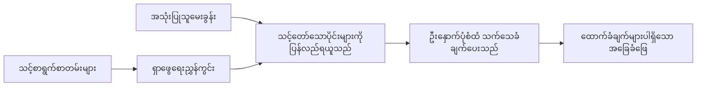

# သင့်စာရွက်စာတမ်းများအပေါ် အခြေခံပြီး AI ကို မေးခွန်းများအတွက် ဖြေဆိုသင်ကြားခြင်း  
## ပဋိညာဉ် 1: RAG, Azure နှင့် Open-Source အစားထိုးများ၊ နှင့် Fine-Tuning လိုအပ်ချိန်

> 2026 ခုနှစ်တွင် 2023 Azure AI Search + Azure OpenAI စာရွက်စာတမ်း QA သင်ခန်းစာများကို ပြန်လည်လေ့လာသည့် ပထမဆောင်းပါး။

## 1. မိတ်ဆက် – ရှေ့က RAG သင်ခန်းစာပြန်လည်သုံးသပ်ခြင်း

2023 ခုနှစ်တွင်၊ Azure AI Search နှင့် Azure OpenAI ကို အသုံးပြုကာ PDF စာရွက်စာတမ်းများမှ မေးခွန်းများကို ဖြေဆိုပေးရန် ChatGPT သင်ကြားပေးခြင်းနှင့် ပတ်သက်သော သင်ခန်းစာနှစ်ခုကို လုပ်ခဲ့သည်။ ကျွန်ုပ်သည် [LangChain ဗားရှင်း](https://techcommunity.microsoft.com/blog/educatordeveloperblog/teach-chatgpt-to-answer-questions-using-azure-ai-search--azure-openai-lang-chain/3969713) ကိုရေးသားခဲ့ပြီး၊ Microsoft ၏ Principal Cloud Advocate Manager တစ်ဦးဖြစ်သူ [Lee Stott](https://developer.microsoft.com/en-us/advocates/lee-stott) နှင့်အတူ [Semantic Kernel ဗားရှင်း](https://techcommunity.microsoft.com/blog/educatordeveloperblog/teach-chatgpt-to-answer-questions-using-azure-ai-search--azure-openai-semantic-k/3985395) ကိုလည်း ပူးတွဲရေးသားခဲ့ပါသည်။ အဲ့ကိုဆို ChatGPT ကို သင့်ဒေတာပေါ်တွင် အသုံးပြုသည်ဆိုတဲ့ အယူအဆဟာ အများ developer များအတွက် အသစ်ဖြစ်နေခဲ့သည်။ သင်ခန်းစာများတွင် Azure Blob Storage, Azure AI Search, Azure OpenAI, LangChain, Semantic Kernel, FAISS ပုံစံ vector retrieval များကို အသုံးပြုကာ PDF ဖိုင်များမှ မေးခွန်းများကို ဖြေဆိုပေးခဲ့သည်။

အဲ့သင်ခန်းစာမှာ လုပ်ဆောင်မှုရိုးရှင်းပြီး အရေးကြီးတဲ့ လုပ်ငန်းစဉ်တစ်ခုတွင် ဦးတည်ခဲ့သည်။ စာရွက်စာတမ်းများကို အပ်လုဒ်လုပ်ခြင်း၊ အညွှန်းရေးခြင်း၊ သက်ဆိုင်ရာအကြောင်းအရာ ရှာဖွေယူခြင်း၊ ထိုအကြောင်းအရာအခြေခံပြီး မော်ဒယ်ကို မေးခွန်းများ ဖြေဆိုစေခြင်း။

2026 ခုနှစ်တွင် RAG စနစ်က အလွန်တိုးတက်လာပါပြီ။ Azure AI Search သည် ခေတ္တ vector နှင့် hybrid retrieval ပုံစံများကို ပံ့ပိုးပေးနိုင်ပြီ ဖြစ်သည်။ Azure OpenAI သည် Microsoft Foundry Models ecosystem ၏ အစိတ်အပိုင်းတစ်ခုဖြစ်လာသည်။ နောက်ဆုံး v1 API သည် လစဉ် `api-version` ပြောင်းလဲမှုများမလိုပဲ ရိုးရိုး OpenAI client ကို အသုံးပြုနိုင်သည်။ တစ်ဦးတည်းမဟုတ်ခြင်းကြောင့် LangGraph, LlamaIndex, Haystack, Qdrant, Milvus, Weaviate, Chroma, Ollama, vLLM ကဲ့သို့သော open-source ရွေးချယ်စရာများသည် လက်တွေ့ RAG စနစ်များအတွက် ကျယ်ကျယ်ပြန့်ပြန့် အသုံးပြုကြသည်။

ဒီအတွက်ပဲ ဒီခေါင်းစဉ်ကို ပြန်လည်ဆန်းစစ်ချင်ခဲ့တာပါ။ မေးခွန်းမှာ လက်ရှိတော့ "RAG ကို ဘယ်လို တည်ဆောက်မလဲ?" ပဲ မဟုတ်တော့ဘူး။ တည်ဆောက်နည်း များစွာ ရှိပြီး၊ "ကျွန်ုပ်မွာဖြစ်စေရန် ဘယ်နည်းပညာစနစ်ကို ရွေးသင့်သလဲ?" ဆိုတဲ့ အကြီးကြီးအရေးကြီးဆုံး အခွံကို တုံ့ပြန်ရပါတယ်။

သို့ပေမဲ့ အခြေခံပြဿနာ မပြောင်းလဲပါ။

AI မော်ဒယ်သည် သင့်စာရွက်စာတမ်းများကို အလိုအလျောက် မသိပါ။ အသုံးဝင် စာရွက်စာတမ်းမေးခွန်းဖြေစနစ်တစ်ခု တည်ဆောက်ရန်အတွက် ယုံကြည်စိတ်ချရသော retrieval, grounding, အကဲဖြတ်မှုနှင့် စီမံခန့်ခွဲမှု လုပ်ငန်းစဉ်များ လိုအပ်သည်။

ဒီဆောင်းပါးဟာ "PDF နဲ့ စကားပြောမယ်" စနစ်တိုးတက်မှု တစ်ခု မဟုတ်ပါဘူး။ အချိန်ရှိတဲ့ အခါ ဘယ်အချိန်တွင် managed Azure architecture ကို ရွေးသင့်သလဲ၊ ဘယ်အချိန် open-source RAG stack ကို ရွေးသင့်သလဲ၊ နှင့် fine-tuning လုပ်သင့်သလဲဆိုတာကို ဆွေးနွေးလိုပါတယ်။

ဒီဟာက စာရွက်စာတမ်းအခြေခံ AI စနစ်များ တည်ဆောက်ခြင်းဆောင်းပါးရှစ်တစ်စဉ်၏ ပထမဆောင်းပါးဖြစ်ပြီး၊ ဤပထမပိုင်းတွင် RAG ၏ အရေးကြီးမှု၊ Azure-based managed services မည်သည့်အချိန်၌ အသုံးဝင်သလဲ၊ open-source အစားထိုးများ မည်သည့်အချိန်မှာ သင့်တော်သလဲ၊ နှင့် fine-tuning ဘယ်မှာလိုက်ဖက်သလဲဆိုတာတို့ကို အဓိကထား ဆွေးနွေးမည် ဖြစ်သည်။

စာရွက်စာတမ်း QA စနစ်များ တည်ဆောက်ပြီး ပြန်လည် စမ်းသပ်သည့်အခါ၊ ဘာသာရပ်သက်သက်တမ်းမီးပြပွဲတွင် အကောင်းဆုံး လုပ်ဆောင်ချက်မှာ မည်သည့် အေကာင့်အသစ်ကို သုံးသင့်သည်၊ ဖောက်ထွင်းသုံးသပ်မှုတွင် ဘယ် architecture က အကောင်းဆုံး ဖြစ်တတ်သည်ဆိုတာထက်၊ လုပ်ငန်းတွင် အသုံးပြုသူများ၊ စာရွက်စာတမ်းများ ပြောင်းလဲမှုများ၊ ခွင့်ပြုချက်၊ အသက်မဲ့ခြင်းများ နှင့် ပြုပြင်ထိန်းသိမ်းမှုကို တိုက်ရိုက်ခံနိုင်သော architecture ဖြစ်ချင်ပါတယ်။

## 2. အဘယ်ကြောင့် သင့် AI အတွက် ရှာဖွေရေးစနစ် လိုအပ်သနည်း

အကြီးစားဘာသာစကားမော်ဒယ်များသည် နေရာအားလုံးမှ လူထုနှင့် လိုင်စင်ရထားသော ဒေတာများပေါ်တွင် သင်ကြားထားပေသည်။ လူသိများသော ခေါင်းစဉ်များအကြောင်း အများကြီး သိထားနိုင်သော်လည်း သင့်ပုဂ္ဂလိက PDF များ၊ အတွင်းရေးမူဝါဒများ၊ ကုမ္ပဏီလုပ်ထုံးလုပ်နည်းများ၊ သုတေသနဓာတ်ကိုယ်စုများ၊ အတန်းထဲစာအုပ်များ၊ ဖောက်သည်ပံ့ပိုးမှတ်တမ်းများ သို့မဟုတ် မကြာသေးမီက ပြင်ဆင်ထားသော သတင်းအချက်အလက်များကို အလိုအလျောက် မသိနိုင်ပါ။

RAG ကို ရိုးရှင်းစွာ စဉ်းစားမယ်ဆိုရင် – မော်ဒယ်ကို စာရွက်စာတမ်းအားလုံးကို မှတ်မိစေဖို့ မမျှော်လင့်ပဲ ရှာဖွေရေးစနစ်ပေးတယ်။ အသုံးပြုသူ မေးခွန်း မေးတိုင်း၊ စနစ်က အရေးကြီးဆုံးအချက်အလက်များကို ရှာတွေ့ပြီး ထိုအချက်များကို မော်ဒယ်ထံ၊ အကြောင်းအရာအဖြစ် ပေးပါတယ်။

ဒါဟာ အရေးကြီးတာက အများကြီးလူသိများတဲ့ ဗဟုသုတရင်းမြစ်တွေဟာ ပုဂ္ဂလိက၊ မပြေလည်အပ်စရာ၊ ခွင့်ပြုချက်အလေးပြုစရာ၊ စနစ်အတော်များများမှာ သိမ်းဆည်းထားတာဖြစ်ပြီး၊ အမျိုးမျိုးသောဖိုင်ဖော်မတ်ဖြင့် ရေးသားထားပြီး၊ တိုက်ရိုက် prompt ထဲ ကိုတော့ မထည့်နိုင်မလားလို့ အရွယ်ကြီးလှတယ်ဆိုတာ ဖြစ်နေတာပါ။

ဥပမာ - ကျောင်း၊ ကုမ္ပဏီ သို့မဟုတ် သုတေသနအသင်းက အတွင်းရေး စာရွက်စာတမ်း 10,000 ခုရှိတယ်ဆိုရင်၊ မော်ဒယ်က ထိုစာရွက်စာတမ်းတွေအားလုံးကနေ မှန်ကန်အောင် ဖြေဆိုမရပါဘူး။ စနစ်က သက်ဆိုင်ရာ အစိတ်အပိုင်းတွေကို မှန်ကန်ချိန်မီ ရှာဖွေရမယ်။

ဒါက စုံစမ်းမေးခွန်းဖြစ်တတ်တာပါ -

ဘာကြောင့် fine-tune မလုပ်ဘူးနည်း?

Fine-tuning က အားသာချက်ရှိနိုင်ပေမဲ့ ပထမဆုံး စာရွက်စာတမ်းဗဟုသုတအတွက် သင့်တော်တဲ့ လုပ်ထုံးလုပ်နည်း မဟုတ်တဲ့အခါများ ရင်နဲ့ပါ။ ဗဟုသုတ အဲဒါ့အတွက် မကြာခဏပြောင်းလဲတာပါ၊ ဘောင်စုံများ အရေးကြီးတယ်၊ ခွင့်ပြုချက်တွေ အရေးပါတော့မယ်ဆိုရင် RAG က ပိုသင့်တော်တယ်။ Fine-tuning က အထူးဘောင်အတွင်း စဉ်းစားမှု၊ စတိုင်၊ output ဖော်မတ်နဲ့ အလုပ်အမှု စနစ် pattern များ သင်ကြားရန်အသုံးဝင်ပါတယ်။

## 3. RAG Architecture ကို လက်တွေ့အသုံးချခြင်း

သင်သည် ကျောင်းအတွက် AI အကူအညီပေးစနစ် တည်ဆောက်နေသည်ဟု ဉာဏ်ကတိပေးပါ။ အဆိုပါအကူအညီတော့ မူဝါဒ PDF များ၊ သင်ရိုးညွှန်းတမ်းများ၊ အတွင်းရေး FAQ စာမျက်နှာများ နှင့် မကြာသေးခင်ကပြင်ဆင်ပြီးသော ကြေညာချက်များမှ မေးခွန်းများကို ဖြေဆိုဖွယ်ရှိသည်။

ကျောင်းသားတစ်ဦးက "ကျွန်တော့် နောက်ဆုံးပေးအပ်ချက်အတွက် generative AI ကို သုံးလို့ရမလား?" ဟု မေးပါက၊ စနစ်က မော်ဒယ်၏ အဆိုပါပုံမှန် မှတ်ဉာဏ်မှ ဖြေဆိုသင့်ခြင်း မဟုတ်ပါ။ ပထမဦးစွာ သက်ဆိုင်ရာ ကျောင်းမူဝါဒကို ရှာဖွေပြီး AI အသုံးပြုခြင်း ဌာနကို ရယူကာ ထိုအထောက်အထားဖြင့် မော်ဒယ်ကို ဖြေဆိုစေပါ။

ဒါက RAG ကို လက်တွေ့အသုံးပြုပုံဖြစ်သည်။

အဆင့်မြင့်အနေဖြင့် လမ်းကြောင်းအတိုင်း ဖော်ပြနိုင်သည် - 

  
အသေးစိတ်တွေ ပိုရှုပ်ထွေးလာနိုင်ပေမယ့် အခြေခံ အယူအဆက မော်ဒယ်က တစ်ယောက်တည်း ဖြေဆိုခြင်း မဟုတ်ဘဲ ရှာတွေ့ထားသော အထောက်အထားဖြင့် ဖြေဆိုခြင်း ဖြစ်သည်။

စတင်မှာ စာရွက်စာတမ်းများကို Azure Blob Storage, SharePoint, GitHub သို့မဟုတ် အတွင်းရေး CMS ကဲ့သို့သော စနစ်များမှ ရယူကျဉ်းပမာန့်ဖြင့် ခွဲခြားပြီး၊ ခေါင်းစဥ်များ၊ စာမျက်နှာနံပါတ်များ၊ ဇယားများ၊ အပိုင်းများနှင့် မူရင်း အတည်ပြုရာများလို အသုံးဝင်ဖွဲ့စည်းမှုများ ထိန်းသိမ်းထားပြီး စာတမ်းများကို စာသားပုံစံဖြင့် ဖော်ထုတ်သည်။

နောက်တစ်ဆင့်မှာ အကြောင်းအရာကို ထူထပ်ကွဲသွားစေသည်။ ဒီအဆင့်လေးဟာ ရိုးရှင်းတဲ့ အဆင့်တစ်ခုသော်လည်း စနစ်အတွက် အရေးကြီးဆုံး အစိတ်အပိုင်းဖြစ်သည်။ အပိုင်းစိတ်ရှုပ်လွန်းခဲ့ရင် သက်ဆိုင်ရာ အနီးကပ် ပတ်ဝန်းကျင်ကို ပျောက်ဆုံးနိုင်တယ်၊ လည်းကြီးခဲ့ရင် မဆက်စပ်သော အချက်အလက်များပါဝင်ပေးသလဲ ရှာဖွေရေး မှန်ကန်မှုကျဆင်းနိုင်သည်။

အပိုင်းခွဲပြီးနောက်တွင် စနစ်သည် embedding များ ဖြစ်စေ၊ မူရင်း စာသားနှင့် ဖိုင်အမည်၊ စာမျက်နှာနံပါတ်၊ ခွင့်ပြုချက်များ၊ စာရွက်စာတမ်း ဗားရှင်း နှင့် မူရင်း URL ကဲ့သို့သော များ metadata များနှင့် အတူ ရှာဖွေရေး index တွင် သိမ်းဆည်းသည်။

အသုံးပြုသူ မေးခွန်းမေးသည့်အခါတွင် စနစ်သည် စကားလုံးရှာဖွေရေး၊ vector ရှာဖွေရေး သို့မဟုတ် hybrid ရှာဖွေရေး အသုံးပြုကာ ပဲြလ်လောက်သော အပိုင်းများ ရွေးချယ်သည်။ ပြန်လည်စီစဉ်သူ (reranker) သည် ထိုအပိုင်းများကို ပြန်လည်စီစဉ်ပေးနိုင်ပြီး အထောက်အထားအသုံးဝင်ဆုံးများကို ထိပ်ဆုံးတွင် တင်ထားနိုင်သည်။

နောက်ဆုံးတွင် မော်ဒယ်အား မေးခွန်းနှင့် ရရှိသော အထောက်အထားများ ပေးသည်။ ဖြေရှင်းချက်အနေဖြင့် အထောက်အထားအပေါ် အခြေခံကာ ပျော်ပါးစေပြီး စနစ်နှင့် အသုံးပြုသူသည် အကြောင်းအရင်းများကို စစ်ဆေးနိုင်ရန် ကိုးကားချက်များ ပြန်လည်ပေးပို့သင့်သည်။

အစဉ်အလာ အချက်မှာ RAG ဆိုတာ "PDF များကို vector database ထဲ ထည့်ထားခြင်း" သာမကဖြစ်သည်။ ဖြေဆိုချက် အရည်အသွေးမှာ စုစည်းခြင်း, အပိုင်းခွဲခြားခြင်း, ရှာဖွေမှု, ပြန်လည်စီစဉ်မှု, ဆက်သွယ်ချက်ပေးခြင်း, ကိုးကားခြင်းနှင့် အကဲဖြတ်ခြင်း အားလုံး၏ အရည်အသွေး အပေါ်မှာ မူတည်သည်။

ဒါကြောင့် စာရွက်စာတမ်း ဖွဲ့စည်းမှုက အရေးကြီးသည်။ PDF တစ်ခုတွင် ခေါင်းစဥ်၊ ဇယား၊ ဖူးနုတ်၊ စာမျက်နှာနားမှာ အပိုင်း၏ အဓိပ္ပါယ်ကို ပြောင်းလဲစေနိုင်သည်။ Azure တွင် Document Layout skill သည် Azure Document Intelligence ၏ layout စွမ်းဆောင်ရည်များဖြင့် ဖွဲ့စည်းမှုကို သိရှိစေသော ထုတ်လုပ်မှု ထုတ်ပေးပြီး chunking နှင့် retrieval အရည်အသွေးအတွက် ကောင်းမွန်သည့် အကျိုးသက်ရောက်မှု ရှိစေပါသည်။

## 4. 2023 ခုနှစ်မှ စ၍ ဘာတွေပြောင်းလဲသွားလဲ?

2023 ခုနှစ် သင်ခန်းစာသည် အချိန်အတွက် အစကောင်းသော စတင်မှုတစ်ခုဖြစ်သည် –

- Azure Blob Storage က PDF ဖိုင်များ သိမ်းဆည်းခဲ့သည်။
- Azure AI Search က အကြောင်းအရာများကို အညွှန်းတင်ခဲ့သည်။
- LangChain က Azure OpenAI ကို ရှာဖွေမှုနှင့်ချိတ်ဆက်ပေးခဲ့သည်။
- FAISS က ရိုးရှင်းသော ဒေသငယ် vector ဂိုဒေါင်းတစ်ခုအနေဖြင့်လုပ်ဆောင်ခဲ့သည်။
- ဥပမာတွင် `gpt-35-turbo` နှင့် `text-embedding-ada-002` ကို အသုံးပြုခဲ့သည်။

2026 ခုနှစ်တွင် ခေတ်မီ ဗားရှင်းတစ်ခုသည် အချို့ပြောင်းလဲမှုများကို ထည့်သွင်းစဉ်းစားရမည်။

ပထမဆုံး၊ ရှာဖွေမှုက စွမ်းဆောင်ရည် တိုးတက်လာပြီ။ 2023 နှစ် အချိန်အခါ မှာ ရိုးရှင်းသော vector ဆင်တူမှုရှာဖွေရေးကို အများထားသုံးခဲ့သည်။ ယနေ့တွင် hybrid ရှာဖွေရေးသည် လက်တွေ့စာရွက်စာတမ်း QA အတွက် ပုံမှန်စတင်မှု ဖြစ်လာသည်။ Azure AI Search သည် keyword နှင့် vector queries ပေါင်းစပ်ပြီး စတင်တောင်းဆိုချက် တစ်ခုချင်းနှင့် ရလာဒ်များကို Reciprocal Rank Fusion ဖြင့် ပေါင်းစပ်ထားသော hybrid ရှာဖွေရေးကို ပံ့ပိုးသည်။ Semantic ranker သည် စာသားမျာကန်သာ full-text, vector နှင့် hybrid ရလဒ်များကို ပြန်စီရန် အသုံးပြုနိုင်သည်။

ဒုတိယ၊ ဝင်ရောက်ခြင်း (ingestion) ပိုမိုရှုပ်ထွေးလာပြီ။ စာရွက်စာတမ်းတစ်ခုချင်းစီကို လက်မူ application code ဖြင့် မခွဲမရှင်းစေလို့ Azure AI Search တွင် chunking, embedding နှင့် query အချိန် vectorization များတွက် integrated vectorization ကိုပံ့ပိုးပေးနေပါပြီ။ PDF များနှင့် စာရွက်စာတမ်းများတွင် Document Layout skill က ကြားဝင်စွပ်စဲသော chunk အရွယ်အစားထက် ပိုမိုကျယ်ပြန့်သော ဖွဲ့စည်းမှုကို ထိန်းသိမ်းထားနိုင်သည်။

တတိယ၊ စီမံခန့်ခွဲမှုက ပိုအရေးကြီးလာပြီ။ အခက်အခဲတစ်ခုက LLM API တုန်းလည်း မဖြစ်ပါဘူး။ အခက်အခဲဖြစ်တာက အမှားများ၊ ထပ်ကြိုးစားမှုများ၊ ယခင်ရှာဖွေမှုများမှ အစွန်းရောက်မှု၊ chunk အရည်အသွေး၊ ကြာရှည်စီမံခန့်ခွဲမှုလုပ်ငန်းစဉ်များ၊ လူ့သုံးသပ်မှုနှင့် အကဲဖြတ်မှုများ ဖြစ်ပါတယ်။ ဒီနေရာက LangGraph, LlamaIndex workflow များ, Haystack pipeline များနှင့် ပလက်ဖောင်းအဆင့်အကဲဖြတ်မှုနှင့် ကြည့်ရှုသုံးသပ်မှုကိရိယာများက တစ်ကြောင်းတည်းသော linear chain ထက် ပိုပြီးသင့်တော်လာသည်။

စတုတ္တံ၊ အကဲဖြတ်ချက်က မရွေးချယ်လို့ မရတော့ဘူး။ ပွဲပြင်ကို မေးခွန်းတစ်ခုနဲ့ အံ့အားသင့်စေသည်။ ထုတ်လုပ်မှုစနစ်များတွင် စမ်းသပ်မှုကတ်များ၊ regression စစ်ဆေးမှုများ၊ ရှာဖွေရေး ပြည့်မီမှု တိုင်းတာမှုများ၊  တည်ငြိမ်မှု စစ်ဆေးမှုများ၊ နှင့် မော်နီတာလုပ်ခြင်း မရှိဘဲ၊ စနစ်တိုးတတ်နေသည်ဟုတ်မဟုတ် သိရခက်တယ်။

## 5. Azure နှင့် Open-Source RAG Stack များအကြား ရွေးချယ်ခြင်း

ကျွန်ုပ်ထင်သည့် အရေးကြီးသောမေးခွန်းမှာ "Azure က open-source ထက်ပိုကောင်းသလား" သို့မဟုတ် "open-source က Azure ထက်ပိုကောင်းသလား" မဟုတ်ပါ။

အရေးကြီးသောမေးခွန်းမှာ - မည်သည့်စနစ်ကို တည်ဆောက်မည်၊ အလုပ်ကို ဘယ်သူလုပ်မည်၊ မည်သည့် ကန့်သတ်ချက်များရှိသည်၊ ကွေ့ချော်မှု အခြေအနေများ မလက္ခံနိုင်ဖူးဖူး။

စာရွက်စာတမ်း QA စနစ်များ လုပ်ဆောင်ချိန်မှာ ပထမဦးဆုံးစိတ်ကူးမှာရှာဖွေမှု ကောင်းမွန်ကြောင်းသာ စဉ်းစားခဲ့တာပါ။ PDF များကို upload လုပ်၊ ရှာဖွေ၊ ဖြေဆိုချက် ထုတ်ပေးနိုင်ပြီလား ဆိုတာ တစ်ခုတည်းစတင်ခဲ့ပါတယ်။

အမှန်တကယ် AI workflow များ လုပ်ခဲ့ပြီးနောက် ကျွန်ုပ်၏ အကဲဖြတ်မှု ပြောင်းလဲသွားသည်။ RAG stack ရွေးချယ်ခြင်းအရမ်းကို ၄ ခုအပိုင်းကို ကြည့်ပါသည်။

- ကိုယ်ပိုင်အသိအမှတ်ပြုခြင်းနှင့် ခွင့်ပြုချက်
- ရှာဖွေရေး အရည်အသွေး
- လုပ်ငန်းစဉ် ယုံကြည်စိတ်ချမှု
- စီမံခန့်ခွဲမှု ပိုင်ဆိုင်မှု

ဒီ ၄ ခုသည် မော်ဒယ် benchmark တစ်ခုတည်းထက်ပို၍ အရေးကြီးပါတယ်။

Azure-based architecture များသည် အများအားဖြင့် စီးပွားရေးအဖွဲ့အစည်းချိတ်ဆက်မှု အရေးကြီးသောကိစ္စမှာ အသုံးဝင်သည်။ အသင်းအဖွဲ့တစ်ခုက မည်သူမဆို Microsoft Entra ID, Microsoft 365, Azure Storage, ပုဂ္ဂိုလ်ရေးကွန်ယက်, RBAC, နှင့် Azure မော်နီတာလုပ်ငန်းများအပေါ် မူတည်ပြီးဖြစ်လျှင် Azure AI Search နှင့် Azure OpenAI များက စီမံခန့်ခွဲမှု ပြဿနာများကို လျော့ချပေးပါသည်။ အဲ့ဒီပတ်ဝန်းကျင်မှာ Azure က မော်ဒယ် API သာမက Identity, Governance, managed search, security integration, support နှင့် operations များလည်း ပါဝင်သည်။

Open-source architecture များသည် နေပိုင်ခွင့် ကိစ္စအရေးကြီးတဲ့အခါ အသုံးဝင်သည်။ အသင်းအဖွဲ့မှာ ဒေသခံ inference, cloud portability, custom retrieval pipeline, အထူးပြု reranking, သို့မဟုတ် vector database နှင့် model-serving layer တွေအပေါ် တိုက်ရိုက် ထိန်းချုပ်မှုလိုလျှင် open-source stack အား ကိုင်တွယ်နိုင်ပါတယ်။ ကန့်သတ်ချက်က အသင်းအဖွဲ့က ယုံကြည်စိတ်ချမှုလုပ်ငန်းများ – backup, scale, latency, migration, monitoring, security – ကို ပိုပြီး ကိုင်တွယ်ရတယ်။

လက်တွေ့မှာ အသုံးပြု AI စနစ်များ မကြာခဏ cloud-native သာမက၊ open-source သာမက မဟုတ်ဘဲ hybrid စနစ်များဖြစ်သည်။ လုပ်ငန်းလိုအပ်ချက်များ၊ portability, governance နှင့် အင်ဂျင်နီယာရည်ရွယ်ချက်များကို ချိန်ညှိပေးသည့် ပေါင်းစပ်မှုဖြစ်သည်။

ဥပမာ – Azure OpenAI ကို မော်ဒယ်ဝင်ရောက်မှုအတွက်သုံးပြီး၊ LangGraph ကို workflow သို့ orchestration အတွက်သုံး၊ Azure တွင် လွှဲပြောင်းထား၍ မူရင်း vector database အဖြစ် open-source တစ်ခုကို သီးသန့် ရှာဖွေရေးလိုအပ်ချက်အတွက် အသုံးပြုသည် ဆိုရင် တစ်ခုလုံး architecture မခိုင်မာတာ မဟုတ်ပါဘူး။ စနစ်၏ အစိတ်အပိုင်း တိုင်းအတွက် အသင့်တော်ဆုံး managed service နှင့် ပိုင်ဆိုင်မှုအား ရွေးချယ်ခြင်းဖြစ်သည်။

ငါက hybrid architecture ကို နှစ်သက်တယ်၊ managed platform က အရေးကြီးသော စီးပွားရေးပြဿနာများကို ဖြေရှင်းပေးတယ် ။ open-source အစိတ်အပိုင်းများက အင်ဂျင်နီယာအသင်းအတွက် လိုအပ်သည့် ကိစ္စတွေမှာ လွတ်လပ်ခွင့် ပေးတယ်။

## 6. လက်တွေ့ဆုံး ဆုံးဖြတ်ချက်လမ်းညွှန်

RAG stack ကို ရွေးဖို့ မတိုင်ခင် အသင်းအဖွဲ့နဲ့ အသုံးပြုမယ့် ဆုံးဖြတ်ချက်ဇယား

| ဆုံးဖြတ်နယ်ပယ် | Azure managed stack ပိုများသော အခါ | Open-source stack ပိုများသော အခါ |
| --- | --- | --- |
| ကိုယ်ပိုင်အသိအမှတ်ပြုခြင်း နှင့် အသုံးပြုခွင့် | Entra ID, RBAC, managed identity နှင့် စီးပွားရေး ခွင့်ပြုချက် အရေးကြီး | အထူး auth, non-Microsoft identity သို့မဟုတ် app-specific access များ ထုံးစံကျ စောင့်ရှောက်မှု |
| လုပ်ငန်းစဉ်များ | အသင်းအဖွဲ့က managed infrastructure, support, SLA များနှင့် onboarding လွယ်ကူခြင်း လိုလား | အသင်း vector database, model serving, backup နှင့် scale ကို ကိုင်တွယ်နိုင်သည် |
| ရှာဖွေရေး | hybrid search, semantic ranking, ဂရုတစိုက်နေသောရှာဖွေရေးနှင့် metadata ရှာဖွေရေး ဖြည့်ဆည်းပေးသည် | အသင်းက custom retrieval, အထူး reranking, သို့မဟုတ် စမ်းသပ် indexing လို | 
| ပို့ဆောင်နိုင်မှု | Azure ecosystem နှင့် ကိုက်ညီခြင်း သို့မဟုတ် ဦးစားပေးထားခြင်း | cloud lock-in ရှောင်ကြဉ်ခြင်းလိုအပ်မှု ရှိသော အခါ |
| အမြင့်မြတ်သုံးသပ်မှု | Azure OpenAI အုပ်ချုပ်မှု၊ ကွန်ယက်နှင့် စီးပွားရေးထိန်းချုပ်မှုအရေးကြီး | ဒေသခံ inference, စိတ်ကြိုက်မော်ဒယ်များ သို့မဟုတ် တိုက်ရိုက် hosting လိုအပ်သည် |
| ကုန်ကျစရိတ် | အင်ဂျင်နီယာနှင့် လုပ်ငန်းစဉ် ကြိုးစားမှု လျော့ချခြင်း အရေးကြီး | scale ကြီးမားလွန်းခြင်းကြောင့် ကြီးမားသော ကွန်ယက်သုံးစွဲမှုကို စီမံရ |
| စမ်းသပ်မှု | တည်ငြိမ်မှုနှင့် စီးပွားရေးချိတ်ဆက်မှု ပိုအရေးကြီး | အသင်းက agent, tool, memory နှင့် ရှာဖွေမှု လုပ်ငန်းစဉ်များကို အမြန် iteration လုပ်နေသည် |

ကျွန်ုပ်အယူအဆ ရိုးရှင်းသည် -

- စီးပွားရေးချိတ်ဆက်မှု, ဘေးကင်းမှု နှင့် လုပ်ငန်းစဉ်လွယ်ကူမှု အဓိက ဘေးအန္တရာယ်များဖြစ်သောအခါ Azure နှင့် စတင်ပါ။
- ပို့ဆောင်နိုင်မှု, စိတ်ကြိုက်မှု သို့မဟုတ် ဒေသခံ ထိန်းချုပ်မှု အဓိက အန္တရာယ်ဖြစ်သောအခါ open source နှင့် စတင်ပါ။
- နှစ်ခုလုံးမှန်ပါက hybrid stack ကို အသုံးပြုပါ။

ဒီတော့ 2026 RAG စီးရီးတစ်ခုကို code နဲ့ စတင်မမှာဖြစ်သည်။ ကုဒ်အရေးကြီးပေမယ့် architecture ရွေးချယ်မှု တစ်လှမ်း အရင်ပါ။ ရိုးရှင်းတဲ့ demo က အခက်အခဲ အများဆုံးကို ဖုံးကွယ်ထားတတ်သည်။ ကောင်းမွန်တဲ့ RAG စနစ်က အခက်အခဲ အားလုံးကို ပြသနိုင်သည်။

## 7. Fine-Tuning မည်သည့်အခါ သင့်တော်သနည်း

Fine-tuning ကို RAG နဲ့အတူ မကြာခဏ ပြောကြတယ်၊ သို့သော် လုံးဝခြားနားစရာ ကိစ္စ ဖြစ်တယ်။

RAG ဟာ စနစ်မှာ အသစ်၊ ပုဂ္ဂလိက၊ ခွင့်ပြုချက်စိန်ခေါ်မှု ၊ မူရင်းအခြေခံ ဘာသာရပ်များ လိုအပ်သော အခါပိုကောင်းတယ်။ ဖြေဆိုချက်တွင် စာရွက်စာတမ်းတွေကို ကိုးကားပြရန်လို၊ ကိုးကားချက်မျာက အင်းနက်ပြီး update များအရ တိကျစေရန်လို၊ အသုံးပြုသူအလိုက် အခွင့်များကို လေးစားစေရန်လိုပါက retrieval ကို architecture တစ်စိတ်တစ်ပိုင်း အနေဖြင့် ထည့်သွင်းသင့်သည်။

Fine-tuning သည် ဗဟုသုတထဲက စိန်ခေါ်မှု ပိုမဟုတ်သော အခါ အသုံးဝင်သည်။ မော်ဒယ်ကို အထူးထွက်ရှိမှုဖော်မတ်၊ ထူးခြားနယ်ပယ်တန်ဆာပလာစတိုင်၊ တည်ငြိမ်သောတာဝန်များ တွက်ထိရောက်စေရန် နှင့် prompt များတွင် လိုအပ်မှု လျော့နည်းစေရန် သင်ကြားပေးချင်သည့်အခါ အသုံးချနိုင်သည်။
လုပ်ငန်းတွင်၊ နှစ်ခုစလုံးအတူတကွ လုပ်ဆောင်နိုင်သည်။ ထောက်ခံ စာရေးသူသည် RAG ကို အသုံးပြု၍ မူဝါဒအကြောင်းများကို ရှာဖွေယူရန် စက်တင်ထားနိုင်သလို၊ ဖြေဆိုချက်မှန်ကန်မှုနှင့် စကားပုံစံကို ကုမ္ပဏီကြိုက်နှစ်သက်သည့် ပုံစံဖြင့် သင်ယူထားသော မော်ဒယ်တစ်ခုလည်း ရှိနိုင်သည်။

မှားယွင်းချက်မှာ fine-tuning ကို စာရွက်စာတမ်း ထိုင်သေတ္တာအား အစားထိုးလိုက်သည် ယူဆခြင်းဖြစ်သည်။ စနစ်သည် သန့်ရှင်းပြီး ကိုယ်ပိုင် ဒေတာ သို့မဟုတ် ခွင့်ပြုချက်ဆိုင်ရာ ဒေတာမှသာ ဖြေဆိုဖို့ အလိုရှိသောအခါများတွင် ပြန်ယူမှု လိုအပ်မှုကို ဖယ်ရှားပစ်သွားခြင်း မဟုတ်ပါ။

## 8. ဒီစီးရီးနောက်ထပ် သွားမယ့် လမ်း

ဒီဆောင်းပါးသည် ဆုံးဖြတ်ချက် ခြေလှမ်းအဆင့် ဖြစ်သည်။ ကုဒ်ရေးမတိုင်မီ RAG နှင့် fine-tuning၊ Azure နှင့် open source၊ managed services နှင့် operational control တို့၏ ကုန်ကျစရိတ်နှင့် အကျိုးကျေးဇူးများကို လွယ်ကူရှင်းလင်းစွာ ဖော်ပြချင်ခဲ့သည်။

တကယ်ကို ထည့်သွင်းကာကွယ်မှုလုပ်ခြင်းမပြုမီ၊ စီးပွားရေးလုပ်ငန်း AI စနစ်များတွင် မော်ဒယ်သည် ကိုယ်တိုင် တစ်စိတ်တစ်ပိုင်းသာဖြစ်ကြောင်း အချက်တစ်ခုထားလိုသည်။ ပြန်ယူမှုအရည်အသွေး၊ ညှိနှိုင်းခြင်း၊ သုံးသပ်ချက်၊ ခွင့်ပြုချက်များနှင့် လုပ်ငန်းထိန်းသိမ်းမှု ယုံကြည်စိတ်ချရမှုတို့က စနစ်သည် demo အဆင့်ကျော် တိုးတက်နိုင်မလား ဆုံးဖြတ်ပေးနိုင်သောအချက်များ ဖြစ်လေ့ရှိသည်။

ဒီစီးရီးရဲ့ နောက်ထပ်အပိုင်းများတွင် စာရွက်စာတမ်းအခြေပြု AI စနစ်များ၏ လက်တွေ့လုပ်ဆောင်ရန်နည်းလမ်းများ အနက်သို့ ဆက်လက်ဝင်ရောက်ပါမည်။ Azure အခြေခံလက်နက်ပညာဖွဲ့စည်းပုံ ရေးဆွဲခြင်း၊ open-source အစားထိုးနည်းများ လက်တွေ့တွင် ဘယ်လောက်ထိ ထိရောက်မှုရှိကြောင်းနှင့် RAG စနစ်တစ်ခုသည် တကယ်လို့ အလုပ်လုပ်သလား စစ်ဆေးခြင်းများတို့ပါဝင်သည်။

စီးရီးတိုးတက်လာသည့်အတိုင်း အစီအစဉ်အဆင့်ကို ချိန်ညှိနိုင်မည်သော်လည်း ရည်ရွယ်ချက်မှာ တူညီနေမည်။ ရိုးရိုးရှင်းရှင်း demo တစ်ခု ကျော်လွန်ပြီး ထိန်းသိမ်းခြင်း၊ သုံးသပ်ခြင်းနှင့် လုပ်ငန်းခွင်တွင် ကြီးပွားစွာအသုံးပြုနိုင်သော RAG စနစ်များကို စဉ်းစားဖော်ပြပေးရန် ဖြစ်သည်။

## 9. ရင်းမြစ်များနှင့် အညွှန်းများ

မူရင်း သင်ခန်းစာများ -

- [Teach ChatGPT to Answer Questions: Using Azure AI Search & Azure OpenAI (Lang Chain)](https://techcommunity.microsoft.com/blog/educatordeveloperblog/teach-chatgpt-to-answer-questions-using-azure-ai-search--azure-openai-lang-chain/3969713)
- [Teach ChatGPT to Answer Questions: Using Azure AI Search & Azure OpenAI (Semantic Kernel)](https://techcommunity.microsoft.com/blog/educatordeveloperblog/teach-chatgpt-to-answer-questions-using-azure-ai-search--azure-openai-semantic-k/3985395)

Azure -

- [Azure AI Search REST API versions](https://learn.microsoft.com/en-us/rest/api/searchservice/search-service-api-versions)
- [Hybrid search in Azure AI Search](https://learn.microsoft.com/en-us/azure/search/hybrid-search-how-to-query)
- [Integrated vectorization in Azure AI Search](https://learn.microsoft.com/en-us/azure/search/vector-search-integrated-vectorization)
- [Document Layout skill in Azure AI Search](https://learn.microsoft.com/en-us/azure/search/cognitive-search-skill-document-intelligence-layout)
- [Chunk and vectorize by document layout](https://learn.microsoft.com/en-us/azure/search/search-how-to-semantic-chunking)
- [Semantic ranking in Azure AI Search](https://learn.microsoft.com/en-us/azure/search/semantic-search-overview)
- [Azure OpenAI / Microsoft Foundry API version lifecycle](https://learn.microsoft.com/en-us/azure/foundry/openai/api-version-lifecycle)
- [Foundry Models sold by Azure](https://learn.microsoft.com/en-us/azure/foundry/foundry-models/concepts/models-sold-directly-by-azure)
- [Microsoft Foundry fine-tuning considerations](https://learn.microsoft.com/en-us/azure/foundry/openai/concepts/fine-tuning-considerations)
- [Microsoft Foundry observability](https://learn.microsoft.com/en-us/azure/foundry/concepts/observability)
- [Run evaluations in Microsoft Foundry](https://learn.microsoft.com/en-us/azure/foundry/how-to/evaluate-generative-ai-app)

Open-source -

- [LangGraph documentation](https://docs.langchain.com/oss/python/langgraph/overview)
- [LlamaIndex documentation](https://developers.llamaindex.ai/python/framework/)
- [Haystack documentation](https://docs.haystack.deepset.ai/)
- [Qdrant documentation](https://qdrant.tech/documentation/overview/)
- [Milvus documentation](https://milvus.io/docs/overview.md)
- [Weaviate documentation](https://docs.weaviate.io/weaviate/current/)
- [Chroma documentation](https://docs.trychroma.com/docs/overview/introduction)
- [Ollama embeddings](https://docs.ollama.com/capabilities/embeddings)
- [vLLM OpenAI-compatible server](https://docs.vllm.ai/en/latest/serving/openai_compatible_server.html)
- [BGE embedding models](https://huggingface.co/BAAI/bge-large-en-v1.5)
- [E5 embedding models](https://huggingface.co/intfloat/e5-large-v2)
- [Instructor embedding models](https://huggingface.co/hkunlp/instructor-large)

---

<!-- CO-OP TRANSLATOR DISCLAIMER START -->
**ပြောကြားချက်**
ဤစာတမ်းကို AI ဘာသာပြန်ဝန်ဆောင်မှု [Co-op Translator](https://github.com/Azure/co-op-translator) အသုံးပြု၍ ဘာသာပြန်ထားပါသည်။ ကျွန်ုပ်တို့သည် တိကျမှန်ကန်မှုအတွက် ကြိုးပမ်းနေသော်လည်း၊ စက်ကိရိယာဘာသာပြန်ခြင်းများတွင် အမှားများ သို့မဟုတ် မှားယွင်းချက်များ ပါဝင်နိုင်ကြောင်း သတိပြုပါရန် လိုအပ်ပါသည်။ မူလစာတမ်းကို မူရင်းဘာသာဖြင့်သာ ယုံကြည်စိတ်ချရသော အချက်အလက်အဖြစ် သတ်မှတ်သင့်သည်။ အရေးကြီးသည့် သတင်းအချက်အလက်များအတွက် ပရော်ဖက်ရှင်နယ် လူသားဘာသာပြန်သူဝန်ဆောင်မှုကို အကြံပြုပါသည်။ ဤဘာသာပြန်ချက်ကို အသုံးပြုခြင်းမှ ဖြစ်ပေါ်လာသော နားလည်မှုကွာခြားမှုများ သို့မဟုတ် မမှန်ကန်သော အသုံးပြုမှုများအတွက် ကျွန်ုပ်တို့ တာဝန်မခံပါ။
<!-- CO-OP TRANSLATOR DISCLAIMER END -->