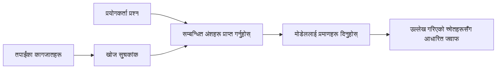

# तपाईंको कागजातहरूका आधारमा AI लाई प्रश्नहरूको जवाफ दिन सिकाउनुहोस्:
## शृंखला १: RAG, Azure बनाम खुला स्रोत विकल्पहरू, र कहिले Fine-Tuning उपयुक्त हुन्छ

> २०२३ को Azure AI Search + Azure OpenAI कागजात QA ट्यूटोरियलहरूलाई पुनः समिक्षा गर्दै २०२६ मा प्रकाशित पहिलो लेख।

शृंखला नेभिगेसन: [Repository home](../README.md) | अर्को: [शृंखला २ - स्थानीय खुला स्रोत RAG सिस्टमको अन्त्यसम्म निर्माण गर्नुहोस्](./series-2-open-source-rag-end-to-end.md)

## १. परिचय - पहिलेको RAG ट्यूटोरियल पुनः समिक्षा

२०२३ मा, मैले Azure AI Search र Azure OpenAI प्रयोग गरेर PDF कागजातहरूबाट प्रश्नहरूको जवाफ दिन ChatGPT लाई सिकाउने दुई ट्यूटोरियलहरूमा काम गरें। मैले [LangChain संस्करण](https://techcommunity.microsoft.com/blog/educatordeveloperblog/teach-chatgpt-to-answer-questions-using-azure-ai-search--azure-openai-lang-chain/3969713) लेखें, र मैले सहलेखकीय रूपमा [Semantic Kernel संस्करण](https://techcommunity.microsoft.com/blog/educatordeveloperblog/teach-chatgpt-to-answer-questions-using-azure-ai-search--azure-openai-semantic-k/3985395) पनि लेखें जसमा Microsoft का Principal Cloud Advocate Manager [ली स्टट](https://developer.microsoft.com/en-us/advocates/lee-stott) सहभागी थिए। त्यस समयमा, "तपाईंको डाटामा ChatGPT" भन्ने अवधारणा धेरै विकासकर्ताहरूका लागि नयाँ महसुस हुन्थ्यो। ती ट्यूटोरियलहरूले Azure Blob Storage, Azure AI Search, Azure OpenAI, LangChain, Semantic Kernel, र FAISS-शैलीको भेक्टर पुनःप्राप्ति प्रयोग गरेर PDF फाइलहरूबाट प्रश्नहरूको जवाफ दिने काम गरेका थिए।

अघिल्लो लेखले एक सरल तर महत्त्वपूर्ण कार्यप्रवाहमा केन्द्रित थियो: कागजातहरू अपलोड गर्ने, तिनीहरूलाई सूचीबद्ध गर्ने, सम्बन्धित सामग्री पुनः प्राप्त गर्ने, र त्यस सामग्रीको आधारमा मोडेललाई जवाफ दिन अनुरोध गर्ने।

२०२६ मा, RAG इकोसिस्टम धेरै विकसित भएको छ। Azure AI Search अब आधुनिक भेक्टर र हाइब्रिड पुनःप्राप्ति ढाँचाहरू समर्थन गर्दछ, Azure OpenAI माइक्रोसफ्ट फण्ड्री मोडेलहरूको व्यापक इकोसिस्टमको हिस्सा हो, र नयाँ v1 API मा मानक OpenAI क्लाइन्ट प्रयोग गर्न सकिन्छ बिना मासिक `api-version` परिवर्तन आवश्यक। त्यस्तै समयमा, LangGraph, LlamaIndex, Haystack, Qdrant, Milvus, Weaviate, Chroma, Ollama, र vLLM जस्ता खुला स्रोत विकल्पहरूले व्यावहारिक RAG सिस्टमका लागि विकल्प प्रदान गरेका छन्।

त्यसैले मैले यो विषयलाई पुनः समिक्षा गर्न चाहेँ। अब प्रश्न मात्र "म कसरी RAG बनाउने?" मात्र छैन। अब थुप्रै तरिका छन्, र सबैभन्दा महत्त्वपूर्ण प्रश्न हो "मेरो परिस्थितिका लागि कुन वास्तुकला उपयुक्त छ?"

तर मुख्य समस्या भनेको परिवर्तन भएको छैन।

एउटा AI मोडेलले तपाईंका कागजातहरू आफैँसँग जान्दैन। प्रयोगयोग्य कागजात-प्रश्न-जवाफ प्रणाली निर्माण गर्न, अझै पनि भरपर्दो पुनःप्राप्ति, ग्राउन्डिङ, मूल्याङ्कन, र सञ्चालन कार्यप्रवाह आवश्यक छ।

यो लेख अर्को अन्त्यदेखि-अन्त्यसम्म "PDFसँग संवाद" ट्यूटोरियल होइन। म यो अद्यावधिक शृंखला सुरू गर्न चाहन्छु जुन म अहिले बढी चासो राख्छु: कहिले व्यवस्थापित Azure वास्तुकला चयन गर्ने, कहिले खुला स्रोत RAG स्ट्याक छनोट गर्ने, र कहिले fine-tuning वास्तवमै उपयुक्त हुन्छ?

यो शृंखलाको पहिलो लेख हो जुन कागजात-ग्राउन्डेड AI प्रणालीहरू निर्माण सम्बन्धी हो। यस पहिलो भागमा हामी वास्तुकला निर्णयहरूमा केन्द्रित हुनेछौं: किन RAG महत्वपूर्ण छ, कब Azure आधारित व्यवस्थापित सेवाहरू उपयोगी छन्, कब खुला स्रोत विकल्पहरूले अर्थ राख्छन्, र fine-tuning कहाँ फिट हुन्छ।

कागजात QA प्रणालीहरू निर्माण र पुनःसमिक्षा गरेर, म अब कुन उपकरण डेमोमा राम्रो देखिन्छ भन्दा फरक कुरा सोच्न थालेको छु — कुन वास्तुकला वास्तविक प्रयोगकर्ता, कागजातहरू परिवर्तन, अनुमतिहरू, असफलताहरू, र मर्मतसम्भारलाई सामना गर्न सक्षम हुन्छ।

## २. किन तपाईंको AI लाई खोज प्रणाली आवश्यक पर्छ

ठूला भाषा मोडेलहरू व्यापक सार्वजनिक र लाइसेन्स प्राप्त डाटामा प्रशिक्षित हुन्छन्। तिनीहरूले सामान्य विषयहरूमा धेरै जान्न सक्छन्, तर तपाईंका निजी PDFहरू, आन्तरिक नीति, उद्यम प्रक्रिया, अनुसन्धान अभिलेखहरू, कक्षा सामग्रीहरू, ग्राहक समर्थन नोटहरू, वा हालै अद्यावधिक गरिएको दस्तावेजहरू आफैँसँग थाहा हुँदैन।

RAG लाई सरल तरिकाले यसरी सोच्न सकिन्छ: मोडेलले प्रत्येक कागजात सम्झने आशा गर्नुको साटो, हामी त्यसलाई खोज प्रणाली दिन्छौं। प्रयोगकर्ताले प्रश्न सोध्दा, प्रणाली पहिले सबैभन्दा सान्दर्भिक जानकारीका टुक्राहरू खोज्छ, त्यसपछि ती टुक्राहरूलाई सन्दर्भका रूपमा मोडेललाई दिन्छ।

यो महत्त्वपूर्ण छ किनकि धेरै वास्तविक ज्ञान स्रोतहरू निजी, लगातार परिवर्तनशील, अनुमतिसम्पन्न, बहु प्रणालीमा संग्रहित, धेरै ढाँचाहरूमा लेखिएका, र सिधै प्रॉम्प्टमा टाँस्न धेरै ठूलो हुन्छन्।

उदाहरणका लागि, यदि एउटा विद्यालय, कम्पनी, वा अनुसन्धान टिमसँग १०,००० आन्तरिक कागजात छन् भने, मोडेलले ती कागजातहरूबाट भरपर्दो उत्तर दिन सक्दैन जबसम्म प्रणालीले सही समयमा सही भागहरू पुनःप्राप्त गर्दैन।

यसले स्वाभाविक रूपमा सामान्य प्रश्न जन्माउँछ:

किन मोडेललाई fine-tune मात्र नगर्ने?

फाइन-ट्युनिंग उपयोगी हुन सक्छ, तर प्रायः कागजात ज्ञानको लागि पहिलो सही उपकरण हुँदैन। ज्ञान बारम्बार परिवर्तन भएमा, उद्धरणहरू महत्त्वपूर्ण भएमा, वा पहुँच अनुमतिहरू महत्त्वपूर्ण भएमा RAG प्रायः उत्तम सुरुवात हो। फाइन-ट्युनिंग व्यवहार, शैली, आउटपुट ढाँचा, र कार्य ढाँचाहरू सिकाउन उपयुक्त हुन्छ।

## ३. RAG वास्तुकला व्यवहारमा

कल्पना गर्नुहोस् तपाईं एउटा विद्यालयका लागि AI सहायक निर्माण गर्दै हुनुहुन्छ। सहायकलाई नीति PDFहरू, पाठ्यक्रम मार्गदर्शनहरू, आन्तरिक FAQ पृष्ठहरू, र हालै अद्यावधिक सूचना पृष्ठहरूबाट प्रश्नहरूको जवाफ दिनु पर्छ।

यदि कुनै विद्यार्थीले सोध्यो, "के म मेरो अन्तिम असाइनमेन्टका लागि जनरेटिभ AI प्रयोग गर्न सक्छु?", तब प्रणालीले मोडेलको सामान्य सम्झनाबाट जवाफ दिनु हुँदैन। यसले पहिला सम्बन्धित विद्यालय नीतिलाई फेला पार्नुपर्छ, AI प्रयोग सम्बन्धी भाग पुनःप्राप्त गर्नुपर्छ, र त्यस प्रमाणको आधारमा मोडेललाई जवाफ दिन भन्नुपर्छ।

यो नै व्यवहारमा RAG हो।

उच्च स्तरमा, तपाईं यस प्रवाहलाई यसरी सोच्न सक्नुहुन्छ:

विवरणहरू थप पेचिलो हुन सक्छन्, तर आधारभूत विचार सरल छ: मोडेल एक्लै जवाफ दिँदैन। यो पुनःप्राप्त प्रमाणका साथ जवाफ दिन्छ।

पहिले, कागजातहरू Azure Blob Storage, SharePoint, GitHub, वा आन्तरिक CMS जस्ता भण्डारण प्रणालीहरूबाट ल्याइन्छ। त्यसपछि प्रणालीले तिनीहरूलाई पाठमा पार्स गर्दछ जसले शीर्षकहरू, पृष्ठ संख्या, तालिका, खण्डहरू, र स्रोत स्थानहरू जस्ता उपयोगी संरचना कायम राख्छ।

पछाडि, सामग्री टुक्रामा विभाजित गरिन्छ। यो चरण सरल जस्तो लाग्न सक्छ, तर प्रणालीको सबैभन्दा महत्त्वपूर्ण भाग मध्ये एक हो। यदि टुक्रा धेरै सानो भयो भने, वरिपरिका सन्दर्भ हराउन सक्छ। यदि टुक्रा धेरै ठूलो भयो भने, अनावश्यक जानकारी समावेश हुन सक्छ र पुनःप्राप्ति कम सटीक हुन सक्छ।

टुक्रा बनाए पछि, प्रणालीले एम्बेडिङ्स सिर्जना गर्छ र तिनीहरूलाई खोजयोग्य सूचीमा मूल पाठ र मेटाडाटा जस्तै फाइल नाम, पृष्ठ संख्या, अनुमतिहरू, कागजात संस्करण, र स्रोत URL संग भण्डारण गर्छ।

प्रयोगकर्ताले प्रश्न सोध्दा, प्रणालीले कुञ्जीशब्द खोज, भेक्टर खोज, वा हाइब्रिड खोज प्रयोग गरेर उम्मेदवार टुक्राहरू पुनःप्राप्त गर्छ। पछि, रेरेंकरले ती टुक्राहरू पुनःक्रमबद्ध गर्न सक्छ ताकि सबैभन्दा उपयोगी प्रमाणहरू माथि स्थान पाउन।

अन्ततः, मोडेलले प्रश्न र पुनःप्राप्त प्रमाण प्राप्त गर्दछ। जवाफ त्यो प्रमाणमा आधारित हुनु पर्छ र उद्धरण फिर्ता गर्नु पर्छ ताकि प्रयोगकर्ताले स्रोत जाँच गर्न सकोस्।

महत्त्वपूर्ण कुरा यो हो कि RAG केवल "PDF लाई भेक्टर डेटाबेसमा राख्नु" मात्र होइन। जवाफको गुणस्तर सम्पूर्ण कार्यप्रवाहमा आधारित हुन्छ: पार्सिङ, टुक्रा बनाउने, पुनःप्राप्ति, पुनःक्रमबद्ध, प्रॉम्प्टिङ, उद्धरण, र मूल्याङ्कन।

त्यसैले कागजात संरचना महत्त्वपूर्ण हुन्छ। PDF मा शीर्षक, तालिका, फुटनोट, वा पृष्ठ सिमाना एउटा अंशको अर्थ परिवर्तन गर्न सक्छ। Azure मा, Document Layout Skill ले Azure Document Intelligence को लेआउट क्षमताहरू प्रयोग गरी संरचनासम्मत आउटपुट उत्पादन गर्छ, जसले RAG प्रणालीका लागि टुक्रा बनाउने र पुनःप्राप्ति गुणस्तर सुधार गर्न सक्छ।

## ४. २०२३ पछि के के परिवर्तन भए?

२०२३ को ट्यूटोरियल त्यो समयमा राम्रो सुरुवात थियो:

- Azure Blob Storage ले PDF फाइलहरू भण्डारण गर्यो।
- Azure AI Search ले सामग्री सूचीबद्ध गर्यो।
- LangChain ले पुनःप्राप्तिलाई Azure OpenAI संग जोड्यो।
- FAISS ले सरल स्थानीय भेक्टर स्टोरको रूपमा काम गर्यो।
- उदाहरणले `gpt-35-turbo` र `text-embedding-ada-002` प्रयोग गर्यो।

२०२६ मा, आधुनिक संस्करणले विभिन्न परिवर्तनहरू समावेश गर्नु पर्छ।

पहिलो, पुनःप्राप्ति परिपक्व भएको छ। २०२३ मा, धेरै डेमोहरूले सरल भेक्टर सिमिलारिटी खोज प्रयोग गर्थे। आजकाल, गम्भीर कागजात QA का लागि हाइब्रिड पुनःप्राप्ति प्रायः पूर्वनिर्धारित सुरु बिन्दु हो। Azure AI Search ले कुञ्जीशब्द र भेक्टर क्वेरीहरू एउटै अनुरोधमा संयोजन गरेर हाइब्रिड खोज समर्थन गर्दछ र Reciprocal Rank Fusion द्वारा परिणामहरू मर्ज गर्दछ। सेमेण्टिक रेंकरले पुरा-पाठ, भेक्टर, र हाइब्रिड नतिजाहरूको पाठ भागलाई पुनःक्रमबद्ध गर्न सक्छ।

दोस्रो, आयात प्रक्रिया बढी परिष्कृत भएको छ। प्रत्येक कागजात अनिवार्य रूपमा म्यानुअल रूपमा विभाजित गर्नुको साटो, Azure AI Search ले एकीकृत भेक्टराइजेसन समर्थन गर्दछ जुन टुक्रा बनाउने, एम्बेडिङ दिने, र क्वेरी-समय भेक्टराइजेसन गर्न सकिन्छ। PDF र कागजात-भारी कार्यभारका लागि Document Layout Skill स्थिर आकारको टुक्राहरू भन्दा बढी संरचना बचाउँछ।

तेस्रो, संयोजन अधिक महत्त्वपूर्ण भएको छ। कठिन भाग प्रायः LLM API कल स्वयं होइन। कठिन भाग भनेको असफलता, पुनः प्रयास, पुरानो पुनःप्राप्ति, टुक्राको गुणस्तर, लामो समय लाग्ने कार्यप्रवाह, मानव समीक्षा, र परिमाणमा मूल्याङ्कन व्यवस्थापन गर्नु हो। यहाँ LangGraph, LlamaIndex workflows, Haystack पाइपलाइनहरू र प्लेटफर्म स्तरीय मूल्याङ्कन तथा अवलोकन उपकरणहरू कुलिनियुक्त हुनेछन्।

चौथो, मूल्याङ्कन अब ऐच्छिक छैन्। एउटा डेमो एक प्रश्नसहित प्रभावशाली देखिन सक्छ। उत्पादन प्रणालीले परीक्षण सेटहरू, पुनरावृत्ति जाँचहरू, पुनःप्राप्ति मेट्रिक्स, ग्राउन्डेडनेस जाँचहरू, र अनुगमन आवश्यक छ। मूल्याङ्कन बिना, प्रणाली सुध्रिरहेको हो वा मात्र परिवर्तन भइरहेको छ भनेर थाहा पाउन गाह्रो हुन्छ।

## ५. Azure र खुला स्रोत RAG स्ट्याकहरूको बीच छनोट

मलाई लाग्दैन उपयोगी प्रश्न "Azure खुला स्रोतभन्दा राम्रो हो?" वा "खुला स्रोत Azure भन्दा राम्रो हो?" हो।

उपयोगी प्रश्न हुन्छ: तपाईं कुन प्रकारको प्रणाली बनाउँदै हुनुहुन्छ, को यसको सञ्चालन गर्ने छ, तपाईंका के प्रतिबन्धहरू छन्, र कुन असफलता मोडहरू अस्वीक्य छन्?

जब मैले कागजात QA उदाहरणहरू बनाउन थालेँ, म प्रायः सोच्थें कि पुनःप्राप्ति काम गर्छ कि गर्दैन। PDF अपलोड गर्न सक्छु, खोज्न सक्छु, र जवाफ उत्पन्न गर्न सक्छु कि छैन। त्यो त सामान्य सुरुवात थियो।

थप रियलिस्टिक AI कार्यप्रवाहहरूमा काम गरेर, मेरो मूल्याङ्कन बदलियो। अब म RAG स्ट्याक छनोट गर्नुअघि चार कुरा हेर्छु:

- पहिचान र अनुमति
- पुनःप्राप्ति गुणस्तर
- कार्यप्रवाह विश्वसनीयता
- सञ्चालन स्वामित्व

यी चार क्षेत्रले मोडेल बेंचमार्कभन्दा धेरै कुरा बताउँछन्।

Azure आधारित वास्तुकलाहरू प्रायः तब उपयुक्त हुन्छन् जब उद्यम एकीकरण कठिन हुन्छ। यदि टोली Microsoft Entra ID, Microsoft 365, Azure Storage, निजी नेटवर्किङ, RBAC, र Azure अनुगमनमा निर्भर छ भने Azure AI Search र Azure OpenAI ले सञ्चालन जटिलता धेरै घटाउन सक्छ। त्यस्तो वातावरणमा Azure केवल मोडेल API मात्र नभएर वरिपरि प्रणाली हो: पहिचान, शासन, व्यवस्थापित खोज, सुरक्षा एकीकरण, समर्थन, र परिचित सञ्चालन।

खुला स्रोत वास्तुकलाहरू प्रायः तब उपयुक्त हुन्छन् जब लचकता मुख्य चुनौती हो। यदि टोलीलाई स्थानीय इनफेरेन्स, क्लाउड पोर्टेबिलिटी, कस्टम पुनःप्राप्ति पाइपलाइन, विशेषज्ञ पुनःक्रमबद्धता, वा भेक्टर डेटाबेस र मोडेल-सेर्भिङ तहमा प्रत्यक्ष नियन्त्रण चाहिन्छ भने खुला स्रोत स्ट्याक उत्तम हुन्छ। व्यापार तपाईंसँग विश्वसनीयताका लागि बढी जिम्मेवारी हुन्छ: ब्याकअप, स्केलिङ, विलम्बता, माइग्रेशन, अनुगमन, र सुरक्षा।

व्यावहारिक रूपमा, धेरै उत्पादन AI प्रणालीहरू शुद्ध क्लाउड-नेटिभ वा शुद्ध खुला स्रोत हुँदैनन्। ती प्रायः मिश्रित प्रणालीहरू हुन् जुन सञ्चालन सरलता, पोर्टेबिलिटी, शासन, र प्राविधिक लचकताको सन्तुलन गर्छन्।

उदाहरणका लागि, म Azure OpenAI मोडेल पहुँचको लागि, LangGraph कार्यप्रवाह संयोजनका लागि, Azure होस्टिङ तैनाथीका लागि, र खुला स्रोत भेक्टर डेटाबेस विशेष पुनःप्राप्ति आवश्यकताका लागि प्रयोग गरेको प्रणाली देखेर आश्चर्य मान्दिन। त्यो वास्तुकलाको असङ्गति होइन। त्यो प्रणालीको प्रत्येक भागका लागि व्यवस्थापित सेवा र प्राविधिक नियन्त्रणको उचित स्तर छान्नु हो।

म मिश्रित वास्तुकला मन पराउँछु जब व्यवस्थापित प्लेटफर्मले महत्त्वपूर्ण उद्यम समस्या समाधान गर्छ, र खुला स्रोत कम्पोनेन्टहरूले टोलीलाई वास्तवमै आवश्यक स्थानहरूमा लचकता दिन्छ।

## ६. व्यवहारिक निर्णय मार्गदर्शक

यहाँ मैले टोलीसँग RAG स्ट्याक चयन गर्नु अघि प्रयोग गर्ने निर्णय तालिका छ:

| निर्णय क्षेत्र | Azure व्यवस्थापित स्ट्याक बलियो हुन्छ जब... | खुला स्रोत स्ट्याक बलियो हुन्छ जब... |
| --- | --- | --- |
| पहिचान र पहुँच | Entra ID, RBAC, व्यवस्थापित पहिचान, र उद्यम अनुमति केन्द्रिय छन् | कस्टम प्रमाणीकरण, गैर-माइक्रोसफ्ट पहिचान, वा एप-विशेष पहुँच तर्क प्रमुख छ |
| सञ्चालन | टोलीले व्यवस्थापित पूर्वाधार, समर्थन, SLA, र सरल अनबोर्डिङ चाहन्छ | टोलीले भेक्टर डेटाबेस, मोडेल सेवा, ब्याकअप, र स्केलिङ सञ्चालन गर्न सक्छ |
| पुनःप्राप्ति | हाइब्रिड खोज, सेमेण्टिक रैंकिङ, फिल्टरहरू, र मेटाडाटा खोज धेरै आवश्यकताहरू पूरा गर्छ | टोलीलाई कस्टम पुनःप्राप्ति, विशेषज्ञ पुनःक्रमबद्धता, वा प्रयोगात्मक सूचीबद्धता चाहिन्छ |
| पोर्टेबिलिटी | Azure इकोसिस्टमसँग मेल खाने वा प्राथमिकता हुन्छ | क्लाउड लक-इनबाट जोगिनु मुख्य आवश्यकता हो |
| अनुमान | Azure OpenAI शासन, नेटवर्किङ, र उद्यम नियन्त्रण महत्त्वपूर्ण छन् | स्थानीय अनुमान, कस्टम मोडेलहरू, वा स्व-होस्टेड सेवा आवश्यक छ |
| लागत | प्राविधिक र सञ्चालन प्रयास घटाउनु महत्वपूर्ण हुन्छ | परिमाण पर्याप्त ठूलो छ र पूर्वाधार अनुकूलन आवश्यक छ |
| प्रयोगात्मकता | स्थिरता र उद्यम एकीकरण अधिकांश महत्त्व राख्छ | टोली एजेन्ट, उपकरण, मेमोरी, र पुनःप्राप्ति कार्यप्रवाहमा छिटो पुनरावृत्ति गर्दैछ |

मेरो सरल नियम:

- उद्यम एकीकरण, सुरक्षा र सञ्चालन सरलता मुख्य जोखिम हो भने Azure बाट सुरु गर्नुहोस्।
- पोर्टेबिलिटी, अनुकूलन, वा स्थानीय नियन्त्रण मुख्य जोखिम हो भने खुला स्रोतबाट सुरु गर्नुहोस्।
- दुवै सत्य भएमा मिश्रित स्ट्याक प्रयोग गर्नुहोस्।

यसैले म २०२६ को RAG शृंखलामा कोडबाट सुरु गर्न चाहन्न। कोड महत्त्वपूर्ण छ, तर वास्तुकला चयन कार्यान्वयनभन्दा अघि आउँछ। सरल डेमोले सबैभन्दा कठिन विकल्पहरू लुकाउन सक्छ। राम्रो RAG प्रणाली ती विकल्पहरू स्पष्ट गर्दछ।

## ७. Fine-Tuning कहाँ फिट हुन्छ

Fine-tuning प्रायः RAG सँगै उल्लेख गरिन्छ, तर म तिनीहरूलाई पृथक गर्न महत्त्वपूर्ण ठान्छु।

RAG प्रायः उत्तम विकल्प हुन्छ जब प्रणाली ताजा, निजी, अनुमति-संवेदी, वा स्रोत-ग्राउन्डेड ज्ञान आवश्यक हुन्छ। यदि जवाफले कागजातहरू उद्धृत गर्नुपर्छ, हालैको अद्यावधिक प्रतिबिम्बित गर्नुपर्छ, वा प्रयोगकर्ता-विशिष्ट पहुँच नियमहरू सम्मान गर्नुपर्छ भने पुनःप्राप्ति वास्तुकलाको हिस्सा हुनु पर्छ।
Fine-tuning तब धेरै उपयोगी हुन्छ जब ज्ञान मुख्य समस्या हुँदैन। यो मद्दत गर्न सक्छ जब तपाईं मोडेललाई विशेष आउटपुट ढाँचा पालना गर्न चाहनुहुन्छ, डोमेन-विशेष प्रतिक्रिया शैलीसँग मेल खान चाहनुहुन्छ, स्थिर कार्यलाई अधिक निरन्तर रूपमा प्रदर्शन गर्न चाहनुहुन्छ, वा प्रत्येक प्रम्प्टमा आवश्यक निर्देशनको मात्रा कम गर्न चाहनुहुन्छ।

व्यवहारमा, यी दुई सँगै काम गर्न सक्छन्। एक समर्थन सहायकले RAG प्रयोग गरेर नयाँ नीतिहरू पुनःप्राप्त गर्न सक्छ, जबकि एक fine-tuned मोडेल कम्पनीको मनपर्ने उत्तर संरचना र टोन सिक्छ।

गल्ती भनेको fine-tuning लाई दस्तावेज स्टोरको विकल्पको रूपमा व्यवहार गर्नु हो। जब सिस्टमले ताजा, निजी, वा अनुमतिसम्बन्धी संवेदनशील डेटा बाट उत्तर दिनुपर्छ, त्यतिबेला पुनःप्राप्तिको आवश्यकता हटाउँदैन।

## ८। यो श्रृंखला अगाडि कहाँ जान्छ

यो लेख निर्णय-निर्माण तह हो। कोड लेख्नुअघि, म व्यापारिक निर्णयहरू स्पष्ट बनाउन चाहन्थें: RAG बनाम fine-tuning, Azure बनाम खोलास्रोत, प्रबन्धित सेवाहरू बनाम सञ्चालन नियन्त्रण।

कार्यान्वयनमा जानुअघि, म यहाँ एउटा कुरा छोड्न चाहन्छु: धेरै उद्यम AI प्रणालीहरूमा, मोडेल मात्र एक भाग हो। पुनःप्राप्ति गुणस्तर, समन्वय, मूल्यांकन, अनुमति, र सञ्चालन विश्वसनीयता प्रायः प्रणाली डेमो चरण भन्दा माथि सफल हुन्छ कि हुँदैन निर्धारण गर्ने तत्वहरू हुन्।

यो श्रृंखलाका अर्को भागहरूमा, म दस्तावेज-आधारित AI प्रणालीहरूको प्रयोगात्मक पक्षमा गहिराइमा जान योजना बनाउँछु: पहिले स्थानीय खुला स्रोत RAG कार्यप्रवाह निर्माण गर्ने, त्यसपछि Azure AI Search र Azure OpenAI सँगै उस्तै परिदृश्य पुनर्निर्माण गर्ने, र त्यसपछि प्रणाली साँच्चै काम गर्दैछ कि छैन मूल्यांकन गर्ने।

म श्रृंखला विकाससँगै आदेश समायोजन गर्न सक्छु, तर लक्ष्य उही रहन्छ: एक साधारण डेमो भन्दा अघि जानु र कसरी RAG प्रणालीहरू बारे सोच्ने जुन मर्मत, मूल्यांकन, र सञ्चालन गर्न सकिन्छ भनेर देखाउनु।

## ९। स्रोतहरू र सन्दर्भहरू

मूल ट्यूटोरियलहरू:

- [Teach ChatGPT to Answer Questions: Using Azure AI Search & Azure OpenAI (Lang Chain)](https://techcommunity.microsoft.com/blog/educatordeveloperblog/teach-chatgpt-to-answer-questions-using-azure-ai-search--azure-openai-lang-chain/3969713)
- [Teach ChatGPT to Answer Questions: Using Azure AI Search & Azure OpenAI (Semantic Kernel)](https://techcommunity.microsoft.com/blog/educatordeveloperblog/teach-chatgpt-to-answer-questions-using-azure-ai-search--azure-openai-semantic-k/3985395)

Azure:

- [Azure AI Search REST API versions](https://learn.microsoft.com/en-us/rest/api/searchservice/search-service-api-versions)
- [Hybrid search in Azure AI Search](https://learn.microsoft.com/en-us/azure/search/hybrid-search-how-to-query)
- [Integrated vectorization in Azure AI Search](https://learn.microsoft.com/en-us/azure/search/vector-search-integrated-vectorization)
- [Document Layout skill in Azure AI Search](https://learn.microsoft.com/en-us/azure/search/cognitive-search-skill-document-intelligence-layout)
- [Chunk and vectorize by document layout](https://learn.microsoft.com/en-us/azure/search/search-how-to-semantic-chunking)
- [Semantic ranking in Azure AI Search](https://learn.microsoft.com/en-us/azure/search/semantic-search-overview)
- [Azure OpenAI / Microsoft Foundry API version lifecycle](https://learn.microsoft.com/en-us/azure/foundry/openai/api-version-lifecycle)
- [Foundry Models sold by Azure](https://learn.microsoft.com/en-us/azure/foundry/foundry-models/concepts/models-sold-directly-by-azure)
- [Microsoft Foundry fine-tuning considerations](https://learn.microsoft.com/en-us/azure/foundry/openai/concepts/fine-tuning-considerations)
- [Microsoft Foundry observability](https://learn.microsoft.com/en-us/azure/foundry/concepts/observability)
- [Run evaluations in Microsoft Foundry](https://learn.microsoft.com/en-us/azure/foundry/how-to/evaluate-generative-ai-app)

खोलास्रोत:

- [LangGraph documentation](https://docs.langchain.com/oss/python/langgraph/overview)
- [LlamaIndex documentation](https://developers.llamaindex.ai/python/framework/)
- [Haystack documentation](https://docs.haystack.deepset.ai/)
- [Qdrant documentation](https://qdrant.tech/documentation/overview/)
- [Milvus documentation](https://milvus.io/docs/overview.md)
- [Weaviate documentation](https://docs.weaviate.io/weaviate/current/)
- [Chroma documentation](https://docs.trychroma.com/docs/overview/introduction)
- [Ollama embeddings](https://docs.ollama.com/capabilities/embeddings)
- [vLLM OpenAI-compatible server](https://docs.vllm.ai/en/latest/serving/openai_compatible_server.html)
- [BGE embedding models](https://huggingface.co/BAAI/bge-large-en-v1.5)
- [E5 embedding models](https://huggingface.co/intfloat/e5-large-v2)
- [Instructor embedding models](https://huggingface.co/hkunlp/instructor-large)

अर्को: [श्रृंखला २ - स्थानीय खुला स्रोत RAG प्रणाली सुरू देखि अन्तसम्म निर्माण गर्नुहोस्](./series-2-open-source-rag-end-to-end.md)

---

<!-- CO-OP TRANSLATOR DISCLAIMER START -->
**अस्वीकरण**:
यो दस्तावेज़ AI अनुवाद सेवा [Co-op Translator](https://github.com/Azure/co-op-translator) प्रयोग गरेर अनुवाद गरिएको हो। हामी सही हुन प्रयास गर्छौं, तर कृपया जानकार हुनुस् कि स्वचालित अनुवादमा त्रुटिहरू वा अशुद्धताहरू हुन सक्छन्। मूल दस्तावेज़ यसको मूल भाषामा आधिकारिक स्रोत मानिनुपर्छ। महत्वपूर्ण जानकारीका लागि व्यावसायिक मानव अनुवाद सिफारिस गरिन्छ। यस अनुवादको प्रयोगबाट उत्पन्न कुनै पनि गलत बुझाइ वा त्रुटिको लागि हामी जिम्मेवार छैनौं।
<!-- CO-OP TRANSLATOR DISCLAIMER END -->