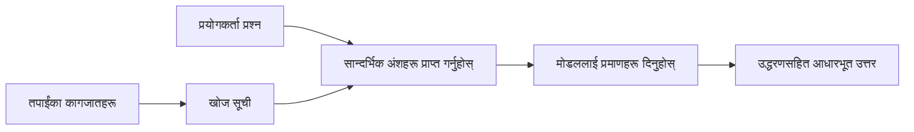

# तपाइँका कागजातहरूमा आधारित प्रश्नहरूको उत्तर दिन AI सिकाउनुहोस्:
## श्रृंखला १: RAG, Azure बनाम खुला स्रोत विकल्पहरू, र कहिले फाइन-ट्यूनिंग उपयुक्त हुन्छ

> मेरो २०२३ को Azure AI Search + Azure OpenAI कागजात QA ट्यूटोरियलहरू पुनरावलोकन गर्ने २०२६ को श्रृंखलाको पहिलो लेख।

## १. परिचय - पहिलेको RAG ट्यूटोरियललाई पुनरावलोकन गर्दै

२०२३ मा, मैले Azure AI Search र Azure OpenAI प्रयोग गरेर PDF कागजातहरूबाट प्रश्नहरूको उत्तर दिन ChatGPT सिकाउने दुई ट्यूटोरियलमा काम गरें। मैले [LangChain संस्करण](https://techcommunity.microsoft.com/blog/educatordeveloperblog/teach-chatgpt-to-answer-questions-using-azure-ai-search--azure-openai-lang-chain/3969713) लेखें, र मैले सहलेखकता गरी [Semantic Kernel संस्करण](https://techcommunity.microsoft.com/blog/educatordeveloperblog/teach-chatgpt-to-answer-questions-using-azure-ai-search--azure-openai-semantic-k/3985395) [ली स्टट](https://developer.microsoft.com/en-us/advocates/lee-stott) सँग गरें, जो Microsoft का एक Principal Cloud Advocate Manager हुन्। त्यो बेलामा, "तपाइँको डेटा मा ChatGPT" को अवधारणा धेरै विकासकर्ताहरूका लागि अझै नयाँ जस्तो थियो। ट्यूटोरियलहरूले Azure Blob Storage, Azure AI Search, Azure OpenAI, LangChain, Semantic Kernel, र FAISS-शैली भेक्टर रिट्राइवल प्रयोग गरेर PDF फाइलहरूबाट प्रश्नहरूको उत्तर दिइन्थ्यो।

त्यो पहिलेको लेखले एउटा सरल तर महत्वपूर्ण कार्यप्रवाहमा ध्यान केन्द्रित गर्यो: कागजातहरू अपलोड गर्ने, तिनीहरूलाई अनुक्रमणिका गर्ने, सान्दर्भिक सामग्री पुनःप्राप्त गर्ने, र त्यो सामग्रीको आधारमा मोडेललाई प्रश्नको उत्तर दिन माग्ने।

२०२६ मा, RAG इकोसिस्टम धेरै विकसित भएको छ। Azure AI Search अहिले आधुनिक भेक्टर र हाइब्रिड रिट्राइवल ढाँचाहरूसँग समर्थन गर्छ, Azure OpenAI Microsoft Foundry Models को व्यापक इकोसिस्टमको हिस्सा भयो, र नयाँ v1 API ले मासिक `api-version` परिवर्तनहरू बिना नै मानक OpenAI क्लाएन्ट प्रयोग गर्न सक्छ। त्यस्तै, LangGraph, LlamaIndex, Haystack, Qdrant, Milvus, Weaviate, Chroma, Ollama, र vLLM जस्ता खुला स्रोत विकल्पहरूले वास्तविक RAG प्रणालीहरूका लागि व्यवहारिक विकल्पहरू बनेका छन्।

त्यसैले मैले यो विषय पुनरावलोकन गर्न चाहें। प्रश्न मात्र "म RAG कसरी बनाउने?" नभई "मेरो परिस्थितिका लागि कुन आर्किटेक्चर छनौट गर्ने?" हो।

तर मूल समस्या अपरिवर्तित छ।

एआई मोडेलले तपाइँका कागजातहरू स्वतः थाहा पाउँदैन। उपयोगी कागजात-प्रश्न-उत्तर प्रणाली बनाउन, तपाइँलाई अझै भरपर्दो रिट्राइवल, ग्राउन्डिङ, मूल्याङ्कन र सञ्चालन कार्यप्रवाहहरू चाहिन्छ।

यो लेख अर्को अन्त्य-देखि-अन्त्य "PDF सँग कुराकानी" ट्यूटोरियल होइन। म यो अद्यावधिक गरिएको श्रृंखला शुरु गर्न चाहन्छु जुन प्रश्नसँग: कहिले तपाइँ व्यवस्थापन गरिएको Azure आर्किटेक्चर छनौट गर्ने, कहिले खुला स्रोत RAG स्ट्याक प्रयोग गर्ने, र कहिले फाइन-ट्यूनिंग साँच्चिकै उपयोगी हुन्छ?

यो एक श्रृंखलाको पहिलो लेख हो जसले कागजात-आधारित AI प्रणालीहरू बनाउन सम्बन्धित छ। यस पहिलो भागमा, हामी आर्किटेक्चर निर्णयहरूमा केन्द्रित हुनेछौं: किन RAG महत्त्वपूर्ण छ, Azure-आधारित व्यवस्थापन सेवा कहिले उपयोगी हुन्छन्, खुला स्रोत विकल्पहरू कहिले व्यवहारिक हुन्छन्, र फाइन-ट्यूनिंग कहाँ फिट हुन्छ।

कागजात QA प्रणालीहरू निर्माण र पुनरावलोकन गरेपछि, म एउटा सुन्दर डेमोमा कुन उपकरण राम्रो देखिन्छ भन्दा बढी, कुन आर्किटेक्चर वास्तविक प्रयोगकर्ताहरू, परिवर्तन हुने कागजातहरू, अनुमतिहरू, असफलताहरू, र मर्मतसम्भारसँग टिक्न सक्छ भनेर बढी चासो राख्ने भएको छु।

## २. किन तपाइँको AI लाई खोजी प्रणाली आवश्यक छ

ठूला भाषा मोडेलहरू व्यापक सार्वजनिक र लाइसेन्स प्राप्त डेटा मा प्रशिक्षण गरिन्छ। तिनीहरूले सामान्य विषयहरूबारे धेरै जान्न सक्छन्, तर तपाइँका निजी PDF, आन्तरिक नीति, उद्यम प्रक्रिया, अनुसन्धान अभिलेख, कक्षाकोठा सामग्री, ग्राहक सहयोग नोटहरू, वा हालै अपडेट गरिएको दस्तावेजहरू स्वतः थाहा हुँदैनन्।

RAG को सरल तरिका यस्तो सोच्नुहोस्: मोडेलले प्रत्येक कागजात याद गर्ने अपेक्षा गर्ने सट्टा, हामी यसलाई एक खोजी प्रणाली दिन्छौं। जब प्रयोगकर्ताले प्रश्न सोध्छ, प्रणालीले सबैभन्दा सान्दर्भिक जानकारी पहिले फेला पार्छ, त्यसपछि ती अंशहरूलाई सन्दर्भको रूपमा मोडेललाई दिन्छ।

यो महत्त्वपूर्ण छ किनभने धेरै वास्तविक विश्व ज्ञान स्रोतहरू निजी, निरन्तर परिवर्तन भइरहेका, अनुमति-सम्बन्धी, धेरै प्रणालीहरूमा सञ्चित, धेरै ढाँचामा लेखिएका, र प्रॉम्प्टमा सिधै टाँस्न धेरै ठूलो हुन्छन्।

उदाहरणको लागि, यदि एउटा स्कूल, कम्पनी, वा अनुसन्धान टोलीसँग १०,००० आन्तरिक कागजातहरू छन् भने, मोडेल ती कागजातहरूबाट विश्वसनीय उत्तर दिन सक्दैन जबसम्म प्रणालीले सही समयमा सही हिस्साहरू पुनःप्राप्त गर्दैन।

यसले प्रायः एउटा सामान्य प्रश्न निम्त्याउँछ:

किन केवल फाइन-ट्यून नगर्ने?

फाइन-ट्यूनिंग उपयोगी हुन सक्छ, तर यो सामान्यतः कागजात ज्ञानको लागि पहिलो सही उपकरण हुँदैन। यदि ज्ञान अक्सर परिवर्तन हुन्छ, उद्धरणहरू महत्त्वपूर्ण छन्, वा पहुँच अनुमति महत्त्वपूर्ण छ भने RAG सामान्यतया राम्रो शुरुवाती बिन्दु हो। फाइन-ट्यूनिंग व्यवहार, शैली, उत्पादन ढाँचा, र कार्य नमूनाहरू सिकाउनका लागि उपयुक्त हुन्छ।

## ३. व्यवहारमा RAG आर्किटेक्चर

कल्पना गर्नुहोस् तपाइँ स्कूलको एक एआई सहायक बनाउँदै हुनुहुन्छ। सहायकले नीति PDF, कोर्स गाइडहरू, आन्तरिक FAQ पृष्ठहरू, र हालै अपडेट गरिएको सूचनाहरूबाट प्रश्नहरूको उत्तर दिनैपर्छ।

यदि कुनै विद्यार्थीले सोधे, "के म मेरो अन्तिम असाइनमेन्टका लागि जनरेटिभ AI प्रयोग गर्न सक्छु?", प्रणाली मोडेलको सामान्य मेमोरीबाट उत्तर दिनु हुँदैन। यसले पहिले सम्बन्धित स्कूल नीति फेला पार्नु पर्छ, AI प्रयोग सम्बन्धी भाग पुनःप्राप्त गर्नु पर्छ, र त्यस प्रमाणका आधारमा मोडेललाई उत्तर दिन भन्नु पर्छ।

त्यो हो व्यवहारमा RAG।

उच्च स्तरमा, तपाइँ यो फ्लो यसरी सोच्न सक्नुहुन्छ:

विवरणहरू थप जटिल हुन सक्छन्, तर मूल विचार सरल छ: मोडेल एक्लैले उत्तर दिंदैन। यो पुनःप्राप्त प्रमाण सहित उत्तर दिन्छ।

पहिले, कागजातहरू जस्तै Azure Blob Storage, SharePoint, GitHub, वा आन्तरिक CMS बाट आयात गरिन्छ। त्यसपछि प्रणाली तिनीहरूलाई टेक्स्टमा पार्स गर्दछ र शीर्षक, पृष्ठ संख्या, तालिका, खण्डहरू, र स्रोत स्थान जस्ता उपयोगी संरचना संरक्षण गर्छ।

अर्को, सामग्रीलाई टुक्रामा विभाजित गरिन्छ। यो चरण सरल जस्तो लाग्छ, तर यो प्रणालीको सबैभन्दा महत्वपूर्ण भागहरू मध्ये एक हो। यदि टुक्रा धेरै सानो भयो भने, वरपरको सन्दर्भ हराउन सक्छ। टुक्रा धेरै ठूलो भयो भने, अनसंगत जानकारी समावेश हुन सक्छ र पुनःप्राप्ति कम सटीक हुन्छ।

टुक्रा बनाइसकेपछि, प्रणालीले एम्बेडिङ बनाउँछ र तिनीहरूलाई खोज्न मिल्ने अनुक्रमणिकामा मूल टेक्स्ट र मेटाडाटा जस्तै फाइल नाम, पृष्ठ संख्या, अनुमति, कागजात संस्करण, र स्रोत URL सँग समावेश गरेर भण्डारण गर्छ।

जब प्रयोगकर्ताले प्रश्न सोध्छ, प्रणाली शब्दावली खोजी, भेक्टर खोजी, वा हाइब्रिड खोजी प्रयोग गरेर उम्मेदवार टुक्राहरू पुनःप्राप्त गर्छ। पुनःक्रमणकर्ता (reranker) ले ती टुक्राहरूलाई पुनःक्रमित गर्न सक्छ जसले सबैभन्दा उपयोगी प्रमाण माथि ल्याउछ।

अन्तमा, मोडेलले प्रश्न र पुनःप्राप्त प्रमाण प्राप्त गर्छ। उत्तर त्यस प्रमाणमा आधारित हुनु पर्छ र प्रयोगकर्ताले स्रोत जाँच्न सकून् भनी उद्धरण फिर्ता दिनु पर्छ।

महत्त्वपूर्ण कुरा के हो भने RAG केवल "PDF लाई भेक्टर डाटाबेसमा राख्नु" मात्र होइन। उत्तरको गुणस्तर सम्पूर्ण कार्यप्रवाहमा निर्भर गर्दछ: पार्सिङ, टुक्रा बनाउने, पुनःप्राप्ति, पुनःक्रमण, प्रॉम्प्टिङ, उद्धरण, र मूल्याङ्कन।

त्यसैले कागजात संरचनाले महत्त्व राख्छ। PDF मा, शीर्षक, तालिका, फुटनोट, वा पृष्ठ सीमा एक अंशको अर्थ परिवर्तन गर्न सक्छ। Azure मा, Document Layout skill ले Azure Document Intelligence ले आउट कौशल प्रयोग गरेर संरचनासँग परिचित आउटपुट उत्पादन गर्दछ, जसले RAG प्रणालीहरूको लागि टुक्रा बनाउने र पुनःप्राप्तिको गुणस्तर सुधार गर्न सक्छ।

## ४. २०२३ पछि के के परिवर्तन भयो?

२०२३ को ट्यूटोरियल त्यतिबेला राम्रो शुरुवात थियो:

- Azure Blob Storage ले PDF फाइलहरू भण्डारण गर्यो।
- Azure AI Search ले सामग्री अनुक्रमणिका गर्यो।
- LangChain ले Azure OpenAI सँग पुनःप्राप्ति जोड्यो।
- FAISS ले सरल स्थानीय भेक्टर स्टोरको रूपमा काम गर्यो।
- उदाहरणमा `gpt-35-turbo` र `text-embedding-ada-002` प्रयोग गरियो।

२०२६ मा, आधुनिक संस्करणले धेरै परिवर्तनहरू समावेश गर्नुपर्छ।

पहिले, पुनःप्राप्ति परिपक्व भयो। २०२३ मा धेरै डेमोहरूले सरल भेक्टर समानता खोज प्रयोग गर्थे। आज, गम्भीर कागजात QA का लागि हाइब्रिड पुनःप्राप्ति प्रायः डिफल्ट हो। Azure AI Search शब्दावली र भेक्टर क्वेरीहरू एकै अनुरोधमा संयोजन गरी Reciprocal Rank Fusion द्वारा परिणामहरू मर्ज गर्न समर्थन गर्दछ। Semantic ranker ले पूर्ण-पाठ, भेक्टर र हाइब्रिड नतिजाहरूको टेक्स्ट पक्ष पुनःक्रमण गर्न सक्छ।

दोस्रो, आयात प्रक्रिया थप परिष्कृत भयो। प्रत्येक कागजातलाई म्यानुअली विभाजन गर्ने सट्टा, Azure AI Search ले एकीकृत भेक्टराइजेशन समर्थन गर्छ टुक्रा बनाउने, एम्बेडिङ गर्ने, र क्वेरी-समय भेक्टराइजेसनका लागि। PDF र दस्तावेज-भारी कार्यभारका लागि Document Layout skill ले निश्चित साइज टुक्राहरूभन्दा बढी संरचना संरक्षण गर्न सक्छ।

तेस्रो, समन्वय (ओर्केस्ट्रेशन) अझ महत्त्वपूर्ण भयो। कठिन भाग प्रायः LLM API कल आफैं हुँदैन। कठिन भाग असफलता, पुनः प्रयास, पुरानो पुनःप्राप्ति, टुक्रा गुणस्तर, लामो-समय चल्ने कार्यप्रवाह, मानव समीक्षा, र ठूलो स्तरमा मूल्याङ्कन ह्यान्डल गर्नु हो। यहाँ LangGraph, LlamaIndex कार्यप्रवाहहरू, Haystack पाइपलाइनहरू, र प्लेटफर्म-स्तर मूल्याङ्कन तथा पर्यवेक्षण उपकरणहरू एक सिङ्गो रैखिक चेन भन्दा बढी सान्दर्भिक हुन्छन्।

चौथो, मूल्याङ्कन अब ऐच्छिक छैन। एक प्रश्नमा डेमो प्रभावशाली देखिन सक्छ। तर उत्पादन प्रणालीलाई परीक्षण सेटहरू, रेग्रेसन जाँच, पुनःप्राप्ति मेट्रिक्स, ग्राउन्डिङ जाँच, र निगरानी चाहिन्छ। मूल्याङ्कन बिना, प्रणाली सुधार भइरहेको छ वा केवल परिवर्तन भइरहेको छ भनी थाहा पाउन गाह्रो छ।

## ५. Azure र खुला स्रोत RAG स्ट्याकहरू बीच छनौट

म यो सोच्छु कि उपयोगी प्रश्न "Azure खुला स्रोत भन्दा राम्रो हो?" वा "खुला स्रोत Azure भन्दा राम्रो हो?" होइन।

उपयोगी प्रश्न छ: तपाइँ कस्तो प्रणाली निर्माण गर्दै हुनुहुन्छ, को यसलाई सञ्चालन गर्नेछ, तपाइँका के प्रतिबन्धहरू छन्, र कुन असफलता स्थितिहरू अस्वीकार्य छन्?

जब मैले कागजात QA उदाहरणहरू बनाउनु शुरू गरें, मैले प्रायः पुनःप्राप्ति काम गर्छ कि गर्दैन सोच्थेँ। के म PDF अपलोड गर्न सक्छु, तिनीहरू खोज्न सक्छु, र उत्तर उत्पन्न गर्न सक्छु? त्यो एउटा उपयुक्त शुरुवात थियो।

तर यथार्थपरक AI कार्यप्रवाहहरूमा काम गर्दा मेरो मूल्याङ्कन परिवर्तन भयो। म अब RAG स्ट्याक छनोट गर्नुअघि चार कुरा हेर्छु:

- पहिचान र अनुमति
- पुनःप्राप्ति गुणस्तर
- कार्यप्रवाह विश्वसनीयता
- सञ्चालन स्वामित्व

यी चार क्षेत्रले मोडेल बेंचमार्क भन्दा धेरै कुरा भन्छन्।

Azure-आधारित आर्किटेक्चरहरू प्रायः तब उपयुक्त हुन्छन् जब उद्यम एकीकरण कठिन हुन्छ। यदि टोली पहिले देखि Microsoft Entra ID, Microsoft 365, Azure Storage, निजी नेटवर्किङ, RBAC, र Azure निगरानीमा भर पर्छ भने Azure AI Search र Azure OpenAI ले अपरेशन जटिलता धेरै घटाउन सक्छ। त्यो वातावरणमा Azure केवल मोडेल API होइन। मूल्य चारैतिरको प्रणालीमा छ: पहिचान, शासन, व्यवस्थापन गरिएको खोज, सुरक्षा एकीकरण, समर्थन, र परिचित सञ्चालनहरू।

खुला स्रोत आर्किटेक्चरहरू प्रायः तब उपयुक्त हुन्छन् जब लचिलोपन महत्वपूर्ण हुन्छ। यदि टोलीलाई स्थानीय इन्फेरेन्स, क्लाउड पोर्टेबिलिटी, अनुकूल पुनःप्राप्ति पाइपलाइन, विशिष्ट पुनःक्रमण, वा भेक्टर डाटाबेस र मोडेल-सेविङ तहमाथि प्रत्यक्ष नियन्त्रण चाहिन्छ भने खुला स्रोत स्ट्याक राम्रो विकल्प हुन सक्छ। यसको सट्टामा टोलीले बढी विश्वसनीयता कार्यका मालिक हुनुपर्छ: ब्याकअप, स्केलिङ, लेटेन्सी, माइग्रेशन, निगरानी, र सुरक्षा।

व्यवहारमा, धेरै उत्पादन AI प्रणालीहरू पूर्ण रूपमा क्लाउड-नेटीभ वा पूर्ण रूपमा खुला स्रोत हुँदैनन्। तिनीहरू प्रायः अपरेशन सरलता, पोर्टेबिलिटी, शासन, र इन्जिनियरिङ लचिलोपन सन्तुलन गर्ने हाइब्रिड प्रणाली हुन्छन्।

उदाहरणका लागि, म आश्चर्य मान्दिन यदि एउटा प्रणालीले मोडेल पहुँचका लागि Azure OpenAI, कार्यप्रवाह समन्वयका लागि LangGraph, डिप्लोयमेन्टका लागि Azure होस्टिङ, र विशिष्ट पुनःप्राप्ति आवश्यकताको लागि खुला स्रोत भेक्टर डाटाबेस प्रयोग गरिरहेको देखेँ भने। त्यो आर्किटेक्चरल असंगति होइन। त्यो प्रणालीको प्रत्येक भागका लागि व्यवस्थापन गरिएको सेवा र इन्जिनियरिङ नियन्त्रणको सही स्तर छनौट हो।

मलाई हाइब्रिड आर्किटेक्चर मनपर्छ जब व्यवस्थापन प्लेटफर्मले महत्वपूर्ण उद्यम समस्याहरू समाधान गर्छ र खुला स्रोत कम्पोनेन्टहरूले टोलीलाई वास्तविक आवश्यक ठाउँहरूमा लचिलोपन दिन्छ।

## ६. व्यावहारिक निर्णय मार्गनिर्देश

यहाँ निर्णय तालिका छ जुन म RAG स्ट्याक छनोट गर्नु अघि टोलीसँग प्रयोग गर्नेछु:

| निर्णय क्षेत्र | Azure व्यवस्थापित स्ट्याक बलियो छ जब... | खुला स्रोत स्ट्याक बलियो छ जब... |
| --- | --- | --- |
| पहिचान र पहुँच | Entra ID, RBAC, व्यवस्थापन गरिएको पहिचान, र उद्यम अनुमति केन्द्रीय हुन्छ | अनुकूल प्रमाणीकरण, गैर-Microsoft पहिचान, वा एप-विशेष पहुँच तर्क प्रमुख हुन्छ |
| सञ्चालन | टोलीले व्यवस्थापन गरिएको पूर्वाधार, समर्थन, SLA, र सजिलो सुरुवात चाहन्छ | टोलीले भेक्टर डाटाबेस, मोडेल सेवा, ब्याकअप, र स्केलिङ सञ्चालन गर्न सक्छ |
| पुनःप्राप्ति | हाइब्रिड खोज, सैमेन्टिक रैंकिङ, फिल्टरहरू, र मेटाडाटा खोज अधिकांश आवश्यकताहरू पूरा गर्छ | टोलीलाई अनुकूल पुनःप्राप्ति, विशिष्ट पुनःक्रमण, वा प्रयोगात्मक अनुक्रमण आवश्यक छ |
| पोर्टेबिलिटी | Azure पारिस्थितिकी तन्त्रसँग मेल खाने वा प्राथमिकता छ | क्लाउड लक-इनबाट बच्नु आवश्यक छ |
| इन्फेरेन्स | Azure OpenAI शासन, नेटवर्किङ, र उद्यम नियन्त्रण महत्त्वपूर्ण छ | स्थानीय इन्फेरेन्स, कस्टम मोडेलहरू, वा स्व-होस्टेड सेवा आवश्यक छ |
| लागत | इन्जिनियरिङ र सञ्चालन प्रयास घटाउनु महत्त्वपूर्ण छ | स्केल त्यति ठूलो छ कि पूर्वाधार अनुकूलन आवश्यक छ |
| परीक्षण | स्थिरता र उद्यम एकीकरण बढी महत्त्वपूर्ण छ | टोली एजेन्ट, उपकरण, मेमोरी, र पुनःप्राप्ति कार्यप्रवाहमा तीव्रता विकास गर्दैछ |

मेरा नियमहरू सरल छन्:

- उद्यम एकीकरण, सुरक्षा, र सञ्चालन सरलता मुख्य जोखिम हुँदा Azure बाट सुरु गर्नुहोस्।
- पोर्टेबिलिटी, अनुकूलन, वा स्थानीय नियन्त्रण मुख्य जोखिम हुँदा खुला स्रोतबाट सुरु गर्नुहोस्।
- दुवै सही हुँदा हाइब्रिड स्ट्याक प्रयोग गर्नुहोस्।

यसैले म २०२६ को RAG श्रृंखला कोडबाट सुरु गर्नु हुन्न। कोड महत्त्वपूर्ण छ, तर आर्किटेक्चर छनोट कार्यान्वयनअघि आउँछ। सरल डेमोले सबैभन्दा कठिन छनौट लुकाउन सक्छ। राम्रो RAG प्रणालीले ती विकल्पहरू स्पष्ट पार्छ।

## ७. फाइन-ट्यूनिंग कहाँ फिट हुन्छ

फाइन-ट्यूनिंग प्रायः RAG सँगै उल्लेख गरिन्छ, तर म यी दुई छुट्याउनु महत्त्वपूर्ण ठान्छु।

RAG अधिकांश अवस्थामा राम्रो विकल्प हुन्छ जब प्रणालीलाई ताजा, निजी, अनुमति-संवेदनशील, वा स्रोत-आधारित ज्ञान आवश्यक हुन्छ। यदि उत्तरले कागजात उद्धृत गर्नुपर्ने हुन्छ, हालैको अपडेट प्रतिबिम्बित गर्नुपर्छ, वा प्रयोगकर्ताको-विशेष पहुँच नियमहरू सम्मान गर्नुपर्छ भने पुनःप्राप्ति आर्किटेक्चरको हिस्सा हुनुपर्छ।

फाइन-ट्यूनिंग तब उपयोगी हुन्छ जब ज्ञान मुख्य समस्या होइन। यो मद्दत गर्न सक्छ जब तपाइँ चाहनुहुन्छ मोडेलले विशेष उत्पादन ढाँचा अनुसरण गरोस्, डोमेन-विशेष प्रतिक्रिया शैली मेल खाओस्, स्थिर कार्यलाई बढी कन्सिस्टेन्ट रूपमा प्रदर्शन गरोस्, वा प्रत्येक प्रॉम्प्टमा आवश्यक निर्देशनको मात्रा घटाओस्।
व्यवहारमा, दुइटा एकसाथ काम गर्न सक्छन्। एक समर्थन सहायकले नवीनतम नीति पुनःप्राप्त गर्न RAG प्रयोग गर्न सक्छ, जबकि एक राम्रोसँग ट्यून गरिएको मोडेल कम्पनीको रुचाइएको उत्तर संरचना र टोन सिक्छ।

गल्ती भनेको राम्रो ट्यूनिंगलाई कागजात भण्डारको विकल्पको रूपमा मान्नु हो। जब प्रणालीले ताजा, निजी, वा अनुमति-संवेदनशील डाटाबाट उत्तर दिनुपर्छ, पुनःप्राप्तिको आवश्यकता हट्दैन।

## ८. यस श्रृंखलाले कहाँ जानेछ

यस लेखले निर्णय-निर्माण तह हो। कोड लेख्दै अघि, म व्यापारिक सौदाबाजीहरू स्पष्ट बनाउन चाहन्थें: RAG विरुद्ध राम्रो ट्यूनिंग, Azure विरुद्ध खुला स्रोत, प्रबन्धित सेवा विरुद्ध संचालन नियन्त्रण।

कार्यान्वयनमा जान अघि, म यहाँ एउटा बुँदा छोड्न चाहन्छु: धेरै एन्त्रप्राइज AI प्रणालीहरूमा, मोडेल मात्र एक घटक हो। पुनःप्राप्ति गुणस्तर, व्यवस्थापन, मूल्याङ्कन, अनुमति, र परिचालन विश्वसनीयताले प्रायः प्रणाली डेमो चरणभन्दा पर सफल हुन्छ कि हुँदैन निर्धारण गर्छ।

यस श्रृंखलाका आगामी भागहरूमा, म कागजात-आधारित AI प्रणालीहरूको व्यवहारिक पक्षमा गहिराइमा जान योजना बनाउँदैछु: Azure-आधारित वास्तुकला कसरी निर्माण गर्ने, खुला स्रोत विकल्पहरूले व्यवहारमा कसरी प्रतिस्पर्धा गर्छन्, र RAG प्रणाली साँच्चै काम गरिरहेको छ कि छैन कसरी मूल्याङ्कन गर्ने।

श्रृंखला विकास हुँदै जाँदा म क्रम समायोजन गर्न सक्छु, तर लक्ष्य एउटै रहनेछ: एउटा साधारण डेमो भन्दा माथि बढेर त्यस्ता RAG प्रणालीहरू कसरी सोच्ने भनेर देखाउने जसलाई मर्मत, मूल्याङ्कन, र सञ्चालन गर्न सकिन्छ।

## ९. सन्दर्भहरू र स्रोतहरू

मूल ट्युटोरियलहरू:

- [Teach ChatGPT to Answer Questions: Using Azure AI Search & Azure OpenAI (Lang Chain)](https://techcommunity.microsoft.com/blog/educatordeveloperblog/teach-chatgpt-to-answer-questions-using-azure-ai-search--azure-openai-lang-chain/3969713)
- [Teach ChatGPT to Answer Questions: Using Azure AI Search & Azure OpenAI (Semantic Kernel)](https://techcommunity.microsoft.com/blog/educatordeveloperblog/teach-chatgpt-to-answer-questions-using-azure-ai-search--azure-openai-semantic-k/3985395)

Azure:

- [Azure AI Search REST API versions](https://learn.microsoft.com/en-us/rest/api/searchservice/search-service-api-versions)
- [Hybrid search in Azure AI Search](https://learn.microsoft.com/en-us/azure/search/hybrid-search-how-to-query)
- [Integrated vectorization in Azure AI Search](https://learn.microsoft.com/en-us/azure/search/vector-search-integrated-vectorization)
- [Document Layout skill in Azure AI Search](https://learn.microsoft.com/en-us/azure/search/cognitive-search-skill-document-intelligence-layout)
- [Chunk and vectorize by document layout](https://learn.microsoft.com/en-us/azure/search/search-how-to-semantic-chunking)
- [Semantic ranking in Azure AI Search](https://learn.microsoft.com/en-us/azure/search/semantic-search-overview)
- [Azure OpenAI / Microsoft Foundry API version lifecycle](https://learn.microsoft.com/en-us/azure/foundry/openai/api-version-lifecycle)
- [Foundry Models sold by Azure](https://learn.microsoft.com/en-us/azure/foundry/foundry-models/concepts/models-sold-directly-by-azure)
- [Microsoft Foundry fine-tuning considerations](https://learn.microsoft.com/en-us/azure/foundry/openai/concepts/fine-tuning-considerations)
- [Microsoft Foundry observability](https://learn.microsoft.com/en-us/azure/foundry/concepts/observability)
- [Run evaluations in Microsoft Foundry](https://learn.microsoft.com/en-us/azure/foundry/how-to/evaluate-generative-ai-app)

खुला स्रोत:

- [LangGraph documentation](https://docs.langchain.com/oss/python/langgraph/overview)
- [LlamaIndex documentation](https://developers.llamaindex.ai/python/framework/)
- [Haystack documentation](https://docs.haystack.deepset.ai/)
- [Qdrant documentation](https://qdrant.tech/documentation/overview/)
- [Milvus documentation](https://milvus.io/docs/overview.md)
- [Weaviate documentation](https://docs.weaviate.io/weaviate/current/)
- [Chroma documentation](https://docs.trychroma.com/docs/overview/introduction)
- [Ollama embeddings](https://docs.ollama.com/capabilities/embeddings)
- [vLLM OpenAI-compatible server](https://docs.vllm.ai/en/latest/serving/openai_compatible_server.html)
- [BGE embedding models](https://huggingface.co/BAAI/bge-large-en-v1.5)
- [E5 embedding models](https://huggingface.co/intfloat/e5-large-v2)
- [Instructor embedding models](https://huggingface.co/hkunlp/instructor-large)

---

<!-- CO-OP TRANSLATOR DISCLAIMER START -->
**अस्वीकरण**:
यो दस्तावेज़ AI अनुवाद सेवा [Co-op Translator](https://github.com/Azure/co-op-translator) प्रयोग गरेर अनुवाद गरिएको हो। हामी सही हुन प्रयास गर्छौं, तर कृपया जानकार हुनुस् कि स्वचालित अनुवादमा त्रुटिहरू वा अशुद्धताहरू हुन सक्छन्। मूल दस्तावेज़ यसको मूल भाषामा आधिकारिक स्रोत मानिनुपर्छ। महत्वपूर्ण जानकारीका लागि व्यावसायिक मानव अनुवाद सिफारिस गरिन्छ। यस अनुवादको प्रयोगबाट उत्पन्न कुनै पनि गलत बुझाइ वा त्रुटिको लागि हामी जिम्मेवार छैनौं।
<!-- CO-OP TRANSLATOR DISCLAIMER END -->