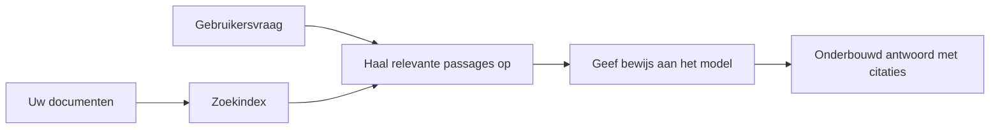

# Leer AI vragen beantwoorden op basis van uw documenten:
## Serie 1: RAG, Azure vs open-source alternatieven, en wanneer fine-tuning zinvol is

> Het eerste artikel in een serie van 2026 die mijn Azure AI Search + Azure OpenAI document QA tutorials uit 2023 herbekijkt.

Serienavigatie: [Repository home](../README.md) | Volgende: [Serie 2 - Bouw een lokaal open-source RAG-systeem van begin tot eind](./series-2-open-source-rag-end-to-end.md)

## 1. Intro - Een eerdere RAG-tutorial herbekijken

In 2023 werkte ik aan een paar tutorials over het leren van ChatGPT om vragen te beantwoorden uit PDF-documenten met behulp van Azure AI Search en Azure OpenAI. Ik schreef de [LangChain-versie](https://techcommunity.microsoft.com/blog/educatordeveloperblog/teach-chatgpt-to-answer-questions-using-azure-ai-search--azure-openai-lang-chain/3969713), en ik was ook co-auteur van de bijbehorende [Semantic Kernel-versie](https://techcommunity.microsoft.com/blog/educatordeveloperblog/teach-chatgpt-to-answer-questions-using-azure-ai-search--azure-openai-semantic-k/3985395) samen met [Lee Stott](https://developer.microsoft.com/en-us/advocates/lee-stott), Principal Cloud Advocate Manager bij Microsoft. Destijds voelde het idee van "ChatGPT op jouw data" nog nieuw aan voor veel ontwikkelaars. De tutorials gebruikten Azure Blob Storage, Azure AI Search, Azure OpenAI, LangChain, Semantic Kernel en FAISS-achtige vector retrieval om vragen uit PDF-bestanden te beantwoorden.

Dat eerdere artikel richtte zich op een eenvoudige maar belangrijke workflow: documenten uploaden, indexeren, relevante inhoud ophalen, en een model vragen gebaseerd op die inhoud te antwoorden.

In 2026 is het RAG-ecosysteem aanzienlijk gegroeid. Azure AI Search ondersteunt nu moderne vector- en hybride retrievalpatronen, Azure OpenAI maakt deel uit van het bredere Microsoft Foundry Models-ecosysteem, en de nieuwere v1 API kan de standaard OpenAI-client gebruiken zonder maandelijkse `api-version` wijzigingen te vereisen. Tegelijkertijd zijn open-source opties zoals LangGraph, LlamaIndex, Haystack, Qdrant, Milvus, Weaviate, Chroma, Ollama en vLLM praktisch geworden voor echte RAG-systemen.

Daarom wilde ik dit onderwerp opnieuw behandelen. De vraag is niet langer alleen "Hoe bouw ik RAG?" Er zijn nu vele manieren om het te bouwen, en de belangrijkere vraag is "Welke architectuur moet ik kiezen voor mijn situatie?"

Maar het kernprobleem is niet veranderd.

Een AI-model weet niet automatisch uw documenten. Om een nuttig document-antwoord-systeem te bouwen, heeft u nog steeds betrouwbare retrieval, verankering, evaluatie en operationele workflows nodig.

Dit artikel is geen nieuwe end-to-end "chat met PDF" tutorial. Ik wil deze geüpdatete serie beginnen met de vraag die ik nu belangrijker vind: wanneer kiest u voor een beheerde Azure-architectuur, wanneer kiest u een open-source RAG-stack, en wanneer is fine-tuning eigenlijk zinvol?

Dit is het eerste artikel in een serie over het bouwen van document-gegronde AI-systemen. In dit eerste deel focussen we op architectuurkeuzes: waarom RAG belangrijk is, wanneer Azure-gebaseerde beheerde services nuttig zijn, wanneer open-source alternatieven zinvol zijn, en waar fine-tuning past.

Na het bouwen en herbekijken van document QA-systemen ben ik minder geïnteresseerd in welk gereedschap er het beste uitziet in een demo en meer in welke architectuur echte gebruikers, veranderende documenten, permissies, fouten en onderhoud overleeft.

## 2. Waarom uw AI een zoek-systeem nodig heeft

Grote taalmodellen zijn getraind op brede openbare en gelicenseerde data. Ze weten mogelijk veel over algemene onderwerpen, maar kennen uw privé PDFs, interne beleidsregels, procedures binnen het bedrijf, onderzoeksarchieven, lesmateriaal, klantondersteuningsnotities of recent bijgewerkte documentatie niet automatisch.

Een eenvoudige manier om RAG te begrijpen is dit: in plaats van te verwachten dat het model zich elk document herinnert, geven we het een zoek-systeem. Wanneer een gebruiker een vraag stelt, vindt het systeem eerst de meest relevante stukjes informatie en geeft die als context aan het model.

Dit is belangrijk omdat veel kennisbronnen in de echte wereld privé, voortdurend veranderend, met toegangsrechten, opgeslagen over meerdere systemen, in veel formaten geschreven, en te groot zijn om direct in een prompt te plakken.

Bijvoorbeeld, als een school, bedrijf of onderzoeksteam 10.000 interne documenten heeft, kan het model niet betrouwbaar antwoorden uit die documenten tenzij het systeem de juiste delen op het juiste moment ophaalt.

Dit leidt natuurlijk tot een veelgestelde vraag:

Waarom zou je het model niet gewoon fine-tunen?

Fine-tuning kan nuttig zijn, maar is meestal niet het juiste eerste hulpmiddel voor documentkennis. Als de kennis vaak verandert, als bronvermeldingen belangrijk zijn, of als toegangsrechten van belang zijn, is RAG meestal het betere startpunt. Fine-tuning is beter geschikt om gedrag, stijl, outputformaat en taakpatronen aan te leren.

## 3. RAG-architectuur in de praktijk

Stel dat u een AI-assistent bouwt voor een school. De assistent moet vragen beantwoorden uit beleids-PDF’s, cursusgidsen, interne FAQ-pagina’s en recent bijgewerkte aankondigingen.

Als een student vraagt: "Mag ik generatieve AI gebruiken voor mijn eindopdracht?", mag het systeem niet antwoorden vanuit het algemene geheugen van het model. Het moet eerst het relevante schoolbeleid vinden, de sectie over AI-gebruik ophalen, en dan het model vragen om te antwoorden met dat bewijs.

Dat is RAG in de praktijk.

Op hoog niveau kunt u de flow als volgt zien:

De details kunnen complexer worden, maar het basisidee is eenvoudig: het model antwoordt niet alleen. Het antwoordt met opgehaald bewijs.

Eerst worden documenten ingelezen vanuit opslagsystemen zoals Azure Blob Storage, SharePoint, GitHub of een intern CMS. Daarna parsed het systeem ze naar tekst terwijl nuttige structuur zoals koppen, paginanummers, tabellen, secties en bronlocaties behouden blijven.

Vervolgens wordt de inhoud in stukken verdeeld. Deze stap klinkt eenvoudig, maar is een van de belangrijkste onderdelen van het systeem. Als een stuk te klein is, kan het omliggende context missen. Is een stuk te groot, dan kan het niet-gerelateerde informatie bevatten en retrieval minder precies maken.

Na het chunking maakt het systeem embeddings aan en slaat deze op in een doorzoekbare index samen met de originele tekst en metadata zoals bestandsnaam, paginanummer, rechten, documentversie en bron-URL.

Wanneer de gebruiker een vraag stelt, haalt het systeem kandidaat-stukken op via zoekwoorden zoeken, vectorzoekopdrachten of hybride zoekopdrachten. Een reranker kan deze stukken vervolgens herschikken zodat het meest nuttige bewijs bovenaan komt te staan.

Tenslotte krijgt het model de vraag en het opgehaalde bewijs. Het antwoord moet gebaseerd zijn op dat bewijs en bronvermeldingen teruggeven zodat de gebruiker de bron kan bekijken.

Het belangrijkste punt is dat RAG niet alleen "PDF’s in een vectordatabase stoppen" is. De kwaliteit van het antwoord hangt af van de hele workflow: parsing, chunking, retrieval, reranking, prompting, bronvermelding en evaluatie.

Daarom is documentstructuur belangrijk. In een PDF kan een kop, tabel, voetnoot of paginagrenzen de betekenis van een passage veranderen. Op Azure gebruikt de Document Layout-skills de layout-capaciteiten van Azure Document Intelligence om structuur-bewuste output te produceren, wat chunking en retrieval kwaliteit voor RAG-systemen kan verbeteren.

## 4. Wat is er veranderd sinds 2023?

De tutorial uit 2023 was destijds een goed startpunt:

- Azure Blob Storage bewaarde de PDF-bestanden.
- Azure AI Search indexeerde de inhoud.
- LangChain koppelde de retrieval aan Azure OpenAI.
- FAISS werkte als een eenvoudige lokale vectordatabase.
- Het voorbeeld gebruikte `gpt-35-turbo` en `text-embedding-ada-002`.

In 2026 zou een moderne versie verschillende veranderingen moeten weerspiegelen.

Ten eerste is retrieval volwassener geworden. In 2023 gebruikten veel demo’s simpele vector-similariteitszoekopdrachten. Vandaag is hybride retrieval vaak het standaard startpunt voor serieuze document QA. Azure AI Search ondersteunt hybride zoekopdrachten door zoekwoorden en vector queries te combineren in een enkele aanvraag en resultaten te combineren met Reciprocal Rank Fusion. Een semantische ranker kan dan de tekstzijde van full-text, vector- en hybride resultaten herschikken.

Ten tweede is het inlezen (ingestie) verfijnder. In plaats van elk document handmatig met applicatiecode te splitten, ondersteunt Azure AI Search geïntegreerde vectorisatie voor chunking, embedding en query-time vectorisatie. Voor PDF's en documentrijke workloads kan de Document Layout-skills meer structuur behouden dan chunks van vaste grootte.

Ten derde wordt orkestratie belangrijker. Het lastige deel is vaak niet de LLM API-aanroep zelf. Het lastige is het afhandelen van fouten, herhalingen, verouderde retrievals, chunk-kwaliteit, langdurige workflows, menselijke beoordeling en evaluatie op schaal. Dit is waar workflow-georiënteerde tools zoals LangGraph, LlamaIndex-workflows, Haystack-pijplijnen en platformniveau evaluatie- en observability tools relevanter worden dan een enkele lineaire keten.

Ten vierde is evaluatie niet langer optioneel. Een demo kan indrukwekkend lijken met één vraag. Een productiesysteem heeft testsets, regressiecontroles, retrievalmetrics, groundednesscontroles en monitoring nodig. Zonder evaluatie is het moeilijk te weten of het systeem verbetert of alleen verandert.

## 5. Kiezen tussen Azure en open-source RAG-stacks

Ik denk niet dat de nuttige vraag is "Is Azure beter dan open source?" of "Is open source beter dan Azure?"

De nuttige vraag is: wat voor systeem bouwt u, wie gaat het beheren, welke beperkingen heeft u, en welke faalmodi zijn onacceptabel?

Toen ik begon met het bouwen van document QA-voorbeelden, dacht ik vooral aan of de retrieval werkte. Kon ik PDF’s uploaden, doorzoeken en een antwoord genereren? Dat was een redelijk startpunt.

Na het doorlopen van realistischere AI-workflows is mijn beoordeling veranderd. Ik kijk nu naar vier zaken voordat ik een RAG-stack kies:

- identiteit en rechten
- retrievalkwaliteit
- workflowbetrouwbaarheid
- operationeel eigenaarschap

Deze vier gebieden vertellen veel meer dan alleen een modelbenchmark.

Azure-gebaseerde architecturen zijn meestal logisch wanneer enterprise-integratie de moeilijke factor is. Als een team al afhankelijk is van Microsoft Entra ID, Microsoft 365, Azure Storage, private networking, RBAC en Azure-monitoring, kan Azure AI Search en Azure OpenAI veel operationele complexiteit verlagen. In die omgeving is Azure niet alleen een model-API. De waarde zit in het omliggende systeem: identiteit, governance, beheerde zoekfunctie, beveiligingsintegratie, ondersteuning en vertrouwde operaties.

Open-source architecturen zijn meestal zinvol wanneer flexibiliteit de hoofdzorg is. Als het team lokale inferentie, cloud-portabiliteit, een aangepaste retrieval-pijplijn, gespecialiseerde reranking, of directe controle over de vectordatabase en model-serving laag nodig heeft, kan een open-source stack een betere keuze zijn. Het nadeel is dat het team meer verantwoording draagt voor betrouwbaarheid: back-ups, schaalvergroting, latency, migraties, monitoring en beveiliging.

In de praktijk zijn veel productie-AI-systemen niet puur cloud-native of puur open-source. Het zijn vaak hybride systemen die operationele eenvoud, draagbaarheid, governance en engineeringflexibiliteit balanceren.

Bijvoorbeeld, ik zou het niet verrassend vinden als een systeem Azure OpenAI gebruikt voor modeltoegang, LangGraph voor workfloworkestratie, Azure-hosting voor deployment en een open-source vectordatabase voor een specifieke retrieval-eis. Dat is geen architectonische inconsistentie. Dat is het kiezen van het juiste niveau van managed service en engineeringcontrole voor elk deel van het systeem.

Ik houd van hybride architecturen als het beheerde platform belangrijke enterpriseproblemen oplost, terwijl open-source componenten het team flexibiliteit geven waar dat echt van belang is.

## 6. Een praktische beslisgids

Hier is de beslissingstabel die ik met een team zou gebruiken voordat ik een RAG-stack kies:

| Beslissingsgebied | Azure beheerde stack is sterker wanneer... | Open-source stack is sterker wanneer... |
| --- | --- | --- |
| Identiteit en toegang | Entra ID, RBAC, beheerde identiteit en enterprise-rechten centraal staan | aangepaste authenticatie, niet-Microsoft identiteit of app-specifieke toegangslogica domineert |
| Operaties | het team beheerde infrastructuur, ondersteuning, SLA’s en eenvoudiger onboarding wil | het team vectordatabases, model-serving, back-ups en schaalvergroting kan beheren |
| Retrieval | hybride zoeken, semantische ranking, filters en metadata-zoeken de meeste behoeften dekken | het team aangepaste retrieval, gespecialiseerde reranking of experimentele indexering nodig heeft |
| Draagbaarheid | afstemming op Azure-ecosysteem acceptabel of gewenst is | cloud lock-in vermijden een harde eis is |
| Inferentie | Azure OpenAI governance, netwerk en enterprise-controles belangrijk zijn | lokale inferentie, eigen modellen of zelfgehoste serving vereist is |
| Kosten | het verminderen van engineering- en operationele inspanning belangrijker is dan infrastructuurtuning | de schaal groot genoeg is om zorgvuldige infrastructuuroptimalisatie te rechtvaardigen |
| Experimentatie | stabiliteit en enterprise-integratie belangrijker zijn dan vaak wisselen van componenten | het team snel iteraties maakt op agents, tools, geheugen en retrieval-workflows |

Mijn vuistregel is eenvoudig:

- Begin met Azure wanneer enterprise-integratie, beveiliging en operationele eenvoud de grootste risico’s zijn.
- Begin met open source wanneer draagbaarheid, maatwerk of lokale controle de grootste risico’s zijn.
- Gebruik een hybride stack als beide waar zijn.

Dit is ook waarom ik een RAG-serie uit 2026 niet met code zou beginnen. Code is belangrijk, maar architectuurkeuze komt voor implementatie. Een simpele demo kan de moeilijkste keuzes verbergen. Een goed RAG-systeem maakt die keuzes expliciet.

## 7. Waar fine-tuning past

Fine-tuning wordt vaak samen met RAG genoemd, maar ik denk dat het belangrijk is de twee te scheiden.

RAG is meestal de betere keuze wanneer het systeem verse, privé, rechten-gevoelige of op bronnen gebaseerde kennis nodig heeft. Als het antwoord documenten zou moeten citeren, recente updates zou moeten weerspiegelen, of gebruikersspecifieke toegangsregels respecteren, moet retrieval deel uitmaken van de architectuur.
Fijn afstemmen is nuttiger wanneer kennis niet het belangrijkste probleem is. Het kan helpen wanneer je wilt dat het model een specifiek uitvoerformaat volgt, overeenkomt met een domeinspecifieke antwoordstijl, een stabiele taak consistenter uitvoert, of de hoeveelheid instructies die in elke prompt nodig zijn vermindert.

In de praktijk kunnen de twee samenwerken. Een ondersteuningsassistent kan RAG gebruiken om het laatste beleid te vinden, terwijl een fijn afgestemd model de door het bedrijf gewenste antwoordstructuur en toon leert.

De fout is om fijn afstemmen te behandelen als een vervanging voor een documentopslag. Het vervangt niet de noodzaak voor ophalen wanneer het systeem moet antwoorden op basis van verse, privé of toestemminggevoelige gegevens.

## 8. Waar deze serie hierna heen gaat

Dit artikel is de beslissingslaag. Voor het schrijven van code wilde ik de afwegingen expliciet maken: RAG versus fijn afstemmen, Azure versus open source, beheerde diensten versus operationele controle.

Voordat ik met de implementatie begin, wil ik hier één punt achterlaten: in veel enterprise AI-systemen is het model slechts één component. De kwaliteit van ophalen, orkestratie, evaluatie, permissies en operationele betrouwbaarheid bepalen vaak of het systeem verder komt dan de demo-fase.

In de volgende delen van deze serie ben ik van plan dieper in te gaan op de praktische kant van document-onderbouwde AI-systemen: eerst het bouwen van een lokale open-source RAG-werkstroom, daarna het opnieuw bouwen van hetzelfde scenario met Azure AI Search en Azure OpenAI, en vervolgens evalueren of het systeem daadwerkelijk werkt.

Ik kan de volgorde aanpassen naarmate de serie zich ontwikkelt, maar het doel blijft hetzelfde: verder gaan dan een simpele demo en laten zien hoe je moet nadenken over RAG-systemen die kunnen worden onderhouden, geëvalueerd en bediend.

## 9. Referenties en bronnen

Originele tutorials:

- [Teach ChatGPT to Answer Questions: Using Azure AI Search & Azure OpenAI (Lang Chain)](https://techcommunity.microsoft.com/blog/educatordeveloperblog/teach-chatgpt-to-answer-questions-using-azure-ai-search--azure-openai-lang-chain/3969713)
- [Teach ChatGPT to Answer Questions: Using Azure AI Search & Azure OpenAI (Semantic Kernel)](https://techcommunity.microsoft.com/blog/educatordeveloperblog/teach-chatgpt-to-answer-questions-using-azure-ai-search--azure-openai-semantic-k/3985395)

Azure:

- [Azure AI Search REST API versies](https://learn.microsoft.com/en-us/rest/api/searchservice/search-service-api-versions)
- [Hybride zoeken in Azure AI Search](https://learn.microsoft.com/en-us/azure/search/hybrid-search-how-to-query)
- [Geïntegreerde vectorisering in Azure AI Search](https://learn.microsoft.com/en-us/azure/search/vector-search-integrated-vectorization)
- [Document Layout-skills in Azure AI Search](https://learn.microsoft.com/en-us/azure/search/cognitive-search-skill-document-intelligence-layout)
- [Chunken en vectoriseren op documentlayout](https://learn.microsoft.com/en-us/azure/search/search-how-to-semantic-chunking)
- [Semantische ranking in Azure AI Search](https://learn.microsoft.com/en-us/azure/search/semantic-search-overview)
- [Azure OpenAI / Microsoft Foundry API-versie levenscyclus](https://learn.microsoft.com/en-us/azure/foundry/openai/api-version-lifecycle)
- [Foundry-modellen verkocht door Azure](https://learn.microsoft.com/en-us/azure/foundry/foundry-models/concepts/models-sold-directly-by-azure)
- [Microsoft Foundry overwegingen bij fijn afstemmen](https://learn.microsoft.com/en-us/azure/foundry/openai/concepts/fine-tuning-considerations)
- [Microsoft Foundry observeerbaarheid](https://learn.microsoft.com/en-us/azure/foundry/concepts/observability)
- [Evaluaties uitvoeren in Microsoft Foundry](https://learn.microsoft.com/en-us/azure/foundry/how-to/evaluate-generative-ai-app)

Open source:

- [LangGraph documentatie](https://docs.langchain.com/oss/python/langgraph/overview)
- [LlamaIndex documentatie](https://developers.llamaindex.ai/python/framework/)
- [Haystack documentatie](https://docs.haystack.deepset.ai/)
- [Qdrant documentatie](https://qdrant.tech/documentation/overview/)
- [Milvus documentatie](https://milvus.io/docs/overview.md)
- [Weaviate documentatie](https://docs.weaviate.io/weaviate/current/)
- [Chroma documentatie](https://docs.trychroma.com/docs/overview/introduction)
- [Ollama embeddings](https://docs.ollama.com/capabilities/embeddings)
- [vLLM OpenAI-compatibele server](https://docs.vllm.ai/en/latest/serving/openai_compatible_server.html)
- [BGE embedding-modellen](https://huggingface.co/BAAI/bge-large-en-v1.5)
- [E5 embedding-modellen](https://huggingface.co/intfloat/e5-large-v2)
- [Instructor embedding-modellen](https://huggingface.co/hkunlp/instructor-large)

Volgend: [Serie 2 - Bouw een lokale open-source RAG-systeem van begin tot eind](./series-2-open-source-rag-end-to-end.md)

---

<!-- CO-OP TRANSLATOR DISCLAIMER START -->
**Disclaimer**:
Dit document is vertaald met behulp van de AI vertaaldienst [Co-op Translator](https://github.com/Azure/co-op-translator). Hoewel we streven naar nauwkeurigheid, dient u er rekening mee te houden dat geautomatiseerde vertalingen fouten of onnauwkeurigheden kunnen bevatten. Het originele document in de oorspronkelijke taal moet worden beschouwd als de gezaghebbende bron. Voor kritieke informatie wordt professionele menselijke vertaling aanbevolen. Wij zijn niet aansprakelijk voor eventuele misverstanden of verkeerde interpretaties die voortvloeien uit het gebruik van deze vertaling.
<!-- CO-OP TRANSLATOR DISCLAIMER END -->