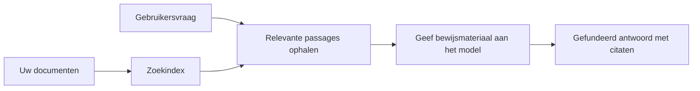

# Leer AI om Vragen te Beantwoorden op Basis van Uw Documenten:
## Serie 1: RAG, Azure versus Open-Source Alternatieven, en Wanneer Fine-Tuning Zinvol Is

> Het eerste artikel in een serie van 2026 waarin ik mijn 2023 Azure AI Search + Azure OpenAI document QA tutorials opnieuw bekijk.

## 1. Intro - Een Eerder RAG Tutorial Herzien

In 2023 werkte ik aan een paar tutorials over het leren aan ChatGPT om vragen te beantwoorden uit PDF-documenten met behulp van Azure AI Search en Azure OpenAI. Ik schreef de [LangChain-versie](https://techcommunity.microsoft.com/blog/educatordeveloperblog/teach-chatgpt-to-answer-questions-using-azure-ai-search--azure-openai-lang-chain/3969713), en ik was ook co-auteur van de begeleidende [Semantic Kernel-versie](https://techcommunity.microsoft.com/blog/educatordeveloperblog/teach-chatgpt-to-answer-questions-using-azure-ai-search--azure-openai-semantic-k/3985395) samen met [Lee Stott](https://developer.microsoft.com/en-us/advocates/lee-stott), een Principal Cloud Advocate Manager bij Microsoft. Destijds voelde het idee van "ChatGPT op uw data" nog nieuw voor veel ontwikkelaars. De tutorials gebruikten Azure Blob Storage, Azure AI Search, Azure OpenAI, LangChain, Semantic Kernel en FAISS-stijl vector retrieval om vragen te beantwoorden uit PDF-bestanden.

Dat eerdere artikel richtte zich op een eenvoudige maar belangrijke workflow: documenten uploaden, indexeren, relevante inhoud ophalen, en een model vragen om te antwoorden op basis van die inhoud.

In 2026 is het RAG-ecosysteem aanzienlijk gegroeid. Azure AI Search ondersteunt nu moderne vector- en hybride retrievalpatronen, Azure OpenAI maakt deel uit van het bredere Microsoft Foundry Models-ecosysteem, en de nieuwe v1 API kan de standaard OpenAI client gebruiken zonder maandelijkse `api-version` wijzigingen te hoeven doorvoeren. Tegelijkertijd zijn open-source opties zoals LangGraph, LlamaIndex, Haystack, Qdrant, Milvus, Weaviate, Chroma, Ollama en vLLM praktische keuzes geworden voor echte RAG-systemen.

Daarom wilde ik dit onderwerp opnieuw bekijken. De vraag is niet langer alleen "Hoe bouw ik RAG?" Er zijn nu veel manieren om het te bouwen, en de belangrijkere vraag is "Welke architectuur moet ik kiezen voor mijn situatie?"

Maar het kernprobleem is niet veranderd.

Een AI-model kent uw documenten niet automatisch. Om een nuttig document-vraag-antwoord systeem op te bouwen, heeft u nog steeds betrouwbare retrieval, verankering, evaluatie en operationele workflows nodig.

Dit artikel is niet weer een end-to-end "chat met PDF" tutorial. Ik wil deze bijgewerkte serie starten met de vraag waar ik nu meer om geef: wanneer kiest u voor een beheerde Azure-architectuur, wanneer kiest u voor een open-source RAG-stack, en wanneer heeft fine-tuning eigenlijk zin?

Dit is het eerste artikel in een serie over het bouwen van op documenten gebaseerde AI-systemen. In dit eerste deel richten we ons op de architectuurkeuzes: waarom RAG belangrijk is, wanneer Azure-gebaseerde beheerde diensten nuttig zijn, wanneer open-source alternatieven logisch zijn, en waar fine-tuning past.

Na het bouwen en opnieuw bekijken van document QA-systemen ben ik minder geïnteresseerd in welke tool er het beste uitziet in een demo en meer in welke architectuur echte gebruikers, veranderende documenten, permissies, fouten en onderhoud overleeft.

## 2. Waarom Uw AI Een Zoek Systeem Nodig Heeft

Grote taalmodellen worden getraind op brede publieke en gelicentieerde data. Ze kunnen veel weten over algemene onderwerpen, maar ze kennen niet automatisch uw privé-PDF's, interne beleidsregels, bedrijfsprocedures, onderzoeksarchieven, lesmateriaal, klantenservice notities of recent bijgewerkte documentatie.

Een eenvoudige manier om over RAG na te denken is als volgt: in plaats van te verwachten dat het model elk document onthoudt, geven we het een zoeksysteem. Wanneer een gebruiker een vraag stelt, vindt het systeem eerst de meest relevante informatie, en geeft het die stukken aan het model als context.

Dit is van belang omdat veel kennisbronnen in de praktijk privé zijn, voortdurend veranderen, toestemming-gevoelig zijn, over meerdere systemen verdeeld zijn, in verschillende formaten geschreven zijn en te groot zijn om direct in een prompt te plakken.

Bijvoorbeeld, als een school, bedrijf of onderzoeksteam 10.000 interne documenten heeft, kan het model niet betrouwbaar antwoorden op die documenten tenzij het systeem de juiste delen op het juiste moment ophaalt.

Dit leidt natuurlijk tot een veelgestelde vraag:

Waarom niet gewoon het model fine-tunen?

Fine-tuning kan nuttig zijn, maar is meestal niet het juiste eerste hulpmiddel voor documentkennis. Als de kennis vaak verandert, als citaties belangrijk zijn, of als toegangsrechten belangrijk zijn, is RAG meestal het betere startpunt. Fine-tuning is meer geschikt om gedrag, stijl, uitvoerformaat en taakpatronen aan te leren.

## 3. RAG Architectuur in de Praktijk

Stel dat u een AI-assistent bouwt voor een school. De assistent moet vragen beantwoorden uit beleids-PDF's, cursusgidsen, interne FAQ-pagina's en recent bijgewerkte aankondigingen.

Als een student vraagt: "Mag ik generatieve AI gebruiken voor mijn eindopdracht?", dan mag het systeem niet antwoorden uit het algemene geheugen van het model. Het moet eerst het relevante schoolbeleid vinden, het gedeelte over AI-gebruik ophalen, en vervolgens het model vragen om te antwoorden met dat bewijs.

Dat is RAG in de praktijk.

Op hoofdlijnen kunt u de flow zo zien:

De details kunnen complexer worden, maar het basisidee is simpel: het model antwoordt niet alleen. Het antwoordt met opgehaald bewijs.

Eerst worden documenten ingestuurd vanuit opslagssystemen zoals Azure Blob Storage, SharePoint, GitHub of een intern CMS. Daarna parseert het systeem ze naar tekst met behoud van nuttige structuur zoals koppen, paginanummers, tabellen, secties en bronlocaties.

Vervolgens wordt de inhoud opgesplitst in stukken. Deze stap klinkt simpel, maar is een van de belangrijkste onderdelen van het systeem. Als een stuk te klein is, kan het de omringende context verliezen. Als een stuk te groot is, kan het ongebruikte informatie bevatten en maakt het de retrieval minder precies.

Na het opsplitsen maakt het systeem embeddings aan en slaat deze op in een doorzoekbare index samen met de originele tekst en metadata zoals bestandsnaam, paginanummer, permissies, documentversie en bron-URL.

Wanneer de gebruiker een vraag stelt, haalt het systeem kandidaat-stukken op met zoekwoorden, vectorzoekopdrachten of hybride zoekopdrachten. Een herordener kan die stukken dan opnieuw rangschikken zodat het meest bruikbare bewijs bovenaan staat.

Tenslotte ontvangt het model de vraag en het opgehaalde bewijs. Het antwoord moet gebaseerd zijn op dat bewijs en citaties teruggeven zodat de gebruiker de bron kan bekijken.

Het belangrijke punt is dat RAG niet alleen "zet PDF's in een vector database" is. De kwaliteit van het antwoord hangt af van de gehele workflow: parseren, opsplitsen, ophalen, herordenen, prompten, citeren en evalueren.

Dit is waarom documentstructuur belangrijk is. In een PDF kan een kop, tabel, voetnoot of pagina-einde de betekenis van een passage veranderen. Op Azure gebruikt de Document Layout skill Azure Document Intelligence lay-outmogelijkheden om structuur-bewuste output te produceren, wat de kwaliteit van opsplitsen en retrieval voor RAG-systemen kan verbeteren.

## 4. Wat Is Er Veranderd Sinds 2023?

De tutorial van 2023 was een goed begin voor die tijd:

- Azure Blob Storage bewaarde PDF-bestanden.
- Azure AI Search indexeerde de inhoud.
- LangChain verbond retrieval met Azure OpenAI.
- FAISS werkte als een eenvoudige lokale vector opslag.
- Het voorbeeld gebruikte `gpt-35-turbo` en `text-embedding-ada-002`.

In 2026 moet een moderne versie meerdere veranderingen weerspiegelen.

Ten eerste is retrieval volwassen geworden. In 2023 gebruikten veel demos eenvoudige vector similarity zoekopdrachten. Vandaag is hybride retrieval vaak het standaard startpunt voor serieuze document QA. Azure AI Search ondersteunt hybride zoekopdrachten door zoekwoorden en vector queries in één verzoek te combineren en resultaten te mergen met Reciprocal Rank Fusion. De semantische ranker kan dan de tekstkant van full-text, vector en hybride resultaten herordenen.

Ten tweede is ingestie geavanceerder. In plaats van elk document handmatig met toepassingscode op te splitsen, ondersteunt Azure AI Search geïntegreerde vectorisatie voor opsplitsen, embedding en query-tijd vectorisatie. Voor PDF's en document-intensieve workloads kan de Document Layout skill meer structuur behouden dan vaste grootte stukken.

Ten derde wordt orchestratie belangrijker. Het moeilijke deel is vaak niet de LLM API-aanroep zelf. Het moeilijke deel is het omgaan met fouten, herhalingen, verouderde retrieval, stukkwaliteit, langlopende workflows, menselijke controle en schaalbare evaluatie. Hier worden workflow-georiënteerde tools zoals LangGraph, LlamaIndex workflows, Haystack pipelines en platform-level evaluatie en observability tools belangrijker dan één enkele lineaire keten.

Ten vierde is evaluatie niet langer optioneel. Een demo kan indrukwekkend lijken met één vraag. Een productiesysteem heeft testsets, regressiecontroles, retrieval-metrics, groundedness-checks en monitoring nodig. Zonder evaluatie is het moeilijk te weten of het systeem verbetert of alleen verandert.

## 5. Kiezen Tussen Azure en Open-Source RAG Stacks

Ik denk niet dat de nuttige vraag is "Is Azure beter dan open source?" of "Is open source beter dan Azure?"

De nuttige vraag is: wat voor soort systeem bouwt u, wie gaat het beheren, welke beperkingen hebt u, en welke faalmodi zijn onacceptabel?

Toen ik begon met het bouwen van document QA-voorbeelden, dacht ik vooral aan of retrieval werkte. Kon ik PDF's uploaden, doorzoeken en een antwoord genereren? Dat was een redelijke start.

Na het doorlopen van meer realistische AI-workflows, veranderde mijn evaluatie. Nu kijk ik naar vier dingen voordat ik een RAG-stack kies:

- identiteit en permissies
- retrieval kwaliteit
- workflow betrouwbaarheid
- operationeel eigenaarschap

Die vier gebieden vertellen veel meer dan alleen een modelbenchmark.

Azure-gebaseerde architecturen zijn meestal logisch wanneer enterprise-integratie het moeilijkste deel is. Als een team al afhankelijk is van Microsoft Entra ID, Microsoft 365, Azure Storage, privénetwerken, RBAC en Azure monitoring, kunnen Azure AI Search en Azure OpenAI veel operationele complexiteit verminderen. In die omgeving is Azure niet alleen een model API. De waarde zit in het omliggende systeem: identiteit, governance, beheerde zoekfunctie, beveiligingsintegratie, ondersteuning en vertrouwde operaties.

Open-source architecturen zijn meestal logisch wanneer flexibiliteit het moeilijkste is. Als het team lokale inferentie, cloudportabiliteit, een aangepaste retrieval pipeline, gespecialiseerde herordening, of directe controle over de vector database en model-serveerslaag nodig heeft, kan een open-source stack beter passen. Het nadeel is dat het team meer van het betrouwbaarheidwerk bezit: backups, schaling, latency, migraties, monitoring en beveiliging.

In de praktijk zijn veel productiesystemen niet puur cloud-native of puur open-source. Ze zijn vaak hybride systemen die operationele eenvoud, draagbaarheid, governance en engineering flexibiliteit in balans brengen.

Bijvoorbeeld, ik zou niet verrast zijn om een systeem te zien dat Azure OpenAI gebruikt voor modeltoegang, LangGraph voor workflow orchestratie, Azure hosting voor deployment, en een open-source vector database voor een specifieke retrieval-eis. Dat is geen architectonische inconsistentie. Dat is het juiste niveau van beheerde service en engineeringcontrole voor elk onderdeel van het systeem kiezen.

Ik hou van hybride architecturen wanneer het beheerde platform belangrijke enterpriseproblemen oplost, terwijl open-source componenten het team flexibiliteit geven waar het echt toe doet.

## 6. Een Praktische Beslissingsgids

Hier is de besluitvormingstabel die ik met een team zou gebruiken vóór het kiezen van een RAG-stack:

| Beslissingsgebied | Azure beheerde stack is sterker wanneer... | Open-source stack is sterker wanneer... |
| --- | --- | --- |
| Identiteit en toegang | Entra ID, RBAC, beheerde identiteit en enterprise permissies centraal staan | aangepaste authenticatie, niet-Microsoft identiteit of app-specifieke toegangslogica overheerst |
| Operaties | het team beheerde infrastructuur, ondersteuning, SLA's en eenvoudigere onboarding wil | het team vector databases, model serving, backups en schaling kan beheren |
| Retrieval | hybride zoekopdrachten, semantische ranking, filters en metadata-zoeken de meeste behoeften dekken | het team aangepaste retrieval, gespecialiseerde herordening, of experimentele indexering nodig heeft |
| Draagbaarheid | Azure-ecosysteem afstemming acceptabel of gewenst is | cloud lock-in vermijden een harde eis is |
| Inferentie | Azure OpenAI governance, netwerken en enterprise controls belangrijk zijn | lokale inferentie, aangepaste modellen of self-hosted serving vereist zijn |
| Kosten | het terugbrengen van engineering- en operationele inspanning belangrijker is dan infrastructuurtuning | schaal groot genoeg is om zorgvuldige infrastructuuroptimalisatie te rechtvaardigen |
| Experimentatie | stabiliteit en enterprise-integratie belangrijker zijn dan vaak wisselen van componenten | het team snel iteratief werkt aan agents, tools, geheugen en retrieval-workflows |

Mijn vuistregel is simpel:

- Begin met Azure wanneer enterprise-integratie, beveiliging en operationele eenvoud de belangrijkste risico's zijn.
- Begin met open source wanneer draagbaarheid, maatwerk of lokale controle de belangrijkste risico's zijn.
- Gebruik een hybride stack als beide waar zijn.

Dit is ook waarom ik een RAG-serie van 2026 niet allereerst met code zou starten. Code is belangrijk, maar architectuurkeuze komt vóór implementatie. Een simpele demo kan de moeilijkste keuzes verbergen. Een goed RAG-systeem maakt die keuzes expliciet.

## 7. Waar Fine-Tuning Past

Fine-tuning wordt vaak samen met RAG genoemd, maar ik vind het belangrijk om ze te scheiden.

RAG is meestal de betere keuze wanneer het systeem verse, privé, permissie-gevoelige of bron-gegrondde kennis nodig heeft. Als het antwoord documenten moet citeren, recente updates moet weerspiegelen, of gebruikersspecifieke toegangsregels moet respecteren, moet retrieval onderdeel van de architectuur zijn.

Fine-tuning is nuttiger wanneer kennis niet het hoofdprobleem is. Het kan helpen wanneer u wilt dat het model een specifiek uitvoerformaat volgt, een domeinspecifieke responsstijl aanhoudt, een stabiele taak consistenter uitvoert, of de hoeveelheid instructie in elke prompt vermindert.
In de praktijk kunnen de twee samenwerken. Een ondersteuningsassistent kan RAG gebruiken om het laatste beleid op te halen, terwijl een fijn afgestemd model leert wat de voorkeursstructuur en -toon voor antwoorden van het bedrijf is.

De fout is om fijn afstemmen te zien als een vervanging voor een documentopslag. Het vervangt niet de noodzaak van ophalen wanneer het systeem moet antwoorden met verse, privé- of toestemmingsgevoelige gegevens.

## 8. Waar deze serie hierna naartoe gaat

Dit artikel is de besluitvormingslaag. Voordat ik code ging schrijven, wilde ik de afwegingen expliciet maken: RAG vs fijn afstemmen, Azure vs open source, beheerde diensten vs operationele controle.

Voordat ik aan de implementatie begin, wil ik hier één punt achterlaten: in veel enterprise AI-systemen is het model slechts één component. De kwaliteit van ophalen, orchestratie, evaluatie, toestemmingen en operationele betrouwbaarheid zijn vaak wat bepaalt of het systeem verder gaat dan de demo-fase.

In de volgende delen van deze serie ben ik van plan dieper in te gaan op de praktische kant van document-gebaseerde AI-systemen: hoe je een Azure-gebaseerde architectuur bouwt, hoe open-source alternatieven in de praktijk vergelijken en hoe te evalueren of een RAG-systeem daadwerkelijk werkt.

Ik kan de volgorde aanpassen naarmate de serie zich ontwikkelt, maar het doel blijft hetzelfde: verder gaan dan een simpele demo en laten zien hoe je denkt over RAG-systemen die onderhouden, geëvalueerd en geëxploiteerd kunnen worden.

## 9. Referenties en bronnen

Oorspronkelijke tutorials:

- [Teach ChatGPT to Answer Questions: Using Azure AI Search & Azure OpenAI (Lang Chain)](https://techcommunity.microsoft.com/blog/educatordeveloperblog/teach-chatgpt-to-answer-questions-using-azure-ai-search--azure-openai-lang-chain/3969713)
- [Teach ChatGPT to Answer Questions: Using Azure AI Search & Azure OpenAI (Semantic Kernel)](https://techcommunity.microsoft.com/blog/educatordeveloperblog/teach-chatgpt-to-answer-questions-using-azure-ai-search--azure-openai-semantic-k/3985395)

Azure:

- [Azure AI Search REST API versies](https://learn.microsoft.com/en-us/rest/api/searchservice/search-service-api-versions)
- [Hybride zoeken in Azure AI Search](https://learn.microsoft.com/en-us/azure/search/hybrid-search-how-to-query)
- [Geïntegreerde vectorisatie in Azure AI Search](https://learn.microsoft.com/en-us/azure/search/vector-search-integrated-vectorization)
- [Document Layout skill in Azure AI Search](https://learn.microsoft.com/en-us/azure/search/cognitive-search-skill-document-intelligence-layout)
- [Chunk en vectoriseren op document lay-out](https://learn.microsoft.com/en-us/azure/search/search-how-to-semantic-chunking)
- [Semantische ranking in Azure AI Search](https://learn.microsoft.com/en-us/azure/search/semantic-search-overview)
- [Azure OpenAI / Microsoft Foundry API versie levenscyclus](https://learn.microsoft.com/en-us/azure/foundry/openai/api-version-lifecycle)
- [Foundry modellen verkocht door Azure](https://learn.microsoft.com/en-us/azure/foundry/foundry-models/concepts/models-sold-directly-by-azure)
- [Microsoft Foundry overwegingen bij fijn afstemmen](https://learn.microsoft.com/en-us/azure/foundry/openai/concepts/fine-tuning-considerations)
- [Microsoft Foundry observeerbaarheid](https://learn.microsoft.com/en-us/azure/foundry/concepts/observability)
- [Evaluaties uitvoeren in Microsoft Foundry](https://learn.microsoft.com/en-us/azure/foundry/how-to/evaluate-generative-ai-app)

Open source:

- [LangGraph documentatie](https://docs.langchain.com/oss/python/langgraph/overview)
- [LlamaIndex documentatie](https://developers.llamaindex.ai/python/framework/)
- [Haystack documentatie](https://docs.haystack.deepset.ai/)
- [Qdrant documentatie](https://qdrant.tech/documentation/overview/)
- [Milvus documentatie](https://milvus.io/docs/overview.md)
- [Weaviate documentatie](https://docs.weaviate.io/weaviate/current/)
- [Chroma documentatie](https://docs.trychroma.com/docs/overview/introduction)
- [Ollama embeddings](https://docs.ollama.com/capabilities/embeddings)
- [vLLM OpenAI-compatibele server](https://docs.vllm.ai/en/latest/serving/openai_compatible_server.html)
- [BGE embedding modellen](https://huggingface.co/BAAI/bge-large-en-v1.5)
- [E5 embedding modellen](https://huggingface.co/intfloat/e5-large-v2)
- [Instructor embedding modellen](https://huggingface.co/hkunlp/instructor-large)

---

<!-- CO-OP TRANSLATOR DISCLAIMER START -->
**Disclaimer**:
Dit document is vertaald met behulp van de AI vertaaldienst [Co-op Translator](https://github.com/Azure/co-op-translator). Hoewel we streven naar nauwkeurigheid, dient u er rekening mee te houden dat geautomatiseerde vertalingen fouten of onnauwkeurigheden kunnen bevatten. Het originele document in de oorspronkelijke taal moet worden beschouwd als de gezaghebbende bron. Voor kritieke informatie wordt professionele menselijke vertaling aanbevolen. Wij zijn niet aansprakelijk voor eventuele misverstanden of verkeerde interpretaties die voortvloeien uit het gebruik van deze vertaling.
<!-- CO-OP TRANSLATOR DISCLAIMER END -->