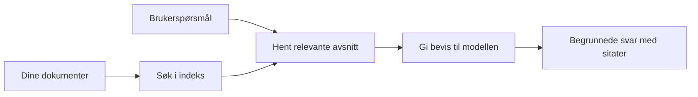

# Lær AI å svare på spørsmål basert på dokumentene dine:
## Serie 1: RAG, Azure vs åpne alternativer, og når finjustering gir mening

> Den første artikkelen i en 2026-serie som tar en ny gjennomgang av mine 2023-veiledninger for Azure AI Search + Azure OpenAI dokument-FAQ.

Navigasjon i serien: [Repository hjem](../README.md) | Neste: [Serie 2 - Bygg et lokalt åpent RAG-system fra ende til ende](./series-2-open-source-rag-end-to-end.md)

## 1. Intro - En ny gjennomgang av en tidligere RAG-veiledning

I 2023 jobbet jeg med et par veiledninger om hvordan man kan lære ChatGPT å svare på spørsmål fra PDF-dokumenter ved å bruke Azure AI Search og Azure OpenAI. Jeg skrev [LangChain-versjonen](https://techcommunity.microsoft.com/blog/educatordeveloperblog/teach-chatgpt-to-answer-questions-using-azure-ai-search--azure-openai-lang-chain/3969713), og jeg var også medforfatter av følgesvenn-versjonen med [Semantic Kernel](https://techcommunity.microsoft.com/blog/educatordeveloperblog/teach-chatgpt-to-answer-questions-using-azure-ai-search--azure-openai-semantic-k/3985395) sammen med [Lee Stott](https://developer.microsoft.com/en-us/advocates/lee-stott), en Principal Cloud Advocate Manager hos Microsoft. På den tiden føltes ideen om "ChatGPT på dine egne data" fortsatt ny for mange utviklere. Veiledningene brukte Azure Blob Storage, Azure AI Search, Azure OpenAI, LangChain, Semantic Kernel og FAISS-stil vektorsøk for å svare på spørsmål fra PDF-filer.

Den tidligere artikkelen fokuserte på en enkel, men viktig arbeidsflyt: last opp dokumenter, indekser dem, hent relevant innhold, og spør en modell om å svare basert på det innholdet.

I 2026 har RAG-økosystemet vokst betydelig. Azure AI Search støtter nå moderne vektor- og hybrid-søkemønstre, Azure OpenAI er en del av det bredere Microsoft Foundry Models-økosystemet, og den nyere v1 API-en kan bruke den standard OpenAI-klienten uten å kreve månedlige `api-version`-endringer. Samtidig har åpne alternativer som LangGraph, LlamaIndex, Haystack, Qdrant, Milvus, Weaviate, Chroma, Ollama og vLLM blitt praktiske valg for ekte RAG-systemer.

Derfor ønsket jeg å ta opp dette temaet igjen. Spørsmålet er ikke lenger bare "Hvordan bygger jeg RAG?" Det finnes nå mange måter å bygge det på, og det viktigste spørsmålet er "Hvilken arkitektur bør jeg velge for min situasjon?"

Men kjernen i problemet har ikke endret seg.

En AI-modell vet ikke automatisk om dokumentene dine. For å bygge et nyttig dokument-spørsmål-svar-system trenger du fortsatt pålitelig innhenting, forankring, evaluering og operative arbeidsflyter.

Denne artikkelen er ikke en ny ende-til-ende "chat med PDF"-veiledning. Jeg vil starte denne oppdaterte serien med spørsmålet jeg nå bryr meg mest om: når bør du velge en administrert Azure-arkitektur, når bør du velge en åpen RAG-stack, og når gir finjustering egentlig mening?

Dette er den første artikkelen i en serie om å bygge AI-systemer for dokumentforankring. I denne første delen fokuserer vi på arkitekturvalg: hvorfor RAG er viktig, når Azure-baserte administrerte tjenester er nyttige, når åpne alternativer gir mening, og hvor finjustering passer inn.

Etter å ha bygget og gjennomgått dokument QA-systemer, har jeg blitt mindre interessert i hvilket verktøy som ser best ut i en demo, og mer interessert i hvilken arkitektur som fungerer i møte med ekte brukere, endrede dokumenter, tillatelser, feil og vedlikehold.

## 2. Hvorfor AI-en din trenger et søkesystem

Store språkmodeller trenes på bred offentlig og lisensiert data. De kan vite mye om generelle temaer, men de vet ikke automatisk om dine private PDF-er, interne retningslinjer, bedriftens prosedyrer, forskningsarkiver, klasseromsmateriell, kundestøttenotater eller nylig oppdatert dokumentasjon.

En enkel måte å tenke på RAG er slik: i stedet for å forvente at modellen husker hvert dokument, gir vi den et søkesystem. Når en bruker stiller et spørsmål, finner systemet først de mest relevante informasjonselementene, og gir så disse til modellen som kontekst.

Dette er viktig fordi mange virkelige kunnskapskilder er private, stadig i endring, tillatelses-sensitive, lagret på flere systemer, skrevet i mange formater, og for store til å limes direkte inn i en forespørsel.

For eksempel, hvis en skole, et selskap eller et forskningsteam har 10 000 interne dokumenter, kan ikke modellen svare fra disse dokumentene pålitelig uten at systemet henter ut de riktige delene til rett tid.

Dette leder naturlig til et vanlig spørsmål:

Hvorfor ikke bare finjustere modellen?

Finjustering kan være nyttig, men det er som regel ikke det rette første verktøyet for dokumentkunnskap. Hvis kunnskapen endres ofte, hvis sitater betyr noe, eller hvis tilgangsrettigheter er viktige, er RAG vanligvis det beste utgangspunktet. Finjustering passer bedre til å lære opp atferd, stil, output-format og oppgave-mønstre.

## 3. RAG-arkitektur i praksis

Tenk deg at du bygger en AI-assistent for en skole. Assistenten må svare på spørsmål fra policy-PDF-er, kursguider, interne FAQ-sider og nylig oppdaterte kunngjøringer.

Hvis en student spør: "Kan jeg bruke generativ AI til min avsluttende oppgave?", bør systemet ikke svare ut fra modellens generelle hukommelse. Det bør først finne relevant skolepolitikk, hente ut delen om AI-bruk, og deretter be modellen svare med utgangspunkt i dette bevismaterialet.

Det er RAG i praksis.

På et høyt nivå kan du tenke på arbeidsflyten slik:

Detaljene kan bli mer sofistikerte, men den grunnleggende ideen er enkel: modellen svarer ikke alene. Den svarer med hentet bevis.

Først blir dokumenter hentet fra lagringssystemer som Azure Blob Storage, SharePoint, GitHub eller et internt CMS. Deretter parser systemet dem til tekst samtidig som det bevarer nyttig struktur som overskrifter, sidenummer, tabeller, seksjoner og kildelokasjoner.

Innholdet deles så opp i biter (chunks). Dette høres enkelt ut, men er en av de viktigste delene av systemet. Er bitene for små kan konteksten gå tapt. Er bitene for store kan de inkludere irrelevant informasjon og gjøre henting mindre presis.

Etter oppdeling lager systemet innebygde representasjoner (embeddings) og lagrer disse i en søkbar indeks sammen med originaltekst og metadata som filnavn, sidenummer, tillatelser, dokumentversjon og kildeadresse.

Når brukeren stiller et spørsmål, henter systemet kandidater ved hjelp av søkeord-søk, vektorsøk eller hybridsøk. En omrangør (reranker) kan deretter omorganisere bitene slik at det mest nyttige beviset plasseres øverst.

Til slutt mottar modellen spørsmålet og det hentede beviset. Svaret skal være forankret i det beviset og returnere sitater slik at brukeren kan sjekke kilden.

Det viktige er at RAG ikke bare er "legg PDF-er inn i en vektordatabase." Kvaliteten på svaret avhenger av hele arbeidsflyten: parsing, chunking, henting, omrangering, prompting, sitering og evaluering.

Derfor er dokumentstruktur viktig. I en PDF kan en overskrift, tabell, fotnote eller sideskille endre meningen i et avsnitt. På Azure bruker Document Layout skill Azure Document Intelligence sine layout-kapasiteter for å produsere strukturbevisst output, noe som kan forbedre chunking og hentekvalitet for RAG-systemer.

## 4. Hva har endret seg siden 2023?

2023-veiledningen var et godt utgangspunkt for sin tid:

- Azure Blob Storage lagret PDF-filer.
- Azure AI Search indekserte innhold.
- LangChain koblet sammen henting med Azure OpenAI.
- FAISS fungerte som en enkel lokal vektordatabase.
- Eksemplet brukte `gpt-35-turbo` og `text-embedding-ada-002`.

I 2026 bør en moderne versjon reflektere flere endringer.

For det første har hentingen modnet. I 2023 brukte mange demoer enkelt vektorlignende søk. I dag er hybridsøk ofte utgangspunktet for seriøs dokument-FAQ. Azure AI Search støtter hybridsøk ved å kombinere søkeord- og vektorspørringer i én enkelt forespørsel og slår sammen resultatene med Reciprocal Rank Fusion. Semantisk rangerer kan deretter omrangere tekstsiden av fulltekst, vektor- og hybridresultater.

For det andre er inntaket mer sofistikert. I stedet for manuelt å dele hvert dokument med applikasjonskode, støtter Azure AI Search integrert vektorisering for chunking, embedding og vektorisering ved spørringstid. For PDF-er og dokumenttunge arbeidsmengder kan Document Layout skill bevare mer struktur enn faste størrelser på bitene.

For det tredje betyr orkestrering mer. Det vanskeligste er ofte ikke selve LLM API-kallet. Det vanskeligste er å håndtere feil, gjentakelser, utdaterte hentinger, bit-kvalitet, langvarige arbeidsflyter, menneskelig gjennomgang og evaluering i stor skala. Her blir arbeidsflyt-orienterte verktøy som LangGraph, arbeidsflyter i LlamaIndex, Haystack-pipelines og plattformnivå evaluering og observabilitet mer relevante enn en enkelt lineær kjede.

For det fjerde er evaluering ikke lenger valgfritt. En demo kan se imponerende ut med ett spørsmål. Et produksjonssystem trenger testsett, regresjonssjekker, hentingsmetrikker, forankringstester og overvåking. Uten evaluering er det vanskelig å vite om systemet forbedres eller bare endres.

## 5. Valget mellom Azure- og åpne RAG-stacks

Jeg tror ikke det nyttige spørsmålet er "Er Azure bedre enn åpen kildekode?" eller "Er åpen kildekode bedre enn Azure?"

Det nyttige spørsmålet er: hva slags system bygger du, hvem skal drifte det, hvilke begrensninger har du, og hvilke feiltyper er uakseptable?

Da jeg begynte å bygge eksempler for dokument FAQ, tenkte jeg mest på om henting fungerte. Kunne jeg laste opp PDF-er, søke i dem, og generere et svar? Det var et rimelig utgangspunkt.

Etter å ha jobbet gjennom mer realistiske AI-arbeidsflyter, endret evalueringen min seg. Nå ser jeg på fire ting før jeg velger en RAG-stack:

- identitet og tillatelser
- hentekvalitet
- arbeidsflyttillit
- operasjonelt eierskap

Disse fire områdene forteller mye mer enn en modell-benchmark alene.

Azure-baserte arkitekturer gir mest mening når bedriftsintegrasjon er den vanskelige delen. Hvis et team allerede er avhengig av Microsoft Entra ID, Microsoft 365, Azure Storage, privat nettverk, RBAC og Azure-overvåking, kan Azure AI Search og Azure OpenAI redusere mye av den operative kompleksiteten. I det miljøet er ikke Azure bare en modell-API. Verdien ligger i det omkringliggende systemet: identitet, styring, administrert søk, sikkerhetsintegrasjon, støtte og kjente driftsrutiner.

Åpne arkitekturer gir mest mening når fleksibilitet er den vanskelige delen. Hvis teamet trenger lokal inferens, skypoortabilitet, en tilpasset hentepipeline, spesialisert omrangering eller direkte kontroll over vektordatabasen og modellserveringslaget, kan en åpen stack være bedre. Ulempen er at teamet da eier mer av pålitelighetsarbeidet: backup, skalering, latenstid, migrasjoner, overvåking og sikkerhet.

I praksis er mange produksjons-AI-systemer verken rent sky-native eller rent åpne. De er ofte hybride systemer som balanserer driftsforenkling, portabilitet, styring og ingeniørfleksibilitet.

For eksempel ville jeg ikke bli overrasket om et system brukte Azure OpenAI for modelltilgang, LangGraph for arbeidsflyt-orkestrering, Azure hosting for distribusjon, og en åpen vektordatabase for en spesifikk henterelatert krav. Det er ikke arkitektonisk inkonsistens. Det er å velge riktig nivå av administrert tjeneste og ingeniørkontroll for hver del av systemet.

Jeg liker hybride arkitekturer når den administrerte plattformen løser viktige bedriftsproblemer, mens åpne komponenter gir teamet fleksibilitet der det virkelig teller.

## 6. En praktisk beslutningsveiledning

Her er beslutningstabellen jeg ville brukt med et team før jeg valgte en RAG-stack:

| Beslutningsområde | Azure administrert stack er sterkere når... | Åpen stack er sterkere når... |
| --- | --- | --- |
| Identitet og tilgang | Entra ID, RBAC, administrert identitet og bedrifts-tillatelser er sentralt | egendefinert autentisering, ikke-Microsoft identitet, eller app-spesifikk tilgangslogikk dominerer |
| Drift | teamet ønsker administrert infrastruktur, støtte, SLAer og enklere onboarding | teamet kan drifte vektorbaser, modellservering, backup og skalering |
| Henting | hybridsøk, semantisk rangering, filtre og metadata-søk dekker de fleste behov | teamet trenger tilpasset henting, spesialisert omrangering eller eksperimentell indeksering |
| Portabilitet | samsvar eller preferanse for Azure-økosystemet | å unngå sky-låsing er et hardt krav |
| Inferens | Azure OpenAI styring, nettverk og enterprise-kontroller betyr noe | lokal inferens, tilpassede modeller eller selvhostet servering kreves |
| Kostnad | å redusere ingeniør- og driftsinnsats betyr mer enn tuning av infrastruktur | skalaen er stor nok til å rettferdiggjøre nøye infrastrukturoptimalisering |
| Eksperimentering | stabilitet og bedriftsintegrasjon betyr mer enn hyppige komponentbytter | teamet itererer raskt på agenter, verktøy, minne og hentearbeidsflyter |

Min tommelfingerregel er enkel:

- Start med Azure når bedriftsintegrasjon, sikkerhet og driftssimpelhet er hovedrisikoene.
- Start med åpen kildekode når portabilitet, tilpasning eller lokal kontroll er hovedrisikoene.
- Bruk en hybrid stack når begge deler stemmer.

Dette er også grunnen til at jeg ikke ville startet en 2026 RAG-serie med code først. Kode er viktig, men arkitekturvalg kommer før implementering. En enkel demo kan skjule de vanskeligste valgene. Et godt RAG-system gjør disse valgene eksplisitte.

## 7. Hvor finjustering passer inn

Finjustering nevnes ofte sammen med RAG, men jeg mener det er viktig å skille de to.

RAG er vanligvis det beste valget når systemet trenger fersk, privat, tillatelses-sensitiv eller kilde-forankret kunnskap. Hvis svaret skal sitere dokumenter, reflektere nylige oppdateringer eller respektere brukerspesifikke tilgangsregler, bør henting være en del av arkitekturen.
Finjustering er mer nyttig når kunnskap ikke er hovedproblemet. Det kan hjelpe når du ønsker at modellen skal følge et spesifikt utdataformat, matche en domenespesifikk svarstil, utføre en stabil oppgave mer konsekvent, eller redusere mengden instruksjoner som trengs i hver prompt.

I praksis kan de to fungere sammen. En supportassistent kan bruke RAG for å hente den siste policyen, mens en finjustert modell lærer selskapets foretrukne svarstruktur og tone.

Feilen er å behandle finjustering som en erstatning for en dokumentlager. Det fjerner ikke behovet for uthenting når systemet må svare fra ferske, private eller tillatelsessensitive data.

## 8. Hvor denne serien går videre

Denne artikkelen er beslutningslaget. Før jeg skriver kode, ønsket jeg å gjøre avveiningene eksplisitte: RAG vs finjustering, Azure vs åpen kildekode, administrerte tjenester vs operasjonell kontroll.

Før vi går videre til implementering, vil jeg legge igjen ett punkt her: i mange bedrifts-AI-systemer er modellen bare en komponent. Kvaliteten på uthenting, orkestrering, evaluering, tillatelser og operasjonell pålitelighet er ofte det som avgjør om systemet lykkes utover demostadiet.

I de neste delene av denne serien planlegger jeg å gå dypere inn i den praktiske siden av dokumentbaserte AI-systemer: først bygge en lokal åpen kildekode RAG-arbeidsflyt, deretter gjenoppbygge samme scenario med Azure AI Search og Azure OpenAI, og deretter evaluere om systemet faktisk fungerer.

Jeg kan justere rekkefølgen etter hvert som serien utvikler seg, men målet vil forbli det samme: å bevege seg forbi en enkel demo og vise hvordan man tenker rundt RAG-systemer som kan vedlikeholdes, evalueres og drives.

## 9. Referanser og ressurser

Opprinnelige opplæringer:

- [Lær ChatGPT å svare på spørsmål: Bruke Azure AI Search & Azure OpenAI (Lang Chain)](https://techcommunity.microsoft.com/blog/educatordeveloperblog/teach-chatgpt-to-answer-questions-using-azure-ai-search--azure-openai-lang-chain/3969713)
- [Lær ChatGPT å svare på spørsmål: Bruke Azure AI Search & Azure OpenAI (Semantic Kernel)](https://techcommunity.microsoft.com/blog/educatordeveloperblog/teach-chatgpt-to-answer-questions-using-azure-ai-search--azure-openai-semantic-k/3985395)

Azure:

- [Azure AI Search REST API-versjoner](https://learn.microsoft.com/en-us/rest/api/searchservice/search-service-api-versions)
- [Hybrid søk i Azure AI Search](https://learn.microsoft.com/en-us/azure/search/hybrid-search-how-to-query)
- [Integrert vektorisering i Azure AI Search](https://learn.microsoft.com/en-us/azure/search/vector-search-integrated-vectorization)
- [Dokumentlayout-ferdighet i Azure AI Search](https://learn.microsoft.com/en-us/azure/search/cognitive-search-skill-document-intelligence-layout)
- [Del og vektoriser etter dokumentlayout](https://learn.microsoft.com/en-us/azure/search/search-how-to-semantic-chunking)
- [Semantisk rangering i Azure AI Search](https://learn.microsoft.com/en-us/azure/search/semantic-search-overview)
- [Azure OpenAI / Microsoft Foundry API-versjoners livssyklus](https://learn.microsoft.com/en-us/azure/foundry/openai/api-version-lifecycle)
- [Foundry-modeller solgt av Azure](https://learn.microsoft.com/en-us/azure/foundry/foundry-models/concepts/models-sold-directly-by-azure)
- [Microsoft Foundry vurderinger for finjustering](https://learn.microsoft.com/en-us/azure/foundry/openai/concepts/fine-tuning-considerations)
- [Microsoft Foundry observabilitet](https://learn.microsoft.com/en-us/azure/foundry/concepts/observability)
- [Kjør evalueringer i Microsoft Foundry](https://learn.microsoft.com/en-us/azure/foundry/how-to/evaluate-generative-ai-app)

Åpen kildekode:

- [LangGraph dokumentasjon](https://docs.langchain.com/oss/python/langgraph/overview)
- [LlamaIndex dokumentasjon](https://developers.llamaindex.ai/python/framework/)
- [Haystack dokumentasjon](https://docs.haystack.deepset.ai/)
- [Qdrant dokumentasjon](https://qdrant.tech/documentation/overview/)
- [Milvus dokumentasjon](https://milvus.io/docs/overview.md)
- [Weaviate dokumentasjon](https://docs.weaviate.io/weaviate/current/)
- [Chroma dokumentasjon](https://docs.trychroma.com/docs/overview/introduction)
- [Ollama embeddings](https://docs.ollama.com/capabilities/embeddings)
- [vLLM OpenAI-kompatibel server](https://docs.vllm.ai/en/latest/serving/openai_compatible_server.html)
- [BGE embedding-modeller](https://huggingface.co/BAAI/bge-large-en-v1.5)
- [E5 embedding-modeller](https://huggingface.co/intfloat/e5-large-v2)
- [Instructor embedding-modeller](https://huggingface.co/hkunlp/instructor-large)

Neste: [Serie 2 - Bygg et lokalt åpen kildekode RAG-system fra ende til ende](./series-2-open-source-rag-end-to-end.md)

---

<!-- CO-OP TRANSLATOR DISCLAIMER START -->
**Ansvarsfraskrivelse**:
Dette dokumentet er oversatt ved hjelp av AI-oversettelsestjenesten [Co-op Translator](https://github.com/Azure/co-op-translator). Selv om vi streber etter nøyaktighet, vær oppmerksom på at automatiske oversettelser kan inneholde feil eller unøyaktigheter. Det opprinnelige dokumentet på originalspråket skal betraktes som den autoritative kilden. For kritisk informasjon anbefales profesjonell menneskelig oversettelse. Vi er ikke ansvarlige for eventuelle misforståelser eller feiltolkninger som oppstår ved bruk av denne oversettelsen.
<!-- CO-OP TRANSLATOR DISCLAIMER END -->