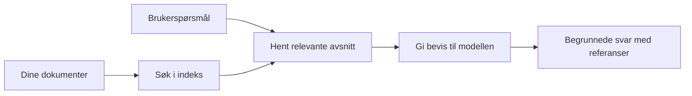

# Lær AI å svare på spørsmål basert på dokumentene dine:
## Serie 1: RAG, Azure vs åpne kilde-alternativer, og når finjustering gir mening

> Den første artikkelen i en serie fra 2026 som ser nærmere på mine 2023 Azure AI Search + Azure OpenAI dokument QA-opplæringer.

## 1. Introduksjon - Gjenbesøk av en tidligere RAG-opplæring

I 2023 jobbet jeg med et par opplæringsartikler om å lære ChatGPT å svare på spørsmål fra PDF-dokumenter ved bruk av Azure AI Search og Azure OpenAI. Jeg skrev [LangChain-versjonen](https://techcommunity.microsoft.com/blog/educatordeveloperblog/teach-chatgpt-to-answer-questions-using-azure-ai-search--azure-openai-lang-chain/3969713), og jeg var også medforfatter av den tilhørende [Semantic Kernel-versjonen](https://techcommunity.microsoft.com/blog/educatordeveloperblog/teach-chatgpt-to-answer-questions-using-azure-ai-search--azure-openai-semantic-k/3985395) sammen med [Lee Stott](https://developer.microsoft.com/en-us/advocates/lee-stott), en Principal Cloud Advocate Manager hos Microsoft. På den tiden føltes idéen om "ChatGPT på dine data" fremdeles ny for mange utviklere. Opplæringene brukte Azure Blob Storage, Azure AI Search, Azure OpenAI, LangChain, Semantic Kernel, og FAISS-aktig vektorhenting for å svare på spørsmål fra PDF-filer.

Den tidligere artikkelen fokuserte på en enkel, men viktig arbeidsflyt: last opp dokumenter, indekser dem, hent relevant innhold, og spør en modell om å svare basert på dette innholdet.

I 2026 har RAG-økosystemet vokst betydelig. Azure AI Search støtter nå moderne vektor- og hybride hentemønstre, Azure OpenAI er en del av det bredere Microsoft Foundry Models-økosystemet, og den nyere v1 API-en kan bruke den vanlige OpenAI-klienten uten å kreve månedlige `api-version`-endringer. Samtidig har åpen kilde-alternativer som LangGraph, LlamaIndex, Haystack, Qdrant, Milvus, Weaviate, Chroma, Ollama, og vLLM blitt praktiske valg for ekte RAG-systemer.

Derfor ønsket jeg å gjenbesøke dette temaet. Spørsmålet er ikke lenger bare "Hvordan bygger jeg RAG?" Det finnes nå mange måter å bygge det på, og det viktigere spørsmålet er "Hvilken arkitektur bør jeg velge for min situasjon?"

Men kjernen i problemet har ikke endret seg.

En AI-modell kjenner ikke automatisk dine dokumenter. For å bygge et nyttig system for dokument-spørsmål-svar må du fortsatt ha pålitelig henting, forankring, evaluering og operative arbeidsflyter.

Denne artikkelen er ikke en ny end-to-end "chat med PDF"-opplæring. Jeg ønsker å starte denne oppdaterte serien med det spørsmålet jeg nå bryr meg mer om: når bør du velge en administrert Azure-arkitektur, når bør du velge en åpen kilde RAG-stack, og når gir finjustering egentlig mening?

Dette er den første artikkelen i en serie om å bygge AI-systemer for dokumentbasert kunnskap. I denne første delen fokuserer vi på arkitekturvalg: hvorfor RAG er viktig, når Azure-baserte administrerte tjenester er nyttige, når åpne kilde-alternativer gir mening, og hvor finjustering passer inn.

Etter å ha bygget og gjenbesøkt dokument QA-systemer, har jeg blitt mindre interessert i hvilket verktøy som ser best ut i en demo, og mer interessert i hvilken arkitektur som overlever ekte brukere, endrende dokumenter, tillatelser, feil og vedlikehold.

## 2. Hvorfor AI-en din trenger et søkesystem

Store språkmodeller trenes på omfattende offentlige og lisensierte data. De kan vite mye om generelle emner, men de kjenner ikke automatisk til dine private PDF-er, interne retningslinjer, bedriftsprosedyrer, forskningsarkiver, klasseromsmateriell, kundestøttenotater eller nylig oppdatert dokumentasjon.

En enkel måte å tenke på RAG er slik: i stedet for å forvente at modellen husker hvert dokument, gir vi den et søkesystem. Når en bruker stiller et spørsmål, finner systemet først de mest relevante informasjonsbitene, og gir deretter disse bitene til modellen som kontekst.

Dette er viktig fordi mange virkelige kunnskapskilder er private, stadig endrende, tillatelses-sensitive, lagret på tvers av flere systemer, skrevet i mange formater, og for store til å kunne limes direkte inn i en prompt.

For eksempel, hvis en skole, bedrift eller forskergruppe har 10 000 interne dokumenter, kan ikke modellen svare på en pålitelig måte uten at systemet henter de riktige delene til rett tid.

Dette leder naturlig til et vanlig spørsmål:

Hvorfor ikke bare finjustere modellen?

Finjustering kan være nyttig, men det er vanligvis ikke det riktige første verktøyet for dokumentkunnskap. Hvis kunnskapen endres ofte, hvis sitater er viktige, eller hvis tilgangstillatelser betyr noe, er RAG vanligvis det bedre utgangspunktet. Finjustering passer bedre for å lære oppførsel, stil, utdataformat og oppgave-mønstre.

## 3. RAG-arkitektur i praksis

Se for deg at du bygger en AI-assistent for en skole. Assistenten må svare på spørsmål fra policy-PDF-er, kursguider, interne FAQ-sider og nylig oppdaterte kunngjøringer.

Hvis en elev spør, "Kan jeg bruke generativ AI til min avsluttende oppgave?", skal ikke systemet svare ut fra modellens generelle minne. Det skal først finne relevant skoleregelverk, hente opp seksjonen om AI-bruk, og deretter be modellen svare med bakgrunn i det beviset.

Det er RAG i praksis.

På et overordnet nivå kan du tenke flyten slik:

Detaljene kan bli mer sofistikerte, men den grunnleggende ideen er enkel: modellen svarer ikke alene. Den svarer med hentet bevis.

Først lastes dokumenter inn fra lagringssystemer som Azure Blob Storage, SharePoint, GitHub, eller et internt CMS. Så parses de til tekst mens nyttig struktur som overskrifter, sidetall, tabeller, seksjoner, og kildeplasseringer bevares.

Neste steg er å dele innholdet i biter. Dette virker enkelt, men er en av de viktigste delene av systemet. Hvis en bit er for liten, kan den miste omkringliggende kontekst. Hvis en bit er for stor, kan den inkludere irrelevant informasjon og gjøre henting mindre presis.

Etter bitdeling skaper systemet innebyggede representasjoner (embeddings) og lagrer dem i en søkbar indeks sammen med original tekst og metadata som filnavn, sidetall, tillatelser, dokumentversjon og kilde-URL.

Når brukeren stiller et spørsmål, henter systemet kandidatbiter ved bruk av nøkkelordssøk, vektorsøk eller hybridsøk. En omsorterer (reranker) kan deretter omorganisere bitene slik at det mest nyttige beviset plasseres øverst.

Til slutt mottar modellen spørsmålet og det hentede beviset. Svaret bør være forankret i dette beviset og returnere sitater slik at brukeren kan undersøke kilden.

Det viktige poenget er at RAG ikke bare er "putt PDF-er i en vektordatabase." Svarets kvalitet avhenger av hele arbeidsflyten: parsing, bitdeling, henting, omsortering, prompt, sitering og evaluering.

Derfor betyr dokumentstruktur noe. I en PDF kan en overskrift, tabell, fotnote eller sideskille endre betydningen av et utdrag. På Azure bruker Document Layout skill Azure Document Intelligence sine layout-muligheter til å produsere strukturbevisste utdata, som kan forbedre bitdeling og hentekvalitet for RAG-systemer.

## 4. Hva har endret seg siden 2023?

2023-opplæringen var et godt utgangspunkt for sin tid:

- Azure Blob Storage lagret PDF-filer.
- Azure AI Search indekserte innhold.
- LangChain koblet hentingen til Azure OpenAI.
- FAISS fungerte som en enkel lokal vektordatabase.
- Eksemplet brukte `gpt-35-turbo` og `text-embedding-ada-002`.

I 2026 bør en moderne versjon reflektere flere endringer.

For det første har henting modnet. I 2023 brukte mange demoer enkel vektorsøkslikhet. I dag er hybridhenting ofte standard utgangspunkt for seriøs dokument QA. Azure AI Search støtter hybridsøk ved å kombinere nøkkelord- og vektorspørringer i én enkelt forespørsel og sammenføye resultater med Reciprocal Rank Fusion. Semantic ranker kan deretter omrankere tekstsiden av fulltekst-, vektor- og hybridresultater.

For det andre er inntak mer sofistikert. I stedet for manuelt å dele hvert dokument med programkode, støtter Azure AI Search integrert vektorisering for bitdeling, embedding og spørringstid-vektorisering. For PDF-er og dokumenttunge arbeidsmengder kan Document Layout skill bevare mer struktur enn faste bitstørrelser.

For det tredje betyr orkestrering mer. Den vanskeligste delen er ofte ikke selve LLM API-kallet. Det vanskelige er å håndtere feil, retry, foreldet henting, bitkvalitet, langvarige arbeidsflyter, manuell gjennomgang, og evaluering i stor skala. Her blir arbeidsflyt-orienterte verktøy som LangGraph, LlamaIndex-arbeidsflyter, Haystack pipelines, og plattformnivå evaluering og observabilitet mer relevante enn en enkel lineær kjede.

For det fjerde er evaluering ikke lenger valgfritt. En demo kan se imponerende ut med ett spørsmål. Et produksjonssystem trenger testsett, regresjonstester, hentemetrikker, forankringskontroller og overvåking. Uten evaluering er det vanskelig å vite om systemet forbedres eller bare endres.

## 5. Valg mellom Azure og åpen kilde RAG-stacks

Jeg tror ikke det nyttige spørsmålet er "Er Azure bedre enn åpen kilde?" eller "Er åpen kilde bedre enn Azure?"

Det nyttige spørsmålet er: hva slags system bygger du, hvem skal drifte det, hvilke begrensninger har du, og hvilke feiltyper er uakseptable?

Da jeg begynte å lage dokument QA-eksempler, tenkte jeg mest på om hentingen fungerte. Kunne jeg laste opp PDF-er, søke i dem, og generere et svar? Det var et fornuftig utgangspunkt.

Etter å ha jobbet med mer realistiske AI-arbeidsflyter, har vurderingen min endret seg. Nå ser jeg på fire ting før jeg velger en RAG-stack:

- identitet og tillatelser
- hentekvalitet
- arbeidsflytpålitelighet
- operasjonelt eierskap

Disse fire områdene forteller mye mer enn en modellbenchmark alene.

Azure-baserte arkitekturer gir vanligvis mening når bedriftintegrasjon er den vanskelige delen. Hvis et team allerede er avhengig av Microsoft Entra ID, Microsoft 365, Azure Storage, privat nettverk, RBAC, og Azure-overvåking, kan Azure AI Search og Azure OpenAI redusere mye operasjonell kompleksitet. I det miljøet er Azure ikke bare en modell-API. Verdien ligger i det omgivende systemet: identitet, styring, administrert søk, sikkerhetsintegrasjon, support og kjente driftsrutiner.

Åpne kilde-arkitekturer gir vanligvis mening når fleksibilitet er den vanskelige delen. Hvis teamet trenger lokal inferens, skyportabilitet, en tilpasset hentepipeline, spesialisert omsortering eller direkte kontroll over vektordatabase og modellserveringslag, kan en åpen kilde-stack være det bedre valget. Ulempen er at teamet eier mer av pålitelighetsarbeidet: sikkerhetskopier, skalering, ventetid, migrasjoner, overvåking og sikkerhet.

I praksis er mange produksjons-AI-systemer ikke rent sky-native eller rent åpne kilde. De er ofte hybride systemer som balanserer operasjonell enkelhet, portabilitet, styring og ingeniørfleksibilitet.

For eksempel ville jeg ikke bli overrasket om et system bruker Azure OpenAI for modelltilgang, LangGraph for arbeidsflytorkestrering, Azure-hosting for utrulling, og en åpen kilde vektordatabase for et spesifikt hente-behov. Det er ikke en arkitektonisk konflikt. Det er å velge riktig nivå av administrert tjeneste og ingeniørkontroll for hver del av systemet.

Jeg liker hybride arkitekturer når den administrerte plattformen løser viktige bedriftsproblemer, mens åpne kilde-komponenter gir teamet fleksibilitet der det faktisk betyr noe.

## 6. En praktisk beslutningsveiledning

Her er beslutningstabellen jeg ville brukt med et team før valg av RAG-stack:

| Beslutningsområde | Azure administrert stack er bedre når... | Åpen kilde-stack er bedre når... |
| --- | --- | --- |
| Identitet og tilgang | Entra ID, RBAC, administrert identitet og bedriftsrettigheter er sentrale | tilpasset autentisering, ikke-Microsoft-identitet eller app-spesifikk tilgangslogikk dominerer |
| Drift | teamet ønsker administrert infrastruktur, støtte, SLAer og enklere onboarding | teamet kan drifte vektordatabaser, modellservering, sikkerhetskopier og skalering |
| Henting | hybridsøk, semantisk rangering, filtre og metadata-søk dekker det meste | teamet trenger tilpasset henting, spesialisert omsortering eller eksperimentell indeksering |
| Portabilitet | Azure-økosystemtilpasning er akseptabelt eller foretrukket | unngå sky-lås er et strengt krav |
| Inferens | Azure OpenAI-styring, nettverk og bedriftskontroller betyr noe | lokal inferens, tilpassede modeller eller selvhostet servering kreves |
| Kostnad | redusert ingeniør- og driftinnsats er viktigere enn finjustering av infrastruktur | skala er stor nok til å rettferdiggjøre nøye infrastrukturoptimalisering |
| Eksperimentering | stabilitet og bedriftsintegrasjon betyr mer enn hyppige komponentbytter | teamet itererer raskt på agenter, verktøy, minne og hente-arbeidsflyter |

Min tommelfingerregel er enkel:

- Start med Azure når bedriftsintegrasjon, sikkerhet og operasjonell enkelhet er de største risikoene.
- Start med åpen kilde når portabilitet, tilpasning eller lokal kontroll er de største risikoene.
- Bruk en hybrid stack når begge deler gjelder.

Dette er også grunnen til at jeg ikke ville startet en 2026 RAG-serie med kode først. Kode er viktig, men arkitekturvalg kommer før implementering. En enkel demo kan skjule de vanskeligste valgene. Et godt RAG-system gjør disse valgene eksplisitte.

## 7. Hvor finjustering passer inn

Finjustering nevnes ofte sammen med RAG, men jeg mener det er viktig å skille dem.

RAG er vanligvis det bedre valget når systemet trenger fersk, privat, tillatelses-sensitiv eller kildeforankret kunnskap. Hvis svaret skal sitere dokumenter, reflektere nylige oppdateringer eller respektere bruker-spesifikke tilgangsregler, bør henting være en del av arkitekturen.

Finjustering er mer nyttig når kunnskap ikke er hovedproblemet. Det kan hjelpe når du ønsker at modellen skal følge et spesifikt utdataformat, matche en domene-spesifikk responsstil, utføre en stabil oppgave mer konsistent, eller redusere mengden instruksjon som trengs i hver prompt.
I praksis kan de to fungere sammen. En supportassistent kan for eksempel bruke RAG for å hente den nyeste policyen, mens en finjustert modell lærer selskapets foretrukne svarstruktur og tone.

Feilen er å behandle finjustering som en erstatning for et dokumentlager. Det fjerner ikke behovet for henting når systemet må svare fra ferske, private eller tillatelsesfølsomme data.

## 8. Hvor denne serien går videre

Denne artikkelen er beslutningslaget. Før jeg skriver kode, ønsket jeg å gjøre avveiningene eksplisitte: RAG vs finjustering, Azure vs åpen kildekode, administrerte tjenester vs operasjonell kontroll.

Før jeg går videre til implementering, vil jeg legge igjen ett punkt her: i mange bedrifts-AI-systemer er modellen bare én komponent. Kvaliteten på henting, orkestrering, evaluering, tillatelser og operasjonell pålitelighet er ofte det som avgjør om systemet lykkes utover demostadiet.

I de neste delene av denne serien planlegger jeg å gå dypere inn i den praktiske siden av dokument-baserte AI-systemer: hvordan bygge en Azure-basert arkitektur, hvordan åpne kildealternativer fungerer i praksis, og hvordan man evaluerer om et RAG-system faktisk fungerer.

Jeg kan justere rekkefølgen etter hvert som serien utvikler seg, men målet vil forbli det samme: å gå utover en enkel demo og vise hvordan man tenker på RAG-systemer som kan vedlikeholdes, evalueres og drives.

## 9. Referanser og ressurser

Originale opplæringsprogrammer:

- [Teach ChatGPT to Answer Questions: Using Azure AI Search & Azure OpenAI (Lang Chain)](https://techcommunity.microsoft.com/blog/educatordeveloperblog/teach-chatgpt-to-answer-questions-using-azure-ai-search--azure-openai-lang-chain/3969713)
- [Teach ChatGPT to Answer Questions: Using Azure AI Search & Azure OpenAI (Semantic Kernel)](https://techcommunity.microsoft.com/blog/educatordeveloperblog/teach-chatgpt-to-answer-questions-using-azure-ai-search--azure-openai-semantic-k/3985395)

Azure:

- [Azure AI Search REST API versions](https://learn.microsoft.com/en-us/rest/api/searchservice/search-service-api-versions)
- [Hybrid search in Azure AI Search](https://learn.microsoft.com/en-us/azure/search/hybrid-search-how-to-query)
- [Integrated vectorization in Azure AI Search](https://learn.microsoft.com/en-us/azure/search/vector-search-integrated-vectorization)
- [Document Layout skill in Azure AI Search](https://learn.microsoft.com/en-us/azure/search/cognitive-search-skill-document-intelligence-layout)
- [Chunk and vectorize by document layout](https://learn.microsoft.com/en-us/azure/search/search-how-to-semantic-chunking)
- [Semantic ranking in Azure AI Search](https://learn.microsoft.com/en-us/azure/search/semantic-search-overview)
- [Azure OpenAI / Microsoft Foundry API version lifecycle](https://learn.microsoft.com/en-us/azure/foundry/openai/api-version-lifecycle)
- [Foundry Models sold by Azure](https://learn.microsoft.com/en-us/azure/foundry/foundry-models/concepts/models-sold-directly-by-azure)
- [Microsoft Foundry fine-tuning considerations](https://learn.microsoft.com/en-us/azure/foundry/openai/concepts/fine-tuning-considerations)
- [Microsoft Foundry observability](https://learn.microsoft.com/en-us/azure/foundry/concepts/observability)
- [Run evaluations in Microsoft Foundry](https://learn.microsoft.com/en-us/azure/foundry/how-to/evaluate-generative-ai-app)

Åpen kilde:

- [LangGraph documentation](https://docs.langchain.com/oss/python/langgraph/overview)
- [LlamaIndex documentation](https://developers.llamaindex.ai/python/framework/)
- [Haystack documentation](https://docs.haystack.deepset.ai/)
- [Qdrant documentation](https://qdrant.tech/documentation/overview/)
- [Milvus documentation](https://milvus.io/docs/overview.md)
- [Weaviate documentation](https://docs.weaviate.io/weaviate/current/)
- [Chroma documentation](https://docs.trychroma.com/docs/overview/introduction)
- [Ollama embeddings](https://docs.ollama.com/capabilities/embeddings)
- [vLLM OpenAI-compatible server](https://docs.vllm.ai/en/latest/serving/openai_compatible_server.html)
- [BGE embedding models](https://huggingface.co/BAAI/bge-large-en-v1.5)
- [E5 embedding models](https://huggingface.co/intfloat/e5-large-v2)
- [Instructor embedding models](https://huggingface.co/hkunlp/instructor-large)

---

<!-- CO-OP TRANSLATOR DISCLAIMER START -->
**Ansvarsfraskrivelse**:
Dette dokumentet er oversatt ved hjelp av AI-oversettelsestjenesten [Co-op Translator](https://github.com/Azure/co-op-translator). Selv om vi streber etter nøyaktighet, vær oppmerksom på at automatiske oversettelser kan inneholde feil eller unøyaktigheter. Det opprinnelige dokumentet på originalspråket skal betraktes som den autoritative kilden. For kritisk informasjon anbefales profesjonell menneskelig oversettelse. Vi er ikke ansvarlige for eventuelle misforståelser eller feiltolkninger som oppstår ved bruk av denne oversettelsen.
<!-- CO-OP TRANSLATOR DISCLAIMER END -->