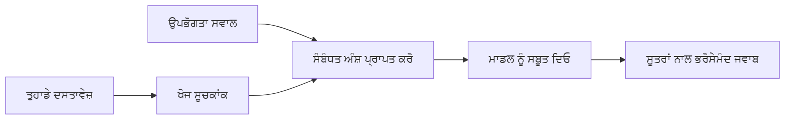

# ਤੁਸੀਂ ਆਪਣੇ ਦਸਤਾਵੇਜ਼ਾਂ ਦੇ ਆਧਾਰ 'ਤੇ ਪ੍ਰਸ਼ਨਾਂ ਦੇ ਜਵਾਬ ਦੇਣ ਲਈ AI ਨੂੰ ਸਿਖਾਓ:
## ਸੀਰੀਜ਼ 1: RAG, Azure ਵਿਰੁੱਧ ਖੁਲ੍ਹਾ-ਸਰੋਤ ਵਿਕਲਪ, ਅਤੇ ਕਦੋਂ ਫਾਈਨ-ਟਿਊਨਿੰਗ ਸਮਝਦਾਰ ਹੁੰਦੀ ਹੈ

> 2026 ਵਿੱਚ ਇੱਕ ਸੀਰੀਜ਼ ਦਾ ਪਹਿਲਾ ਲੇਖ ਜੋ ਮੇਰੇ 2023 Azure AI Search + Azure OpenAI ਦਸਤਾਵੇਜ਼ QA ਟਿਊਟੋਰਿਯਲਜ਼ ਦੀ ਦੁਬਾਰਾ ਸਮੀਖਿਆ ਕਰਦਾ ਹੈ।

ਸੀਰੀਜ਼ ਨੈਵੀਗੇਸ਼ਨ: [ਰਿਪੋਜ਼ਿਟਰੀ ਦਾ ਮੁੱਖ ਸਫ਼ਾ](../README.md) | ਅਗਲਾ: [ਸੀਰੀਜ਼ 2 - ਇੱਕ ਸਥਾਨਕ ਖੁਲ੍ਹਾ-ਸਰੋਤ RAG ਸਿਸਟਮ ਅੰਤ ਤੱਕ ਬਣਾਉਣਾ](./series-2-open-source-rag-end-to-end.md)

## 1. ਮੁਕੱਦਮਾ - ਪਹਿਲਾਂ ਦੇ RAG ਟਿਊਟੋਰਿਯਲ ਦੀ ਦੁਬਾਰਾ ਸਮੀਖਿਆ

2023 ਵਿੱਚ, ਮੈਂ ਦੋ ਟਿਊਟੋਰਿਯਲਜ਼ 'ਤੇ ਕੰਮ ਕੀਤਾ ਜੋ ChatGPT ਨੂੰ PDF ਦਸਤਾਵੇਜ਼ਾਂ ਵਿਚੋਂ ਪ੍ਰਸ਼ਨਾਂ ਦੇ ਜਵਾਬ ਦਿੰਦੇ ਸਿਖਾਉਂਦੇ ਸਨ, ਜਿਸ ਵਿੱਚ Azure AI Search ਅਤੇ Azure OpenAI ਵਰਤੇ ਗਏ। ਮੈਂ [LangChain ਵਰਜਨ](https://techcommunity.microsoft.com/blog/educatordeveloperblog/teach-chatgpt-to-answer-questions-using-azure-ai-search--azure-openai-lang-chain/3969713) ਲਿਖਿਆ, ਅਤੇ ਮੈਂ سندس ਸਾਥੀ [Semantic Kernel ਵਰਜਨ](https://techcommunity.microsoft.com/blog/educatordeveloperblog/teach-chatgpt-to-answer-questions-using-azure-ai-search--azure-openai-semantic-k/3985395) ਨੂੰ [ਲੀ ਸਟੌਟ](https://developer.microsoft.com/en-us/advocates/lee-stott) ਨਾਲ ਮਿਲ ਕੇ ਲਿਖਿਆ, ਜੋ ਮਾਇਕ੍ਰੋਸਾਫਟ ਵਿੱਚ ਪ੍ਰਿੰਸੀਪਲ ਕਲਾਊਡ ਐਡਵੋਕੇਟ ਮੈਨੇਜਰ ਹਨ। ਉਸ ਸਮੇਂ, "ਤੁਹਾਡੇ ਡਾਟਾ 'ਤੇ ChatGPT" ਦਾ ਵਿਚਾਰ ਬਹੁਤ ਸਾਰੇ ਡਿਵੈਲਪਰਾਂ ਲਈ ਨਵਾਂ ਲੱਗਦਾ ਸੀ। ਟਿਊਟੋਰਿਯਲਜ਼ ਨੇ Azure Blob Storage, Azure AI Search, Azure OpenAI, LangChain, Semantic Kernel, ਅਤੇ FAISS-ਸਟਾਈਲ ਵੇਕਟਰ ਰਿਟਰੀਵਲ ਵਰਤੇ PDF ਫਾਈਲਾਂ ਤੋਂ ਪ੍ਰਸ਼ਨ ਚੁੱਕਣ ਲਈ।

ਉਹ ਪਹਿਲਾ ਲੇਖ ਇਕ ਸਾਦਾ ਪਰ ਮਹੱਤਵਪੂਰਣ ਵਰਕਫਲੋ 'ਤੇ ਕੇਂਦਰਤ ਸੀ: ਦਸਤਾਵੇਜ਼ ਅਪਲੋਡ ਕਰਨਾ, ਉਨ੍ਹਾਂ ਨੂੰ ਇੰਡੈਕਸ ਕਰਨਾ, ਸੰਬੰਧਿਤ ਸਮੱਗਰੀ ਪ੍ਰਾਪਤ ਕਰਨੀ, ਅਤੇ ਇਕ ਮਾਡਲ ਨੂੰ ਉਸ ਸਮੱਗਰੀ ਦੇ ਆਧਾਰ 'ਤੇ ਜਵਾਬ ਦੇਣਾ।

2026 ਵਿੱਚ, RAG ਇਕੋਸਿਸਟਮ ਨੇ ਕਾਫੀ ਵਿਕਾਸ ਕੀਤਾ ਹੈ। Azure AI Search ਹੁਣ ਆਧੁਨਿਕ ਵੇਕਟਰ ਅਤੇ ਹਾਈਬ੍ਰਿਡ ਰਿਟਰੀਵਲ ਪੈਟਰਨਾਂ ਦਾ ਸਮਰਥਨ ਕਰਦਾ ਹੈ, Azure OpenAI Microsoft Foundry Models ਇੱਕੋਸਿਸਟਮ ਦਾ ਹਿੱਸਾ ਹੈ, ਅਤੇ ਨਵਾਂ v1 API ਮਾਸਿਕ `api-version` ਬਦਲਾਅ ਦੀ ਲੋੜ ਦੇ ਬਿਨਾਂ ਮਿਆਰੀ OpenAI ਕਲਾਇੰਟ ਵਰਤ ਸਕਦਾ ਹੈ। ਇਸਦੇ ਨਾਲ, ਖੁਲ੍ਹਾ-ਸਰੋਤ ਵਿਕਲਪ ਜਿਵੇਂ LangGraph, LlamaIndex, Haystack, Qdrant, Milvus, Weaviate, Chroma, Ollama, ਅਤੇ vLLM ਹਕੀਕਤੀ RAG ਸਿਸਟਮਾਂ ਲਈ ਲਾਗੂ ਹੁੰਦੇ ਹਨ।

ਇਸ ਲਈ ਮੈਂ ਇਹ ਵਿਸ਼ਾ ਫਿਰ ਤੋਂ ਚਰਚਾ ਕਰਨਾ ਚਾਹੁੰਦਾ ਹਾਂ। ਹੁਣ ਸਵਾਲ ਸਿਰਫ਼ ਇਹ ਨਹੀਂ ਰਹਿ ਗਿਆ "ਮੈਂ RAG ਕਿਵੇਂ ਬਣਾਵਾਂ?" ਹੁਣ ਕਈ ਤਰੀਕੇ ਹਨ, ਅਤੇ ਸਭ ਤੋਂ ਮਹੱਤਵਪੂਰਣ ਸਵਾਲ ਹੈ "ਮੇਰੇ ਹਾਲਾਤ ਲਈ ਕਿਹੜੀ ਆਰਕੀਟੈਕਚਰ ਚੁਣਨੀ ਚਾਹੀਦੀ ਹੈ?"

ਪਰ ਮੂਲ ਸਮੱਸਿਆ ਅਜੇ ਵੀ ਉਹੀ ਹੈ।

ਇੱਕ AI ਮਾਡਲ ਆਪਣੇ ਆਪ ਤੁਹਾਡੇ ਦਸਤਾਵੇਜ਼ਾਂ ਨੂੰ ਨਹੀਂ ਜਾਣਦਾ। ਇੱਕ ਲਾਭਕਾਰੀ ਦਸਤਾਵੇਜ਼-ਅਧਾਰਿਤ ਪ੍ਰਸ਼ਨ-ਜਵਾਬ ਸਿਸਟਮ ਬਣਾਉਣ ਲਈ, ਤੁਹਾਨੂੰ ਮਜ਼ਬੂਤ ਰਿਟਰੀਵਲ, ਗ੍ਰਾਊਂਡਿੰਗ, ਮੁਲਾਂਕਣ, ਅਤੇ ਚਾਲੂ ਵਰਕਫਲੋਜ਼ ਦੀ ਲੋੜ ਹੁੰਦੀ ਹੈ।

ਇਹ ਲੇਖ ਇੱਕ ਹੋਰ ਅੰਤ-ਤਕ-ਅੰਤ "PDF ਨਾਲ ਚੈਟ" ਟਿਊਟੋਰਿਯਲ ਨਹੀਂ ਹੈ। ਮੈਂ ਇਸ ਅਪਡੇਟਡ ਸੀਰੀਜ਼ ਦੀ ਸ਼ੁਰੂਆਤ ਉਸ ਸਵਾਲ ਨਾਲ ਕਰਨਾ ਚਾਹੁੰਦਾ ਹਾਂ ਜਿਸਦੀ ਹੁਣ ਮੈਨੂੰ ਸਭ ਤੋਂ ਵੱਧ ਚਿੰਤਾ ਹੈ: ਕਦੋਂ ਤੁਸੀਂ ਮੈਨੇਜ ਕੀਤੀ Azure ਆਰਕੀਟੈਕਚਰ ਚੁਣੋ, ਕਦੋਂ ਖੁਲ੍ਹਾ-ਸਰੋਤ RAG ਸਟੈਕ ਚੁਣੋ, ਅਤੇ ਕਦੋਂ ਫਾਈਨ-ਟਿਊਨਿੰਗ ਵਾਸਤਵ ਵਿੱਚ ਸਮਝਦਾਰ ਹੁੰਦੀ ਹੈ?

ਇਹ ਇਕ ਸੀਰੀਜ਼ ਦਾ ਪਹਿਲਾ ਲੇਖ ਹੈ ਜੋ ਦਸਤਾਵੇਜ਼-ਗ੍ਰਾਊਂਡ AI ਸਿਸਟਮ ਬਣਾਉਣ ਬਾਰੇ ਹੈ। ਇਸ ਪਹਿਲੇ ਹਿੱਸੇ ਵਿੱਚ, ਅਸੀਂ ਆਰਕੀਟੈਕਚਰ ਫੈਸਲਿਆਂ 'ਤੇ ਧਿਆਨ ਦੇਵਾਂਗੇ: ਕਿਉਂ RAG ਮੈਟਰ ਕਰਦਾ ਹੈ, ਕਦੋਂ Azure-ਆਧਾਰਿਤ ਮੈਨੇਜ ਕੀਤੀਆਂ ਸੇਵਾਵਾਂ ਲਾਭਕਾਰੀ ਹਨ, ਕਦੋਂ ਖੁਲ੍ਹਾ-ਸਰੋਤ ਵਿਕਲਪ ਸਮਝਦਾਰ ਹਨ, ਅਤੇ ਫਾਈਨ-ਟਿਊਨਿੰਗ ਕਿੱਥੇ ਫਿੱਟ ਹੁੰਦੀ ਹੈ।

ਦਸਤਾਵੇਜ਼ QA ਸਿਸਟਮ ਬਣਾਉਣ ਅਤੇ ਸਮੀਖਿਆ ਕਰਨ ਤੋਂ ਬਾਅਦ, ਮੈਨੂੰ ਹੁਣ ਇਸ ਗੱਲ ਵਿੱਚ ਘੱਟ ਦਿਲਚਸਪੀ ਹੈ ਕਿ ਕਿਹੜਾ ਟੂਲ ਡੈਮੋ ਵਿੱਚ ਸਭ ਤੋਂ ਵਧੀਆ ਲੱਗਦਾ ਹੈ ਅਤੇ ਵੱਧ ਦਿਲਚਸਪੀ ਹੈ ਕਿ ਕਿਹੜੀ ਆਰਕੀਟੈਕਚਰ ਅਸਲੀ ਯੂਜ਼ਰਾਂ, ਬਦਲਦੇ ਦਸਤਾਵੇਜ਼ਾਂ, ਅਧਿਕਾਰਾਂ, ਫੇਲ੍ਹਵਾਵਾਂ, ਅਤੇ ਮੇਂਟੇਨੈਂਸ ਨੂੰ ਬਰਕਰਾਰ ਰੱਖਦੀ ਹੈ।

## 2. ਤੁਹਾਡੇ AI ਨੂੰ ਇੱਕ ਖੋਜ ਪ੍ਰਣਾਲੀ ਦੀ ਲੋੜ ਕਿਉਂ ਹੈ

ਵੱਡੇ ਭਾਸ਼ਾ ਮਾਡਲ ਵਿਆਪਕ ਪਬਲਿਕ ਅਤੇ ਲਾਇਸੰਸ ਪ੍ਰਾਪਤ ਡਾਟਾ 'ਤੇ ਤਿਆਰ ਕੀਤੇ ਜਾਂਦੇ ਹਨ। ਉਹ ਜਨਰਲ ਵਿਸ਼ਿਆਂ ਬਾਰੇ ਬਹੁਤ ਜਾਣਦੇ ਹੋ ਸਕਦੇ ਹਨ, ਪਰ ਉਹ ਤੁਹਾਡੇ ਨਿੱਜੀ PDFs, ਅੰਦਰੂਨੀ ਨੀਤੀਆਂ, ਉਦਯੋਗੀ ਪ੍ਰਕਿਰਿਆਵਾਂ, ਖੋਜ ਬੇਨਦਾ, ਕਲਾਸਰੂਮ ਸਮੱਗਰੀ, ਗਾਹਕ ਸਹਾਇਤਾ ਨੋਟਸ, ਜਾਂ ਹਾਲ ਹੀ ਵਿੱਚ ਅਪਡੇਟ ਹੋਈ ਦਸਤਾਵੇਜ਼ਾਂ ਬਾਰੇ ਆਪਣੇ ਆਪ ਨਹੀਂ ਜਾਣਦੇ।

RAG ਬਾਰੇ ਸੌਖਾ ਤਰੀਕਾ ਸੋਚਣ ਦਾ ਇਹ ਹੈ: ਮਾਡਲ ਤੋਂ ਹਰ ਦਸਤਾਵੇਜ਼ ਯਾਦ ਰੱਖਣ ਦੀ ਉਮੀਦ ਕਰਨ ਦੀ ਥਾਂ, ਅਸੀਂ ਇਸ ਨੂੰ ਇੱਕ ਖੋਜ ਪ੍ਰਣਾਲੀ ਦਿੰਦੇ ਹਾਂ। ਜਦੋਂ ਉਪਭੋਗਤਾ ਪ੍ਰਸ਼ਨ ਪੁੱਛਦਾ ਹੈ, ਸਿਸਟਮ ਸਭ ਤੋਂ ਸੰਬੰਧਿਤ ਜਾਣਕਾਰੀ ਦੇ ਹਿੱਸੇ ਪਹਿਲਾਂ ਲੱਭਦਾ ਹੈ, ਫਿਰ ਉਹ ਹਿੱਸੇ ਮਾਡਲ ਨੂੰ ਸੰਦਰਭ ਵਜੋਂ ਦਿੰਦਾ ਹੈ।

ਇਹ ਇਸ ਲਈ ਜਰੂਰੀ ਹੈ ਕਿਉਂਕਿ ਬਹੁਤ ਸਾਰੇ ਅਸਲ ਦੁਨੀਆ ਦੇ ਗਿਆਨ ਸਰੋਤ ਨਿੱਜੀ, ਲਗਾਤਾਰ ਬਦਲਦੇ ਰਹਿੰਦੇ, ਅਧਿਕਾਰ-ਸੰਵੇਦਨਸ਼ੀਲ, ਕਈ ਪ੍ਰਣਾਲੀਆਂ 'ਚ ਸੰਭਾਲੇ ਜਾਂਦੇ, ਬਹੁਤ ਸਾਰੀਆਂ ਫਾਰਮੈਟਾਂ ਵਿੱਚ ਲਿਖੇ ਜਾਂਦੇ, ਅਤੇ ਜ਼ਿਆਦਾ ਵੱਡੇ ਹੁੰਦੇ ਹਨ ਜੋ ਸਿੱਧੇ ਪ੍ਰੰਪਟ ਵਿੱਚ ਪੇਸਟ ਕਰਨ ਲਈ ਬਹੁਤ ਵੱਡੇ ਹੁੰਦੇ ਹਨ।

ਉਦਾਹਰਨ ਲਈ, ਜੇਕਰ ਇੱਕ ਸਕੂਲ, ਕੰਪਨੀ, ਜਾਂ ਖੋਜ ਟੀਮ ਕੋਲ 10,000 ਅੰਦਰੂਨੀ ਦਸਤਾਵੇਜ਼ ਹਨ, ਤਾਂ ਮਾਡਲ ਉਨ੍ਹਾਂ ਦਸਤਾਵੇਜ਼ਾਂ ਤੋਂ ਭਰੋਸੇਯੋਗ ਜਵਾਬ ਨਹੀਂ ਦੇ ਸਕਦਾ ਜਦ ਤੱਕ ਸਿਸਟਮ ਸਹੀ ਸਮੇਂ ਤੇ ਸਹੀ ਹਿੱਸੇ ਪ੍ਰਾਪਤ ਨਹੀਂ ਕਰਦਾ।

ਇਹ ਕੁਦਰਤੀ ਤੌਰ 'ਤੇ ਇੱਕ ਆਮ ਸਵਾਲ ਵੱਲ ਲੈ ਜਾਂਦਾ ਹੈ:

ਫਾਈਨ-ਟਿਊਨਿੰਗ ਕਿਉਂ ਨਹੀਂ?

ਫਾਈਨ-ਟਿਊਨਿੰਗ ਲਾਭਦਾਇਕ ਹੋ ਸਕਦੀ ਹੈ, ਪਰ ਇਹ ਅਕਸਰ ਦਸਤਾਵੇਜ਼ ਗਿਆਨ ਲਈ ਪਹਿਲਾ ਸਹੀ ਔਜ਼ਾਰ ਨਹੀਂ ਹੁੰਦੀ। ਜੇ ਗਿਆਨ ਬਾਰੰਬਾਰ ਬਦਲਦਾ ਹੈ, ਜੇ ਹਵਾਲੇ ਜ਼ਰੂਰੀ ਹਨ, ਜਾਂ ਜੇ ਭੁਗਤਾਣ ਅਧਿਕਾਰ ਮਹੱਤਵਪੂਰਣ ਹਨ, ਤਾਂ RAG ਅਕਸਰ ਬਿਹਤਰ ਸ਼ੁਰੂਆਤ ਹੁੰਦਾ ਹੈ। ਫਾਈਨ-ਟਿਊਨਿੰਗ ਵਿਹਾਰ, ਅੰਦਾਜ਼ਾ, ਨਿਕਾਸ ਫਾਰਮੈਟ, ਅਤੇ ਕੰਮ ਦੇ ਪੈਟਰਨ ਸਿਖਾਉਣ ਲਈ ਬਿਹਤਰ ਹੁੰਦੀ ਹੈ।

## 3. RAG ਆਰਕੀਟੈਕਚਰ ਅਮਲ ਵਿੱਚ

ਕਲਪਨਾ ਕਰੋ ਕਿ ਤੁਸੀਂ ਇੱਕ ਸਕੂਲ ਲਈ AI ਸਹਾਇਕ ਬਣਾ ਰਹੇ ਹੋ। ਸਹਾਇਕ ਨੂੰ ਨੀਤੀ PDFs, ਕੋਰਸ ਗਾਈਡ, ਅੰਦਰੂਨੀ FAQ ਪੰਨਿਆਂ ਅਤੇ ਹਾਲ ਹੀ ਵਿੱਚ ਅਪਡੇਟ ਕੀਤਾ ਗਿਆ ਐਲਾਨ ਤੋਂ ਪ੍ਰਸ਼ਨਾਂ ਦੇ ਜਵਾਬ ਦੇਣੇ ਹਨ।

ਜੇ ਕੋਈ ਵਿਦਿਆਰਥੀ ਪੁੱਛਦਾ ਹੈ, "ਕੀ ਮੈਂ ਆਪਣੀ ਅੰਤਿਮ ਅਸਾਈਨਮੈਂਟ ਲਈ ਜਨਰੇਟਿਵ AI ਵਰਤ ਸਕਦਾ ਹਾਂ?", ਤਾਂ ਸਿਸਟਮ ਨੂੰ ਮਾਡਲ ਦੀ ਆਮ ਯਾਦ ਤੋਂ ਜਵਾਬ ਨਹੀਂ ਦੇਣਾ ਚਾਹੀਦਾ। ਇਸ ਨੂੰ ਪਹਿਲਾਂ ਸੰਬੰਧਿਤ ਸਕੂਲੀ ਨੀਤੀ ਲੱਭਣੀ ਚਾਹੀਦੀ ਹੈ, AI ਵਰਤੋਂ ਬਾਰੇ ਸੈਕਸ਼ਨ ਪ੍ਰਾਪਤ ਕਰਨਾ ਚਾਹੀਦਾ ਹੈ, ਅਤੇ ਫਿਰ ਉਸ ਸਬੂਤ ਦੇ ਆਧਾਰ ਤੇ ਮਾਡਲ ਨੂੰ ਜਵਾਬ ਦੇਣਾ ਚਾਹੀਦਾ ਹੈ।

ਇਹ ਹੈ ਵਾਸਤਵ ਵਿੱਚ RAG।

ਉੱਚ ਸਤਰ 'ਤੇ, ਤੁਸੀਂ ਫਲੋ ਨੂੰ ਇਸ ਤਰ੍ਹਾਂ ਸੋਚ ਸਕਦੇ ਹੋ:

ਵੇਰਵਾ ਹੋਰ ਜਟਿਲ ਹੋ ਸਕਦੇ ਹਨ, ਪਰ ਸਧਾਰਣ ਵਿਚਾਰ ਇਹ ਹੈ: ਮਾਡਲ ਇਕੱਲਾ ਜਵਾਬ ਨਹੀਂ ਦਿੰਦਾ। ਇਹ ਪ੍ਰਾਪਤ ਸਬੂਤ ਦੇ ਨਾਲ ਜਵਾਬ ਦਿੰਦਾ ਹੈ।

ਸਭ ਤੋਂ ਪਹਿਲਾਂ, ਦਸਤਾਵੇਜ਼ਾਂ ਨੂੰ ਸਟੋਰੇਜ ਪ੍ਰਣਾਲੀਆਂ ਜਿਵੇਂ Azure Blob Storage, SharePoint, GitHub, ਜਾਂ ਅੰਦਰੂਨੀ CMS ਤੋਂ ਲਿਆਉਂਦੇ ਹਨ। ਫਿਰ ਸਿਸਟਮ ਉਨ੍ਹਾਂ ਨੂੰ ਇਹਨਾਂ ਜਰੂਰੀ ਸਰਚਨਾ ਰੱਖਕੇ ਟੈਕਸਟ ਵਿੱਚ ਤਬਦੀਲ ਕਰਦਾ ਹੈ ਜਿਵੇਂ ਸਿਰਲੇਖ, ਪੰਨਾ ਨੰਬਰ, ਤਬੀਲੇ, ਹਿੱਸੇ ਅਤੇ ਸ੍ਰੋਤ ਸਥਾਨ।

ਅਗਲਾ, ਸਮੱਗਰੀ ਨੂੰ ਟੁਕੜਿਆਂ ਵਿੱਚ ਵੰਡਿਆ ਜਾਂਦਾ ਹੈ। ਇਹ ਕਦਮ ਸਧਾਰਣ ਲੱਗਦਾ ਹੈ, ਪਰ ਇਹ ਸਿਸਟਮ ਦੇ ਸਭ ਤੋਂ ਮਹੱਤਵਪੂਰਣ ਹਿੱਸਿਆਂ ਵਿੱਚੋਂ ਇੱਕ ਹੈ। ਜੇ ਕੋਈ ਟੁਕੜਾ ਬਹੁਤ ਛੋਟਾ ਹੋਵੇ, ਤਾਂ ਸੰਦਰਭ ਖਤਮ ਹੋ ਸਕਦਾ ਹੈ। ਜੇ ਟੁਕੜਾ ਬਹੁਤ ਵੱਡਾ ਹੋਵੇ, ਤਾਂ ਇਸ ਵਿੱਚ ਗੈਰ-ਸੰਬੰਧਿਤ ਜਾਣਕਾਰੀ ਸ਼ਾਮਿਲ ਹੋ ਸਕਦੀ ਹੈ ਅਤੇ ਰਿਟਰੀਵਲ ਘੱਟ ਸੁਚੱਜਾ ਹੋ ਸਕਦਾ ਹੈ।

ਟੁਕੜੇ ਬਣਾਉਣ ਤੋਂ ਬਾਅਦ, ਸਿਸਟਮ ਐਂਬੈੱਡਿੰਗ ਬਣਾਉਂਦਾ ਹੈ ਅਤੇ ਉਨ੍ਹਾਂ ਨੂੰ ਮੂਲ ਟੈਕਸਟ ਅਤੇ ਮੈਟਾਡੇਟਾ ਜਿਵੇਂ ਫਾਈਲ ਨਾਂ, ਪੰਨਾ ਨੰਬਰ, ਅਧਿਕਾਰ, ਦਸਤਾਵੇਜ਼ ਦਾ ਸੰਸਕਰਣ, ਅਤੇ ਸ੍ਰੋਤ URL ਨਾਲ ਮਿਲਾ ਕੇ ਖੋਜਯੋਗ ਇੰਡੈਕਸ ਵਿੱਚ ਸਟੋਰ ਕਰਦਾ ਹੈ।

ਜਦੋਂ ਉਪਭੋਗਤਾ ਪ੍ਰਸ਼ਨ ਕਰਦਾ ਹੈ, ਸਿਸਟਮ ਕੀਵਰਡ ਖੋਜ, ਵੇਕਟਰ ਖੋਜ, ਜਾਂ ਹਾਈਬ੍ਰਿਡ ਖੋਜ ਦੀ ਵਰਤੋਂ ਕਰਕੇ ਉਮੀਦਵਾਰ ਟੁਕੜੇ ਪਰਾਪਤ ਕਰਦਾ ਹੈ। ਇੱਕ ਰੀਰੈਂਕਰ ਫਿਰ ਉਹਨਾਂ ਟੁਕੜਿਆਂ ਨੂੰ ਇਸ ਤਰ੍ਹਾਂ ਦੁਬਾਰਾ ਕ੍ਰਮਬੱਧ ਕਰ ਸਕਦਾ ਹੈ ਤਾਂ ਜੋ ਸਭ ਤੋਂ ਲਾਭਦਾਇਕ ਸਬੂਤ ਉਪਰਲੇ ਹਿੱਸੇ 'ਚ ਹੋਵੇ।

ਆਖ਼ਿਰਕਾਰ, ਮਾਡਲ ਪ੍ਰਸ਼ਨ ਅਤੇ ਪ੍ਰਾਪਤ ਸਬੂਤ ਪ੍ਰਾਪਤ ਕਰਦਾ ਹੈ। ਜਵਾਬ ਉਸ ਸਬੂਤ 'ਤੇ ਆਧਾਰਿਤ ਹੋਣਾ ਚਾਹੀਦਾ ਹੈ ਅਤੇ ਹਵਾਲੇ ਵਾਪਸ ਕਰਨੇ ਚਾਹੀਦੇ ਹਨ ਤਾਂ ਕਿ ਯੂਜ਼ਰ ਸ੍ਰੋਤ ਦੀ ਜਾਂਚ ਕਰ ਸਕੇ।

ਮਹੱਤਵਪੂਰਣ ਗੱਲ ਇਹ ਹੈ ਕਿ RAG ਸਿਰਫ਼ "PDF ਨੂੰ ਵੇਕਟਰ ਡੇਟਾਬੇਸ ਵਿੱਚ ਪਾਉਣਾ" ਨਹੀਂ ਹੈ। ਜਵਾਬ ਦੀ ਗੁਣਵੱਤਾ ਪੂਰੇ ਵਰਕਫਲੋ ਤੇ ਨਿਰਭਰ ਕਰਦੀ ਹੈ: ਪਾਰਸਿੰਗ, ਟੁਕੜਾ ਬਣਾਉਣਾ, ਰਿਟਰੀਵਲ, ਰੀਰੈਂਕਿੰਗ, ਪ੍ਰਾਂਪਟਿੰਗ, ਹਵਾਲੇ, ਅਤੇ ਮੁਲਾਂਕਣ।

ਇਸ ਲਈ ਦਸਤਾਵੇਜ਼ ਦੀ ਬਣਤਰ ਮਹੱਤਵਪੂਰਣ ਹੈ। PDF ਵਿੱਚ, ਸਿਰਲੇਖ, ਤਬੀਲਾ, ਫੁਟਨੋਟ, ਜਾਂ ਪੰਨਾ ਹੱਦ ਕਿਸੇ ਪੈਰੇਗ੍ਰਾਫ ਦਾ ਅਰਥ ਬਦਲ ਸਕਦਾ ਹੈ। Azure 'ਤੇ, Document Layout ਸкил Azure Document Intelligence ਦੀ ਬਣਤਰ-ਸੂਚਕ ਸਮਰੱਥਾ ਵਰਤਦਾ ਹੈ ਜੋ RAG ਸਿਸਟਮਾਂ ਲਈ ਟੁਕੜਾ ਬਣਾਉਣ ਅਤੇ ਰਿਟਰੀਵਲ ਦੀ ਗੁਣਵੱਤਾ ਵਿੱਚ ਸੁਧਾਰ ਕਰ ਸਕਦਾ ਹੈ।

## 4. 2023 ਤੋਂ ਕਿਹੜੇ ਬਦਲਾਅ ਆਏ ਹਨ?

2023 ਦਾ ਟਿਊਟੋਰਿਯਲ ਆਪਣੇ ਸਮੇਂ ਲਈ ਵਧੀਆ ਸ਼ੁਰੂਆਤ ਸੀ:

- Azure Blob Storage ਵਿੱਚ PDF ਫਾਈਲਾਂ ਸਟੋਰ ਕੀਤੀਆਂ ਗਈਆਂ।
- Azure AI Search ਸਮੱਗਰੀ ਨੂੰ ਇੰਡੈਕਸ ਕੀਤਾ।
- LangChain ਨੇ ਰਿਟਰੀਵਲ ਨੂੰ Azure OpenAI ਨਾਲ ਜੋੜਿਆ।
- FAISS ਸਧਾਰਣ ਸਥਾਨਕ ਵੇਕਟਰ ਸਟੋਰ ਵਜੋਂ ਕੰਮ ਕੀਤਾ।
- ਉਦਾਹਰਨ ਵਜੋਂ `gpt-35-turbo` ਅਤੇ `text-embedding-ada-002` ਵਰਤੇ ਗਏ।

2026 ਵਿੱਚ, ਇੱਕ ਆਧੁਨਿਕ ਵਰਜਨ ਕਈ ਬਦਲਾਅ ਦਰਸਾਉਂਦਾ ਹੋਣਾ ਚਾਹੀਦਾ ਹੈ।

ਸਭ ਤੋਂ ਪਹਿਲਾਂ, ਰਿਟਰੀਵਲ ਵਿੱਚ ਪੱਕੜ ਆ ਗਈ ਹੈ। 2023 ਵਿੱਚ, ਬਹੁਤ ਸਾਰੇ ਡੈਮੋ ਸਧਾਰਣ ਵੇਕਟਰ ਸਮਾਨਤਾ ਖੋਜ ਵਰਤਦੇ ਸਨ। ਅੱਜ, ਹਾਈਬ੍ਰਿਡ ਰਿਟਰੀਵਲ ਅਕਸਰ ਗੰਭੀਰ ਦਸਤਾਵੇਜ਼ QA ਲਈ ਡਿਫੌਲਟ ਹੈ। Azure AI Search ਇੱਕ ئي ਬੇਨਤੀ ਵਿੱਚ ਕੀਵਰਡ ਅਤੇ ਵੇਕਟਰ ਪ੍ਰਸ਼ਨਾਂ ਨੂੰ ਜੋੜ ਕੇ ਹਾਈਬ੍ਰਿਡ ਖੋਜ ਦਾ ਸਮਰਥਨ ਕਰਦਾ ਹੈ ਅਤੇ Reciprocal Rank Fusion ਨਾਲ ਨਤੀਜੇ ਮਿਲਾਉਂਦਾ ਹੈ। ਸੈਮਾਂਟਿਕ ਰੈਂਕਰ ਫਿਰ ਪੂਰੇ ਟੈਕਸਟ, ਵੇਕਟਰ, ਅਤੇ ਹਾਈਬ੍ਰਿਡ ਨਤੀਜਿਆਂ ਦੇ ਟੈਕਸਟ ਪਾਸੇ ਨੂੰ ਰੀਰੈਂਕ ਵੀ ਕਰ ਸਕਦਾ ਹੈ।

ਦੂਜਾ, ਇੰਗੈਸਟਨ ਹੋਰ ਜਟਿਲ ਹੋ ਚੁੱਕੀ ਹੈ। ਹਰ ਦਸਤਾਵੇਜ਼ ਨੂੰ ਐਪਲੀਕੇਸ਼ਨ ਕੋਡ ਨਾਲ manually ਵੰਡਣ ਦੀ ਥਾਂ, Azure AI Search ਚੰਕਿੰਗ, ਐਂਬੈੱਡਿੰਗ, ਅਤੇ ਕੋਰੀ-ਸਮੇਂ ਵੇਕਟਰਾਈਜ਼ੇਸ਼ਨ ਲਈ ਇਕਜੁਟ ਵੇਕਟਰਾਈਜੇਸ਼ਨ ਦੀ सपੋਰਟ ਕਰਦਾ ਹੈ। PDFs ਅਤੇ ਦਸਤਾਵੇਜ਼ ਭਾਰ ਵਾਲੀਆਂ ਕੰਮ-ਭਾਰਾਂ ਲਈ, Document Layout ਸкил ਨਿਯਤ-ਆਕਾਰ ਵਾਲੇ ਟੁਕੜਿਆਂ ਨਾਲੋਂ ਵੱਧ ਬਣਤਰ ਕਾਇਮ ਰੱਖ ਸਕਦਾ ਹੈ।

ਤੀਜਾ, ਸੰਚਾਲਨ ਹੋਰ ਜਰੂਰੀ ਹੋ ਗਿਆ ਹੈ। ਮੁਸ਼ਕਲ ਹਿੱਸਾ ਕਈ ਵਾਰੀ ਸਿੱਧੀ LLM API ਕਾਲ ਨਹੀਂ ਹੁੰਦੀ। ਮੁਸ਼ਕਲ ਹਿੱਸਾ ਫੇਲ, ਮੁੜ ਕੋਸ਼ਿਸ਼, ਪੁਰਾਣਾ ਰਿਟਰੀਵਲ, ਟੁਕੜਾ ਗੁਣਵੱਤਾ, ਲੰਬੇ ਸਮੇਂ ਚੱਲਣ ਵਾਲੇ ਵਰਕਫਲੋਜ਼, ਮਨੁੱਖੀ ਸਮੀਖਿਆ, ਅਤੇ ਵਿਆਪਕ ਪੱਧਰ 'ਤੇ ਮੁਲਾਂਕਣ ਹੈ। ਇੱਥੇ ਵਰਕਫਲੋ-ਕੇਂਦਰਤ ਟੂਲ ਜਿਵੇਂ LangGraph, LlamaIndex ਵਰਕਫਲੋਜ਼, Haystack ਪਾਈਪਲਾਈਨਜ਼, ਅਤੇ ਪਲੇਟਫਾਰਮ-ਪੱਧਰੀ ਮੁਲਾਂਕਣ ਅਤੇ ਨਿਰੀਖਣ ਟੂਲ ਇੱਕ ਕੇਵਲ ਸਧਾਰਣ ਲੀਨੀਅਰ ਚੇਨ ਨਾਲੋਂ ਵੱਧ ਲਾਗੂ ਹੁੰਦੇ ਹਨ।

ਚੌਥਾ, ਮੁਲਾਂਕਣ ਹੁਣ ਵਿਕਲਪ ਨਹੀਂ ਰਹਿ ਗਿਆ। ਇੱਕ ਡੈਮੋ ਇਕ ਪ੍ਰਸ਼ਨ ਨਾਲ ਪ੍ਰਭਾਵਸ਼ਾਲੀ ਲੱਗ ਸਕਦਾ ਹੈ। ਪਰ ਉਤਪਾਦਨ ਸਿਸਟਮ ਨੂੰ ਟੈਸਟ ਸੈੱਟ, ਰਿਗ੍ਰੈਸ਼ਨ ਚੈੱਕ, ਰਿਟਰੀਵਲ ਮੈਟਰਿਕਸ, ਗ੍ਰਾਊਂਡਡਨੈਸ ਚੈੱਕ, ਅਤੇ ਨਿਗਰਾਨੀ ਦੀ ਲੋੜ ਹੁੰਦੀ ਹੈ। ਬਿਨਾਂ ਮੁਲਾਂਕਣ ਦੇ, ਇਹ ਜਾਣਨਾ ਮੁਸ਼ਕਲ ਹੈ ਕਿ ਸਿਸਟਮ ਸੁਧਾਰ ਕਰ ਰਿਹਾ ਹੈ ਜਾਂ ਸਿਰਫ਼ ਬਦਲ ਰਿਹਾ ਹੈ।

## 5. Azure ਅਤੇ ਖੁਲ੍ਹਾ-ਸਰੋਤ RAG ਸਟੈਕ ਵਿੱਚ ਚੋਣ

ਮੈਂ ਨਹੀਂ ਸੋਚਦਾ ਕਿ ਲਾਭਕਾਰੀ ਸਵਾਲ ਇਹ ਹੈ "ਕੀ Azure ਖੁਲ੍ਹਾ ਸੋਰਸ ਤੋਂ ਵਧੀਆ ਹੈ?" ਜਾਂ "ਕੀ ਖੁਲ੍ਹਾ ਸਰੋਤ Azure ਤੋਂ ਵਧੀਆ ਹੈ?"

ਲਾਭਕਾਰੀ ਸਵਾਲ ਇਹ ਹੈ: ਤੁਸੀਂ ਕਿਹੜਾ ਸਿਸਟਮ ਬਣਾ ਰਹੇ ਹੋ, ਕੌਣ ਇਹ ਚਲਾਵੇਗਾ, ਤੁਹਾਡੇ ਕੋਲ ਕੀ ਸੀਮਾਵਾਂ ਹਨ, ਅਤੇ ਕਿਹੜੇ ਫੇਲ੍ਹ ਮੋਡ ਬਰਦਾਸ਼ਤ ਨਹੀਂ ਕਰਨਗੇ?

ਜਦੋਂ ਮੈਂ ਦਸਤਾਵੇਜ਼ QA ਦੇ ਉਦਾਹਰਣ ਬਣਾਉਣਾ ਸ਼ੁਰੂ ਕੀਤਾ, ਮੈਂ ਅਕਸਰ ਸੋਚਦਾ ਸੀ ਕਿ ਕੀ ਰਿਟਰੀਵਲ ਕੰਮ ਕਰਦਾ ਹੈ। ਕੀ ਮੈਂ PDFs ਅਪਲੋਡ ਕਰ ਸਕਦਾ ਹਾਂ, ਉਨ੍ਹਾਂ ਨੂੰ ਖੋਜ ਸਕਦਾ ਹਾਂ, ਅਤੇ ਜਵਾਬ ਤਿਆਰ ਕਰ ਸਕਦਾ ਹਾਂ? ਇਹ ਇਕ ਠੀਕ ਸ਼ੁਰੂਆਤੀ ਬਿੰਦੂ ਸੀ।

ਵੱਧ ਹਕੀਕਤੀ AI ਵਰਕਫਲੋਜ਼ 'ਤੇ ਕੰਮ ਕਰਨ ਤੋਂ ਬਾਅਦ, ਮੇਰੀ ਮੁਲਾਂਕਣ ਬਦਲੀ। ਹੁਣ ਮੈਂ RAG ਸਟੈਕ ਦੀ ਚੋਣ ਤੋਂ ਪਹਿਲਾਂ ਚਾਰ ਚੀਜ਼ਾਂ ਵੇਖਦਾ ਹਾਂ:

- ਪਛਾਣ ਅਤੇ ਅਧਿਕਾਰ
- ਰਿਟਰੀਵਲ ਦੀ ਗੁਣਵੱਤਾ
- ਵਰਕਫਲੋ ਭਰੋਸੇਯੋਗਤਾ
- ਚਾਲੂ ਮਾਲਕੀ

ਇਹ ਚਾਰ ਖੇਤਰ ਮਾਡਲ ਬੈਂਚਮਾਰਕ ਤੋਂ ਕਾਫੀ ਵੱਧ ਜਾਣਕਾਰੀ ਦਿੰਦੇ ਹਨ।

Azure-ਆਧਾਰਿਤ ਆਰਕੀਟੈਕਚਰਾਂ ਅਕਸਰ ਉਹਨਾਂ ਸਮਿਆਂ ਵਿੱਚ ਸਮਝਦਾਰ ਹੁੰਦੇ ਹਨ ਜਦ ਉਦਯੋਗ ਸਮੱਗਰੀ ਇੰਟਰਗ੍ਰੇਸ਼ਨ ਮੁਸ਼ਕਲ ਹੁੰਦਾ ਹੈ। ਜੇਕਰ ਟੀਮ ਪਹਿਲਾਂ ਹੀ Microsoft Entra ID, Microsoft 365, Azure Storage, ਨਿੱਜੀ ਨੈਟਵਰਕਿੰਗ, RBAC, ਅਤੇ Azure ਨਿਗਰਾਨੀ 'ਤੇ ਨਿਰਭਰ ਕਰਦੀ ਹੈ, ਤਾਂ Azure AI Search ਅਤੇ Azure OpenAI ਚਾਲੂ ਕੰਪਲੈਕੇਸ਼ਨ ਘਟਾਉਂਦੇ ਹਨ। ਇਸ ਮਾਹੌਲ ਵਿੱਚ, Azure ਸਿਰਫ਼ ਮਾਡਲ API ਹੀ ਨਹੀਂ ਹੁੰਦਾ। ਮੁੱਲ ਆਸ ਪਾਸ ਦੀ ਪ੍ਰਣਾਲੀ ਦਾ ਹੁੰਦਾ ਹੈ: ਪਛਾਣ, ਗਵਰਨੈਂਸ, ਮੈਨੇਜ ਕੀਤੀ ਖੋਜ, ਸੁਰੱਖਿਆ ਇੰਟੀਗ੍ਰੇਸ਼ਨ, ਸਹਾਇਤਾ, ਅਤੇ ਜਾਣਪਹਚਾਣ ਵਾਲੀ ਚਾਲੂ ਪ੍ਰਕਿਰਿਆਵਾਂ।

ਖੁਲ੍ਹਾ-ਸਰੋਤ ਆਰਕੀਟੈਕਚਰ ਅਕਸਰ ਉਹਨਾਂ ਸਮਿਆਂ ਵਿੱਚ ਸਮਝਦਾਰ ਹੁੰਦੇ ਹਨ ਜਦ ਲਚੀਲਾਪਨ ਮੁਸ਼ਕਲ ਹੁੰਦਾ ਹੈ। ਜੇਕਰ ਟੀਮ ਨੂੰ ਸਥਾਨਕ ਇੰਫੇਰੰਸ, ਕਲਾਉਡ ਪੋਰਟੇਬਿਲਟੀ, ਕਸਟਮ ਰਿਟਰੀਵਲ ਪਾਈਪਲਾਈਨ, ਵਿਸ਼ੇਸ਼ੀਕृत ਰੀਰੈਂਕਿੰਗ, ਜਾਂ ਸਿੱਧਾ ਵੇਕਟਰ ਡੇਟਾਬੇਸ ਅਤੇ ਮodel-ਸੇਵਾ ਲੇਅਰ 'ਤੇ ਨਿਯੰਤਰਣ ਚਾਹੀਦਾ ਹੈ, ਤਾਂ ਖੁਲ੍ਹਾ-ਸਰੋਤ ਸਟੈਕ ਇੱਕ ਬਿਹਤਰ ਯੋਗਦਾਨ ਹੋ ਸਕਦਾ ਹੈ। ਇਸਦਾ ਟ੍ਰੇਡ-ਆਫ ਇਹ ਹੈ ਕਿ ਟੀਮ ਵਧੇਰੇ ਭਰੋਸੇਯੋਗਤਾ ਕੰਮ ਦੀ ਮਾਲਕੀ ਲੈਂਦੀ ਹੈ: ਬੈਕਅਪ, ਸਕੇਲਿੰਗ, ਲੇਟੈਂਸੀ, ਮਾਈਗ੍ਰੇਸ਼ਨ, ਨਿਗਰਾਨੀ, ਅਤੇ ਸੁਰੱਖਿਆ।

ਵਾਸਤਵ ਵਿੱਚ, ਬਹੁਤ ਸਾਰੇ ਉਤਪਾਦਨ AI ਸਿਸਟਮ ਪੂਰੀ ਤਰ੍ਹਾਂ ਕਲਾਉਡ-ਨੈਟਿਵ ਜਾਂ ਪੂਰੀ ਤਰ੍ਹਾਂ ਖੁਲ੍ਹਾ-ਸਰੋਤ ਨਹੀਂ ਹੁੰਦੇ। ਉਹ ਅਕਸਰ ਲਚੀਲਾਪਣ, ਗਵਰਨੈਂਸ, ਅਤੇ ਇੰਜੀਨੀਅਰਿੰਗ ਲਚੀਲਾਪਨ ਵਿੱਚ ਸੰਤੁਲਨ ਵਾਲੇ ਹਾਈਬ੍ਰਿਡ ਸਿਸਟਮ ਹੁੰਦੇ ਹਨ।

ਉਦਾਹਰਨ ਵਜੋਂ, ਮੈਨੂੰ ਇਸ ਗੱਲ ਤੇ ਹੈਰਾਨੀ ਨਹੀਂ ਹੋਵੇਗੀ ਕਿ ਕੋਈ ਸਿਸਟਮ ਮਾਡਲ ਐਕਸੈਸ ਲਈ Azure OpenAI, ਵਰਕਫਲੋ ਸੰਚਾਲਨ ਲਈ LangGraph, ਡਿਪਲੌਇਮੈਂਟ ਲਈ Azure ਹੋਸਟਿੰਗ, ਅਤੇ ਖਾਸ ਰਿਟਰੀਵਲ ਲਈ ਇੱਕ ਖੁਲ੍ਹਾ-ਸਰੋਤ ਵੇਕਟਰ ਡੇਟਾਬੇਸ ਵਰਤਦਾ ਹੈ। ਇਹ ਆਰਕੀਟੈਕਚਰਲ ਅਸੰਗਤਤਾ ਨਹੀਂ ਹੈ। ਇਹ ਹਰ ਹਿੱਸੇ ਲਈ ਮੈਨੇਜ ਕੀਤੀ ਸੇਵਾ ਅਤੇ ਇੰਜੀਨੀਅਰਿੰਗ ਨਿਯੰਤਰਣ ਦਾ ਸਹੀ ਪੱਧਰ ਚੁਣ ਰਹਾ ਹੈ।

ਮੈਂ ਉਹ ਹਾਈਬ੍ਰਿਡ ਆਰਕੀਟੈਕਚਰ ਪਸੰਦ ਕਰਦਾ ਹਾਂ ਜਦ ਮੈਨੇਜ ਕੀਤਾ ਪਲੇਟਫਾਰਮ ਮਹੱਤਵਪੂਰਣ ਉਦਯੋਗ ਸਮੱਸਿਆਵਾਂ ਨੂੰ ਹੱਲ ਕਰਦਾ ਹੈ, ਤੇ ਖੁਲ੍ਹਾ-ਸਰੋਤ ਹਿੱਸੇ ਟੀਮ ਨੂੰ ਇਸ ਅਸਲ ਵਿੱਚ ਲੋੜੀਂਦੇ ਲਚੀਲਾਪਨ ਦਿੰਦੇ ਹਨ।

## 6. ਇੱਕ ਵਿਆਵਹਾਰਿਕ ਫੈਸਲਾ ਗਾਈਡ

ਇਹ ਫੈਸਲਾ ਟੇਬਲ ਮੈਂ ਟੀਮ ਨਾਲ RAG ਸਟੈਕ ਚੁਣਣ ਤੋਂ ਪਹਿਲਾਂ ਵਰਤਾਂਗਾ:

| ਫੈਸਲਾ ਖੇਤਰ | ਜਦੋਂ Azure ਮੈਨੇਜ ਕੀਤਾ ਸਟੈਕ ਮਜ਼ਬੂਤ ਹੁੰਦਾ ਹੈ... | ਜਦੋਂ ਖੁਲ੍ਹਾ-ਸਰੋਤ ਸਟੈਕ ਮਜ਼ਬੂਤ ਹੁੰਦਾ ਹੈ... |
| --- | --- | --- |
| ਪਛਾਣ ਅਤੇ ਪਹੁੰਚ | Entra ID, RBAC, ਮੈਨੇਜ ਕੀਤੀ ਪਛਾਣ, ਅਤੇ ਉਦਯੋਗ ਅਧਿਕਾਰ ਕੇਂਦਰੀ ਹਨ | ਕਸਟਮ ਆਥ, ਗੈਰ-Microsoft ਪਛਾਣ, ਜਾਂ ਐਪ-ਵਿਸ਼ੇਸ਼ ਪਹੁੰਚ ਲਾਜਿਕ ਪ੍ਰਮੁੱਖ ਹੈ |
| ਚਾਲੂ ਪ੍ਰਕਿਰਿਆਵਾਂ | ਟੀਮ ਮੈਨੇਜ ਕੀਤੀ ਢਾਂਚਾ, ਸਹਾਇਤਾ, SLA, ਅਤੇ ਸਾਦਾ ਸ਼ੁਰੂਆਤ ਚਾਹੁੰਦੀ ਹੈ | ਟੀਮ ਵੇਕਟਰ ਡੇਟਾਬੇਸ, ਮਾਡਲ ਸਰਵਿੰਗ, ਬੈਕਅਪ, ਅਤੇ ਸਕੇਲਿੰਗ ਚਲਾ ਸਕਦੀ ਹੈ |
| ਰਿਟਰੀਵਲ | ਹਾਈਬ੍ਰਿਡ ਖੋਜ, ਸੈਮਾਂਟਿਕ ਰੈਂਕਿੰਗ, ਫਿਲਟਰ, ਅਤੇ ਮੈਟਾਡੇਟਾ ਖੋਜ ਜ਼ਿਆਦਾਤਰ ਲੋੜਾਂ ਨੂੰ ਪੂਰਾ ਕਰਦੇ ਹਨ | ਟੀਮ ਨੂੰ ਕਸਟਮ ਰਿਟਰੀਵਲ, ਵਿਸ਼ੇਸ਼ੀਕਤ ਰੀਰੈਂਕਿੰਗ, ਜਾਂ ਪਰਯੋਗਾਤਮਕ ਇੰਡੈਕਸਿੰਗ ਦੀ ਲੋੜ ਹੈ |
| ਪੋਰਟੇਬਿਲਟੀ | Azure ਇਕੋਸਿਸਟਮ ਨਾਲ ਏਲਾਈਨਮੈਂਟ ਕਬੂਲਯੋਗ ਜਾਂ ਪਸੰਦੀਦਾ ਹੈ | ਕਲਾਉਡ ਲੌਕ-ਇਨ ਤੋਂ ਬਚਣਾ ਇੱਕ ਮੁਸ਼ਕਲ ਲੋੜ ਹੈ |
| ਇੰਫੇਰੰਸ | Azure OpenAI ਗਵਰਨੈਂਸ, ਨੈਟਵਰਕਿੰਗ, ਅਤੇ ਉਦਯੋਗ ਨਿਯੰਤਰਣ ਮਹੱਤਵਪੂਰਣ ਹਨ | ਸਥਾਨਕ ਇੰਫੇਰੰਸ, ਕਸਟਮ ਮਾਡਲ, ਜਾਂ ਸਵੈ-ਹੋਸਟ ਸਰਵਿੰਗ ਜ਼ਰੂਰੀ ਹੈ |
| ਖਰਚ | ਇੰਜੀਨੀਅਰਿੰਗ ਅਤੇ ਚਾਲੂ ਕੋਸ਼ਿਸ਼ਾਂ ਵਿੱਚ ਕੱਟੌਤੀ, ਢਾਂਚਾ ਟਿਊਨਿੰਗ ਤੋਂ ਜ਼ਿਆਦਾ ਅਹੰਕਾਰਪੂਰਣ ਹੈ | ਪੈਮਾਨਾ ਕਾਫ਼ੀ ਵੱਡਾ ਹੈ ਤਾਂ ਕਿ ਧਿਆਨ ਨਾਲ ਢਾਂਚਾ ਅਨੁਕੂਲਤਾ ਜ਼ਰੂਰੀ ਹੈ |
| ਅਨੁਭਵ | ਸਥਿਰਤਾ ਅਤੇ ਉਦਯੋਗ ਇੰਟਿਗ੍ਰੇਸ਼ਨ ਸਮੱਗਰੀ ਤੌਰ ਤੇ ਮਹੱਤਵਪੂਰਣ ਹਨ | ਟੀਮ ਏਜੰਟ, ਟੂਲ, ਯਾਦ, ਅਤੇ ਰਿਟਰੀਵਲ ਵਰਕਫਲੋਜ਼ 'ਤੇ ਤੇਜ਼ੀ ਨਾਲ ਦੋਹਰਾਈ ਕਰ ਰਹੀ ਹੈ |

ਮੇਰਾ ਸਧਾਰਣ ਨਿਯਮ ਹੈ:

- ਉਦਯੋਗ ਸਮੱਗਰੀ ਇੰਟਿਗ੍ਰੇਸ਼ਨ, ਸੁਰੱਖਿਆ, ਅਤੇ ਚਾਲੂ ਸੌਖਪਨ ਮੁੱਖ ਜੋਖਮ ਹੋਣ 'ਤੇ Azure ਨਾਲ ਸ਼ੁਰੂ ਕਰੋ।
- ਪੋਰਟੇਬਿਲਟੀ, ਕਸਟਮਾਈਜ਼ੇਸ਼ਨ, ਜਾਂ ਸਥਾਨਕ ਨਿਯੰਤਰਣ ਮੁੱਖ ਜੋਖਮ ਹੋਣ 'ਤੇ ਖੁਲ੍ਹਾ ਸਰੋਤ ਨਾਲ ਸ਼ੁਰੂ ਕਰੋ।
- ਜਦ ਦੋਹਾਂ ਸਹੀ ਹੋਣ, ਹਾਈਬ੍ਰਿਡ ਸਟੈਕ ਵਰਤੋ।

ਇਸੇ ਲਈ, ਮੈਂ 2026 ਦੀ RAG ਸੀਰੀਜ਼ ਨੂੰ ਪਹਿਲਾਂ ਕੋਡ ਨਾਲ ਸ਼ੁਰੂ ਨਹੀ ਕਰਾਂਗਾ। ਕੋਡ ਮਹੱਤਵਪੂਰਣ ਹੈ, ਪਰ ਆਰਕੀਟੈਕਚਰ ਚੋਣ ਲਾਗੂ ਕਰਨ ਤੋਂ ਪਹਿਲਾਂ ਆਉਂਦੀ ਹੈ। ਇਕ ਸਧਾਰਣ ਡੈਮੋ ਸਭ ਤੋਂ ਮੁਸ਼ਕਲ ਚੋਣਾਂ ਛੁਪਾ ਸਕਦਾ ਹੈ। ਇਕ ਵਧੀਆ RAG ਸਿਸਟਮ ਉਹਨਾਂ ਚੋਣਾਂ ਨੂੰ ਸਪਸ਼ਟ ਕਰਦਾ ਹੈ।

## 7. ਫਾਈਨ-ਟਿਊਨਿੰਗ ਕਿੱਥੇ ਫਿੱਟ ਹੁੰਦੀ ਹੈ

ਫਾਈਨ-ਟਿਊਨਿੰਗ ਅਕਸਰ RAG ਦੇ ਨਾਲ ਇੱਕੱਠਾ ਜ਼ਿਕਰ ਹੁੰਦੀ ਹੈ, ਪਰ ਮੈਂ ਸੋਚਦਾ ਹਾਂ ਕਿ ਦੋਹਾਂ ਨੂੰ ਵੱਖ ਕਰਨਾ ਜਰੂਰੀ ਹੈ।

ਜਦ ਸਿਸਟਮ ਨੂੰ ਤਾਜ਼ਾ, ਨਿੱਜੀ, ਅਧਿਕਾਰ-ਸੰਵੇਦਨਸ਼ੀਲ, ਜਾਂ ਸਰੋਤ-ਗ੍ਰਾਊਂਡਡ ਗਿਆਨ ਦੀ ਲੋੜ ਹੁੰਦੀ ਹੈ, ਤਾਂ RAG ਆਮ ਤੌਰ 'ਤੇ ਚੰਗਾ ਵਿਕਲਪ ਹੁੰਦਾ ਹੈ। ਜੇ ਜਵਾਬ ਨੂੰ ਦਸਤਾਵੇਜ਼ ਹਵਾਲਾ ਦੇਣਾ ਚਾਹੀਦਾ ਹੈ, ਨਵੀਨਤਮ ਅੱਪਡੇਟ ਦਰਸਾਉਣੇ ਹਨ, ਜਾਂ ਉਪਭੋਗਤਾ ਵਿਸ਼ੇਸ਼ ਪਹੁੰਚ ਨਿਯਮਾਂ ਦਾ ਸਤਿਕਾਰ ਕਰਨਾ ਹੈ, ਤਾਂ ਰਿਟਰੀਵਲ ਆਰਕੀਟੈਕਚਰ ਦਾ ਹਿੱਸਾ ਹੋਣਾ ਚਾਹੀਦਾ ਹੈ।
Fine-tuning ਵੱਧ ਲਾਭਦਾਇਕ ਹੁੰਦਾ ਹੈ ਜਦੋਂ ਗਿਆਨ ਮੁੱਖ ਸਮੱਸਿਆ ਨਹੀਂ ਹੁੰਦੀ। ਇਹ ਉਸ ਵੇਲੇ ਮਦਦ ਕਰ ਸਕਦਾ ਹੈ ਜਦੋਂ ਤੁਸੀਂ ਮਾਡਲ ਨੂੰ ਕਿਸੇ ਖਾਸ ਆਉਟਪੁੱਟ ਫਾਰਮੈਟ ਦਾ ਪਾਲਣ ਕਰਨ ਲਈ ਚਾਹੁੰਦੇ ਹੋ, ਕਿਸੇ ਖੇਤਰ-ਵਿਸ਼ੇਸ਼ ਜਵਾਬ ਸ਼ੈਲੀ ਨਾਲ ਮੇਲ ਖਾਣ ਲਈ, ਇਕ ਸਥਿਰ ਕੰਮ ਨੂੰ ਜ਼ਿਆਦਾ ਲਗਾਤਾਰ ਤਰੀਕੇ ਨਾਲ ਕਰਨ ਲਈ, ਜਾਂ ਹਰ ਪ੍ਰੋੰਪਟ ਵਿੱਚ ਲੋੜੀਂਦੇ ਹੁਕਮਾਂ ਦੀ ਮਾਤਰਾ ਨੂੰ ਘਟਾਉਣ ਲਈ।

ਅਮਲ ਵਿੱਚ, ਦੋਵੇਂ ਇਕੱਠੇ ਕੰਮ ਕਰ ਸਕਦੇ ਹਨ। ਇੱਕ ਸਹਾਇਤਾ ਸਹਾਇਕ RAG ਦੀ ਵਰਤੋਂ ਕਰ ਸਕਦਾ ਹੈ ਤਾਜ਼ਾ ਨੀਤੀ ਨੂੰ ਲੱਭਣ ਲਈ, ਜਦਕਿ ਇੱਕ fine-tuned ਮਾਡਲ ਕੰਪਨੀ ਦੇ ਪਸੰਦੀਦਾ ਜਵਾਬ ਸੰਰਚਨਾ ਅਤੇ ਢੰਗ ਨੂੰ ਸਿੱਖਦਾ ਹੈ।

ਗਲਤੀ ਇਹ ਹੈ ਕਿ fine-tuning ਨੂੰ ਦਸਤਾਵੇਜ਼ ਸਟੋਰ ਦੀ ਜਗ੍ਹਾ ਸਮਝਿਆ ਜਾਵੇ। ਇਹ ਤਾਜ਼ਾ, ਨਿੱਜੀ ਜਾਂ ਅਨੁਮਤੀ-ਸੰਵੇਦਨਸ਼ੀਲ ਡੇਟਾ ਵਿੱਚੋਂ ਸਿਸਟਮ ਨੂੰ ਜਵਾਬ ਦੇਣ ਦੀ ਲੋੜ ਨੂੰ ਹਟਾਉਂਦਾ ਨਹੀਂ।

## 8. Where This Series Goes Next

ਇਹ ਲੇਖ ਫੈਸਲਾ-ਲੈਣ ਵਾਲੀ ਪੜਤਾਲ ਹੈ। ਕੋਡ ਲਿਖਣ ਤੋਂ ਪਹਿਲਾਂ, ਮੈਂ ਵਪਾਰ-ਵਿਰੋਧ ਅਤੇ ਵਿਕਲਪਾਂ ਨੂੰ ਸਪਸ਼ਟ ਕਰਨਾ ਚਾਹੁੰਦਾ ਸੀ: RAG ਜਾਂ fine-tuning, Azure ਜਾਂ open source, ਪ੍ਰਬੰਧਿਤ ਸੇਵਾਵਾਂ ਜਾਂ ਕਾਰੋਬਾਰੀ ਨਿਯੰਤਰਣ।

ਅਮਲ ਵਿੱਚ ਜਾਣ ਤੋਂ ਪਹਿਲਾਂ, ਮੈਂ ਇੱਥੇ ਇੱਕ ਗੱਲ ਛੱਡਣਾ ਚਾਹੁੰਦਾ ਹਾਂ: ਕਈ ਉਦਯੋਗਿਕ AI ਸਿਸਟਮਾਂ ਵਿੱਚ, ਮਾਡਲ ਸਿਰਫ ਇੱਕ ਊਪਕ ਹੁੰਦਾ ਹੈ। ਪ੍ਰਾਪਤੀ ਗੁਣਵੱਤਾ, ਸੰਗਠਨ, ਮੂਲਾਂਕਣ, ਅਨੁਮਤੀਆਂ, ਅਤੇ ਕਾਰੋਬਾਰੀ ਭਰੋਸੇਯੋਗਤਾ ਅਕਸਰ ਇਹ ਨਿਰਧਾਰਤ ਕਰਦੇ ਹਨ ਕਿ ਸਿਸਟਮ ਡੈਮੋ ਦੀ ਪੜਾਅ ਤੋਂ ਬਾਅਦ ਕਾਮਯਾਬ ਹੁੰਦਾ ਹੈ ਜਾਂ ਨਹੀਂ।

ਇਸ ਸੀਰੀਜ਼ ਦੇ ਅਗਲੇ ਹਿੱਸਿਆਂ ਵਿੱਚ, ਮੈਂ ਦਸਤਾਵੇਜ਼-ਅਧਾਰਿਤ AI ਸਿਸਟਮਾਂ ਦੇ ਪ੍ਰਯੋਗਿਕ ਪਾਸੇ ਨੂੰ ਵਧੇਰੇ ਡੂੰਘਾਈ ਨਾਲ ਸਮਝਣ ਦੀ ਯੋਜਨਾ ਬਣਾਈ ਹੈ: ਪਹਿਲਾਂ ਇੱਕ ਸਥਾਨਕ open-source RAG ਵਰਕਫਲੋ ਬਣਾਉਣਾ, ਫਿਰ ਉਸੇ ਸਥਿਤੀ ਨੂੰ Azure AI Search ਅਤੇ Azure OpenAI ਨਾਲ ਦੁਬਾਰਾ ਬਣਾਉਣਾ, ਅਤੇ ਫਿਰ ਇਹ ਮੁਲਾਂਕਣ ਕਰਨਾ ਕਿ ਸਿਸਟਮ ਵਾਕਈ ਕੰਮ ਕਰ ਰਿਹਾ ਹੈ ਜਾਂ ਨਹੀਂ।

ਮੈਂ ਸੀਰੀਜ਼ ਦੇ ਵਿਕਾਸ ਦੇ ਨਾਲ ਕ੍ਰਮ ਵਿੱਚ ਬਦਲਾਵ ਕਰ ਸਕਦਾ ਹਾਂ, ਪਰ ਮਕਸਦ ਇੱਕੋ ਰਹੇਗਾ: ਇਕ ਸਧਾਰਨ ਡੈਮੋ ਤੋਂ ਪਰੇ ਜਾ ਕੇ ਦੇਖਣਾ ਕਿ RAG ਸਿਸਟਮਾਂ ਬਾਰੇ ਕਿਵੇਂ ਸੋਚਿਆ ਜਾਵੇ ਜੋ ਬਣਾਏ, ਮੁਲਾਂਕਣ ਕਰੇ ਅਤੇ ਚਲਾਏ ਜਾ ਸਕਣ।

## 9. References and Resources

Original tutorials:

- [Teach ChatGPT to Answer Questions: Using Azure AI Search & Azure OpenAI (Lang Chain)](https://techcommunity.microsoft.com/blog/educatordeveloperblog/teach-chatgpt-to-answer-questions-using-azure-ai-search--azure-openai-lang-chain/3969713)
- [Teach ChatGPT to Answer Questions: Using Azure AI Search & Azure OpenAI (Semantic Kernel)](https://techcommunity.microsoft.com/blog/educatordeveloperblog/teach-chatgpt-to-answer-questions-using-azure-ai-search--azure-openai-semantic-k/3985395)

Azure:

- [Azure AI Search REST API versions](https://learn.microsoft.com/en-us/rest/api/searchservice/search-service-api-versions)
- [Hybrid search in Azure AI Search](https://learn.microsoft.com/en-us/azure/search/hybrid-search-how-to-query)
- [Integrated vectorization in Azure AI Search](https://learn.microsoft.com/en-us/azure/search/vector-search-integrated-vectorization)
- [Document Layout skill in Azure AI Search](https://learn.microsoft.com/en-us/azure/search/cognitive-search-skill-document-intelligence-layout)
- [Chunk and vectorize by document layout](https://learn.microsoft.com/en-us/azure/search/search-how-to-semantic-chunking)
- [Semantic ranking in Azure AI Search](https://learn.microsoft.com/en-us/azure/search/semantic-search-overview)
- [Azure OpenAI / Microsoft Foundry API version lifecycle](https://learn.microsoft.com/en-us/azure/foundry/openai/api-version-lifecycle)
- [Foundry Models sold by Azure](https://learn.microsoft.com/en-us/azure/foundry/foundry-models/concepts/models-sold-directly-by-azure)
- [Microsoft Foundry fine-tuning considerations](https://learn.microsoft.com/en-us/azure/foundry/openai/concepts/fine-tuning-considerations)
- [Microsoft Foundry observability](https://learn.microsoft.com/en-us/azure/foundry/concepts/observability)
- [Run evaluations in Microsoft Foundry](https://learn.microsoft.com/en-us/azure/foundry/how-to/evaluate-generative-ai-app)

Open-source:

- [LangGraph documentation](https://docs.langchain.com/oss/python/langgraph/overview)
- [LlamaIndex documentation](https://developers.llamaindex.ai/python/framework/)
- [Haystack documentation](https://docs.haystack.deepset.ai/)
- [Qdrant documentation](https://qdrant.tech/documentation/overview/)
- [Milvus documentation](https://milvus.io/docs/overview.md)
- [Weaviate documentation](https://docs.weaviate.io/weaviate/current/)
- [Chroma documentation](https://docs.trychroma.com/docs/overview/introduction)
- [Ollama embeddings](https://docs.ollama.com/capabilities/embeddings)
- [vLLM OpenAI-compatible server](https://docs.vllm.ai/en/latest/serving/openai_compatible_server.html)
- [BGE embedding models](https://huggingface.co/BAAI/bge-large-en-v1.5)
- [E5 embedding models](https://huggingface.co/intfloat/e5-large-v2)
- [Instructor embedding models](https://huggingface.co/hkunlp/instructor-large)

Next: [Series 2 - Build a Local Open-Source RAG System End to End](./series-2-open-source-rag-end-to-end.md)

---

<!-- CO-OP TRANSLATOR DISCLAIMER START -->
**ਅਸਵੀਕਾਰੋਪਣ**:
ਇਸ ਦਸਤਾਵੇਜ਼ ਦਾ ਅਨੁਵਾਦ ਏਆਈ ਅਨੁਵਾਦ ਸੇਵਾ [Co-op Translator](https://github.com/Azure/co-op-translator) ਦੀ ਵਰਤੋਂ ਕਰਕੇ ਕੀਤਾ ਗਿਆ ਹੈ। ਜਦੋਂ ਕਿ ਅਸੀਂ ਸਹੀਤਾਵਾਂ ਲਈ ਯਤਨਸ਼ੀਲ ਹਾਂ, ਕਿਰਪਾ ਕਰਕੇ ਧਿਆਨ ਰੱਖੋ ਕਿ ਸਵੈਚਾਲਿਤ ਅਨੁਵਾਦਾਂ ਵਿੱਚ ਗਲਤੀਆਂ ਜਾਂ ਅਸਮੱਤਿਆਵਾਂ ਹੋ ਸਕਦੀਆਂ ਹਨ। ਮੂਲ ਦਸਤਾਵੇਜ਼ ਆਪਣੀ ਮੂਲ ਭਾਸ਼ਾ ਵਿੱਚ ਅਧਿਕਾਰਕ ਸਰੋਤ ਮੰਨਿਆ ਜਾਣਾ ਚਾਹੀਦਾ ਹੈ। ਜਰੂਰੀ ਜਾਣਕਾਰੀ ਲਈ, ਪੇਸ਼ੇਵਰ ਮਨੁੱਖੀ ਅਨੁਵਾਦ ਦੀ ਸਿਫ਼ਾਰਸ਼ ਕੀਤੀ ਜਾਂਦੀ ਹੈ। ਅਸੀਂ ਇਸ ਅਨੁਵਾਦ ਦੇ ਉਪਯੋਗ ਤੋਂ ਪੈਦਾ ਹੋਣ ਵਾਲੀਆਂ ਕਿਸੇ ਵੀ ਗਲਤਫਹਿਮੀਆਂ ਜਾਂ ਗਲਤ ਵਿਆਖਿਆਵਾਂ ਲਈ ਜਵਾਬਦੇਹ ਨਹੀਂ ਹਾਂ।
<!-- CO-OP TRANSLATOR DISCLAIMER END -->