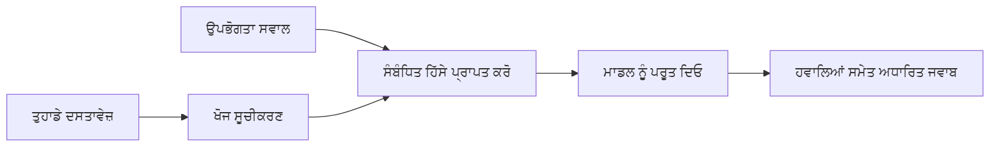

# ਆਪਣੇ ਦਸਤਾਵੇਜ਼ਾਂ ਦੇ ਆਧਾਰ 'ਤੇ ਭਵਿੱਖਬਾਣੀ ਕਰਨ ਵਾਲੇ ਪ੍ਰਸ਼ਨਾਂ ਦਾ ਜਵਾਬ ਦੇਣ ਲਈ AI ਨੂੰ ਸਿੱਖਾਓ:
## ਸੀਰੀਜ਼ 1: RAG, Azure ਵਿਰੁੱਧ ਖੁੱਲ੍ਹਾ-ਸਰੋਤ ਵਿਕਲਪ, ਅਤੇ ਜਦੋਂ ਫਾਈਨ-ਟਿਊਨਿੰਗ ਸੰਦਾਰਥਕ ਹੁੰਦੀ ਹੈ

> 2026 ਦੀ ਇੱਕ ਸੀਰੀਜ਼ ਵਿੱਚ ਪਹਿਲਾ ਲੇਖ, ਜੋ ਮੇਰੇ 2023 ਦੇ Azure AI Search + Azure OpenAI ਦਸਤਾਵੇਜ਼ QA ਟਿਊਟੋਰਿਯਲਸ ਨੂੰ ਦੁਬਾਰਾ ਵੇਖਦਾ ਹੈ।

## 1. ਪ੍ਰਸਤਾਵਨਾ - ਇੱਕ ਪਹਿਲਾਂ ਦੇ RAG ਟਿਊਟੋਰਿਯਲ ਨੂੰ ਮੁੜ ਵੇਖਣਾ

2023 ਵਿੱਚ, ਮੈਂ ChatGPT ਨੂੰ PDF ਦਸਤਾਵੇਜ਼ਾਂ ਤੋਂ ਪ੍ਰਸ਼ਨਾਂ ਦੇ ਜਵਾਬ ਦੇਣ ਲਈ Azure AI Search ਅਤੇ Azure OpenAI ਦੀ ਵਰਤੋਂ ਕਰਕੇ ਸਿੱਖਾਉਣ ਬਾਰੇ ਦੋ ਟਿਊਟੋਰਿਯਲਾਂ 'ਤੇ ਕੰਮ ਕੀਤਾ। ਮੈਂ [LangChain ਵਰਜ਼ਨ](https://techcommunity.microsoft.com/blog/educatordeveloperblog/teach-chatgpt-to-answer-questions-using-azure-ai-search--azure-openai-lang-chain/3969713) ਲਿਖਿਆ, ਅਤੇ ਮੈਂ [Lee Stott](https://developer.microsoft.com/en-us/advocates/lee-stott), ਮਾਇਕ੍ਰੋਸਾਫਟ ਵਿੱਚ ਇੱਕ ਪ੍ਰਿੰਸੀਪਲ ਕਲਾਉਡ ਐਡਵੋਕੇਟ ਮੈਨੇਜਰ, ਨਾਲ ਸਹਿ ਲੇਖਕ ਹੋਕੇ [Semantic Kernel ਵਰਜ਼ਨ](https://techcommunity.microsoft.com/blog/educatordeveloperblog/teach-chatgpt-to-answer-questions-using-azure-ai-search--azure-openai-semantic-k/3985395) ਵੀ ਲਿਖਿਆ। ਉਸ ਸਮੇਂ, "ਆਪਣੇ ਡੇਟਾ ਤੇ ChatGPT" ਦਾ ਆਈਡਿਆ ਅਜੇ ਵੀ ਕਈ ਡਿਵੈਲਪਰਾਂ ਲਈ ਨਵਾਂ ਹੀ ਲਗਦਾ ਸੀ। ਟਿਊਟੋਰਿਯਲਾਂ ਨੇ Azure Blob Storage, Azure AI Search, Azure OpenAI, LangChain, Semantic Kernel, ਅਤੇ FAISS-ਸ਼ੈਲੀ ਦਾ ਵਰਕਟਰ ਰੀਟਰੀਵਲ ਵਰਤ ਕੇ PDF ਫਾਇਲਾਂ ਤੋਂ ਸਵਾਲਾਂ ਦੇ ਜਵਾਬ ਦਿੱਤੇ।

ਉਹ ਪਿਛਲਾ ਲੇਖ ਇੱਕ ਸਧਾਰਣ ਪਰ ਮਹੱਤਵਪੂਰਣ ਵਰਕਫਲੋ 'ਤੇ ਧਿਆਨ ਕੇਂਦ੍ਰਤ ਸੀ: ਦਸਤਾਵੇਜ਼ ਅਪਲੋਡ ਕਰੋ, ਉਨ੍ਹਾਂ ਨੂੰ ਇੰਡੈਕਸ ਕਰੋ, ਸਬੰਧਤ ਸਮੱਗਰੀ ਹਾਸਲ ਕਰੋ, ਅਤੇ ਇਸ ਸਮੱਗਰੀ ਦੇ ਆਧਾਰ ਤੇ ਮਾਡਲ ਨੂੰ ਜਵਾਬ ਦੇਣ ਲਈ ਪੁੱਛੋ।

2026 ਵਿੱਚ, RAG ਕੁਦਰਤੀ ਤੌਰ 'ਤੇ ਕਾਫੀ ਵੱਧ ਗਿਆ ਹੈ। Azure AI Search ਹੁਣ ਆਧੁਨਿਕ ਵੈਕਟਰ ਅਤੇ ਹਾਈਬਰਿਡ ਰੀਟਰੀਵਲ ਪੈਟਰਨ ਦਾ ਸਹਿਯੋਗ ਕਰਦਾ ਹੈ, Azure OpenAI Microsoft Foundry Models ਦੇ ਵੱਡੇ ਢਾਂਚੇ ਦਾ ਹਿੱਸਾ ਹੈ, ਅਤੇ ਨਵਾਂ v1 API ਸਧਾਰਨ OpenAI ਕਲਾਈਂਟ ਨੂੰ ਵਰਤ ਸਕਦਾ ਹੈ ਬਿਨਾਂ ਹਰ ਮਹੀਨੇ `api-version` ਬਦਲਾਉਣ ਦੀ ਲੋੜ ਦੇ। ਇਸੇ ਸਮੇਂ, ਖੁੱਲ੍ਹਾ-ਸਰੋਤ ਦੇ ਵਿਕਲਪ ਜਿਵੇਂ LangGraph, LlamaIndex, Haystack, Qdrant, Milvus, Weaviate, Chroma, Ollama, ਅਤੇ vLLM ਅਸਲ RAG ਸਿਸਟਮਾਂ ਲਈ ਪ੍ਰਯੋਗ ਯੋਗ ਚੋਇਸਾਂ ਬਣ ਗਏ ਹਨ।

ਇਸੇ ਲਈ ਮੈਂ ਇਸ ਵਿਸ਼ੇ ਨੂੰ ਦੁਬਾਰਾ ਵੇਖਣਾ ਚਾਹੁੰਦਾ ਹਾਂ। ਸਵਾਲ ਹੁਣ ਸਿਰਫ "ਮੈਂ RAG ਕਿਵੇਂ ਬਣਾਵਾਂ?" ਨਹੀਂ ਰਹਿ ਗਿਆ। ਹੁਣ ਕਾਫੀ ਤਰੀਕੇ ਹਨ ਇਸ ਨੂੰ ਬਣਾਉਣ ਦੇ, ਅਤੇ ਸਬ ਤੋਂ ਅਹੰਕਾਰਪੂਰਨ ਸਵਾਲ ਹੈ "ਮੇਰੀ ਸਥਿਤੀ ਲਈ ਮੈਂ ਕਿਹੜਾ ਢਾਂਚਾ ਚੁਣਾਂ?"

ਪਰ ਮੁੱਖ ਸਮੱਸਿਆ ਨਹੀਂ ਬਦਲੀ।

ਇੱਕ AI ਮਾਡਲ ਆਪਣੇ ਆਪ ਤੁਹਾਡੇ ਦਸਤਾਵੇਜ਼ਾਂ ਨੂੰ ਜਾਣਦਾ ਨਹੀਂ। ਇੱਕ ਲਾਭਦਾਇਕ ਦਸਤਾਵੇਜ਼-ਪ੍ਰਸ਼ਨ-ਜਵਾਬ ਸਿਸਟਮ ਬਣਾਉਣ ਲਈ, ਤੁਹਾਨੂੰ ਵਿਸ਼ਵਾਸਯੋਗ ਰੀਟਰੀਵਲ, ਗਰਾਊਂਡਿੰਗ, ਮੁਲਾਂਕਣ, ਅਤੇ ਚਲਾਉਣ ਵਾਲੇ ਵਰਕਫਲੋ ਦੀ ਲੋੜ ਹੁੰਦੀ ਹੈ।

ਇਹ ਲੇਖ ਹੋਰ ਇੱਕ ਅੰਤ-ਤੱਕ "PDF ਨਾਲ ਗੱਲਬਾਤ" ਵਾਲਾ ਟਿਊਟੋਰਿਯਲ ਨਹੀਂ ਹੈ। ਮੈਂ ਇਹ ਅੱਪਡੇਟ ਕੀਤੀ ਸੀਰੀਜ਼ ਇਸ ਸਵਾਲ ਨਾਲ ਸ਼ੁਰੂ ਕਰਨਾ ਚਾਹੁੰਦਾ ਹਾਂ ਜੋ ਅੱਜ ਮੈਨੂੰ ਜ਼ਿਆਦਾ ਪਰਵਾਹ ਹੈ: ਤੁਸੀਂ ਕਦੋਂ ਸੰਚਾਲਿਤ Azure ਢਾਂਚਾ ਚੁਣਨਾ ਚਾਹੀਦਾ ਹੈ, ਕਦੋਂ ਖੁੱਲ੍ਹਾ-ਸਰੋਤ RAG ਸਟੈਕ ਚੁਣਨਾ ਚਾਹੀਦਾ ਹੈ, ਅਤੇ ਕਦੋਂ ਫਾਈਨ-ਟਿਊਨਿੰਗ ਦਾ ਅਸਲ ਵਿੱਚ ਮਤਲਬ ਹੁੰਦਾ ਹੈ?

ਇਹ ਦਸਤਾਵੇਜ਼-ਅਧਾਰਤ AI ਸਿਸਟਮਾਂ ਦੇ ਨਿਰਮਾਣ ਬਾਰੇ ਇੱਕ ਸੀਰੀਜ਼ ਦਾ ਪਹਿਲਾ ਲੇਖ ਹੈ। ਇਸ ਪਹਿਲੇ ਹਿੱਸੇ ਵਿੱਚ ਅਸੀਂ ਢਾਂਚਾ ਫੈਸਲੇ 'ਤੇ ਧਿਆਨ ਦੇਵਾਂਗੇ: RAG ਚਾਹਿਦਾ ਕਿਉਂ ਹੈ, ਕਦੋਂ Azure-ਅਧਾਰਿਤ ਪ੍ਰਬੰਧਿਤ ਸੇਵਾਵਾਂ ਲਾਭਦਾਇਕ ਹਨ, ਕਦੋਂ ਖੁੱਲ੍ਹਾ-ਸਰੋਤ ਵਿਕਲਪ ਸੰਦਾਰਥਕ ਹਨ, ਅਤੇ ਫਾਈਨ-ਟਿਊਨਿੰਗ ਕਿੱਥੇ ਫਿੱਟ ਬੈਠਦੀ ਹੈ।

ਦਸਤਾਵੇਜ਼ QA ਸਿਸਟਮਾਂ ਬਨਾਉਣ ਅਤੇ ਮੁੜ ਵੇਖਣ ਤੋਂ ਬਾਅਦ, ਮੈਂਓ ਕਿਸ ਔਜ਼ਾਰ ਨੂੰ ਪ੍ਰਦਰਸ਼ਨ ਵਿੱਚ ਸਭ ਤੋਂ ਵਧੀਆ ਦਿਖਾਈ ਦਿੰਦਾ ਹੈ, ਇਸ ਵਿੱਚ ਘੱਟ ਦਿਲਚਸਪੀ ਹਨ ਪਰ ਇਸ ਗੱਲ ਵਿੱਚ ਵਧੇਰੇ ਦਿਲਚਸਪੀ ਹੈ ਕਿ ਕਿਹੜਾ ਢਾਂਚਾ ਅਸਲ ਉਪਭੋਗਤਾਵਾਂ, ਬਦਲਦੇ ਦਸਤਾਵੇਜ਼, ਅਧਿਕਾਰ, ਫੇਲਿਯਰ ਅਤੇ ਰਖ-ਰਖਾਵ ਨੂੰ ਸਹਿਣ ਕਰਦਾ ਹੈ।

## 2. ਤੁਹਾਡੇ AI ਨੂੰ ਖੋਜ ਸਿਸਟਮ ਦੀ ਲੋੜ ਕਿਉਂ ਹੈ

ਵੱਡੇ ਭਾਸ਼ਾ ਮਾਡਲ ਵਿਸ਼ਾਲ ਜਨਤਾ ਅਤੇ ਲਾਇਸੈਂਸਡ ਡੇਟਾ 'ਤੇ ਟਰੇਨਿੰਗ ਕੀਤੇ ਜਾਂਦੇ ਹਨ। ਉਹ ਆਮ ਵਿਸ਼ਿਆਂ ਬਾਰੇ ਕਾਫੀ ਜਾਣਕਾਰੀ ਰੱਖ ਸਕਦੇ ਹਨ, ਪਰ ਉਹ ਆਪਣੇ ਖਾਸ ਨਿੱਜੀ PDF, ਅੰਦਰੂਨੀ ਨੀਤੀਆਂ, ਕਾਰਪੋਰੇਟ ਪ੍ਰਕਿਰਿਆਵਾਂ, ਖੋਜ ਆਰਕਾਈਵਜ਼, ਕਲਾਸਰੂਮ ਸਮੱਗਰੀ, ਗਾਹਕ ਸਹਾਇਤਾ ਟਿੱਪਣੀਆਂ, ਜਾਂ ਹਾਲ ਹੀ ਵਿੱਚ ਅੱਪਡੇਟ ਕੀਤੀ ਦਸਤਾਵੇਜ਼ਾਂ ਨੂੰ ਆਪਣੇ ਆਪ ਨਹੀਂ ਜਾਣਦੇ।

RAG ਬਾਰੇ ਇੱਕ ਸਧਾਰਣ ਸੋਚ ਇਹ ਹੈ: ਮਾਡਲ ਤੋਂ ਉਮੀਦ ਨਾ ਕਰੋ ਕਿ ਉਹ ਹਰ ਦਸਤਾਵੇਜ਼ ਨੂੰ ਯਾਦ ਕਰੇ, ਬਲਕਿ ਅਸੀਂ ਉਸ ਨੂੰ ਇੱਕ ਖੋਜ ਸਿਸਟਮ ਦਿੰਦੀਆਂ ਹਾਂ। ਜਦੋਂ ਉਪਭੋਗਤਾ ਸਵਾਲ ਪੁੱਛਦਾ ਹੈ, ਤਾਂ ਸਿਸਟਮ ਪਹਿਲਾਂ ਸਭ ਤੋਂ ਸਬੰਧਿਤ ਜਾਣਕਾਰੀ ਦੇ ਹਿੱਸੇ ਲੱਭਦਾ ਹੈ, ਫਿਰ ਉਹ ਹਿੱਸੇ ਮਾਡਲ ਨੂੰ ਸੰਦਰਭ ਵਜੋਂ ਦਿੰਦਾ ਹੈ।

ਇਹ ਮੁੱਖ ਹੈ ਕਿਉਂਕਿ ਬਹੁਤ ਸਾਰੇ ਅਸਲ ਦੁਨੀਆ ਦੇ ਗਿਆਨ ਸਰੋਤ ਨਿੱਜੀ, ਲਗਾਤਾਰ ਬਦਲ ਰਹੇ, ਅਧਿਕਾਰ-ਸੰਵੇਦਨਸ਼ੀਲ, ਕਈ ਪ੍ਰਣਾਲੀਆਂ ਵਿੱਚ ਸੰਭਾਲੇ ਜਾਂਦੇ, ਕਈ ਫਾਰਮੈਟਾਂ ਵਿੱਚ ਲਿਖੇ ਜਾਂਦੇ, ਅਤੇ ਸਿੱਧੇ ਪ੍ਰੰਪਟ ਵਿੱਚ ਪੇਸਟ ਕਰਨ ਲਈ ਬਹੁਤ ਵੱਡੇ ਹੁੰਦੇ ਹਨ।

ਮਿਸਾਲ ਵਜੋਂ, ਜੇ ਇੱਕ ਸਕੂਲ, ਕੰਪਨੀ, ਜਾਂ ਖੋਜ ਟੀਮ ਕੋਲ 10,000 ਅੰਦਰੂਨੀ ਦਸਤਾਵੇਜ਼ ਹਨ, ਤਾਂ ਮਾਡਲ ਉਨ੍ਹਾਂ ਦਸਤਾਵੇਜ਼ਾਂ ਤੋਂ ਭਰੋਸੇਮੰਦ ਜਵਾਬ ਨਹੀਂ ਦੇ ਸਕਦਾ ਜਦ ਤੱਕ ਸਿਸਟਮ ਸਹੀ ਸਮੇਂ ਤੇ ਸਹੀ ਹਿਸਿਆਂ ਨੂੰ ਰੀਟਰੀਵ ਨਾ ਕਰੇ।

ਇਸ ਦੇ ਨਾਲ ਇੱਕ ਆਮ ਸਵਾਲ ਹੁੰਦਾ ਹੈ:

ਮਾਡਲ ਨੂੰ ਫਾਈਨ-ਟਿਊਨ ਕਿਉਂ ਨਹੀਂ ਕਰਦੇ?

ਫਾਈਨ-ਟਿਊਨਿੰਗ ਲਾਭਦਾਇਕ ਹੋ ਸਕਦੀ ਹੈ, ਪਰ ਆਮ ਤੌਰ 'ਤੇ ਦਸਤਾਵੇਜ਼ ਗਿਆਨ ਲਈ ਇਹ ਪਹਿਲਾ ਸਹੀ ਟੂਲ ਨਹੀਂ ਹੁੰਦੀ। ਜੇ ਗਿਆਨ ਬਹੁਤ ਵਾਰੀ ਬਦਲਦਾ ਰਹਿੰਦਾ ਹੈ, ਜੇ ਸਿਟੇਸ਼ਨ ਮਹੱਤਵਪੂਰਣ ਹਨ, ਜਾਂ ਜੇ ਐਕਸੈੱਸ ਅਧਿਕਾਰ ਮਹੱਤਵਪੂਰਣ ਹਨ, ਤਾਂ RAG ਆਮ ਤੌਰ 'ਤੇ ਬਿਹਤਰ ਸ਼ੁਰੂਆਤ ਹੈ। ਫਾਈਨ-ਟਿਊਨਿੰਗ ਬਿਹਤਰ ਹੈ ਜਦ ਮਾਡਲ ਦੇ ਵਰਤਾਰਾ, ਅੰਦਾਜ਼, ਨਤੀਜੇ ਦਾ ਫਾਰਮੈਟ, ਅਤੇ ਟਾਸਕ ਪੈਟਰਨ ਸਿਖਾਉਣੇ ਹੋਣ।

## 3. RAG ਦਾ ਅਮਲੀ ਢਾਂਚਾ

ਕਲਪਨਾ ਕਰੋ ਤੁਸੀਂ ਇੱਕ ਸਕੂਲ ਲਈ AI ਸਹਾਇਕ ਤਿਆਰ ਕਰ ਰਹੇ ਹੋ। ਸਹਾਇਕ ਨੂੰ ਨੀਤੀ PDF, ਕੋਰਸ গਾਈਡ, ਅੰਦਰੂਨੀ FAQ ਪੇਜ਼, ਅਤੇ ਹਾਲ ਹੀ ਵਿੱਚ ਅੱਪਡੇਟ ਕੀਤੀਆਂ ਐਲਾਨ ਭਰੀਆਂ ਦਸਤਾਵੇਜ਼ਾਂ ਵਿੱਚੋਂ ਪ੍ਰਸ਼ਨਾਂ ਦੇ ਜਵਾਬ ਦੇਣੇ ਹਨ।

ਜੇ ਕੋਈ ਵਿਦਿਆਰਥੀ ਪੁੱਛਦਾ ਹੈ, "ਕੀ ਮੈਂ اپنی ਆਖਰੀ ਅਸਾਈਨਮੈਂਟ ਲਈ ਜਨਰੇਟਿਵ AI ਵਰਤ ਸਕਦਾ ਹਾਂ?", ਤਾਂ ਸਿਸਟਮ ਮਾਡਲ ਦੀ ਆਮ ਯਾਦ ਤੋਂ ਜਵਾਬ ਨਹੀਂ ਦੇਣਾ ਚਾਹੀਦਾ। ਇਸ ਨੂੰ ਪਹਿਲਾਂ ਸਬੰਧਤ ਸਕੂਲੀ ਨੀਤੀ ਲੱਭਣੀ ਚਾਹੀਦੀ ਹੈ, AI ਵਰਤੋਂ ਬਾਰੇ ਸੈਕਸ਼ਨ ਰੀਟਰੀਵ ਕਰਨਾ ਚਾਹੀਦਾ ਹੈ, ਅਤੇ ਫਿਰ ਉਸ ਸਬੂਤ ਦੇ ਆਧਾਰ 'ਤੇ ਮਾਡਲ ਨੂੰ ਜਵਾਬ ਦੇਣਾ ਚਾਹੀਦਾ ਹੈ।

ਇਹ RAG ਦਾ ਅਮਲੀ ਅਰਥ ਹੈ।

ਸਧਾਰਨ ਸਤਰ 'ਤੇ, ਤੁਸੀਂ ਇਹ ਪ੍ਰਵਾਹ ਇਸ ਤਰ੍ਹਾਂ ਸੋਚ ਸਕਦੇ ਹੋ:

ਵੇਰਵੇ ਹੋਰ ਜਟਿਲ ਹੋ ਸਕਦੇ ਹਨ, ਪਰ ਬੁਨਿਆਦੀ ਵਿਚਾਰ ਸਧਾਰਣ ਹੈ: ਮਾਡਲ ਇੱਕੱਲਾ ਜਵਾਬ ਨਹੀਂ ਦਿੰਦਾ। ਉਹ ਰੀਟਰੀਵਡ ਸਬੂਤ ਨਾਲ ਜਵਾਬ ਦਿੰਦਾ ਹੈ।

ਪਹਿਲਾਂ, ਦਸਤਾਵੇਜ਼ ਸੰਭਾਲਣ ਵਾਲੀਆਂ ਪ੍ਰਣਾਲੀਆਂ ਜਿਵੇਂ Azure Blob Storage, SharePoint, GitHub, ਜਾਂ ਇੱਕ ਅੰਦਰੂਨੀ CMS ਤੋਂ ਲੈ ਕੇ ਇੰਜੈਸਟ ਕੀਤੇ ਜਾਂਦੇ ਹਨ। ਫਿਰ ਸਿਸਟਮ ਉਨ੍ਹਾਂ ਨੂੰ ਟੈਕਸਟ ਵਿੱਚ ਪਰਸ ਕਰਦਾ ਹੈ ਜਦੋਂ ਕਿ ਸਿਰਲੇਖ, ਪੰਨਾ ਨੰਬਰ, ਟੇਬਲ, ਸੈਕਸ਼ਨ, ਅਤੇ ਸਰੋਤ ਸਥਾਨ ਜਿਹੜਾ ਲਾਭਦਾਇਕ ਢਾਂਚਾ ਹੈ, ਨੂੰ ਕਾਇਮ ਰੱਖਦਾ ਹੈ।

ਅਗਲੇ ਕਦਮ ਵਿੱਚ ਸਮੱਗਰੀ ਨੂੰ ਚੰਕਾਂ ਵਿੱਚ ਵੰਡਿਆ ਜਾਂਦਾ ਹੈ। ਇਹ ਕਦਮ ਸਧਾਰਣ ਲੱਗਦਾ ਹੈ, ਪਰ ਇਹ ਸਿਸਟਮ ਦਾ ਸਭ ਤੋਂ ਮਹੱਤਵਪੂਰਣ ਹਿੱਸਾ ਹੈ। ਜੇ ਚੰਕ ਬਹੁਤ ਛੋਟਾ ਹੈ, ਤਾਂ ਉਹ ਆਲੇ-ਦੁਆਲੇ ਦੇ ਸੰਦਰਭ ਨੂੰ ਖੋ ਸਕਦਾ ਹੈ। ਜੇ ਚੰਕ ਬਹੁਤ ਵੱਡਾ ਹੈ, ਤਾਂ ਇਸ ਵਿੱਚ ਗੈਰ-ਸੰਬੰਧਿਤ ਜਾਣਕਾਰੀ ਸ਼ਾਮਲ ਹੋ ਸਕਦੀ ਹੈ ਤੇ ਰੀਟਰੀਵਲ ਘੱਟ ਸਹੀ ਹੋ ਸਕਦੀ ਹੈ।

ਚੰਕਿੰਗ ਤੋਂ ਬਾਅਦ, ਸਿਸਟਮ ਐਮਬੈਡਿੰਗ ਬਣਾ ਕੇ ਉਹਨਾਂ ਨੂੰ ਇੱਕ ਖੋਜਯੋਗ ਇੰਡੈਕਸ ਵਿੱਚ ਮੂਲ ਟੈਕਸਟ ਅਤੇ ਮੈਟਾਡੇਟਾ ਜਿਵੇਂ ਫਾਇਲ ਨਾਂ, ਪੰਨਾ ਨੰਬਰ, ਅਧਿਕਾਰ, ਦਸਤਾਵੇਜ਼ ਵਰਜ਼ਨ, ਅਤੇ ਸਰੋਤ URL ਦੇ ਨਾਲ ਸਟੋਰ ਕਰਦਾ ਹੈ।

ਜਦੋਂ ਉਪਭੋਗਤਾ ਸਵਾਲ ਪੁੱਛਦਾ ਹੈ, ਤਾਂ ਸਿਸਟਮ ਕਿיווਰਡ ਖੋਜ, ਵੈਕਟਰ ਖੋਜ, ਜਾਂ ਹਾਈਬਰਿਡ ਖੋਜ ਨਾਲ ਉਮੀਦਾ ਵਾਲੇ ਚੰਕ ਬਰਾਮਦ ਕਰਦਾ ਹੈ। ਫਿਰ ਇੱਕ ਰੀਰੈਂਕਰ ਉਨ੍ਹਾਂ ਚੰਕਾਂ ਨੂੰ ਦੁਬਾਰਾ ਵਰਗਬੱਧ ਕਰ ਸਕਦਾ ਹੈ ਤਾਂ ਜੋ ਸਭ ਤੋਂ ਮਦਦਗਾਰ ਸਬੂਤ ਸਿਖਰ ਦੇ ਨੇੜੇ ਰੱਖੇ ਜਾਣ।

ਅਖੀਰ ਵਿੱਚ, ਮਾਡਲ ਸਵਾਲ ਅਤੇ ਰੀਟਰੀਵਡ ਸਬੂਤ ਪ੍ਰਾਪਤ ਕਰਦਾ ਹੈ। ਜਵਾਬ ਉਸ ਸਬੂਤ ਉੱਤੇ ਅਧਾਰਿਤ ਹੋਣਾ ਚਾਹੀਦਾ ਹੈ ਅਤੇ ਸਿਟੇਸ਼ਨਾਂ ਵਾਪਸ ਕਰਨੇ ਚਾਹੀਦੇ ਹਨ ਤਾਂ ਜੋ ਉਪਭੋਗਤਾ ਸਰੋਤ ਦੀ ਜਾਂਚ ਕਰ ਸਕੇ।

ਮਹੱਤਵਪੂਰਣ ਗੱਲ ਇਹ ਹੈ ਕਿ RAG ਸਿਰਫ "PDF ਨੂੰ ਵੈਕਟਰ ਡਾਟਾਬੇਸ ਵਿੱਚ ਪਾਉਣਾ" ਨਹੀਂ ਹੈ। ਜਵਾਬ ਦੀ ਗੁਣਵੱਤਾ ਪੂਰੇ ਵਰਕਫਲੋ 'ਤੇ ਨਿਰਭਰ ਕਰਦੀ ਹੈ: ਪਾਰਸਿੰਗ, ਚੰਕਿੰਗ, ਰੀਟਰੀਵਲ, ਰੀਰੈਂਕਿੰਗ, ਪ੍ਰੌਂਪਟਿੰਗ, ਸਿਟੇਸ਼ਨ, ਅਤੇ ਮੁਲਾਂਕਣ।

ਇਸੇ ਕਰਕੇ ਦਸਤਾਵੇਜ਼ ਦਾ ਢਾਂਚਾ ਮਹੱਤਵਪੂਰਣ ਹੁੰਦਾ ਹੈ। ਇੱਕ PDF ਵਿੱਚ, ਸਿਰਲੇਖ, ਟੇਬਲ, ਫੁੱਟਨੋਟ, ਜਾਂ ਪੰਨਾ ਸੀਮਾ ਕਿਸੇ ਪੈਰਾ ਦਾ ਅਰਥ ਬਦਲ ਸਕਦਾ ਹੈ। Azure 'ਤੇ, Document Layout ਸਕਿਲ Azure Document Intelligence ਦੇ ਲੇਆਉਟ ਯੋਗਤਾਵਾਂ ਨੂੰ ਵਰਤਦਾ ਹੈ, ਜੋ RAG ਸਿਸਟਮਾਂ ਲਈ ਚੰਕਿੰਗ ਅਤੇ ਰੀਟਰੀਵਲ ਗੁਣਵੱਤਾ ਵਿੱਚ ਸੁਧਾਰ ਕਰ ਸਕਦਾ ਹੈ।

## 4. 2023 ਤੋਂ ਬਾਅਦ ਕੀ ਬਦਲਿਆ?

2023 ਦਾ ਟਿਊਟੋਰਿਯਲ ਆਪਣੇ ਸਮੇਂ ਲਈ ਇੱਕ ਚੰਗੀ ਸ਼ੁਰੂਆਤ ਸੀ:

- Azure Blob Storage ਨੇ PDF ਫਾਇਲਾਂ ਸਟੋਰ ਕੀਤੀਆਂ।
- Azure AI Search ਨੇ ਸਮੱਗਰੀ ਨੂੰ ਇੰਡੈਕਸ ਕੀਤਾ।
- LangChain ਨੇ ਰੀਟਰੀਵਲ ਨੂੰ Azure OpenAI ਨਾਲ ਜੋੜਿਆ।
- FAISS ਇੱਕ ਸਧਾਰਣ ਸਥਾਨਕ ਵੈਕਟਰ ਸਟੋਰ ਵਜੋਂ ਕੰਮ ਕਰਦਾ ਸੀ।
- ਉਦਾਹਰਨ ਵਿੱਚ `gpt-35-turbo` ਅਤੇ `text-embedding-ada-002` ਵਰਤੇ ਗਏ।

2026 ਵਿੱਚ, ਇੱਕ ਆਧੁਨਿਕ ਵਰਜ਼ਨ ਕਈ ਬਦਲਾਅ ਦਰਸਾਉਣਾ ਚਾਹੀਦਾ ਹੈ।

ਪਹਿਲਾਂ, ਰੀਟਰੀਵਲ ਮਿਆਰ ਨਿਪੁੰਨ ਹੋ ਚੁੱਕਾ ਹੈ। 2023 ਵਿੱਚ, ਕਈ ਡੈਮੋ ਸਧਾਰਣ ਵੈਕਟਰ ਸਮਾਨਤਾ ਖੋਜ ਵਰਤਦੇ ਸਨ। ਅੱਜ, ਗੰਭੀਰ ਦਸਤਾਵੇਜ਼ QA ਲਈ ਹਾਈਬਰਿਡ ਰੀਟਰੀਵਲ ਆਮ ਤੌਰ ਤੇ ਮੂਲ ਹੈ। Azure AI Search Keyword ਅਤੇ Vector ਦੋਹਾਂ ਨੂੰ ਇਕੱਠੇ ਕਰਕੇ ਹਾਈਬਰਿਡ ਖੋਜ ਸਹਿਯੋਗ ਦਿੰਦਾ ਹੈ ਅਤੇ Reciprocal Rank Fusion ਨਾਲ ਨਤੀਆਂ ਮੋੜਦਾ ਹੈ। Semantic ranker ਫਿਰ ਪੂਰੇ-ਟੈਕਸਟ, ਵੈਕਟਰ, ਅਤੇ ਹਾਈਬਰਿਡ ਨਤੀਆਂ ਦੇ ਟੈਕਸਟ ਭਾਗ ਨੂੰ ਦੁਬਾਰਾ ਵਰਗਬੱਧ ਕਰਦਾ ਹੈ।

ਦੂਜਾ, ਇੰਜੈਸਟਿੰਗ ਹੋਰ ਸੁਧਾਰਯੋਗ ਹੋ ਗਈ ਹੈ। ਹਰੇਕ ਦਸਤਾਵੇਜ਼ ਨੂੰ ਮੈਨੁਅਲੀ ਤੌਰ 'ਤੇ ਐਪਲੀਕੇਸ਼ਨ ਕੋਡ ਨਾਲ ਵੰਡਣ ਦੇ ਬਜਾਏ, Azure AI Search ਚੰਕਿੰਗ, ਐਮਬੈਡਿੰਗ ਅਤੇ ਕਵੈਰੀ-ਟਾਈਮ ਵੈਕਟਰੀਕਰਨ ਲਈ ਏਕੀਕ੍ਰਿਤ vectorization ਦਾ ਸਹਿਯੋਗ ਕਰਦਾ ਹੈ। PDFs ਅਤੇ ਦਸਤਾਵੇਜ਼-ਭਾਰੀ ਵਰਕਲੋਡ ਲਈ, Document Layout ਸਕਿਲ ਮਿਆਰੀ ਆਕਾਰ ਵਾਲੇ ਚੰਕ ਦੇ ਬਜਾਏ ਜ਼ਿਆਦਾ ਢਾਂਚਾ ਬਚਾ ਸਕਦਾ ਹੈ।

ਤੀਜਾ, ਆਰਕੀਸਟ੍ਰੇਸ਼ਨ ਹੋਰ ਮਹੱਤਵਪੂਰਨ ਹੋ ਗਿਆ ਹੈ। ਮੁਸ਼ਕਲ ਹਿੱਸਾ ਅਕਸਰ ਸਿਰਫ LLM API ਕਾਲ ਨਹੀਂ ਹੁੰਦਾ। ਮੁਸ਼ਕਲ ਹਿੱਸਾ ਫੇਲਿਅਰ ਹਨਦਲ, ਪੁਨਰ-ਕੋਸ਼ਿਸ਼, ਪੁਰਾਣਾ ਰੀਟਰੀਵਲ, ਚੰਕ ਗੁਣਵੱਤਾ, ਲੰਮੀ ਚੱਲਣ ਵਾਲੇ ਵਰਕਫਲੋਜ਼, ਮਨੁੱਖੀ ਸਮੀਖਿਆ, ਅਤੇ ਵਿਸ਼ਾਲ ਪੱਧਰ 'ਤੇ ਮੁਲਾਂਕਣ ਹੈ। ਇੱਥੇ ਵਰਕਫਲੋ-ਕੇਂਦਰਿਤ ਟੂਲਾਂ ਜਿਵੇਂ LangGraph, LlamaIndex ਵਰਕਫਲੋਜ਼, Haystack ਪਾਈਪਲਾਈਨ, ਅਤੇ ਪਲੇਟਫਾਰਮ ਪੱਧਰੀ ਮੁਲਾਂਕਣ ਅਤੇ ਦ੍ਰਿਸ਼ਯੋਜ਼ਤਾ ਸਾਧਨ ਇੱਕਗਲੂੰਦੀ ਸੂਤ ਦੇ ਵੱਧ ਮਹੱਤਵਪੂਰਨ ਹਨ।

ਚੌਥਾ, ਮੁਲਾਂਕਣ ਹੁਣ ਵਿਕਲਪ ਨਹੀਂ ਰਹਿ ਗਿਆ। ਇੱਕ ਡੈਮੋ ਇੱਕ ਸਵਾਲ ਨਾਲ ਪ੍ਰਭਾਵਸ਼ਾਲੀ ਲੱਗ ਸਕਦਾ ਹੈ। ਪ੍ਰੋਡੱਕਸ਼ਨ ਸਿਸਟਮ ਨੂੰ ਟੈਸਟ ਸੈਟਸ, ਰਿਗ੍ਰੈਸ਼ਨ ਜਾਂਚ, ਰੀਟਰੀਵਲ ਮੈਟ੍ਰਿਕਸ, ਗਰਾਊਂਡਿਡਨੈਸ ਜਾਂਚ, ਅਤੇ ਮਾਨੀਟਰਿੰਗ ਦੀ ਲੋੜ ਹੁੰਦੀ ਹੈ। ਮੁਲਾਂਕਣ ਤੋਂ ਬਿਨਾਂ ਇਹ ਪਤਾ ਲਗਾਉਣਾ ਮੁਸ਼ਕਲ ਹੈ ਕਿ ਸਿਸਟਮ ਸੁਧਾਰ ਰਹੀ ਹੈ ਜਾਂ ਸਿਰਫ਼ ਬਦਲ ਰਹੀ ਹੈ।

## 5. Azure ਅਤੇ ਖੁੱਲ੍ਹਾ-ਸਰੋਤ RAG ਸਟੈਕਸ ਵਿੱਚ ਚੋਣ

ਮੈਂ ਨਹੀਂ ਸੋਚਦਾ ਕਿ "ਕੀ Azure ਖੁੱਲ੍ਹਾ ਸਰੋਤ ਤੋਂ ਵਧੀਆ ਹੈ?" ਜਾਂ "ਕੀ ਖੁੱਲ੍ਹਾ ਸਰੋਤ Azure ਤੋਂ ਵਧੀਆ ਹੈ?" ਹੀ ਲਾਭਦਾਇਕ ਸਵਾਲ ਹੈ।

ਲਾਭਦਾਇਕ ਸਵਾਲ ਇਹ ਹੈ: ਤੁਸੀਂ ਕਿਹੜਾ ਤਰ੍ਹਾਂ ਦਾ ਸਿਸਟਮ ਤਿਆਰ ਕਰ ਰਹੇ ਹੋ, ਕੌਣ ਉਸ ਦਾ ਸੰਚਾਲਨ ਕਰੇਗਾ, ਤੁਹਾਡੇ ਕੋਲ ਕਿਹੜੇ ਬੰਧਨ ਹਨ, ਅਤੇ ਕਿਹੜੇ ਫੇਲਿਅਰ ਮੋਡ ਬਰਦਾਸ਼ਤ ਨਹੀਂ ਕੀਤੇ ਜਾ ਸਕਦੇ?

ਜਦੋਂ ਮੈਂ ਦਸਤਾਵੇਜ਼ QA ਉਦਾਹਰਨ ਬਣਾਉਣਾ ਸ਼ੁਰੂ ਕੀਤਾ, ਤਾਂ ਮੇਰਾ ਮੁੱਖ ਧਿਆਨ ਰੀਟਰੀਵਲ ਕੰਮ ਕਰਦਾ ਹੈ ਜਾਂ ਨਹੀਂ, ਇਸ 'ਤੇ ਸੀ। ਕੀ ਮੈਂ PDFs ਅਪਲੋਡ ਕਰ ਸਕਦਾ ਹਾਂ, ਖੋਜ ਸਕਦਾ ਹਾਂ, ਅਤੇ ਜਵਾਬ ਜਨਰੇਟ ਕਰ ਸਕਦਾ ਹਾਂ? ਇਹ ਇੱਕ ਠੀਕ ਸ਼ੁਰੂਆਤੀ ਬਿੰਦੂ ਸੀ।

ਹੋਰ ਹਕੀਕਤੀ AI ਵਰਕਫਲੋਜ਼ ਵਿਚਾਰਣ ਤੋਂ ਬਾਅਦ ਮੇਰਾ ਮੁਲਾਂਕਣ ਬਦਲ ਗਿਆ। ਹੁਣ ਮੈਂ RAG ਸਟੈਕ ਨੂੰ ਚੁਣਣ ਤੋਂ ਪਹਿਲਾਂ ਚਾਰ ਗੱਲਾਂ ਦੇਖਦਾ ਹਾਂ:

- ਪਛਾਣ ਅਤੇ ਅਧਿਕਾਰ
- ਰੀਟਰੀਵਲ ਗੁਣਵੱਤਾ
- ਵਰਕਫਲੋ ਭਰੋਸੇਯੋਗਤਾ
- ਓਪਰੇਸ਼ਨਲ ਮਲਕੀਅਤ

ਇਹ ਚਾਰ ਖੇਤਰ ਤੁਹਾਨੂੰ ਸਿਰਫ ਮਾਡਲ ਬੈਂਚਮਾਰਕ ਨਾਲੋਂ ਕਾਫੀ ਵਧੇਰੇ ਜਾਣਕਾਰੀ ਦਿੰਦੇ ਹਨ।

Azure-ਅਧਾਰਤ ਢਾਂਚੇ ਆਮ ਤੌਰ 'ਤੇ ਉਸ ਸਮੇਂ ਬਿਹਤਰ ਹੁੰਦੇ ਹਨ ਜਦੋਂ ਐਂਟਰਪ੍ਰਾਈਜ਼ ਇੰਟੀਗ੍ਰੇਸ਼ਨ ਮੁਸ਼ਕਲ ਹਿੱਸਾ ਹੋਵੇ। ਜੇ ਟੀਮ ਪਹਿਲਾਂ ਹੀ Microsoft Entra ID, Microsoft 365, Azure Storage, ਪ੍ਰਾਈਵੇਟ ਨੈਟਵਰਕਿੰਗ, RBAC, ਅਤੇ Azure ਮਾਨੀਟਰਿੰਗ 'ਤੇ ਨਿਰਭਰ ਕਰਦੀ ਹੈ, ਤਾਂ Azure AI Search ਅਤੇ Azure OpenAI ਓਪਰੇਸ਼ਨਲ ਜਟਿਲਤਾ ਨੂੰ ਕਾਫੀ ਘਟਾ ਸਕਦੇ ਹਨ। ਇਸ ਮਾਹੌਲ ਵਿੱਚ, Azure ਸਿਰਫ ਮਾਡਲ API ਨਹੀਂ ਹੁੰਦਾ। ਮੁੱਲ ਹੈ ਆਲੇ-ਦੁਆਲੇ ਦੇ ਸਿਸਟਮ ਦਾ: ਪਛਾਣ, ਸ਼ਾਸਨ, ਪ੍ਰਬੰਧਿਤ ਖੋਜ, ਸੁਰੱਖਿਆ ਇੰਟੀਗ੍ਰੇਸ਼ਨ, ਸਮਰਥਨ, ਅਤੇ ਜਾਣੂ ਓਪਰੇਸ਼ਨ।

ਖੁੱਲ੍ਹਾ-ਸਰੋਤ ਢਾਂਚੇ ਆਮ ਤੌਰ 'ਤੇ ਉਸ ਸਮੇਂ ਸੰਦਰਭਕ ਲਾਇਆ ਜਾਂਦੇ ਹਨ ਜਦ ਫਲੈਕਸਬਿਲਿਟੀ ਔਖੀ ਹੋਵੇ। ਜੇ ਟੀਮ ਨੂੰ ਸਥਾਨਕ ਇਨਫਰੈਂਸ, ਕਲਾਊਡ ਪੋਰਟੇਬਿਲਿਟੀ, ਕਸਟਮ ਰੀਟਰੀਵਲ ਪਾਈਪਲਾਈਨ, ਵਿਸ਼ੇਸ਼ ਰੀਰੈਂਕਿੰਗ, ਜਾਂ ਵੈਕਟਰ ਡਾਟਾਬੇਸ ਅਤੇ ਮਾਡਲ ਸਰਵਿੰਗ ਲੇਅਰ 'ਤੇ ਸਿੱਧਾ ਕੰਟਰੋਲ ਚਾਹੀਦਾ ਹੈ, ਤਾਂ ਇੱਕ ਖੁੱਲ੍ਹਾ ਸਰੋਤ ਸਟੈਕ ਬਿਹਤਰ ਫਿੱਟ ਹੋ ਸਕਦਾ ਹੈ। ਇਸਦਾ ਵਪਾਰ ਇਹ ਹੈ ਕਿ ਟੀਮ ਬੈਕਅਪ, ਸਕੇਲਿੰਗ, ਲੇਟੈਂਸੀ, ਮਾਈਗ੍ਰੇਸ਼ਨ, ਮਾਨੀਟਰਿੰਗ, ਅਤੇ ਸੁਰੱਖਿਆ ਵਰਗੇ ਜ਼ਿੰਮੇਵਾਰੀਆਂ ਨੂੰ ਆਪਣੀ ਹੀ ਹੋਂਦ ਵਿੱਚ ਲੈਂਦੀ ਹੈ।

ਅਮਲੀ ਬਾਤ ਵਿੱਚ, ਕਈ ਪ੍ਰੋਡੱਕਸ਼ਨ AI ਸਿਸਟਮ ਪੂਰੀ ਤਰ੍ਹਾਂ ਕਲਾਊਡ-ਦੱਸੀ ਜਾਂ ਪੂਰੀ ਤਰ੍ਹਾਂ ਖੁੱਲ੍ਹਾ-ਸਰੋਤ ਨਹੀਂ ਹੁੰਦੇ। ਉਹ ਅਕਸਰ ਐਸੇ ਹਾਈਬ੍ਰਿਡ ਸਿਸਟਮ ਹੁੰਦੇ ਹਨ ਜੋ ਓਪਰੇਸ਼ਨਲ ਸਿੱਧਰਤਾ, ਪੋਰਟੇਬਿਲਿਟੀ, ਸ਼ਾਸਨ, ਅਤੇ ਇੰਜੀਨੀਅਰਿੰਗ ਫਲੈਕਸਬਿਲਿਟੀ ਦਾ ਸੰਤੁਲਨ ਕਰਦੇ ਹਨ।

ਉਦਾਹਰਨ ਵਜੋਂ, ਮੈਂ ਹੈਰਾਨ ਨਹੀਂ ਹੋਵਾਂਗਾ ਜੇ ਕੋਈ ਸਿਸਟਮ ਮਾਡਲ ਪਹੁੰਚ ਲਈ Azure OpenAI, ਵਰਕਫਲੋ ਆਰਕੀਸਟ੍ਰੇਸ਼ਨ ਲਈ LangGraph, ਡਿਪਲੋਇਮੈਂਟ ਲਈ Azure ਹੋਸਟਿੰਗ, ਅਤੇ ਇੱਕ ਖਾਸ ਰੀਟਰੀਵਲ ਲੋੜ ਲਈ ਖੁੱਲ੍ਹਾ-ਸਰੋਤ ਵੈਕਟਰ ਡਾਟਾਬੇਸ ਵਰਤੇ। ਇਹ ਆਰਕੀਟੈਕਚਰਲ ਅਸੰਗਤਤਾ ਨਹੀਂ ਹੈ। ਇਹ ਹਰੇਕ ਹਿੱਸੇ ਲਈ ਸੰਚਾਲਿਤ ਸੇਵਾ ਦਾ ਹਕ਼ਦਾਰ ਸ਼੍ਰੇਣੀ ਅਤੇ ਇੰਜੀਨੀਅਰਿੰਗ ਕਾਬੂ ਚੁਣਨਾ ਹੈ।

ਮੈਨੂੰ ਹਾਈਬ੍ਰਿਡ ਢਾਂਚੇ ਪਸੰਦ ਹਨ ਜਦੋਂ ਪ੍ਰਬੰਧਿਤ ਪਲੇਟਫਾਰਮ ਜਰੂਰੀ ਐਂਟਰਪ੍ਰਾਈਜ਼ ਸਮੱਸਿਆਵਾਂ ਦਾ ਹੱਲ ਕਰਦਾ ਹੈ, ਅਤੇ ਖੁੱਲ੍ਹਾ-ਸਰੋਤ ਕੰਪੋਨੈਂਟ ਟੀਮ ਨੂੰ ਜਿੱਥੇ ਅਸਲ ਵਿੱਚ ਜ਼ਰੂਰੀ ਹੁੰਦਾ ਹੈ, ਉਥੇ ਫਲੈਕਸਬਿਲਿਟੀ ਦਿੰਦਾ ਹੈ।

## 6. ਇੱਕ ਅਮਲੀ ਫੈਸਲਾ ਗਾਈਡ

ਇਹ ਫੈਸਲਾ ਟੇਬਲ ਹੈ ਜੋ ਮੈਂ ਟੀਮ ਨਾਲ RAG ਸਟੈਕ ਚੁਣਣ ਤੋਂ ਪਹਿਲਾਂ ਵਰਤਾਂਗਾ:

| ਫੈਸਲੇ ਦਾ ਖੇਤਰ | ਜਦੋਂ Azure ਪ੍ਰਬੰਧਿਤ ਸਟੈਕ ਜ਼ੋਰਦਾਰ ਹੁੰਦਾ ਹੈ... | ਜਦੋਂ ਖੁੱਲ੍ਹਾ-ਸਰੋਤ ਸਟੈਕ ਜ਼ੋਰਦਾਰ ਹੁੰਦਾ ਹੈ... |
| --- | --- | --- |
| ਪਛਾਣ ਅਤੇ ਪਹੁੰਚ | Entra ID, RBAC, ਪ੍ਰਬੰਧਿਤ ਪਛਾਣ, ਅਤੇ ਕਾਰੋਬਾਰੀ ਅਧਿਕਾਰ ਕੇਂਦਰੀ ਹਨ | ਕਸਟਮ ਪ੍ਰਮਾਣੀਕਰਨ, ਗੈਰ-Microsoft ਪਛਾਣ, ਜਾਂ ਐਪ-ਖਾਸ ਪਹੁੰਚ ਤਰਕ ਪ੍ਰਧਾਨ ਹੈ |
| ਓਪਰੇਸ਼ਨਜ਼ | ਟੀਮ ਪ੍ਰਬੰਧਿਤ ਇੰਫ੍ਰਾਸਟਰੱਕਚਰ, ਸਮਰਥਨ, SLA, ਅਤੇ ਸੌਖੀ onboarding ਚਾਹੁੰਦੀ ਹੈ | ਟੀਮ ਵੈਕਟਰ ਡਾਟਾਬੇਸ, ਮਾਡਲ ਸਰਵਿੰਗ, ਬੈਕਅਪ, ਅਤੇ ਸਕੇਲਿੰਗ ਸੰਭਾਲ ਸਕਦੀ ਹੈ |
| ਰੀਟਰੀਵਲ | ਹਾਈਬਰਿਡ ਖੋਜ, ਸੈਮੈਂਟਿਕ ਰੈਂਕਿੰਗ, ਫਿਲਟਰ, ਅਤੇ ਮੈਟਾਡੇਟਾ ਖੋਜ ਜ਼ਿਆਦਾਤਰ ਲੋੜਾਂ ਨੂੰ ਪੂਰਾ ਕਰਦੇ ਹਨ | ਟੀਮ ਨੂੰ ਕਸਟਮ ਰੀਟਰੀਵਲ, ਵਿਸ਼ੇਸ਼ ਰੀਰੈਂਕਿੰਗ, ਜਾਂ ਪਰਯੋਗਾਤਮਕ ਇੰਡੈਕਸਿੰਗ ਚਾਹੀਦੀ ਹੈ |
| ਪੋਰਟੇਬਿਲਿਟੀ | Azure ਪਰਿਵਾਰ ਨਾਲ ਮੇਲ ਖਾਂਉਣਾ ਬਰਦਾਸ਼ਤਯੋਗ ਜਾਂ ਪਸੰਦ ਹੈ | ਕਲਾਊਡ ਲੌਕ-ਇਨ ਤੋਂ ਬਚਣਾ ਸਖਤ ਲਾਜ਼ਮੀ ਹੈ |
| ਅਨੁਮਾਨ | Azure OpenAI ਸ਼ਾਸਨ, ਨੈੱਟਵਰਕਿੰਗ, ਅਤੇ ਕਾਰੋਬਾਰੀ ਨਿਯੰਤਰਣਾਂ ਦੀ ਪਰਵਾਹ ਹੈ | ਸਥਾਨਕ ਅਨੁਮਾਨ, ਕਸਟਮ ਮਾਡਲ, ਜਾਂ ਖੁਦ-ਹੋਸਟਡ ਸਰਵਿੰਗ ਲਾਜ਼ਮੀ ਹਨ |
| ਲਾਗਤ | ਇੰਜੀਨੀਅਰਿੰਗ ਅਤੇ ਓਪਰੇਸ਼ਨਜ਼ ਦੀ ਕੋਸ਼ਿਸ਼ ਘਟਾਉਣਾ ਅਹੰਕਾਰਪੂਰਨ ਹੈ ਬਜਾਏ ਇੰਫ੍ਰਾਸਟਰੱਕਚਰ ਟਿਊਨਿੰਗ ਦੇ | ਪੈਮਾਨਾ ਕਾਫ਼ੀ ਵੱਡਾ ਹੈ ਕਿ ਧਿਆਨ ਨਾਲ ਇੰਫ੍ਰਾਸਟਰੱਕਚਰ ਓਪਟੀਮਾਈਜ਼ੇਸ਼ਨ ਜਾਇਜ਼ ਹੈ |
| ਪਰਖ | ਸਥਿਰਤਾ ਅਤੇ ਕਾਰੋਬਾਰੀ ਇੰਟੀਗ੍ਰੇਸ਼ਨ ਬਦਲਦੇ ਕੰਪੋਨੈਂਟਾਂ ਤੋਂ ਜ਼ਿਆਦਾ ਮਹੱਤਵਪੂਰਣ ਹਨ | ਟੀਮ ਏਜੰਟ, ਟੂਲ, ਯਾਦاشت, ਅਤੇ ਰੀਟਰੀਵਲ ਵਰਕਫਲੋਜ਼ 'ਤੇ ਤੇਜ਼ੀ ਨਾਲ ਇਟਰੇਟ ਕਰ ਰਹੀ ਹੈ |

ਮੇਰੀ ਸਧਾਰਣ ਨੀਤੀ ਹੈ:

- ਜਦੋਂ ਐਂਟਰਪ੍ਰਾਈਜ਼ ਇੰਟੀਗ੍ਰੇਸ਼ਨ, ਸੁਰੱਖਿਆ, ਅਤੇ ਓਪਰੇਸ਼ਨਲ ਸੌਖਪਣ ਮੁੱਖ ਜੋਖਮ ਹੋਣ ਤਾਂ Azure ਨਾਲ ਸ਼ੁਰੂ ਕਰੋ।
- ਜਦੋਂ ਪੋਰਟੇਬਿਲਿਟੀ, ਕਸਟਮਾਈਜ਼ੇਸ਼ਨ, ਜਾਂ ਸਥਾਨਕ ਕੰਟਰੋਲ ਮੁੱਖ ਜੋਖਮ ਹੋਣ ਤਾਂ ਖੁੱਲ੍ਹਾ ਸਰੋਤ ਨਾਲ ਸ਼ੁਰੂ ਕਰੋ।
- ਜਦੋਂ ਦੋਹਾਂ ਸਚ ਹੋਣ ਤਾਂ ਹਾਈਬ੍ਰਿਡ ਸਟੈਕ ਵਰਤੋਂ।

ਇਸੇ ਲਈ ਮੈਂ 2026 ਦੀ RAG ਸੀਰੀਜ਼ ਕਦੇ ਕੋਡ ਤੋਂ ਸ਼ੁਰੂ ਨਹੀਂ ਕਰਾਂਗਾ। ਕੋਡ ਮਹੱਤਵਪੂਰਣ ਹੈ, ਪਰ ਆਰਕੀਟੈਕਚਰ ਚੋਣ ਅਮਲ ਤੋਂ ਪਹਿਲਾਂ ਆਉਂਦੀ ਹੈ। ਇੱਕ ਸਧਾਰਣ ਡੈਮੋ ਸਭ ਤੋਂ ਮੁਸ਼ਕਲ ਚੋਣਾਂ ਨੂੰ ਛੁਪਾ ਸਕਦਾ ਹੈ। ਇੱਕ ਚੰਗਾ RAG ਸਿਸਟਮ ਉਹਨਾਂ ਚੋਣਾਂ ਨੂੰ ਜ਼ਾਹਿਰ ਕਰਦਾ ਹੈ।

## 7. ਫਾਈਨ-ਟਿਊਨਿੰਗ ਕਿੱਥੇ ਫਿੱਟ ਹੁੰਦੀ ਹੈ

ਫਾਈਨ-ਟਿਊਨਿੰਗ ਅਕਸਰ RAG ਨਾਲ ਇਕੱਠੇ ਜ਼ਿਕਰ ਹੁੰਦੀ ਹੈ, ਪਰ ਮੈਂ ਸੋਚਦਾ ਹਾਂ ਕਿ ਦੋਹਾਂ ਨੂੰ ਵੱਖਰਾ ਕਰਨਾ ਜ਼ਰੂਰੀ ਹੈ।

ਜਦੋਂ ਸਿਸਟਮ ਨੂੰ ਤਾਜ਼ਾ, ਨਿੱਜੀ, ਅਧਿਕਾਰ-ਸੰਵੇਦਨਸ਼ੀਲ, ਜਾਂ ਸਰੋਤ ਅਧਾਰਤ ਗਿਆਨ ਦੀ ਲੋੜ ਹੋਵੇ ਤਾਂ RAG ਆਮ ਤੌਰ 'ਤੇ ਬਿਹਤਰ ਚੋਣ ਹੁੰਦੀ ਹੈ। ਜੇ ਜਵਾਬ ਨੂੰ ਦਸਤਾਵੇਜ਼ਾਂ ਸਿੱਟੇਸ਼ਨ ਕਰਨੇ ਹਨ, ਹਾਲੀਆ ਅੱਪਡੇਟ ਦਰਸਾਣੇ ਹਨ, ਜਾਂ ਉਪਭੋਗਤਾ-ਖਾਸ ਪਹੁੰਚ ਨਿਯਮ ਮਾਨਣੇ ਨੇ, ਤਾਂ ਰੀਟਰੀਵਲ ਢਾਂਚੇ ਦਾ ਹਿੱਸਾ ਹੋਣਾ ਚਾਹੀਦਾ ਹੈ।

ਫਾਈਨ-ਟਿਊਨਿੰਗ ਜ਼ਿਆਦਾ ਲਾਭਦਾਇਕ ਹੈ ਜਦ ਗਿਆਨ ਮੁੱਖ ਸਮੱਸਿਆ ਨਹੀਂ ਹੁੰਦੀ। ਇਹ ਇਸ ਸਮੇਂ ਮਦਦ ਕਰ ਸਕਦੀ ਹੈ ਜਦ ਤੁਸੀਂ ਮਾਡਲ ਨੂੰ ਇੱਕ ਖਾਸ ਨਤੀਜੇ ਦੇ ਫਾਰਮੈਟ ਦੇ ਪਾਲਣ ਲਈ, ਖੇਤਰ-ਖਾਸ ਜਵਾਬ ਅੰਦਾਜ਼ ਨਾਲ ਮਿਲਾਉਣ, ਇੱਕ ਸਥਿਰ ਟਾਸਕ ਨੂੰ ਜ਼ਿਆਦਾ ਲਗਾਤਾਰ ਤਰੀਕੇ ਨਾਲ ਕਰਨ, ਜਾਂ ਹਰ ਪ੍ਰੌਂਪਟ ਵਿੱਚ ਦਿਓਣ ਵਾਲੀ ਸਿੱਖਿਆ ਦੀ ਮਾਤਰਾ ਘਟਾਉਣ ਲਈ ਸਿੱਖਾਉਣਾ ਚਾਹੁੰਦੇ ਹੋ।
ਅਮਲ ਵਿੱਚ, ਦੋਹਾਂ ਇਕੱਠੇ ਕੰਮ ਕਰ ਸਕਦੇ ਹਨ। ਇੱਕ ਸਹਾਇਤਾ ਸਹਾਇਕ RAG ਦੀ ਵਰਤੋਂ ਕਰਕੇ ਤਾਜ਼ਾ ਨੀਤੀ ਪ੍ਰਾਪਤ ਕਰ ਸਕਦਾ ਹੈ, ਜਦਕਿ ਇੱਕ ਫਾਈਨ-ਟਿਊਨਡ ਮਾਡਲ ਕੰਪਨੀ ਦੀ ਪਸੰਦੀਦਾ ਉਤਰ ਸੰਰਚਨਾ ਅਤੇ ਲਹਿਜ਼ਾ ਸਿੱਖਦਾ ਹੈ।

ਭੁੱਲ ਇਹ ਹੈ ਕਿ ਫਾਈਨ-ਟਿਊਨਿੰਗ ਨੂੰ ਦਸਤਾਵੇਜ਼ ਸਟੋਰ ਦੇ ਬਦਲੇ ਮੰਨਣਾ। ਜਦੋਂ ਸਿਸਟਮ ਨੂੰ ਤਾਜ਼ਾ, ਪ੍ਰਾਈਵੇਟ, ਜਾਂ ਅਨੁਮਤੀ-ਸੰਵੇਦਨਸ਼ੀਲ ਡਾਟਾ ਤੋਂ ਉਤਰ ਦੇਣਾ ਹੋਵੇ ਤਾਂ ਰੀਟਰੀਵਲ ਦੀ ਲੋੜ ਦੂਰ ਨਹੀਂ ਹੁੰਦੀ।

## 8. ਇਸ ਸਿਰਲੇਖ ਦੀ ਅਗਲੀ ਕਦਮ

ਇਹ ਲੇਖ ਫੈਸਲਾ ਕਰਨ ਵਾਲੀ ਪਰਤ ਹੈ। ਕੋਡ ਲਿਖਣ ਤੋਂ ਪਹਿਲਾਂ, ਮੈਂ ਟਰੇਡਆਫਸ ਨੂੰ ਸਪਸ਼ਟ ਕਰਨਾ ਚਾਹੁੰਦਾ ਸੀ: RAG ਵਿਰੁੱਧ ਫਾਈਨ-ਟਿਊਨਿੰਗ, ਏਜ਼ੁਰ ਵਿਰੁੱਧ ਓਪਨ ਸੋਰਸ, ਮੈਨੇਜਡ ਸਰਵਿਸਿਜ਼ ਵਿਰੁੱਧ ਆਪਰੇਸ਼ਨਲ ਕੰਟਰੋਲ।

ਅਮਲ ਵਿੱਚ ਜਾਣ ਤੋਂ ਪਹਿਲਾਂ, ਮੈਂ ਇੱਥੇ ਇੱਕ ਗੱਲ ਛੱਡਣੀ ਚਾਹੁੰਦਾ ਹਾਂ: ਬਹੁਤ ਸਾਰੀਆਂ ਇੰਟਰਪ੍ਰਾਈਜ਼ AI ਸਿਸਟਮਾਂ ਵਿੱਚ, ਮਾਡਲ ਸਿਰਫ਼ ਇੱਕ ਹਿੱਸਾ ਹੁੰਦਾ ਹੈ। ਰੀਟਰੀਵਲ ਗੁਣਵੱਤਾ, ਸੰਚਾਲਨ, ਮੁੱਲਾਂਕਣ, ਅਨੁਮਤੀਆਂ, ਅਤੇ ਆਪਰੇਸ਼ਨਲ ਭਰੋਸੇਯੋਗਤਾ ਅਕਸਰ ਇਹ ਨਿਰਧਾਰਿਤ ਕਰਦੇ ਹਨ ਕਿ ਸਿਸਟਮ ਡੈਮੋ ਪੜਾਅ ਤੋਂ ਬਾਹਰ ਕਾਮਯਾਬ ਹੁੰਦਾ ਹੈ ਜਾਂ ਨਹੀਂ।

ਇਸ ਸਿਰਲੇਖ ਦੇ ਅਗਲੇ ਭਾਗਾਂ ਵਿੱਚ, ਮੈਂ ਦਸਤਾਵੇਜ਼-ਅਧਾਰਿਤ AI ਸਿਸਟਮਾਂ ਦੇ ਪ੍ਰਯੋਗੀ ਪੱਖ ਨੂੰ ਵਧੇਰੇ ਵਿਸਥਾਰ ਵਿੱਚ ਜਾਣ ਦਾ ਯੋਜਨਾ ਬਣਾ ਰਿਹਾ ਹਾਂ: ਇੱਕ ਆਜ਼ੂਰ-ਅਧਾਰਤ ਸੰਰਚਨਾ ਬਣਾਉਣਾ, ਪ੍ਰਯੋਗ ਵਿੱਚ ਓਪਨ-ਸੋਰਸ ਵਿਕਲਪਾਂ ਦੀ ਤੁਲਨਾ, ਅਤੇ ਇਹ ਮੁੱਲਾਂਕਣ ਕਰਨਾ ਕਿ ਇੱਕ RAG ਸਿਸਟਮ ਸੱਚਮੁੱਚ ਕੰਮ ਕਰ ਰਿਹਾ ਹੈ ਜਾਂ ਨਹੀਂ।

ਮੈਂ ਜਿਵੇਂ ਸਿਰਲੇਖ ਵਿਕਸਤ ਹੋਵੇਗਾ, ਕ੍ਰਮ 'ਚ ਬਦਲਾਅ ਕਰ ਸਕਦਾ ਹਾਂ, ਪਰ ਮਕਸਦ ਇੱਕੋ ਰਹੇਗਾ: ਇੱਕ ਸਧਾਰਣ ਡੈਮੋ ਤੋਂ ਅੱਗੇ ਵਧਣਾ ਅਤੇ ਇਹ ਦਿਖਾਉਣਾ ਕਿ RAG ਸਿਸਟਮਾਂ ਬਾਰੇ ਕਿਵੇਂ ਸੋਚਿਆ ਜਾਵੇ ਜੋ ਸੰਭਾਲੇ ਜਾ ਸਕਣ, ਮੁੱਲਾਂਕਣ ਕੀਤੇ ਜਾ ਸਕਣ ਅਤੇ ਚਲਾਏ ਜਾ ਸਕਣ।

## 9. ਸੰਦਰਭ ਅਤੇ ਸਰੋਤ

ਮੂਲ ਟਿਊਟੋਰਿਅਲ:

- [Teach ChatGPT to Answer Questions: Using Azure AI Search & Azure OpenAI (Lang Chain)](https://techcommunity.microsoft.com/blog/educatordeveloperblog/teach-chatgpt-to-answer-questions-using-azure-ai-search--azure-openai-lang-chain/3969713)
- [Teach ChatGPT to Answer Questions: Using Azure AI Search & Azure OpenAI (Semantic Kernel)](https://techcommunity.microsoft.com/blog/educatordeveloperblog/teach-chatgpt-to-answer-questions-using-azure-ai-search--azure-openai-semantic-k/3985395)

ਏਜ਼ੁਰ:

- [Azure AI Search REST API versions](https://learn.microsoft.com/en-us/rest/api/searchservice/search-service-api-versions)
- [Hybrid search in Azure AI Search](https://learn.microsoft.com/en-us/azure/search/hybrid-search-how-to-query)
- [Integrated vectorization in Azure AI Search](https://learn.microsoft.com/en-us/azure/search/vector-search-integrated-vectorization)
- [Document Layout skill in Azure AI Search](https://learn.microsoft.com/en-us/azure/search/cognitive-search-skill-document-intelligence-layout)
- [Chunk and vectorize by document layout](https://learn.microsoft.com/en-us/azure/search/search-how-to-semantic-chunking)
- [Semantic ranking in Azure AI Search](https://learn.microsoft.com/en-us/azure/search/semantic-search-overview)
- [Azure OpenAI / Microsoft Foundry API version lifecycle](https://learn.microsoft.com/en-us/azure/foundry/openai/api-version-lifecycle)
- [Foundry Models sold by Azure](https://learn.microsoft.com/en-us/azure/foundry/foundry-models/concepts/models-sold-directly-by-azure)
- [Microsoft Foundry fine-tuning considerations](https://learn.microsoft.com/en-us/azure/foundry/openai/concepts/fine-tuning-considerations)
- [Microsoft Foundry observability](https://learn.microsoft.com/en-us/azure/foundry/concepts/observability)
- [Run evaluations in Microsoft Foundry](https://learn.microsoft.com/en-us/azure/foundry/how-to/evaluate-generative-ai-app)

ਓਪਨ-ਸੋਰਸ:

- [LangGraph documentation](https://docs.langchain.com/oss/python/langgraph/overview)
- [LlamaIndex documentation](https://developers.llamaindex.ai/python/framework/)
- [Haystack documentation](https://docs.haystack.deepset.ai/)
- [Qdrant documentation](https://qdrant.tech/documentation/overview/)
- [Milvus documentation](https://milvus.io/docs/overview.md)
- [Weaviate documentation](https://docs.weaviate.io/weaviate/current/)
- [Chroma documentation](https://docs.trychroma.com/docs/overview/introduction)
- [Ollama embeddings](https://docs.ollama.com/capabilities/embeddings)
- [vLLM OpenAI-compatible server](https://docs.vllm.ai/en/latest/serving/openai_compatible_server.html)
- [BGE embedding models](https://huggingface.co/BAAI/bge-large-en-v1.5)
- [E5 embedding models](https://huggingface.co/intfloat/e5-large-v2)
- [Instructor embedding models](https://huggingface.co/hkunlp/instructor-large)

---

<!-- CO-OP TRANSLATOR DISCLAIMER START -->
**ਅਸਵੀਕਾਰੋਪਣ**:
ਇਸ ਦਸਤਾਵੇਜ਼ ਦਾ ਅਨੁਵਾਦ ਏਆਈ ਅਨੁਵਾਦ ਸੇਵਾ [Co-op Translator](https://github.com/Azure/co-op-translator) ਦੀ ਵਰਤੋਂ ਕਰਕੇ ਕੀਤਾ ਗਿਆ ਹੈ। ਜਦੋਂ ਕਿ ਅਸੀਂ ਸਹੀਤਾਵਾਂ ਲਈ ਯਤਨਸ਼ੀਲ ਹਾਂ, ਕਿਰਪਾ ਕਰਕੇ ਧਿਆਨ ਰੱਖੋ ਕਿ ਸਵੈਚਾਲਿਤ ਅਨੁਵਾਦਾਂ ਵਿੱਚ ਗਲਤੀਆਂ ਜਾਂ ਅਸਮੱਤਿਆਵਾਂ ਹੋ ਸਕਦੀਆਂ ਹਨ। ਮੂਲ ਦਸਤਾਵੇਜ਼ ਆਪਣੀ ਮੂਲ ਭਾਸ਼ਾ ਵਿੱਚ ਅਧਿਕਾਰਕ ਸਰੋਤ ਮੰਨਿਆ ਜਾਣਾ ਚਾਹੀਦਾ ਹੈ। ਜਰੂਰੀ ਜਾਣਕਾਰੀ ਲਈ, ਪੇਸ਼ੇਵਰ ਮਨੁੱਖੀ ਅਨੁਵਾਦ ਦੀ ਸਿਫ਼ਾਰਸ਼ ਕੀਤੀ ਜਾਂਦੀ ਹੈ। ਅਸੀਂ ਇਸ ਅਨੁਵਾਦ ਦੇ ਉਪਯੋਗ ਤੋਂ ਪੈਦਾ ਹੋਣ ਵਾਲੀਆਂ ਕਿਸੇ ਵੀ ਗਲਤਫਹਿਮੀਆਂ ਜਾਂ ਗਲਤ ਵਿਆਖਿਆਵਾਂ ਲਈ ਜਵਾਬਦੇਹ ਨਹੀਂ ਹਾਂ।
<!-- CO-OP TRANSLATOR DISCLAIMER END -->