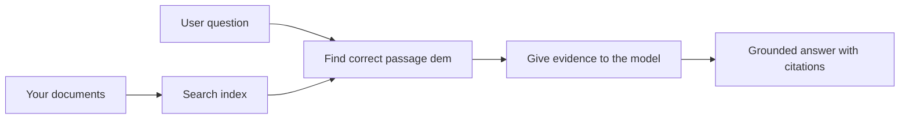

# Teach AI to Answer Questions Based on Your Documents:
## Series 1: RAG, Azure vs Open-Source Alternatives, and When Fine-Tuning Makes Sense

> Di fɔstə atikol for 2026 series wey di go revisit my 2023 Azure AI Search + Azure OpenAI document QA tutorials dem.

Series navigation: [Repository home](../README.md) | Next: [Series 2 - Build a Local Open-Source RAG System End to End](./series-2-open-source-rag-end-to-end.md)

## 1. Intro - Revisiting an Earlier RAG Tutorial

For 2023, I workt on pair of tutorials about teaching ChatGPT to answer questions from PDF documents using Azure AI Search and Azure OpenAI. I write di [LangChain version](https://techcommunity.microsoft.com/blog/educatordeveloperblog/teach-chatgpt-to-answer-questions-using-azure-ai-search--azure-openai-lang-chain/3969713), and I also join hand co-author di companion [Semantic Kernel version](https://techcommunity.microsoft.com/blog/educatordeveloperblog/teach-chatgpt-to-answer-questions-using-azure-ai-search--azure-openai-semantic-k/3985395) with [Lee Stott](https://developer.microsoft.com/en-us/advocates/lee-stott), wey be Principal Cloud Advocate Manager for Microsoft. For dat time, di idea of "ChatGPT on your data" still dey new for many developers. Di tutorials dem use Azure Blob Storage, Azure AI Search, Azure OpenAI, LangChain, Semantic Kernel, and FAISS-style vector retrieval to answer questions from PDF files.

Dat earlier article focus on simple but important workflow: upload documents, index dem, find relevant content, then ask model to answer based on dat content.

For 2026, di RAG ecosystem don grow yawa. Azure AI Search don support modern vector and hybrid retrieval patterns, Azure OpenAI dey part of di bigger Microsoft Foundry Models ecosystem, and di newer v1 API fit use standard OpenAI client without need monthly `api-version` wahala. At di same time, open-source options like LangGraph, LlamaIndex, Haystack, Qdrant, Milvus, Weaviate, Chroma, Ollama, and vLLM don become practical choices for real RAG systems.

Na why I want come back to dis topic. Di question no be "How I build RAG?" again. Now, nuf ways dey to build am, and di important question be "Which architecture I suppose choose for my situation?"

But di main problem never change.

AI model no dey automatically sabi your documents. To build correct document-question-answering system, you still need beta retrieval, grounding, evaluation, and operational workflows.

Dis article no be another end-to-end "chat with PDF" tutorial. I want start dis updated series with di question wey I dey worry pass now: when you suppose choose managed Azure architecture, when you suppose choose open-source RAG stack, and when fine-tuning really make sense?

Dis na di first article for series about building document-grounded AI systems. For dis first part, we go focus on architecture decisions: why RAG matter, when Azure-based managed services good, when open-source alternatives make sense, and where fine-tuning fit.

After build and revisit document QA systems, I no dey too interested in which tool look best for demo again but na which architecture fit survive real users, changing documents, permissions, failures, and maintenance.

## 2. Why Your AI Needs a Search System

Large language models dem train for broad public and licensed data. Dem fit sabi plenty things about general topics, but dem no sabi your private PDFs, internal policies, enterprise procedures, research archives, classroom materials, customer support notes, or recently updated documentation automatically.

Simple way to reason about RAG na dis: instead of expect model to remember every document, we give am search system. When user ask question, system first find di most relevant pieces of information, then give dem pieces to model as context.

Dis dey important because many real-world knowledge sources na private, dey always change, dey permission-sensitive, spread across many systems, written for many formats, and too big to just paste inside prompt.

For example, if school, company, or research team get 10,000 internal documents, di model no fit answer from those documents well unless system find di right parts for di right time.

Dis go bring popular question:

Why no just fine-tune di model?

Fine-tuning fit help, but e no normally be di correct first tool for document knowledge. If knowledge dey always change, if citations matter, or if access permissions matter, RAG na often beta starting point. Fine-tuning na better for teach behavior, style, output format, and task patterns.

## 3. RAG Architecture in Practice

Make you imagine say you dey build AI assistant for school. Di assistant suppose dey answer questions from policy PDFs, course guides, internal FAQ pages, and recently updated announcements.

If student ask, "Can I use generative AI for my final assignment?", di system no suppose answer from model memory. E suppose first find relevant school policy, retrieve section about AI usage, then ask model to answer with dat evidence.

Na so RAG dey work.

High level, you fit think di flow like dis:

Di details fit get more complex, but di simple idea be say: model no dey answer by itself. E dey answer with retrieved evidence.

First, documents dey collect from storage systems like Azure Blob Storage, SharePoint, GitHub, or internal CMS. Then system dey parse dem into text but e dey protect useful structure like headings, page numbers, tables, sections, and source locations.

Next, content dey split into chunks. Dis step sound simple, but na one of di important parts of di system. If chunk too small, e fit lose di surrounding context. If chunk too big, e fit carry information wey no relate and make retrieval no too accurate.

After chunking, system dey create embeddings and store dem for searchable index plus original text and metadata like file name, page number, permissions, document version, and source URL.

When user ask question, system dey retrieve candidate chunks using keyword search, vector search, or hybrid search. Reranker fit reorder those chunks so best evidence dey near top.

Finally, model go get di question plus di retrieved evidence. Di answer must dey based on that evidence and make e return citations so user fit check di source.

Di important thing be say RAG no be only "put PDFs inside vector database." Di quality of di answer depend on di whole workflow: parsing, chunking, retrieval, reranking, prompting, citation, and evaluation.

Na why document structure dey very important. Inside PDF, heading, table, footnote, or page boundary fit change di meaning of one passage. For Azure, Document Layout skill dey use Azure Document Intelligence layout abilities to produce structure-aware output, wey fit improve chunking and retrieval quality for RAG systems.

## 4. What Changed Since 2023?

Di 2023 tutorial na beta starting point for dat time:

- Azure Blob Storage dey store PDF files.
- Azure AI Search dey index content.
- LangChain connect retrieval to Azure OpenAI.
- FAISS work as simple local vector store.
- Di example use `gpt-35-turbo` and `text-embedding-ada-002`.

For 2026, modern version suppose reflect some changes.

First, retrieval don mature. For 2023, many demos use simple vector similarity search. Now, hybrid retrieval dey often di default starting point for serious document QA. Azure AI Search support hybrid search by joining keyword and vector queries for one request plus merging results with Reciprocal Rank Fusion. Semantic ranker fit rerank di text side of full-text, vector, and hybrid results.

Second, ingestion don get more skills. Instead to manually split every document with app code, Azure AI Search fit integrate vectorization for chunking, embedding, and query-time vectorization. For PDFs and document-heavy workloads, Document Layout skill fit protect more structure pass fixed-size chunks.

Third, orchestration matter more. Di hard part no be di LLM API call itself. Di hard part na how to handle failures, retries, stale retrieval, chunk quality, long-running workflows, human review, and evaluation for big scale. Na here workflow-oriented tools like LangGraph, LlamaIndex workflows, Haystack pipelines, and platform-level evaluation/observability tools dey more relevant pass single linear chain.

Fourth, evaluation no be optional again. Demo fit look impressive with one question. But production system need test sets, regression checks, retrieval metrics, groundedness checks, and monitoring. Without evaluation, e hard to tell if system dey improve or e just dey change.

## 5. Choosing Between Azure and Open-Source RAG Stacks

I no believe di correct question be "Is Azure better than open source?" or "Is open source better than Azure?"

Di better question be: wetin kind system you dey build, who go operate am, wetin constraints you get, and which failure modes you no fit accept?

When I start to build document QA examples, I dey mostly think about whether di retrieval work. Fit I upload PDFs, search dem, then generate answer? That one be reasonable starting point.

After I work through more realistic AI workflows, my evaluation don change. Now I dey look four things before I choose RAG stack:

- identity and permissions
- retrieval quality
- workflow reliability
- operational ownership

Those four areas tell you more than model benchmark alone.

Azure-based architectures dey make sense when enterprise integration hard. If team don depend for Microsoft Entra ID, Microsoft 365, Azure Storage, private networking, RBAC, and Azure monitoring, Azure AI Search and Azure OpenAI fit reduce plenty operational wahala. For that kain environment, Azure no be just model API. Di value na di surrounding system: identity, governance, managed search, security integration, support, and familiar operations.

Open-source architectures dey make sense when flexibility na di main problem. If team need local inference, cloud portability, custom retrieval pipeline, specialized reranking, or direct control over vector database and model-serving layer, open-source stack fit better. But di tradeoff be say team go handle more of di reliability work: backups, scaling, latency, migrations, monitoring, and security.

For practice, plenty production AI systems no pure cloud-native or pure open-source. E dey hybrid systems weh dey balance operational simplicity, portability, governance, and engineering flexibility.

For example, I no go surprise if I see system wey use Azure OpenAI for model access, LangGraph for workflow orchestration, Azure hosting for deployment, and open-source vector database for specific retrieval need. Dat one no be architectural inconsistency. Na how to choose correct level of managed service and engineering control for each part of di system.

I like hybrid architectures when managed platform solve important enterprise problem, while open-source parts give team flexibility where e really matter.

## 6. A Practical Decision Guide

Here na di decision table wey I go use with team before I choose RAG stack:

| Decision area | Azure managed stack is stronger when... | Open-source stack is stronger when... |
| --- | --- | --- |
| Identity and access | Entra ID, RBAC, managed identity, and enterprise permissions dey central | custom auth, non-Microsoft identity, or app-specific access logic dey dominate |
| Operations | team want managed infrastructure, support, SLAs, and easier onboarding | team fit operate vector databases, model serving, backups, and scaling |
| Retrieval | hybrid search, semantic ranking, filters, and metadata search dey cover most needs | team need custom retrieval, specialized reranking, or experimental indexing |
| Portability | Azure ecosystem alignment dey acceptable or preferred | avoiding cloud lock-in na hard requirement |
| Inference | Azure OpenAI governance, networking, and enterprise controls dey important | local inference, custom models, or self-hosted serving dey required |
| Cost | reduce engineering and operations effort dey more important than infrastructure tuning | scale big enough to justify careful infrastructure optimization |
| Experimentation | stability and enterprise integration dey more important than often component change | team dey iterate quickly on agents, tools, memory, and retrieval workflows |

My rule of thumb na simple one:

- Start with Azure when enterprise integration, security, and operational simplicity be main risk.
- Start with open source when portability, customization, or local control be main risk.
- Use hybrid stack when both dey true.

Na why I no go start 2026 RAG series with code first. Code important, but architecture selection come before implementation. Simple demo fit hide di hardest choices. Good RAG systems dey make di choices clear.

## 7. Where Fine-Tuning Fits

Fine-tuning dey often talk together with RAG, but I think e important to separate di two.

RAG na better choice when system need fresh, private, permission-sensitive, or source-grounded knowledge. If answer suppose cite documents, show recent updates, or respect user-specific access rules, retrieval must dey part of di architecture.
Fine-tuning dey more useful wen knowledge no be di main problem. E fit help wen you wan make di model follow one specific output format, match one domain-specific response style, perform one stable task more consistently, or reduce di amount of instruction wey you need put for every prompt.

For practice, di two fit work together. One support assistant fit use RAG to find di latest policy, as per fine-tuned model dey learn di company's preferred answer structure and tone.

Di mistake na to treat fine-tuning as replacement for document store. E no fit remove di need for retrieval wen di system gats answer from fresh, private, or permission-sensitive data.

## 8. Where This Series Goes Next

Dis article na di decision-making layer. Before I write code, I want make di tradeoffs clear: RAG vs fine-tuning, Azure vs open source, managed services vs operational control.

Before I move into implementation, I wan drop one point here: for plenty enterprise AI systems, di model na only one part. Retrieval quality, orchestration, evaluation, permissions, and operational reliability na wetin dem dey use decide if di system fit succeed pass demo stage.

For di next parts of dis series, I plan go deep into di practical side of document-grounded AI systems: first build one local open-source RAG workflow, then rebuild di same scenario with Azure AI Search and Azure OpenAI, then check if di system really dey work.

I fit change di order as di series dey grow, but di goal go remain di same: to move beyond simple demo and show how to think about RAG systems wey fit be maintained, evaluated, and operated.

## 9. References and Resources

Original tutorials:

- [Teach ChatGPT to Answer Questions: Using Azure AI Search & Azure OpenAI (Lang Chain)](https://techcommunity.microsoft.com/blog/educatordeveloperblog/teach-chatgpt-to-answer-questions-using-azure-ai-search--azure-openai-lang-chain/3969713)
- [Teach ChatGPT to Answer Questions: Using Azure AI Search & Azure OpenAI (Semantic Kernel)](https://techcommunity.microsoft.com/blog/educatordeveloperblog/teach-chatgpt-to-answer-questions-using-azure-ai-search--azure-openai-semantic-k/3985395)

Azure:

- [Azure AI Search REST API versions](https://learn.microsoft.com/en-us/rest/api/searchservice/search-service-api-versions)
- [Hybrid search in Azure AI Search](https://learn.microsoft.com/en-us/azure/search/hybrid-search-how-to-query)
- [Integrated vectorization in Azure AI Search](https://learn.microsoft.com/en-us/azure/search/vector-search-integrated-vectorization)
- [Document Layout skill in Azure AI Search](https://learn.microsoft.com/en-us/azure/search/cognitive-search-skill-document-intelligence-layout)
- [Chunk and vectorize by document layout](https://learn.microsoft.com/en-us/azure/search/search-how-to-semantic-chunking)
- [Semantic ranking in Azure AI Search](https://learn.microsoft.com/en-us/azure/search/semantic-search-overview)
- [Azure OpenAI / Microsoft Foundry API version lifecycle](https://learn.microsoft.com/en-us/azure/foundry/openai/api-version-lifecycle)
- [Foundry Models sold by Azure](https://learn.microsoft.com/en-us/azure/foundry/foundry-models/concepts/models-sold-directly-by-azure)
- [Microsoft Foundry fine-tuning considerations](https://learn.microsoft.com/en-us/azure/foundry/openai/concepts/fine-tuning-considerations)
- [Microsoft Foundry observability](https://learn.microsoft.com/en-us/azure/foundry/concepts/observability)
- [Run evaluations in Microsoft Foundry](https://learn.microsoft.com/en-us/azure/foundry/how-to/evaluate-generative-ai-app)

Open-source:

- [LangGraph documentation](https://docs.langchain.com/oss/python/langgraph/overview)
- [LlamaIndex documentation](https://developers.llamaindex.ai/python/framework/)
- [Haystack documentation](https://docs.haystack.deepset.ai/)
- [Qdrant documentation](https://qdrant.tech/documentation/overview/)
- [Milvus documentation](https://milvus.io/docs/overview.md)
- [Weaviate documentation](https://docs.weaviate.io/weaviate/current/)
- [Chroma documentation](https://docs.trychroma.com/docs/overview/introduction)
- [Ollama embeddings](https://docs.ollama.com/capabilities/embeddings)
- [vLLM OpenAI-compatible server](https://docs.vllm.ai/en/latest/serving/openai_compatible_server.html)
- [BGE embedding models](https://huggingface.co/BAAI/bge-large-en-v1.5)
- [E5 embedding models](https://huggingface.co/intfloat/e5-large-v2)
- [Instructor embedding models](https://huggingface.co/hkunlp/instructor-large)

Next: [Series 2 - Build a Local Open-Source RAG System End to End](./series-2-open-source-rag-end-to-end.md)

---

<!-- CO-OP TRANSLATOR DISCLAIMER START -->
**Disclaimer**:
Dis document don translate wit AI translation service [Co-op Translator](https://github.com/Azure/co-op-translator). Even tho we dey try make am correct, abeg make you know say automated translation fit get errors or mistakes. Di original document for dia own language na im be di correct source. For important info, make person wey sabi human translation do am. We no go responsible for any misunderstanding or wrong understanding wey fit happen because of dis translation.
<!-- CO-OP TRANSLATOR DISCLAIMER END -->