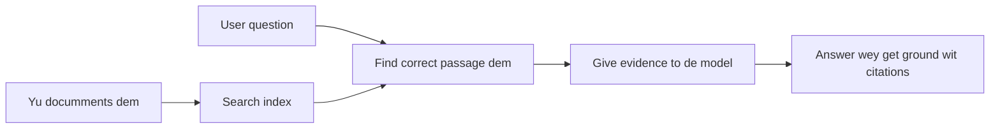

# Teach AI to Answer Questions Based on Your Documents:
## Series 1: RAG, Azure vs Open-Source Alternatives, and When Fine-Tuning Makes Sense

> Di first article for di 2026 series wey dey look back my 2023 Azure AI Search + Azure OpenAI document QA tutorials.

## 1. Intro - Revisiting an Earlier RAG Tutorial

For 2023, I work on two tutorials about how to teach ChatGPT to answer questions from PDF documents using Azure AI Search and Azure OpenAI. I write di [LangChain version](https://techcommunity.microsoft.com/blog/educatordeveloperblog/teach-chatgpt-to-answer-questions-using-azure-ai-search--azure-openai-lang-chain/3969713), and I also co-wrote di companion [Semantic Kernel version](https://techcommunity.microsoft.com/blog/educatordeveloperblog/teach-chatgpt-to-answer-questions-using-azure-ai-search--azure-openai-semantic-k/3985395) with [Lee Stott](https://developer.microsoft.com/en-us/advocates/lee-stott), Principal Cloud Advocate Manager for Microsoft. For dat time, the idea of "ChatGPT on your data" still dey new for plenty developers. Di tutorials use Azure Blob Storage, Azure AI Search, Azure OpenAI, LangChain, Semantic Kernel, and FAISS-style vector retrieval to answer questions from PDF files.

That earlier article focus for one simple but important workflow: to upload documents, index dem, find relevant content, then ask one model to answer based on dat content.

For 2026, di RAG ecosystem don grow well well. Azure AI Search now support modern vector and hybrid retrieval patterns, Azure OpenAI dey inside di bigger Microsoft Foundry Models ecosystem, and di newer v1 API fit use di standard OpenAI client without needing monthly `api-version` changes. At di same time, open-source options like LangGraph, LlamaIndex, Haystack, Qdrant, Milvus, Weaviate, Chroma, Ollama, and vLLM don become practical choices for real RAG systems.

Na why I want to look this topic again. Di question no be just "How I fit build RAG?" again. Now, plenty ways to build am, and di important question be "Which architecture make sense for my situation?"

But di main palava no change.

AI model no go automatically sabi your documents. To build better document-question-answering system, you still need reliable retrieval, grounding, evaluation, and operational workflows.

Dis article no be another end-to-end "chat with PDF" tutorial. I want start dis updated series with the question wey I dey care more about now: when you suppose choose managed Azure architecture, when you suppose choose open-source RAG stack, and when fine-tuning really make sense?

Dis na di first article for a series about how to build document-grounded AI systems. For dis first part, we go focus on architecture decisions: why RAG matter, when Azure managed services dey useful, when open-source alternatives make sense, and where fine-tuning fit.

After building and revisiting document QA systems, I don dey less interested in which tool look best for demo and I dey more interested in which architecture fit survive real users, changing documents, permissions, failures, and maintenance.

## 2. Why Your AI Needs a Search System

Large language models get training on broad public and licensed data. Dem fit sabi plenty general topics, but dem no go automatically sabi your private PDFs, internal policies, enterprise procedures, research archives, classroom materials, customer support notes, or recently updated documentation.

One simple way to reason about RAG be dis: instead of expecting di model to remember every document, we give am search system. When user ask question, di system first find di most relevant pieces of info, then give di model those pieces as context.

Dis matter because many real-world knowledge sources dey private, dey change constantly, dey sensitive to permission, dem dey stored for multiple systems, dem dey for many formats, and dem big too much to just paste inside one prompt.

For example, if school, company, or research team get 10,000 internal documents, di model no fit answer from those documents correctly unless di system find di right parts at di right time.

Dis one naturally lead to one common question:

Why you no just fine-tune the model?

Fine-tuning fit be useful, but e no usually be di right first tool for document knowledge. If knowledge dey change often, if citations dey important, or if access permission dey important, RAG usually be better starting point. Fine-tuning dey better for teaching behaviour, style, output format, and task patterns.

## 3. RAG Architecture in Practice

Make you imagine say you dey build AI assistant for school. Di assistant need answer questions from policy PDFs, course guides, internal FAQ pages, and recent announcements.

If student ask, "Can I use generative AI for my final assignment?", di system suppose no answer from model general memory. E suppose first find di relevant school policy, bring di section about AI usage, then ask di model to answer using dat evidence.

Na RAG for practice.

For top level, you fit think di flow like dis:

Di details fit become more complex, but di basic idea simple: di model no answer alone. E answer with retrieved evidence.

First, documents dey bring come from storage systems like Azure Blob Storage, SharePoint, GitHub, or internal CMS. Then di system dey parse dem into text while e dey keep useful structure like headings, page numbers, tables, sections, and source locations.

Next, the content dey split into chunks. Dis step sound simple, but e be one of di most important parts of di system. If chunk too small, e fit lose surrounding context. If chunk too big, e fit get unrelated info wey go make retrieval no precise.

After chunking, di system go create embeddings and store dem for searchable index together with di original text and metadata like file name, page number, permissions, document version, and source URL.

When user ask question, di system go retrieve candidate chunks using keyword search, vector search, or hybrid search. Reranker fit then reorder those chunks so di most useful evidence dey top.

Finally, di model go receive di question and di retrieved evidence. Di answer suppose base on dat evidence and return citations so user fit check di source.

Di important point be say RAG no be only "put PDFs inside vector database." Di answer quality depend on di whole workflow: parsing, chunking, retrieval, reranking, prompting, citation, and evaluation.

Na why document structure matter. For PDF, heading, table, footnote, or page boundary fit change di meaning of one passage. For Azure, di Document Layout skill use Azure Document Intelligence layout features to produce structure-aware output, wey fit improve chunking and retrieval quality for RAG systems.

## 4. What Changed Since 2023?

Di 2023 tutorial be good starting point for di time:

- Azure Blob Storage store PDF files.
- Azure AI Search index content.
- LangChain connect retrieval to Azure OpenAI.
- FAISS work as simple local vector store.
- Example use `gpt-35-turbo` and `text-embedding-ada-002`.

For 2026, modern version suppose reflect some changes.

First, retrieval don mature. For 2023, plenty demos dey use simple vector similarity search. Today, hybrid retrieval often be default starting point for serious document QA. Azure AI Search support hybrid search by combining keyword and vector queries inside one request and merging results with Reciprocal Rank Fusion. Semantic ranker fit rerank text side of full-text, vector, and hybrid results.

Second, ingestion dey more sophisticated. Instead of manually splitting every document with app code, Azure AI Search support integrated vectorization for chunking, embedding, and query-time vectorization. For PDFs and document-heavy workloads, Document Layout skill fit preserve more structure than fixed-size chunks.

Third, orchestration matter more. Hard part no usually be di LLM API call itself. Di hard part be to handle failures, retries, stale retrieval, chunk quality, long-running workflows, human review, and evaluation at scale. Na here workflow-oriented tools like LangGraph, LlamaIndex workflows, Haystack pipelines, and platform-level evaluation and observability tools dey more relevant than one simple linear chain.

Fourth, evaluation no be optional again. Demo fit look impressive with one question. Production system need test sets, regression checks, retrieval metrics, groundedness checks, and monitoring. Without evaluation, e hard to know whether system dey improve or just dey change.

## 5. Choosing Between Azure and Open-Source RAG Stacks

I no believe say di useful question be "Azure better pass open source?" or "Open source better pass Azure?"

Di useful question be: which kind system you dey build, who go operate am, which constraints you get, and which failure modes no fit happen?

When I start to build document QA examples, I mainly think about whether di retrieval work. Fit I upload PDFs, search them, and generate answer? Dat one be reasonable starting point.

After working through more realistic AI workflows, my evaluation change. Now, I dey check four things before I choose RAG stack:

- identity and permissions
- retrieval quality
- workflow reliability
- operational ownership

Those four areas tell you plenty more than model benchmark fit alone.

Azure-based architectures usually make sense when enterprise integration be di hard part. If team already depend on Microsoft Entra ID, Microsoft 365, Azure Storage, private networking, RBAC, and Azure monitoring, Azure AI Search and Azure OpenAI fit reduce plenty operational wahala. For dat environment, Azure no be only model API. Di value na di surrounding system: identity, governance, managed search, security integration, support, and familiar operations.

Open-source architectures usually make sense when flexibility be di hard part. If team need local inference, cloud portability, custom retrieval pipeline, special reranking, or direct control over vector database and model-serving layer, open-source stack fit be better. Di tradeoff be say team go own plenty of di reliability work: backups, scaling, latency, migrations, monitoring, and security.

For practice, many production AI systems no pure cloud-native or pure open-source. Dem dey mostly hybrid systems wey balance operational simplicity, portability, governance, and engineering flexibility.

For example, I no go surprised to see system wey use Azure OpenAI for model access, LangGraph for workflow orchestration, Azure hosting for deployment, and open-source vector database for specific retrieval need. Dat no be architectural inconsistency. Na to choose di correct level of managed service and engineering control for each part of di system.

I like hybrid architectures when managed platform solve important enterprise problems, while open-source parts give team flexibility where e really matter.

## 6. A Practical Decision Guide

Here be di decision table wey I go use with team before I choose RAG stack:

| Decision area | Azure managed stack stronger when... | Open-source stack stronger when... |
| --- | --- | --- |
| Identity and access | Entra ID, RBAC, managed identity, and enterprise permissions dey central | custom auth, non-Microsoft identity, or app-specific access logic shapers |
| Operations | team want managed infrastructure, support, SLAs, and simpler onboarding | team fit operate vector databases, model serving, backups, and scaling |
| Retrieval | hybrid search, semantic ranking, filters, and metadata search cover majority needs | team need custom retrieval, specialized reranking, or experimental indexing |
| Portability | Azure ecosystem alignment dey okay or preferred | avoiding cloud lock-in na serious requirement |
| Inference | Azure OpenAI governance, networking, and enterprise controls matter | local inference, custom models, or self-hosted serving required |
| Cost | reducing engineering and operations effort dey more important than infrastructure tuning | scale big enough to require careful infrastructure optimization |
| Experimentation | stability and enterprise integration matter more than changing components often | team dey quickly iterate on agents, tools, memory, and retrieval workflows |

My rule of thumb na simple:

- Start with Azure when enterprise integration, security, and operational simplicity be main risks.
- Start with open source when portability, customization, or local control be main risks.
- Use hybrid stack when both risks dey.

Na why I no go start 2026 RAG series with code first. Code important, but architecture selection comes before implementation. One simple demo fit hide hardest choices. Good RAG system make those choices clear.

## 7. Where Fine-Tuning Fits

Fine-tuning dey often mention with RAG, but I think e important to separate di two.

RAG usually better choice when system need fresh, private, permission-sensitive, or source-grounded knowledge. If answer need cite documents, show recent updates, or respect user-specific access rules, retrieval suppose be part of architecture.

Fine-tuning more useful when knowledge no be main palava. E fit help when you want di model to follow specific output format, match domain-specific response style, do stable task well, or reduce instruction needed for every prompt.
For practice, dem two fit work together. One support assistant fit use RAG to find the latest policy, while one fine-tuned model dey learn the company preferred answer structure and tone.

The mistake be say to dey treat fine-tuning as replacement for document store. E no go remove the need for retrieval when the system must answer from fresh, private, or permission-sensitive data.

## 8. Where This Series Goes Next

Dis article na the decision-making layer. Before to write code, I wanted make the tradeoffs clear: RAG vs fine-tuning, Azure vs open source, managed services vs operational control.

Before to move into implementation, I want to leave one point here: for plenty enterprise AI systems, the model na just one part. Retrieval quality, orchestration, evaluation, permissions, and operational reliability na wetin usually determine if the system go succeed beyond the demo stage.

For the next parts of dis series, I plan to go deeper inside the practical side of document-grounded AI systems: how to build Azure-based architecture, how open-source alternatives compare for practice, and how to evaluate if RAG system dey really work.

I fit adjust the order as the series dey develop, but the goal go remain the same: to move beyond simple demo and show how to think about RAG systems wey fit dey maintained, evaluated, and operated.

## 9. References and Resources

Original tutorials:

- [Teach ChatGPT to Answer Questions: Using Azure AI Search & Azure OpenAI (Lang Chain)](https://techcommunity.microsoft.com/blog/educatordeveloperblog/teach-chatgpt-to-answer-questions-using-azure-ai-search--azure-openai-lang-chain/3969713)
- [Teach ChatGPT to Answer Questions: Using Azure AI Search & Azure OpenAI (Semantic Kernel)](https://techcommunity.microsoft.com/blog/educatordeveloperblog/teach-chatgpt-to-answer-questions-using-azure-ai-search--azure-openai-semantic-k/3985395)

Azure:

- [Azure AI Search REST API versions](https://learn.microsoft.com/en-us/rest/api/searchservice/search-service-api-versions)
- [Hybrid search in Azure AI Search](https://learn.microsoft.com/en-us/azure/search/hybrid-search-how-to-query)
- [Integrated vectorization in Azure AI Search](https://learn.microsoft.com/en-us/azure/search/vector-search-integrated-vectorization)
- [Document Layout skill in Azure AI Search](https://learn.microsoft.com/en-us/azure/search/cognitive-search-skill-document-intelligence-layout)
- [Chunk and vectorize by document layout](https://learn.microsoft.com/en-us/azure/search/search-how-to-semantic-chunking)
- [Semantic ranking in Azure AI Search](https://learn.microsoft.com/en-us/azure/search/semantic-search-overview)
- [Azure OpenAI / Microsoft Foundry API version lifecycle](https://learn.microsoft.com/en-us/azure/foundry/openai/api-version-lifecycle)
- [Foundry Models sold by Azure](https://learn.microsoft.com/en-us/azure/foundry/foundry-models/concepts/models-sold-directly-by-azure)
- [Microsoft Foundry fine-tuning considerations](https://learn.microsoft.com/en-us/azure/foundry/openai/concepts/fine-tuning-considerations)
- [Microsoft Foundry observability](https://learn.microsoft.com/en-us/azure/foundry/concepts/observability)
- [Run evaluations in Microsoft Foundry](https://learn.microsoft.com/en-us/azure/foundry/how-to/evaluate-generative-ai-app)

Open-source:

- [LangGraph documentation](https://docs.langchain.com/oss/python/langgraph/overview)
- [LlamaIndex documentation](https://developers.llamaindex.ai/python/framework/)
- [Haystack documentation](https://docs.haystack.deepset.ai/)
- [Qdrant documentation](https://qdrant.tech/documentation/overview/)
- [Milvus documentation](https://milvus.io/docs/overview.md)
- [Weaviate documentation](https://docs.weaviate.io/weaviate/current/)
- [Chroma documentation](https://docs.trychroma.com/docs/overview/introduction)
- [Ollama embeddings](https://docs.ollama.com/capabilities/embeddings)
- [vLLM OpenAI-compatible server](https://docs.vllm.ai/en/latest/serving/openai_compatible_server.html)
- [BGE embedding models](https://huggingface.co/BAAI/bge-large-en-v1.5)
- [E5 embedding models](https://huggingface.co/intfloat/e5-large-v2)
- [Instructor embedding models](https://huggingface.co/hkunlp/instructor-large)

---

<!-- CO-OP TRANSLATOR DISCLAIMER START -->
**Disclaimer**:
Dis document don translate wit AI translation service [Co-op Translator](https://github.com/Azure/co-op-translator). Even tho we dey try make am correct, abeg make you know say automated translation fit get errors or mistakes. Di original document for dia own language na im be di correct source. For important info, make person wey sabi human translation do am. We no go responsible for any misunderstanding or wrong understanding wey fit happen because of dis translation.
<!-- CO-OP TRANSLATOR DISCLAIMER END -->