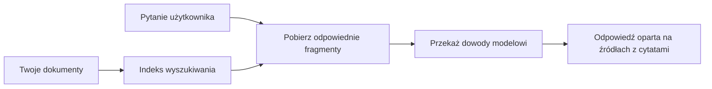

# Naucz SI odpowiadać na pytania na podstawie Twoich dokumentów:
## Seria 1: RAG, Azure kontra alternatywy open-source oraz kiedy ma sens dostrajanie

> Pierwszy artykuł z serii z 2026 roku, który na nowo analizuje moje samouczki z 2023 roku dotyczące Azure AI Search + Azure OpenAI do zadawania pytań na podstawie dokumentów.

Nawigacja po serii: [Strona główna repozytorium](../README.md) | Następny: [Seria 2 - Budowa lokalnego systemu RAG open-source od podstaw](./series-2-open-source-rag-end-to-end.md)

## 1. Wstęp – powrót do wcześniejszego samouczka RAG

W 2023 roku pracowałem nad parą samouczków o nauce ChatGPT odpowiadania na pytania z dokumentów PDF przy użyciu Azure AI Search i Azure OpenAI. Napisałem [wersję LangChain](https://techcommunity.microsoft.com/blog/educatordeveloperblog/teach-chatgpt-to-answer-questions-using-azure-ai-search--azure-openai-lang-chain/3969713), a także współautorzyłem wersję towarzyszącą [Semantic Kernel](https://techcommunity.microsoft.com/blog/educatordeveloperblog/teach-chatgpt-to-answer-questions-using-azure-ai-search--azure-openai-semantic-k/3985395) razem z [Lee Stott](https://developer.microsoft.com/en-us/advocates/lee-stott), głównym menedżerem ds. zwolenników chmury w Microsoft. W tamtych czasach idea „ChatGPT na twoich danych” wciąż była dla wielu deweloperów nowością. Samouczki wykorzystywały Azure Blob Storage, Azure AI Search, Azure OpenAI, LangChain, Semantic Kernel oraz wyszukiwanie wektorowe typu FAISS, by odpowiadać na pytania z plików PDF.

Ten wcześniejszy artykuł koncentrował się na prostym, ale ważnym przepływie pracy: przesyłaj dokumenty, indeksuj je, pobieraj istotne treści i pytaj model o odpowiedź na podstawie tych treści.

W 2026 roku ekosystem RAG znacząco się rozwinął. Azure AI Search teraz wspiera nowoczesne wzorce wyszukiwania wektorowego i hybrydowego, Azure OpenAI jest częścią szerszego ekosystemu modeli Microsoft Foundry, a nowsze API v1 może korzystać ze standardowego klienta OpenAI bez wymogu comiesięcznych zmian `api-version`. Jednocześnie opcje open-source, takie jak LangGraph, LlamaIndex, Haystack, Qdrant, Milvus, Weaviate, Chroma, Ollama i vLLM, stały się praktycznymi wyborami dla realnych systemów RAG.

Dlatego chciałem wrócić do tego tematu. Pytanie nie brzmi już tylko „Jak zbudować RAG?” Teraz jest wiele sposobów na jego zbudowanie, a ważniejsze pytanie to „Jaką architekturę wybrać dla mojej sytuacji?”

Ale podstawowy problem pozostaje niezmieniony.

Model SI nie zna automatycznie twoich dokumentów. Aby zbudować użyteczny system odpowiadania na pytania na podstawie dokumentów, nadal potrzebujesz niezawodnego pobierania danych, ugruntowania, oceny i operacyjnego przepływu pracy.

Ten artykuł nie jest kolejnym kompletnym samouczkiem „rozmowy z PDF”. Chcę rozpocząć tę zaktualizowaną serię od pytania, na którym teraz bardziej mi zależy: kiedy wybrać zarządzaną architekturę Azure, kiedy wybrać stos RAG open-source i kiedy dostrajanie jest faktycznie opłacalne?

To pierwszy artykuł z serii o budowaniu systemów AI opartych na dokumentach. W tej pierwszej części skupimy się na decyzjach architektonicznych: dlaczego RAG jest ważne, kiedy przydatne są zarządzane usługi Azure, kiedy sensowne są alternatywy open-source oraz gdzie pasuje dostrajanie.

Po zbudowaniu i powrocie do systemów odpowiadania na pytania z dokumentów stałem się mniej zainteresowany tym, które narzędzie wygląda najlepiej na demo, a bardziej tym, która architektura przetrwa prawdziwych użytkowników, zmieniające się dokumenty, uprawnienia, awarie i konserwację.

## 2. Dlaczego twojemu SI potrzebny jest system wyszukiwania

Duże modele językowe są trenowane na szerokich, publicznych i licencjonowanych danych. Mogą znać wiele o tematach ogólnych, ale nie znają automatycznie twoich prywatnych PDF-ów, wewnętrznych polityk, procedur przedsiębiorstwa, archiwów badań, materiałów dydaktycznych, notatek wsparcia klienta czy niedawno zaktualizowanej dokumentacji.

Prosty sposób myślenia o RAG jest taki: zamiast oczekiwać, że model zapamięta każdy dokument, dajemy mu system wyszukiwania. Gdy użytkownik zadaje pytanie, system najpierw znajduje najbardziej istotne fragmenty informacji, a następnie przekazuje je modelowi jako kontekst.

To ma znaczenie, ponieważ wiele rzeczywistych źródeł wiedzy jest prywatnych, stale się zmienia, jest wrażliwych na uprawnienia, przechowywanych w różnych systemach, zapisanych w wielu formatach i zbyt obszernych, by wkleić je bezpośrednio do promptu.

Na przykład, jeśli szkoła, firma lub zespół badawczy ma 10 000 dokumentów wewnętrznych, model nie może wiarygodnie odpowiadać na ich podstawie, jeśli system nie pobierze właściwych fragmentów we właściwym czasie.

To naturalnie prowadzi do popularnego pytania:

Dlaczego nie po prostu dostroić model?

Dostrajanie może być przydatne, ale zwykle nie jest pierwszym właściwym narzędziem do wiedzy z dokumentów. Jeśli wiedza często się zmienia, jeśli cytowania są ważne lub jeśli uprawnienia do dostępu mają znaczenie, RAG jest zwykle lepszym punktem startu. Dostrajanie bardziej nadaje się do nauki zachowań, stylu, formatu wyjścia i wzorców zadań.

## 3. Architektura RAG w praktyce

Wyobraź sobie, że budujesz asystenta AI dla szkoły. Asystent musi odpowiadać na pytania z dokumentów polityk, przewodników kursów, wewnętrznych stron FAQ i ostatnio zaktualizowanych ogłoszeń.

Jeśli student zapyta: „Czy mogę użyć generatywnej SI do mojego projektu końcowego?”, system nie powinien odpowiadać z ogólnej pamięci modelu. Powinien najpierw znaleźć odpowiednią politykę szkolną, pobrać sekcję o użyciu SI, a potem poprosić model o udzielenie odpowiedzi w oparciu o ten dowód.

To jest RAG w praktyce.

Na wysokim poziomie można wyobrazić sobie przepływ jak poniżej:

Szczegóły mogą stać się bardziej wyrafinowane, ale podstawowy pomysł jest prosty: model nie odpowiada sam. Odpowiada z odzyskanymi dowodami.

Najpierw dokumenty są wczytywane z systemów przechowywania takich jak Azure Blob Storage, SharePoint, GitHub lub wewnętrzny CMS. Następnie system parsuje je na tekst, zachowując przydatną strukturę, taką jak nagłówki, numery stron, tabele, sekcje i lokalizacje źródeł.

Następnie zawartość dzieli się na fragmenty. Ten krok wydaje się prosty, ale jest jednym z najważniejszych elementów systemu. Jeśli fragment jest zbyt mały, może stracić otaczający kontekst. Jeśli fragment jest zbyt duży, może zawierać niezwiązane informacje i pogorszyć precyzję wyszukiwania.

Po dzieleniu system tworzy osadzenia (embeddings) i zapisuje je w indeksie możliwym do przeszukiwania wraz z oryginalnym tekstem i metadanymi takimi jak nazwa pliku, numer strony, uprawnienia, wersja dokumentu i adres URL źródła.

Gdy użytkownik zadaje pytanie, system wyszukuje kandydujące fragmenty przy użyciu wyszukiwania słów kluczowych, wektorowego lub hybrydowego. Reranker może następnie uporządkować te fragmenty tak, by najważniejsze dowody znalazły się na górze.

W końcu model otrzymuje pytanie i pobrane dowody. Odpowiedź powinna być ugruntowana w tych dowodach i zawierać cytowania, aby użytkownik mógł zweryfikować źródło.

Ważne jest, że RAG to nie tylko „wrzuć PDF-y do bazy wektorowej”. Jakość odpowiedzi zależy od całego przepływu pracy: parsowania, dzielenia, pobierania, ponownego sortowania, promptowania, cytowania i oceny.

Dlatego struktura dokumentu ma znaczenie. W PDF nagłówek, tabela, przypis dolny lub granica strony mogą zmienić znaczenie fragmentu. Na Azure umiejętność Document Layout wykorzystuje możliwości układu Azure Document Intelligence, by tworzyć wyjście świadome struktury, co może poprawić jakość dzielenia i pobierania w systemach RAG.

## 4. Co się zmieniło od 2023?

Samouczek z 2023 roku był dobrym punktem startowym na tamte czasy:

- Azure Blob Storage przechowywał pliki PDF.
- Azure AI Search indeksował zawartość.
- LangChain łączył pobieranie z Azure OpenAI.
- FAISS działał jako prosty lokalny magazyn wektorów.
- Przykład używał `gpt-35-turbo` i `text-embedding-ada-002`.

W 2026 nowa wersja powinna odzwierciedlać kilka zmian.

Po pierwsze, wyszukiwanie dojrzało. W 2023 wiele demonstracji używało prostego wyszukiwania wektorowego po podobieństwie. Dziś hybrydowe wyszukiwanie często jest domyślnym punktem startu dla poważnego QA dokumentów. Azure AI Search wspiera wyszukiwanie hybrydowe, łącząc zapytania słów kluczowych i wektorowe w jednym żądaniu i łącząc wyniki metodą Reciprocal Rank Fusion. Semantic ranker może wtedy przetasować wyniki tekstowe spośród wyników pełnotekstowych, wektorowych i hybrydowych.

Po drugie, przetwarzanie jest bardziej zaawansowane. Zamiast ręcznie dzielić każdy dokument w kodzie aplikacji, Azure AI Search wspiera zintegrowaną wektoryzację do dzielenia, osadzania i wektoryzacji w czasie zapytania. Dla PDF-ów i obciążeń złożonych z dokumentów umiejętność Document Layout może zachować więcej struktury niż fragmenty o stałym rozmiarze.

Po trzecie, orchestration ma większe znaczenie. Trudny element to często nie samo wywołanie API LLM. Trudne jest obsłużenie błędów, ponowienia, przeterminowanego pobierania, jakości fragmentów, długotrwałych przepływów, przeglądu ludzkiego i oceny na dużą skalę. Tutaj narzędzia zorientowane na przepływy pracy, takie jak LangGraph, LlamaIndex workflows, Haystack pipelines oraz narzędzia oceny i obserwowalności na poziomie platformy, stają się ważniejsze niż pojedynczy, liniowy łańcuch.

Po czwarte, ocena nie jest już opcjonalna. Demo może wyglądać imponująco na jedno pytanie. System produkcyjny potrzebuje zestawów testowych, checków regresji, metryk pobierania, sprawdzania ugruntowania i monitoringu. Bez oceny trudno stwierdzić, czy system się poprawia, czy tylko się zmienia.

## 5. Wybór między Azure a otwartymi stosami RAG

Nie uważam, że użyteczne pytanie brzmi „Czy Azure jest lepszy od open source?” lub „Czy open source jest lepszy od Azure?”

Użyteczne pytanie brzmi: jaki system budujesz, kto nim będzie operować, jakie masz ograniczenia i jakie tryby awarii są niedopuszczalne?

Kiedy zaczynałem budować przykłady QA dokumentów, myślałem głównie o tym, czy pobieranie działa. Czy mogę przesłać PDF-y, wyszukać w nich i wygenerować odpowiedź? To był rozsądny punkt startowy.

Po pracy nad bardziej realistycznymi przepływami AI moja ocena się zmieniła. Teraz patrzę na cztery rzeczy przed wyborem stosu RAG:

- tożsamość i uprawnienia
- jakość pobierania
- niezawodność przepływu pracy
- własność operacyjna

Te cztery obszary mówią znacznie więcej niż sam benchmark modelu.

Architektury oparte na Azure zwykle mają sens, gdy integracja przedsiębiorstwa jest trudna. Jeśli zespół już zależy od Microsoft Entra ID, Microsoft 365, Azure Storage, prywatnej sieci, RBAC i monitoringu Azure, Azure AI Search i Azure OpenAI mogą zmniejszyć dużo złożoności operacyjnej. W takim środowisku Azure to nie tylko API modelu. Wartością jest otaczający system: tożsamość, zarządzanie, zarządzane wyszukiwanie, integracja zabezpieczeń, wsparcie i znane operacje.

Architektury open source zwykle mają sens, gdy elastyczność jest trudna. Jeśli zespół potrzebuje lokalnego wnioskowania, przenośności chmurowej, niestandardowego pipeline’u pobierania, wyspecjalizowanego ponownego sortowania lub bezpośredniej kontroli nad bazą wektorową i warstwą serwowania modeli, stos open source może być lepszym wyborem. Wadą jest to, że zespół odpowiada za więcej prac związanych z niezawodnością: kopie zapasowe, skalowanie, opóźnienia, migracje, monitoring i bezpieczeństwo.

W praktyce wiele produkcyjnych systemów AI nie jest czysto natywnych w chmurze ani całkowicie open-source. Często są to systemy hybrydowe, które balansują prostotę operacyjną, przenośność, zarządzanie i elastyczność inżynieryjną.

Na przykład nie zdziwiłoby mnie, gdyby system używał Azure OpenAI do dostępu do modelu, LangGraph do orkiestracji przepływu pracy, hostingu Azure do wdrożenia i otwartoźródłowej bazy wektorowej do specjalnego wymogu pobierania. To nie jest niespójność architektoniczna. To wybór odpowiedniego poziomu usługi zarządzanej i kontroli inżynieryjnej dla każdej części systemu.

Lubię architektury hybrydowe, gdy platforma zarządzana rozwiązuje ważne problemy przedsiębiorstwa, a komponenty open source dają zespołowi elastyczność tam, gdzie to faktycznie ma znaczenie.

## 6. Praktyczny przewodnik decyzyjny

Oto tabela decyzyjna, której użyłbym z zespołem przed wyborem stosu RAG:

| Obszar decyzji | Stos zarządzany Azure jest silniejszy, gdy... | Stos open-source jest silniejszy, gdy... |
| --- | --- | --- |
| Tożsamość i dostęp | Entra ID, RBAC, zarządzana tożsamość i uprawnienia przedsiębiorstwa są kluczowe | dominuje niestandardowa autoryzacja, tożsamość spoza Microsoft lub logika dostępu specyficzna dla aplikacji |
| Operacje | zespół chce zarządzanej infrastruktury, wsparcia, SLA i łatwiejszego onboardingu | zespół potrafi obsługiwać bazy wektorowe, serwowanie modeli, kopie zapasowe i skalowanie |
| Pobieranie | wyszukiwanie hybrydowe, ranking semantyczny, filtry i wyszukiwanie metadanych pokrywają większość potrzeb | zespół potrzebuje niestandardowego pobierania, wyspecjalizowanego ponownego sortowania lub eksperymentalnego indeksowania |
| Przenośność | zgodność z ekosystemem Azure jest akceptowalna lub preferowana | unikanie uzależnienia od chmury to twardy wymóg |
| Wnioskowanie | ważne są rządzenia Azure OpenAI, sieć i kontrole przedsiębiorstwa | wymagane jest lokalne wnioskowanie, niestandardowe modele lub samodzielne hostowanie |
| Koszt | ważniejsze jest zmniejszenie wysiłku inżynieryjnego i operacyjnego niż strojenie infrastruktury | skala jest na tyle duża, że uzasadnia staranną optymalizację infrastruktury |
| Eksperymentowanie | stabilność i integracja przedsiębiorstwa są ważniejsze niż częste zmiany komponentów | zespół szybko iteruje nad agentami, narzędziami, pamięcią i przepływami pobierania |

Moja zasada jest prosta:

- Zacznij z Azure, gdy integracja przedsiębiorstwa, bezpieczeństwo i prostota operacyjna są głównymi ryzykami.
- Zacznij z open source, gdy przenośność, dostosowanie lub lokalna kontrola są głównymi ryzykami.
- Użyj stosu hybrydowego, gdy oba są prawdziwe.

Dlatego też nie zacząłbym serii RAG 2026 od kodu. Kod jest ważny, ale wybór architektury jest przed implementacją. Proste demo może ukryć najtrudniejsze wybory. Dobry system RAG czyni te wybory jawne.

## 7. Gdzie pasuje dostrajanie

Dostrajanie jest często wspominane wraz z RAG, ale uważam, że ważne jest rozdzielenie tych dwóch kwestii.

RAG zwykle jest lepszym wyborem, gdy system potrzebuje świeżej, prywatnej, wrażliwej na uprawnienia lub ugruntowanej w źródłach wiedzy. Jeśli odpowiedź powinna cytować dokumenty, odzwierciedlać niedawne aktualizacje lub respektować zasady dostępu specyficzne dla użytkownika, pobieranie powinno być częścią architektury.
Dostrajanie jest bardziej przydatne, gdy wiedza nie stanowi głównego problemu. Może pomóc, gdy chcesz, aby model stosował określony format wyjścia, dopasowywał się do domenowego stylu odpowiedzi, wykonywał stabilne zadanie bardziej konsekwentnie lub zmniejszał ilość instrukcji potrzebnych w każdym poleceniu.

W praktyce oba podejścia mogą działać razem. Asystent wsparcia może używać RAG do pobierania najnowszej polityki, podczas gdy dostrojony model uczy się preferowanej przez firmę struktury odpowiedzi i tonu.

Błąd polega na traktowaniu dostrajania jako zamiennika dla magazynu dokumentów. Nie eliminuje ono potrzeby wyszukiwania, gdy system musi odpowiadać na podstawie świeżych, prywatnych lub wrażliwych na uprawnienia danych.

## 8. Gdzie dalej zmierza ta seria

Ten artykuł to warstwa podejmowania decyzji. Zanim napiszę kod, chciałem wyraźnie przedstawić kompromisy: RAG kontra dostrajanie, Azure kontra open source, usługi zarządzane kontra kontrola operacyjna.

Zanim przejdę do implementacji, chcę zostawić tutaj jedną uwagę: w wielu systemach AI w przedsiębiorstwach model jest tylko jednym komponentem. Jakość wyszukiwania, organizacja, ocena, uprawnienia i niezawodność operacyjna często decydują o tym, czy system odniesie sukces poza fazą demonstracyjną.

W kolejnych częściach tej serii planuję zagłębić się w praktyczną stronę systemów AI opartych na dokumentach: najpierw budując lokalny, open-source’owy workflow RAG, następnie odtwarzając ten sam scenariusz z użyciem Azure AI Search i Azure OpenAI, a potem oceniając, czy system faktycznie działa.

Kolejność może się zmienić w trakcie rozwoju serii, ale cel pozostanie ten sam: wyjść poza prostą demonstrację i pokazać, jak myśleć o systemach RAG, które można utrzymywać, oceniać i obsługiwać.

## 9. Odnośniki i zasoby

Oryginalne samouczki:

- [Teach ChatGPT to Answer Questions: Using Azure AI Search & Azure OpenAI (Lang Chain)](https://techcommunity.microsoft.com/blog/educatordeveloperblog/teach-chatgpt-to-answer-questions-using-azure-ai-search--azure-openai-lang-chain/3969713)
- [Teach ChatGPT to Answer Questions: Using Azure AI Search & Azure OpenAI (Semantic Kernel)](https://techcommunity.microsoft.com/blog/educatordeveloperblog/teach-chatgpt-to-answer-questions-using-azure-ai-search--azure-openai-semantic-k/3985395)

Azure:

- [Wersje API Azure AI Search REST](https://learn.microsoft.com/en-us/rest/api/searchservice/search-service-api-versions)
- [Wyszukiwanie hybrydowe w Azure AI Search](https://learn.microsoft.com/en-us/azure/search/hybrid-search-how-to-query)
- [Zintegrowana wektoryzacja w Azure AI Search](https://learn.microsoft.com/en-us/azure/search/vector-search-integrated-vectorization)
- [Umiejętność układu dokumentu w Azure AI Search](https://learn.microsoft.com/en-us/azure/search/cognitive-search-skill-document-intelligence-layout)
- [Dzielenie na fragmenty i wektoryzacja według układu dokumentu](https://learn.microsoft.com/en-us/azure/search/search-how-to-semantic-chunking)
- [Semantyczne rankowanie w Azure AI Search](https://learn.microsoft.com/en-us/azure/search/semantic-search-overview)
- [Cykle życia wersji API Azure OpenAI / Microsoft Foundry](https://learn.microsoft.com/en-us/azure/foundry/openai/api-version-lifecycle)
- [Modele Foundry sprzedawane przez Azure](https://learn.microsoft.com/en-us/azure/foundry/foundry-models/concepts/models-sold-directly-by-azure)
- [Rozważania dotyczące dostrajania Microsoft Foundry](https://learn.microsoft.com/en-us/azure/foundry/openai/concepts/fine-tuning-considerations)
- [Obserwowalność Microsoft Foundry](https://learn.microsoft.com/en-us/azure/foundry/concepts/observability)
- [Przeprowadzanie oceny w Microsoft Foundry](https://learn.microsoft.com/en-us/azure/foundry/how-to/evaluate-generative-ai-app)

Open source:

- [Dokumentacja LangGraph](https://docs.langchain.com/oss/python/langgraph/overview)
- [Dokumentacja LlamaIndex](https://developers.llamaindex.ai/python/framework/)
- [Dokumentacja Haystack](https://docs.haystack.deepset.ai/)
- [Dokumentacja Qdrant](https://qdrant.tech/documentation/overview/)
- [Dokumentacja Milvus](https://milvus.io/docs/overview.md)
- [Dokumentacja Weaviate](https://docs.weaviate.io/weaviate/current/)
- [Dokumentacja Chroma](https://docs.trychroma.com/docs/overview/introduction)
- [Ollama embeddings](https://docs.ollama.com/capabilities/embeddings)
- [Serwer vLLM kompatybilny z OpenAI](https://docs.vllm.ai/en/latest/serving/openai_compatible_server.html)
- [Modele osadzania BGE](https://huggingface.co/BAAI/bge-large-en-v1.5)
- [Modele osadzania E5](https://huggingface.co/intfloat/e5-large-v2)
- [Modele osadzania Instructor](https://huggingface.co/hkunlp/instructor-large)

Następny: [Seria 2 - Budowa lokalnego, open-source’owego systemu RAG od podstaw](./series-2-open-source-rag-end-to-end.md)

---

<!-- CO-OP TRANSLATOR DISCLAIMER START -->
**Zastrzeżenie**:
Niniejszy dokument został przetłumaczony za pomocą usługi tłumaczenia AI [Co-op Translator](https://github.com/Azure/co-op-translator). Choć dążymy do dokładności, prosimy pamiętać, że automatyczne tłumaczenia mogą zawierać błędy lub niedokładności. Oryginalny dokument w jego języku źródłowym należy uznawać za autorytatywne źródło. W przypadku informacji krytycznych zalecane jest skorzystanie z profesjonalnego tłumaczenia wykonanego przez człowieka. Nie ponosimy odpowiedzialności za jakiekolwiek nieporozumienia lub błędne interpretacje wynikające z użycia tego tłumaczenia.
<!-- CO-OP TRANSLATOR DISCLAIMER END -->