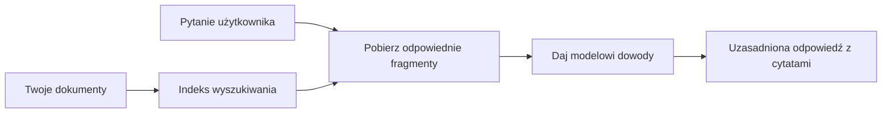

# Naucz AI odpowiadać na pytania na podstawie Twoich dokumentów:
## Seria 1: RAG, Azure kontra alternatywy open-source oraz kiedy fine-tuning ma sens

> Pierwszy artykuł w serii z 2026 roku przypominającej moje tutoriale z 2023 roku dotyczące Azure AI Search + Azure OpenAI w kontekście zadawania pytań do dokumentów.

## 1. Wstęp – powrót do wcześniejszego tutorialu RAG

W 2023 roku pracowałem nad parą tutoriali o nauce ChatGPT odpowiadania na pytania z dokumentów PDF za pomocą Azure AI Search i Azure OpenAI. Napisałem [wersję LangChain](https://techcommunity.microsoft.com/blog/educatordeveloperblog/teach-chatgpt-to-answer-questions-using-azure-ai-search--azure-openai-lang-chain/3969713), a także współautorstwo miałem przy towarzyszącej [wersji Semantic Kernel](https://techcommunity.microsoft.com/blog/educatordeveloperblog/teach-chatgpt-to-answer-questions-using-azure-ai-search--azure-openai-semantic-k/3985395) z [Lee Stottem](https://developer.microsoft.com/en-us/advocates/lee-stott), Principal Cloud Advocate Manager w Microsoft. Wtedy idea „ChatGPT na twoich danych” wciąż była dla wielu deweloperów nowością. Tutoriale korzystały z Azure Blob Storage, Azure AI Search, Azure OpenAI, LangChain, Semantic Kernel oraz wyszukiwania wektorowego w stylu FAISS, aby odpowiadać na pytania z plików PDF.

Tamten wcześniejszy artykuł skupiał się na prostym, ale ważnym przepływie pracy: przesyłasz dokumenty, tworzysz ich indeks, pobierasz relewantne treści i pytasz model o odpowiedź na ich podstawie.

W 2026 roku ekosystem RAG znacząco się rozwinął. Azure AI Search obsługuje teraz nowoczesne wzorce wyszukiwania wektorowego i hybrydowego, Azure OpenAI jest częścią szerszego ekosystemu Microsoft Foundry Models, a nowsze API v1 może używać standardowego klienta OpenAI bez konieczności comiesięcznej zmiany `api-version`. Równocześnie opcje open-source takie jak LangGraph, LlamaIndex, Haystack, Qdrant, Milvus, Weaviate, Chroma, Ollama i vLLM stały się praktycznymi wyborami dla prawdziwych systemów RAG.

Dlatego chciałem wrócić do tego tematu. Pytanie nie brzmi już tylko „Jak zbudować RAG?” Teraz istnieje wiele sposobów jego budowy, a ważniejsze pytanie to „Jaką architekturę wybrać dla mojej sytuacji?”

Jednak podstawowy problem pozostał taki sam.

Model AI nie zna automatycznie Twoich dokumentów. Aby zbudować użyteczny system odpowiadania na pytania dokumentowe, nadal potrzebujesz niezawodnego wyszukiwania, ugruntowania, ewaluacji i operacyjnych przepływów pracy.

Ten artykuł nie jest kolejnym tutorialem „chat z PDF od A do Z”. Chcę rozpocząć tę zaktualizowaną serię od pytania, które teraz mnie bardziej interesuje: kiedy warto wybrać zarządzaną architekturę Azure, kiedy stosować open-sourceowy stos RAG, a kiedy fine-tuning faktycznie ma sens?

To pierwszy artykuł serii o budowaniu systemów AI opartych na dokumentach. W tej pierwszej części skupimy się na decyzjach architektonicznych: dlaczego RAG jest ważne, kiedy przydają się zarządzane usługi Azure, kiedy sens mają alternatywy open source oraz gdzie pasuje fine-tuning.

Po budowaniu i ponownym analizowaniu systemów QA opartych na dokumentach, stałem się mniej zainteresowany tym, który „narzędziowiec” najlepiej wygląda na demo, a bardziej tym, która architektura przetrwa realnych użytkowników, zmieniające się dokumenty, uprawnienia, awarie i utrzymanie.

## 2. Dlaczego Twoje AI potrzebuje systemu wyszukiwania

Duże modele językowe są szkolone na szerokich, publicznych i licencjonowanych danych. Mogą znać dużo ogólnych tematów, ale nie znają automatycznie Twoich prywatnych plików PDF, wewnętrznych zasad, procedur korporacyjnych, archiwów badań, materiałów do nauki, notatek z obsługi klienta czy niedawno zaktualizowanej dokumentacji.

Prosty sposób patrzenia na RAG jest taki: zamiast oczekiwać, że model zapamięta każdy dokument, dajemy mu system wyszukiwania. Gdy użytkownik zada pytanie, system najpierw znajduje najbardziej relewantne fragmenty informacji, a potem podaje je modelowi jako kontekst.

To ma znaczenie, ponieważ wiele źródeł wiedzy ze świata realnego jest prywatnych, ciągle zmieniających się, wrażliwych na uprawnienia, przechowywanych w różnych systemach, napisanych w wielu formatach oraz zbyt dużych, by wkleić je bezpośrednio do zapytania (promptu).

Na przykład, jeśli szkoła, firma lub zespół badawczy ma 10 000 wewnętrznych dokumentów, model nie może odpowiedzieć wiarygodnie na ich podstawie, chyba że system pobierze właściwe fragmenty w odpowiednim czasie.

To naturalnie prowadzi do powszechnego pytania:

Dlaczego nie po prostu fine-tuning modelu?

Fine-tuning może być użyteczny, ale zazwyczaj nie jest to pierwsze właściwe narzędzie dla wiedzy dokumentowej. Jeśli wiedza często się zmienia, jeśli cytowania są istotne albo jeśli ważne są uprawnienia dostępu, RAG zwykle jest lepszym punktem startowym. Fine-tuning lepiej nadaje się do nauki zachowania, stylu, formatu wyjściowego i wzorców zadań.

## 3. Architektura RAG w praktyce

Wyobraź sobie, że budujesz asystenta AI dla szkoły. Asystent musi odpowiadać na pytania z dokumentów PDF dotyczących zasad, przewodników kursów, wewnętrznych strony FAQ oraz niedawno zaktualizowanych ogłoszeń.

Jeśli student zapyta: „Czy mogę użyć generatywnej AI do mojego końcowego zadania?”, system nie powinien odpowiadać na podstawie ogólnej pamięci modelu. Powinien najpierw znaleźć odpowiednią politykę szkoły, pobrać fragment o używaniu AI, a następnie poprosić model o odpowiedź na podstawie tego dowodu.

To jest praktyka RAG.

Na wysokim poziomie można myśleć o przepływie tak:

Szczegóły mogą być bardziej zaawansowane, ale podstawowa idea jest prosta: model nie odpowiada sam. Odpowiada z pobranym dowodem.

Najpierw dokumenty są wczytywane z systemów przechowywania, takich jak Azure Blob Storage, SharePoint, GitHub czy wewnętrzny CMS. Następnie system parsuje je na tekst, jednocześnie zachowując użyteczną strukturę, taką jak nagłówki, numery stron, tabele, sekcje oraz lokalizacje źródłowe.

Kolejno zawartość jest dzielona na fragmenty (chunks). Ten krok wydaje się prosty, ale jest jedną z najważniejszych części systemu. Jeśli fragment jest zbyt mały, może utracić otaczający kontekst. Jeśli jest zbyt duży, może obejmować niepowiązane informacje i zmniejszać precyzję wyszukiwania.

Po dzieleniu na fragmenty, system tworzy osadzenia (embeddings) i zapisuje je w indeksie wyszukiwalnym wraz z oryginalnym tekstem i metadanymi takimi jak nazwa pliku, numer strony, uprawnienia, wersja dokumentu oraz źródłowy URL.

Kiedy użytkownik zada pytanie, system pobiera kandydackie fragmenty korzystając z wyszukiwania słów kluczowych, wyszukiwania wektorowego lub hybrydowego. Reranker może następnie przearanżować te fragmenty tak, by najważniejsze dowody znalazły się na górze.

Na koniec model otrzymuje pytanie i pobrane dowody. Odpowiedź powinna być ugruntowana w tym dowodzie i zawierać cytowania, aby użytkownik mógł sprawdzić źródło.

Ważne jest, że RAG to nie tylko „włóż pliki PDF do bazy wektorowej”. Jakość odpowiedzi zależy od całego przepływu: parsowania, dzielenia, wyszukiwania, ponownego rankingu, promptowania, cytowania i ewaluacji.

Dlatego struktura dokumentu ma znaczenie. W PDF nagłówek, tabela, przypis dolny lub granica strony mogą zmienić znaczenie fragmentu. W Azure Document Layout skill wykorzystuje możliwości układu Azure Document Intelligence, by tworzyć strukturę, co poprawia jakość dzielenia i wyszukiwania dla systemów RAG.

## 4. Co się zmieniło od 2023?

Tutorial z 2023 był dobrym punktem wyjścia na tamte czasy:

- Azure Blob Storage przechowywał pliki PDF.
- Azure AI Search indeksował treść.
- LangChain łączył wyszukiwanie z Azure OpenAI.
- FAISS działał jako prosty lokalny magazyn wektorowy.
- Przykład używał `gpt-35-turbo` i `text-embedding-ada-002`.

W 2026 nowoczesna wersja powinna odzwierciedlać kilka zmian.

Po pierwsze, wyszukiwanie dojrzało. W 2023 wiele demonstracji używało prostego wyszukiwania podobieństw wektorowych. Dziś hybrydowe wyszukiwanie jest często domyślnym punktem startowym dla poważnego QA dokumentów. Azure AI Search obsługuje wyszukiwanie hybrydowe, łącząc zapytania słów kluczowych i wektorowe w jednym żądaniu i scalając wyniki za pomocą Reciprocal Rank Fusion. Semantic ranker może następnie ponownie posortować tekstową stronę wyników pełnotekstowych, wektorowych i hybrydowych.

Po drugie, ingestowanie jest bardziej zaawansowane. Zamiast ręcznie dzielić każdy dokument w kodzie aplikacji, Azure AI Search oferuje zintegrowaną wektoryzację do dzielenia, embeddingu i wektoryzacji w czasie zapytania. Dla PDF i obciążenia opartego na dokumentach Document Layout skill może zachować więcej struktury niż ustalone rozmiary fragmentów.

Po trzecie, orkiestracja ma większe znaczenie. Trudne często nie jest samo wywołanie API LLM. Trudne jest radzenie sobie z awariami, ponowieniami, nieaktualnym wyszukiwaniem, jakością fragmentów, długotrwałymi przepływami, przeglądem ludzkim i ewaluacją na dużą skalę. Tutaj narzędzia zorientowane na przepływy pracy, takie jak LangGraph, LlamaIndex workflows, Haystack pipelines oraz platformowe narzędzia do ewaluacji i obserwowalności stają się ważniejsze niż pojedynczy liniowy łańcuch.

Po czwarte, ewaluacja nie jest już opcjonalna. Demo może imponować jednym pytaniem. System produkcyjny potrzebuje zestawów testowych, testów regresji, metryk wyszukiwania, sprawdzania ugruntowania i monitoringu. Bez ewaluacji trudno stwierdzić, czy system się poprawia, czy tylko się zmienia.

## 5. Wybór między Azure a open-source’owym stackiem RAG

Nie uważam, że użytecznym pytaniem jest „Czy Azure jest lepszy od open source?” albo „Czy open source jest lepszy od Azure?”

Użyteczne pytanie brzmi: jaki system budujesz, kto nim będzie zarządzał, jakie masz ograniczenia oraz jakie tryby awarii są nie do przyjęcia?

Kiedy zacząłem budować przykłady QA dokumentowego, myślałem głównie o działaniu wyszukiwania. Czy mogę przesłać PDF-y, wyszukać w nich i wygenerować odpowiedź? To było rozsądne podejście.

Po pracy z bardziej realistycznymi AI workflow moja ocena się zmieniła. Teraz patrzę na cztery rzeczy przed wyborem stosu RAG:

- tożsamość i uprawnienia
- jakość wyszukiwania
- niezawodność przepływu pracy
- własność operacyjna

Te cztery obszary mówią więcej niż sam benchmark modelu.

Architektury oparte na Azure zazwyczaj mają sens, gdy trudna jest integracja korporacyjna. Jeśli zespół już polega na Microsoft Entra ID, Microsoft 365, Azure Storage, prywatnej sieci, RBAC i monitoringu Azure, to Azure AI Search i Azure OpenAI mogą znacznie zredukować złożoność operacyjną. W takim środowisku Azure to nie tylko API modelu. Wartością jest cały system wokół: tożsamość, zarządzanie, zarządzane wyszukiwanie, integracja zabezpieczeń, wsparcie i dobrze znane operacje.

Architektury open source zazwyczaj mają sens, gdy ważna jest elastyczność. Jeśli zespół potrzebuje lokalnego inferencji, przenośności do chmury, niestandardowej ścieżki wyszukiwania, specjalistycznego ponownego rankingu lub bezpośredniej kontroli nad bazą wektorową i warstwą serwujących modele, stos open source może być lepszym wyborem. Kosztem jest to, że zespół musi samodzielnie dbać o niezawodność: kopie zapasowe, skalowanie, opóźnienia, migracje, monitoring i bezpieczeństwo.

W praktyce wiele produkcyjnych systemów AI nie jest wyłącznie natywnie chmurowych ani czysto open source. Są to często systemy hybrydowe, które balansują prostotę operacyjną, przenośność, zarządzanie i inżynierską elastyczność.

Na przykład nie zdziwiłbym się, gdyby system wykorzystywał Azure OpenAI do dostępu do modeli, LangGraph do orkiestracji przepływu, Azure do hostingu wdrożenia i open source’ową bazę wektorową do konkretnego wymagania wyszukiwania. To nie jest architektoniczna niespójność. To świadomy wybór odpowiedniego poziomu zarządzanej usługi i kontroli inżynierskiej dla każdej części systemu.

Lubię hybrydowe architektury, gdy zarządzana platforma rozwiązuje ważne problemy enterprise, a komponenty open source dają zespołowi elastyczność tam, gdzie to faktycznie ma znaczenie.

## 6. Praktyczny przewodnik po decyzjach

Oto tabela decyzji, której użyłbym z zespołem przed wyborem stosu RAG:

| Obszar decyzji | Stos zarządzany Azure jest silniejszy, gdy... | Stos open source jest silniejszy, gdy... |
| --- | --- | --- |
| Tożsamość i dostęp | Entra ID, RBAC, zarządzana tożsamość i uprawnienia korporacyjne są kluczowe | dominują niestandardowe uwierzytelnianie, tożsamość spoza Microsoft lub logika dostępu specyficzna dla aplikacji |
| Operacje | zespół chce zarządzanej infrastruktury, wsparcia, SLA i prostszego wdrożenia | zespół potrafi obsługiwać bazy wektorowe, serwisowanie modeli, kopie zapasowe i skalowanie |
| Wyszukiwanie | hybrydowe wyszukiwanie, ranking semantyczny, filtry i wyszukiwanie w metadanych pokrywają większość potrzeb | zespół potrzebuje niestandardowego wyszukiwania, specjalistycznego ponownego rankingu lub eksperymentalnego indeksowania |
| Przenośność | akceptowalne lub preferowane powiązanie z ekosystemem Azure | unikanie uzależnienia od chmury jest twardym wymogiem |
| Inferencja | znaczące są zarządzanie Azure OpenAI, sieć i kontrola korporacyjna | wymagana jest inferencja lokalna, modele niestandardowe lub własny hosting serwisów |
| Koszt | ważniejsze jest zmniejszenie wysiłku inżynierskiego i operacyjnego niż tunning infrastruktury | skala jest na tyle duża, że warto zoptymalizować infrastrukturę |
| Eksperymentowanie | większą wagę ma stabilność i integracja korporacyjna niż częste zmiany komponentów | zespół szybko iteruje na agentach, narzędziach, pamięci i przepływach wyszukiwania |

Moja zasada jest prosta:

- Zacznij od Azure, gdy głównym problemem są integracja korporacyjna, bezpieczeństwo i prostota operacyjna.
- Zacznij od open source, gdy kluczowa jest przenośność, dostosowanie lub lokalna kontrola.
- Używaj stosu hybrydowego, gdy oba czynniki są ważne.

Dlatego też nie rozpocząłbym w 2026 serii RAG od kodu. Kod jest ważny, ale wybór architektury jest przed implementacją. Proste demo może ukryć najtrudniejsze wybory. Dobry system RAG czyni te wybory jawne.

## 7. Gdzie pasuje fine-tuning

Fine-tuning jest często wymieniany razem z RAG, ale uważam, że ważne jest rozdzielić te dwa.

RAG jest zwykle lepszym wyborem, gdy system potrzebuje świeżej, prywatnej, wrażliwej na uprawnienia lub ugruntowanej w źródłach wiedzy. Jeśli odpowiedź powinna cytować dokumenty, odzwierciedlać niedawne zmiany lub respektować zasady dostępu specyficzne dla użytkownika, wyszukiwanie powinno być częścią architektury.

Fine-tuning jest bardziej przydatny, gdy wiedza nie jest głównym problemem. Może pomóc, gdy chcesz, by model stosował konkretny format wyjścia, pasował do stylu odpowiedzi specyficznego dla domeny, wykonywał stabilne zadanie bardziej konsekwentnie lub zmniejszył ilość instrukcji potrzebnych w każdym promptu.
W praktyce oba mogą działać razem. Asystent wsparcia może używać RAG do wyszukiwania najnowszej polityki, podczas gdy model dostrojony uczy się preferowanej przez firmę struktury odpowiedzi i tonu.

Błędem jest traktowanie fine-tuningu jako zamiennika dla magazynu dokumentów. Nie usuwa on potrzeby wyszukiwania, gdy system musi odpowiadać na podstawie świeżych, prywatnych lub wrażliwych danych wymagających uprawnień.

## 8. Dokąd dalej zmierza ta seria

Ten artykuł to warstwa podejmowania decyzji. Przed napisaniem kodu chciałem wyraźnie określić kompromisy: RAG kontra fine-tuning, Azure kontra open source, usługi zarządzane kontra kontrola operacyjna.

Zanim przejdę do implementacji, chcę tutaj zostawić jedną uwagę: w wielu przedsiębiorczych systemach AI model jest tylko jednym komponentem. Jakość wyszukiwania, orkiestracja, ocena, uprawnienia i niezawodność operacyjna często decydują o tym, czy system odniesie sukces poza etapem demonstracyjnym.

W kolejnych częściach tej serii planuję zagłębić się w praktyczną stronę systemów AI opartych na dokumentach: jak zbudować architekturę opartą na Azure, jak w praktyce wypadają alternatywy open source oraz jak oceniać, czy system RAG faktycznie działa.

Kolejność może ulec zmianie w miarę rozwoju serii, ale cel pozostanie ten sam: wyjść poza prostą demonstrację i pokazać, jak myśleć o systemach RAG, które można utrzymywać, oceniać i obsługiwać.

## 9. Odnośniki i zasoby

Oryginalne samouczki:

- [Teach ChatGPT to Answer Questions: Using Azure AI Search & Azure OpenAI (Lang Chain)](https://techcommunity.microsoft.com/blog/educatordeveloperblog/teach-chatgpt-to-answer-questions-using-azure-ai-search--azure-openai-lang-chain/3969713)
- [Teach ChatGPT to Answer Questions: Using Azure AI Search & Azure OpenAI (Semantic Kernel)](https://techcommunity.microsoft.com/blog/educatordeveloperblog/teach-chatgpt-to-answer-questions-using-azure-ai-search--azure-openai-semantic-k/3985395)

Azure:

- [Azure AI Search REST API versions](https://learn.microsoft.com/en-us/rest/api/searchservice/search-service-api-versions)
- [Hybrid search in Azure AI Search](https://learn.microsoft.com/en-us/azure/search/hybrid-search-how-to-query)
- [Integrated vectorization in Azure AI Search](https://learn.microsoft.com/en-us/azure/search/vector-search-integrated-vectorization)
- [Document Layout skill in Azure AI Search](https://learn.microsoft.com/en-us/azure/search/cognitive-search-skill-document-intelligence-layout)
- [Chunk and vectorize by document layout](https://learn.microsoft.com/en-us/azure/search/search-how-to-semantic-chunking)
- [Semantic ranking in Azure AI Search](https://learn.microsoft.com/en-us/azure/search/semantic-search-overview)
- [Azure OpenAI / Microsoft Foundry API version lifecycle](https://learn.microsoft.com/en-us/azure/foundry/openai/api-version-lifecycle)
- [Foundry Models sold by Azure](https://learn.microsoft.com/en-us/azure/foundry/foundry-models/concepts/models-sold-directly-by-azure)
- [Microsoft Foundry fine-tuning considerations](https://learn.microsoft.com/en-us/azure/foundry/openai/concepts/fine-tuning-considerations)
- [Microsoft Foundry observability](https://learn.microsoft.com/en-us/azure/foundry/concepts/observability)
- [Run evaluations in Microsoft Foundry](https://learn.microsoft.com/en-us/azure/foundry/how-to/evaluate-generative-ai-app)

Open-source:

- [LangGraph documentation](https://docs.langchain.com/oss/python/langgraph/overview)
- [LlamaIndex documentation](https://developers.llamaindex.ai/python/framework/)
- [Haystack documentation](https://docs.haystack.deepset.ai/)
- [Qdrant documentation](https://qdrant.tech/documentation/overview/)
- [Milvus documentation](https://milvus.io/docs/overview.md)
- [Weaviate documentation](https://docs.weaviate.io/weaviate/current/)
- [Chroma documentation](https://docs.trychroma.com/docs/overview/introduction)
- [Ollama embeddings](https://docs.ollama.com/capabilities/embeddings)
- [vLLM OpenAI-compatible server](https://docs.vllm.ai/en/latest/serving/openai_compatible_server.html)
- [BGE embedding models](https://huggingface.co/BAAI/bge-large-en-v1.5)
- [E5 embedding models](https://huggingface.co/intfloat/e5-large-v2)
- [Instructor embedding models](https://huggingface.co/hkunlp/instructor-large)

---

<!-- CO-OP TRANSLATOR DISCLAIMER START -->
**Zastrzeżenie**:
Niniejszy dokument został przetłumaczony za pomocą usługi tłumaczenia AI [Co-op Translator](https://github.com/Azure/co-op-translator). Choć dążymy do dokładności, prosimy pamiętać, że automatyczne tłumaczenia mogą zawierać błędy lub niedokładności. Oryginalny dokument w jego języku źródłowym należy uznawać za autorytatywne źródło. W przypadku informacji krytycznych zalecane jest skorzystanie z profesjonalnego tłumaczenia wykonanego przez człowieka. Nie ponosimy odpowiedzialności za jakiekolwiek nieporozumienia lub błędne interpretacje wynikające z użycia tego tłumaczenia.
<!-- CO-OP TRANSLATOR DISCLAIMER END -->