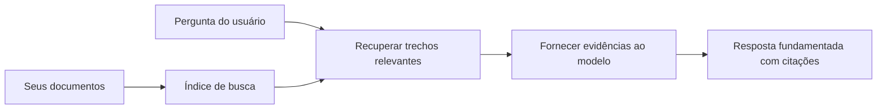

# Ensine a IA a Responder Perguntas com Base em Seus Documentos:
## Série 1: RAG, Azure vs Alternativas Open-Source, e Quando o Fine-Tuning Faz Sentido

> O primeiro artigo de uma série de 2026 revisitando meus tutoriais de perguntas e respostas com documentos Azure AI Search + Azure OpenAI de 2023.

Navegação da série: [Início do repositório](../README.md) | Próximo: [Série 2 - Construir um Sistema RAG Open-Source Local de Ponta a Ponta](./series-2-open-source-rag-end-to-end.md)

## 1. Introdução - Revisando um Tutorial RAG Anterior

Em 2023, trabalhei em um par de tutoriais sobre ensinar o ChatGPT a responder perguntas a partir de documentos PDF usando Azure AI Search e Azure OpenAI. Eu escrevi a [versão LangChain](https://techcommunity.microsoft.com/blog/educatordeveloperblog/teach-chatgpt-to-answer-questions-using-azure-ai-search--azure-openai-lang-chain/3969713), e também co-escrevi a versão acompanhante [Semantic Kernel](https://techcommunity.microsoft.com/blog/educatordeveloperblog/teach-chatgpt-to-answer-questions-using-azure-ai-search--azure-openai-semantic-k/3985395) com [Lee Stott](https://developer.microsoft.com/en-us/advocates/lee-stott), Gerente Principal de Advocacia em Nuvem da Microsoft. Na época, a ideia de "ChatGPT nos seus dados" ainda parecia nova para muitos desenvolvedores. Os tutoriais usaram Azure Blob Storage, Azure AI Search, Azure OpenAI, LangChain, Semantic Kernel e recuperação vetorial estilo FAISS para responder perguntas de arquivos PDF.

Aquele artigo anterior focou em um fluxo de trabalho simples, mas importante: fazer upload dos documentos, indexá-los, recuperar conteúdo relevante e pedir ao modelo para responder com base nesse conteúdo.

Em 2026, o ecossistema RAG cresceu significativamente. O Azure AI Search agora suporta padrões modernos de busca vetorial e híbrida, o Azure OpenAI faz parte do ecossistema mais amplo Microsoft Foundry Models, e a nova API v1 pode usar o cliente OpenAI padrão sem precisar de mudanças mensais na `api-version`. Ao mesmo tempo, opções open-source como LangGraph, LlamaIndex, Haystack, Qdrant, Milvus, Weaviate, Chroma, Ollama e vLLM se tornaram escolhas práticas para sistemas RAG reais.

Por isso quis revisitar este tópico. A pergunta não é mais apenas "Como construo RAG?" Hoje há muitas maneiras de construí-lo, e a pergunta mais importante é "Qual arquitetura devo escolher para minha situação?"

Mas o problema fundamental não mudou.

Um modelo de IA não conhece automaticamente seus documentos. Para construir um sistema útil de perguntas e respostas com documentos, você ainda precisa de recuperação confiável, fundamentação, avaliação e fluxos operacionais.

Este artigo não é outro tutorial de ponta a ponta "converse com PDF". Quero começar esta série atualizada com a pergunta que agora me importa mais: quando escolher uma arquitetura gerenciada Azure, quando escolher uma pilha RAG open-source, e quando o fine-tuning realmente faz sentido?

Este é o primeiro artigo de uma série sobre construir sistemas de IA fundamentados em documentos. Nesta primeira parte, focaremos nas decisões de arquitetura: por que RAG importa, quando serviços gerenciados baseados em Azure são úteis, quando alternativas open-source fazem sentido, e onde o fine-tuning se encaixa.

Depois de construir e revisitar sistemas de Q&A com documentos, me tornei menos interessado em qual ferramenta tem melhor aparência em uma demo e mais interessado em qual arquitetura sobreviverá a usuários reais, documentos que mudam, permissões, falhas e manutenção.

## 2. Por Que Sua IA Precisa de um Sistema de Busca

Modelos de linguagem grandes são treinados em dados públicos e licenciados amplos. Eles podem saber muito sobre tópicos gerais, mas não conhecem automaticamente seus PDFs privados, políticas internas, procedimentos empresariais, arquivos de pesquisa, materiais de sala de aula, notas de suporte ao cliente ou documentação recentemente atualizada.

Uma forma simples de pensar sobre RAG é esta: em vez de esperar que o modelo lembre de todos os documentos, damos a ele um sistema de busca. Quando um usuário faz uma pergunta, o sistema primeiro encontra os pedaços de informação mais relevantes, depois passa esses pedaços para o modelo como contexto.

Isso importa porque muitas fontes reais de conhecimento são privadas, constantemente mudando, sensíveis a permissões, armazenadas em vários sistemas, escritas em muitos formatos e grandes demais para inserir diretamente em um prompt.

Por exemplo, se uma escola, empresa ou time de pesquisa tem 10.000 documentos internos, o modelo não pode responder com confiança a partir desses documentos a menos que o sistema recupere as partes certas no momento certo.

Isso naturalmente leva a uma pergunta comum:

Por que não simplesmente fazer fine-tuning no modelo?

Fine-tuning pode ser útil, mas geralmente não é a primeira ferramenta certa para conhecimento de documentos. Se o conhecimento muda com frequência, se citações importam, ou se permissões de acesso são importantes, RAG costuma ser o melhor ponto de partida. Fine-tuning é melhor para ensinar comportamento, estilo, formato de saída e padrões de tarefas.

## 3. Arquitetura RAG na Prática

Imagine que você está construindo um assistente de IA para uma escola. O assistente precisa responder perguntas de PDFs de políticas, guias de curso, páginas internas de FAQ e anúncios recentemente atualizados.

Se um estudante perguntar, "Posso usar IA generativa para meu trabalho final?", o sistema não deve responder a partir da memória geral do modelo. Primeiro deve encontrar a política escolar relevante, recuperar a seção sobre uso de IA e então pedir ao modelo que responda usando essa evidência.

Isso é RAG na prática.

Em alto nível, você pode pensar no fluxo assim:

Os detalhes podem se tornar mais sofisticados, mas a ideia básica é simples: o modelo não responde sozinho. Ele responde com evidências recuperadas.

Primeiro, os documentos são ingeridos de sistemas de armazenamento como Azure Blob Storage, SharePoint, GitHub ou um CMS interno. Depois o sistema os analisa em texto enquanto preserva estruturas úteis como títulos, números de página, tabelas, seções e locais da fonte.

Em seguida, o conteúdo é dividido em pedaços. Esta etapa parece simples, mas é uma das partes mais importantes do sistema. Se um pedaço for muito pequeno, pode perder o contexto ao redor. Se for muito grande, pode incluir informações não relacionadas e tornar a recuperação menos precisa.

Depois da chunking, o sistema cria embeddings e os armazena em um índice pesquisável junto com o texto original e metadados como nome do arquivo, número da página, permissões, versão do documento e URL da fonte.

Quando o usuário faz uma pergunta, o sistema recupera chunks candidatos usando busca por palavra-chave, busca vetorial ou busca híbrida. Um reranker pode então reordenar esses pedaços para que as evidências mais úteis fiquem no topo.

Finalmente, o modelo recebe a pergunta e as evidências recuperadas. A resposta deve estar fundamentada nessas evidências e retornar citações para que o usuário possa verificar a fonte.

O ponto importante é que RAG não é apenas "colocar PDFs em um banco vetorial". A qualidade da resposta depende do fluxo completo: análise, chunking, recuperação, reranking, prompting, citação e avaliação.

Por isso a estrutura do documento importa. Em um PDF, um título, tabela, nota de rodapé ou limite de página pode alterar o significado de um trecho. No Azure, a skill Document Layout usa capacidades de layout do Azure Document Intelligence para produzir uma saída consciente da estrutura, que pode melhorar a qualidade do chunking e da recuperação para sistemas RAG.

## 4. O Que Mudou Desde 2023?

O tutorial de 2023 foi um bom ponto de partida para seu momento:

- Azure Blob Storage armazenava arquivos PDF.
- Azure AI Search indexava conteúdo.
- LangChain conectava a recuperação ao Azure OpenAI.
- FAISS funcionou como uma loja vetorial local simples.
- O exemplo usou `gpt-35-turbo` e `text-embedding-ada-002`.

Em 2026, uma versão moderna deve refletir várias mudanças.

Primeiro, a recuperação amadureceu. Em 2023, muitas demos usavam busca simples por similaridade vetorial. Hoje, a recuperação híbrida é frequentemente o ponto de partida padrão para Q&A sério com documentos. O Azure AI Search suporta busca híbrida combinando queries por palavra-chave e vetor em uma única requisição, mesclando os resultados com Reciprocal Rank Fusion. O rankeador semântico pode reordenar os resultados texto, vetor e híbridos.

Segundo, a ingestão está mais sofisticada. Em vez de dividir manualmente cada documento em código de aplicação, o Azure AI Search suporta vetorização integrada para chunking, embedding e vetorização em tempo de consulta. Para PDFs e cargas pesadas de documentos, a skill Document Layout pode preservar mais estrutura do que chunks de tamanho fixo.

Terceiro, a orquestração importa mais. O desafio não é o chamado API ao LLM em si. É lidar com falhas, tentativas, recuperação de dados desatualizados, qualidade dos chunks, workflows de longa duração, revisão humana e avaliação em escala. É aí que ferramentas orientadas a fluxo como LangGraph, fluxos de trabalho LlamaIndex, pipelines Haystack e ferramentas de avaliação e observabilidade em plataforma se tornam mais relevantes do que uma cadeia linear única.

Quarto, avaliação não é mais opcional. Uma demo pode impressionar com uma pergunta. Um sistema em produção precisa de conjuntos de teste, checagens de regressão, métricas de recuperação, checagens de fundamentação e monitoramento. Sem avaliação, é difícil saber se o sistema está melhorando ou apenas mudando.

## 5. Escolhendo Entre Pilhas RAG Azure e Open-Source

Não acho útil a pergunta "O Azure é melhor que open source?" ou "Open source é melhor que Azure?"

A pergunta útil é: que tipo de sistema você está construindo, quem vai operá-lo, quais restrições você tem e que modos de falha são inaceitáveis?

Quando comecei a construir exemplos de Q&A com documentos, pensei principalmente se a recuperação funcionava. Eu poderia enviar PDFs, buscá-los e gerar uma resposta? Isso era um ponto de partida razoável.

Depois de trabalhar workflows de IA mais realistas, minha avaliação mudou. Agora olho para quatro coisas antes de escolher uma pilha RAG:

- identidade e permissões
- qualidade da recuperação
- confiabilidade do fluxo de trabalho
- propriedade operacional

Essas quatro áreas dizem muito mais do que um benchmark de modelo sozinho.

Arquiteturas baseadas em Azure geralmente fazem sentido quando a integração corporativa é a parte difícil. Se um time já depende de Microsoft Entra ID, Microsoft 365, Azure Storage, rede privada, RBAC e monitoramento Azure, Azure AI Search e Azure OpenAI podem reduzir muita complexidade operacional. Nesse ambiente, Azure não é só uma API de modelo. O valor está no sistema que o cerca: identidade, governança, busca gerenciada, integração de segurança, suporte e operações familiares.

Arquiteturas open-source geralmente fazem sentido quando a flexibilidade é a parte difícil. Se o time precisa de inferência local, portabilidade na nuvem, pipeline de recuperação customizado, reranking especializado ou controle direto sobre o banco vetorial e camada de serviço do modelo, uma pilha open-source pode ser a melhor escolha. A troca é que o time assume mais trabalho de confiabilidade: backups, escalabilidade, latência, migrações, monitoramento e segurança.

Na prática, muitos sistemas de IA em produção não são puramente cloud-native nem totalmente open-source. São frequentemente sistemas híbridos que equilibram simplicidade operacional, portabilidade, governança e flexibilidade de engenharia.

Por exemplo, eu não ficaria surpreso em ver um sistema usar Azure OpenAI para acesso ao modelo, LangGraph para orquestração do workflow, hospedagem Azure para deployment e um banco de dados vetorial open-source para uma necessidade específica de recuperação. Isso não é inconsistência arquitetural. É escolher o nível certo de serviço gerenciado e controle de engenharia para cada parte do sistema.

Gosto de arquiteturas híbridas quando a plataforma gerenciada resolve problemas corporativos importantes, enquanto componentes open-source dão flexibilidade onde realmente importa.

## 6. Um Guia Prático de Decisão

Aqui está a tabela de decisão que eu usaria com um time antes de escolher uma pilha RAG:

| Área de decisão | Pilha gerenciada Azure é mais forte quando... | Pilha open-source é mais forte quando... |
| --- | --- | --- |
| Identidade e acesso | Entra ID, RBAC, identidade gerenciada e permissões corporativas são centrais | autenticação customizada, identidade não Microsoft ou lógica específica de app domina |
| Operações | o time quer infraestrutura gerenciada, suporte, SLAs e onboarding mais simples | o time pode operar bancos vetoriais, serviço de modelo, backups e escalabilidade |
| Recuperação | busca híbrida, rankeamento semântico, filtros e busca por metadados cobrem a maioria das necessidades | o time precisa de recuperação customizada, reranking especializado ou indexação experimental |
| Portabilidade | alinhar-se ao ecossistema Azure é aceitável ou preferível | evitar vendor lock-in de nuvem é um requisito obrigatório |
| Inferência | governança, rede e controles corporativos Azure OpenAI importam | inferência local, modelos customizados ou serviço self-hosted são necessários |
| Custo | reduzir esforço de engenharia e operações importa mais que ajuste de infraestrutura | escala é grande o suficiente para justificar otimização cuidadosa da infraestrutura |
| Experimentação | estabilidade e integração corporativa importam mais que mudar componentes frequentemente | o time está iterando rápido em agentes, ferramentas, memória e workflows de recuperação |

Minha regra prática é simples:

- Comece com Azure quando integração corporativa, segurança e simplicidade operacional forem os principais riscos.
- Comece com open source quando portabilidade, customização ou controle local forem os principais riscos.
- Use uma pilha híbrida quando ambos forem verdade.

É por isso que eu não começaria uma série RAG de 2026 com código primeiro. Código é importante, mas a seleção arquitetural vem antes da implementação. Uma demo simples pode esconder as escolhas mais difíceis. Um bom sistema RAG torna essas escolhas explícitas.

## 7. Onde o Fine-Tuning se Encaixa

Fine-tuning é frequentemente mencionado junto com RAG, mas acho importante separar os dois.

RAG geralmente é a melhor escolha quando o sistema precisa de conhecimento fresco, privado, sensível a permissões ou fundamentado em fontes. Se a resposta precisa citar documentos, refletir atualizações recentes ou respeitar regras de acesso específicas do usuário, a recuperação deve fazer parte da arquitetura.
O fine-tuning é mais útil quando o conhecimento não é o principal problema. Pode ajudar quando você quer que o modelo siga um formato específico de saída, corresponda a um estilo de resposta específico de um domínio, execute uma tarefa estável de forma mais consistente ou reduza a quantidade de instrução necessária em cada prompt.

Na prática, os dois podem funcionar juntos. Um assistente de suporte pode usar RAG para recuperar a política mais recente, enquanto um modelo afinado aprende a estrutura e o tom de resposta preferidos pela empresa.

O erro é tratar o fine-tuning como um substituto para um repositório de documentos. Ele não elimina a necessidade de recuperação quando o sistema deve responder a partir de dados recentes, privados ou sensíveis a permissões.

## 8. Para Onde Esta Série Vai a Seguir

Este artigo é a camada de tomada de decisão. Antes de escrever código, eu queria tornar os trade-offs explícitos: RAG vs fine-tuning, Azure vs código aberto, serviços gerenciados vs controle operacional.

Antes de avançar para a implementação, quero deixar um ponto aqui: em muitos sistemas de IA corporativa, o modelo é apenas um componente. A qualidade da recuperação, orquestração, avaliação, permissões e a confiabilidade operacional são frequentemente o que determina se o sistema tem sucesso além do estágio de demonstração.

Nas próximas partes desta série, pretendo aprofundar o lado prático dos sistemas de IA baseados em documentos: primeiro construindo um fluxo de trabalho RAG local de código aberto, depois reconstruindo o mesmo cenário com Azure AI Search e Azure OpenAI, e então avaliando se o sistema está realmente funcionando.

Eu posso ajustar a ordem conforme a série se desenvolve, mas o objetivo permanecerá o mesmo: ir além de uma simples demonstração e mostrar como pensar sobre sistemas RAG que podem ser mantidos, avaliados e operados.

## 9. Referências e Recursos

Tutoriais originais:

- [Ensine o ChatGPT a responder perguntas: usando Azure AI Search & Azure OpenAI (Lang Chain)](https://techcommunity.microsoft.com/blog/educatordeveloperblog/teach-chatgpt-to-answer-questions-using-azure-ai-search--azure-openai-lang-chain/3969713)
- [Ensine o ChatGPT a responder perguntas: usando Azure AI Search & Azure OpenAI (Semantic Kernel)](https://techcommunity.microsoft.com/blog/educatordeveloperblog/teach-chatgpt-to-answer-questions-using-azure-ai-search--azure-openai-semantic-k/3985395)

Azure:

- [Versões da API REST do Azure AI Search](https://learn.microsoft.com/en-us/rest/api/searchservice/search-service-api-versions)
- [Busca híbrida no Azure AI Search](https://learn.microsoft.com/en-us/azure/search/hybrid-search-how-to-query)
- [Vetorização integrada no Azure AI Search](https://learn.microsoft.com/en-us/azure/search/vector-search-integrated-vectorization)
- [Skill de layout de documento no Azure AI Search](https://learn.microsoft.com/en-us/azure/search/cognitive-search-skill-document-intelligence-layout)
- [Dividir e vetorizar por layout de documento](https://learn.microsoft.com/en-us/azure/search/search-how-to-semantic-chunking)
- [Ranking semântico no Azure AI Search](https://learn.microsoft.com/en-us/azure/search/semantic-search-overview)
- [Ciclo de vida da versão da API Azure OpenAI / Microsoft Foundry](https://learn.microsoft.com/en-us/azure/foundry/openai/api-version-lifecycle)
- [Modelos Foundry vendidos pelo Azure](https://learn.microsoft.com/en-us/azure/foundry/foundry-models/concepts/models-sold-directly-by-azure)
- [Considerações sobre fine-tuning no Microsoft Foundry](https://learn.microsoft.com/en-us/azure/foundry/openai/concepts/fine-tuning-considerations)
- [Observabilidade do Microsoft Foundry](https://learn.microsoft.com/en-us/azure/foundry/concepts/observability)
- [Executar avaliações no Microsoft Foundry](https://learn.microsoft.com/en-us/azure/foundry/how-to/evaluate-generative-ai-app)

Código aberto:

- [Documentação LangGraph](https://docs.langchain.com/oss/python/langgraph/overview)
- [Documentação LlamaIndex](https://developers.llamaindex.ai/python/framework/)
- [Documentação Haystack](https://docs.haystack.deepset.ai/)
- [Documentação Qdrant](https://qdrant.tech/documentation/overview/)
- [Documentação Milvus](https://milvus.io/docs/overview.md)
- [Documentação Weaviate](https://docs.weaviate.io/weaviate/current/)
- [Documentação Chroma](https://docs.trychroma.com/docs/overview/introduction)
- [Embeddings Ollama](https://docs.ollama.com/capabilities/embeddings)
- [Servidor vLLM compatível com OpenAI](https://docs.vllm.ai/en/latest/serving/openai_compatible_server.html)
- [Modelos de embedding BGE](https://huggingface.co/BAAI/bge-large-en-v1.5)
- [Modelos de embedding E5](https://huggingface.co/intfloat/e5-large-v2)
- [Modelos de embedding Instructor](https://huggingface.co/hkunlp/instructor-large)

Próximo: [Série 2 - Construir um Sistema RAG Local de Código Aberto de Ponta a Ponta](./series-2-open-source-rag-end-to-end.md)

---

<!-- CO-OP TRANSLATOR DISCLAIMER START -->
**Aviso Legal**:
Este documento foi traduzido usando o serviço de tradução por IA [Co-op Translator](https://github.com/Azure/co-op-translator). Embora nos esforcemos pela precisão, por favor, esteja ciente de que traduções automatizadas podem conter erros ou imprecisões. O documento original em seu idioma nativo deve ser considerado a fonte autorizada. Para informações críticas, recomenda-se tradução profissional humana. Não nos responsabilizamos por quaisquer mal-entendidos ou interpretações incorretas decorrentes do uso desta tradução.
<!-- CO-OP TRANSLATOR DISCLAIMER END -->