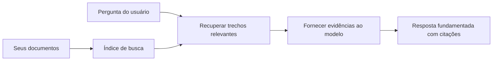

# Ensine a IA a Responder Perguntas com Base em Seus Documentos:
## Série 1: RAG, Azure vs Alternativas Open-Source e Quando o Fine-Tuning Faz Sentido

> O primeiro artigo de uma série de 2026 revisitando meus tutoriais de 2023 sobre Azure AI Search + Azure OpenAI para QA de documentos.

## 1. Introdução - Revisando um Tutorial Anterior de RAG

Em 2023, trabalhei em um par de tutoriais sobre como ensinar o ChatGPT a responder perguntas a partir de documentos PDF usando Azure AI Search e Azure OpenAI. Eu escrevi a [versão LangChain](https://techcommunity.microsoft.com/blog/educatordeveloperblog/teach-chatgpt-to-answer-questions-using-azure-ai-search--azure-openai-lang-chain/3969713), e também co-escrevi a versão complementar [Semantic Kernel](https://techcommunity.microsoft.com/blog/educatordeveloperblog/teach-chatgpt-to-answer-questions-using-azure-ai-search--azure-openai-semantic-k/3985395) com [Lee Stott](https://developer.microsoft.com/en-us/advocates/lee-stott), um Principal Cloud Advocate Manager na Microsoft. Na época, a ideia de "ChatGPT nos seus dados" ainda era nova para muitos desenvolvedores. Os tutoriais usavam Azure Blob Storage, Azure AI Search, Azure OpenAI, LangChain, Semantic Kernel, e recuperação vetorial estilo FAISS para responder perguntas de arquivos PDF.

Aquele artigo anterior focava em um fluxo simples, mas importante: enviar documentos, indexá-los, recuperar conteúdo relevante e pedir a um modelo para responder com base nesse conteúdo.

Em 2026, o ecossistema RAG cresceu significativamente. O Azure AI Search agora suporta padrões modernos de recuperação vetorial e híbrida, o Azure OpenAI é parte do mais amplo ecossistema Microsoft Foundry Models, e a nova API v1 pode usar o cliente padrão OpenAI sem exigir mudanças mensais no `api-version`. Ao mesmo tempo, opções open-source como LangGraph, LlamaIndex, Haystack, Qdrant, Milvus, Weaviate, Chroma, Ollama e vLLM tornaram-se escolhas práticas para sistemas RAG reais.

Por isso quis revisitar este tópico. A questão não é mais só "Como construir RAG?" Agora há muitas maneiras de construí-lo, e a questão mais importante é "Qual arquitetura devo escolher para minha situação?"

Mas o problema central não mudou.

Um modelo de IA não conhece automaticamente seus documentos. Para construir um sistema útil de perguntas e respostas com documentos, você ainda precisa de fluxos confiáveis de recuperação, fundamentação, avaliação e operação.

Este artigo não é outro tutorial completo de "chat com PDF". Quero começar esta série atualizada com a pergunta que agora me interessa mais: quando escolher uma arquitetura gerenciada Azure, quando optar por uma pilha RAG open-source, e quando fine-tuning realmente faz sentido?

Este é o primeiro artigo de uma série sobre como construir sistemas de IA fundamentados em documentos. Nesta primeira parte, focaremos nas decisões arquitetônicas: por que RAG importa, quando serviços gerenciados baseados no Azure são úteis, quando alternativas open-source fazem sentido e onde o fine-tuning se encaixa.

Depois de construir e revisitar sistemas de QA de documentos, me interessei menos em qual ferramenta fica melhor numa demonstração e mais em qual arquitetura sobrevive a usuários reais, documentos mutáveis, permissões, falhas e manutenção.

## 2. Por Que Sua IA Precisa de um Sistema de Busca

Modelos de linguagem grandes são treinados com dados públicos e licenciados amplos. Eles podem saber muito sobre tópicos gerais, mas não conhecem automaticamente seus PDFs privados, políticas internas, procedimentos empresariais, arquivos de pesquisa, materiais de sala de aula, notas de suporte ao cliente ou documentação atualizada recentemente.

Uma forma simples de entender RAG é esta: ao invés de esperar que o modelo memorize cada documento, damos a ele um sistema de busca. Quando um usuário faz uma pergunta, o sistema primeiro encontra as informações mais relevantes, depois fornece essas partes para o modelo como contexto.

Isso importa porque muitas fontes reais de conhecimento são privadas, constantemente mutantes, sensíveis a permissões, armazenadas em múltiplos sistemas, escritas em vários formatos e grandes demais para colar diretamente em um prompt.

Por exemplo, se uma escola, empresa ou equipe de pesquisa tem 10.000 documentos internos, o modelo não pode responder confiavelmente desses documentos a menos que o sistema recupere as partes certas no momento certo.

Isso naturalmente leva a uma pergunta comum:

Por que não apenas fazer fine-tuning no modelo?

Fine-tuning pode ser útil, mas normalmente não é a primeira ferramenta certa para conhecimento em documentos. Se o conhecimento muda frequentemente, se as citações importam, ou se as permissões de acesso importam, o RAG geralmente é o melhor ponto de partida. Fine-tuning é mais adequado para ensinar comportamento, estilo, formato de saída e padrões de tarefa.

## 3. Arquitetura RAG na Prática

Imagine que você está construindo um assistente de IA para uma escola. O assistente precisa responder perguntas a partir de PDFs de políticas, guias de curso, páginas internas de FAQ e anúncios atualizados recentemente.

Se um aluno perguntar, "Posso usar IA generativa para meu trabalho final?", o sistema não deve responder a partir da memória geral do modelo. Deve primeiro encontrar a política escolar relevante, recuperar a seção sobre o uso de IA e então pedir ao modelo para responder usando essa evidência.

Isso é RAG na prática.

Em um nível alto, você pode pensar no fluxo assim:

  
Os detalhes podem ficar mais sofisticados, mas a ideia básica é simples: o modelo não responde sozinho. Ele responde com evidência recuperada.

Primeiro, os documentos são ingeridos de sistemas de armazenamento como Azure Blob Storage, SharePoint, GitHub ou um CMS interno. Depois o sistema os converte em texto preservando estruturas úteis como cabeçalhos, números de página, tabelas, seções e localizações da fonte.

Em seguida, o conteúdo é dividido em pedaços. Essa etapa parece simples, mas é uma das mais importantes no sistema. Se um pedaço for muito pequeno, pode perder o contexto ao redor. Se for muito grande, pode incluir informações irrelevantes e tornar a recuperação menos precisa.

Após a divisão, o sistema cria embeddings e os armazena em um índice pesquisável junto com o texto original e metadados como nome do arquivo, número da página, permissões, versão do documento e URL da fonte.

Quando o usuário faz uma pergunta, o sistema recupera pedaços candidatos usando busca por palavra-chave, busca vetorial ou busca híbrida. Um reranker pode então reordenar esses pedaços para que a evidência mais útil fique no topo.

Finalmente, o modelo recebe a pergunta e a evidência recuperada. A resposta deve ser fundamentada nessa evidência e retornar citações para o usuário inspecionar a fonte.

O ponto importante é que RAG não é só "colocar PDFs em um banco de dados vetorial". A qualidade da resposta depende de todo o fluxo: parsing, chunking, recuperação, reranking, prompting, citação e avaliação.

Por isso a estrutura do documento importa. Num PDF, um título, tabela, nota de rodapé ou limite de página pode mudar o significado de um trecho. No Azure, a skill Document Layout usa capacidades do Azure Document Intelligence para produzir saída consciente da estrutura, que pode melhorar o chunking e a qualidade da recuperação em sistemas RAG.

## 4. O Que Mudou Desde 2023?

O tutorial de 2023 foi um bom ponto de partida para a época:

- Azure Blob Storage armazenava arquivos PDF.
- Azure AI Search indexava conteúdos.
- LangChain conectava a recuperação ao Azure OpenAI.
- FAISS funcionava como um armazenamento vetorial local simples.
- O exemplo usava `gpt-35-turbo` e `text-embedding-ada-002`.

Em 2026, uma versão moderna deve refletir várias mudanças.

Primeiro, a recuperação amadureceu. Em 2023, muitas demos usavam busca simples por similaridade vetorial. Hoje, a recuperação híbrida é frequentemente o ponto de partida padrão para QA sério com documentos. Azure AI Search suporta busca híbrida combinando consultas por palavra-chave e vetores numa única requisição e mesclando resultados com Reciprocal Rank Fusion. O rankeador semântico pode reordenar o lado textual dos resultados full-text, vetoriais e híbridos.

Segundo, a ingestão está mais sofisticada. Ao invés de dividir manualmente cada documento via código da aplicação, Azure AI Search suporta vetorização integrada para chunking, embedding e vetorização em tempo de consulta. Para PDFs e cargas pesadas de documentos, a skill Document Layout pode preservar mais estrutura do que pedaços de tamanho fixo.

Terceiro, orquestração importa mais. A parte difícil muitas vezes não é a chamada de API do LLM em si. É lidar com falhas, tentativas, recuperação obsoleta, qualidade do chunk, fluxos longos, revisão humana e avaliação em escala. Aqui ferramentas orientadas a fluxo, como LangGraph, fluxos LlamaIndex, pipelines Haystack e ferramentas de avaliação e observabilidade de plataforma tornam-se mais relevantes do que uma única cadeia linear.

Quarto, avaliação não é mais opcional. Uma demo pode impressionar com uma pergunta. Um sistema de produção precisa de conjuntos de teste, checagens de regressão, métricas de recuperação, verificações de fundamentação e monitoramento. Sem avaliação, é difícil saber se o sistema está melhorando ou apenas mudando.

## 5. Escolhendo Entre Pilhas RAG Azure e Open-Source

Eu não acho que a pergunta útil seja "Azure é melhor que open source?" ou "Open source é melhor que Azure?"

A pergunta útil é: que tipo de sistema você está construindo, quem vai operá-lo, quais restrições você tem e quais modos de falha são inaceitáveis?

Quando comecei a construir exemplos de QA de documentos, eu pensava principalmente se a recuperação funcionava. Eu podia enviar PDFs, pesquisá-los e gerar uma resposta? Isso era um ponto de partida razoável.

Depois de trabalhar fluxos de IA mais realistas, minha avaliação mudou. Agora eu olho quatro coisas antes de escolher uma pilha RAG:

- identidade e permissões  
- qualidade da recuperação  
- confiabilidade do fluxo de trabalho  
- propriedade operacional  

Essas quatro áreas dizem muito mais do que um benchmark de modelo sozinho.

Arquiteturas baseadas no Azure geralmente fazem sentido quando a integração empresarial é parte difícil. Se um time já depende do Microsoft Entra ID, Microsoft 365, Azure Storage, rede privada, RBAC e monitoramento Azure, Azure AI Search e Azure OpenAI podem reduzir muita complexidade operacional. Nesse ambiente, Azure não é só uma API de modelo. O valor é o sistema ao redor: identidade, governança, busca gerenciada, integração de segurança, suporte e operações familiares.

Arquiteturas open-source geralmente fazem sentido quando flexibilidade é o maior desafio. Se o time precisa de inferência local, portabilidade na nuvem, pipeline de recuperação customizado, reranking especializado, ou controle direto sobre banco de dados vetorial e camada de serviço do modelo, uma pilha open-source pode ser a melhor escolha. A troca é que o time assume mais trabalho de confiabilidade: backups, escalabilidade, latência, migrações, monitoramento e segurança.

Na prática, muitos sistemas de IA em produção não são totalmente cloud-native nem totalmente open-source. São frequentemente sistemas híbridos que equilibram simplicidade operacional, portabilidade, governança e flexibilidade de engenharia.

Por exemplo, eu não me surpreenderia se um sistema usasse Azure OpenAI para acesso ao modelo, LangGraph para orquestração do fluxo, hospedagem Azure para deployment e um banco de dados vetorial open-source para um requisito específico de recuperação. Isso não é inconsistência arquitetônica. É escolher o nível certo de serviço gerenciado e controle de engenharia para cada parte do sistema.

Eu gosto de arquiteturas híbridas quando a plataforma gerenciada resolve problemas empresariais importantes, enquanto componentes open-source dão ao time flexibilidade onde realmente importa.

## 6. Um Guia Prático de Decisão

Aqui está a tabela de decisão que eu usaria com um time antes de escolher uma pilha RAG:

| Área de decisão | Pilha gerenciada Azure é mais forte quando... | Pilha open-source é mais forte quando... |
| --- | --- | --- |
| Identidade e acesso | Entra ID, RBAC, identidade gerenciada e permissões empresariais são centrais | autenticação customizada, identidade não Microsoft ou lógica de acesso específica da app domina |
| Operações | o time quer infraestrutura gerenciada, suporte, SLAs e onboarding simples | o time pode operar bancos de dados vetoriais, serviço de modelos, backups e escalabilidade |
| Recuperação | busca híbrida, ranqueamento semântico, filtros e busca por metadados cobrem a maioria das necessidades | o time precisa de recuperação customizada, reranking especializado ou indexação experimental |
| Portabilidade | alinhamento com ecossistema Azure é aceitável ou preferido | evitar lock-in na nuvem é um requisito rígido |
| Inferência | governança Azure OpenAI, networking e controles empresariais importam | inferência local, modelos customizados ou serviço self-hosted são necessários |
| Custo | reduzir esforço de engenharia e operações importa mais que tunar infraestrutura | a escala é grande o suficiente para justificar otimização cuidadosa da infraestrutura |
| Experimentação | estabilidade e integração empresarial importam mais que trocar componentes frequentemente | o time itera rápido com agentes, ferramentas, memória e fluxos de recuperação |

Minha regra prática é simples:

- Comece com Azure quando integração empresarial, segurança e simplicidade operacional forem os maiores riscos.
- Comece com open source quando portabilidade, customização ou controle local forem os maiores riscos.
- Use uma pilha híbrida quando ambos forem verdade.

É também por isso que eu não começaria uma série RAG de 2026 pelo código primeiro. Código é importante, mas a seleção arquitetônica vem antes da implementação. Uma demo simples pode esconder as escolhas mais difíceis. Um bom sistema RAG torna essas escolhas explícitas.

## 7. Onde o Fine-Tuning se Encaixa

Fine-tuning é frequentemente mencionado junto com RAG, mas acho importante separar os dois.

RAG geralmente é a melhor escolha quando o sistema precisa de conhecimento fresco, privado, sensível a permissões ou fundamentado na fonte. Se a resposta deve citar documentos, refletir atualizações recentes ou respeitar regras de acesso específicas do usuário, a recuperação deve fazer parte da arquitetura.

Fine-tuning é mais útil quando conhecimento não é o problema principal. Pode ajudar quando você quer que o modelo siga formato de saída específico, combine um estilo de resposta especializado em domínio, execute uma tarefa estável com mais consistência, ou reduza a quantidade de instrução necessária em cada prompt.
Na prática, os dois podem trabalhar juntos. Um assistente de suporte pode usar RAG para recuperar a política mais recente, enquanto um modelo ajustado aprende a estrutura e o tom de resposta preferidos pela empresa.

O erro é tratar o ajuste fino como um substituto para um repositório de documentos. Ele não elimina a necessidade de recuperação quando o sistema deve responder com base em dados recentes, privados ou sensíveis a permissões.

## 8. Para Onde Esta Série Vai a Seguir

Este artigo é a camada de tomada de decisão. Antes de escrever código, eu queria deixar explícitas as decisões: RAG vs ajuste fino, Azure vs código aberto, serviços gerenciados vs controle operacional.

Antes de passar para a implementação, quero deixar um ponto aqui: em muitos sistemas de IA corporativos, o modelo é apenas um componente. A qualidade da recuperação, orquestração, avaliação, permissões e confiabilidade operacional são frequentemente o que determinam se o sistema tem sucesso além do estágio de demonstração.

Nas próximas partes desta série, planejo aprofundar o lado prático dos sistemas de IA baseados em documentos: como construir uma arquitetura baseada no Azure, como as alternativas de código aberto se comparam na prática e como avaliar se um sistema RAG está realmente funcionando.

Posso ajustar a ordem conforme a série se desenvolve, mas o objetivo permanecerá o mesmo: ir além de uma simples demonstração e mostrar como pensar sobre sistemas RAG que podem ser mantidos, avaliados e operados.

## 9. Referências e Recursos

Tutoriais originais:

- [Teach ChatGPT to Answer Questions: Using Azure AI Search & Azure OpenAI (Lang Chain)](https://techcommunity.microsoft.com/blog/educatordeveloperblog/teach-chatgpt-to-answer-questions-using-azure-ai-search--azure-openai-lang-chain/3969713)
- [Teach ChatGPT to Answer Questions: Using Azure AI Search & Azure OpenAI (Semantic Kernel)](https://techcommunity.microsoft.com/blog/educatordeveloperblog/teach-chatgpt-to-answer-questions-using-azure-ai-search--azure-openai-semantic-k/3985395)

Azure:

- [Azure AI Search REST API versions](https://learn.microsoft.com/en-us/rest/api/searchservice/search-service-api-versions)
- [Hybrid search in Azure AI Search](https://learn.microsoft.com/en-us/azure/search/hybrid-search-how-to-query)
- [Integrated vectorization in Azure AI Search](https://learn.microsoft.com/en-us/azure/search/vector-search-integrated-vectorization)
- [Document Layout skill in Azure AI Search](https://learn.microsoft.com/en-us/azure/search/cognitive-search-skill-document-intelligence-layout)
- [Chunk and vectorize by document layout](https://learn.microsoft.com/en-us/azure/search/search-how-to-semantic-chunking)
- [Semantic ranking in Azure AI Search](https://learn.microsoft.com/en-us/azure/search/semantic-search-overview)
- [Azure OpenAI / Microsoft Foundry API version lifecycle](https://learn.microsoft.com/en-us/azure/foundry/openai/api-version-lifecycle)
- [Foundry Models sold by Azure](https://learn.microsoft.com/en-us/azure/foundry/foundry-models/concepts/models-sold-directly-by-azure)
- [Microsoft Foundry fine-tuning considerations](https://learn.microsoft.com/en-us/azure/foundry/openai/concepts/fine-tuning-considerations)
- [Microsoft Foundry observability](https://learn.microsoft.com/en-us/azure/foundry/concepts/observability)
- [Run evaluations in Microsoft Foundry](https://learn.microsoft.com/en-us/azure/foundry/how-to/evaluate-generative-ai-app)

Código aberto:

- [LangGraph documentation](https://docs.langchain.com/oss/python/langgraph/overview)
- [LlamaIndex documentation](https://developers.llamaindex.ai/python/framework/)
- [Haystack documentation](https://docs.haystack.deepset.ai/)
- [Qdrant documentation](https://qdrant.tech/documentation/overview/)
- [Milvus documentation](https://milvus.io/docs/overview.md)
- [Weaviate documentation](https://docs.weaviate.io/weaviate/current/)
- [Chroma documentation](https://docs.trychroma.com/docs/overview/introduction)
- [Ollama embeddings](https://docs.ollama.com/capabilities/embeddings)
- [vLLM OpenAI-compatible server](https://docs.vllm.ai/en/latest/serving/openai_compatible_server.html)
- [BGE embedding models](https://huggingface.co/BAAI/bge-large-en-v1.5)
- [E5 embedding models](https://huggingface.co/intfloat/e5-large-v2)
- [Instructor embedding models](https://huggingface.co/hkunlp/instructor-large)

---

<!-- CO-OP TRANSLATOR DISCLAIMER START -->
**Aviso Legal**:
Este documento foi traduzido usando o serviço de tradução por IA [Co-op Translator](https://github.com/Azure/co-op-translator). Embora nos esforcemos pela precisão, por favor, esteja ciente de que traduções automatizadas podem conter erros ou imprecisões. O documento original em seu idioma nativo deve ser considerado a fonte autorizada. Para informações críticas, recomenda-se tradução profissional humana. Não nos responsabilizamos por quaisquer mal-entendidos ou interpretações incorretas decorrentes do uso desta tradução.
<!-- CO-OP TRANSLATOR DISCLAIMER END -->