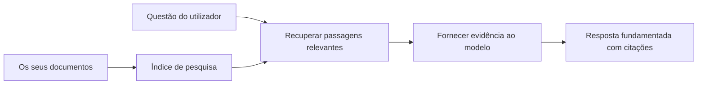

# Ensinar a IA a Responder a Perguntas com Base nos Seus Documentos:
## Série 1: RAG, Azure vs Alternativas Open-Source, e Quando a Ajuste Fino Faz Sentido

> O primeiro artigo de uma série de 2026 a revisitar os meus tutoriais de 2023 de QA de documentos com Azure AI Search + Azure OpenAI.

Navegação da série: [Repositório principal](../README.md) | Seguinte: [Série 2 - Construir um Sistema RAG Open-Source Local de Ponta a Ponta](./series-2-open-source-rag-end-to-end.md)

## 1. Introdução - Revisitando um Tutorial Anterior sobre RAG

Em 2023, trabalhei numa dupla de tutoriais sobre ensinar o ChatGPT a responder a perguntas a partir de documentos PDF usando Azure AI Search e Azure OpenAI. Eu escrevi a [versão LangChain](https://techcommunity.microsoft.com/blog/educatordeveloperblog/teach-chatgpt-to-answer-questions-using-azure-ai-search--azure-openai-lang-chain/3969713), e também co-escrevi a versão complementar do [Semantic Kernel](https://techcommunity.microsoft.com/blog/educatordeveloperblog/teach-chatgpt-to-answer-questions-using-azure-ai-search--azure-openai-semantic-k/3985395) com o [Lee Stott](https://developer.microsoft.com/en-us/advocates/lee-stott), um Principal Cloud Advocate Manager na Microsoft. Na altura, a ideia de "ChatGPT nos seus dados" ainda parecia nova para muitos desenvolvedores. Os tutoriais usaram Azure Blob Storage, Azure AI Search, Azure OpenAI, LangChain, Semantic Kernel, e recuperação vetorial ao estilo FAISS para responder a perguntas a partir de ficheiros PDF.

Esse artigo anterior focou-se num fluxo de trabalho simples mas importante: carregar documentos, indexá-los, recuperar conteúdo relevante e pedir a um modelo para responder com base nesse conteúdo.

Em 2026, o ecossistema RAG cresceu significativamente. Azure AI Search agora suporta padrões modernos de recuperação vetorial e híbrida, Azure OpenAI é parte do ecossistema mais amplo Microsoft Foundry Models, e a nova API v1 pode usar o cliente padrão OpenAI sem exigir mudanças mensais na `api-version`. Ao mesmo tempo, opções open-source como LangGraph, LlamaIndex, Haystack, Qdrant, Milvus, Weaviate, Chroma, Ollama e vLLM tornaram-se escolhas práticas para sistemas RAG reais.

Por isso quis revisitar este tema. A questão já não é apenas "Como construir RAG?" Agora existem muitas formas de o fazer, e a pergunta mais importante é "Qual arquitetura devo escolher para a minha situação?"

Mas o problema central não mudou.

Um modelo de IA não sabe automaticamente os seus documentos. Para construir um sistema útil de perguntas e respostas baseadas em documentos, ainda precisa de fluxos de trabalho confiáveis de recuperação, fundamentação, avaliação e operação.

Este artigo não é outro tutorial de "chat com PDF" de ponta a ponta. Quero começar esta série atualizada com a questão que agora me interessa mais: quando deve escolher uma arquitetura gerida Azure, quando deve escolher uma stack RAG open-source, e quando é que o ajuste fino realmente faz sentido?

Este é o primeiro artigo de uma série sobre construir sistemas de IA fundamentados em documentos. Nesta primeira parte, focar-nos-emos nas decisões de arquitetura: por que o RAG é importante, quando os serviços geridos baseados em Azure são úteis, quando as alternativas open-source fazem sentido, e onde o ajuste fino se encaixa.

Depois de construir e revisitar sistemas de QA de documentos, fiquei menos interessado em qual ferramenta parece melhor numa demonstração e mais interessado em qual arquitetura sobrevive a utilizadores reais, documentos que mudam, permissões, falhas e manutenção.

## 2. Por Que a Sua IA Precisa de um Sistema de Pesquisa

Os grandes modelos de linguagem são treinados com dados públicos amplos e licenciados. Podem saber muito sobre tópicos gerais, mas não sabem automaticamente os seus PDFs privados, políticas internas, procedimentos empresariais, arquivos de investigação, materiais de aula, notas de suporte ao cliente ou documentação recentemente atualizada.

Uma forma simples de pensar no RAG é esta: em vez de esperar que o modelo lembre-se de cada documento, damos-lhe um sistema de pesquisa. Quando um utilizador faz uma pergunta, o sistema primeiro encontra os pedaços de informação mais relevantes, e depois dá esses pedaços ao modelo como contexto.

Isto importa porque muitas fontes de conhecimento do mundo real são privadas, mudam constantemente, são sensíveis a permissões, estão armazenadas em múltiplos sistemas, escritas em muitos formatos e são demasiado grandes para colar diretamente num prompt.

Por exemplo, se uma escola, empresa ou equipa de investigação tem 10.000 documentos internos, o modelo não pode responder de forma fiável a partir desses documentos, a menos que o sistema recupere as partes certas no momento certo.

Isto leva naturalmente a uma pergunta comum:

Porque não simplesmente ajustar fino o modelo?

O ajuste fino pode ser útil, mas normalmente não é a primeira ferramenta correta para conhecimento documental. Se o conhecimento muda frequentemente, se as citações importam, ou se as permissões de acesso importam, o RAG é geralmente o melhor ponto de partida. O ajuste fino é mais adequado para ensinar comportamento, estilo, formato de saída e padrões de tarefa.

## 3. Arquitetura RAG na Prática

Imagine que está a construir um assistente de IA para uma escola. O assistente precisa responder a perguntas a partir de PDFs de políticas, guias de cursos, páginas internas de FAQ, e anúncios recentemente atualizados.

Se um aluno perguntar, "Posso usar IA generativa para o meu trabalho final?", o sistema não deve responder baseado na memória geral do modelo. Deve primeiro encontrar a política escolar relevante, recuperar a secção sobre uso de IA, e depois pedir ao modelo para responder usando essa evidência.

Isso é RAG na prática.

A um nível alto, pode pensar no fluxo assim:

Os detalhes podem ser mais sofisticados, mas a ideia básica é simples: o modelo não responde sozinho. Responde com evidência recuperada.

Primeiro, os documentos são ingeridos de sistemas de armazenamento como Azure Blob Storage, SharePoint, GitHub ou um CMS interno. Depois, o sistema analisa-os em texto enquanto preserva estruturas úteis como títulos, números de página, tabelas, secções e localizações da fonte.

De seguida, o conteúdo é dividido em pedaços. Esta etapa parece simples, mas é uma das partes mais importantes do sistema. Se o pedaço for demasiado pequeno, pode perder o contexto envolvente. Se o pedaço for demasiado grande, pode incluir informação não relacionada e tornar a recuperação menos precisa.

Após a divisão em pedaços, o sistema cria embeddings e armazena-os num índice pesquisável juntamente com o texto original e metadados como nome do ficheiro, número da página, permissões, versão do documento e URL da fonte.

Quando o utilizador faz uma pergunta, o sistema recupera pedaços candidatos usando pesquisa por palavras-chave, pesquisa vetorial ou pesquisa híbrida. Um reordenador pode depois reordenar esses pedaços para que a evidência mais útil fique no topo.

Finalmente, o modelo recebe a pergunta e a evidência recuperada. A resposta deve estar fundamentada nessa evidência e retornar citações para que o utilizador possa inspecionar a fonte.

O ponto importante é que RAG não é apenas "colocar PDFs numa base de dados vetorial". A qualidade da resposta depende de todo o fluxo de trabalho: análise, divisão em pedaços, recuperação, reordenamento, prompting, citação e avaliação.

Por isso é que a estrutura do documento importa. Num PDF, um cabeçalho, tabela, nota de rodapé ou limite de página pode mudar o significado de um trecho. No Azure, a skill Document Layout usa as capacidades de layout do Azure Document Intelligence para produzir um output consciente da estrutura, o que pode melhorar a qualidade da divisão e da recuperação para sistemas RAG.

## 4. O Que Mudou Desde 2023?

O tutorial de 2023 foi um bom ponto de partida para a época:

- Azure Blob Storage armazenava ficheiros PDF.
- Azure AI Search indexava conteúdo.
- LangChain ligava recuperação ao Azure OpenAI.
- FAISS funcionava como uma simples loja vetorial local.
- O exemplo usava `gpt-35-turbo` e `text-embedding-ada-002`.

Em 2026, uma versão moderna deve refletir várias mudanças.

Primeiro, a recuperação amadureceu. Em 2023, muitas demos usavam uma simples pesquisa de similaridade vetorial. Hoje, a recuperação híbrida é muitas vezes o ponto de partida padrão para QA sério de documentos. Azure AI Search suporta pesquisa híbrida combinando consultas por palavra-chave e vetorial numa única solicitação e fundindo resultados com Reciprocal Rank Fusion. Um rankeador semântico pode então reordenar o lado do texto dos resultados full-text, vetoriais e híbridos.

Segundo, a ingestão é mais sofisticada. Em vez de dividir manualmente cada documento com código de aplicação, Azure AI Search suporta vetorização integrada para divisão em pedaços, criação de embeddings, e vetorização em tempo de consulta. Para PDFs e cargas de trabalho pesadas em documentos, a skill Document Layout pode preservar mais estrutura do que pedaços de tamanho fixo.

Terceiro, a orquestração importa mais. A parte difícil muitas vezes não é a chamada da API do LLM em si. A parte difícil é lidar com falhas, tentativas, recuperação obsoleta, qualidade do pedaço, fluxos longos, revisão humana e avaliação em escala. Aqui é onde ferramentas orientadas a fluxos de trabalho como LangGraph, workflows LlamaIndex, pipelines Haystack e ferramentas de avaliação e observabilidade a nível de plataforma se tornam mais relevantes do que uma cadeia linear única.

Quarto, a avaliação já não é opcional. Uma demo pode parecer impressionante com uma pergunta. Um sistema de produção precisa de conjuntos de teste, verificações de regressão, métricas de recuperação, verificações de fundamentação e monitorização. Sem avaliação, é difícil saber se o sistema está a melhorar ou apenas a mudar.

## 5. Escolhendo Entre Stacks RAG Azure e Open-Source

Não penso que a pergunta útil seja "O Azure é melhor que open source?" ou "O open source é melhor que Azure?"

A pergunta útil é: que tipo de sistema está a construir, quem o irá operar, que restrições tem, e que modos de falha são inaceitáveis?

Quando comecei a construir exemplos de QA de documentos, pensava principalmente se a recuperação funcionava. Poderia carregar PDFs, pesquisar neles e gerar uma resposta? Esse era um ponto de partida razoável.

Depois de trabalhar com fluxos de trabalho de IA mais realistas, a minha avaliação mudou. Agora olho para quatro áreas antes de escolher uma stack RAG:

- identidade e permissões
- qualidade da recuperação
- fiabilidade do fluxo de trabalho
- propriedade operacional

Essas quatro áreas dizem muito mais do que um benchmark de modelo sozinho.

Arquiteturas baseadas em Azure geralmente fazem sentido quando a integração empresarial é a parte difícil. Se uma equipa já depende de Microsoft Entra ID, Microsoft 365, Azure Storage, redes privadas, RBAC e monitorização Azure, Azure AI Search e Azure OpenAI podem reduzir muita complexidade operacional. Nesse ambiente, Azure não é só uma API de modelo. O valor está no sistema envolvente: identidade, governança, pesquisa gerida, integração de segurança, suporte e operações familiares.

Arquiteturas open-source geralmente fazem sentido quando a flexibilidade é a parte difícil. Se a equipa precisa de inferência local, portabilidade na cloud, pipeline de recuperação personalizado, reordenamento especializado ou controlo direto sobre a base de dados vetorial e a camada de servição de modelos, uma stack open-source pode ser a melhor opção. A desvantagem é que a equipa assume mais do trabalho da fiabilidade: backups, escala, latência, migrações, monitorização e segurança.

Na prática, muitos sistemas de IA de produção não são puramente cloud-native nem puramente open-source. São muitas vezes sistemas híbridos que equilibram simplicidade operacional, portabilidade, governança e flexibilidade de engenharia.

Por exemplo, não me surpreenderia ver um sistema a usar Azure OpenAI para acesso a modelos, LangGraph para orquestração de fluxo de trabalho, alojamento Azure para deployment, e uma base de dados vetorial open-source para uma necessidade específica de recuperação. Isso não é inconsistência arquitetural. É escolher o nível certo de serviço gerido e controlo de engenharia para cada parte do sistema.

Gosto de arquiteturas híbridas quando a plataforma gerida resolve problemas empresariais importantes, enquanto os componentes open-source dão à equipa flexibilidade onde realmente importa.

## 6. Um Guia Prático de Decisão

Aqui está a tabela de decisão que eu usaria com uma equipa antes de escolher uma stack RAG:

| Área de decisão | Stack gerido Azure é mais forte quando... | Stack open-source é mais forte quando... |
| --- | --- | --- |
| Identidade e acesso | Entra ID, RBAC, identidade gerida e permissões empresariais são centrais | autenticação personalizada, identidade não Microsoft ou lógica de acesso específica da app domina |
| Operações | a equipa quer infraestrutura gerida, suporte, SLAs, e onboarding mais simples | a equipa consegue operar bases de dados vetoriais, servição de modelos, backups e escalabilidade |
| Recuperação | pesquisa híbrida, ranking semântico, filtros e pesquisa por metadados cobrem a maioria das necessidades | a equipa precisa de recuperação personalizada, reordenamento especializado ou indexação experimental |
| Portabilidade | o alinhamento com o ecossistema Azure é aceitável ou preferido | evitar bloqueio na cloud é uma exigência forte |
| Inferência | governança Azure OpenAI, redes e controlos empresariais importam | inferência local, modelos personalizados ou servição auto-hospedada são necessários |
| Custo | reduzir esforço de engenharia e operações importa mais que otimização da infraestrutura | a escala é suficientemente grande para justificar otimização cuidadosa da infraestrutura |
| Experimentação | estabilidade e integração empresarial importam mais que mudar componentes frequentemente | a equipa está a iterar rapidamente sobre agentes, ferramentas, memória e fluxos de recuperação |

A minha regra prática é simples:

- Comece com Azure quando integração empresarial, segurança e simplicidade operacional forem os principais riscos.
- Comece com open source quando portabilidade, personalização ou controlo local forem os principais riscos.
- Use uma stack híbrida quando ambos forem verdade.

É também por isso que não começaria uma série RAG de 2026 com código primeiro. O código é importante, mas a seleção da arquitetura vem antes da implementação. Uma demo simples pode esconder as escolhas mais difíceis. Um bom sistema RAG torna essas escolhas explícitas.

## 7. Onde Se Encaixa o Ajuste Fino

O ajuste fino é muitas vezes mencionado juntamente com RAG, mas penso que é importante separar os dois.

RAG é geralmente a melhor escolha quando o sistema precisa de conhecimento atualizado, privado, sensível a permissões, ou fundamentado em fontes. Se a resposta deve citar documentos, refletir atualizações recentes, ou respeitar regras de acesso específicas do utilizador, a recuperação deve fazer parte da arquitetura.
O ajuste fino é mais útil quando o conhecimento não é o principal problema. Pode ajudar quando se pretende que o modelo siga um formato de saída específico, corresponda a um estilo de resposta específico do domínio, execute uma tarefa estável de forma mais consistente ou reduza a quantidade de instrução necessária em cada prompt.

Na prática, os dois podem funcionar em conjunto. Um assistente de suporte pode usar RAG para recuperar a política mais recente, enquanto um modelo ajustado fino aprende a estrutura e o tom preferidos da resposta da empresa.

O erro é tratar o ajuste fino como um substituto para uma loja de documentos. Ele não elimina a necessidade de recuperação quando o sistema deve responder com base em dados recentes, privados ou sensíveis a permissões.

## 8. Para Onde Esta Série Vai a Seguir

Este artigo é a camada de tomada de decisão. Antes de escrever código, queria tornar explícitas as compensações: RAG vs ajuste fino, Azure vs open source, serviços geridos vs controlo operacional.

Antes de avançar para a implementação, quero deixar aqui um ponto: em muitos sistemas de IA empresariais, o modelo é apenas um componente. A qualidade da recuperação, orquestração, avaliação, permissões e fiabilidade operacional são frequentemente o que determina se o sistema tem sucesso além da fase de demonstração.

Nas próximas partes desta série, pretendo aprofundar o lado prático dos sistemas de IA fundamentados em documentos: primeiro construindo um fluxo de trabalho RAG open-source local, depois reconstruindo o mesmo cenário com Azure AI Search e Azure OpenAI, e depois avaliando se o sistema realmente está a funcionar.

Posso ajustar a ordem à medida que a série se desenvolve, mas o objetivo vai manter-se o mesmo: ir para além de uma demo simples e mostrar como pensar sobre sistemas RAG que podem ser mantidos, avaliados e operados.

## 9. Referências e Recursos

Tutoriais originais:

- [Ensinar o ChatGPT a Responder a Perguntas: Utilizando Azure AI Search & Azure OpenAI (Lang Chain)](https://techcommunity.microsoft.com/blog/educatordeveloperblog/teach-chatgpt-to-answer-questions-using-azure-ai-search--azure-openai-lang-chain/3969713)
- [Ensinar o ChatGPT a Responder a Perguntas: Utilizando Azure AI Search & Azure OpenAI (Semantic Kernel)](https://techcommunity.microsoft.com/blog/educatordeveloperblog/teach-chatgpt-to-answer-questions-using-azure-ai-search--azure-openai-semantic-k/3985395)

Azure:

- [Versões da API REST do Azure AI Search](https://learn.microsoft.com/en-us/rest/api/searchservice/search-service-api-versions)
- [Pesquisa híbrida no Azure AI Search](https://learn.microsoft.com/en-us/azure/search/hybrid-search-how-to-query)
- [Vetorização integrada no Azure AI Search](https://learn.microsoft.com/en-us/azure/search/vector-search-integrated-vectorization)
- [Competência de layout de documentos no Azure AI Search](https://learn.microsoft.com/en-us/azure/search/cognitive-search-skill-document-intelligence-layout)
- [Dividir e vetorizar por layout de documento](https://learn.microsoft.com/en-us/azure/search/search-how-to-semantic-chunking)
- [Classificação semântica no Azure AI Search](https://learn.microsoft.com/en-us/azure/search/semantic-search-overview)
- [Ciclo de vida das versões da API Azure OpenAI / Microsoft Foundry](https://learn.microsoft.com/en-us/azure/foundry/openai/api-version-lifecycle)
- [Modelos Foundry vendidos pela Azure](https://learn.microsoft.com/en-us/azure/foundry/foundry-models/concepts/models-sold-directly-by-azure)
- [Considerações de ajuste fino no Microsoft Foundry](https://learn.microsoft.com/en-us/azure/foundry/openai/concepts/fine-tuning-considerations)
- [Observabilidade no Microsoft Foundry](https://learn.microsoft.com/en-us/azure/foundry/concepts/observability)
- [Executar avaliações no Microsoft Foundry](https://learn.microsoft.com/en-us/azure/foundry/how-to/evaluate-generative-ai-app)

Open-source:

- [Documentação do LangGraph](https://docs.langchain.com/oss/python/langgraph/overview)
- [Documentação do LlamaIndex](https://developers.llamaindex.ai/python/framework/)
- [Documentação do Haystack](https://docs.haystack.deepset.ai/)
- [Documentação do Qdrant](https://qdrant.tech/documentation/overview/)
- [Documentação do Milvus](https://milvus.io/docs/overview.md)
- [Documentação do Weaviate](https://docs.weaviate.io/weaviate/current/)
- [Documentação do Chroma](https://docs.trychroma.com/docs/overview/introduction)
- [Embeddings Ollama](https://docs.ollama.com/capabilities/embeddings)
- [Servidor compatível OpenAI vLLM](https://docs.vllm.ai/en/latest/serving/openai_compatible_server.html)
- [Modelos de embedding BGE](https://huggingface.co/BAAI/bge-large-en-v1.5)
- [Modelos de embedding E5](https://huggingface.co/intfloat/e5-large-v2)
- [Modelos de embedding Instructor](https://huggingface.co/hkunlp/instructor-large)

Próximo: [Série 2 - Construir um Sistema RAG Local Open-Source de Ponta a Ponta](./series-2-open-source-rag-end-to-end.md)

---

<!-- CO-OP TRANSLATOR DISCLAIMER START -->
**Aviso Legal**:
Este documento foi traduzido utilizando o serviço de tradução automática [Co-op Translator](https://github.com/Azure/co-op-translator). Embora nos esforcemos pela precisão, esteja ciente de que traduções automáticas podem conter erros ou imprecisões. O documento original na sua língua nativa deve ser considerado a fonte autorizada. Para informações críticas, recomenda-se tradução profissional humana. Não nos responsabilizamos por quaisquer mal-entendidos ou interpretações incorretas resultantes da utilização desta tradução.
<!-- CO-OP TRANSLATOR DISCLAIMER END -->