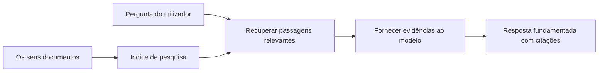

# Ensinar a IA a Responder Perguntas com Base nos Seus Documentos:
## Série 1: RAG, Azure vs Alternativas Open-Source, e Quando o Fine-Tuning Faz Sentido

> O primeiro artigo de uma série de 2026 a revisitar os meus tutoriais de 2023 sobre Azure AI Search + Azure OpenAI para QA de documentos.

## 1. Introdução - Revisitar um Tutorial Anterior de RAG

Em 2023, trabalhei num par de tutoriais sobre ensinar o ChatGPT a responder perguntas a partir de documentos PDF utilizando Azure AI Search e Azure OpenAI. Eu escrevi a [versão LangChain](https://techcommunity.microsoft.com/blog/educatordeveloperblog/teach-chatgpt-to-answer-questions-using-azure-ai-search--azure-openai-lang-chain/3969713) e também co-autorei a versão complementar [Semantic Kernel](https://techcommunity.microsoft.com/blog/educatordeveloperblog/teach-chatgpt-to-answer-questions-using-azure-ai-search--azure-openai-semantic-k/3985395) com o [Lee Stott](https://developer.microsoft.com/en-us/advocates/lee-stott), Principal Cloud Advocate Manager na Microsoft. Na altura, a ideia de "ChatGPT nos seus dados" ainda parecia nova para muitos programadores. Os tutoriais usaram Azure Blob Storage, Azure AI Search, Azure OpenAI, LangChain, Semantic Kernel e a recuperação vetorial estilo FAISS para responder a perguntas de ficheiros PDF.

Esse artigo anterior focou-se num fluxo de trabalho simples mas importante: carregar documentos, indexá-los, recuperar conteúdo relevante e pedir a um modelo para responder com base nesse conteúdo.

Em 2026, o ecossistema RAG cresceu significativamente. O Azure AI Search suporta agora padrões modernos de recuperação vetorial e híbrida, o Azure OpenAI faz parte do ecossistema mais amplo dos Microsoft Foundry Models, e a API mais recente v1 pode usar o cliente OpenAI padrão sem exigir mudanças mensais no `api-version`. Ao mesmo tempo, opções open-source como LangGraph, LlamaIndex, Haystack, Qdrant, Milvus, Weaviate, Chroma, Ollama e vLLM tornaram-se escolhas práticas para sistemas RAG reais.

É por isso que quis revisitar este tema. A questão não é mais apenas "Como construir RAG?" Agora há muitas formas de o construir, e a pergunta mais importante é "Que arquitetura devo escolher para a minha situação?"

Mas o problema central não mudou.

Um modelo de IA não conhece automaticamente os seus documentos. Para construir um sistema útil de perguntas e respostas baseado em documentos, ainda precisa de fluxos fiáveis de recuperação, fundamento, avaliação e operação.

Este artigo não é outro tutorial "chat com PDF" de ponta a ponta. Quero começar esta série atualizada com a questão que agora me interessa mais: quando deve escolher uma arquitetura gerida Azure, quando deve optar por uma stack RAG open-source e quando é que o fine-tuning realmente faz sentido?

Este é o primeiro artigo de uma série sobre construir sistemas de IA fundamentados em documentos. Nesta primeira parte, vamos focar nas decisões arquitetónicas: por que o RAG importa, quando os serviços geridos baseados em Azure são úteis, quando as alternativas open-source fazem sentido e onde o fine-tuning se encaixa.

Depois de construir e revisitar sistemas de QA de documentos, fiquei menos interessado em qual ferramenta parece melhor numa demo e mais interessado em qual arquitetura sobrevive a utilizadores reais, documentos em mudança, permissões, falhas e manutenção.

## 2. Por Que a Sua IA Precisa de um Sistema de Pesquisa

Os grandes modelos de linguagem são treinados com dados públicos extensos e licenciados. Podem saber muito sobre tópicos gerais, mas não conhecem automaticamente os seus PDFs privados, políticas internas, procedimentos empresariais, arquivos de investigação, materiais escolares, notas de suporte ao cliente ou documentação recentemente atualizada.

Uma forma simples de pensar sobre RAG é esta: em vez de esperar que o modelo memorize todos os documentos, damos-lhe um sistema de pesquisa. Quando um utilizador faz uma pergunta, o sistema encontra primeiro as peças de informação mais relevantes e depois dá essas peças ao modelo como contexto.

Isto é importante porque muitas fontes de conhecimento do mundo real são privadas, mudam constantemente, são sensíveis a permissões, estão armazenadas em vários sistemas, são escritas em muitos formatos e são demasiado grandes para colar diretamente num prompt.

Por exemplo, se uma escola, empresa ou equipa de investigação tem 10.000 documentos internos, o modelo não consegue responder fiavelmente a partir desses documentos a menos que o sistema recupere as partes certas no momento certo.

Isto leva naturalmente a uma questão comum:

Por que não simplesmente fazer fine-tuning ao modelo?

O fine-tuning pode ser útil, mas normalmente não é a primeira ferramenta certa para conhecimento de documentos. Se o conhecimento muda frequentemente, se citações são importantes ou se permissões de acesso importam, o RAG é geralmente o melhor ponto de partida. O fine-tuning é mais adequado para ensinar comportamentos, estilo, formato de saída e padrões de tarefa.

## 3. Arquitectura RAG na Prática

Imagine que está a construir um assistente de IA para uma escola. O assistente precisa responder a perguntas de PDFs de políticas, guias de curso, páginas internas de FAQ e anúncios recentemente atualizados.

Se um aluno perguntar "Posso usar IA generativa para o meu trabalho final?", o sistema não deve responder baseado na memória geral do modelo. Deve primeiro encontrar a política escolar relevante, recuperar a secção sobre uso de IA e depois pedir ao modelo para responder usando essa evidência.

Isto é RAG na prática.

A um alto nível, pode pensar no fluxo assim:

Os detalhes podem ser mais sofisticados, mas a ideia básica é simples: o modelo não responde sozinho. Responde com evidências recuperadas.

Primeiro, os documentos são ingeridos a partir de sistemas de armazenamento como Azure Blob Storage, SharePoint, GitHub ou um CMS interno. Depois, o sistema faz o parsing para texto, preservando estrutura útil como cabeçalhos, números de página, tabelas, secções e locais da fonte.

Em seguida, o conteúdo é dividido em pedaços (chunks). Esta etapa parece simples, mas é uma das partes mais importantes do sistema. Se um chunk for demasiado pequeno, pode perder o contexto à volta. Se for demasiado grande, pode incluir informação não relacionada e tornar a recuperação menos precisa.

Depois da divisão, o sistema cria embeddings e armazena-os num índice pesquisável juntamente com o texto original e metadados como nome do ficheiro, número da página, permissões, versão do documento e URL da fonte.

Quando o utilizador faz uma pergunta, o sistema recupera os chunks candidatos usando pesquisa por palavras-chave, pesquisa vetorial ou pesquisa híbrida. Um reranker pode depois reordenar esses chunks para que as evidências mais úteis fiquem no topo.

Finalmente, o modelo recebe a pergunta e as evidências recuperadas. A resposta deve estar fundamentada nessa evidência e retornar citações para que o utilizador possa inspeccionar a fonte.

O ponto importante é que o RAG não é apenas "colocar PDFs numa base de dados vetorial." A qualidade da resposta depende de todo o fluxo: parsing, chunking, recuperação, reranking, prompting, citação e avaliação.

É por isso que a estrutura do documento importa. Num PDF, um cabeçalho, tabela, nota de rodapé ou limite de página pode mudar o significado de um trecho. No Azure, a habilidade Document Layout usa as capacidades de layout do Azure Document Intelligence para produzir saída consciente da estrutura, o que pode melhorar a qualidade do chunking e da recuperação para sistemas RAG.

## 4. O Que Mudou Desde 2023?

O tutorial de 2023 foi um bom ponto de partida para a sua época:

- Azure Blob Storage armazenava ficheiros PDF.
- Azure AI Search indexava o conteúdo.
- LangChain ligava a recuperação ao Azure OpenAI.
- FAISS funcionava como um simples armazenamento vetorial local.
- O exemplo usava `gpt-35-turbo` e `text-embedding-ada-002`.

Em 2026, uma versão moderna deve refletir várias mudanças.

Primeiro, a recuperação amadureceu. Em 2023, muitas demos usavam pesquisa simples de similaridade vetorial. Hoje, a recuperação híbrida é frequentemente o ponto de partida padrão para QA de documentos sério. O Azure AI Search suporta pesquisa híbrida combinando consultas por palavras-chave e vetoriais numa única requisição, fundindo resultados com Reciprocal Rank Fusion. Um ranqueador semântico pode depois reranquear o lado do texto dos resultados de full-text, vetor e híbridos.

Segundo, a ingestão está mais sofisticada. Em vez de dividir manualmente cada documento com código de aplicação, o Azure AI Search suporta vetorização integrada para chunking, embedding e vetorização em tempo de consulta. Para PDFs e cargas de trabalho pesadas em documentos, a habilidade Document Layout pode preservar mais estrutura que chunks de tamanho fixo.

Terceiro, a orquestração importa mais. A parte difícil normalmente não é a chamada API do LLM em si. A parte difícil é lidar com falhas, tentativas, recuperação desatualizada, qualidade dos chunks, fluxos longos, revisão humana e avaliação em escala. Aqui, ferramentas orientadas a fluxo de trabalho como LangGraph, fluxos de trabalho LlamaIndex, pipelines Haystack e ferramentas de avaliação e observabilidade a nível de plataforma tornam-se mais relevantes do que uma cadeia linear única.

Quarto, a avaliação deixou de ser opcional. Uma demo pode parecer impressionante com uma pergunta. Um sistema em produção precisa de conjuntos de testes, verificações de regressão, métricas de recuperação, checagens de fundamentação e monitorização. Sem avaliação, é difícil saber se o sistema está a melhorar ou apenas a mudar.

## 5. Escolher Entre Stacks RAG Azure e Open-Source

Não penso que a pergunta útil seja "O Azure é melhor que open source?" ou "O open source é melhor que o Azure?"

A pergunta útil é: que tipo de sistema está a construir, quem vai operá-lo, que constrangimentos tem e que modos de falha são inaceitáveis?

Quando comecei a construir exemplos de QA de documentos, pensava sobretudo se a recuperação funcionava. Poderia carregar PDFs, pesquisá-los e gerar uma resposta? Era um ponto de partida razoável.

Depois de trabalhar com fluxos de IA mais realistas, a minha avaliação mudou. Agora olho para quatro coisas antes de escolher uma stack RAG:

- identidade e permissões
- qualidade da recuperação
- fiabilidade do fluxo de trabalho
- responsabilidade operacional

Essas quatro áreas dizem-lhe muito mais do que apenas um benchmark de modelos.

Arquiteturas baseadas em Azure geralmente fazem sentido quando a integração empresarial é a parte difícil. Se uma equipa já depende do Microsoft Entra ID, Microsoft 365, Azure Storage, redes privadas, RBAC e monitorização Azure, o Azure AI Search e Azure OpenAI podem reduzir muita complexidade operacional. Nesse ambiente, o Azure não é apenas uma API de modelo. O valor está no sistema circundante: identidade, governação, pesquisa gerida, integração de segurança, suporte e operações familiares.

Arquitecturas open-source geralmente fazem sentido quando a flexibilidade é o desafio. Se a equipa precisa de inferência local, portabilidade cloud, pipeline de recuperação personalizada, reranking especializado ou controlo direto sobre a base de dados vetorial e camada de serviço do modelo, uma stack open-source pode ser mais adequada. A compensação é que a equipa assume mais trabalho de fiabilidade: backups, escalabilidade, latência, migrações, monitorização e segurança.

Na prática, muitos sistemas de IA em produção não são nem puramente cloud-native nem puramente open-source. São frequentemente sistemas híbridos que equilibram simplicidade operacional, portabilidade, governação e flexibilidade de engenharia.

Por exemplo, não me surpreenderia ver um sistema a usar Azure OpenAI para acesso ao modelo, LangGraph para orquestração de fluxo, hosting Azure para implantação e uma base de dados vetorial open-source para um requisito específico de recuperação. Isso não é incoerência arquitetónica. É escolher o nível certo de serviço gerido e controlo de engenharia para cada parte do sistema.

Gosto de arquiteturas híbridas quando a plataforma gerida resolve problemas empresariais importantes, enquanto componentes open-source dão à equipa flexibilidade onde realmente importa.

## 6. Um Guia Prático de Decisão

Aqui está a tabela de decisão que usaria com uma equipa antes de escolher uma stack RAG:

| Área de decisão | Stack gerida Azure é mais forte quando... | Stack open-source é mais forte quando... |
| --- | --- | --- |
| Identidade e acesso | Entra ID, RBAC, identidade gerida e permissões empresariais são centrais | autenticação customizada, identidade não Microsoft ou lógica de acesso específica da app predomina |
| Operações | a equipa quer infraestrutura gerida, suporte, SLAs e onboarding mais simples | a equipa pode operar bases de dados vetoriais, serviço de modelos, backups e escalabilidade |
| Recuperação | pesquisa híbrida, ranqueamento semântico, filtros e pesquisa em metadados cobrem a maioria das necessidades | a equipa precisa de recuperação customizada, reranking especializado ou indexação experimental |
| Portabilidade | alinhamento com ecossistema Azure é aceitável ou preferido | evitar dependência da cloud (lock-in) é requisito obrigatório |
| Inferência | governação Azure OpenAI, redes e controlos empresariais importam | inferência local, modelos customizados ou serviço auto-hospedado são necessários |
| Custo | reduzir esforço de engenharia e operações importa mais que afinação da infraestrutura | escala é grande o suficiente para justificar otimização cuidadosa da infraestrutura |
| Experimentação | estabilidade e integração empresarial são mais importantes que trocar componentes frequentemente | equipa está a iterar rapidamente em agentes, ferramentas, memória e fluxos de recuperação |

A minha regra prática é simples:

- Comece com Azure quando integração empresarial, segurança e simplicidade operacional sejam os principais riscos.
- Comece com open source quando portabilidade, personalização ou controlo local sejam os principais riscos.
- Use uma stack híbrida quando ambos forem verdade.

É também por isso que não começaria uma série RAG 2026 pelo código primeiro. Código é importante, mas a seleção arquitetónica vem antes da implementação. Uma demo simples pode esconder as escolhas mais difíceis. Um bom sistema RAG deixa essas escolhas explícitas.

## 7. Onde o Fine-Tuning Se Encaixa

O fine-tuning é muitas vezes mencionado em conjunto com RAG, mas acho importante separar os dois.

O RAG é geralmente a melhor escolha quando o sistema precisa de conhecimento atualizado, privado, sensível a permissões ou fundamentado numa fonte. Se a resposta deve citar documentos, refletir atualizações recentes ou respeitar regras de acesso específicas do utilizador, a recuperação deve ser parte da arquitetura.

O fine-tuning é mais útil quando o conhecimento não é o problema principal. Pode ajudar quando quer que o modelo siga um formato de saída específico, combine um estilo de resposta específico ao domínio, execute uma tarefa estável com mais consistência ou reduza a quantidade de instrução necessária em cada prompt.
Na prática, os dois podem funcionar juntos. Um assistente de suporte pode usar RAG para recuperar a política mais recente, enquanto um modelo ajustado aprende a estrutura e o tom de resposta preferidos pela empresa.

O erro é tratar o fine-tuning como um substituto para um armazenador de documentos. Ele não elimina a necessidade de recuperação quando o sistema deve responder com base em dados recentes, privados ou sensíveis a permissões.

## 8. Para Onde Esta Série Vai a Seguir

Este artigo é a camada de tomada de decisão. Antes de escrever código, quis tornar explícitas as concessões: RAG vs fine-tuning, Azure vs open source, serviços geridos vs controlo operacional.

Antes de avançar para a implementação, quero deixar um ponto aqui: em muitos sistemas de IA empresariais, o modelo é apenas um componente. A qualidade da recuperação, orquestração, avaliação, permissões e fiabilidade operacional são frequentemente o que determina se o sistema tem sucesso além da fase de demonstração.

Nas próximas partes desta série, pretendo aprofundar o lado prático dos sistemas de IA fundamentados em documentos: como construir uma arquitetura baseada em Azure, como as alternativas open source se comparam na prática, e como avaliar se um sistema RAG está realmente a funcionar.

Posso ajustar a ordem à medida que a série se desenvolve, mas o objetivo manter-se-á o mesmo: ir além de uma simples demonstração e mostrar como pensar sobre sistemas RAG que possam ser mantidos, avaliados e operados.

## 9. Referências e Recursos

Tutoriais originais:

- [Teach ChatGPT to Answer Questions: Using Azure AI Search & Azure OpenAI (Lang Chain)](https://techcommunity.microsoft.com/blog/educatordeveloperblog/teach-chatgpt-to-answer-questions-using-azure-ai-search--azure-openai-lang-chain/3969713)
- [Teach ChatGPT to Answer Questions: Using Azure AI Search & Azure OpenAI (Semantic Kernel)](https://techcommunity.microsoft.com/blog/educatordeveloperblog/teach-chatgpt-to-answer-questions-using-azure-ai-search--azure-openai-semantic-k/3985395)

Azure:

- [Azure AI Search REST API versions](https://learn.microsoft.com/en-us/rest/api/searchservice/search-service-api-versions)
- [Hybrid search in Azure AI Search](https://learn.microsoft.com/en-us/azure/search/hybrid-search-how-to-query)
- [Integrated vectorization in Azure AI Search](https://learn.microsoft.com/en-us/azure/search/vector-search-integrated-vectorization)
- [Document Layout skill in Azure AI Search](https://learn.microsoft.com/en-us/azure/search/cognitive-search-skill-document-intelligence-layout)
- [Chunk and vectorize by document layout](https://learn.microsoft.com/en-us/azure/search/search-how-to-semantic-chunking)
- [Semantic ranking in Azure AI Search](https://learn.microsoft.com/en-us/azure/search/semantic-search-overview)
- [Azure OpenAI / Microsoft Foundry API version lifecycle](https://learn.microsoft.com/en-us/azure/foundry/openai/api-version-lifecycle)
- [Foundry Models sold by Azure](https://learn.microsoft.com/en-us/azure/foundry/foundry-models/concepts/models-sold-directly-by-azure)
- [Microsoft Foundry fine-tuning considerations](https://learn.microsoft.com/en-us/azure/foundry/openai/concepts/fine-tuning-considerations)
- [Microsoft Foundry observability](https://learn.microsoft.com/en-us/azure/foundry/concepts/observability)
- [Run evaluations in Microsoft Foundry](https://learn.microsoft.com/en-us/azure/foundry/how-to/evaluate-generative-ai-app)

Open-source:

- [LangGraph documentation](https://docs.langchain.com/oss/python/langgraph/overview)
- [LlamaIndex documentation](https://developers.llamaindex.ai/python/framework/)
- [Haystack documentation](https://docs.haystack.deepset.ai/)
- [Qdrant documentation](https://qdrant.tech/documentation/overview/)
- [Milvus documentation](https://milvus.io/docs/overview.md)
- [Weaviate documentation](https://docs.weaviate.io/weaviate/current/)
- [Chroma documentation](https://docs.trychroma.com/docs/overview/introduction)
- [Ollama embeddings](https://docs.ollama.com/capabilities/embeddings)
- [vLLM OpenAI-compatible server](https://docs.vllm.ai/en/latest/serving/openai_compatible_server.html)
- [BGE embedding models](https://huggingface.co/BAAI/bge-large-en-v1.5)
- [E5 embedding models](https://huggingface.co/intfloat/e5-large-v2)
- [Instructor embedding models](https://huggingface.co/hkunlp/instructor-large)

---

<!-- CO-OP TRANSLATOR DISCLAIMER START -->
**Aviso Legal**:
Este documento foi traduzido utilizando o serviço de tradução automática [Co-op Translator](https://github.com/Azure/co-op-translator). Embora nos esforcemos pela precisão, esteja ciente de que traduções automáticas podem conter erros ou imprecisões. O documento original na sua língua nativa deve ser considerado a fonte autorizada. Para informações críticas, recomenda-se tradução profissional humana. Não nos responsabilizamos por quaisquer mal-entendidos ou interpretações incorretas resultantes da utilização desta tradução.
<!-- CO-OP TRANSLATOR DISCLAIMER END -->