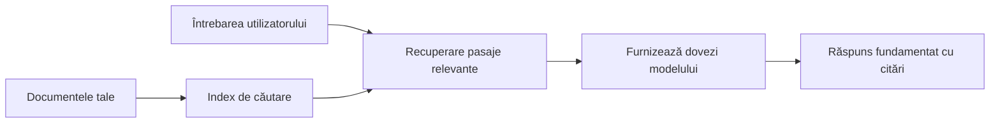

# Învățați AI să răspundă la întrebări bazându-se pe documentele dvs.:
## Seria 1: RAG, Azure vs alternative open-source și când are sens ajustarea fină

> Primul articol dintr-o serie din 2026 care revizuiește tutorialele mele din 2023 despre Azure AI Search + Azure OpenAI pentru QA pe documente.

Navigare serie: [Pagina principală a depozitului](../README.md) | Următorul: [Seria 2 - Construiește un sistem local RAG open-source complet](./series-2-open-source-rag-end-to-end.md)

## 1. Introducere - Revizuind un tutorial anterior despre RAG

În 2023, am lucrat la o pereche de tutoriale despre cum să înveți ChatGPT să răspundă la întrebări din documente PDF folosind Azure AI Search și Azure OpenAI. Am scris [versiunea LangChain](https://techcommunity.microsoft.com/blog/educatordeveloperblog/teach-chatgpt-to-answer-questions-using-azure-ai-search--azure-openai-lang-chain/3969713), iar de asemenea am coautorat versiunea însoțitoare [Semantic Kernel](https://techcommunity.microsoft.com/blog/educatordeveloperblog/teach-chatgpt-to-answer-questions-using-azure-ai-search--azure-openai-semantic-k/3985395) împreună cu [Lee Stott](https://developer.microsoft.com/en-us/advocates/lee-stott), Manager Principal Cloud Advocate la Microsoft. La acea vreme, ideea de „ChatGPT pe datele tale” încă părea nouă pentru mulți dezvoltatori. Tutorialele foloseau Azure Blob Storage, Azure AI Search, Azure OpenAI, LangChain, Semantic Kernel și recuperarea vectorială tip FAISS pentru a răspunde la întrebări din fișiere PDF.

Articolul anterior se concentra pe un flux simplu, dar important: încărcarea documentelor, indexarea lor, recuperarea conținutului relevant și solicitarea unui model să răspundă pe baza acelui conținut.

În 2026, ecosistemul RAG a crescut semnificativ. Azure AI Search suportă acum modele moderne de recuperare vectorială și hibridă, Azure OpenAI face parte din ecosistemul mai larg Microsoft Foundry Models, iar noul API v1 poate folosi clientul standard OpenAI fără a necesita schimbări lunare de `api-version`. În același timp, opțiuni open-source precum LangGraph, LlamaIndex, Haystack, Qdrant, Milvus, Weaviate, Chroma, Ollama și vLLM au devenit alegeri practice pentru sisteme RAG reale.

De aceea am vrut să revin asupra acestui subiect. Întrebarea nu mai este doar „Cum construiesc RAG?” Există acum multe moduri de a-l construi, iar întrebarea mai importantă este „Ce arhitectură ar trebui să aleg pentru situația mea?”

Dar problema de bază nu s-a schimbat.

Un model AI nu cunoaște automat documentele tale. Pentru a construi un sistem util de răspuns la întrebări bazat pe documente, ai nevoie în continuare de recuperare fiabilă, fundamentare, evaluare și fluxuri operaționale.

Acest articol nu este un alt tutorial complet „chat cu PDF”. Vreau să încep această serie actualizată cu întrebarea care mă interesează acum mai mult: când ar trebui să alegi o arhitectură gestionată Azure, când să alegi un stack RAG open-source și când are sens cu adevărat fine-tuning-ul?

Acesta este primul articol dintr-o serie despre construirea sistemelor AI fundamentate pe documente. În această primă parte, ne vom concentra pe deciziile arhitecturale: de ce contează RAG, când sunt utile serviciile gestionate pe bază de Azure, când sunt potrivite alternativele open-source și unde se încadrează fine-tuning-ul.

După construirea și revizuirea sistemelor document QA, am devenit mai puțin interesat de care unealtă arată cel mai bine într-un demo și mai interesat de ce arhitectură supraviețuiește utilizatorilor reali, documentelor în schimbare, permisiunilor, eșecurilor și mentenanței.

## 2. De ce AI-ul tău are nevoie de un sistem de căutare

Modelele mari de limbaj sunt antrenate pe date publice și licențiate extinse. Ele pot ști multe despre subiecte generale, dar nu cunosc automat PDF-urile tale private, politicile interne, procedurile companiei, arhivele de cercetare, materialele pentru clasă, notele de suport clienți sau documentația actualizată recent.

Un mod simplu de a gândi RAG este următorul: în loc să aștepți ca modelul să memoreze fiecare document, îi oferim un sistem de căutare. Când utilizatorul pune o întrebare, sistemul găsește mai întâi cele mai relevante bucăți de informație, apoi îi oferă modelului acele bucăți ca context.

Acest lucru contează deoarece multe surse de cunoștințe din lumea reală sunt private, în continuă schimbare, sensibile la permisiuni, stocate în mai multe sisteme, scrise în multe formate și prea mari pentru a fi inserate direct în prompt.

De exemplu, dacă o școală, o companie sau o echipă de cercetare are 10.000 de documente interne, modelul nu poate răspunde fiabil din acele documente decât dacă sistemul recuperează părțile potrivite la momentul potrivit.

Aceasta conduce natural la o întrebare comună:

De ce să nu folosim doar fine-tuning-ul modelului?

Fine-tuning-ul poate fi util, dar de obicei nu este primul instrument potrivit pentru cunoștințele din documente. Dacă informațiile se schimbă frecvent, dacă citările contează sau dacă permisiunile de acces sunt importante, RAG este de regulă punctul de plecare mai bun. Fine-tuning-ul se potrivește mai bine pentru a învăța comportament, stil, formatul ieșirii și tiparele sarcinilor.

## 3. Arhitectura RAG în practică

Imaginează-ți că construiești un asistent AI pentru o școală. Asistentul trebuie să răspundă la întrebări din PDF-uri de politici, ghiduri de curs, pagini interne FAQ și anunțuri actualizate recent.

Dacă un student întreabă „Pot folosi AI generativ pentru tema finală?”, sistemul nu ar trebui să răspundă din memoria generală a modelului. Ar trebui mai întâi să găsească politica școlii relevante, să recupereze secțiunea despre utilizarea AI și apoi să ceară modelului să răspundă folosind acea dovadă.

Așa funcționează RAG în practică.

La un nivel înalt, poți gândi fluxul astfel:

Detaliile pot deveni mai sofisticate, dar ideea de bază este simplă: modelul nu răspunde singur. Răspunde cu dovezi recuperate.

Mai întâi, documentele sunt preluate din sisteme de stocare precum Azure Blob Storage, SharePoint, GitHub sau un CMS intern. Apoi sistemul le parsează în text păstrând structuri utile precum titluri, numere de pagină, tabele, secțiuni și locații sursă.

Următorul pas este segmentarea conținutului în bucăți. Acest pas pare simplu, dar este unul dintre cele mai importante din sistem. Dacă o bucată este prea mică, poate pierde contextul din jur. Dacă bucata este prea mare, poate include informații irelevante și face recuperarea mai puțin precisă.

După segmentare, sistemul creează embeddings și le stochează într-un index căutabil împreună cu textul original și metadate precum numele fișierului, numărul paginii, permisiunile, versiunea documentului și URL-ul sursă.

Când utilizatorul pune o întrebare, sistemul recuperează bucățile candidate folosind căutare pe cuvinte-cheie, căutare vectorială sau căutare hibridă. Un reranker poate apoi reordona aceste bucăți astfel încât cele mai utile dovezi să fie plasate în partea de sus.

În final, modelul primește întrebarea și dovezile recuperate. Răspunsul ar trebui să fie fundamentat pe acele dovezi și să ofere citări astfel încât utilizatorul să poată verifica sursa.

Punctul important este că RAG nu înseamnă doar „pune PDF-urile într-o bază vectorială”. Calitatea răspunsului depinde de întregul flux: parsare, segmentare, recuperare, reranking, prompting, citare și evaluare.

De aceea contează structura documentului. Într-un PDF, un titlu, tabel, notă de subsol sau limita de pagină pot schimba sensul unui pasaj. Pe Azure, skill-ul Document Layout folosește capabilitățile Azure Document Intelligence de layout pentru a produce un output conștient de structură, ceea ce poate îmbunătăți calitatea segmentării și recuperării pentru sistemele RAG.

## 4. Ce s-a schimbat din 2023?

Tutorialul din 2023 a fost un bun punct de pornire pentru vremea lui:

- Azure Blob Storage stoca fișiere PDF.
- Azure AI Search indexa conținutul.
- LangChain conecta recuperarea la Azure OpenAI.
- FAISS funcționa ca un simplu vector store local.
- Exemplul folosea `gpt-35-turbo` și `text-embedding-ada-002`.

În 2026, o versiune modernă ar trebui să reflecte câteva schimbări.

În primul rând, recuperarea a evoluat. În 2023, multe demo-uri foloseau căutare simplă pe similaritate vectorială. Astăzi, recuperarea hibridă este adesea punctul de pornire implicit pentru QA serioasă pe documente. Azure AI Search suportă căutare hibridă prin combinarea în aceeași cerere a interogărilor pe cuvinte-cheie și vectori și îmbină rezultatele cu Reciprocal Rank Fusion. Semantic ranker poate apoi reordona partea text a rezultatelor full-text, vectoriale și hibride.

În al doilea rând, ingestia este mai sofisticată. În loc să segmentezi manual fiecare document cu cod, Azure AI Search suportă vectorizare integrată pentru segmentare, embedding și vectorizare în timp real la interogare. Pentru PDF-uri și sarcini cu volum mare de documente, skill-ul Document Layout poate păstra mai multă structură decât chunk-urile cu dimensiuni fixe.

În al treilea rând, orchestrarea contează mai mult. Partea dificilă adesea nu e apelul la API-ul LLM în sine. Partea dificilă este gestionarea eșecurilor, încercărilor repetate, recuperării învechite, calității bucăților, fluxurilor de lucru de durată lungă, revizuirii umane și evaluării la scară. Aici instrumentele orientate pe fluxuri de lucru precum LangGraph, fluxurile LlamaIndex, pipeline-urile Haystack și uneltele de evaluare și observabilitate la nivel de platformă devin mai relevante decât o simplă lanț liniar.

În al patrulea rând, evaluarea nu mai este opțională. Un demo poate părea impresionant cu o singură întrebare. Un sistem de producție are nevoie de seturi de test, verificări de regresie, metrici de recuperare, verificări de fundamentare și monitorizare. Fără evaluare, este greu de știut dacă sistemul se îmbunătățește sau doar se schimbă.

## 5. Alegerea între arhitecturi RAG Azure și open-source

Nu cred că întrebarea utilă este „Este Azure mai bun decât open source?” sau „Este open source mai bun decât Azure?”

Întrebarea utilă este: ce fel de sistem construiești, cine îl va opera, ce constrângeri ai și ce moduri de eșec sunt inacceptabile?

Când am început să construiesc exemple de QA pe documente, mă gândeam mai ales dacă recuperarea funcționează. Pot încărca PDF-uri, le pot căuta și genera un răspuns? Acesta era un punct de plecare rezonabil.

După ce am parcurs fluxuri de lucru AI mai realiste, evaluarea mea s-a schimbat. Acum privesc patru aspecte înainte de a alege un stack RAG:

- identitate și permisiuni
- calitatea recuperării
- fiabilitatea fluxului de lucru
- responsabilitatea operațională

Acele patru domenii spun mult mai mult decât un simplu benchmark al modelului.

Arhitecturile bazate pe Azure au sens de obicei când integrarea în întreprindere este partea dificilă. Dacă o echipă depinde deja de Microsoft Entra ID, Microsoft 365, Azure Storage, rețele private, RBAC și monitorizare Azure, Azure AI Search și Azure OpenAI pot reduce mult din complexitatea operațională. În acel mediu, Azure nu este doar un API de model. Valoarea este sistemul înconjurător: identitate, guvernanță, căutare gestionată, integrare securitate, suport și operațiuni familiare.

Arhitecturile open-source au sens când flexibilitatea este partea dificilă. Dacă echipa are nevoie de inferență locală, portabilitate în cloud, un pipeline personalizat de recuperare, reranking specializat sau control direct asupra bazei vectoriale și stratului de servire a modelului, un stack open-source poate fi soluția mai bună. Compromisul este că echipa preia mai mult din responsabilitatea pentru fiabilitate: backupuri, scalare, latență, migrații, monitorizare și securitate.

În practică, multe sisteme AI de producție nu sunt pur cloud-native sau pur open-source. Sunt adesea sisteme hibride care echilibrează simplitatea operațională, portabilitatea, guvernanța și flexibilitatea ingineriei.

De exemplu, nu m-ar surprinde un sistem care folosește Azure OpenAI pentru accesul la modele, LangGraph pentru orchestrarea fluxului de lucru, gazduire Azure pentru deploy și o bază vectorială open-source pentru o cerință specifică de recuperare. Aceasta nu este o inconsistență arhitecturală. Este alegerea nivelului potrivit de serviciu gestionat și control ingineresc pentru fiecare parte a sistemului.

Îmi plac arhitecturile hibride când platforma gestionată rezolvă probleme importante enterprise, iar componentele open-source oferă echipei flexibilitatea unde contează cu adevărat.

## 6. Un ghid practic pentru decizii

Iată tabelul de decizie pe care l-aș folosi cu o echipă înainte de a alege un stack RAG:

| Domeniul deciziei | Stack gestionat Azure este mai puternic când... | Stack-ul open-source este mai puternic când... |
| --- | --- | --- |
| Identitate și acces | Entra ID, RBAC, identitate gestionată și permisiuni enterprise sunt centrale | dominate de autentificare personalizată, identitate non-Microsoft sau logică de acces specifică aplicației |
| Operațiuni | echipa vrea infrastructură gestionată, suport, SLA-uri și onboardare simplificată | echipa poate opera baze vectoriale, servirea modelelor, backupuri și scalare |
| Recuperare | căutarea hibridă, rang semantic, filtre și căutări pe metadate acoperă majoritatea nevoilor | echipa are nevoie de recuperare personalizată, reranking specializat sau indexare experimentală |
| Portabilitate | alinierea la ecosistemul Azure este acceptabilă sau preferată | evitarea lock-in-ului în cloud este o cerință fermă |
| Inferență | guvernanță Azure OpenAI, rețelistică și controale enterprise contează | inferență locală, modele personalizate sau servire auto-găzduită sunt necesare |
| Cost | reducerea efortului de inginerie și operațiuni contează mai mult decât optimizarea infrastructurii | scara este suficient de mare pentru a justifica optimizarea atentă a infrastructurii |
| Experimentare | stabilitatea și integrarea enterprise contează mai mult decât schimbarea frecventă a componentelor | echipa iterează rapid asupra agenților, uneltelor, memoriei și fluxurilor de recuperare |

Regula mea de bază este simplă:

- Începe cu Azure când integrarea enterprise, securitatea și simplitatea operațională sunt cele mai mari riscuri.
- Începe cu open source când portabilitatea, personalizarea sau controlul local sunt cele mai mari riscuri.
- Folosește un stack hibrid când ambele sunt adevărate.

De aceea nu aș începe o serie RAG 2026 cu codul întâi. Codul este important, dar alegerea arhitecturii vine înaintea implementării. Un demo simplu poate ascunde cele mai dificile alegeri. Un sistem RAG bun face acele alegeri explicite.

## 7. Unde se potrivește fine-tuning-ul

Fine-tuning-ul este adesea menționat împreună cu RAG, dar cred că este important să le separăm.

RAG este de regulă alegerea mai bună când sistemul are nevoie de cunoștințe proaspete, private, sensibile la permisiuni sau fundamentate pe sursă. Dacă răspunsul trebuie să citeze documente, să reflecte actualizări recente sau să respecte reguli de acces specifice utilizatorului, recuperarea trebuie să fie parte din arhitectură.
Ajustarea fină este mai utilă atunci când cunoașterea nu este principala problemă. Poate ajuta atunci când dorești ca modelul să urmeze un format specific de ieșire, să corespundă unui stil de răspuns specific domeniului, să execute o sarcină stabilă mai consistent sau să reducă cantitatea de instrucțiuni necesare în fiecare solicitare.

În practică, cele două pot funcționa împreună. Un asistent de suport ar putea folosi RAG pentru a prelua cea mai recentă politică, în timp ce un model ajustat fin învață structura și tonul preferat al răspunsului companiei.

Greșeala este să tratezi ajustarea fină ca pe un înlocuitor pentru un depozit de documente. Aceasta nu elimină nevoia de recuperare când sistemul trebuie să răspundă din date proaspete, private sau sensibile din punct de vedere al permisiunilor.

## 8. Unde merge această serie în continuare

Acest articol reprezintă stratul de luare a deciziilor. Înainte de a scrie cod, am vrut să fac compromisurile explicite: RAG vs ajustare fină, Azure vs open source, servicii gestionate vs control operațional.

Înainte de a trece la implementare, vreau să las aici un punct: în multe sisteme AI de întreprindere, modelul este doar un component. Calitatea recuperării, orchestrarea, evaluarea, permisiunile și fiabilitatea operațională sunt adesea cele care determină dacă sistemul reușește dincolo de etapa demo.

În următoarele părți ale acestei serii, intenționez să merg mai adânc în partea practică a sistemelor AI bazate pe documente: construind mai întâi un flux de lucru local open-source RAG, apoi reconstruind același scenariu cu Azure AI Search și Azure OpenAI, și apoi evaluând dacă sistemul funcționează cu adevărat.

Este posibil să ajustez ordinea pe măsură ce seria se dezvoltă, dar scopul va rămâne același: să depășim un demo simplu și să arătăm cum să gândim despre sistemele RAG care pot fi întreținute, evaluate și operate.

## 9. Referințe și Resurse

Tutoriale originale:

- [Teach ChatGPT to Answer Questions: Using Azure AI Search & Azure OpenAI (Lang Chain)](https://techcommunity.microsoft.com/blog/educatordeveloperblog/teach-chatgpt-to-answer-questions-using-azure-ai-search--azure-openai-lang-chain/3969713)
- [Teach ChatGPT to Answer Questions: Using Azure AI Search & Azure OpenAI (Semantic Kernel)](https://techcommunity.microsoft.com/blog/educatordeveloperblog/teach-chatgpt-to-answer-questions-using-azure-ai-search--azure-openai-semantic-k/3985395)

Azure:

- [Versiunile API REST Azure AI Search](https://learn.microsoft.com/en-us/rest/api/searchservice/search-service-api-versions)
- [Căutare hibridă în Azure AI Search](https://learn.microsoft.com/en-us/azure/search/hybrid-search-how-to-query)
- [Vectorizare integrată în Azure AI Search](https://learn.microsoft.com/en-us/azure/search/vector-search-integrated-vectorization)
- [Competență Document Layout în Azure AI Search](https://learn.microsoft.com/en-us/azure/search/cognitive-search-skill-document-intelligence-layout)
- [Segmentare și vectorizare în funcție de aspectul documentului](https://learn.microsoft.com/en-us/azure/search/search-how-to-semantic-chunking)
- [Clasare semantică în Azure AI Search](https://learn.microsoft.com/en-us/azure/search/semantic-search-overview)
- [Ciclul de viață al versiunilor API Azure OpenAI / Microsoft Foundry](https://learn.microsoft.com/en-us/azure/foundry/openai/api-version-lifecycle)
- [Modele Foundry vândute direct de Azure](https://learn.microsoft.com/en-us/azure/foundry/foundry-models/concepts/models-sold-directly-by-azure)
- [Considerații pentru ajustarea fină Microsoft Foundry](https://learn.microsoft.com/en-us/azure/foundry/openai/concepts/fine-tuning-considerations)
- [Observabilitate Microsoft Foundry](https://learn.microsoft.com/en-us/azure/foundry/concepts/observability)
- [Execută evaluări în Microsoft Foundry](https://learn.microsoft.com/en-us/azure/foundry/how-to/evaluate-generative-ai-app)

Open-source:

- [Documentație LangGraph](https://docs.langchain.com/oss/python/langgraph/overview)
- [Documentație LlamaIndex](https://developers.llamaindex.ai/python/framework/)
- [Documentație Haystack](https://docs.haystack.deepset.ai/)
- [Documentație Qdrant](https://qdrant.tech/documentation/overview/)
- [Documentație Milvus](https://milvus.io/docs/overview.md)
- [Documentație Weaviate](https://docs.weaviate.io/weaviate/current/)
- [Documentație Chroma](https://docs.trychroma.com/docs/overview/introduction)
- [Embedări Ollama](https://docs.ollama.com/capabilities/embeddings)
- [Server vLLM compatibil OpenAI](https://docs.vllm.ai/en/latest/serving/openai_compatible_server.html)
- [Modele de embedding BGE](https://huggingface.co/BAAI/bge-large-en-v1.5)
- [Modele de embedding E5](https://huggingface.co/intfloat/e5-large-v2)
- [Modele de embedding Instructor](https://huggingface.co/hkunlp/instructor-large)

Următorul: [Seria 2 - Construiește un sistem RAG open-source local de la capăt la capăt](./series-2-open-source-rag-end-to-end.md)

---

<!-- CO-OP TRANSLATOR DISCLAIMER START -->
**Declinare a responsabilității**:
Acest document a fost tradus folosind serviciul de traducere AI [Co-op Translator](https://github.com/Azure/co-op-translator). În timp ce ne străduim pentru acuratețe, vă rugăm să rețineți că traducerile automate pot conține erori sau inexactități. Documentul original în limba sa nativă trebuie considerat sursa autorizată. Pentru informații critice, se recomandă traducerea profesională realizată de un om. Nu ne asumăm responsabilitatea pentru eventualele neînțelegeri sau interpretări greșite care decurg din utilizarea acestei traduceri.
<!-- CO-OP TRANSLATOR DISCLAIMER END -->