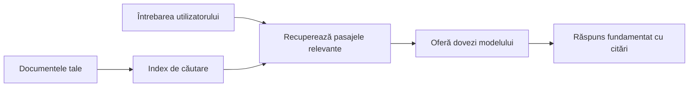

# Învață AI să Răspundă la Întrebări Bazate pe Documentele Tale:
## Seria 1: RAG, Azure vs Alternative Open-Source și Când Are Sens Ajustarea Fină

> Primul articol dintr-o serie din 2026 care revizitează tutorialele mele din 2023 despre Azure AI Search + Azure OpenAI pentru QA pe documente.

## 1. Introducere - Revizuind un Tutorial RAG Anterior

În 2023, am lucrat la o pereche de tutoriale despre cum să înveți ChatGPT să răspundă la întrebări din documente PDF folosind Azure AI Search și Azure OpenAI. Am scris versiunea [LangChain](https://techcommunity.microsoft.com/blog/educatordeveloperblog/teach-chatgpt-to-answer-questions-using-azure-ai-search--azure-openai-lang-chain/3969713), iar de asemenea am co-autorizat versiunea companion [Semantic Kernel](https://techcommunity.microsoft.com/blog/educatordeveloperblog/teach-chatgpt-to-answer-questions-using-azure-ai-search--azure-openai-semantic-k/3985395) împreună cu [Lee Stott](https://developer.microsoft.com/en-us/advocates/lee-stott), Manager Principal Cloud Advocate la Microsoft. La acea vreme, ideea de „ChatGPT pe datele tale” încă părea nouă pentru mulți dezvoltatori. Tutorialele foloseau Azure Blob Storage, Azure AI Search, Azure OpenAI, LangChain, Semantic Kernel și recuperare de tip FAISS pentru a răspunde la întrebări din fișiere PDF.

Acest articol anterior s-a concentrat pe un flux simplu, dar important: încarcă documentele, indexează-le, recuperează conținutul relevant și cere unui model să răspundă bazat pe acel conținut.

În 2026, ecosistemul RAG a crescut semnificativ. Azure AI Search suportă acum tipare moderne de recuperare vectorială și hibridă, Azure OpenAI face parte din ecosistemul mai larg Microsoft Foundry Models, iar noul API v1 poate folosi clientul standard OpenAI fără a necesita schimbări lunare de `api-version`. În același timp, opțiuni open-source precum LangGraph, LlamaIndex, Haystack, Qdrant, Milvus, Weaviate, Chroma, Ollama și vLLM au devenit opțiuni practice pentru sisteme RAG reale.

De aceea am vrut să revin asupra acestui subiect. Întrebarea nu mai este doar „Cum construiesc RAG?” Există acum multe moduri de a-l construi, iar întrebarea mai importantă este „Ce arhitectură ar trebui să aleg pentru situația mea?”

Dar problema de bază nu s-a schimbat.

Un model AI nu știe automat documentele tale. Pentru a construi un sistem util de răspuns la întrebări pe documente, ai nevoie în continuare de recuperare fiabilă, fundamentare (grounding), evaluare și fluxuri operaționale.

Acest articol nu este un alt tutorial end-to-end „chat cu PDF”. Vreau să încep această serie actualizată cu întrebarea care mă interesează acum mai mult: când ar trebui să alegi o arhitectură gestionată Azure, când un stack RAG open-source și când are sens ajustarea fină?

Acesta este primul articol dintr-o serie despre construirea sistemelor AI fundamentate pe documente. În această primă parte, ne vom concentra pe deciziile arhitecturale: de ce contează RAG, când serviciile gestionate Azure sunt utile, când alternativele open-source sunt potrivite și unde se potrivește ajustarea fină.

După ce am construit și revizitat sisteme QA pe documente, am devenit mai puțin interesat de ce unealtă arată mai bine într-o demonstrație și mai interesat de ce arhitectură supraviețuiește utilizatorilor reali, documentelor schimbătoare, permisiunilor, eșecurilor și mentenanței.

## 2. De Ce AI-ul Tău Are Nevoie de un Sistem de Căutare

Modelele mari de limbaj sunt antrenate pe date publice și licențiate extinse. Ele pot ști multe despre subiecte generale, dar nu știu automat PDF-urile tale private, politicile interne, procedurile firmei, arhivele de cercetare, materialele clasei, notele de suport pentru clienți sau documentația actualizată recent.

Un mod simplu de a vedea RAG este acesta: în loc să aștepți ca modelul să memoreze fiecare document, îi dai un sistem de căutare. Când un utilizator pune o întrebare, sistemul găsește mai întâi cele mai relevante bucăți de informații, apoi le oferă modelului ca context.

Acest lucru contează pentru că multe surse reale de cunoștințe sunt private, în schimbare constantă, sensibile la permisiuni, stocate în sisteme multiple, scrise în multe formate și prea mari pentru a fi copiate direct în prompt.

De exemplu, dacă o școală, o companie sau o echipă de cercetare are 10.000 de documente interne, modelul nu poate răspunde fiabil din acele documente decât dacă sistemul recuperează părțile potrivite la momentul potrivit.

Aceasta duce firesc la o întrebare frecventă:

De ce să nu ajustezi fin modelul?

Ajustarea fină poate fi utilă, dar de obicei nu este prima unealtă potrivită pentru cunoștințe din documente. Dacă cunoștințele se schimbă des, dacă citările contează sau dacă permisiunile de acces sunt importante, RAG este de obicei punctul de plecare mai bun. Ajustarea fină este mai potrivită pentru a învăța comportamente, stil, formatul ieșirii și tipare de sarcini.

## 3. Arhitectura RAG în Practică

Imaginează-ți că construiești un asistent AI pentru o școală. Asistentul trebuie să răspundă la întrebări din PDF-uri cu politici, ghiduri de curs, pagini FAQ interne și anunțuri actualizate recent.

Dacă un elev întreabă: „Pot folosi AI generativ pentru tema finală?”, sistemul nu ar trebui să răspundă din memoria generală a modelului. Mai întâi ar trebui să găsească politica școlii relevantă, să recupereze secțiunea despre utilizarea AI și apoi să ceară modelului să răspundă folosind acea dovadă.

Aceasta este RAG în practică.

La nivel înalt, fluxul poate fi gândit astfel:

Detaliile pot deveni mai sofisticate, dar ideea de bază este simplă: modelul nu răspunde singur. Răspunde cu dovezi recuperate.

Mai întâi, documentele sunt preluate din sisteme de stocare precum Azure Blob Storage, SharePoint, GitHub sau un CMS intern. Apoi sistemul le analizează în text păstrând structura utilă precum titluri, numere de pagină, tabele, secțiuni și locațiile de proveniență.

În continuare, conținutul este împărțit în bucăți (chunks). Acest pas sună simplu, dar este una dintre cele mai importante părți ale sistemului. Dacă o bucată este prea mică, poate pierde contextul înconjurător. Dacă este prea mare, poate include informații irelevante și face recuperarea mai puțin precisă.

După împărțire, sistemul creează embedding-uri și le stochează într-un index căutabil împreună cu textul original și metadate precum numele fișierului, numărul paginii, permisiunile, versiunea documentului și URL-ul sursă.

Când utilizatorul pune o întrebare, sistemul recuperează bucățile candidate folosind căutare pe cuvinte-cheie, căutare vectorială sau căutare hibridă. Un reranker poate reordona apoi aceste bucăți astfel încât cele mai utile dovezi să fie plasate apropiat de început.

În final, modelul primește întrebarea și dovezile recuperate. Răspunsul trebuie să fie fundamentat pe acele dovezi și să returneze citări pentru ca utilizatorul să poată verifica sursa.

Punctul important este că RAG nu este doar „pune PDF-urile într-o bază de date vectorială.” Calitatea răspunsului depinde de întregul flux de lucru: parsare, împărțire, recuperare, reranking, prompting, citare și evaluare.

De aceea contează structura documentului. Într-un PDF, un titlu, tabel, notă de subsol sau margine de pagină poate schimba sensul unui pasaj. Pe Azure, skill-ul Document Layout folosește capabilitățile Azure Document Intelligence pentru a oferi o ieșire conștientă de structură, ceea ce poate îmbunătăți calitatea împărțirii și a recuperării pentru sistemele RAG.

## 4. Ce S-a Schimbat Din 2023?

Tutorialul din 2023 a fost un punct de plecare bun pentru vremea sa:

- Azure Blob Storage stoca fișiere PDF.
- Azure AI Search indexa conținutul.
- LangChain conecta recuperarea la Azure OpenAI.
- FAISS funcționa ca un simplu magazin vectorial local.
- Exemplul folosea `gpt-35-turbo` și `text-embedding-ada-002`.

În 2026, o versiune modernă ar trebui să reflecte mai multe schimbări.

În primul rând, recuperarea a evoluat. În 2023, multe demonstrații foloseau căutare simplă prin similitudine vectorială. Astăzi, recuperarea hibridă este adesea punctul de plecare implicit pentru QA serioasă pe documente. Azure AI Search suportă căutare hibridă combinând interogări pe cuvinte-cheie și vectoriale într-o singură cerere și fuzionează rezultatele cu Reciprocal Rank Fusion. Semantic ranker poate reranka apoi partea de text a rezultatelor full-text, vectoriale și hibride.

În al doilea rând, ingestia este mai sofisticată. În loc să spargi manual fiecare document cu cod de aplicație, Azure AI Search suportă vectorizare integrată pentru împărțirea în bucăți, embedding și vectorizare în timpul interogării. Pentru PDF-uri și sarcini cu documente numeroase, skill-ul Document Layout poate păstra mai multă structură decât bucățile de dimensiune fixă.

În al treilea rând, orchestrarea contează mai mult. Partea dificilă nu este adesea apelul API al LLM în sine. Este greu să gestionezi eșecurile, retrierile, recuperarea învechită, calitatea bucăților, fluxurile lungi, revizuirea umană și evaluarea la scară largă. Aici unelte orientate pe workflow precum LangGraph, fluxurile LlamaIndex, pipeline-urile Haystack și uneltele de evaluare și observabilitate la nivel de platformă devin mai relevante decât un lanț liniar unic.

În al patrulea rând, evaluarea nu mai este opțională. O demonstrație poate impresiona cu o singură întrebare. Un sistem de producție are nevoie de seturi de test, verificări de regresie, metrici de recuperare, verificări de fundamentare și monitorizare. Fără evaluare, este dificil să știi dacă sistemul se îmbunătățește sau doar se schimbă.

## 5. Alegerea Între Stack-uri RAG Azure și Open-Source

Nu cred că întrebarea utilă este „Este Azure mai bun decât open source?” sau „Este open source mai bun decât Azure?”

Întrebarea utilă este: ce tip de sistem construiești, cine îl va opera, ce constrângeri ai și ce moduri de eșec sunt inacceptabile?

Când am început să construiesc exemple de QA pe documente, mă gândeam mai ales dacă recuperarea funcționa. Puteam încărca PDF-uri, le puteam căuta și genera un răspuns? Era un punct de plecare rezonabil.

După ce am parcurs fluxuri AI mai realiste, evaluarea mea s-a schimbat. Acum privesc patru aspecte înainte de a alege un stack RAG:

- identitate și permisiuni
- calitatea recuperării
- fiabilitatea fluxului de lucru
- responsabilitatea operațională

Aceste patru domenii spun mult mai multe decât un benchmark doar pentru model.

Arhitecturile bazate pe Azure au sens de obicei când integrarea enterprise este partea grea. Dacă o echipă depinde deja de Microsoft Entra ID, Microsoft 365, Azure Storage, rețele private, RBAC și monitorizare Azure, Azure AI Search și Azure OpenAI pot reduce multă complexitate operațională. În acel mediu, Azure nu este doar un API pentru model. Valoarea este sistemul înconjurător: identitate, guvernanță, căutare gestionată, integrare de securitate, suport și operațiuni familiare.

Arhitecturile open-source au sens de obicei când flexibilitatea este partea grea. Dacă echipa are nevoie de inferență locală, portabilitate în cloud, un pipeline personalizat de recuperare, reranking specializat sau control direct asupra bazei de date vectoriale și stratului de servire a modelului, un stack open-source poate fi mai potrivit. Compromisul este că echipa trebuie să gestioneze mai multă muncă legată de fiabilitate: backupuri, scalare, latență, migrații, monitorizare și securitate.

În practică, multe sisteme AI de producție nu sunt pur cloud-native sau pur open-source. Sunt de multe ori sisteme hibride care echilibrează simplitatea operațională, portabilitatea, guvernanța și flexibilitatea de inginerie.

De exemplu, nu m-ar surprinde să văd un sistem care folosește Azure OpenAI pentru acces la model, LangGraph pentru orchestrarea fluxului de lucru, hosting Azure pentru implementare și o bază de date vectorială open-source pentru o cerință specifică de recuperare. Aceasta nu este o inconsistență arhitecturală. Este alegerea nivelului potrivit de serviciu gestionat și control ingineresc pentru fiecare parte a sistemului.

Îmi plac arhitecturile hibride când platforma gestionată rezolvă probleme enterprise importante, în timp ce componentele open-source dau echipei flexibilitate acolo unde contează cu adevărat.

## 6. Un Ghid Practic de Decizie

Iată tabelul de decizie pe care l-aș folosi cu o echipă înainte de a alege un stack RAG:

| Domeniu decizie | Stack-ul gestionat Azure este mai puternic când... | Stack-ul open-source este mai puternic când... |
| --- | --- | --- |
| Identitate și acces | Entra ID, RBAC, identitate gestionată și permisiuni enterprise sunt esențiale | autentificare personalizată, identitate non-Microsoft sau logică app-specifică domină |
| Operațiuni | echipa dorește infrastructură gestionată, suport, SLA-uri și onboarding mai simplu | echipa poate opera baze de date vectoriale, servire de modele, backupuri și scalare |
| Recuperare | căutarea hibridă, rankare semantică, filtre și căutare pe metadate acoperă majoritatea nevoilor | echipa are nevoie de recuperare personalizată, reranking specializat sau indexare experimentală |
| Portabilitate | alinierea cu ecosistemul Azure este acceptabilă sau preferată | evitarea lock-in-ului în cloud este o cerință strictă |
| Inferență | guvernanța, rețelele și controalele enterprise Azure OpenAI contează | este necesară inferență locală, modele personalizate sau servire self-hosted |
| Cost | reducerea efortului de inginerie și operațiuni contează mai mult decât optimizarea infrastructurii | scara este suficient de mare pentru a justifica optimizări atente ale infrastructurii |
| Experimentare | stabilitatea și integrarea enterprise contează mai mult decât schimbarea frecventă a componentelor | echipa iterează rapid pe agenți, unelte, memorie și fluxuri de recuperare |

Regula mea practică este simplă:

- Începe cu Azure când integrarea enterprise, securitatea și simplitatea operațională sunt riscurile majore.
- Începe cu open source când portabilitatea, personalizarea sau controlul local sunt riscurile majore.
- Folosește un stack hibrid când ambele sunt adevărate.

De aceea nu aș începe o serie RAG din 2026 cu codul întâi. Codul este important, dar selecția arhitecturii vine înainte de implementare. O demonstrație simplă poate ascunde cele mai grele alegeri. Un sistem RAG bun face acele alegeri explicite.

## 7. Unde Se Potrivește Ajustarea Fină

Ajustarea fină este adesea menționată împreună cu RAG, dar cred că este important să le separăm.

RAG este de obicei alegerea mai bună când sistemul are nevoie de cunoștințe proaspete, private, sensibile la permisiuni sau fundamentate pe surse. Dacă răspunsul trebuie să citeze documente, să reflecte actualizări recente sau să respecte reguli specifice de acces, recuperarea ar trebui să facă parte din arhitectură.

Ajustarea fină este mai utilă când cunoștințele nu sunt problema principală. Poate ajuta când dorești ca modelul să urmeze un format specific de ieșire, să corespundă unui stil de răspuns domenial, să execute o sarcină stabilă mai consistent sau să reducă cantitatea de instrucțiuni necesare în fiecare prompt.
În practică, cele două pot funcționa împreună. Un asistent de suport ar putea folosi RAG pentru a recupera cea mai recentă politică, în timp ce un model antrenat fin învață structura și tonul preferat de companie pentru răspunsuri.

Greșeala este să tratezi fine-tuning-ul ca pe un înlocuitor pentru un depozit de documente. Acesta nu elimină necesitatea recuperării atunci când sistemul trebuie să răspundă pe baza unor date noi, private sau sensibile la permisiuni.

## 8. Unde merge mai departe această serie

Acest articol reprezintă stratul decizional. Înainte de a scrie cod, am vrut să fac compromisurile explicite: RAG versus fine-tuning, Azure versus open source, servicii gestionate versus control operațional.

Înainte de a trece la implementare, vreau să las aici un punct: în multe sisteme AI enterprise, modelul este doar o componentă. Calitatea recuperării, orchestrarea, evaluarea, permisiunile și fiabilitatea operațională sunt adesea cele care determină dacă sistemul reușește să meargă dincolo de stadiul demo.

În următoarele părți ale acestei serii, intenționez să intru mai adânc în partea practică a sistemelor AI bazate pe documente: cum să construiești o arhitectură bazată pe Azure, cum se compară alternativele open source în practică și cum să evaluezi dacă un sistem RAG funcționează cu adevărat.

Pot ajusta ordinea pe măsură ce seria se dezvoltă, dar scopul va rămâne același: să mergem dincolo de un demo simplu și să arătăm cum să gândești despre sistemele RAG care pot fi întreținute, evaluate și operate.

## 9. Referințe și Resurse

Tutoriale originale:

- [Teach ChatGPT to Answer Questions: Using Azure AI Search & Azure OpenAI (Lang Chain)](https://techcommunity.microsoft.com/blog/educatordeveloperblog/teach-chatgpt-to-answer-questions-using-azure-ai-search--azure-openai-lang-chain/3969713)
- [Teach ChatGPT to Answer Questions: Using Azure AI Search & Azure OpenAI (Semantic Kernel)](https://techcommunity.microsoft.com/blog/educatordeveloperblog/teach-chatgpt-to-answer-questions-using-azure-ai-search--azure-openai-semantic-k/3985395)

Azure:

- [Azure AI Search REST API versions](https://learn.microsoft.com/en-us/rest/api/searchservice/search-service-api-versions)
- [Hybrid search in Azure AI Search](https://learn.microsoft.com/en-us/azure/search/hybrid-search-how-to-query)
- [Integrated vectorization in Azure AI Search](https://learn.microsoft.com/en-us/azure/search/vector-search-integrated-vectorization)
- [Document Layout skill in Azure AI Search](https://learn.microsoft.com/en-us/azure/search/cognitive-search-skill-document-intelligence-layout)
- [Chunk and vectorize by document layout](https://learn.microsoft.com/en-us/azure/search/search-how-to-semantic-chunking)
- [Semantic ranking in Azure AI Search](https://learn.microsoft.com/en-us/azure/search/semantic-search-overview)
- [Azure OpenAI / Microsoft Foundry API version lifecycle](https://learn.microsoft.com/en-us/azure/foundry/openai/api-version-lifecycle)
- [Foundry Models sold by Azure](https://learn.microsoft.com/en-us/azure/foundry/foundry-models/concepts/models-sold-directly-by-azure)
- [Microsoft Foundry fine-tuning considerations](https://learn.microsoft.com/en-us/azure/foundry/openai/concepts/fine-tuning-considerations)
- [Microsoft Foundry observability](https://learn.microsoft.com/en-us/azure/foundry/concepts/observability)
- [Run evaluations in Microsoft Foundry](https://learn.microsoft.com/en-us/azure/foundry/how-to/evaluate-generative-ai-app)

Open-source:

- [LangGraph documentation](https://docs.langchain.com/oss/python/langgraph/overview)
- [LlamaIndex documentation](https://developers.llamaindex.ai/python/framework/)
- [Haystack documentation](https://docs.haystack.deepset.ai/)
- [Qdrant documentation](https://qdrant.tech/documentation/overview/)
- [Milvus documentation](https://milvus.io/docs/overview.md)
- [Weaviate documentation](https://docs.weaviate.io/weaviate/current/)
- [Chroma documentation](https://docs.trychroma.com/docs/overview/introduction)
- [Ollama embeddings](https://docs.ollama.com/capabilities/embeddings)
- [vLLM OpenAI-compatible server](https://docs.vllm.ai/en/latest/serving/openai_compatible_server.html)
- [BGE embedding models](https://huggingface.co/BAAI/bge-large-en-v1.5)
- [E5 embedding models](https://huggingface.co/intfloat/e5-large-v2)
- [Instructor embedding models](https://huggingface.co/hkunlp/instructor-large)

---

<!-- CO-OP TRANSLATOR DISCLAIMER START -->
**Declinare a responsabilității**:
Acest document a fost tradus folosind serviciul de traducere AI [Co-op Translator](https://github.com/Azure/co-op-translator). În timp ce ne străduim pentru acuratețe, vă rugăm să rețineți că traducerile automate pot conține erori sau inexactități. Documentul original în limba sa nativă trebuie considerat sursa autorizată. Pentru informații critice, se recomandă traducerea profesională realizată de un om. Nu ne asumăm responsabilitatea pentru eventualele neînțelegeri sau interpretări greșite care decurg din utilizarea acestei traduceri.
<!-- CO-OP TRANSLATOR DISCLAIMER END -->