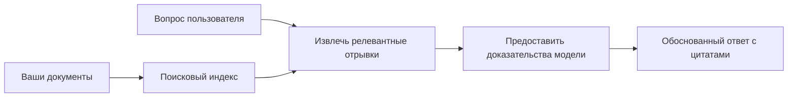

# Обучите ИИ отвечать на вопросы на основе ваших документов:
## Серия 1: RAG, Azure против альтернатив с открытым исходным кодом и когда имеет смысл дообучение

> Первая статья в серии 2026 года, пересматривающая мои учебные материалы 2023 года по Azure AI Search + Azure OpenAI по вопросно-ответным системам на основе документов.

Навигация по серии: [Главная репозитория](../README.md) | Далее: [Серия 2 - Создание локальной RAG-системы с открытым исходным кодом от начала до конца](./series-2-open-source-rag-end-to-end.md)

## 1. Введение - Повторное рассмотрение предыдущего учебного пособия по RAG

В 2023 году я работал над двумя учебными пособиями о том, как обучить ChatGPT отвечать на вопросы по PDF-документам с помощью Azure AI Search и Azure OpenAI. Я написал [версию на LangChain](https://techcommunity.microsoft.com/blog/educatordeveloperblog/teach-chatgpt-to-answer-questions-using-azure-ai-search--azure-openai-lang-chain/3969713), а также был соавтором сопутствующей [версии Semantic Kernel](https://techcommunity.microsoft.com/blog/educatordeveloperblog/teach-chatgpt-to-answer-questions-using-azure-ai-search--azure-openai-semantic-k/3985395) вместе с [Ли Стоттом](https://developer.microsoft.com/en-us/advocates/lee-stott), главным менеджером по продвижению облачных решений в Microsoft. В то время идея «ChatGPT на ваших данных» была новинкой для многих разработчиков. Учебные материалы использовали Azure Blob Storage, Azure AI Search, Azure OpenAI, LangChain, Semantic Kernel и поиск по векторам в стиле FAISS для ответа на вопросы по PDF-файлам.

Тот более ранний материал фокусировался на простом, но важном рабочем процессе: загрузить документы, индексировать их, извлечь релевантный контент и попросить модель ответить на основе этого контента.

В 2026 году экосистема RAG значительно выросла. Azure AI Search теперь поддерживает современные паттерны векторного и гибридного поиска, Azure OpenAI входит в более широкую экосистему моделей Microsoft Foundry, а новая версия API v1 может использовать стандартный клиент OpenAI без необходимости ежемесячных изменений `api-version`. В то же время опенсорсные варианты, такие как LangGraph, LlamaIndex, Haystack, Qdrant, Milvus, Weaviate, Chroma, Ollama и vLLM стали практичными вариантами для реальных RAG-систем.

Именно поэтому я хотел вернуться к этой теме. Вопрос теперь уже не просто «Как построить RAG?» Сейчас существует много способов его построения, а более важный вопрос — «Какую архитектуру выбрать для своей ситуации?»

Но основная проблема не изменилась.

Модель ИИ не знает ваши документы автоматически. Чтобы построить полезную систему ответов на вопросы на основе документов, вам по-прежнему нужны надежный поиск, привязка, оценка и операционные процессы.

Эта статья — не очередное учебное пособие по взаимодействию с PDF от начала до конца. Я хочу начать обновленную серию с вопроса, который меня волнует больше: когда стоит выбирать управляемую архитектуру Azure, когда — стек RAG с открытым исходным кодом, и когда действительно имеет смысл дообучение?

Это первая статья в серии о построении AI-систем с опорой на документы. В первой части мы сосредоточимся на архитектурных решениях: почему важен RAG, когда полезны управляемые сервисы Azure, когда оправданы альтернативы с открытым исходным кодом и какова роль дообучения.

После построения и повторного рассмотрения систем QA для документов я стал меньше интересоваться тем, какой инструмент лучше выглядит в демо, и больше — какой архитектуре под силу выдержать реальных пользователей, меняющиеся документы, разрешения, сбои и обслуживание.

## 2. Почему вашему ИИ нужна система поиска

Большие языковые модели обучаются на объемных публичных и лицензированных данных. Они могут знать много общего, но не знают ваши приватные PDF, внутренние политики, корпоративные процедуры, архивы исследований, учебные материалы, записи службы поддержки или недавно обновленную документацию.

Простой способ понять RAG: вместо того чтобы ждать от модели запоминания каждого документа, мы даем ей систему поиска. Когда пользователь задает вопрос, система сначала находит самые релевантные куски информации, а затем передает их модели в качестве контекста.

Это важно, потому что многие источники знаний в реальном мире приватны, постоянно меняются, чувствительны к разрешениям доступа, хранятся в разных системах, представлены в разных форматах и слишком объемны, чтобы вставить их напрямую в подсказку.

Например, если в школе, компании или исследовательской группе есть 10 000 внутренних документов, модель не сможет надежно ответить на их основе без своевременного извлечения нужных частей системы.

Это естественно приводит к распространенному вопросу:

Почему бы просто не дообучить модель?

Дообучение может быть полезным, но обычно не является первым инструментом для работы с документальными знаниями. Если знания часто меняются, если важны ссылки или права доступа, RAG обычно лучший старт. Дообучение лучше подходит для обучения поведения, стиля, формата вывода и шаблонов задач.

## 3. Архитектура RAG на практике

Представьте, что вы создаете ИИ-помощника для школы. Помощник должен отвечать на вопросы из PDF с политиками, из руководств курсов, внутренних страниц FAQ и недавно обновленных объявлений.

Если студент спрашивает: «Можно ли использовать генеративный ИИ для моего итогового задания?», система не должна отвечать из общей памяти модели. Она сначала должна найти соответствующую школьную политику, извлечь раздел об использовании ИИ, а затем попросить модель ответить, используя эти данные.

Это и есть RAG на практике.

На высоком уровне поток выглядит так:

Детали могут стать более сложными, но основная идея проста: модель не отвечает сама по себе. Она отвечает с использованием найденных доказательств.

Сначала документы загружаются из систем хранения, таких как Azure Blob Storage, SharePoint, GitHub или внутренней CMS. Затем система анализирует их в текст, сохраняя полезную структуру — заголовки, номера страниц, таблицы, разделы и исходные местоположения.

Далее содержимое разбивается на фрагменты. Этот шаг кажется простым, но он один из важнейших в системе. Если фрагмент слишком мал, он может потерять окружающий контекст. Если слишком велик — может содержать нерелевантную информацию и снизить точность поиска.

После разбиения система создает эмбеддинги и сохраняет их в индекс для поиска вместе с оригинальным текстом и метаданными, такими как имя файла, номер страницы, права доступа, версия документа и URL источника.

Когда пользователь задает вопрос, система извлекает кандидатов с помощью поиска по ключевым словам, векторного поиска или гибридного поиска. Переранжировщик может затем заново упорядочить фрагменты так, чтобы самые полезные доказательства были наверху.

Наконец, модель получает вопрос и найденные доказательства. Ответ должен основываться на этих данных и включать ссылки для проверки источника пользователем.

Важно понимать, что RAG — это не просто «положить PDF в векторную базу». Качество ответа зависит от всего рабочего процесса: парсинга, разбиения, поиска, переназначения рейтинга, построения подсказок, цитирования и оценки.

Вот почему структура документа важна. В PDF заголовок, таблица, сноска или граница страницы могут изменить смысл отрывка. В Azure навык Document Layout использует возможности Azure Document Intelligence для создания структурированного вывода, что может улучшить качество разбиения и поиска для RAG-систем.

## 4. Что изменилось с 2023 года?

Учебник 2023 года был хорошей отправной точкой для своего времени:

- PDF-файлы хранились в Azure Blob Storage.
- Контент индексировался с помощью Azure AI Search.
- LangChain связывал поиск с Azure OpenAI.
- FAISS служил простой локальной векторной базой.
- В примерах использовались `gpt-35-turbo` и `text-embedding-ada-002`.

В 2026 году современная версия должна отражать несколько изменений.

Во-первых, поиск стал более зрелым. В 2023 многие демо показывали простой векторный поиск по схожести. Сейчас гибридный поиск часто является базовой отправной точкой для серьезных систем QA на документах. Azure AI Search поддерживает гибридный поиск, объединяя запросы по ключевым словам и векторные запросы в одном обращении и сливая результаты по методу Reciprocal Rank Fusion. Семантический ранжировщик может затем заново ранжировать текстовую сторону полнотекстового, векторного и гибридного поиска.

Во-вторых, процесс загрузки стал более сложным. Вместо ручного разбиения каждого документа с помощью кода приложения Azure AI Search поддерживает встроенную векторизацию для разбивки, эмбеддинга и векторизации во время запроса. Для PDF и документов с большим объемом информации навык Document Layout может сохранять больше структуры, чем фиксированные по размеру фрагменты.

В-третьих, оркестровка стала важнее. Сложность заключается часто не в вызове API LLM, а в обработке сбоев, повторных попыток, устаревших данных, качестве фрагментов, долгоживущих рабочих процессов, человеческом контроле и масштабной оценке. Тут инструменты, ориентированные на рабочий процесс, такие как LangGraph, LlamaIndex workflows, Haystack pipelines и платформенные инструменты оценки и наблюдения становятся более важными, чем один простой линейный процесс.

В-четвертых, оценка перестала быть опциональной. Одного вопроса на демо достаточно для впечатления. Для продакшн-системы нужны тестовые наборы, регрессионные проверки, метрики поиска, проверки основанности и мониторинг. Без оценки трудно понять, улучшается ли система или просто меняется.

## 5. Выбор между Azure и стеками RAG с открытым исходным кодом

Я не считаю, что полезный вопрос — «Что лучше: Azure или open source?» или «Что лучше: open source или Azure?»

Полезный вопрос: какой тип системы вы строите, кто будет ее обслуживать, какие ограничения у вас есть и какие режимы сбоев недопустимы?

Когда я начинал строить примеры QA по документам, я в основном думал, работает ли поиск. Можно ли загрузить PDF, найти в них и сгенерировать ответ? Это была разумная отправная точка.

После работы с более реалистичными AI-процессами мое восприятие изменилось. Сейчас я смотрю на четыре вещи перед выбором стека RAG:

- идентификация и права доступа
- качество поиска
- надежность рабочего процесса
- ответственность за эксплуатацию

Эти четыре области говорят гораздо больше, чем один только бенчмарк модели.

Архитектуры на базе Azure обычно оправданы, когда сложна интеграция с предприятием. Если команда уже использует Microsoft Entra ID, Microsoft 365, Azure Storage, частные сети, RBAC и мониторинг Azure, Azure AI Search и Azure OpenAI могут значительно снизить операционную сложность. В такой среде Azure — это не просто API модели. Ценность в окружении: идентификация, управление, управляемый поиск, интеграция безопасности, поддержка и привычные операции.

Архитектуры с открытым исходным кодом обычно оправданы, когда нужна гибкость. Если команде требуется локальный вывод, портируемость между облаками, кастомный пайплайн поиска, специализированный ранжировщик или прямой контроль над векторной базой и слоем обслуживания моделей — открытый стек может быть лучше. Но при этом команда берет на себя больше ответственности за надежность: резервное копирование, масштабирование, задержки, миграции, мониторинг и безопасность.

На практике многие продакшн-системы ИИ не являются чисто облачными или только с открытым исходным кодом. Это часто гибридные системы, балансирующие простоту эксплуатации, портируемость, управление и инженерную гибкость.

Например, меня бы не удивило, если бы система использовала Azure OpenAI для доступа к модели, LangGraph для оркестровки рабочих процессов, Azure для хостинга, и открытую векторную базу для специфического поиска. Это не архитектурное несоответствие. Это выбор правильного уровня управляемого сервиса и инженерного контроля для каждой части системы.

Мне нравятся гибридные архитектуры, когда управляемая платформа решает важные корпоративные задачи, а компоненты с открытым исходным кодом дают команде гибкость там, где это действительно важно.

## 6. Практическое руководство по выбору

Вот таблица решений, которой я бы пользовался с командой перед выбором стека RAG:

| Область решения | Управляемый стек Azure лучше, когда... | Стек с открытым исходным кодом лучше, когда... |
| --- | --- | --- |
| Идентификация и доступ | Entra ID, RBAC, управляемая идентичность и корпоративные разрешения — ключевые | доминирует кастомная аутентификация, не-Microsoft идентичности или логика доступа, специфичная для приложения |
| Эксплуатация | команда хочет управляемую инфраструктуру, поддержку, SLA и проще ввод в эксплуатацию | команда умеет управлять векторными базами, обслуживанием моделей, бэкапами и масштабированием |
| Поиск | гибридный поиск, семантический ранжир, фильтры и поиск по метаданным закрывают основные потребности | необходим кастомный поиск, специализированный ранжировщик или экспериментальный индекс |
| Портируемость | приемлем или предпочтителен экосистема Azure | избегать облачных привязок — жесткое требование |
| Инференс | важны управления Azure OpenAI, сети и корпоративный контроль | необходим локальный вывод, кастомные модели или самостоятельный хостинг |
| Стоимость | важнее снизить усилия по инженерии и эксплуатации, чем оптимизировать инфраструктуру | масштаб достаточно велик чтобы оправдать тщательную оптимизацию инфраструктуры |
| Эксперименты | стабильность и корпоративная интеграция важнее частых изменений компонентов | команда быстро итеративно разрабатывает агентов, инструменты, память и рабочие процессы поиска |

Мое эмпирическое правило простое:

- Начинайте с Azure, если основные риски — интеграция с предприятием, безопасность и простота эксплуатации.
- Начинайте с open source, если основные риски — портируемость, кастомизация или локальный контроль.
- Используйте гибридный стек, если актуальны оба.

Вот почему я не начал бы серию RAG 2026 года с кода. Код важен, но выбор архитектуры — до реализации. Простой демо-пример может скрыть самые сложные решения. Хорошая RAG-система делает эти решения явными.

## 7. Где уместно дообучение

Дообучение часто упоминается вместе с RAG, но я считаю важным разделять эти понятия.

RAG обычно лучший выбор, когда системе нужны свежие, приватные, чувствительные к разрешениям или документально подтвержденные знания. Если ответ должен содержать ссылки на документы, отражать последние обновления или уважать правила доступа конкретного пользователя, поиск должен быть частью архитектуры.
Тонкая настройка более полезна, когда знание не является основной проблемой. Она может помочь, если вы хотите, чтобы модель следовала определённому формату вывода, соответствовала стилю ответов, характерному для конкретной области, более стабильно выполняла задачу или снизила количество инструкций, необходимых в каждом запросе.

На практике оба подхода могут работать вместе. Ассистент поддержки может использовать RAG для получения последних политик, в то время как модель с тонкой настройкой изучает предпочтительную структуру ответов и тон компании.

Ошибка — рассматривать тонкую настройку как замену хранилищу документов. Она не устраняет необходимость извлечения данных, когда системе нужно отвечать на основе свежих, частных или чувствительных к разрешениям данных.

## 8. Куда пойдёт эта серия дальше

Эта статья — слой принятия решений. Перед написанием кода я хотел сделать явными компромиссы: RAG vs тонкая настройка, Azure vs open source, управляемые сервисы vs операционный контроль.

Прежде чем перейти к реализации, хочу оставить здесь одну мысль: во многих корпоративных AI-системах модель — лишь один компонент. Качество извлечения, оркестрация, оценка, разрешения и надёжность работы часто определяют, будет ли система успешной за пределами демонстрационной стадии.

В следующих частях этой серии я планирую глубже погрузиться в практическую сторону AI-систем, основанных на документах: сначала построю локальный open-source RAG-процесс, затем воссоздам тот же сценарий с помощью Azure AI Search и Azure OpenAI, и затем оценю, действительно ли система работает.

Возможно, я изменю порядок по ходу серии, но цель останется прежней: выйти за рамки простого демо и показать, как мыслить о RAG-системах, которые можно поддерживать, оценивать и эксплуатировать.

## 9. Ссылки и ресурсы

Оригинальные руководства:

- [Обучение ChatGPT отвечать на вопросы: использование Azure AI Search и Azure OpenAI (Lang Chain)](https://techcommunity.microsoft.com/blog/educatordeveloperblog/teach-chatgpt-to-answer-questions-using-azure-ai-search--azure-openai-lang-chain/3969713)
- [Обучение ChatGPT отвечать на вопросы: использование Azure AI Search и Azure OpenAI (Semantic Kernel)](https://techcommunity.microsoft.com/blog/educatordeveloperblog/teach-chatgpt-to-answer-questions-using-azure-ai-search--azure-openai-semantic-k/3985395)

Azure:

- [Версии REST API Azure AI Search](https://learn.microsoft.com/en-us/rest/api/searchservice/search-service-api-versions)
- [Гибридный поиск в Azure AI Search](https://learn.microsoft.com/en-us/azure/search/hybrid-search-how-to-query)
- [Интегрированная векторизация в Azure AI Search](https://learn.microsoft.com/en-us/azure/search/vector-search-integrated-vectorization)
- [Навык Document Layout в Azure AI Search](https://learn.microsoft.com/en-us/azure/search/cognitive-search-skill-document-intelligence-layout)
- [Разбиение на части и векторизация по разметке документа](https://learn.microsoft.com/en-us/azure/search/search-how-to-semantic-chunking)
- [Семантический рейтинг в Azure AI Search](https://learn.microsoft.com/en-us/azure/search/semantic-search-overview)
- [Жизненный цикл версий API Azure OpenAI / Microsoft Foundry](https://learn.microsoft.com/en-us/azure/foundry/openai/api-version-lifecycle)
- [Модели Foundry, продаваемые Azure](https://learn.microsoft.com/en-us/azure/foundry/foundry-models/concepts/models-sold-directly-by-azure)
- [Особенности тонкой настройки Microsoft Foundry](https://learn.microsoft.com/en-us/azure/foundry/openai/concepts/fine-tuning-considerations)
- [Наблюдаемость Microsoft Foundry](https://learn.microsoft.com/en-us/azure/foundry/concepts/observability)
- [Проведение оценок в Microsoft Foundry](https://learn.microsoft.com/en-us/azure/foundry/how-to/evaluate-generative-ai-app)

Open-source:

- [Документация LangGraph](https://docs.langchain.com/oss/python/langgraph/overview)
- [Документация LlamaIndex](https://developers.llamaindex.ai/python/framework/)
- [Документация Haystack](https://docs.haystack.deepset.ai/)
- [Документация Qdrant](https://qdrant.tech/documentation/overview/)
- [Документация Milvus](https://milvus.io/docs/overview.md)
- [Документация Weaviate](https://docs.weaviate.io/weaviate/current/)
- [Документация Chroma](https://docs.trychroma.com/docs/overview/introduction)
- [Встраивания Ollama](https://docs.ollama.com/capabilities/embeddings)
- [OpenAI-совместимый сервер vLLM](https://docs.vllm.ai/en/latest/serving/openai_compatible_server.html)
- [Модели BGE для встраивания](https://huggingface.co/BAAI/bge-large-en-v1.5)
- [Модели E5 для встраивания](https://huggingface.co/intfloat/e5-large-v2)
- [Модели Instructor для встраивания](https://huggingface.co/hkunlp/instructor-large)

Далее: [Серия 2 - Полная сборка локальной open-source RAG системы](./series-2-open-source-rag-end-to-end.md)

---

<!-- CO-OP TRANSLATOR DISCLAIMER START -->
**Отказ от ответственности**:
Этот документ был переведен с использованием сервиса машинного перевода [Co-op Translator](https://github.com/Azure/co-op-translator). Несмотря на наши усилия по обеспечению точности, имейте в виду, что автоматический перевод может содержать ошибки или неточности. Оригинальный документ на его исходном языке следует считать авторитетным источником. Для получения критически важной информации рекомендуется обратиться к профессиональному человеческому переводу. Мы не несем ответственности за любые недоразумения или неправильные толкования, возникшие в результате использования этого перевода.
<!-- CO-OP TRANSLATOR DISCLAIMER END -->