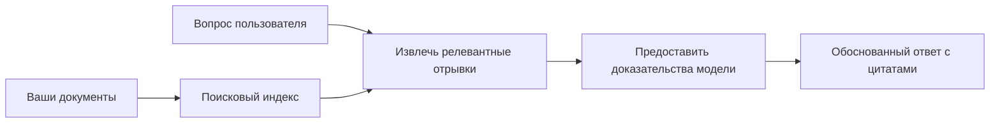

# Обучение ИИ отвечать на вопросы на основе ваших документов:
## Серия 1: RAG, Azure против открытых альтернатив и когда имеет смысл дообучение

> Первая статья из серии 2026 года, в которой рассматриваются мои уроки по Azure AI Search + Azure OpenAI по вопросно-ответным системам на документах 2023 года.

## 1. Введение — возвращение к более раннему уроку по RAG

В 2023 году я работал над парой учебных пособий, посвящённых обучению ChatGPT отвечать на вопросы, основанные на PDF-документах с использованием Azure AI Search и Azure OpenAI. Я написал [версию на LangChain](https://techcommunity.microsoft.com/blog/educatordeveloperblog/teach-chatgpt-to-answer-questions-using-azure-ai-search--azure-openai-lang-chain/3969713), а также соавтором была сопутствующая [версия на Semantic Kernel](https://techcommunity.microsoft.com/blog/educatordeveloperblog/teach-chatgpt-to-answer-questions-using-azure-ai-search--azure-openai-semantic-k/3985395) вместе с [Ли Стоттом](https://developer.microsoft.com/en-us/advocates/lee-stott), менеджером Principal Cloud Advocate в Microsoft. В то время идея «ChatGPT на ваших данных» всё ещё казалась многим разработчикам новинкой. В учебных пособиях использовались Azure Blob Storage, Azure AI Search, Azure OpenAI, LangChain, Semantic Kernel и поиск в стиле FAISS для ответов на вопросы с PDF-файлов.

Ранее статья была сосредоточена на простом, но важном рабочем процессе: загрузка документов, их индексирование, поиск релевантного контента и запрос к модели с ответом на основе этого содержимого.

К 2026 году экосистема RAG значительно выросла. Azure AI Search теперь поддерживает современные векторные и гибридные схемы поиска, Azure OpenAI входит в более широкий экосистему Microsoft Foundry Models, а новая версия v1 API может использовать стандартный OpenAI клиент без необходимости ежемесячных изменений `api-version`. Одновременно открытые решения, такие как LangGraph, LlamaIndex, Haystack, Qdrant, Milvus, Weaviate, Chroma, Ollama и vLLM, стали практичными вариантами для реальных систем RAG.

Поэтому я решил вернуться к этой теме. Вопрос теперь уже не только «Как построить RAG?» Есть много способов это сделать, и более важный вопрос — «Какую архитектуру выбрать для своей конкретной ситуации?»

Но главная проблема осталась прежней.

ИИ-модель не знает ваши документы автоматически. Чтобы построить полезную систему вопросов и ответов на основе документов, по-прежнему необходимы надёжные процессы поиска, подтверждения, оценки и эксплуатации.

Эта статья — не очередное пошаговое руководство «чат по PDF». Я хочу начать обновлённую серию с вопроса, который меня теперь интересует больше: когда следует выбирать управляемую архитектуру Azure, когда — открытый стек RAG и когда действительно имеет смысл дообучение?

Это первая статья серии о создании систем с искусственным интеллектом на основе документов. В этой первой части мы сосредоточимся на решениях по архитектуре: почему важна RAG, когда полезны управляемые сервисы на Azure, когда разумно использовать открытые альтернативы и где вписывается дообучение.

После создания и пересмотра систем вопросно-ответной обработки документов я стал меньше заботиться о том, какой инструмент смотрится лучше в демонстрации, и больше интересоваться тем, какая архитектура выдерживает реальные запросы пользователей, изменения документов, права доступа, сбои и сопровождение.

## 2. Почему вашему ИИ нужна поисковая система

Большие языковые модели обучаются на широких публичных и лицензированных данных. Они могут многое знать о распространённых темах, но не узнают автоматически ваши частные PDF-документы, внутренние политики, корпоративные процедуры, исследовательские архивы, учебные материалы, заметки службы поддержки клиентов или недавно обновлённую документацию.

Простой способ понять RAG: вместо того чтобы ожидать, что модель запомнит каждый документ, мы даём ей поисковую систему. Когда пользователь задаёт вопрос, система сначала находит наиболее релевантные фрагменты информации, затем передаёт эти фрагменты модели в качестве контекста.

Это важно, потому что многие реальные источники знаний являются приватными, постоянно меняются, чувствительны к правам доступа, распределены по множеству систем, написаны в разных форматах и слишком велики, чтобы вставлять их напрямую в запрос.

Например, если у школы, компании или исследовательской группы есть 10 000 внутренних документов, модель не сможет надёжно отвечать на их основе, если система не будет извлекать нужные части в нужное время.

Это приводит к распространённому вопросу:

Почему бы просто не дообучить модель?

Дообучение может быть полезным, но обычно это не первый инструмент для знаний на основе документов. Если знания часто меняются, если важны ссылки или правила доступа, RAG обычно является лучшей отправной точкой. Дообучение больше подходит для обучения поведению, стилю, формату вывода и шаблонам задач.

## 3. Архитектура RAG на практике

Представьте, что вы создаёте ИИ-помощника для школы. Помощник должен отвечать на вопросы из PDF с политиками, учебных путеводителей, внутренних FAQ-страниц и недавно обновлённых объявлений.

Если студент спрашивает: «Можно ли использовать генеративный ИИ для моего итогового задания?», система не должна отвечать из общей памяти модели. Сначала нужно найти релевантную школьную политику, извлечь раздел об использовании ИИ, а затем попросить модель ответить на основе этих данных.

Это и есть RAG на практике.

На высоком уровне процесс можно представить так:

Детали могут стать более сложными, но основная идея проста: модель не отвечает одна. Она отвечает с извлечёнными доказательствами.

Сначала документы загружаются из хранилищ, таких как Azure Blob Storage, SharePoint, GitHub или внутренняя CMS. Затем система парсит их в текст с сохранением полезной структуры, такой как заголовки, номера страниц, таблицы, разделы и места источника.

Далее содержимое разбивается на фрагменты. Этот этап кажется простым, но он один из самых важных в системе. Если фрагмент слишком маленький, может быть потерян окружающий контекст. Если слишком большой — в него войдёт нерелевантная информация, что снизит точность поиска.

После разбивки система создаёт эмбеддинги и сохраняет их в индекс для поиска вместе с исходным текстом и метаданными, такими как имя файла, номер страницы, права доступа, версия документа и URL источника.

Когда пользователь задаёт вопрос, система извлекает кандидатов — фрагменты с помощью поиска по ключевым словам, векторного поиска или гибридного поиска. Реранкер может переупорядочить эти фрагменты, чтобы наиболее полезные доказательства были вверху.

Наконец, модель получает вопрос и извлечённые доказательства. Ответ должен опираться на эти доказательства и возвращать ссылки, чтобы пользователь мог проверить источник.

Важный момент: RAG — это не просто «положить PDF в векторную базу данных». Качество ответа зависит от всего рабочего процесса: парсинга, разбиения на фрагменты, поиска, реренкинга, промптинга, ссылок и оценки.

Вот почему структура документа имеет значение. В PDF заголовок, таблица, сноска или граница страницы могут изменить смысл отрывка. В Azure навык Document Layout использует возможности Azure Document Intelligence по анализу структуры, что улучшает качество разбиения и поиска для систем RAG.

## 4. Что изменилось с 2023 года?

Учебное пособие 2023 года было хорошей отправной точкой на то время:

- Azure Blob Storage хранил PDF-файлы.
- Azure AI Search индексировал содержимое.
- LangChain связывал поиск с Azure OpenAI.
- FAISS использовался как простой локальный векторный стор.
- В примере использовались модели `gpt-35-turbo` и `text-embedding-ada-002`.

В 2026 году современная версия должна отражать несколько изменений.

Во-первых, поиск значительно развился. В 2023 многие демонстрации использовали простой векторный поиск по сходству. Сегодня гибридный поиск обычно является базовой отправной точкой для серьёзных систем QA по документам. Azure AI Search поддерживает гибридный поиск, комбинируя запросы по ключевым словам и векторные запросы в одном запросе и объединяя результаты с помощью Reciprocal Rank Fusion. Семантический ранкер затем может переупорядочить текстовую часть полных, векторных и гибридных результатов.

Во-вторых, загрузка данных стала сложнее. Вместо ручного разбиения каждого документа кодом приложения, Azure AI Search поддерживает интегрированную векторизацию для разбиения, создания эмбеддингов и векторизации во время запроса. Для PDF и больших документов навык Document Layout может сохранить больше структуры, чем фрагменты фиксированного размера.

В-третьих, оркестрация стала важнее. Сложность зачастую не в вызове API LLM, а в обработке ошибок, повторных попыток, устаревшего поиска, качества фрагментов, продолжительных рабочих процессов, проверки человеком и масштабной оценки. Здесь инструменты, ориентированные на рабочие процессы, такие как LangGraph, рабочие процессы LlamaIndex, пайплайны Haystack и платформенные инструменты оценки и наблюдения, становятся более релевантными, чем одна линейная цепочка.

В-четвёртых, оценка уже не опциональна. Демонстрация может впечатлить одним вопросом. Производственная система нуждается в тестовых наборах, регрессионных проверках, метриках поиска, проверках на обоснованность и мониторинге. Без оценки трудно понять, улучшается ли система или просто меняется.

## 5. Выбор между Azure и открытыми RAG стеками

Я не считаю полезным вопросом «Что лучше, Azure или открытый исходный код?» или «Что лучше, открытый исходный код или Azure?»

Полезный вопрос — какой тип системы вы строите, кто будет её эксплуатировать, какие у вас ограничения и какие режимы отказа неприемлемы?

Когда я начинал создавать примеры QA по документам, меня в основном интересовало, работает ли поиск. Могу ли я загрузить PDF, искать в них и генерировать ответ? Это была разумная отправная точка.

После работы с более реалистичными AI-процессами моя оценка изменилась. Я теперь рассматриваю четыре аспекта перед выбором RAG стека:

- идентичность и права доступа
- качество поиска
- надежность рабочего процесса
- ответственность за эксплуатацию

Эти четыре области говорят гораздо больше, чем одни только модельные бенчмарки.

Архитектуры на базе Azure обычно логичны, когда главная трудность — корпоративная интеграция. Если команда уже зависит от Microsoft Entra ID, Microsoft 365, Azure Storage, приватных сетей, RBAC и мониторинга Azure, то Azure AI Search и Azure OpenAI могут уменьшить много операционной сложности. В такой среде Azure — не просто API модели. Ценность — в окружении: идентичность, управление, управляемый поиск, интеграция безопасности, поддержка и знакомые операции.

Открытые архитектуры обычно предпочтительны, когда важна гибкость. Если команде нужны локальный инференс, портируемость в облаке, кастомный пайплайн поиска, специализированный реранкинг или полный контроль над векторной базой и слоями обслуживания моделей, открытый стек может подойти лучше. Однако команда берёт на себя больше работы по обеспечению надёжности: резервные копии, масштабирование, задержки, миграции, мониторинг и безопасность.

На практике многие производственные AI-системы не чисто облачные или открытые. Это часто гибридные системы, балансирующие простоту эксплуатации, портируемость, управление и инженерную гибкость.

Например, я бы не удивился, увидев систему с использованием Azure OpenAI для доступа к модели, LangGraph для оркестрации рабочих процессов, размещения в Azure и открытой векторной базы данных для специфичной задачи поиска. Это не архитектурное несоответствие. Это выбор правильного уровня управляемого сервиса и инженерного контроля для каждой части системы.

Мне нравятся гибридные архитектуры, когда управляемая платформа решает важные корпоративные задачи, а открытые компоненты дают команде гибкость там, где это действительно важно.

## 6. Практическое руководство по выбору

Вот таблица решений, которую я бы использовал с командой перед выбором RAG стека:

| Область решения | Azure управляемый стек сильнее, когда... | Открытый стек сильнее, когда... |
| --- | --- | --- |
| Идентичность и доступ | Entra ID, RBAC, управляемая идентичность и корпоративные права в центре внимания | доминирует кастомная аутентификация, аутентификация не-Microsoft или логика доступа, специфичная для приложения |
| Операции | команда хочет управляемую инфраструктуру, поддержку, SLA и проще обучение | команда способна эксплуатировать векторные базы, обслуживание моделей, бэкапы и масштабирование |
| Поиск | гибридный поиск, семантический ранкинг, фильтры и поиск по метаданным покрывают большинство потребностей | команды нужны кастомный поиск, специализированный реранкинг или экспериментальное индексирование |
| Портируемость | приемлемо или предпочтительно соответствие экосистеме Azure | обязательное требование — избежать привязки к облаку |
| Вывод | важны управление, сеть и корпоративный контроль Azure OpenAI | требуются локальный вывод, кастомные модели или самостоятельный хостинг |
| Стоимость | важнее сократить инженерные и операционные затраты, чем настраивать инфраструктуру | масштаб достаточно велик, чтобы оправдать тщательную оптимизацию инфраструктуры |
| Эксперименты | важна стабильность и корпоративная интеграция больше, чем частая замена компонентов | команда быстро итеративно изменяет агентов, инструменты, память и поисковые процессы |

Моё простое правило:

- Начинайте с Azure, если главные риски — корпоративная интеграция, безопасность и простота эксплуатации.
- Начинайте с открытого исходного кода, если главные риски — портируемость, кастомизация или локальный контроль.
- Используйте гибридный стек, если верны оба предыдущих пункта.

Вот почему я не стал бы начинать серию RAG 2026 с кода. Код важен, но выбор архитектуры важнее реализации. Простой демо-проект может скрыть самые сложные решения. Хорошая система RAG делает эти решения явными.

## 7. Где дообучение вписывается

Дообучение часто упоминается вместе с RAG, но я считаю важным различать их.

RAG обычно лучше подходит, когда системе нужны свежие, приватные, чувствительные к правам доступа или основанные на источниках знания. Если ответ должен ссылаться на документы, отражать недавние обновления или учитывать пользовательские правила доступа, поиск должен быть частью архитектуры.

Дообучение полезнее, когда знания — не главная проблема. Это может помочь, если вы хотите, чтобы модель следовала определённому формату вывода, соответствовала доменной стилистике ответа, стабильнее выполняла задачу или снижала количество инструкций в каждом запросе.
На практике оба подхода могут работать вместе. Помощник службы поддержки может использовать RAG для получения последней версии политики, в то время как тонко настроенная модель изучает предпочтительную структуру и тон ответа компании.

Ошибка заключается в том, что тонкую настройку рассматривают как замену хранилищу документов. Она не устраняет необходимость поиска, когда система должна отвечать на основе свежих, приватных или чувствительных к правам данных.

## 8. Куда движется эта серия

Эта статья — это слой принятия решений. Прежде чем писать код, я хотел явно обозначить компромиссы: RAG против тонкой настройки, Azure против открытого кода, управляемые сервисы против операционного контроля.

Прежде чем переходить к реализации, хочу отметить одну вещь: во многих корпоративных AI-системах модель — лишь один компонент. Качество поиска, оркестрация, оценка, права доступа и операционная надежность часто определяют, будет ли система успешной за пределами демо-версии.

В следующих частях этой серии я планирую глубже рассмотреть практическую сторону систем AI на базе документов: как построить архитектуру на Azure, как открытые альтернативы работают на практике и как оценить, действительно ли система RAG работает.

Порядок может меняться по ходу серии, но цель останется прежней: выйти за рамки простого демо и показать, как думать о системах RAG, которые можно поддерживать, оценивать и эксплуатировать.

## 9. Ссылки и ресурсы

Оригинальные учебники:

- [Обучите ChatGPT отвечать на вопросы: использование Azure AI Search и Azure OpenAI (Lang Chain)](https://techcommunity.microsoft.com/blog/educatordeveloperblog/teach-chatgpt-to-answer-questions-using-azure-ai-search--azure-openai-lang-chain/3969713)
- [Обучите ChatGPT отвечать на вопросы: использование Azure AI Search и Azure OpenAI (Semantic Kernel)](https://techcommunity.microsoft.com/blog/educatordeveloperblog/teach-chatgpt-to-answer-questions-using-azure-ai-search--azure-openai-semantic-k/3985395)

Azure:

- [Версии REST API Azure AI Search](https://learn.microsoft.com/en-us/rest/api/searchservice/search-service-api-versions)
- [Гибридный поиск в Azure AI Search](https://learn.microsoft.com/en-us/azure/search/hybrid-search-how-to-query)
- [Интегрированная векторизация в Azure AI Search](https://learn.microsoft.com/en-us/azure/search/vector-search-integrated-vectorization)
- [Навык анализа структуры документа в Azure AI Search](https://learn.microsoft.com/en-us/azure/search/cognitive-search-skill-document-intelligence-layout)
- [Разбиение на фрагменты и векторизация по структуре документа](https://learn.microsoft.com/en-us/azure/search/search-how-to-semantic-chunking)
- [Семантическое ранжирование в Azure AI Search](https://learn.microsoft.com/en-us/azure/search/semantic-search-overview)
- [Жизненный цикл версий API Azure OpenAI / Microsoft Foundry](https://learn.microsoft.com/en-us/azure/foundry/openai/api-version-lifecycle)
- [Модели Foundry, продаваемые через Azure](https://learn.microsoft.com/en-us/azure/foundry/foundry-models/concepts/models-sold-directly-by-azure)
- [Рассмотрения по тонкой настройке Microsoft Foundry](https://learn.microsoft.com/en-us/azure/foundry/openai/concepts/fine-tuning-considerations)
- [Наблюдаемость Microsoft Foundry](https://learn.microsoft.com/en-us/azure/foundry/concepts/observability)
- [Запуск оценок в Microsoft Foundry](https://learn.microsoft.com/en-us/azure/foundry/how-to/evaluate-generative-ai-app)

Открытый код:

- [Документация LangGraph](https://docs.langchain.com/oss/python/langgraph/overview)
- [Документация LlamaIndex](https://developers.llamaindex.ai/python/framework/)
- [Документация Haystack](https://docs.haystack.deepset.ai/)
- [Документация Qdrant](https://qdrant.tech/documentation/overview/)
- [Документация Milvus](https://milvus.io/docs/overview.md)
- [Документация Weaviate](https://docs.weaviate.io/weaviate/current/)
- [Документация Chroma](https://docs.trychroma.com/docs/overview/introduction)
- [Встраивания Ollama](https://docs.ollama.com/capabilities/embeddings)
- [Сервер vLLM, совместимый с OpenAI](https://docs.vllm.ai/en/latest/serving/openai_compatible_server.html)
- [Модели встраивания BGE](https://huggingface.co/BAAI/bge-large-en-v1.5)
- [Модели встраивания E5](https://huggingface.co/intfloat/e5-large-v2)
- [Модели встраивания Instructor](https://huggingface.co/hkunlp/instructor-large)

---

<!-- CO-OP TRANSLATOR DISCLAIMER START -->
**Отказ от ответственности**:
Этот документ был переведен с использованием сервиса машинного перевода [Co-op Translator](https://github.com/Azure/co-op-translator). Несмотря на наши усилия по обеспечению точности, имейте в виду, что автоматический перевод может содержать ошибки или неточности. Оригинальный документ на его исходном языке следует считать авторитетным источником. Для получения критически важной информации рекомендуется обратиться к профессиональному человеческому переводу. Мы не несем ответственности за любые недоразумения или неправильные толкования, возникшие в результате использования этого перевода.
<!-- CO-OP TRANSLATOR DISCLAIMER END -->