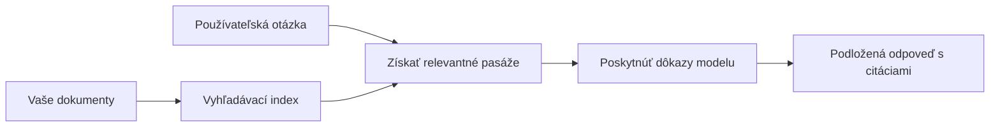

# Naučte AI odpovedať na otázky na základe vašich dokumentov:
## Séria 1: RAG, Azure vs Open-Source alternatívy a kedy dáva zmysel doladenie

> Prvý článok v sérii z roku 2026, ktorý znovu prehodnocuje moje tutoriály na dokumentové QA s Azure AI Search + Azure OpenAI z roku 2023.

Navigácia v sérii: [Domovská stránka repozitára](../README.md) | Ďalej: [Séria 2 - Vybudujte lokálny open-source RAG systém od začiatku do konca](./series-2-open-source-rag-end-to-end.md)

## 1. Úvod - Znovu sa pozrieme na skorší RAG tutoriál

V roku 2023 som pracoval na páre tutoriálov o učení ChatGPT odpovedať na otázky z PDF dokumentov pomocou Azure AI Search a Azure OpenAI. Napísal som [verziu pre LangChain](https://techcommunity.microsoft.com/blog/educatordeveloperblog/teach-chatgpt-to-answer-questions-using-azure-ai-search--azure-openai-lang-chain/3969713) a tiež som spoluautorom sprievodnej [verzie Semantic Kernel](https://techcommunity.microsoft.com/blog/educatordeveloperblog/teach-chatgpt-to-answer-questions-using-azure-ai-search--azure-openai-semantic-k/3985395) s [Leem Stottom](https://developer.microsoft.com/en-us/advocates/lee-stott), vedúcim Principal Cloud Advocate Manager v Microsoft. V tom čase sa pre mnohých vývojárov pojem „ChatGPT na vašich dátach“ ešte stále javilo ako nové. Tutoriály používali Azure Blob Storage, Azure AI Search, Azure OpenAI, LangChain, Semantic Kernel a FAISS-štýl vektorového vyhľadávania na odpovedanie na otázky z PDF súborov.

Ten skorší článok sa sústredil na jednoduchý, ale dôležitý pracovný tok: nahrávanie dokumentov, ich indexovanie, vyhľadávanie relevantného obsahu a pýtanie modelu na odpoveď na základe tohto obsahu.

V roku 2026 sa ekosystém RAG výrazne rozrástol. Azure AI Search teraz podporuje moderné vektorové a hybridné vyhľadávacie vzory, Azure OpenAI je súčasťou širšieho ekosystému Microsoft Foundry Models, a novšie v1 API môže používať štandardného OpenAI klienta bez potreby mesačných zmien `api-version`. Zároveň sa open-source možnosti ako LangGraph, LlamaIndex, Haystack, Qdrant, Milvus, Weaviate, Chroma, Ollama a vLLM stali praktickými voľbami pre reálne RAG systémy.

Preto som chcel túto tému znovu otvoriť. Otázka už nie je len „Ako zostavím RAG?“ Teraz existuje mnoho spôsobov, ako ho zostaviť, a dôležitejšia otázka je „Ktorú architektúru si vybrať pre moju situáciu?“

Ale základný problém sa nezmenil.

AI model automaticky nepozná vaše dokumenty. Aby ste vybudovali užitočný systém na odpovedanie otázok z dokumentov, stále potrebujete spoľahlivé vyhľadávanie, ukotvenie, vyhodnotenie a prevádzkové postupy.

Tento článok nie je ďalší komplexný „chat s PDF“ tutoriál. Chcem začať túto aktualizovanú sériu otázkou, na ktorej mi teraz viac záleží: kedy by ste mali vybrať spravovanú Azure architektúru, kedy open-source RAG stack a kedy má doladenie skutočný zmysel?

Toto je prvý článok v sérii o budovaní systémov AI zakotvených v dokumentoch. V tejto prvej časti sa budeme sústrediť na rozhodnutia o architektúre: prečo RAG znamená, kedy sú užitočné služby spravované na Azure, kedy dávajú zmysel open-source alternatívy a kde zapadá doladenie.

Po vybudovaní a opätovnom skúmaní dokumentových QA systémov ma menej zaujíma, ktoré nástroje vyzerajú najlepšie v dema a viac ma zaujíma, ktorá architektúra prežije reálnych používateľov, meniace sa dokumenty, oprávnenia, zlyhania a údržbu.

## 2. Prečo vaša AI potrebuje vyhľadávací systém

Veľké jazykové modely sú trénované na širokých verejných a licencovaných dátach. Môžu veľa vedieť o všeobecných témach, ale automaticky nepoznajú vaše súkromné PDF, interné pravidlá, podnikové postupy, výskumné archívy, učebné materiály, poznámky zákazníckej podpory alebo nedávno aktualizovanú dokumentáciu.

Jednoduchý spôsob, ako premýšľať o RAG, je tento: namiesto toho, aby model musel všetky dokumenty pamätať, dáme mu vyhľadávací systém. Keď používateľ položí otázku, systém najskôr nájde najrelevantnejšie informácie a potom ich poskytne modelu ako kontext.

To je dôležité, pretože mnoho zdrojov vedomostí v reálnom svete je súkromných, neustále sa mení, je citlivých na oprávnenia, uložených v rôznych systémoch, napísaných v rôznych formátoch a príliš veľkých na to, aby sa dali priamo vložiť do promptu.

Napríklad, ak má škola, firma alebo výskumný tím 10 000 interných dokumentov, model na základe nich nemôže spoľahlivo odpovedať, pokiaľ systém nespracuje správne časti v pravý čas.

To prirodzene vedie k bežnej otázke:

Prečo nie jednoducho doladiť model?

Doladenie môže byť užitočné, ale zvyčajne nie je vhodným prvým nástrojom pre znalosti z dokumentov. Ak sa vedomosti často menia, ak sú citácie dôležité, alebo ak sú dôležité pravidlá prístupu, RAG je obvykle lepším východiskom. Doladenie je vhodnejšie pre učenie správania, štýlu, formátu výstupu a vzorcov úloh.

## 3. RAG architektúra v praxi

Predstavte si, že budujete AI asistenta pre školu. Asistent musí odpovedať na otázky z PDF pravidiel, sprievodcov kurzami, interných FAQ stránok a nedávno aktualizovaných oznamov.

Ak študent položí otázku „Môžem použiť generatívnu AI na svoju záverečnú prácu?“, systém by nemal odpovedať z všeobecnej pamäte modelu. Najskôr by mal nájsť príslušné školské pravidlo, vyhľadať časť o používaní AI a potom požiadať model, aby odpovedal na základe toho dôkazu.

To je RAG v praxi.

Všeobecne môžete považovať tok za nasledovný:

Detaily môžu byť sofistikovanejšie, ale základná myšlienka je jednoduchá: model neodpovedá sám. Odpovedá s nájdenými dôkazmi.

Najprv sa dokumenty načítajú zo skladovacích systémov, ako sú Azure Blob Storage, SharePoint, GitHub alebo interný CMS. Potom ich systém rozparsuje do textovej podoby a pritom zachováva užitočnú štruktúru, ako sú nadpisy, čísla strán, tabuľky, sekcie a zdrojové umiestnenia.

Ďalej sa obsah rozdelí na kúsky (chunks). Tento krok sa zdá jednoduchý, ale je jednou z najdôležitejších častí systému. Ak je kúsok príliš malý, môže stratiť okolitý kontext. Ak je príliš veľký, môže obsahovať nesúvisiace informácie a znížiť presnosť vyhľadávania.

Po rozdelení na kúsky systém vytvorí embeddingy a uloží ich do vyhľadávateľného indexu spolu s pôvodným textom a metadátami, ako je názov súboru, číslo strany, oprávnenia, verzia dokumentu a URL zdroja.

Keď používateľ položí otázku, systém vyhľadá kandidátske kúsky pomocou kľúčového slova, vektorového vyhľadávania alebo hybridného vyhľadávania. Reranker môže potom tieto kúsky preusporiadať tak, aby sa najlepšie dôkazy dostali na vrchol.

Nakoniec model dostane otázku spolu s nájdenými dôkazmi. Odpoveď by mala byť založená na týchto dôkazoch a mala by vracať citácie, aby si používateľ mohol skontrolovať zdroj.

Dôležitý bod je, že RAG nie je len „vložiť PDF do vektorovej databázy“. Kvalita odpovede závisí od celého pracovného postupu: parsovanie, rozdeľovanie na kúsky, vyhľadávanie, reranking, promptovanie, citácie a vyhodnotenie.

Preto záleží na štruktúre dokumentu. V PDF môže nadpis, tabuľka, poznámka pod čiarou alebo rozhranie stránky zmeniť význam pasáže. Na Azure používa Document Layout skill kapacity Azure Document Intelligence na produkciu výstupu so zachovanou štruktúrou, čo môže zlepšiť kvalitu chunkovania a retrievalu pre RAG systémy.

## 4. Čo sa zmenilo od roku 2023?

Tutoriál z roku 2023 bol v svojej dobe dobrým východiskom:

- Azure Blob Storage ukladala PDF súbory.
- Azure AI Search indexoval obsah.
- LangChain prepájal vyhľadávanie s Azure OpenAI.
- FAISS fungoval ako jednoduchý lokálny vektorový obchod.
- Príklad používal `gpt-35-turbo` a `text-embedding-ada-002`.

V roku 2026 by moderná verzia mala zohľadniť niekoľko zmien.

Po prvé, vyhľadávanie dozrelo. V roku 2023 mnohé dema používali jednoduché vektorové vyhľadávanie podobnosti. Dnes je hybridné vyhľadávanie často štandardným východiskom pre vážne dokumentové QA. Azure AI Search podporuje hybridné vyhľadávanie kombináciou kľúčových slov a vektorových dopytov v jednom požiadavku a spojením výsledkov pomocou Reciprocal Rank Fusion. Semantic ranker potom môže preradiť textovú časť plnotextových, vektorových a hybridných výsledkov.

Po druhé, ingestovanie je sofistikovanejšie. Namiesto ručného delenia každého dokumentu aplikačným kódom podporuje Azure AI Search integrovanú vektorizáciu pre chunkovanie, embedding aj vektorovanie počas dopytu. Pre PDF a dokumentom náročné pracovné záťaže môže Document Layout skill zachovať viac štruktúry než pevne veľké kúsky.

Po tretie, orchestrácia má väčší význam. Najťažšia časť často nie je samotný LLM API hovor. Najťažšia je spravovať chyby, opakovania, zastarané výsledky vyhľadávania, kvalitu kúskov, dlhodobé pracovné toky, ľudskú kontrolu a vyhodnocovanie v mierke. Tu sa viac hodia workflow-orientované nástroje ako LangGraph, LlamaIndex workflows, Haystack pipelines a platformové nástroje na vyhodnocovanie a pozorovateľnosť než jednopramenný reťazec.

Po štvrté, vyhodnocovanie už nie je voliteľné. Demo môže vyzerať pôsobivo s jednou otázkou. Produkčný systém potrebuje testovacie sady, regresné kontroly, metriky vyhľadávania, kontroly zakotvenia a monitorovanie. Bez vyhodnotenia je ťažké vedieť, či sa systém zlepšuje alebo len mení.

## 5. Výber medzi Azure a open-source RAG stackmi

Nemyslím si, že užitočná otázka je „Je Azure lepší ako open source?“ alebo „Je open source lepší ako Azure?“

Užitočná otázka je: aký druh systému budujete, kto ho bude prevádzkovať, aké máte obmedzenia a aké režimy zlyhania sú neprijateľné?

Keď som začínal stavať príklady dokumentového QA, väčšinou som premýšľal o tom, či vyhľadávanie funguje. Mohol som nahrať PDF, vyhľadať ich a vygenerovať odpoveď? To bolo rozumné východisko.

Po práci s realistickejšími AI pracovnými tokmi sa moje hodnotenie zmenilo. Teraz sa pozerám na štyri oblasti pred výberom RAG stacku:

- identita a oprávnenia
- kvalita vyhľadávania
- spoľahlivosť pracovného toku
- prevádzkové vlastníctvo

Tieto štyri oblasti vám povedia oveľa viac než samotný benchmark modelu.

Architektúry založené na Azure zvyčajne dávajú zmysel, keď je najnáročnejšou časťou podniková integrácia. Ak tím už závisí na Microsoft Entra ID, Microsoft 365, Azure Storage, súkromných sieťach, RBAC a Azure monitorovaní, Azure AI Search a Azure OpenAI môžu výrazne znížiť prevádzkovú zložitosť. V tomto prostredí Azure nie je len modelové API. Hodnota spočíva v okolitom systéme: identita, správa, spravované vyhľadávanie, bezpečnostná integrácia, podpora a známa prevádzka.

Open-source architektúry zvyčajne dávajú zmysel, keď je flexibilita najväčšou výzvou. Ak tím potrebuje lokálnu inferenciu, prenosnosť medzi cloudmi, vlastný vyhľadávací pipeline, špecializované preradenie alebo priamu kontrolu nad vektorovou databázou a modelovou vrstvou, open-source stack môže byť lepšou voľbou. Kompromisom je, že tím zodpovedá za viac údržby spoľahlivosti: zálohy, škálovanie, latenciu, migrácie, monitorovanie a bezpečnosť.

V praxi mnohé produkčné AI systémy nie sú čisto cloud-native alebo čisto open-source. Často sú to hybridné systémy, ktoré balansujú medzi prevádzkovou jednoduchosťou, prenosnosťou, správou a inžinierskou flexibilitou.

Napríklad by ma neprekvapilo, keby systém používal Azure OpenAI na prístup k modelom, LangGraph na orchestráciu workflow, Azure hosting na nasadenie a open-source vektorovú databázu pre špecifické potreby vyhľadávania. To nie je architektonická nekonzistencia. Je to výber správnej úrovne spravovaných služieb a inžinierskej kontroly pre každú časť systému.

Hybridné architektúry mám rád, keď spravovaná platforma rieši dôležité podnikové problémy, zatiaľ čo open-source komponenty dávajú tímu flexibilitu tam, kde to naozaj záleží.

## 6. Praktický návod na rozhodnutie

Tu je rozhodovacia tabuľka, ktorú by som použil s tímom pred výberom RAG stacku:

| Rozhodovacia oblasť | Azure spravovaný stack je silnejší, keď... | Open-source stack je silnejší, keď... |
| --- | --- | --- |
| Identita a prístup | Entra ID, RBAC, spravovaná identita a podnikové oprávnenia sú kľúčové | prispôsobená autentifikácia, ne-Microsoft identita alebo špecifická aplikačná prístupová logika dominuje |
| Prevádzka | tím chce spravovanú infraštruktúru, podporu, SLA a jednoduchšie zaškolenie | tím dokáže prevádzkovať vektorové databázy, servovanie modelov, zálohy a škálovanie |
| Vyhľadávanie | hybridné vyhľadávanie, semantické radenie, filtre a metadátové vyhľadávanie pokrývajú väčšinu potrieb | tím potrebuje vlastné vyhľadávanie, špecializované preradenie alebo experimentálne indexovanie |
| Prenositeľnosť | súhlasí alebo preferuje zaradenie do Azure ekosystému | prísne požiadavky na vyhnutie sa cloudovému lock-in |
| Inferencia | záleží na riadení Azure OpenAI, sieťovaní a podnikových kontrolách | vyžaduje sa lokálna inferencia, vlastné modely alebo self-hosted servovanie |
| Náklady | dôležitejšie ako ladenie infraštruktúry je zníženie inžinierskych a prevádzkových nákladov | rozsah je dostatočne veľký na opodstatnenú optimalizáciu infraštruktúry |
| Experimentovanie | stabilita a podniková integrácia sú dôležitejšie než častá obmena komponentov | tím rýchlo iteruje na agentoch, nástrojoch, pamäti a vyhľadávacích workflowoch |

Môj pravidelný zlatozlatý pravidlo je jednoduché:

- Začnite s Azure, keď sú hlavné riziká podniková integrácia, bezpečnosť a prevádzková jednoduchosť.
- Začnite s open source, keď sú hlavné riziká prenosnosť, prispôsobiteľnosť alebo miestna kontrola.
- Použite hybridný stack, keď platí oboje.

Preto by som tiež nepovedal, že by som v roku 2026 začal sériu RAG najprv kódom. Kód je dôležitý, ale výber architektúry je pred implementáciou. Jednoduché demo môže skryť najťažšie rozhodnutia. Dobrý RAG systém ich robí explicitnými.

## 7. Kde zapadá doladenie

Doladenie sa často spomína spolu s RAG, ale myslím, že je dôležité ich oddeliť.

RAG je zvyčajne lepšou voľbou, keď systém potrebuje čerstvé, súkromné, citlivé na oprávnenia alebo zdrojom podložené vedomosti. Ak by odpoveď mala citovať dokumenty, reflektovať nedávne aktualizácie alebo rešpektovať pravidlá prístupu špecifické pre používateľa, vyhľadávanie by malo byť súčasťou architektúry.
Ladenie je užitočnejšie, keď vedomosti nie sú hlavným problémom. Môže pomôcť, keď chcete, aby model dodržiaval špecifický výstupný formát, zodpovedal štýlu odpovedí špecifických pre danú doménu, vykonával stabilnú úlohu konzistentnejšie alebo znižoval množstvo inštrukcií potrebných v každom podnete.

V praxi môžu tieto dve metódy spolupracovať. Podporný asistent môže použiť RAG na vyhľadanie najnovšej politiky, zatiaľ čo doladený model sa naučí preferovanú štruktúru odpovedí a tón spoločnosti.

Chybou je považovať ladenie za náhradu za úložisko dokumentov. Ladenie neodstraňuje potrebu vyhľadávania, keď systém musí odpovedať na základe čerstvých, súkromných alebo citlivých údajov s obmedzeným prístupom.

## 8. Kam táto séria smeruje ďalej

Tento článok predstavuje vrstvu rozhodovania. Pred písaním kódu som chcel jasne uviesť kompromisy: RAG vs ladenie, Azure vs open source, spravované služby vs operačná kontrola.

Pred tým, ako prejdeme k implementácii, chcem tu nechať jednu myšlienku: v mnohých podnikových AI systémoch je model iba jednou súčasťou. Kvalita vyhľadávania, orchestrácia, vyhodnocovanie, povolenia a prevádzková spoľahlivosť často rozhodujú o tom, či systém uspeje mimo demo fázy.

V ďalších častiach tejto série plánujem ísť hlbšie do praktickej stránky systémov AI založených na dokumentoch: najprv vybudovanie lokálneho open-source pracovného toku RAG, potom prebudovanie rovnakého scenára s Azure AI Search a Azure OpenAI, a potom vyhodnotenie, či systém skutočne funguje.

Poradie môžem meniť podľa vývoja série, ale cieľ zostane rovnaký: posunúť sa za rámec jednoduchého dema a ukázať, ako uvažovať o systémoch RAG, ktoré je možné udržiavať, hodnotiť a prevádzkovať.

## 9. Odkazy a zdroje

Originálne tutoriály:

- [Naučte ChatGPT odpovedať na otázky: Použitie Azure AI Search & Azure OpenAI (Lang Chain)](https://techcommunity.microsoft.com/blog/educatordeveloperblog/teach-chatgpt-to-answer-questions-using-azure-ai-search--azure-openai-lang-chain/3969713)
- [Naučte ChatGPT odpovedať na otázky: Použitie Azure AI Search & Azure OpenAI (Semantic Kernel)](https://techcommunity.microsoft.com/blog/educatordeveloperblog/teach-chatgpt-to-answer-questions-using-azure-ai-search--azure-openai-semantic-k/3985395)

Azure:

- [Verzie REST API Azure AI Search](https://learn.microsoft.com/en-us/rest/api/searchservice/search-service-api-versions)
- [Hybridné vyhľadávanie v Azure AI Search](https://learn.microsoft.com/en-us/azure/search/hybrid-search-how-to-query)
- [Integrovaná vektorová reprezentácia v Azure AI Search](https://learn.microsoft.com/en-us/azure/search/vector-search-integrated-vectorization)
- [Zručnosť Document Layout v Azure AI Search](https://learn.microsoft.com/en-us/azure/search/cognitive-search-skill-document-intelligence-layout)
- [Členenie a vektorizácia podľa rozloženia dokumentu](https://learn.microsoft.com/en-us/azure/search/search-how-to-semantic-chunking)
- [Semantické hodnotenie v Azure AI Search](https://learn.microsoft.com/en-us/azure/search/semantic-search-overview)
- [Životný cyklus API verzií Azure OpenAI / Microsoft Foundry](https://learn.microsoft.com/en-us/azure/foundry/openai/api-version-lifecycle)
- [Modely Foundry predávané priamo cez Azure](https://learn.microsoft.com/en-us/azure/foundry/foundry-models/concepts/models-sold-directly-by-azure)
- [Zváženia pri doladení Microsoft Foundry](https://learn.microsoft.com/en-us/azure/foundry/openai/concepts/fine-tuning-considerations)
- [Monitorovanie Microsoft Foundry](https://learn.microsoft.com/en-us/azure/foundry/concepts/observability)
- [Ako vykonávať hodnotenia v Microsoft Foundry](https://learn.microsoft.com/en-us/azure/foundry/how-to/evaluate-generative-ai-app)

Open-source:

- [Dokumentácia LangGraph](https://docs.langchain.com/oss/python/langgraph/overview)
- [Dokumentácia LlamaIndex](https://developers.llamaindex.ai/python/framework/)
- [Dokumentácia Haystack](https://docs.haystack.deepset.ai/)
- [Dokumentácia Qdrant](https://qdrant.tech/documentation/overview/)
- [Dokumentácia Milvus](https://milvus.io/docs/overview.md)
- [Dokumentácia Weaviate](https://docs.weaviate.io/weaviate/current/)
- [Dokumentácia Chroma](https://docs.trychroma.com/docs/overview/introduction)
- [Ollama embeddings](https://docs.ollama.com/capabilities/embeddings)
- [Server vLLM kompatibilný s OpenAI](https://docs.vllm.ai/en/latest/serving/openai_compatible_server.html)
- [Modely embeddingov BGE](https://huggingface.co/BAAI/bge-large-en-v1.5)
- [Modely embeddingov E5](https://huggingface.co/intfloat/e5-large-v2)
- [Modely embeddingov Instructor](https://huggingface.co/hkunlp/instructor-large)

Ďalej: [Séria 2 - Vybudujte lokálny open-source RAG systém od začiatku do konca](./series-2-open-source-rag-end-to-end.md)

---

<!-- CO-OP TRANSLATOR DISCLAIMER START -->
**Vyhlásenie o zodpovednosti**:
Tento dokument bol preložený pomocou AI prekladateľskej služby [Co-op Translator](https://github.com/Azure/co-op-translator). Hoci sa snažíme o presnosť, vezmite prosím na vedomie, že automatické preklady môžu obsahovať chyby alebo nepresnosti. Pôvodný dokument v jeho natívnom jazyku by mal byť považovaný za autoritatívny zdroj. Pre kritické informácie sa odporúča profesionálny ľudský preklad. Nie sme zodpovední za žiadne nedorozumenia alebo nesprávne interpretácie vyplývajúce z použitia tohto prekladu.
<!-- CO-OP TRANSLATOR DISCLAIMER END -->