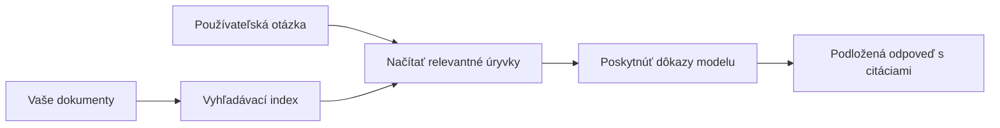

# Naučte AI odpovedať na otázky na základe vašich dokumentov:
## Séria 1: RAG, Azure vs Open-Source alternatívy a Kedy má zmysel doladenie

> Prvý článok v sérii z roku 2026, ktorý reviduje moje návody na Azure AI Search + Azure OpenAI pre dokumentové QA z roku 2023.

## 1. Úvod – Opätovné zabehnutie staršieho tutoriálu RAG

V roku 2023 som pracoval na dvojici návodov o tom, ako naučiť ChatGPT odpovedať na otázky z PDF dokumentov pomocou Azure AI Search a Azure OpenAI. Napísal som [verziu LangChain](https://techcommunity.microsoft.com/blog/educatordeveloperblog/teach-chatgpt-to-answer-questions-using-azure-ai-search--azure-openai-lang-chain/3969713) a spolupodieľal som sa na sprievodnej [verzii Semantic Kernel](https://techcommunity.microsoft.com/blog/educatordeveloperblog/teach-chatgpt-to-answer-questions-using-azure-ai-search--azure-openai-semantic-k/3985395) s [Lee Stottom](https://developer.microsoft.com/en-us/advocates/lee-stott), manažérom hlavného cloudového advokáta v Microsoft. Vtedy sa koncept „ChatGPT na vašich údajoch“ ešte mnohým vývojárom zdal nový. Návody využívali Azure Blob Storage, Azure AI Search, Azure OpenAI, LangChain, Semantic Kernel a vektorové vyhľadávanie v štýle FAISS na odpovedanie otázok z PDF súborov.

Ten skorší článok sa sústredil na jednoduchý, ale dôležitý pracovný tok: nahrať dokumenty, indexovať ich, vyhľadať relevantný obsah a požiadať model, aby na základe neho odpovedal.

V roku 2026 sa ekosystém RAG výrazne rozrástol. Azure AI Search teraz podporuje moderné vektorové a hybridné vyhľadávacie vzory, Azure OpenAI je súčasťou širšieho ekosystému Microsoft Foundry Models a novšie API v1 môže používať štandardného OpenAI klienta bez nutnosti mesačných zmien `api-version`. Zároveň sa open-source možnosti ako LangGraph, LlamaIndex, Haystack, Qdrant, Milvus, Weaviate, Chroma, Ollama a vLLM stali praktickými voľbami na reálne RAG systémy.

Preto som chcel túto tému znova otvoriť. Otázka už nie je len „Ako postavím RAG?“ Už je veľa spôsobov, ako ho postaviť, a podstatnejšou otázkou je „Ktorú architektúru si vybrať pre moju situáciu?“

Ale základný problém sa nezmenil.

AI model automaticky nepozná vaše dokumenty. Na vybudovanie použiteľného systému na odpovedanie otázok z dokumentov stále potrebujete spoľahlivé vyhľadávanie, podklad, vyhodnotenie a prevádzkové pracovné toky.

Tento článok nie je ďalším komplexným návodom „chat s PDF“. Chcem túto aktualizovanú sériu začať otázkou, ktorá je mi teraz dôležitejšia: kedy by ste mali zvoliť manažovanú Azure architektúru, kedy open-source RAG stack a kedy má doladenie naozaj zmysel?

Toto je prvý článok zo série o stavbe AI systémov založených na dokumentoch. V tejto prvej časti sa zameriame na rozhodovanie o architektúre: prečo RAG záleží, kedy majú zmysel Azure manažované služby, kedy open-source alternatívy a kam zapadá doladenie.

Po vybudovaní a opätovnom preskúmaní dokumentových QA systémov ma menej zaujíma, ktorý nástroj vyzerá najlepšie v deme, a viac ma zaujíma, ktorá architektúra prežije skutočných používateľov, meniace sa dokumenty, oprávnenia, zlyhania a údržbu.

## 2. Prečo vaša AI potrebuje vyhľadávací systém

Veľké jazykové modely sú trénované na širokých verejných a licencovaných údajoch. Môžu veľa vedieť o všeobecných témach, ale automaticky nepoznajú vaše súkromné PDF, interné pravidlá, podnikové postupy, výskumné archívy, učebné materiály, poznámky zákazníckej podpory alebo nedávno aktualizovanú dokumentáciu.

Jednoduchý spôsob, ako myslieť na RAG, je tento: namiesto toho, aby sme očakávali, že model si zapamätá každý dokument, dáme mu vyhľadávací systém. Keď používateľ položí otázku, systém najprv nájde najrelevantnejšie kúsky informácií a tie potom poskytne modelu ako kontext.

To je dôležité, pretože mnoho reálnych zdrojov poznatkov je súkromných, neustále sa mení, citlivých na oprávnenia, uložených v rôznych systémoch, písaných vo viacerých formátoch a príliš rozsiahlych na priame vloženie do promptu.

Napríklad, ak má škola, spoločnosť alebo výskumný tím 10 000 interných dokumentov, model z nich nemôže spoľahlivo odpovedať, pokiaľ systém nevyhľadá správne časti v správnom čase.

To prirodzene vyvoláva bežnú otázku:

Prečo teda len nedoladiť model?

Doladenie môže byť užitočné, ale vo väčšine prípadov nie je prvým správnym nástrojom pre znalosti z dokumentov. Ak sa znalosti často menia, ak sú dôležité citácie alebo prístupové oprávnenia, RAG je zvyčajne lepším východiskom. Doladenie je vhodnejšie na učenie správania, štýlu, formátu výstupu a vzorov úloh.

## 3. RAG architektúra v praxi

Predstavte si, že budujete AI asistenta pre školu. Asistent má odpovedať na otázky z politických PDF, sprievodcov kurzmi, interných stránok FAQ a nedávno aktualizovaných oznámení.

Ak študent položí otázku: „Môžem použiť generatívnu AI na záverečnú prácu?“, systém by nemal odpovedať z všeobecnej pamäti modelu. Mal by najprv nájsť relevantnú školskú politiku, vyhľadať časť o používaní AI a potom požiadať model, aby odpovedal s použitím tohto dôkazu.

To je RAG v praxi.

Všeobecne možno tok myslieť takto:

  
Detaily môžu byť sofistikovanejšie, ale základná myšlienka je jednoduchá: model neodpovedá sám. Odpovedá s vyhľadanými dôkazmi.

Najskôr sa dokumenty importujú zo skladovacích systémov ako Azure Blob Storage, SharePoint, GitHub alebo interný CMS. Systém ich potom rozoberie na text pri zachovaní užitočnej štruktúry ako nadpisy, čísla strán, tabuľky, sekcie a zdrojové umiestnenia.

Ďalej sa obsah rozdelí na kúsky. Tento krok sa môže zdať jednoduchý, ale je jedným z najdôležitejších častí systému. Ak je kúsok príliš malý, môže stratiť okolitý kontext. Ak je príliš veľký, môže obsahovať nesúvisiace informácie a sprístupnenie nie je presné.

Po rozdelení na kúsky systém vytvorí vloženia (embeddings) a uloží ich do vyhľadávateľného indexu spolu s pôvodným textom a metadátami ako názov súboru, číslo strany, oprávnenia, verzia dokumentu a zdrojová URL.

Keď používateľ položí otázku, systém vyhľadá kandidátne kúsky pomocou kľúčového slova, vektorového alebo hybridného vyhľadávania. Reranker potom môže preusporiadať tie kúsky tak, aby najpoužiteľnejšie dôkazy boli na vrchu.

Nakoniec model obdrží otázku a vyhľadané dôkazy. Odpoveď by mala byť založená na týchto dôkazoch a obsahovať citácie, aby používateľ mohol skontrolovať zdroj.

Dôležité je, že RAG nie je len „vložiť PDF do vektorovej databázy“. Kvalita odpovede závisí od celého pracovného toku: rozboru, rozdelenia, vyhľadávania, preusporiadania, promptovania, citovania a vyhodnotenia.

Preto záleží na štruktúre dokumentu. V PDF môže nadpis, tabuľka, poznámka pod čiarou alebo hranica stránky meniť význam pasáže. Na Azure používa nástroj Document Layout schopnosti Azure Document Intelligence na výstup so zachovaním štruktúry, čo môže zlepšiť kvalitu rozdelenia a vyhľadávania pre RAG systémy.

## 4. Čo sa zmenilo od roku 2023?

Návod z roku 2023 bol pre svoju dobu dobrým východiskom:

- Azure Blob Storage ukladalo PDF súbory.
- Azure AI Search indexoval obsah.
- LangChain spájal vyhľadávanie s Azure OpenAI.
- FAISS slúžil ako jednoduché lokálne vektorové úložisko.
- Príklad používal `gpt-35-turbo` a `text-embedding-ada-002`.

V roku 2026 by moderná verzia mala reflektovať niekoľko zmien.

Po prvé, vyhľadávanie dozrelo. V roku 2023 mnoho dema používalo jednoduché vektorové podobnostné vyhľadávanie. Dnes je hybridné vyhľadávanie často štandardným východiskom pre seriózne QA. Azure AI Search podporuje hybridné vyhľadávanie kombináciou kľúčových slov a vektorových dopytov v jednom požiadavku a spájaním výsledkov pomocou Reciprocal Rank Fusion. Semantický ranker potom môže preusporiadať textovú čas sekciu plnotextových, vektorových a hybridných výsledkov.

Po druhé, import dát je zložitejší. Namiesto ručného delenia každého dokumentu v aplikačnom kóde Azure AI Search podporuje integrovanú vektorizáciu pre delenie, embedding a vektorovú konverziu pri dopyte. Pre PDF a pracovné záťaže s veľkým množstvom dokumentov môže Document Layout skill zachovať viac štruktúry než pevne stanovené rozdelené kúsky.

Po tretie, orchestrácia je dôležitejšia. Tvrdou časťou často nie je samotný LLM API hovor. Tvrdou časťou je riešenie zlyhaní, opakovania, zastaraného vyhľadávania, kvality kúskov, dlhodobej prevádzky, ľudskej kontroly a monitoringu vo veľkom. Tu sú nástroje orientované na pracovné toky ako LangGraph, LlamaIndex workflow, Haystack pipeline a platformové nástroje na hodnotenie a pozorovanie relevantnejšie než jediný lineárny reťazec.

Po štvrté, hodnotenie už nie je voliteľné. Demo môže vyzerať pôsobivo na jednu otázku. Produkčný systém potrebuje testovacie sady, kontrolu regresie, metriky vyhľadávania, kontroly podkladovosti a monitoring. Bez hodnotenia je ťažké vedieť, či sa systém zlepšuje alebo len mení.

## 5. Výber medzi Azure a Open-Source RAG stackmi

Nemyslím si, že užitočná otázka je „Je Azure lepší než open-source?“ alebo „Je open-source lepší než Azure?“

Užitočná otázka je: aký systém staviame, kto ho bude prevádzkovať, aké obmedzenia máme a ktoré režimy zlyhania sú neprijateľné?

Keď som začínal s príkladmi dokumentového QA, väčšinou som rozmýšľal, či vyhľadávanie funguje. Môžem nahrať PDF, vyhľadávať v nich a generovať odpoveď? To bolo rozumné východisko.

Po prechode reálnejšími AI pracovnými tokmi sa moje hodnotenia zmenili. Teraz pred výberom RAG stacku pozerám na štyri oblasti:

- identita a oprávnenia
- kvalita vyhľadávania
- spoľahlivosť pracovného toku
- prevádzkové vlastníctvo

Tieto štyri oblasti hovoria oveľa viac než samotný benchmark modelu.

Architektúry založené na Azure zvyčajne dávajú zmysel, keď je kľúčová integrácia podniku. Ak tím už používa Microsoft Entra ID, Microsoft 365, Azure Storage, privátnu sieť, RBAC a Azure monitoring, Azure AI Search a Azure OpenAI dokážu znížiť veľa prevádzkovej zložitosti. V takom prostredí je Azure nielen modelovým API. Hodnota je v okolitém systéme: identita, správa, manažované vyhľadávanie, bezpečnostná integrácia, podpora a známá prevádzka.

Open-source architektúry majú zvyčajne zmysel, keď je kľúčová flexibilita. Ak tím potrebuje lokálnu inferenciu, prenositeľnosť do cloudu, vlastný vyhľadávací pipeline, špecializované preusporiadanie alebo priame ovládanie vektorovej databázy a vrstvy servovania modelu, open-source stack môže byť lepšia voľba. Nevýhodou je, že tím nesie väčšinu práce so spoľahlivosťou: zálohy, škálovanie, latencia, migrácie, monitoring a bezpečnosť.

V praxi mnoho produkčných AI systémov nie je čisto cloud-native alebo čisto open-source. Často sú to hybridné systémy, ktoré vyvažujú prevádzkovú jednoduchosť, prenosnosť, správu a inžiniersku flexibilitu.

Napríklad by ma neprekvapilo vidieť systém, ktorý používa Azure OpenAI na prístup k modelu, LangGraph na orchestráciu pracovných tokov, Azure hosting na nasadenie a open-source vektorovú databázu pre špecifickú požiadavku na vyhľadávanie. To nie je architektonický nesúlad. Je to výber správnej úrovne manažovanej služby a inžinierskej kontroly pre každú časť systému.

Páčia sa mi hybridné architektúry, keď manažovaná platforma rieši dôležité podnikové problémy a open-source komponenty dávajú tímu flexibilitu tam, kde to naozaj záleží.

## 6. Praktický rozhodovací sprievodca

Tu je tabuľka rozhodnutí, ktorú by som použil s tímom pred výberom RAG stacku:

| Oblasť rozhodnutia | Azure manažovaný stack je silnejší, keď... | Open-source stack je silnejší, keď... |
| --- | --- | --- |
| Identita a prístup | Entra ID, RBAC, manažovaná identita a podnikové oprávnenia sú kľúčové | dominuje vlastná autentifikácia, ne-Microsoft identita alebo aplikačne špecifická logika prístupu |
| Prevádzka | tím chce manažovanú infraštruktúru, podporu, SLA a jednoduchšie zavedenie | tím dokáže prevádzkovať vektorové databázy, servovanie modelov, zálohy a škálovanie |
| Vyhľadávanie | hybridné vyhľadávanie, semantické zoradenie, filtre a vyhľadávanie podľa metadát pokrývajú väčšinu potrieb | tím potrebuje vlastné vyhľadávanie, špecializované preusporiadanie alebo experimentálne indexovanie |
| Prenositeľnosť | zosúladenie s Azure ekosystémom je prijateľné alebo preferované | nevyhnutné je vyhnúť sa viazanosti na cloud |
| Inferencia | záleží na správe Azure OpenAI, sieťovaní a podnikových kontrolách | požadovaná je lokálna inferencia, vlastné modely alebo samohostenie služby |
| Náklady | dôležitejšie je zníženie inžinierskeho a prevádzkového úsilia než ladenie infraštruktúry | rozsah je dostatočne veľký na zdôvodnenie starostlivej optimalizácie infraštruktúry |
| Experimentovanie | dôležitejšia je stabilita a podniková integrácia než častá zmena komponentov | tím rýchlo iteruje na agentoch, nástrojoch, pamäti a pracovných tokoch vyhľadávania |

Moje pravidlo palca je jednoduché:

- Začnite s Azure, keď sú hlavné riziká podniková integrácia, bezpečnosť a prevádzková jednoduchosť.
- Začnite s open source, keď sú hlavné riziká prenosnosť, prispôsobenie alebo lokálna kontrola.
- Použite hybridný stack, keď platia oboje.

Preto by som nezačínal sériu RAG z roku 2026 najprv s kódom. Kód je dôležitý, ale výber architektúry je pred implementáciou. Jednoduché demo môže skryť najtvrdšie rozhodnutia. Dobrý RAG systém tieto rozhodnutia explicitne urobí.

## 7. Kam zapadá doladenie

Doladenie sa často spomína spolu s RAG, ale myslím, že je dôležité tieto dve veci oddeliť.

RAG je zvyčajne lepšia voľba, keď systém potrebuje čerstvé, súkromné, citlivé na oprávnenia alebo zdrojovo podložené znalosti. Ak odpoveď má citovať dokumenty, odrážať nedávne aktualizácie alebo rešpektovať používateľsky špecifické pravidlá prístupu, vyhľadávanie by malo byť súčasťou architektúry.

Doladenie je užitočnejšie, keď nie sú znalosti hlavným problémom. Môže pomôcť, keď chcete, aby model dodržiaval konkrétny výstupný formát, zodpovedal doménovo špecifickému štýlu odpovede, stabilnejšie vykonával úlohu alebo znížil množstvo inštrukcií potrebných v každom promte.
V praxi môžu oba fungovať spolu. Podporný asistent môže použiť RAG na získanie najnovšej politiky, zatiaľ čo model doladený na mieru sa naučí preferovanú štruktúru a tón odpovedí spoločnosti.

Chybou je považovať doladenie za náhradu za úložisko dokumentov. Neodstraňuje to potrebu získavania informácií, keď musí systém odpovedať z aktuálnych, súkromných alebo na povolenie citlivých údajov.

## 8. Kam táto séria smeruje ďalej

Tento článok je o rozhodovacej vrstve. Predtým, ako začnem písať kód, som chcel zreteľne uviesť kompromisy: RAG vs doladenie, Azure vs open source, spravované služby vs operačná kontrola.

Predtým, než prejdeme k implementácii, chcem tu nechať jednu myšlienku: v mnohých podnikových AI systémoch je model iba jednou zložkou. Kvalita získavania, orchestrácia, vyhodnocovanie, povolenia a operačná spoľahlivosť často rozhodujú, či systém uspokojí aj po demonštračnej fáze.

V ďalších častiach tejto série plánujem ísť do hĺbky praktickej stránky AI systémov založených na dokumentoch: ako vybudovať architektúru založenú na Azure, ako sa v praxi porovnávajú open-source alternatívy a ako vyhodnotiť, či systém RAG skutočne funguje.

Poradie môžem upraviť podľa vývoja série, no cieľ zostane rovnaký: ísť za jednoduchú ukážku a ukázať, ako myslieť na systémy RAG, ktoré možno udržiavať, hodnotiť a prevádzkovať.

## 9. Odkazy a zdroje

Pôvodné návody:

- [Teach ChatGPT to Answer Questions: Using Azure AI Search & Azure OpenAI (Lang Chain)](https://techcommunity.microsoft.com/blog/educatordeveloperblog/teach-chatgpt-to-answer-questions-using-azure-ai-search--azure-openai-lang-chain/3969713)
- [Teach ChatGPT to Answer Questions: Using Azure AI Search & Azure OpenAI (Semantic Kernel)](https://techcommunity.microsoft.com/blog/educatordeveloperblog/teach-chatgpt-to-answer-questions-using-azure-ai-search--azure-openai-semantic-k/3985395)

Azure:

- [Azure AI Search REST API versions](https://learn.microsoft.com/en-us/rest/api/searchservice/search-service-api-versions)
- [Hybrid search in Azure AI Search](https://learn.microsoft.com/en-us/azure/search/hybrid-search-how-to-query)
- [Integrated vectorization in Azure AI Search](https://learn.microsoft.com/en-us/azure/search/vector-search-integrated-vectorization)
- [Document Layout skill in Azure AI Search](https://learn.microsoft.com/en-us/azure/search/cognitive-search-skill-document-intelligence-layout)
- [Chunk and vectorize by document layout](https://learn.microsoft.com/en-us/azure/search/search-how-to-semantic-chunking)
- [Semantic ranking in Azure AI Search](https://learn.microsoft.com/en-us/azure/search/semantic-search-overview)
- [Azure OpenAI / Microsoft Foundry API version lifecycle](https://learn.microsoft.com/en-us/azure/foundry/openai/api-version-lifecycle)
- [Foundry Models sold by Azure](https://learn.microsoft.com/en-us/azure/foundry/foundry-models/concepts/models-sold-directly-by-azure)
- [Microsoft Foundry fine-tuning considerations](https://learn.microsoft.com/en-us/azure/foundry/openai/concepts/fine-tuning-considerations)
- [Microsoft Foundry observability](https://learn.microsoft.com/en-us/azure/foundry/concepts/observability)
- [Run evaluations in Microsoft Foundry](https://learn.microsoft.com/en-us/azure/foundry/how-to/evaluate-generative-ai-app)

Open-source:

- [LangGraph documentation](https://docs.langchain.com/oss/python/langgraph/overview)
- [LlamaIndex documentation](https://developers.llamaindex.ai/python/framework/)
- [Haystack documentation](https://docs.haystack.deepset.ai/)
- [Qdrant documentation](https://qdrant.tech/documentation/overview/)
- [Milvus documentation](https://milvus.io/docs/overview.md)
- [Weaviate documentation](https://docs.weaviate.io/weaviate/current/)
- [Chroma documentation](https://docs.trychroma.com/docs/overview/introduction)
- [Ollama embeddings](https://docs.ollama.com/capabilities/embeddings)
- [vLLM OpenAI-compatible server](https://docs.vllm.ai/en/latest/serving/openai_compatible_server.html)
- [BGE embedding models](https://huggingface.co/BAAI/bge-large-en-v1.5)
- [E5 embedding models](https://huggingface.co/intfloat/e5-large-v2)
- [Instructor embedding models](https://huggingface.co/hkunlp/instructor-large)

---

<!-- CO-OP TRANSLATOR DISCLAIMER START -->
**Vyhlásenie o zodpovednosti**:
Tento dokument bol preložený pomocou AI prekladateľskej služby [Co-op Translator](https://github.com/Azure/co-op-translator). Hoci sa snažíme o presnosť, vezmite prosím na vedomie, že automatické preklady môžu obsahovať chyby alebo nepresnosti. Pôvodný dokument v jeho natívnom jazyku by mal byť považovaný za autoritatívny zdroj. Pre kritické informácie sa odporúča profesionálny ľudský preklad. Nie sme zodpovední za žiadne nedorozumenia alebo nesprávne interpretácie vyplývajúce z použitia tohto prekladu.
<!-- CO-OP TRANSLATOR DISCLAIMER END -->