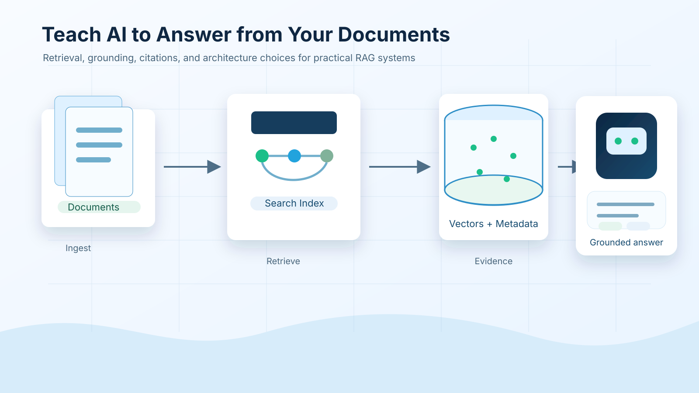

# Naučite AI odgovarjati na vprašanja na podlagi vaših dokumentov



Ta repozitorij zbira serijo blogov iz leta 2026 o izdelavi sistemov AI, ki temeljijo na dokumentih, z RAG, storitvami Azure AI, odprtokodnimi alternativami in postopki, usmerjenimi v evalvacijo.

## Ozadje

Leta 2023 sem delal na dveh vodičih o tem, kako naučiti ChatGPT odgovarjati na vprašanja iz PDF dokumentov z uporabo Azure AI Search in Azure OpenAI. Ideja "ChatGPT na vaših podatkih" se je takrat zdela še nova, cilj pa je bil pokazati praktičen potek dela: shranjevanje dokumentov, indeksiranje, iskanje relevantnih vsebin in generiranje odgovorov iz tega pridobljenega konteksta.

Leta 2026 je ekosistem RAG veliko večji. Azure AI Search podpira sodobne vzorce vektorskega in hibridnega iskanja, Azure OpenAI je del širšega ekosistema Microsoft Foundry Models, odprtokodna orodja, kot so LangGraph, LlamaIndex, Haystack, Qdrant, Milvus, Weaviate, Chroma, Ollama in vLLM, pa so postala praktične izbire za resnične sisteme.

Zato sem želel ponovno obravnavati to temo. Vprašanje ni več samo "Kako zgradim RAG?" Obstaja zdaj mnogo načinov za gradnjo, bolj pomembno vprašanje pa je "Katero arhitekturo naj izberem za svojo situacijo?"

Ta serija se začne pri tej plasti odločanja, nato pa jo spremeni v praktične vodiče. Prva pot implementacije gradi lokalni odprtokodni RAG sistem, ki ga lahko kdorkoli zažene s primeri podatkov, Qdrantom, Ollamo in Phi-4-mini.

## Članki

Za indeks člankov si oglejte [articles/README.md](./articles/README.md).

1. [Serija 1: RAG, Azure proti odprtokodnim alternativam in kdaj ima smisel prilagajanje](./articles/series-1-rag-azure-open-source-fine-tuning.md)
2. [Serija 2: Izgradnja lokalnega odprtokodnega RAG sistema od začetka do konca](./articles/series-2-open-source-rag-end-to-end.md)

V nadaljevanju:

- Ponovna izgradnja istega RAG sistema z Azure AI Search in Azure OpenAI.
- Dodajanje evalvacije in regresijskih preverjanj onkraj demo odgovorov.

## Zvezki

Implementacijski članki uporabljajo zvezke, tako da je mogoče postopke iskanja in evalvacije neposredno pregledati. Za navodila na nivoju mape si oglejte [notebooks/README.md](./notebooks/README.md).

> [!TIP]
> Začnite s Serijo 2, če želite najhitrejšo pot. Teče lokalno s primeri podatkov, CPU-prijaznimi vektorskimi predstavitvami, Qdrantom v lokalnem načinu in brez oblačnih poverilnic.

| Serija | Zvezek | Zahteve | Lokalna preveritev |
| --- | --- | --- | --- |
| Serija 2 | [Odprtokodni RAG zvezek](./notebooks/series-2-open-source-rag.ipynb) | [open-source-rag.txt](../../requirements/open-source-rag.txt) | Preverjen Qdrant v lokalnem načinu, iskanje, ponovno razvrščanje in povezovanje virov |

Za zagon zvezka lokalno ustvarite virtualno okolje in namestite ujemajočo se datoteko zahtev. Na primer:

```powershell
python -m venv .venv-series2
.\.venv-series2\Scripts\activate
python -m pip install -r requirements\open-source-rag.txt
```

## Primer podatkov

Zvezki uporabljajo majhen lokalni korpus v [sample_data](../../sample_data), da lahko primeri tečejo brez zasebnih dokumentov ali oblačnih poverilnic. Za podrobnosti glejte [sample_data/README.md](./sample_data/README.md).

- [school_ai_policy.md](./sample_data/school_ai_policy.md)
- [course_ai_guidance.md](./sample_data/course_ai_guidance.md)

## Povzetek lokalne preveritve

Rezultati preveritev so zapisani v vsakem članku in v [SERIES_PLAN.md](./SERIES_PLAN.md).

| Področje | Rezultat |
| --- | --- |
| Pot odprtokodnega RAG, Serija 2 | FastEmbed je generiral 384-dimenzijske lokalne predstavitve, Qdrant je v pomnilniško zbirko vstavil 8 vektorjev, lahkotno ponovno razvrščanje je pridobilo pričakovani odsek; neobvezna generacija Ollama je zaključena s `phi4-mini:3.8b` |

Lokalni zvezek namerno ne vsebuje trdo kodiranih skrivnosti.

## Lokalna generacija z Ollamo

Zvezek Serije 2 je privzeto varen za lokalno uporabo. Za omogočanje lokalne generacije z Ollamo kopirajte [.env.example](../../.env.example) v `.env` in vnesite vrednosti za Serijo 2.

Za generacijo z Ollamo v Seriji 2 odstranite komentar:

```text
SERIES2_OLLAMA_BASE_URL=http://localhost:11434
SERIES2_OLLAMA_MODEL=phi4-mini:3.8b
```

Zvezek Serije 2 samodejno naloži `.env` iz korena repozitorija z uporabo `python-dotenv`.

> [!IMPORTANT]
> Ne pošiljajte `.env` datotek, API ključev, zasebnih končnih točk ali najemniško specifičnih vrednosti v repozitorij. Repozitorij namerno ohranja skrivnosti zunaj Markdown datotek in zvezkov.

Datoteke zahtev so dokumentirane v [requirements/README.md](./requirements/README.md).

Za preverjanje povezav, strukture zvezkov, čistoče izhodov in vzorcev visokorizičnih skrivnosti:

```powershell
python -m venv .venv-verify
.\.venv-verify\Scripts\activate
python -m pip install -r requirements\all.txt
python scripts\verify_notebooks.py
```

Preveritveni skripti so dokumentirani v [scripts/README.md](./scripts/README.md).

Za zagon vseh lokalno varnih zvezkov v istem okolju:

```powershell
python scripts\verify_notebooks.py --execute
```

Isti preveritveni postopek teče v GitHub Actions ob pushih, pull requestih in ročnih zaganjanjih potekov. Osnutki člankov in zvezkov so namerno izključeni iz javne poti preverjanja.

Pred objavo posodobitev uporabite [PUBLISHING_CHECKLIST.md](./PUBLISHING_CHECKLIST.md).

Za trenutni povzetek neobjavljenih sprememb glejte [CHANGELOG.md](./CHANGELOG.md).

Za smernice glede prispevkov in urejenosti zvezkov glejte [CONTRIBUTING.md](./CONTRIBUTING.md).

## Podpora za več jezikov

### Podprto preko Co-op Translator (Avtomatizirano in vedno posodobljeno)

<!-- CO-OP TRANSLATOR LANGUAGES TABLE START -->
[Arabščina](../ar/README.md) | [Bengalščina](../bn/README.md) | [Bolgarščina](../bg/README.md) | [Burmanski (Mjanmar)](../my/README.md) | [Kitajščina (poenostavljena)](../zh-CN/README.md) | [Kitajščina (tradicionalna, Hongkong)](../zh-HK/README.md) | [Kitajščina (tradicionalna, Macau)](../zh-MO/README.md) | [Kitajščina (tradicionalna, Tajvan)](../zh-TW/README.md) | [Hrvaščina](../hr/README.md) | [Češčina](../cs/README.md) | [Danščina](../da/README.md) | [Nizozemščina](../nl/README.md) | [Estonščina](../et/README.md) | [Finščina](../fi/README.md) | [Francoščina](../fr/README.md) | [Nemščina](../de/README.md) | [Grščina](../el/README.md) | [Hebrejščina](../he/README.md) | [Hindijščina](../hi/README.md) | [Madžarščina](../hu/README.md) | [Indonezijščina](../id/README.md) | [Italijanščina](../it/README.md) | [Japonščina](../ja/README.md) | [Kannada](../kn/README.md) | [Khmerščina](../km/README.md) | [Korejščina](../ko/README.md) | [Litvščina](../lt/README.md) | [Malajščina](../ms/README.md) | [Malajalščina](../ml/README.md) | [Maratščina](../mr/README.md) | [Nepalščina](../ne/README.md) | [Nigerijski pidžin](../pcm/README.md) | [Norveščina](../no/README.md) | [Perzijščina (Farzi)](../fa/README.md) | [Poljščina](../pl/README.md) | [Portugalščina (Brazilija)](../pt-BR/README.md) | [Portugalščina (Portugalska)](../pt-PT/README.md) | [Pandžabi (Gurmukhi)](../pa/README.md) | [Romunščina](../ro/README.md) | [Ruščina](../ru/README.md) | [Srbščina (cirilica)](../sr/README.md) | [Slovaščina](../sk/README.md) | [Slovenščina](./README.md) | [Španščina](../es/README.md) | [Svahili](../sw/README.md) | [Švedščina](../sv/README.md) | [Tagalog (Filipino)](../tl/README.md) | [Tamilščina](../ta/README.md) | [Telugu](../te/README.md) | [Tajščina](../th/README.md) | [Turščina](../tr/README.md) | [Ukrajinščina](../uk/README.md) | [Urdu](../ur/README.md) | [Vietnamščina](../vi/README.md)

> **Raje klonirati lokalno?**
>
> Ta repozitorij vključuje več kot 50 jezikovnih prevodov, kar znatno poveča velikost prenosa. Za kloniranje brez prevodov uporabite sparzno odjavo:
>
> **Bash / macOS / Linux:**
> ```bash
> git clone --filter=blob:none --sparse https://github.com/skytin1004/teach-ai-to-answer-documents.git
> cd teach-ai-to-answer-documents
> git sparse-checkout set --no-cone '/*' '!translations' '!translated_images'
> ```
>
> **CMD (Windows):**
> ```cmd
> git clone --filter=blob:none --sparse https://github.com/skytin1004/teach-ai-to-answer-documents.git
> cd teach-ai-to-answer-documents
> git sparse-checkout set --no-cone "/*" "!translations" "!translated_images"
> ```
>
> S tem pridobite vse, kar potrebujete za dokončanje tečaja z veliko hitrejšim prenosom.
<!-- CO-OP TRANSLATOR LANGUAGES TABLE END -->

---

<!-- CO-OP TRANSLATOR DISCLAIMER START -->
**Omejitev odgovornosti**:
Ta dokument je bil preveden z uporabo AI prevajalske storitve [Co-op Translator](https://github.com/Azure/co-op-translator). Čeprav si prizadevamo za natančnost, vas prosimo, da upoštevate, da avtomatizirani prevodi lahko vsebujejo napake ali netočnosti. Izvirni dokument v njegovem izvirnem jeziku je treba obravnavati kot avtoritativni vir. Za kritične informacije je priporočljiv strokovni človeški prevod. Ne odgovarjamo za morebitna nesporazume ali napačne interpretacije, ki izhajajo iz uporabe tega prevoda.
<!-- CO-OP TRANSLATOR DISCLAIMER END -->