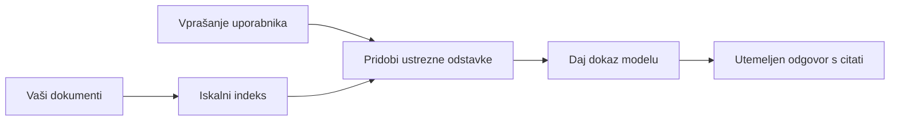

# Učite AI, da odgovarja na vprašanja na podlagi vaših dokumentov:
## Serija 1: RAG, Azure proti odprtokodnim alternativam in kdaj smiselno prilagajanje modela

> Prvi članek v seriji 2026, kjer ponovno pregledujem moje tutoriale iz leta 2023 o Azure AI Search + Azure OpenAI za vprašanja in odgovore iz dokumentov.

Navigacija serije: [Domača stran repozitorija](../README.md) | Naslednji: [Serija 2 - Gradnja lokalnega odprtokodnega RAG sistema od začetka do konca](./series-2-open-source-rag-end-to-end.md)

## 1. Uvod - Ponovni pregled prejšnjih RAG tutorialov

Leta 2023 sem delal na paru tutorialov o učenju ChatGPT, da odgovarja na vprašanja iz PDF dokumentov z uporabo Azure AI Search in Azure OpenAI. Napisal sem [LangChain različico](https://techcommunity.microsoft.com/blog/educatordeveloperblog/teach-chatgpt-to-answer-questions-using-azure-ai-search--azure-openai-lang-chain/3969713), prav tako pa sem soavtor spremljevalne [Semantic Kernel različice](https://techcommunity.microsoft.com/blog/educatordeveloperblog/teach-chatgpt-to-answer-questions-using-azure-ai-search--azure-openai-semantic-k/3985395) z [Lee Stottom](https://developer.microsoft.com/en-us/advocates/lee-stott), glavnim vodjo zagovornikov oblačnih rešitev pri Microsoftu. Takrat je bila ideja "ChatGPT na vaših podatkih" za mnoge razvijalce še nova. Tutoriali so uporabili Azure Blob Storage, Azure AI Search, Azure OpenAI, LangChain, Semantic Kernel in FAISS-stil iskanje vektorjev za odgovarjanje na vprašanja iz PDF datotek.

Prejšnji članek je bil osredotočen na enostaven, a pomemben potek dela: naloži dokumente, indeksiraj jih, pridobi relevantno vsebino in modeli naj odgovorijo na podlagi te vsebine.

Leta 2026 se je RAG ekosistem pomembno razširil. Azure AI Search zdaj podpira sodobne vzorce vektorskega in hibridnega iskanja, Azure OpenAI je del širšega Microsoft Foundry Models ekosistema, novejši v1 API pa lahko uporablja standardnega OpenAI klienta brez mesečnih sprememb `api-version`. Hkrati so odprtokodne opcije, kot so LangGraph, LlamaIndex, Haystack, Qdrant, Milvus, Weaviate, Chroma, Ollama in vLLM, postale praktične izbire za resnične RAG sisteme.

Zato sem želel to temo ponovno obravnavati. Vprašanje ni več samo "Kako zgradim RAG?" Zdaj obstaja mnogo načinov za gradnjo, pomembnejše vprašanje pa je "Katero arhitekturo naj izberem za mojo situacijo?"

A osnovni problem se ni spremenil.

AI model samodejno ne pozna vaših dokumentov. Za izgradnjo koristnega sistema za odgovarjanje na vprašanja o dokumentih še vedno potrebujete zanesljivo pridobivanje, ukoreninjenost, evalvacijo in operativne poteke dela.

Ta članek ni še en end-to-end tutorial "chat s PDF". To posodobljeno serijo želim začeti z vprašanjem, ki mi je zdaj pomembnejše: kdaj izbrati upravljano Azure arhitekturo, kdaj odprtokodni RAG sklad in kdaj ima prilagajanje modela dejanski smisel?

To je prvi članek v seriji o izgradnji AI sistemov, ukoreninjenih v dokumentih. V prvem delu se bomo osredotočili na odločitve o arhitekturi: zakaj je RAG pomemben, kdaj so uporabne upravljane storitve na Azure, kdaj smiselne odprtokodne alternative in kam spada prilagajanje modela.

Po gradnji in pregledu sistemov QA za dokumente me manj zanima, kateri je najboljši na demo predstavitvi, bolj me zanima katera arhitektura preživi resnične uporabnike, spreminjajoče se dokumente, pravice, napake in vzdrževanje.

## 2. Zakaj vaš AI potrebuje iskalni sistem

Veliki jezikovni modeli so usposobljeni na širokih javnih in licenciranih podatkih. Morda vedo veliko o splošnih temah, a ne poznajo samodejno vaših zasebnih PDF-jev, internih politik, podjetniških postopkov, arhivov raziskav, učnih gradiv, zapiskov podpore strankam ali nedavno posodobljene dokumentacije.

Preprost način razmišljanja o RAG je ta: namesto pričakovanja, da si bo model zapomnil vsak dokument, mu damo iskalni sistem. Ko uporabnik postavi vprašanje, sistem najprej najde najbolj relevantne informacije, te pa modelu posreduje kot kontekst.

To je pomembno, ker so mnogi resnični viri znanja zasebni, se stalno spreminjajo, zahtevajo dovoljenja, so shranjeni v različnih sistemih, napisani v različnih formatih in preveliki, da bi jih lahko neposredno prilepili v poziv.

Na primer, če ima šola, podjetje ali raziskovalna skupina 10.000 internih dokumentov, model ne zmore zanesljivo odgovoriti iz teh dokumentov, če sistem ne poišče pravih delov ob pravem času.

To naravno vodi do pogostega vprašanja:

Zakaj preprosto ne prilagoditi modela (fine-tune)?

Prilagajanje je lahko koristno, vendar običajno ni pravi prvi pristop za znanje iz dokumentov. Če se znanje pogosto spreminja, če so pomembni citati ali dostopna dovoljenja, je RAG navadno boljša izhodiščna točka. Prilagajanje je bolj primerno za učenje vedenja, stila, izhodnega formata in vzorcev opravil.

## 3. RAG arhitektura v praksi

Predstavljajte si, da gradite AI asistenta za šolo. Asistent mora odgovarjati na vprašanja iz politik v PDF-jih, vodičev po predmetih, internih FAQ strani in nedavno posodobljenih najav.

Če študent vpraša: "Ali lahko uporabim generativni AI za svojo zaključni nalogo?", sistem ne sme odgovarjati iz splošnega spomina modela. Najprej mora najti relevantno šolsko politiko, pridobiti odsek o uporabi AI in nato modelu postaviti vprašanje za odgovor s to dokazno podlago.

To je RAG v praksi.

Visoko na ravni lahko tok razmišljate tako:

Podrobnosti so lahko bolj kompleksne, a osnovna ideja je preprosta: model ne odgovarja sam, odgovarja na podlagi pridobljenih dokazov.

Najprej se dokumenti naložijo iz shranjevalnih sistemov, kot so Azure Blob Storage, SharePoint, GitHub ali notranji CMS. Sistem jih nato razčleni v besedilo ob ohranjanju uporabne strukture, kot so naslovi, številke strani, tabele, odseki in lokacije virov.

Nato se vsebina razdeli na segmente. Ta korak je videti preprost, a je ena ključnih komponent sistema. Če je segment premajhen, lahko izgubi kontekst. Če je prevelik, lahko vsebuje nepovezane informacije in zmanjša natančnost iskanja.

Po segmentaciji sistem ustvari vektorske predstavitve (embeddinge) in jih shrani v iskalni indeks skupaj z izvirnim besedilom in metapodatki, kot so ime datoteke, številka strani, dovoljenja, verzija dokumenta in URL vira.

Ko uporabnik postavi vprašanje, sistem pridobi kandidatne segmente z iskanjem po ključnih besedah, iskanjem vektorjev ali hibridnim iskanjem. Prenazorilec (reranker) lahko te segmente preuredi tako, da so najbolj uporabni dokazi na vrhu.

Na koncu model prejme vprašanje in pridobljene dokaze. Odgovor mora temeljiti na teh dokazih in vrniti navedbe virov, da jih lahko uporabnik pregleda.

Pomembno je, da RAG ni samo "postavi PDF-je v vektorsko bazo". Kakovost odgovora je odvisna od celotnega poteka dela: razčlenjevanja, segmentacije, pridobivanja, prenazoriljenja, pozivanja, citiranja in evalvacije.

Zato je struktura dokumenta pomembna. V PDF-ju lahko naslov, tabela, opomba ali meja strani spremenijo pomen odstavka. V Azure okolju veščina Document Layout uporablja zmogljivosti Azure Document Intelligence za ustvarjanje izhoda, ki upošteva strukturo, kar lahko izboljša kakovost segmentacije in pridobivanja za RAG sisteme.

## 4. Kaj se je spremenilo od leta 2023?

Tutorial iz 2023 je bil dober začetek za svoj čas:

- Azure Blob Storage je shranjeval PDF datoteke.
- Azure AI Search je indeksiral vsebino.
- LangChain je povezoval pridobivanje z Azure OpenAI.
- FAISS je deloval kot preprosta lokalna shramba vektorjev.
- Primer je uporabljal `gpt-35-turbo` in `text-embedding-ada-002`.

Leta 2026 naj bi moderna različica odražala več sprememb.

Najprej je pridobivanje dozorelo. Leta 2023 so mnogi demo prikazi uporabljali preprosto iskanje po podobnosti vektorjev. Danes je hibridno iskanje pogosto privzeti izhodiščni točki za resne dokumentarne QA sisteme. Azure AI Search podpira hibridno iskanje s kombinacijo iskanja po ključnih besedah in vektorjih v enem zahtevku ter združevanjem rezultatov z Reciprocal Rank Fusion. Semantični razvrščevalec lahko nato prenazori besedilno plat celotnega besedila, vektorjev in hibridnih rezultatov.

Drugič, ingestija je bolj izpopolnjena. Namesto ročnega razdeljevanja vsakega dokumenta z aplikacijsko kodo Azure AI Search podpira integrirano vektorizacijo za segmentacijo, ustvarjanje vektorjev in vektorizacijo med poizvedbo. Za PDF-je in dokumente težke obremenitve veščina Document Layout ohrani več strukture kot fiksno velikostni segmenti.

Tretjič, orkestracija je pomembnejša. Težki del pogosto ni sam LLM API klic, ampak upravljanje napak, ponovitev, zastarelih rezultatov, kakovosti segmentov, dolgih potekov dela, človeškega pregleda in evalvacije v merilu. Tu orodja, usmerjena v potek dela, kot so LangGraph, LlamaIndex poteki, Haystack cevovodi ter platforma za evalvacijo in opazovanje postanejo bolj relevantni kot ena linearna veriga.

Četrtič, evalvacija ni več opcijska. Demo lahko izgleda impresivno z enim vprašanjem. Produkcijski sistem potrebuje testne sete, regresijska preverjanja, metrike pridobivanja, preverjanja ukoreninjenosti in monitoring. Brez evalvacije je težko vedeti, ali se sistem izboljšuje ali le spreminja.

## 5. Izbira med Azure in odprtokodnimi RAG skladi

Ne mislim, da je uporabno vprašanje "Je Azure boljši od odprtokodnega?" ali "Je odprtokodno boljše od Azure?"

Uporabno vprašanje je: kakšen sistem gradite, kdo bo upravljal, kakšne omejitve imate in kateri načini napak so nesprejemljivi?

Ko sem začel graditi primere za dokumentarne QA, sem večinoma razmišljal, ali pridobivanje deluje. Ali lahko naložim PDF-je, jih poiščem in ustvarim odgovor? To je bil razumljiv začetek.

Po delanju bolj realističnih AI potekov evalvacija se je spremenila. Zdaj gledam na štiri stvari pred izbiro RAG sklada:

- identiteta in dovoljenja
- kakovost pridobivanja
- zanesljivost poteka dela
- operativno lastništvo

Ta štiri področja povedo veliko več kot modelski benchmark sam.

Arhitekture na osnovi Azure običajno smiselno uporabimo, ko je težava povezava v podjetju. Če ekipa že uporablja Microsoft Entra ID, Microsoft 365, Azure Storage, zasebno omrežje, RBAC in Azure monitoring, lahko Azure AI Search in Azure OpenAI močno zmanjšata operativno zapletenost. V tem okolju Azure ni le model API. Vrednost je v obkrožujočem sistemu: identiteti, upravljanju, upravljanemu iskanju, integraciji varnosti, podpori in znanih operacijah.

Odprtokodne arhitekture so smiselne, ko je fleksibilnost glavna težava. Če ekipa potrebuje lokalno sklepanje, prenosljivost v oblak, prilagojeni cevovod pridobivanja, specializirano prenazoritev ali neposredni nadzor nad vektorsko bazo in plastjo strežbe modelov, je odprtokodni sklad lahko bolj primeren. Cena je, da ekipa prevzame več odgovornosti za zanesljivost: varnostne kopije, skaliranje, zakasnitve, migracije, monitoring in varnost.

V praksi mnogi produkcijski AI sistemi niso popolnoma oblačni ali popolnoma odprtokodni. Pogosto so hibridni sistemi, ki uravnotežijo preprostost upravljanja, prenosljivost, upravljanje in inženirsko fleksibilnost.

Na primer, ne bi me presenetilo, če bi sistem uporabljal Azure OpenAI za dostop do modela, LangGraph za orkestracijo poteka dela, Azure gostovanje za namestitev in odprtokodno vektorsko bazo za specifične zahteve pridobivanja. To ni arhitekturna nepravilnost. To je izbira prave ravni upravljane storitve in inženirskega nadzora za vsak del sistema.

Rad imam hibridne arhitekture, kjer upravljana platforma rešuje pomembne podjetniške težave, odprtokodni sestavni deli pa ekipi dajo fleksibilnost tam, kjer je resnično pomembna.

## 6. Praktični vodič za odločanje

Tu je odločilna tabela, ki bi jo uporabil z ekipo pred izbiro RAG sklada:

| Področje odločitve | Azure upravljani sklad je močnejši, ko... | Odprtokodni sklad je močnejši, ko... |
| --- | --- | --- |
| Identiteta in dostop | Entra ID, RBAC, upravljana identiteta in podjetniška dovoljenja so osrednji | prevladuje prilagojena avtentikacija, ne-Microsoft identiteta ali logika dostopa specifična za aplikacijo |
| Operacije | ekipa želi upravljano infrastrukturo, podporo, SLA-je in preprosto uvajanje | ekipa lahko upravlja vektorske baze, strežbo modelov, varnostne kopije in skaliranje |
| Pridobivanje | hibridno iskanje, semantično razvrščanje, filtri in iskanje metapodatkov pokrivajo večino potreb | ekipa potrebuje prilagojeno pridobivanje, specializirano prenazoritev ali eksperimentalno indeksiranje |
| Prenosljivost | sprejemljiva ali želena je usklajenost z Azure ekosistemom | zahteva se izogibanje zakupljenosti na oblak |
| Sklepanje | pomembno je upravljanje Azure OpenAI, omrežje in podjetniški nadzor | potrebna je lokalna izvedba, prilagojeni modeli ali lastna strežba |
| Stroški | pomembno je znižanje inženirskega in operativnega napora bolj kot optimizacija infrastrukture | obseg je dovolj velik, da upraviči skrbno optimizacijo infrastrukture |
| Eksperimentiranje | stabilnost in podjetniška integracija sta pomembnejša kot pogoste menjave komponent | ekipa hitro iterira na agentih, orodjih, pomnilniku in potekih pridobivanja |

Moj praktični nasvet je preprost:

- Začnite z Azure, če so glavna tveganja podjetniška integracija, varnost in preprostost operacij.
- Začnite z odprtokodnim, če so glavna tveganja prenosljivost, prilagoditev ali lokalni nadzor.
- Uporabite hibridni sklad, kadar so oba pogoja resnična.

Zato tudi ne bi začel serije RAG 2026 neposredno s kodo. Koda je pomembna, a izbira arhitekture pride pred implementacijo. Preprost demo lahko prikrije najtežje odločitve. Dobri RAG sistem te odločitve naredi jasne.

## 7. Kam sodi prilagajanje modela (Fine-Tuning)

Prilagajanje modela se pogosto omenja skupaj z RAG, a mislim, da je pomembno ločiti ti dve temi.

RAG je običajno boljša izbira, kadar sistem potrebuje sveže, zasebno, občutljivo na dovoljenja ali z viri ukoreninjeno znanje. Če naj odgovor navaja dokumente, odraža nedavne posodobitve ali spoštuje uporabniške dostopne pravila, je pridobivanje del arhitekture.
Prilagajanje je bolj uporabno, kadar znanje ni glavni problem. Lahko pomaga, ko želite, da model sledi določenemu izhodnemu formatu, se ujema z odzivnim slogom, specifičnim za določeno področje, izvaja stabilno nalogo bolj dosledno ali zmanjša količino navodil, potrebnih v vsakem pozivu.

V praksi lahko oba pristopa delujeta skupaj. Pomočnik za podporo lahko uporablja RAG za iskanje najnovejše politike, medtem ko se prilagojeni model nauči želene strukture odgovora in tona podjetja.

Napaka je, če prilagajanje obravnavamo kot nadomestilo za shrambo dokumentov. Ne odpravlja potrebe po iskanju, kadar mora sistem odgovarjati na osnovi svežih, zasebnih ali podatkov, za katere so potrebna dovoljenja.

## 8. Kam gre ta serija naslednje

Ta članek je plast odločanja. Pred pisanjem kode sem želel jasno izraziti kompromise: RAG proti prilagajanju, Azure proti odprtokodni rešitvi, upravljane storitve proti operativnemu nadzoru.

Preden grem v implementacijo, želim tukaj pustiti eno točko: v mnogih podjetniških AI sistemih je model samo ena komponenta. Kakovost iskanja, orkestracija, ocenjevanje, dovoljenja in operativna zanesljivost pogosto določajo, ali sistem uspe preseči stopnjo demonstracije.

V naslednjih delih te serije nameravam poglobiti praktični vidik sistemov AI, ki temeljijo na dokumentih: najprej zgraditi lokalni odprtokodni RAG delovni tok, nato znova zgraditi isti scenarij z Azure AI Search in Azure OpenAI, in nato oceniti, ali sistem dejansko deluje.

Morda bom po potrebi prilagodil vrsto, medtem ko se serija razvija, vendar bo cilj ostal enak: premakniti se onkraj preproste demonstracije in pokazati, kako razmišljati o RAG sistemih, ki jih je mogoče vzdrževati, ocenjevati in upravljati.

## 9. Viri in reference

Originalni vodiči:

- [Učite ChatGPT odgovarjati na vprašanja: uporaba Azure AI Search & Azure OpenAI (Lang Chain)](https://techcommunity.microsoft.com/blog/educatordeveloperblog/teach-chatgpt-to-answer-questions-using-azure-ai-search--azure-openai-lang-chain/3969713)
- [Učite ChatGPT odgovarjati na vprašanja: uporaba Azure AI Search & Azure OpenAI (Semantic Kernel)](https://techcommunity.microsoft.com/blog/educatordeveloperblog/teach-chatgpt-to-answer-questions-using-azure-ai-search--azure-openai-semantic-k/3985395)

Azure:

- [Različice Azure AI Search REST API](https://learn.microsoft.com/en-us/rest/api/searchservice/search-service-api-versions)
- [Hibridno iskanje v Azure AI Search](https://learn.microsoft.com/en-us/azure/search/hybrid-search-how-to-query)
- [Integrirana vektorizacija v Azure AI Search](https://learn.microsoft.com/en-us/azure/search/vector-search-integrated-vectorization)
- [Veščina postavitve dokumenta v Azure AI Search](https://learn.microsoft.com/en-us/azure/search/cognitive-search-skill-document-intelligence-layout)
- [Razdeljevanje in vektorizacija glede na postavitev dokumenta](https://learn.microsoft.com/en-us/azure/search/search-how-to-semantic-chunking)
- [Semantično rangiranje v Azure AI Search](https://learn.microsoft.com/en-us/azure/search/semantic-search-overview)
- [Življenjski cikel API različic Azure OpenAI / Microsoft Foundry](https://learn.microsoft.com/en-us/azure/foundry/openai/api-version-lifecycle)
- [Modeli Foundry, ki jih prodaja Azure](https://learn.microsoft.com/en-us/azure/foundry/foundry-models/concepts/models-sold-directly-by-azure)
- [Premisleki o prilagajanju v Microsoft Foundry](https://learn.microsoft.com/en-us/azure/foundry/openai/concepts/fine-tuning-considerations)
- [Opazovanje v Microsoft Foundry](https://learn.microsoft.com/en-us/azure/foundry/concepts/observability)
- [Izvajanje ocen v Microsoft Foundry](https://learn.microsoft.com/en-us/azure/foundry/how-to/evaluate-generative-ai-app)

Odprtokodno:

- [Dokumentacija LangGraph](https://docs.langchain.com/oss/python/langgraph/overview)
- [Dokumentacija LlamaIndex](https://developers.llamaindex.ai/python/framework/)
- [Dokumentacija Haystack](https://docs.haystack.deepset.ai/)
- [Dokumentacija Qdrant](https://qdrant.tech/documentation/overview/)
- [Dokumentacija Milvus](https://milvus.io/docs/overview.md)
- [Dokumentacija Weaviate](https://docs.weaviate.io/weaviate/current/)
- [Dokumentacija Chroma](https://docs.trychroma.com/docs/overview/introduction)
- [Ollama vdelane predstavitve](https://docs.ollama.com/capabilities/embeddings)
- [vLLM strežnik združljiv z OpenAI](https://docs.vllm.ai/en/latest/serving/openai_compatible_server.html)
- [BGE modeli vdelav](https://huggingface.co/BAAI/bge-large-en-v1.5)
- [E5 modeli vdelav](https://huggingface.co/intfloat/e5-large-v2)
- [Instructor modeli vdelav](https://huggingface.co/hkunlp/instructor-large)

Naslednje: [Serija 2 - Zgradite lokalni odprtokodni RAG sistem od začetka do konca](./series-2-open-source-rag-end-to-end.md)

---

<!-- CO-OP TRANSLATOR DISCLAIMER START -->
**Omejitev odgovornosti**:
Ta dokument je bil preveden z uporabo AI prevajalske storitve [Co-op Translator](https://github.com/Azure/co-op-translator). Čeprav si prizadevamo za natančnost, vas prosimo, da upoštevate, da avtomatizirani prevodi lahko vsebujejo napake ali netočnosti. Izvirni dokument v njegovem izvirnem jeziku je treba obravnavati kot avtoritativni vir. Za kritične informacije je priporočljiv strokovni človeški prevod. Ne odgovarjamo za morebitna nesporazume ali napačne interpretacije, ki izhajajo iz uporabe tega prevoda.
<!-- CO-OP TRANSLATOR DISCLAIMER END -->