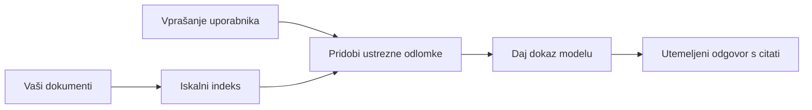

# Naučite AI odgovarjati na vprašanja na podlagi vaših dokumentov:
## Serija 1: RAG, Azure proti odprtokodnim alternativam in kdaj ima smisel fino prilagajanje

> Prvi članek v seriji za leto 2026, ki ponovno obravnava moje vodiče za dokumentno QA z Azure AI Search + Azure OpenAI iz leta 2023.

## 1. Uvod – Ponoven pogled na prejšnji vodič o RAG

Leta 2023 sem delal na paru vodičev o tem, kako naučiti ChatGPT odgovarjati na vprašanja iz PDF dokumentov z uporabo Azure AI Search in Azure OpenAI. Napisal sem [LangChain različico](https://techcommunity.microsoft.com/blog/educatordeveloperblog/teach-chatgpt-to-answer-questions-using-azure-ai-search--azure-openai-lang-chain/3969713), sodeloval pa sem tudi pri spremljajoči [Semantic Kernel različici](https://techcommunity.microsoft.com/blog/educatordeveloperblog/teach-chatgpt-to-answer-questions-using-azure-ai-search--azure-openai-semantic-k/3985395) skupaj z [Lee Stottom](https://developer.microsoft.com/en-us/advocates/lee-stott), glavnim vodjo zagovorništva oblačnih rešitev pri Microsoftu. Takrat je ideja "ChatGPT na vaših podatkih" mnogim razvijalcem še delovala nova. Vodiči so uporabili Azure Blob Storage, Azure AI Search, Azure OpenAI, LangChain, Semantic Kernel in iskanje po vektorjih v stilu FAISS za odgovarjanje na vprašanja iz PDF datotek.

Takratni članek se je osredotočil na preprost, a pomemben potek dela: naloži dokumente, jih indeksiraj, poišči ustrezno vsebino in modelu zastavi vprašanje na podlagi te vsebine.

Leta 2026 se je ekosistem RAG znatno razširil. Azure AI Search zdaj podpira sodobne vzorce vektorskega in hibridnega iskanja, Azure OpenAI je del širšega Microsoft Foundry Models ekosistema, novejši v1 API pa lahko uporablja standardnega OpenAI klienta brez mesečnih sprememb `api-version`. Hkrati so odprtokodne možnosti, kot so LangGraph, LlamaIndex, Haystack, Qdrant, Milvus, Weaviate, Chroma, Ollama in vLLM, postale praktične izbire za prave RAG sisteme.

Zato sem želel to temo ponovno obravnavati. Vprašanje ni več samo "Kako zgradim RAG?" Sedaj je veliko načinov za gradnjo, bolj pomembno vprašanje pa je "Katero arhitekturo naj izberem za svoj primer?"

A osnovna težava ostaja enaka.

AI model samodejno ne pozna vaših dokumentov. Za gradnjo koristnega sistema za odgovarjanje na vprašanja iz dokumentov še vedno potrebujete zanesljivo iskanje, utemeljitev, ocenjevanje in operativne tokove.

Ta članek ni še en vodič "pogovor s PDF-jem" od začetka do konca. Začetek te posodobljene serije želim posvetiti vprašanju, ki mi je zdaj bolj pomembno: kdaj izbrati upravljano Azure arhitekturo, kdaj odprtokodni RAG paket in kdaj ima fino prilagajanje dejansko smisel?

To je prvi članek v seriji o izgradnji AI sistemov, utemeljenih na dokumentih. V tem prvem delu se bomo osredotočili na arhitekturne odločitve: zakaj je pomemben RAG, kdaj so uporabne upravljane storitve na Azure, kdaj imajo smisel odprtokodne alternative in kam spada fino prilagajanje.

Po izgradnji in ponovnem pregledu sistemov za dokumentno QA me manj zanima, kateri pripomoček izgleda najbolje na demo predstavitvi, bolj pa me zanima, katera arhitektura vzdrži prave uporabnike, spreminjajoče se dokumente, dovoljenja, napake in vzdrževanje.

## 2. Zakaj vaš AI potrebuje iskalni sistem

Veliki jezikovni modeli so usposobljeni na širokih javnih in licenciranih podatkih. Morda vedo veliko o splošnih temah, vendar samodejno ne poznajo vaših zasebnih PDF-jev, notranjih pravilnikov, podjetniških postopkov, arhivov raziskav, učnih gradiv, not za podporo strankam ali nedavno posodobljene dokumentacije.

Enostavno razmišljanje o RAG je takšno: namesto da pričakujemo, da si bo model zapomnil vsak dokument, mu damo iskalni sistem. Ko uporabnik postavi vprašanje, sistem najprej najde najbolj relevantne informacije, nato pa te dele poda modelu kot kontekst.

To je pomembno, ker so mnogi realni viri znanja zasebni, stalno se spreminjajo, so odvisni od dovoljenj, shranjeni so v več sistemih, napisani v različnih formatih in preveliki, da bi jih lahko neposredno vnesli v poziv.

Na primer, če ima šola, podjetje ali raziskovalna skupina 10.000 notranjih dokumentov, model ne more zanesljivo odgovarjati iz teh dokumentov, razen če sistem postopoma iskreno poišče prave dele ob pravem času.

To naravno vodi do pogostega vprašanja:

Zakaj ne uporabiti kar fino prilagajanje modela?

Fino prilagajanje je lahko uporabno, a navadno ni prava prva izbira za znanje iz dokumentov. Če se znanje pogosto spreminja, če so citati pomembni ali če imajo dostopna dovoljenja pomen, je RAG običajno boljši začetek. Fino prilagajanje bolje služiti za učenje vedenja, sloga, formata izhodov in vzorcev nalog.

## 3. RAG arhitektura v praksi

Predstavljajte si, da gradite AI pomočnika za šolo. Pomočnik mora odgovarjati na vprašanja iz PDF-jev s pravilniki, učnih načrtov, notranjih FAQ strani in nedavno posodobljenih obvestil.

Če študent vpraša: "Ali lahko za svojo končno nalogo uporabim generativni AI?", sistem ne sme odgovarjati iz splošnega modelovega spomina. Najprej mora najti ustrezni šolski pravilnik, pridobiti odsek o uporabi AI in nato modelu zastaviti vprašanje, da odgovori na podlagi tega dokaza.

To je RAG v praksi.

Na visokem nivoju lahko tok delovanja izgledà takole:

Podrobnosti so lahko bolj zapletene, a osnovna ideja je preprosta: model ne odgovarja sam. Odgovarja z dokazanimi informacijami.

Najprej se dokumenti vnesejo iz sistemov za shranjevanje, kot so Azure Blob Storage, SharePoint, GitHub ali notranji CMS. Nato jih sistem razčleni v besedilo ob ohranitvi koristne strukture, kot so naslovi, številke strani, tabele, razdelki in lokacije vira.

Nato se vsebina razdeli na koščke. Ta korak se zdi preprost, a je eden najpomembnejših delov sistema. Če je košček premajhen, lahko izgubi okoliški kontekst. Če je prevelik, lahko vključuje nepovezane informacije in zmanjša natančnost iskanja.

Po razdelitvi na koščke sistem ustvari vdelave (embeddings) in jih shrani v iskalni indeks skupaj z originalnim besedilom in metapodatki, kot so ime datoteke, številka strani, dovoljenja, verzija dokumenta in URL vira.

Ko uporabnik postavi vprašanje, sistem poišče kandidatne koščke z iskanjem po ključnih besedah, vektorskim iskanjem ali hibridnim iskanjem. Ponovni razvrščevalnik (reranker) lahko nato preuredi te koščke, da je najbolj uporaben dokaz na vrhu.

Na koncu model prejme vprašanje in pridobljene dokaze. Odgovor mora temeljiti na teh dokazih in vrniti citate, da lahko uporabnik preveri vir.

Pomembno je, da RAG ni samo "vstavi PDF-je v vektorsko bazo". Kakovost odgovora je odvisna od celotnega procesa: razčlenjevanja, razdelitve na koščke, iskanja, ponovnega razvrščanja, pozivanja, navedkov in ocenjevanja.

Zato ima dokumentna struktura pomen. V PDF-ju naslovi, tabele, opombe pod črto ali robovi strani lahko spremenijo pomen odstavka. Na Azure uporabljena Document Layout spretnost z zmogljivostmi Azure Document Intelligence omogoča izhod, ki upošteva strukturo, kar lahko izboljša kakovost razdelitve in iskanja za RAG sisteme.

## 4. Kaj se je spremenilo od leta 2023?

Vodič iz leta 2023 je bil dober začetek za svoj čas:

- Azure Blob Storage je hranil PDF datoteke.
- Azure AI Search je indeksiral vsebino.
- LangChain je povezoval iskanje z Azure OpenAI.
- FAISS je deloval kot enostavna lokalna vektorska shramba.
- Primer je uporabljal `gpt-35-turbo` in `text-embedding-ada-002`.

Leta 2026 bi moderna različica morala upoštevati več sprememb.

Najprej se je iskanje izboljšalo. Leta 2023 so številni prikazi uporabljali preprosto vektorsko iskanje podobnosti. Danes je hibridno iskanje pogosto privzet začetni korak resnega dokumentnega QA. Azure AI Search podpira hibridno iskanje s kombiniranjem poizvedb po ključnih besedah in vektorjih v eni zahtevi ter združevanjem rezultatov z Reciprocal Rank Fusion. Semantični razvrščevalnik lahko nato ponovno razvrsti besedilni del polnovrednih, vektorskih in hibridnih rezultatov.

Drugič, vnos je bolj napreden. Namesto ročnega deljenja vsakega dokumenta z aplikacijsko kodo, Azure AI Search podpira integrirano vektorizacijo za delitev na koščke, ustvarjanje vdelav (embeddings) in vektorizacijo med poizvedbo. Pri PDF-jih in velikih obremenitvah z dokumenti lahko Document Layout spretnost ohrani več strukture kot koščki fiksne velikosti.

Tretjič, orkestracija postaja pomembnejša. Težava pogosto ni klic LLM API-ja sam po sebi. Težava je upravljanje napak, ponovnih poskusov, nepopolnega iskanja, kakovosti koščkov, dolgotrajnih procesov, človeškega pregleda in ocenjevanja v velikem obsegu. Tu orodja, usmerjena v tokove dela, kot so LangGraph, delovni tokovi LlamaIndex, Haystack cevovodi in orodja za platformno ocenjevanje in opazovanje, postanejo bolj pomembni kot ena linearna veriga.

Četrtič, ocenjevanje ni več opcijsko. Demo lahko deluje impresivno z enim samim vprašanjem. Proizvodni sistem potrebuje testne nabore, preverjanja regresije, metrike iskanja, kontrole utemeljenosti in spremljanje. Brez ocenjevanja je težko vedeti, ali se sistem izboljšuje ali samo spreminja.

## 5. Izbira med Azure in odprtokodnimi RAG paketi

Ne mislim, da je koristno vprašanje "Ali je Azure boljši od odprte kode?" ali "Ali je odprta koda boljša od Azure?"

Koristno vprašanje je: kakšen sistem gradite, kdo ga bo upravljal, kakšne omejitve imate in kateri vzroki okvar so nesprejemljivi?

Ko sem začel graditi primere za dokumentno QA, sem večinoma razmišljal, ali iskanje deluje. Ali lahko naložim PDF-je, jih iščem in generiram odgovor? To je bil razumen začetek.

Po delu z bolj realističnimi AI tokovi moj pogled se je spremenil. Zdaj pri izbiri RAG paketa gledam štiri stvari:

- identiteto in dovoljenja
- kakovost iskanja
- zanesljivost poteka dela
- operativno lastništvo

Ti štirje vidiki povedo veliko več kot samo modelni benchmark.

Azure arhitekture običajno imajo smisel, ko je integracija v podjetje težaven del. Če ekipa že uporablja Microsoft Entra ID, Microsoft 365, Azure Storage, zasebna omrežja, RBAC in spremljanje Azure, lahko Azure AI Search in Azure OpenAI znatno zmanjšata operativno kompleksnost. V tem okolju ni Azure le API modela. Vrednost je v okolju sistema: identiteta, upravljanje, upravljano iskanje, integracija varnosti, podpora in znani operativni postopki.

Odprtokodne arhitekture imajo običajno smisel, ko je fleksibilnost zahtevna. Če ekipa potrebuje lokalno sklepanje, oblačno prenosljivost, prilagojeni cevovod iskanja, specializirano ponovno razvrščanje ali neposreden nadzor nad bazo vektorjev in plasti postrežbe modela, je odprtokodni paket lahko bolj primeren. Cena je, da ekipa prevzame več zanesljivostnih nalog: varnostne kopije, skaliranje, zakasnitve, migracije, spremljanje in varnost.

V praksi mnogi proizvodni AI sistemi niso povsem oblačno naravni ali čisti odprtokodni. So pogosto hibridni sistemi, ki uravnotežijo operativno preprostost, prenosljivost, upravljanje in fleksibilnost inženiringa.

Na primer, ne bi me presenetilo, če bi sistem uporabil Azure OpenAI za dostop do modela, LangGraph za orkestracijo poteka, Azure gostovanje za namestitev in odprtokodno bazo vektorjev za specifično zahtevo po iskanju. To ni arhitekturna nedoslednost. To je izbira pravilne ravni upravljane storitve in inženirskega nadzora za vsak del sistema.

Prihaja mi hibridna arhitektura všeč, ko upravljana platforma reši pomembne podjetniške probleme, medtem ko odprtokodne komponente ekipi nudijo fleksibilnost tam, kjer je to zares pomembno.

## 6. Praktični vodič za odločitev

Tukaj je tabela odločitev, ki bi jo uporabil z ekipo pred izbiro RAG paketa:

| Področje odločanja | Azure upravljani paket je močnejši, kadar... | Odprtokodni paket je močnejši, kadar... |
| --- | --- | --- |
| Identiteta in dostop | Entra ID, RBAC, upravljana identiteta in enterprise dovoljenja so osrednji | prevladuje prilagojena avtentikacija, ne-Microsoft identiteta ali logika dostopa specifična za aplikacijo |
| Operacije | ekipa želi upravljano infrastrukturo, podporo, SLA-je in lažje vključevanje | ekipa lahko upravlja vektorske baze, postrežbo modelov, varnostne kopije in skaliranje |
| Iskanje | hibridno iskanje, semantično rangiranje, filtri in metapodatkovno iskanje pokrivajo večino potreb | ekipa potrebuje prilagojeno iskanje, specializirano ponovno razvrščanje ali eksperimentalno indeksiranje |
| Prenosljivost | usklajenost z Azure ekosistemom je sprejemljiva ali zaželena | izogibanje zaklepanju v oblak je stroga zahteva |
| Sklepanje | pomembna je uprava Azure OpenAI, omrežja in podjetniški nadzor | zahtevano je lokalno sklepanje, prilagojeni modeli ali samostojna postrežba |
| Stroški | zmanjševanje inženirskega in operativnega napora je pomembneje od nastavitve infrastrukture | sistem je dovolj obsežen za upravičitev skrbnega optimiziranja infrastrukture |
| Eksperimentiranje | stabilnost in integracija v podjetje imata večjo težo kot pogoste menjave komponent | ekipa hitro iterira na agentih, orodjih, spominu in tokovih iskanja |

Moje pravilo je preprosto:

- Začnite z Azure, ko so integracija v podjetje, varnost in operativna preprostost glavna tveganja.
- Začnite z odprtokodnim, ko so prenosljivost, prilagodljivost ali lokalni nadzor glavna tveganja.
- Uporabite hibridni paket, ko veljata oba pogoja.

Zato tudi ne bi začel serije RAG za leto 2026 s kodo na začetku. Koda je pomembna, a izbira arhitekture pride pred implementacijo. Preprost demo lahko skriva najtežje izbire. Dober RAG sistem jih izpostavi.

## 7. Kam spada fino prilagajanje

Fino prilagajanje se pogosto omenja skupaj z RAG, a menim, da je pomembno razlikovati oba.

RAG je običajno boljša izbira, ko sistem potrebuje sveže, zasebno, od dovoljenj odvisno ali virno podprto znanje. Če naj odgovor navaja dokumente, odraža nedavne posodobitve ali upošteva pravila dostopa do uporabnika, mora biti iskanje del arhitekture.

Fino prilagajanje je uporabnejše, ko znanje ni glavna težava. Lahko pomaga, ko želite, da model upošteva določen izhodni format, ustreza slogovno specifičnemu področju, opravlja stabilno nalogo bolj dosledno ali zmanjša količino navodil za vsak poziv.
V praksi lahko oba skupaj delujeta. Pomočnik za podporo lahko uporabi RAG za pridobitev najnovejše politike, medtem ko se fino nastavljen model uči želeno strukturo odgovora in ton podjetja.

Napaka je, če fino nastavitev obravnavamo kot nadomestilo za shrambo dokumentov. Ne odpravi potrebe po pridobivanju podatkov, ko mora sistem odgovarjati na podlagi svežih, zasebnih ali dovoljenjsko občutljivih podatkov.

## 8. Kam ta serija vodi naprej

Ta članek je sloj za odločanje. Pred pisanjem kode sem želel jasno opredeliti kompromise: RAG proti finemu nastavljanju, Azure proti odprtokodnim rešitvam, upravljane storitve proti operativnemu nadzoru.

Preden preidem k izvedbi, želim tukaj pustiti eno misel: v mnogih poslovnih AI sistemih je model le en komponent. Kvaliteta pridobivanja, orkestracija, ocenjevanje, pravice in operativna zanesljivost so pogosto tisti dejavniki, ki odločajo, ali sistem uspe preseči demo fazo.

V naslednjih delih te serije nameravam bolj poglobljeno obravnavati praktični vidik AI sistemov, temelječih na dokumentih: kako zgraditi arhitekturo na osnovi Azure, kako se odprtokodne alternative primerjajo v praksi in kako oceniti, ali sistem RAG dejansko deluje.

Morda bom zaporedje prilagodil, ko se serija razvija, vendar bo cilj ostal isti: preseči preprost demo in pokazati, kako razmišljati o RAG sistemih, ki jih je mogoče vzdrževati, ocenjevati in upravljati.

## 9. Viri in reference

Izvirni vodiči:

- [Teach ChatGPT to Answer Questions: Using Azure AI Search & Azure OpenAI (Lang Chain)](https://techcommunity.microsoft.com/blog/educatordeveloperblog/teach-chatgpt-to-answer-questions-using-azure-ai-search--azure-openai-lang-chain/3969713)
- [Teach ChatGPT to Answer Questions: Using Azure AI Search & Azure OpenAI (Semantic Kernel)](https://techcommunity.microsoft.com/blog/educatordeveloperblog/teach-chatgpt-to-answer-questions-using-azure-ai-search--azure-openai-semantic-k/3985395)

Azure:

- [Azure AI Search REST API versions](https://learn.microsoft.com/en-us/rest/api/searchservice/search-service-api-versions)
- [Hybrid search in Azure AI Search](https://learn.microsoft.com/en-us/azure/search/hybrid-search-how-to-query)
- [Integrated vectorization in Azure AI Search](https://learn.microsoft.com/en-us/azure/search/vector-search-integrated-vectorization)
- [Document Layout skill in Azure AI Search](https://learn.microsoft.com/en-us/azure/search/cognitive-search-skill-document-intelligence-layout)
- [Chunk and vectorize by document layout](https://learn.microsoft.com/en-us/azure/search/search-how-to-semantic-chunking)
- [Semantic ranking in Azure AI Search](https://learn.microsoft.com/en-us/azure/search/semantic-search-overview)
- [Azure OpenAI / Microsoft Foundry API version lifecycle](https://learn.microsoft.com/en-us/azure/foundry/openai/api-version-lifecycle)
- [Foundry Models sold by Azure](https://learn.microsoft.com/en-us/azure/foundry/foundry-models/concepts/models-sold-directly-by-azure)
- [Microsoft Foundry fine-tuning considerations](https://learn.microsoft.com/en-us/azure/foundry/openai/concepts/fine-tuning-considerations)
- [Microsoft Foundry observability](https://learn.microsoft.com/en-us/azure/foundry/concepts/observability)
- [Run evaluations in Microsoft Foundry](https://learn.microsoft.com/en-us/azure/foundry/how-to/evaluate-generative-ai-app)

Odprtokodno:

- [LangGraph documentation](https://docs.langchain.com/oss/python/langgraph/overview)
- [LlamaIndex documentation](https://developers.llamaindex.ai/python/framework/)
- [Haystack documentation](https://docs.haystack.deepset.ai/)
- [Qdrant documentation](https://qdrant.tech/documentation/overview/)
- [Milvus documentation](https://milvus.io/docs/overview.md)
- [Weaviate documentation](https://docs.weaviate.io/weaviate/current/)
- [Chroma documentation](https://docs.trychroma.com/docs/overview/introduction)
- [Ollama embeddings](https://docs.ollama.com/capabilities/embeddings)
- [vLLM OpenAI-compatible server](https://docs.vllm.ai/en/latest/serving/openai_compatible_server.html)
- [BGE embedding models](https://huggingface.co/BAAI/bge-large-en-v1.5)
- [E5 embedding models](https://huggingface.co/intfloat/e5-large-v2)
- [Instructor embedding models](https://huggingface.co/hkunlp/instructor-large)

---

<!-- CO-OP TRANSLATOR DISCLAIMER START -->
**Omejitev odgovornosti**:
Ta dokument je bil preveden z uporabo AI prevajalske storitve [Co-op Translator](https://github.com/Azure/co-op-translator). Čeprav si prizadevamo za natančnost, vas prosimo, da upoštevate, da avtomatizirani prevodi lahko vsebujejo napake ali netočnosti. Izvirni dokument v njegovem izvirnem jeziku je treba obravnavati kot avtoritativni vir. Za kritične informacije je priporočljiv strokovni človeški prevod. Ne odgovarjamo za morebitna nesporazume ali napačne interpretacije, ki izhajajo iz uporabe tega prevoda.
<!-- CO-OP TRANSLATOR DISCLAIMER END -->