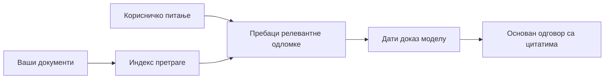

# Учите АИ да одговара на питања на основу ваших докумената:
## Серия 1: RAG, Azure против алтернатива отвореног кода и када има смисла фино подешавање

> Први чланак у серији из 2026. године који преиспитује моје туторијале из 2023. за Azure AI Search + Azure OpenAI за питања и одговоре у документима.

Навигација серијом: [Почетна страница репозиторијума](../README.md) | Следећи: [Серија 2 - Направите локални RAG систем отвореног кода од почетка до краја](./series-2-open-source-rag-end-to-end.md)

## 1. Увод - Преиспитивање ранијег RAG туторијала

Године 2023. радио сам на пару туторијала о томе како научити ChatGPT да одговара на питања из PDF докумената користећи Azure AI Search и Azure OpenAI. Написао сам [LangChain верзију](https://techcommunity.microsoft.com/blog/educatordeveloperblog/teach-chatgpt-to-answer-questions-using-azure-ai-search--azure-openai-lang-chain/3969713), а такође сам коаутор пратиоце [Semantic Kernel верзије](https://techcommunity.microsoft.com/blog/educatordeveloperblog/teach-chatgpt-to-answer-questions-using-azure-ai-search--azure-openai-semantic-k/3985395) са [Ли Стотом](https://developer.microsoft.com/en-us/advocates/lee-stott), руководиоцем групе облачних заговорника у Microsoft-у. У то време, идеја „ChatGPT на вашим подацима“ још увек је била новина за многе програмере. Туторијали су користили Azure Blob Storage, Azure AI Search, Azure OpenAI, LangChain, Semantic Kernel и FAISS-стил векторског претраживања за одговарање на питања из PDF фајлова.

Тај ранији чланак фокусирао се на једноставан, али важан ток рада: отпреми документе, индексирај их, дохвати релевантан садржај и замоли модел да одговори на основу тог садржаја.

Године 2026, RAG екосистем се значајно развио. Azure AI Search сада подржава модерне векторске и хибридне паттерне претраживања, Azure OpenAI је део ширег Microsoft Foundry Models екосистема, а новији v1 API може користити стандардни OpenAI клијент без потребе за месечним променама `api-version`. Истовремено, опције отвореног кода као што су LangGraph, LlamaIndex, Haystack, Qdrant, Milvus, Weaviate, Chroma, Ollama и vLLM постале су практични избори за праве RAG системе.

Због тога сам хтео да поново посетим ову тему. Питање више није само „Како изградити RAG?“ Сада постоји много начина за то, а важније питање гласи: „Коју архитектуру да одаберем за своју ситуацију?“

Али основни проблем није промењен.

АИ модел не познаје аутоматски ваше документе. Да бисте изградили користан систем за питања и одговоре заснован на документима, и даље вам је потребно поуздано претраживање, ослањање на извор, процена и оперативни токови рада.

Овај чланак није још један туторијал „ћаскања са PDF-ом од почетка до краја“. Желим да започнем ову ажурирану серију са питањем које ми је сада важније: када одабрати управљану Azure архитектуру, када одабрати RAG стек отвореног кода и када фино подешавање заиста има смисла?

Ово је први чланак у серији о изградњи АИ система заснованих на документима. У овом првом делу фокусираћемо се на одлуке о архитектури: зашто је важан RAG, када су Azure управљане услуге корисне, када имају смисла алтернативе отвореног кода и где се уклапа фино подешавање.

Након изградње и преиспитивања докумената QA система, постао сам мање заинтересован за то који алат изгледа најбоље у демо презентацији и више заинтересован који архитектура издржава праве кориснике, променљиве документе, дозволе, грешке и одржавање.

## 2. Зашто вашем АИју треба систем претраге

Велики језички модели обучавају се на широком јавном и лиценцираном скупу података. Могу знати много о општим темама, али не познају аутоматски ваше приватне PDF-ове, интерне политике, предузетничке процедуре, архиве истраживања, наставне материјале, белешке службе за кориснике или недавно ажуриране документације.

Једноставан начин да се размисли о RAG-у је овај: уместо да модел очекујемо да памти сваки документ, ми му дајемо систем претраге. Када корисник постави питање, систем прво пронађе најрелевантније делове информација, а затим те делове даје моделу као контекст.

Ово је важно зато што су многи стварни извори знања приватни, стално се мењају, осетљиви са аспекта дозвола, смештени у више система, писани у многим форматима и превелики да би се директно убацили у промпт.

На пример, ако школа, компанија или истраживачки тим има 10.000 интерних докумената, модел не може поуздано одговарати из тих докумената, осим ако систем не преузме праве делове у правом тренутку.

Ово природно води до уобичајеног питања:

Зашто онда не фино подесити модел?

Фино подешавање може бити корисно, али обично није прави први алат за знање из докумената. Ако се знање често мења, ако су цитати важни или ако су услови приступа важни, RAG је обично боља полазна тачка. Фино подешавање је прикладније за учење понашања, стила, формата излаза и шаблона задатака.

## 3. RAG архитектура у пракси

Замислите да правите АИ асистента за школу. Асистент треба да одговара на питања из политика у PDF-овима, упутстава за курсеве, интерних FAQ страница и недавно ажурираних објава.

Ако студент пита: „Могу ли да користим генеративни АИ за свој завршни задатак?“, систем не би требало да одговори из опште меморије модела. Прво би требао пронаћи релевантну политику школе, екстраховати одељак о коришћењу АИ и онда замолити модел да одговори користећи тај доказ.

То је RAG у пракси.

На високом нивоу, ток можете замислити овако:

Детаљи могу постати софистициранији, али основна идеја је једноставна: модел не одговара самостално. Одговара са преузетим доказом.

Прво, документи се уносе из система за складиштење као што су Azure Blob Storage, SharePoint, GitHub или интерни CMS. Затим их систем парсира у текст при чему се очувава корисна структура као што су заглавља, бројеви страна, табеле, одељци и локације извора.

Следеће, садржај се раставља на делове. Овај корак звучи једноставно, али је један од најважнијих делова система. Ако је део превише мали, може изгубити околни контекст. Ако је део превелик, може укључити несродне информације и учинити претрагу мање прецизном.

Након раздвајања делова, систем креира уграђене представе (ембединге) и чува их у претраживом индексу заједно са оригиналним текстом и метаподацима као што су име фајла, број стране, дозволе, верзија документа и URL извора.

Када корисник постави питање, систем преузима кандидатске делове користећи претрагу по кључним речима, векторску претрагу или хибридну претрагу. Реранкер може тада прераспоредити те делове тако да најкориснији докази буду на врху.

На крају, модел добија питање и преузете доказе. Одговор треба да буде заснован на тим доказима и да врати цитате тако да корисник може прегледати извор.

Важно је да RAG није само „стави PDF-ове у векторску базу“. Квалитет одговора зависи од целог тока рада: парсирање, раздвајање, претраживање, поновно рангирање, креирање упита, цитирање и процена.

Зато структура документа има значај. У PDF-у, заглавље, табела, фуснота или граница странице може променити значење пасуса. На Azure-у, Document Layout вештина користи могућности распореда Azure Document Intelligence за производњу излаза који разуме структуру, што може побољшати раздвајање делова и квалитет претраге за RAG системе.

## 4. Шта се променило од 2023?

Туторијал из 2023. био је добар почетак за то време:

- Azure Blob Storage је складиштио PDF фајлове.
- Azure AI Search је индексирао садржај.
- LangChain је повезивао претраживање са Azure OpenAI.
- FAISS је радио као једноставна локална векторска база.
- Пример је користио `gpt-35-turbo` и `text-embedding-ada-002`.

Године 2026, модерна верзија треба да одражава неколико промена.

Прво, претраживање је сазрело. Године 2023, многи демои су користили једноставну претрагу по сличности вектра. Данас, хибридна претрага је често подразумевана полазна тачка за озбиљно QA са документима. Azure AI Search подржава хибридну претрагу комбинујући упите кључних речи и вектора у један захтев и спајајући резултате Рипроцинкал Ранк Фузијом (Reciprocal Rank Fusion). Семантички ранкер може затим поново рангирати текстуалне резултате у пуном тексту, векторе и хибридне резултате.

Друго, унос података је софистициранији. Уместо ручног раздвајања сваког документа апликационим кодом, Azure AI Search подржава интегрисану векторизацију за раздвајање делова, уграђивање и векторизацију у току упита. За PDF-ове и радне оптерећења тежак документима, Document Layout вештина може сачувати више структуре него фиксне величине делови.

Треће, оркестрација је важнија. Тешко није само позив LLM API-ју. Тешко је руковање грешкама, поновним покушајима, застарелом претрагом, квалитетом делова, дуготрајним токовима рада, људском ревизијом и проценом на скали. Ово је место где алати оријентисани на ток рада као што су LangGraph, LlamaIndex токови рада, Haystack цевоводи и платформски алати за процену и опсервацију постају важнији од једног линеарног ланца.

Четврто, процена више није опционална. Демо може изгледати импресивно са једним питањем. Производни систем треба скупове тестова, регресионе провере, метрике претраживања, провере ослањања на извор и праћење. Без процене, тешко је знати да ли систем напредује или само мења нешто.

## 5. Избор између Azure и стека отвореног кода за RAG

Не мислим да је корисно питање „Да ли је Azure бољи од отвореног кода?“ или „Да ли је отворени код бољи од Azure-a?“

Корисно питање је: какву врсту система градите, ко ће га управљати, каква ограничења имате и који начини отказа су неприхватљиви?

Када сам почео да правим примере QA са документима, највише сам размишљао о томе да ли претраживање ради. Могу ли отпремити PDF-ове, претраживати их и генерисати одговор? То је била разумна полазна тачка.

Након рада на реалистичнијим AI токовима рада, моја процена се променила. Сада гледам на четири ствари пре избора RAG стека:

- идентитет и дозволе
- квалитет претраживања
- поузданост тока рада
- оперативно власништво

Та четири подручја говоре много више од самог модела.

Azure базиране архитектуре обично имају смисла када је интеграција у предузеће тешки део. Ако тим већ зависи од Microsoft Entra ID, Microsoft 365, Azure Storage, приватних мрежа, RBAC и Azure мониторинга, Azure AI Search и Azure OpenAI могу смањити много оперативне сложености. У том окружењу, Azure није само модел API. Вредност је у околном систему: идентитет, управљање, управљена претрага, интеграција безбедности, подршка и познате оперативне праксе.

Архитектуре отвореног кода обично имају смисла када је флексибилност тешки део. Ако тим треба локално извршавање, преносивост у облак, прилагођени ток преузимања, специјализовано поновно рангирање или директна контрола над векторском базом и слојем за сервирање модела, стек отвореног кода може боље одговарати. Цена је што тим мора више бринути о поузданости: резервне копије, скалабилност, латенција, миграције, праћење и безбедност.

У пракси, многи производни AI системи нису чисто cloud-native или чисто отвореног кода. Често су то хибридни системи који балансирају оперативну једноставност, преносивост, управљивост и инжењерску флексибилност.

На пример, не бих се изненадио да видим систем који користи Azure OpenAI за приступ моделу, LangGraph за оркестрацију тока рада, Azure хостинг за разврставање и базу вектора отвореног кода за специфичан захтев претраживања. То није архитектонска неусклађеност. То је избор правог нивоа управљане услуге и инжењерске контроле за сваки део система.

Волим хибридне архитектуре када управљана платформа решава важне проблеме предузећа, док компоненете отвореног кода дају тиму флексибилност тамо где је то заиста важно.

## 6. Практичан водич за одлуке

Ево табеле одлука коју бих користио са тимом пре избора RAG стека:

| Област одлуке | Azure управљани стек је јачи када... | Отворени стек је јачи када... |
| --- | --- | --- |
| Идентитет и приступ | Entra ID, RBAC, управљани идентитет и корпоративне дозволе су централни | доминира прилагођена аутентификација, не-Мicrosoft идентитет или специфична логика приступа апликацији |
| Операције | тим жели управљану инфраструктуру, подршку, SLA и лакше укључивање | тим може управљати векторским базама, сервирањем модела, резервним копијама и скалабилношћу |
| Претрага | хибридна претрага, семантичко рангирање, филтри и претрага по метаподацима покривају већину потреба | тим треба прилагођено претраживање, специјализовано поновно рангирање или експериментално индексирање |
| Преносивост | прихватљива или пожељна usklađenost са Azure екосистемом | избегавање закључавања у облак је тешки услов |
| Закључивање | Azure OpenAI управљање, мреже и контроле на нивоу предузећа су важне | локално извршавање, прилагођени модели или самостално сервирање су неопходни |
| Трошкови | смањење инжењерског и оперативног труда важније од подешавања инфраструктуре | обим је довољно велик да оправда оптимизацију инфраструктуре |
| Експериментисање | стабилност и интеграција у предузеће важнији од честих промена компоненти | тим брзо експериментише са агентима, алатима, меморијом и токовима претраге |

Моје правило је једноставно:

- Започните са Azure-ом када су интеграција у предузеће, безбедност и оперативна једноставност главни ризици.
- Започните са отвореним кодом када су преносивост, прилагођавање или локална контрола главни ризици.
- Користите хибридни стек када су обоје тачни.

Ово је такође разлог зашто не бих 2026. серију о RAG-у започео прво са кодом. Код је важан, али избор архитектуре долази пре имплементације. Једноставан демо може сакрити најтежи избор. Добар RAG систем чини те изборе јасним.

## 7. Где се уклапа фино подешавање

Фино подешавање се често помиње заједно са RAG-ом, али мислим да је важно раздвојити те две ствари.

RAG је обично бољи избор када систем треба свеже, приватно, осетљиво на дозволе или основано на извору знање. Ако одговор треба да цитира документе, рефлектује недавна ажурирања или поштује правила приступа за корисника, претрага треба да буде део архитектуре.
Фино подешавање је корисније када знање није главни проблем. Може помоћи када желите да модел прати одређени формат излаза, да одговара стилу одговора специфичном за домен, да стабилно обавља задатак са више доследности или да смањи количину инструкција потребних у сваком упиту.

У пракси, ова два приступа могу радити заједно. Помоћник за подршку може користити RAG за преузимање најновије политике, док фино подешен модел учи структуру и тон одговора које компанија преферира.

Погрешно је третирати фино подешавање као замену за складиште докумената. Оно не уклања потребу за преузимањем када систем мора да одговара на основу свежих, приватних или података осетљивих на дозволе.

## 8. Где ова серија наставља

Овај чланак представља слој одлучивања. Пре писања кода желео сам да експлицитно изнесем компромисе: RAG против фино подешавања, Azure против отвореног кода, управљане услуге против оперативне контроле.

Пре него што пређем на имплементацију, желим да оставим једну поену овде: у многим AI системима за предузећа, модел је само једна компонента. Квалитет преузимања, оркестрација, евалуација, дозволе и оперативна поузданост често одређују да ли ће систем успети ван демонстрационе фазе.

У наредним деловима ове серије планирам да дубље уђем у практичну страну AI система са документима као основом: прво ћу направити локални RAG ток рада отвореног кода, затим ћу поново изградити исти сценарио са Azure AI Search и Azure OpenAI, а потом и проценити да ли систем заиста функционише.

Могу да променим редослед како се серија буде развијала, али циљ ће остати исти: прећи са једноставне демонстрације и показати како размишљати о RAG системима које је могуће одржавати, евалуирати и управљати.

## 9. Референце и ресурси

Оригинални туторијали:

- [Teach ChatGPT to Answer Questions: Using Azure AI Search & Azure OpenAI (Lang Chain)](https://techcommunity.microsoft.com/blog/educatordeveloperblog/teach-chatgpt-to-answer-questions-using-azure-ai-search--azure-openai-lang-chain/3969713)
- [Teach ChatGPT to Answer Questions: Using Azure AI Search & Azure OpenAI (Semantic Kernel)](https://techcommunity.microsoft.com/blog/educatordeveloperblog/teach-chatgpt-to-answer-questions-using-azure-ai-search--azure-openai-semantic-k/3985395)

Azure:

- [Azure AI Search REST API versions](https://learn.microsoft.com/en-us/rest/api/searchservice/search-service-api-versions)
- [Hybrid search in Azure AI Search](https://learn.microsoft.com/en-us/azure/search/hybrid-search-how-to-query)
- [Integrated vectorization in Azure AI Search](https://learn.microsoft.com/en-us/azure/search/vector-search-integrated-vectorization)
- [Document Layout skill in Azure AI Search](https://learn.microsoft.com/en-us/azure/search/cognitive-search-skill-document-intelligence-layout)
- [Chunk and vectorize by document layout](https://learn.microsoft.com/en-us/azure/search/search-how-to-semantic-chunking)
- [Semantic ranking in Azure AI Search](https://learn.microsoft.com/en-us/azure/search/semantic-search-overview)
- [Azure OpenAI / Microsoft Foundry API version lifecycle](https://learn.microsoft.com/en-us/azure/foundry/openai/api-version-lifecycle)
- [Foundry Models sold by Azure](https://learn.microsoft.com/en-us/azure/foundry/foundry-models/concepts/models-sold-directly-by-azure)
- [Microsoft Foundry fine-tuning considerations](https://learn.microsoft.com/en-us/azure/foundry/openai/concepts/fine-tuning-considerations)
- [Microsoft Foundry observability](https://learn.microsoft.com/en-us/azure/foundry/concepts/observability)
- [Run evaluations in Microsoft Foundry](https://learn.microsoft.com/en-us/azure/foundry/how-to/evaluate-generative-ai-app)

Отворени код:

- [LangGraph documentation](https://docs.langchain.com/oss/python/langgraph/overview)
- [LlamaIndex documentation](https://developers.llamaindex.ai/python/framework/)
- [Haystack documentation](https://docs.haystack.deepset.ai/)
- [Qdrant documentation](https://qdrant.tech/documentation/overview/)
- [Milvus documentation](https://milvus.io/docs/overview.md)
- [Weaviate documentation](https://docs.weaviate.io/weaviate/current/)
- [Chroma documentation](https://docs.trychroma.com/docs/overview/introduction)
- [Ollama embeddings](https://docs.ollama.com/capabilities/embeddings)
- [vLLM OpenAI-compatible server](https://docs.vllm.ai/en/latest/serving/openai_compatible_server.html)
- [BGE embedding models](https://huggingface.co/BAAI/bge-large-en-v1.5)
- [E5 embedding models](https://huggingface.co/intfloat/e5-large-v2)
- [Instructor embedding models](https://huggingface.co/hkunlp/instructor-large)

Следеће: [Series 2 - Build a Local Open-Source RAG System End to End](./series-2-open-source-rag-end-to-end.md)

---

<!-- CO-OP TRANSLATOR DISCLAIMER START -->
**Изјава о одрицању одговорности**:
Овај документ је преведен коришћењем услуге за аутоматски превод [Co-op Translator](https://github.com/Azure/co-op-translator). Иако тежимо тачности, имајте у виду да аутоматски преводи могу садржати грешке или нетачности. Оригинални документ на његовом изворном језику треба сматрати ауторитативним извором. За критичне информације препоручује се професионални људски превод. Нисмо одговорни за било каква неспоразума или погрешна тумачења која произилазе из коришћења овог превода.
<!-- CO-OP TRANSLATOR DISCLAIMER END -->