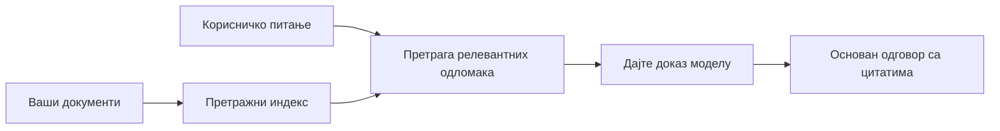

# Учите AI да одговара на питања на основу ваших докумената:
## Серия 1: RAG, Azure против алтернативи отвореног кода и када има смисла фино подешавање

> Први чланак из серије 2026. године која поново разматра моје туторијале за Azure AI Search + Azure OpenAI документ QA из 2023. године.

## 1. Увод – Поновно разматрање ранијег RAG туторијала

2023. године радио сам на пару туторијала о томе како научити ChatGPT да одговара на питања из PDF докумената користећи Azure AI Search и Azure OpenAI. Написао сам [LangChain верзију](https://techcommunity.microsoft.com/blog/educatordeveloperblog/teach-chatgpt-to-answer-questions-using-azure-ai-search--azure-openai-lang-chain/3969713), а такође сам коаутор са [Lee Stott-ом](https://developer.microsoft.com/en-us/advocates/lee-stott), Principal Cloud Advocate Manager у Microsoft-у, и [основне верзије у Semantic Kernel-у](https://techcommunity.microsoft.com/blog/educatordeveloperblog/teach-chatgpt-to-answer-questions-using-azure-ai-search--azure-openai-semantic-k/3985395). Тада је идеја "ChatGPT на вашим подацима" за многе програмере била новина. Туторијали су користили Azure Blob Storage, Azure AI Search, Azure OpenAI, LangChain, Semantic Kernel и FAISS-стил векторско претраживање за одговарање на питања из PDF датотека.

Ранији чланак се фокусирао на једноставан али важан ток рада: отпремање докумената, индексирање, проналажење релевантног садржаја и постављање питања моделу на основу тог садржаја.

2026. године RAG екосистем је значајно порастао. Azure AI Search сада подржава модерне векторске и хибридне паттерне претраживања, Azure OpenAI је део широког Microsoft Foundry Models екосистема, а новији v1 API може користити стандардног OpenAI клијента без потребе за месечним променама `api-version`. Истовремено, опен-соурце опције као што су LangGraph, LlamaIndex, Haystack, Qdrant, Milvus, Weaviate, Chroma, Ollama и vLLM постале су практични избори за праве RAG системе.

Због тога сам желео поново да се вратим овој теми. Питање више није само „Како изградити RAG?“ Сада постоје многи начини да се изгради, а важније питање је „Коју архитектуру треба изабрати у мојој ситуацији?“

Али основни проблем није промењен.

AI модел не познаје аутоматски ваше документе. Да бисте изградили користан систем за одговарање на питања из докумената, још увек вам је потребно поуздано претраживање, ослањање на извор, евалуација и оперативни токови рада.

Овај чланак није још један комплетан туторијал „чет са PDF-ом“. Желим да започнем ову ажурирану серију са питањем које ми је сада важније: када треба изабрати управљану Azure архитектуру, када опен-соурце RAG стек, а када фино подешавање заиста има смисла?

Ово је први чланак у серији о изградњи AI система који се ослањају на документе. У овом првом делу фокус ће бити на одлукама о архитектури: зашто RAG има значаја, када су Azure-ове управљане услуге корисне, када опен-соурце алтернативе имају смисла, и где се уклапа фино подешавање.

Након изградње и поновног разматрања система за документ QA, постао сам мање заинтересован која алатка изгледа најбоље на демо-у, а више заинтересован која архитектура опстаје код правих корисника, промењених докумената, дозвола, отказа и одржавања.

## 2. Зашто вашем AI-ју треба систем претраживања

Велики језички модели се тренирају на обимним јавним и лиценцираним подацима. Могу знати много о општим темама, али не познају аутоматски ваше приватне PDF-ове, интерне политике, корпоративне процедуре, истраживачке архиве, наставне материјале, белешке корисничке подршке или недавно ажурирану документацију.

Једноставан начин да се разуме RAG јесте: уместо да очекујемо да модел памти сваки документ, дајемо му систем претраживања. Када корисник постави питање, систем најпре пронађе најрелевантније делове информација, а затим те делове предаје моделу као контекст.

Ово је важно јер многи извори знања у стварном свету су приватни, стално се мењају, осетљиви су на дозволе, чувају се у више система, написани су у разним форматима и превелики су да би их директно убацивали у упит.

На пример, ако школа, компанија или истраживачки тим има 10.000 интерних докумената, модел не може поуздано одговарати из тих докумената осим ако систем не пронађе праве делове у правом тренутку.

То природно води до честог питања:

Зашто онда не фино подешавати модел?

Фино подешавање може бити корисно, али обично није прави први алат за знање из докумената. Ако се знање често мења, ако су цитати важни, или ако су дозволе битне, RAG је обично боља почетна тачка. Фино подешавање је погодније за учење понашања, стила, формата излаза и шаблона задатака.

## 3. RAG архитектура у пракси

Замислите да правите AI асистента за школу. Асистент треба да одговара на питања из PDF-ова политика, водича курсева, интерних FAQ страница и недавно ажурираних обавештења.

Ако ученик пита: „Могу ли користити генеративни AI за свој завршни задатак?“, систем не треба одговорити из опште меморије модела. Прво треба пронаћи релевантну политику школе, издвојити одељак о коришћењу AI и затим питати модел да одговори користећи те доказе.

То је у пракси RAG.

На високом нивоу, ток можете посматрати овако:

Детаљи могу постати сложенији, али основна идеја је једноставна: модел не одговара самостално. Одговара са пронађеним доказима.

Прво се документи преузимају из система за складиштење као што су Azure Blob Storage, SharePoint, GitHub или интерни CMS. Затим се систем бави њиховом парсирањем у текст уз очување корисне структуре као што су наслови, бројеви страница, табеле, одељци и локације извора.

Након тога садржај се дели на делове. Овај корак звучи једноставно, али је један од најважнијих у систему. Ако је делић пренебитан, може изгубити околни контекст. Ако је превелик, може укључити нерелевантне информације и учинити претраживање мање прецизним.

Након раздељивања, систем креира уграђене представе (ембеддинге) и чува их у претраживом индексу заједно са оригиналним текстом и метаподацима као што су име датотеке, број странице, дозволе, верзија документа и URL извора.

Када корисник постави питање, систем проналази кандидате помоћу претраге кључних речи, векторске претраге или хибридне претраге. Реранкер може затим преуредити те делове како би најкориснији докази били приказани на врху.

На крају, модел добија питање и пронађене доказе. Одговор треба да буде заснован на тим доказима и да врати цитате како би корисник могао да провери извор.

Важна поента је да RAG није само „убаци PDF-ове у векторску базу података.“ Квалитет одговора зависи од целог тока рада: парсирања, дељења на делове, претраживања, поновног рангирања, упита, цитирања и евалуације.

Зато структура документа има значај. У PDF-у, наслов, табела, фуснота или граница странице могу променити значење пасуса. На Azure-у, Document Layout вештина користи способност распознавања изгледа Azure Document Intelligence да произведе излаз који је свестан структуре, што може побољшати квалитет дељења и претраживања код RAG система.

## 4. Шта се променило од 2023?

Туторијал из 2023. био је добар почетак за то време:

- Azure Blob Storage је складиштио PDF датотеке.
- Azure AI Search је индексирао садржај.
- LangChain је повезивао претраживање са Azure OpenAI.
- FAISS је радио као једноставна локална векторска база.
- Пример је користио `gpt-35-turbo` и `text-embedding-ada-002`.

2026. модерна верзија треба да одрази неколико промена.

Прво, претраживање је сазревало. 2023. многи демо-и су користили једноставну претрагу по сличности вектора. Данас је хибридна претрага често подразумевана почетна тачка за строго QA система. Azure AI Search подржава хибридно претраживање комбиновањем упита кључних речи и вектора у једном захтеву и спајањем резултата помоћу Reciprocal Rank Fusion. Семантички ранкер може затим поново рангирати текстуалне стране резултата пунотекстуалне, векторске и хибридне претраге.

Друго, унос постаје сложенији. Уместо ручног раздвајања сваког документа применом кода, Azure AI Search подржава интегрисану векторизацију за дељење на делове, креирање уграђених представи и векторизацију у време упита. За PDF-ове и радне оптерећења богата документима, Document Layout вештина може сачувати више структуре него фиксни делови.

Треће, оркестрација добија на значају. Тешки део често није позив LLM API-ја. Тешко је руковати отказима, поновним покушајима, застарелом претрагом, квалитетом делова, дуготрајним токовима, људским прегледима и евалуацијом на великој скали. Овде алати оријентисани на токове рада као LangGraph, LlamaIndex workflows, Haystack pipelines и платформи за евалуацију и надзор постају релевантнији од једног линеарног ланца.

Четврто, евалуација више није опционална. Демо може изгледати импресивно са једним питањем. Производни систем треба тест сете, регресионе провере, метрике претраживања, провере ослањања на изворе и мониторинг. Без евалуације, тешко је знати да ли се систем побољшава или само мења.

## 5. Избор између Azure и опен-соурце RAG стека

Не мислим да је корисно питање „Да ли је Azure бољи од опен-соурце-а?“ или „Да ли је опен-соурце бољи од Azure-а?“

Корисно питање је: какв систем правите, ко ће га управљати, каква ограничења имате и који режими отказа су неприхватљиви?

Када сам почео да правим примере за документ QA, претежно сам разматрао да ли претраживање ради. Могу ли да отпремим PDF-ове, претражујем их и генеришем одговор? То је био разуман почетак.

Након радa на реалистичнијим AI токовима рада, моја евалуација се променила. Сада пре избора RAG стека посматрам четири ствари:

- идентитет и дозволе
- квалитет претраживања
- поузданост тока рада
- оперативно власништво

Ове четири области говоре много више од једног моделског бенчмарка.

Azure базиране архитектуре обично имају смисла када је интеграција у предузеће тежак део. Ако тим већ зависи од Microsoft Entra ID, Microsoft 365, Azure Storage, приватне мреже, RBAC-а и Azure надзора, Azure AI Search и Azure OpenAI могу смањити много оперативне сложености. У том окружењу, Azure није само API за модел. Вредност је у околном систему: идентитет, управљање, управљано претраживање, интеграција безбедности, подршка и познате операције.

Опен-соурце архитектуре имају смисла када је флексибилност кључна. Ако тим треба локална инференца, преносивост у облаку, прилагођени процес претраживања, специјализовано поновно рангирање или директна контрола над векторском базом и слојем службе модела, опен-соурце стек може бити боље решење. Трговина је у томе што тим преузима више одговорности за поузданост: резервне копије, скалабилност, латенцију, миграције, мониторинг и безбедност.

У пракси, многи производни AI системи нису чисто cloud-native или чисто опен-соурце. Често су хибридни системи који балансирају оперативну једноставност, преносивост, управљање и инжењерску флексибилност.

На пример, не бих био изненађен да видим систем који користи Azure OpenAI за приступ моделу, LangGraph за оркестрацију тока рада, Azure хостинг за имплементацију и опен-соурце векторску базу података за специфичан захтев за претраживање. То није архитектонска нескладност. То је избор правог нивоа управљане услуге и контроле инжењеринга за сваки део система.

Волим хибридне архитектуре када управљана платформа решава важне корпоративне проблеме, док опен-соурце компоненте пружају тиму флексибилност где је то заиста важно.

## 6. Практични водич за одлуку

Ево табеле одлука коју бих користио са тимом пре избора RAG стека:

| Подручје одлуке | Azure управљани стек је јачи када... | Опен-соурце стек је јачи када... |
| --- | --- | --- |
| Идентитет и приступ | Entra ID, RBAC, управљани идентитет и корпоративне дозволе су централни | прилагођена аутентикација, не-Мicrosoft идентитет или приступна логика специфична за апликацију доминирају |
| Операције | тим жели управљану инфраструктуру, подршку, SLA и једноставнији улазак | тим може да управља векторским базама, сервисима модела, резервним копијама и скалабилношћу |
| Претраживање | хибридна претрага, семантичко рангирање, филтери и претрага метаподака покривају већину потреба | тим треба прилагођено претраживање, специјализовано поновно рангирање или експериментално индексирање |
| Преносивост | усаглашеност са Azure екосистемом је прихватљива или пожељна | избегавање закључавања у облаку је строго захтевано |
| Инференција | управљање Azure OpenAI, мрежа и корпоративне контроле имају значаја | локална инференција, прилагођени модели или самостално хостовање су потребни |
| Цена | смањење инжењерског и оперативног напора важније од оптимизације инфраструктуре | обим је довољно велик да оправда пажљиву оптимизацију инфраструктуре |
| Експериментисање | стабилност и корпоративна интеграција су важније од честих измена компоненти | тим брзо експериментише са агентима, алатима, меморијом и токовима претраживања |

Моје правило је једноставно:

- Почните са Azure-ом када су интеграција у предузеће, безбедност и оперативна једноставност главни ризици.
- Почните са опен-соурце-ом када су преносивост, прилагођавање или локална контрола главни ризици.
- Користите хибридни стек када су оба тачна.

Због тога не бих почео серију o RAG-у из 2026. године са кодом као првим кораком. Код је важан, али избор архитектуре долази пре имплементације. Једноставан демо може сакрити најтеже одлуке. Добар RAG систем те одлуке чини јасним.

## 7. Где се уклапа фино подешавање

Фино подешавање често се спомиње заједно са RAG-ом, али мислим да је важно раздвојити та два.

RAG је обично бољи избор када систем треба свеже, приватно, осетљиво на дозволе или изворно засновано знање. Ако одговор треба цитирати документе, одразити недавне измене или поштовати приступна правила специфична за корисника, претраживање мора бити део архитектуре.

Фино подешавање је корисније када знање није главни проблем. Може помоћи када желите да модел прати специфичан формат излаза, одговара стилу домена, извршава стабилан задатак конзистентније или смањи количину инструкција потребних у сваком упиту.
У пракси, ова два приступа могу радити заједно. Асистент за подршку може користити RAG да добије најновију политику, док фино подешен модел учи о структури и тону одговора које компанија преферира.

Грешка је третирати фино подешавање као замену за складиште докумената. Оно не уклања потребу за претрагом када систем мора да одговори из свежих, приватних или података осетљивих на дозволе.

## 8. Где ова серија иде даље

Овај чланак је слој доношења одлука. Пре писања кода, желео сам да учиним компромисе јасним: RAG у односу на фино подешавање, Azure у односу на отворени извор, управљане услуге у односу на оперативну контролу.

Пре него што пређем на имплементацију, желим овде да оставим једну поенту: у многим пословним AI системима, модел је само једна компонента. Квалитет претраге, оркестрација, евалуација, дозволе и оперативна поузданост често одређују да ли систем успева изван демо фазе.

У следећим деловима ове серије, планирам да дубље уђем у практичну страну AI система који се ослањају на документе: како изградити архитектуру засновану на Azure, како се алтернативе отвореног кода упоређују у пракси, и како проценити да ли RAG систем заиста ради.

Могу да променим редослед како серија буде напредовала, али циљ ће остати исти: прећи са једноставног демо-а и показати како размишљати о RAG системима који могу да се одржавају, евалуишу и користе.

## 9. Референце и ресурси

Оригинални туторијали:

- [Teach ChatGPT to Answer Questions: Using Azure AI Search & Azure OpenAI (Lang Chain)](https://techcommunity.microsoft.com/blog/educatordeveloperblog/teach-chatgpt-to-answer-questions-using-azure-ai-search--azure-openai-lang-chain/3969713)
- [Teach ChatGPT to Answer Questions: Using Azure AI Search & Azure OpenAI (Semantic Kernel)](https://techcommunity.microsoft.com/blog/educatordeveloperblog/teach-chatgpt-to-answer-questions-using-azure-ai-search--azure-openai-semantic-k/3985395)

Azure:

- [Azure AI Search REST API versions](https://learn.microsoft.com/en-us/rest/api/searchservice/search-service-api-versions)
- [Hybrid search in Azure AI Search](https://learn.microsoft.com/en-us/azure/search/hybrid-search-how-to-query)
- [Integrated vectorization in Azure AI Search](https://learn.microsoft.com/en-us/azure/search/vector-search-integrated-vectorization)
- [Document Layout skill in Azure AI Search](https://learn.microsoft.com/en-us/azure/search/cognitive-search-skill-document-intelligence-layout)
- [Chunk and vectorize by document layout](https://learn.microsoft.com/en-us/azure/search/search-how-to-semantic-chunking)
- [Semantic ranking in Azure AI Search](https://learn.microsoft.com/en-us/azure/search/semantic-search-overview)
- [Azure OpenAI / Microsoft Foundry API version lifecycle](https://learn.microsoft.com/en-us/azure/foundry/openai/api-version-lifecycle)
- [Foundry Models sold by Azure](https://learn.microsoft.com/en-us/azure/foundry/foundry-models/concepts/models-sold-directly-by-azure)
- [Microsoft Foundry fine-tuning considerations](https://learn.microsoft.com/en-us/azure/foundry/openai/concepts/fine-tuning-considerations)
- [Microsoft Foundry observability](https://learn.microsoft.com/en-us/azure/foundry/concepts/observability)
- [Run evaluations in Microsoft Foundry](https://learn.microsoft.com/en-us/azure/foundry/how-to/evaluate-generative-ai-app)

Отворени извор:

- [LangGraph documentation](https://docs.langchain.com/oss/python/langgraph/overview)
- [LlamaIndex documentation](https://developers.llamaindex.ai/python/framework/)
- [Haystack documentation](https://docs.haystack.deepset.ai/)
- [Qdrant documentation](https://qdrant.tech/documentation/overview/)
- [Milvus documentation](https://milvus.io/docs/overview.md)
- [Weaviate documentation](https://docs.weaviate.io/weaviate/current/)
- [Chroma documentation](https://docs.trychroma.com/docs/overview/introduction)
- [Ollama embeddings](https://docs.ollama.com/capabilities/embeddings)
- [vLLM OpenAI-compatible server](https://docs.vllm.ai/en/latest/serving/openai_compatible_server.html)
- [BGE embedding models](https://huggingface.co/BAAI/bge-large-en-v1.5)
- [E5 embedding models](https://huggingface.co/intfloat/e5-large-v2)
- [Instructor embedding models](https://huggingface.co/hkunlp/instructor-large)

---

<!-- CO-OP TRANSLATOR DISCLAIMER START -->
**Изјава о одрицању одговорности**:
Овај документ је преведен коришћењем услуге за аутоматски превод [Co-op Translator](https://github.com/Azure/co-op-translator). Иако тежимо тачности, имајте у виду да аутоматски преводи могу садржати грешке или нетачности. Оригинални документ на његовом изворном језику треба сматрати ауторитативним извором. За критичне информације препоручује се професионални људски превод. Нисмо одговорни за било каква неспоразума или погрешна тумачења која произилазе из коришћења овог превода.
<!-- CO-OP TRANSLATOR DISCLAIMER END -->