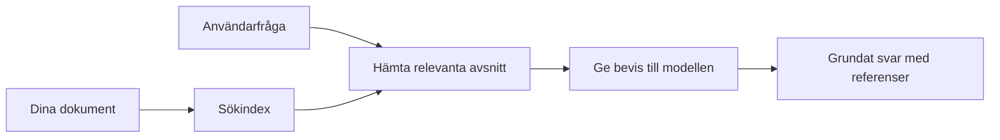

# Lär AI att svara på frågor baserat på dina dokument:
## Serie 1: RAG, Azure vs Open-Source-alternativ och när finjustering är vettigt

> Den första artikeln i en serie år 2026 där jag återbesöker mina dokumentbaserade QA-handledning från 2023 med Azure AI Search + Azure OpenAI.

Serienavigation: [Repository home](../README.md) | Nästa: [Serie 2 - Bygg ett lokalt open-source RAG-system från början till slut](./series-2-open-source-rag-end-to-end.md)

## 1. Intro – Återbesök av en tidigare RAG-handledning

År 2023 arbetade jag med ett par handledningar om att lära ChatGPT att svara på frågor från PDF-dokument med hjälp av Azure AI Search och Azure OpenAI. Jag skrev [LangChain-versionen](https://techcommunity.microsoft.com/blog/educatordeveloperblog/teach-chatgpt-to-answer-questions-using-azure-ai-search--azure-openai-lang-chain/3969713), och jag var också medförfattare till den kompletterande [Semantic Kernel-versionen](https://techcommunity.microsoft.com/blog/educatordeveloperblog/teach-chatgpt-to-answer-questions-using-azure-ai-search--azure-openai-semantic-k/3985395) tillsammans med [Lee Stott](https://developer.microsoft.com/en-us/advocates/lee-stott), Principal Cloud Advocate Manager på Microsoft. På den tiden kändes tanken på ”ChatGPT på dina data” fortfarande ny för många utvecklare. Handledningarna använde Azure Blob Storage, Azure AI Search, Azure OpenAI, LangChain, Semantic Kernel och FAISS-stil vektorsökning för att svara på frågor från PDF-filer.

Den tidigare artikeln fokuserade på ett enkelt men viktigt arbetsflöde: ladda upp dokument, indexera dem, hämta relevant innehåll och be en modell att svara baserat på det innehållet.

År 2026 har RAG-ekosystemet vuxit avsevärt. Azure AI Search stöder nu moderna vektor- och hybrida sökmönster, Azure OpenAI är en del av det bredare Microsoft Foundry Models-ekosystemet, och den nyare v1 API:n kan använda den standardiserade OpenAI-klienten utan att kräva månatliga `api-version`-ändringar. Samtidigt har open-source-alternativ som LangGraph, LlamaIndex, Haystack, Qdrant, Milvus, Weaviate, Chroma, Ollama och vLLM blivit praktiska val för riktiga RAG-system.

Det är därför jag ville återbesöka detta ämne. Frågan är inte längre bara ”Hur bygger jag RAG?” Det finns nu många sätt att bygga det på, och den viktigare frågan är ”Vilken arkitektur ska jag välja för min situation?”

Men kärnproblemet har inte förändrats.

En AI-modell vet inte automatiskt dina dokument. För att bygga ett användbart dokumentbaserat frågesystem behöver du fortfarande tillförlitlig hämtning, grundning, utvärdering och operativa arbetsflöden.

Den här artikeln är inte ännu en end-to-end-handledning för ”chatta med PDF”. Jag vill börja den här uppdaterade serien med frågan som jag nu bryr mig mer om: när ska du välja en hanterad Azure-arkitektur, när ska du välja en open-source RAG-stack, och när är finjustering faktiskt vettigt?

Det här är den första artikeln i en serie om att bygga AI-system grundade på dokument. I denna första del fokuserar vi på arkitekturval: varför RAG är viktigt, när Azure-baserade hanterade tjänster är användbara, när open-source-alternativ är att föredra, och var finjustering hör hemma.

Efter att ha byggt och återbesökt dokument QA-system har jag blivit mindre intresserad av vilket verktyg som ser bäst ut i en demo och mer intresserad av vilken arkitektur som klarar riktiga användare, föränderliga dokument, behörigheter, fel och underhåll.

## 2. Varför din AI behöver ett söksystem

Stora språkmodeller tränas på breda publika och licensierade data. De kan veta mycket om allmänna ämnen, men de känner inte automatiskt till dina privata PDF-filer, interna policys, företagsrutiner, forskningsarkiv, kursmaterial, kundsupportnoteringar eller nyligen uppdaterad dokumentation.

Ett enkelt sätt att tänka på RAG är detta: istället för att förvänta sig att modellen minns varje dokument, ger vi den ett söksystem. När en användare ställer en fråga hittar systemet först de mest relevanta informationsdelarna och skickar sedan dessa till modellen som kontext.

Detta är viktigt eftersom många verkliga kunskapskällor är privata, förändras konstant, är behörighetskänsliga, lagrade i flera system, skrivna i många format och för stora för att kunna klistras in direkt i en prompt.

Till exempel, om en skola, företag eller forskningsteam har 10 000 interna dokument, kan modellen inte reliably svara från dessa dokument om inte systemet hämtar rätt delar vid rätt tidpunkt.

Det leder naturligt till en vanlig fråga:

Varför inte bara finjustera modellen?

Finjustering kan vara användbart, men är vanligtvis inte det rätta första verktyget för dokumentkunskap. Om kunskapen ändras ofta, om källhänvisningar är viktiga eller om åtkomstbehörigheter spelar roll, är RAG vanligtvis den bättre startpunkten. Finjustering passar bättre för att lära beteenden, stil, outputformat och arbetsmönster.

## 3. RAG-arkitektur i praktiken

Föreställ dig att du bygger en AI-assistent för en skola. Assistenten behöver svara på frågor från policy-PDF:er, kursguider, interna FAQ-sidor och nyligen uppdaterade meddelanden.

Om en student frågar, ”Kan jag använda generativ AI för mitt slutprojekt?”, ska systemet inte svara från modellens generella minne. Det ska först hitta relevant skolpolicy, hämta avsnittet om AI-användning och sedan be modellen svara med hjälp av den bevisningen.

Det är RAG i praktiken.

På en övergripande nivå kan du tänka dig flödet så här:

Detaljerna kan bli mer sofistikerade, men grundidén är enkel: modellen svarar inte ensam. Den svarar med hämtad bevisning.

Först hämtas dokument från lagringssystem såsom Azure Blob Storage, SharePoint, GitHub eller ett internt CMS. Sedan parsas de till text samtidigt som användbar struktur såsom rubriker, sidnummer, tabeller, sektioner och källplatser bevaras.

Därefter delas innehållet upp i chunker. Detta steg låter enkelt men är en av de viktigaste delarna i systemet. Om chunkarna är för små kan kontexten runt försvinna. Om chunkarna är för stora kan irrelevant information inkluderas och hämtningen bli mindre precis.

Efter chunkningen skapar systemet embeddings och lagrar dem i ett sökbart index tillsammans med den ursprungliga texten och metadata såsom filnamn, sidnummer, behörigheter, dokumentversion och källa-URL.

När användaren ställer en fråga hämtar systemet kandidatchunker med nyckelordssök, vektorsök eller hybrid sökning. En reranker kan sedan omordna dessa chunker så att den mest användbara bevisningen placeras högst upp.

Slutligen får modellen frågan och den hämtade bevisningen. Svaret ska grundas på denna bevisning och returnera referenser så att användaren kan inspektera källan.

Det viktiga är att RAG inte är bara ”lägg PDF:er i en vektordatabas”. Kvaliteten på svaret beror på hela arbetsflödet: parsing, chunkning, hämtning, reranking, prompting, referenshantering och utvärdering.

Det är därför dokumentstruktur är viktigt. I en PDF kan en rubrik, tabell, fotnot eller sidgräns förändra innebörden i ett avsnitt. På Azure använder Document Layout-skillen Azure Document Intelligence för layoutfunktioner som producerar strukturmedveten output, vilket kan förbättra chunkning och hämtningens kvalitet för RAG-system.

## 4. Vad har förändrats sedan 2023?

2023-års handledning var en bra utgångspunkt för sin tid:

- Azure Blob Storage lagrade PDF-filer.
- Azure AI Search indexerade innehåll.
- LangChain kopplade hämtning till Azure OpenAI.
- FAISS fungerade som en enkel lokal vektordatabas.
- Exemplet använde `gpt-35-turbo` och `text-embedding-ada-002`.

År 2026 bör en modern version spegla flera förändringar.

För det första har hämtning mognat. År 2023 använde många demos enkel vektorsökningslikhet. Idag är hybrid hämtning ofta standardvalet för seriös dokument-QA. Azure AI Search stöder hybrid sökning genom att kombinera nyckelords- och vektorfrågor i en enda förfrågan och sammanfoga resultat med Reciprocal Rank Fusion. Semantisk rankning kan sedan reranka textsidan i fulltext-, vektor- och hybridresultaten.

För det andra har ingesteringen blivit mer sofistikerad. Istället för att manuellt dela varje dokument med applikationskod, stöder Azure AI Search integrerad vektorisering för chunkning, embedding och vektorisering vid fråga. För PDF:er och dokumenttunga arbetsbelastningar kan Document Layout-skillen bevara mer struktur än fasta chunkstorlekar.

För det tredje blir orkestrering viktigare. Den svåra delen är ofta inte själva LLM API-anropet. Den svåra delen är att hantera fel, omförsök, inaktuell hämtning, chunks kvalitet, långvariga arbetsflöden, mänsklig granskning och utvärdering i skala. Här blir arbetsflödesorienterade verktyg som LangGraph, LlamaIndex-arbeidsflöden, Haystack-pipelines och plattformsnivåers utvärderings- och observabilitetsverktyg mer relevanta än en enkel linjär kedja.

För det fjärde är utvärdering inte längre valfri. En demo kan se imponerande ut med en fråga. Ett produktsystem behöver testset, regressionskontroller, hämtmetrik, grundningskontroller och övervakning. Utan utvärdering är det svårt att veta om systemet förbättras eller bara ändras.

## 5. Att välja mellan Azure och open-source RAG-stacks

Jag tror inte att den användbara frågan är ”Är Azure bättre än open source?” eller ”Är open source bättre än Azure?”

Den användbara frågan är: vilken typ av system bygger du, vem ska driva det, vilka begränsningar har du och vilka felmodeller är oacceptabla?

När jag började bygga exempel på dokument QA tänkte jag mest på om hämtning fungerade. Kunde jag ladda upp PDF:er, söka i dem och generera ett svar? Det var en rimlig utgångspunkt.

Efter att ha gått igenom mer realistiska AI-arbetsflöden ändrades min utvärdering. Jag tittar nu på fyra saker innan jag väljer en RAG-stack:

- identitet och behörigheter  
- kvalitet på hämtning  
- arbetsflödespålitlighet  
- operativt ägarskap  

Dessa fyra områden säger mycket mer än enbart en modellbenchmarks.

Azure-baserade arkitekturer är vanligtvis vettiga när företagsintegration är den svåra delen. Om ett team redan är beroende av Microsoft Entra ID, Microsoft 365, Azure Storage, privat nätverk, RBAC och Azure-övervakning kan Azure AI Search och Azure OpenAI minska mycket operativ komplexitet. I den miljön är Azure inte bara en modell-API. Värdet är det omgivande systemet: identitet, styrning, hanterad sökning, säkerhetsintegration, support och välbekanta operationer.

Open-source-arkitekturer är vanligtvis vettiga när flexibilitet är den svåra delen. Om teamet behöver lokal inferens, molnportabilitet, en specialanpassad hämtpipeline, specialiserad reranking eller direkt kontroll över vektordatabasen och modell-serverlagret kan en open-source-stack passa bättre. Avvägningen är att teamet då ansvarar mer för pålitlighet: säkerhetskopior, skalning, latenstid, migrationer, övervakning och säkerhet.

I praktiken är många produktions-AI-system inte helt molnnativa eller helt open-source. De är ofta hybrida system som balanserar operativ enkelhet, portabilitet, styrning och teknisk flexibilitet.

Till exempel skulle jag inte bli förvånad om ett system använder Azure OpenAI för modellåtkomst, LangGraph för orkestrering, Azure-hosting för distribution och en open-source vektordatabas för ett specifikt hämtbehov. Det är inte arkitektonisk inkonsekvens. Det är att välja rätt nivå av hanterad tjänst och teknikstyrning för varje del av systemet.

Jag gillar hybrida arkitekturer när den hanterade plattformen löser viktiga företagsproblem, medan open-source-komponenter ger teamet flexibilitet där det verkligen behövs.

## 6. En praktisk beslutsguide

Här är beslutstabellen jag skulle använda med ett team innan man väljer en RAG-stack:

| Beslutsområde | Azure hanterad stack är starkare när… | Open-source stack är starkare när… |
| --- | --- | --- |
| Identitet och åtkomst | Entra ID, RBAC, hanterad identitet och företagsbehörigheter är centrala | egen autentisering, icke-Microsoft-identitet eller app-specifik åtkomstlogik dominerar |
| Operationer | teamet vill ha hanterad infrastruktur, support, SLA:er och enklare onboarding | teamet kan driva vektordatabaser, modellservering, säkerhetskopior och skalning |
| Hämtning | hybrid sökning, semantisk rankning, filter och metadata-sök täcker de flesta behov | teamet behöver anpassad hämtning, specialiserad reranking eller experimentell indexering |
| Portabilitet | Azure-ekosystemet är acceptabelt eller föredras | undvikande av moln-låsning är ett krav |
| Inferens | Azure OpenAI-styrning, nätverk och företagskontroller är viktiga | lokal inferens, egna modeller eller självhostad servering krävs |
| Kostnad | minska teknik- och driftarbete är viktigare än infraoptimering | skalan är tillräckligt stor för att motivera noggrann infrastrukturoptimering |
| Experiment | stabilitet och företagsintegration är viktigare än att ofta ändra komponenter | teamet itererar snabbt på agenter, verktyg, minne och hämtflöden |

Mitt tumregel är enkel:

- Börja med Azure när företagsintegration, säkerhet och operativ enkelhet är största riskerna.
- Börja med open source när portabilitet, anpassning eller lokal kontroll är största riskerna.
- Använd en hybrid-stack när båda stämmer.

Det är också därför jag inte skulle börja en RAG-serie 2026 med kod först. Kod är viktigt, men arkitekturval kommer före implementation. En enkel demo kan dölja de svåraste valen. Ett bra RAG-system gör dessa val explicita.

## 7. Var finjustering passar in

Finjustering nämns ofta tillsammans med RAG, men jag tycker det är viktigt att skilja dem åt.

RAG är vanligtvis det bättre valet när systemet behöver färsk, privat, behörighetskänslig eller källgrunderad kunskap. Om svaret bör hänvisa till dokument, spegla senaste uppdateringar eller respektera användarspecifika åtkomstregler ska hämtning vara en del av arkitekturen.
Finjustering är mer användbart när kunskap inte är huvudproblemet. Det kan hjälpa när du vill att modellen ska följa ett specifikt utdataformat, anpassa sig till en domänspecifik svarsstil, utföra en stabil uppgift mer konsekvent eller minska mängden instruktioner som behövs i varje prompt.

I praktiken kan de två arbeta tillsammans. En supportassistent kan använda RAG för att hämta den senaste policyn, medan en finjusterad modell lär sig företagets föredragna svarstruktur och ton.

Felet är att betrakta finjustering som en ersättning för en dokumentlagring. Det tar inte bort behovet av hämtning när systemet måste svara från färsk, privat eller behörighetskänslig data.

## 8. Vad denna serie går vidare till

Den här artikeln är beslutslagringslagret. Innan jag skrev kod ville jag göra avvägningarna tydliga: RAG vs finjustering, Azure vs öppen källkod, hanterade tjänster vs operativ kontroll.

Innan implementeringen vill jag lämna en punkt här: i många företags-AI-system är modellen bara en komponent. Kvaliteten på hämtning, orkestrering, utvärdering, behörigheter och operativ tillförlitlighet är ofta det som avgör om systemet lyckas bortom demostadiet.

I de följande delarna av denna serie planerar jag att gå djupare in i den praktiska sidan av dokumentgranskade AI-system: först bygga ett lokalt open-source RAG-arbetsflöde, sedan bygga om samma scenario med Azure AI Search och Azure OpenAI, och sedan utvärdera om systemet faktiskt fungerar.

Jag kan justera ordningen när serien utvecklas, men målet kommer att förbli detsamma: att gå bortom en enkel demo och visa hur man tänker kring RAG-system som kan underhållas, utvärderas och driftas.

## 9. Referenser och resurser

Originalhandledningar:

- [Teach ChatGPT to Answer Questions: Using Azure AI Search & Azure OpenAI (Lang Chain)](https://techcommunity.microsoft.com/blog/educatordeveloperblog/teach-chatgpt-to-answer-questions-using-azure-ai-search--azure-openai-lang-chain/3969713)
- [Teach ChatGPT to Answer Questions: Using Azure AI Search & Azure OpenAI (Semantic Kernel)](https://techcommunity.microsoft.com/blog/educatordeveloperblog/teach-chatgpt-to-answer-questions-using-azure-ai-search--azure-openai-semantic-k/3985395)

Azure:

- [Azure AI Search REST API versions](https://learn.microsoft.com/en-us/rest/api/searchservice/search-service-api-versions)
- [Hybrid search in Azure AI Search](https://learn.microsoft.com/en-us/azure/search/hybrid-search-how-to-query)
- [Integrated vectorization in Azure AI Search](https://learn.microsoft.com/en-us/azure/search/vector-search-integrated-vectorization)
- [Document Layout skill in Azure AI Search](https://learn.microsoft.com/en-us/azure/search/cognitive-search-skill-document-intelligence-layout)
- [Chunk and vectorize by document layout](https://learn.microsoft.com/en-us/azure/search/search-how-to-semantic-chunking)
- [Semantic ranking in Azure AI Search](https://learn.microsoft.com/en-us/azure/search/semantic-search-overview)
- [Azure OpenAI / Microsoft Foundry API version lifecycle](https://learn.microsoft.com/en-us/azure/foundry/openai/api-version-lifecycle)
- [Foundry Models sold by Azure](https://learn.microsoft.com/en-us/azure/foundry/foundry-models/concepts/models-sold-directly-by-azure)
- [Microsoft Foundry fine-tuning considerations](https://learn.microsoft.com/en-us/azure/foundry/openai/concepts/fine-tuning-considerations)
- [Microsoft Foundry observability](https://learn.microsoft.com/en-us/azure/foundry/concepts/observability)
- [Run evaluations in Microsoft Foundry](https://learn.microsoft.com/en-us/azure/foundry/how-to/evaluate-generative-ai-app)

Open source:

- [LangGraph documentation](https://docs.langchain.com/oss/python/langgraph/overview)
- [LlamaIndex documentation](https://developers.llamaindex.ai/python/framework/)
- [Haystack documentation](https://docs.haystack.deepset.ai/)
- [Qdrant documentation](https://qdrant.tech/documentation/overview/)
- [Milvus documentation](https://milvus.io/docs/overview.md)
- [Weaviate documentation](https://docs.weaviate.io/weaviate/current/)
- [Chroma documentation](https://docs.trychroma.com/docs/overview/introduction)
- [Ollama embeddings](https://docs.ollama.com/capabilities/embeddings)
- [vLLM OpenAI-compatible server](https://docs.vllm.ai/en/latest/serving/openai_compatible_server.html)
- [BGE embedding models](https://huggingface.co/BAAI/bge-large-en-v1.5)
- [E5 embedding models](https://huggingface.co/intfloat/e5-large-v2)
- [Instructor embedding models](https://huggingface.co/hkunlp/instructor-large)

Nästa: [Serie 2 - Bygg ett lokalt open-source RAG-system från början till slut](./series-2-open-source-rag-end-to-end.md)

---

<!-- CO-OP TRANSLATOR DISCLAIMER START -->
**Ansvarsfriskrivning**:
Detta dokument har översatts med hjälp av AI-översättningstjänsten [Co-op Translator](https://github.com/Azure/co-op-translator). Även om vi strävar efter noggrannhet, var vänlig notera att automatiska översättningar kan innehålla fel eller brister. Det ursprungliga dokumentet på dess modersmål bör betraktas som den auktoritativa källan. För kritisk information rekommenderas professionell mänsklig översättning. Vi ansvarar inte för några missförstånd eller feltolkningar som uppstår till följd av användningen av denna översättning.
<!-- CO-OP TRANSLATOR DISCLAIMER END -->