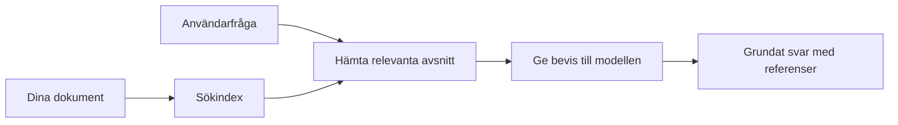

# Lär AI att svara på frågor baserat på dina dokument:
## Serie 1: RAG, Azure vs Öppen källkod-alternativ och när finjustering är meningsfullt

> Den första artikeln i en serie från 2026 som återbesöker mina handledningar från 2023 om Azure AI Search + Azure OpenAI dokument-FAQ.

## 1. Intro - Återbesöker en tidigare RAG-handledning

År 2023 arbetade jag på ett par handledningar om att lära ChatGPT att svara på frågor från PDF-dokument med hjälp av Azure AI Search och Azure OpenAI. Jag skrev [LangChain-versionen](https://techcommunity.microsoft.com/blog/educatordeveloperblog/teach-chatgpt-to-answer-questions-using-azure-ai-search--azure-openai-lang-chain/3969713), och jag medförfattade också den tillhörande [Semantic Kernel-versionen](https://techcommunity.microsoft.com/blog/educatordeveloperblog/teach-chatgpt-to-answer-questions-using-azure-ai-search--azure-openai-semantic-k/3985395) med [Lee Stott](https://developer.microsoft.com/en-us/advocates/lee-stott), en Principal Cloud Advocate Manager på Microsoft. Vid den tiden kändes idén med "ChatGPT på dina data" fortfarande ny för många utvecklare. Handledningarna använde Azure Blob Storage, Azure AI Search, Azure OpenAI, LangChain, Semantic Kernel och FAISS-liknande vektorhämtning för att svara på frågor från PDF-filer.

Den tidigare artikeln fokuserade på ett enkelt men viktigt arbetsflöde: ladda upp dokument, indexera dem, hämta relevant innehåll och be en modell svara baserat på det innehållet.

År 2026 har RAG-ekosystemet vuxit avsevärt. Azure AI Search stöder nu moderna vektor- och hybrida hämtmönster, Azure OpenAI är en del av det bredare Microsoft Foundry Models-ekosystemet, och den nyare v1 API:n kan använda den vanliga OpenAI-klienten utan att kräva månatliga `api-version`-ändringar. Samtidigt har öppna källkodsalternativ som LangGraph, LlamaIndex, Haystack, Qdrant, Milvus, Weaviate, Chroma, Ollama och vLLM blivit praktiska val för riktiga RAG-system.

Därför ville jag återbesöka detta ämne. Frågan är inte längre bara "Hur bygger jag RAG?" Det finns nu många sätt att bygga det, och den viktigare frågan är "Vilken arkitektur ska jag välja för min situation?"

Men kärnproblemet har inte förändrats.

En AI-modell känner inte automatiskt till dina dokument. För att bygga ett användbart system för fråga-svar om dokument behöver du fortfarande pålitlig hämtning, förankring, utvärdering och operativa arbetsflöden.

Den här artikeln är inte en annan helhets-handledning om att "chatta med PDF". Jag vill börja denna uppdaterade serie med frågan som jag nu bryr mig mer om: när ska du välja en hanterad Azure-arkitektur, när ska du välja en öppen källkods-RAG-stack, och när är finjustering egentligen meningsfullt?

Det här är den första artikeln i en serie om att bygga dokumentförankrade AI-system. I den här första delen kommer vi att fokusera på arkitekturval: varför RAG är viktigt, när Azure-baserade hanterade tjänster är användbara, när öppna källkods-alternativ är rimliga och var finjustering passar in.

Efter att ha byggt och återbesökt dokument-FAQ-system har jag blivit mindre intresserad av vilket verktyg som ser bäst ut i en demo och mer intresserad av vilken arkitektur som överlever riktiga användare, föränderliga dokument, behörigheter, fel och underhåll.

## 2. Varför din AI behöver ett söksystem

Stora språkmodeller tränas på breda offentliga och licensierade data. De kan känna till mycket om allmänna ämnen, men de känner inte automatiskt till dina privata PDF-filer, interna policys, företagsprocedurer, forskningsarkiv, klassrums-material, kundsupport-anteckningar eller nyligen uppdaterad dokumentation.

Ett enkelt sätt att tänka på RAG är detta: istället för att förvänta sig att modellen ska minnas varje dokument, ger vi den ett söksystem. När en användare ställer en fråga hittar systemet först de mest relevanta informationsdelarna och ger sedan dessa delar till modellen som kontext.

Detta är viktigt eftersom många verkliga kunskapskällor är privata, ständigt föränderliga, behörighets-känsliga, lagrade över flera system, skrivna i många format och för stora för att klistras in direkt i en prompt.

Till exempel, om en skola, ett företag eller ett forskningsteam har 10 000 interna dokument, kan modellen inte svara på ett pålitligt sätt från dessa dokument om inte systemet hämtar rätt delar vid rätt tidpunkt.

Det leder naturligt till en vanlig fråga:

Varför inte bara finjustera modellen?

Finjustering kan vara användbart, men det är vanligtvis inte det rätta första verktyget för dokumentkunskap. Om kunskapen förändras ofta, om referenser är viktiga eller om åtkomstbehörigheter spelar roll är RAG vanligtvis den bättre startpunkten. Finjustering lämpar sig bättre för att lära beteende, stil, utdataformat och uppgiftsmönster.

## 3. RAG-arkitektur i praktiken

Föreställ dig att du bygger en AI-assistent för en skola. Assistenten behöver svara på frågor från PDF:er med policyer, kursguider, interna FAQ-sidor och nyligen uppdaterade meddelanden.

Om en student frågar: "Kan jag använda generativ AI för min slutuppgift?" bör systemet inte svara från modellens generella minne. Det ska först hitta den relevanta skolpolicyn, hämta avsnittet om AI-användning och sedan be modellen svara med hjälp av denna bevisning.

Det är RAG i praktiken.

På en övergripande nivå kan du tänka på flödet så här:

Detaljerna kan bli mer avancerade, men grundidén är enkel: modellen svarar inte ensam. Den svarar med hämtad bevisning.

Först tas dokument in från lagringssystem som Azure Blob Storage, SharePoint, GitHub eller ett internt CMS. Sedan tolkas de till text samtidigt som användbar struktur som rubriker, sidnummer, tabeller, avsnitt och källplatser bevaras.

Därefter delas innehållet upp i delar. Det låter enkelt, men är en av de viktigaste delarna i systemet. Är en del för liten kan den förlora omgivande kontext. Är en del för stor kan den innehålla orelaterad information och göra hämtningen mindre precis.

Efter uppdelningen skapar systemet inbäddningar och lagrar dem i ett sökbart index tillsammans med originaltext och metadata som filnamn, sidnummer, behörigheter, dokumentversion och käll-URL.

När användaren ställer en fråga hämtar systemet kandidatdelar med hjälp av nyckelordssökning, vektor-sökning eller hybrid-sökning. En sorteringsfunktion kan sedan ordna om dessa delar så att det mest användbara beviset placeras högst upp.

Slutligen får modellen frågan och den hämtade bevisningen. Svaret bör vara förankrat i detta bevis och returnera referenser så att användaren kan granska källan.

Det viktiga är att RAG inte bara är "lägg PDF:er i en vektordatabas." Kvaliteten på svaret beror på hela arbetsflödet: tolkning, uppdelning, hämtning, omsortering, promptning, referenshantering och utvärdering.

Därför är dokumentstruktur viktig. I en PDF kan en rubrik, tabell, fotnot eller sidgräns ändra betydelsen av ett stycke. På Azure använder Document Layout-skill Azure Document Intelligence för layoutförmågor som skapar strukturmedvetet utdata, vilket kan förbättra uppdelning och hämtkvalitet för RAG-system.

## 4. Vad har förändrats sedan 2023?

2023-handledningen var en bra startpunkt för sin tid:

- Azure Blob Storage lagrade PDF-filer.
- Azure AI Search indexerade innehåll.
- LangChain kopplade hämtning till Azure OpenAI.
- FAISS fungerade som en enkel lokal vektordatabas.
- Exemplet använde `gpt-35-turbo` och `text-embedding-ada-002`.

År 2026 bör en modern version återspegla flera förändringar.

För det första har hämtning mognat. År 2023 använde många demos enkel vektorsökningslikhet. Idag är hybrid-hämtning ofta standardstartpunkten för seriös dokument-FAQ. Azure AI Search stödjer hybrid-sökning genom att kombinera nyckelord och vektorfrågor i en enda förfrågan och slå samman resultat med Reciprocal Rank Fusion. Semantic ranker kan sedan omsortera textsidor från fulltext-, vektor- och hybridresultat.

För det andra är insamling mer avancerad. Istället för att manuellt dela varje dokument med applikationskod stödjer Azure AI Search integrerad vektorisering för uppdelning, inbäddning och vektoriserat frågetidsgenerering. För PDF:er och dokumenttunga arbetsbelastningar kan Document Layout-skill bevara mer struktur än fasta del-storlekar.

För det tredje spelar orkestrering större roll. Den svåra delen är ofta inte själva LLM API-anropet. Den svåra delen är att hantera fel, omförsök, förlegad hämtning, del-kvalitet, långvariga arbetsflöden, mänsklig granskning och utvärdering i stor skala. Här blir arbetsflödesorienterade verktyg som LangGraph, LlamaIndex workflows, Haystack pipelines och plattformsnivåns utvärderings- och övervakningsverktyg mer relevanta än en enda linjär kedja.

För det fjärde är utvärdering inte längre frivillig. En demo kan se imponerande ut med en fråga. Ett produktionssystem behöver testdatamängder, regressionskontroller, hämtningsmått, förankringskontroller och övervakning. Utan utvärdering är det svårt att veta om systemet förbättras eller bara förändras.

## 5. Att välja mellan Azure- och öppen källkods-RAG-stacks

Jag tycker inte att den användbara frågan är "Är Azure bättre än öppen källkod?" eller "Är öppen källkod bättre än Azure?"

Den användbara frågan är: vilken typ av system bygger du, vem ska drifta det, vilka begränsningar har du och vilka feltyper är oacceptabla?

När jag började bygga exempel på dokument-FAQ tänkte jag mest på om hämtningen fungerade. Kunde jag ladda upp PDF:er, söka i dem och generera ett svar? Det var en rimlig startpunkt.

Efter att ha arbetat med mer realistiska AI-arbetsflöden ändrades min utvärdering. Jag tittar nu på fyra saker innan jag väljer en RAG-stack:

- identitet och behörigheter
- hämtkvalitet
- arbetsflödets pålitlighet
- operativt ägarskap

De fyra områdena säger mycket mer än bara en modellbenchmark.

Azure-baserade arkitekturer är vanligtvis logiska när företagsintegration är den svåra delen. Om ett team redan är beroende av Microsoft Entra ID, Microsoft 365, Azure Storage, privat nätverk, RBAC och Azure-övervakning kan Azure AI Search och Azure OpenAI minska mycket av den operativa komplexiteten. I den miljön är Azure inte bara en modell-API. Värdet är det omgivande systemet: identitet, styrning, hanterad sökning, säkerhetsintegration, support och välkända driftprocesser.

Öppen källkod-arkitekturer är vanligtvis rimliga när flexibilitet är den svåra delen. Om teamet behöver lokal inferens, molnportabilitet, en anpassad hämtpipeline, specialiserad omsortering eller direkt kontroll över vektordatabasen och modellserve-lagret kan en öppen källkodsstack vara bättre. Nackdelen är att teamet tar på sig mer av pålitlighet: säkerhetskopiering, skalning, latens, migreringar, övervakning och säkerhet.

I praktiken är många produktions-AI-system varken helt molnbaserade eller helt öppna källkods. De är ofta hybrida system som balanserar operationell enkelhet, portabilitet, styrning och ingenjörsmässig flexibilitet.

Till exempel skulle jag inte bli förvånad om ett system använde Azure OpenAI för modellåtkomst, LangGraph för arbetsflödesorkestrering, Azure värd för distribution och en öppen källkodsvektor-databas för ett specifikt hämtbehov. Det är ingen arkitekturinkonsekvens. Det är att välja rätt nivå av hanterad tjänst och ingenjörskontroll för varje del av systemet.

Jag gillar hybrida arkitekturer när den hanterade plattformen löser viktiga företagsproblem, medan komponenter med öppen källkod ger teamet flexibilitet där det verkligen behövs.

## 6. En praktisk beslutsguide

Här är beslutstabellen jag skulle använda med ett team innan vi väljer en RAG-stack:

| Beslutsområde | Azure hanterad stack är starkare när... | Öppen källkods-stack är starkare när... |
| --- | --- | --- |
| Identitet och åtkomst | Entra ID, RBAC, hanterad identitet och företagsbehörigheter är centrala | anpassad autentisering, icke-Microsoft-identitet eller app-specifik åtkomstlogik dominerar |
| Drift | teamet vill ha hanterad infrastruktur, support, SLA:er och enklare onboarding | teamet kan drifta vektordatabaser, modellservering, backups och skalning |
| Hämtning | hybrid-sökning, semantisk rankning, filter och metadatakryssningar täcker de flesta behov | teamet behöver anpassad hämtning, specialiserad omsortering eller experimentell indexering |
| Portabilitet | Azure-ekosystemanpassning är acceptabelt eller föredras | undvika moln-inlåsning är ett strikt krav |
| Inferens | Azure OpenAI-styrning, nätverk och företagskontroller är viktiga | lokal inferens, anpassade modeller eller egenvärd servering krävs |
| Kostnad | minska teknik- och driftinsats är viktigare än infrastrukturoptimering | skalan är tillräckligt stor för att rättfärdiga noggrann infrastrukturoptimering |
| Experiment | stabilitet och företagsintegration är viktigare än snabba komponentbyten | teamet itererar snabbt på agenter, verktyg, minne och hämtflöden |

Min tumregel är enkel:

- Börja med Azure när företagsintegration, säkerhet och operationell enkelhet är de största riskerna.
- Börja med öppen källkod när portabilitet, anpassning eller lokal kontroll är de största riskerna.
- Använd en hybrid-stack när båda är sanna.

Detta är också anledningen till att jag inte skulle börja en 2026 RAG-serie med kod först. Kod är viktigt, men arkitekturval kommer före implementering. En enkel demo kan dölja de svåraste valen. Ett bra RAG-system gör dessa val explicita.

## 7. Var finjustering hör hemma

Finjustering nämns ofta tillsammans med RAG, men jag tycker det är viktigt att skilja på dem.

RAG är vanligtvis det bättre valet när systemet behöver färsk, privat, behörighets-känslig eller källförankrad kunskap. Om svaret ska hänvisa till dokument, spegla nyligen gjorda uppdateringar eller respektera användarspecifika åtkomstregler bör hämtning vara en del av arkitekturen.

Finjustering är mer användbar när kunskap inte är huvudproblemet. Det kan hjälpa när du vill att modellen ska följa ett specifikt utdataformat, matcha en domänspecifik svarsstil, utföra en stabil uppgift mer konsekvent eller minska mängden instruktioner som behövs i varje prompt.
I praktiken kan de två samverka. En supportassistent kan använda RAG för att hämta den senaste policyn, medan en finjusterad modell lär sig företagets föredragna svarstruktur och ton.

Felet är att betrakta finjustering som en ersättning för en dokumentlagring. Det tar inte bort behovet av hämtning när systemet måste svara från färsk, privat eller behörighetskänslig data.

## 8. Vart Denna Serie Går Härnäst

Den här artikeln är beslutsfattningslagret. Innan jag skrev kod ville jag göra avvägningarna tydliga: RAG vs finjustering, Azure vs öppen källkod, hanterade tjänster vs operativ kontroll.

Innan jag går vidare till implementering vill jag lämna en punkt här: i många företags-AI-system är modellen bara en komponent. Kvaliteten på hämtning, orkestrering, utvärdering, behörigheter och operativ tillförlitlighet är ofta det som avgör om systemet lyckas bortom demostadiet.

I nästa delar av denna serie planerar jag att gå djupare in på den praktiska sidan av dokumentbaserade AI-system: hur man bygger en Azure-baserad arkitektur, hur öppna källkodsalternativ jämför sig i praktiken, och hur man utvärderar om ett RAG-system faktiskt fungerar.

Jag kan justera ordningen allteftersom serien utvecklas, men målet kommer att förbli detsamma: att gå bortom en enkel demo och visa hur man kan tänka om RAG-system som kan underhållas, utvärderas och drivas.

## 9. Referenser och Resurser

Originalhandledningar:

- [Teach ChatGPT to Answer Questions: Using Azure AI Search & Azure OpenAI (Lang Chain)](https://techcommunity.microsoft.com/blog/educatordeveloperblog/teach-chatgpt-to-answer-questions-using-azure-ai-search--azure-openai-lang-chain/3969713)
- [Teach ChatGPT to Answer Questions: Using Azure AI Search & Azure OpenAI (Semantic Kernel)](https://techcommunity.microsoft.com/blog/educatordeveloperblog/teach-chatgpt-to-answer-questions-using-azure-ai-search--azure-openai-semantic-k/3985395)

Azure:

- [Azure AI Search REST API versions](https://learn.microsoft.com/en-us/rest/api/searchservice/search-service-api-versions)
- [Hybrid search in Azure AI Search](https://learn.microsoft.com/en-us/azure/search/hybrid-search-how-to-query)
- [Integrated vectorization in Azure AI Search](https://learn.microsoft.com/en-us/azure/search/vector-search-integrated-vectorization)
- [Document Layout skill in Azure AI Search](https://learn.microsoft.com/en-us/azure/search/cognitive-search-skill-document-intelligence-layout)
- [Chunk and vectorize by document layout](https://learn.microsoft.com/en-us/azure/search/search-how-to-semantic-chunking)
- [Semantic ranking in Azure AI Search](https://learn.microsoft.com/en-us/azure/search/semantic-search-overview)
- [Azure OpenAI / Microsoft Foundry API version lifecycle](https://learn.microsoft.com/en-us/azure/foundry/openai/api-version-lifecycle)
- [Foundry Models sold by Azure](https://learn.microsoft.com/en-us/azure/foundry/foundry-models/concepts/models-sold-directly-by-azure)
- [Microsoft Foundry fine-tuning considerations](https://learn.microsoft.com/en-us/azure/foundry/openai/concepts/fine-tuning-considerations)
- [Microsoft Foundry observability](https://learn.microsoft.com/en-us/azure/foundry/concepts/observability)
- [Run evaluations in Microsoft Foundry](https://learn.microsoft.com/en-us/azure/foundry/how-to/evaluate-generative-ai-app)

Öppen källkod:

- [LangGraph documentation](https://docs.langchain.com/oss/python/langgraph/overview)
- [LlamaIndex documentation](https://developers.llamaindex.ai/python/framework/)
- [Haystack documentation](https://docs.haystack.deepset.ai/)
- [Qdrant documentation](https://qdrant.tech/documentation/overview/)
- [Milvus documentation](https://milvus.io/docs/overview.md)
- [Weaviate documentation](https://docs.weaviate.io/weaviate/current/)
- [Chroma documentation](https://docs.trychroma.com/docs/overview/introduction)
- [Ollama embeddings](https://docs.ollama.com/capabilities/embeddings)
- [vLLM OpenAI-compatible server](https://docs.vllm.ai/en/latest/serving/openai_compatible_server.html)
- [BGE embedding models](https://huggingface.co/BAAI/bge-large-en-v1.5)
- [E5 embedding models](https://huggingface.co/intfloat/e5-large-v2)
- [Instructor embedding models](https://huggingface.co/hkunlp/instructor-large)

---

<!-- CO-OP TRANSLATOR DISCLAIMER START -->
**Ansvarsfriskrivning**:
Detta dokument har översatts med hjälp av AI-översättningstjänsten [Co-op Translator](https://github.com/Azure/co-op-translator). Även om vi strävar efter noggrannhet, var vänlig notera att automatiska översättningar kan innehålla fel eller brister. Det ursprungliga dokumentet på dess modersmål bör betraktas som den auktoritativa källan. För kritisk information rekommenderas professionell mänsklig översättning. Vi ansvarar inte för några missförstånd eller feltolkningar som uppstår till följd av användningen av denna översättning.
<!-- CO-OP TRANSLATOR DISCLAIMER END -->