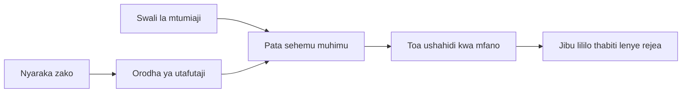

# Fundisha AI Kujibu Maswali Kulingana na Nyaraka Zako:
## Mfululizo 1: RAG, Azure dhidi ya Mbadala wa Chanzo Huria, na Wakati Kurekebisha Hufanya Maana

> Nakala ya kwanza katika mfululizo wa 2026 ukirudia mafundisho yangu ya 2023 ya Azure AI Search + Azure OpenAI kuhusu maswali ya nyaraka.

Uelekezaji wa mfululizo: [Nyumbani mwa Hifadhidata](../README.md) | Ifuatayo: [Mfululizo 2 - Jenga Mfumo wa RAG wa Chanzo Huria Kwenye Kompyuta End to End](./series-2-open-source-rag-end-to-end.md)

## 1. Utangulizi - Kurudia Mafunzo ya Awali ya RAG

Mnamo 2023, nilifanya kazi kwenye mafundisho mawili kuhusu kufundisha ChatGPT kujibu maswali kutoka kwa nyaraka za PDF kwa kutumia Azure AI Search na Azure OpenAI. Niliandika [toleo la LangChain](https://techcommunity.microsoft.com/blog/educatordeveloperblog/teach-chatgpt-to-answer-questions-using-azure-ai-search--azure-openai-lang-chain/3969713), na pia nilishirikiana kuandika [toleo la Semantic Kernel](https://techcommunity.microsoft.com/blog/educatordeveloperblog/teach-chatgpt-to-answer-questions-using-azure-ai-search--azure-openai-semantic-k/3985395) pamoja na [Lee Stott](https://developer.microsoft.com/en-us/advocates/lee-stott), Meneja Mkuu wa Utetezi wa Wingu wa Microsoft. Wakati huo, wazo la "ChatGPT kwenye data yako" bado lilihisi kuwa jipya kwa watengenezaji wengi. Mafundisho hayo yalitumia Azure Blob Storage, Azure AI Search, Azure OpenAI, LangChain, Semantic Kernel, na utafutaji wa vektori wa aina ya FAISS kujibu maswali kutoka kwa faili za PDF.

Nakalaa ile ya awali ililenga kwenye mtiririko rahisi lakini muhimu: pakia nyaraka, zifanyie fahirisi, pata maudhui yanayofaa, na muulize modeli kujibu kwa msingi wa maudhui hayo.

Mnamo 2026, mazingira ya RAG yamekua kwa kiasi kikubwa. Azure AI Search sasa inaunga mkono mifumo ya kisasa ya utafutaji wa vektori na mchanganyiko, Azure OpenAI ni sehemu ya mfumo mpana wa Microsoft Foundry Models, na API mpya ya v1 inaweza kutumia mteja wa kawaida wa OpenAI bila hitaji la mabadiliko ya kila mwezi ya `api-version`. Wakati huo huo, chaguzi za chanzo huria kama LangGraph, LlamaIndex, Haystack, Qdrant, Milvus, Weaviate, Chroma, Ollama, na vLLM zimekuwa chaguo za vitendo kwa mifumo halisi ya RAG.

Ndiyo sababu nilitaka kurudia mada hii. Suala si tena tu "Jinsi gani ninavyotengeneza RAG?" Sasa kuna njia nyingi za kuijenga, na swali muhimu zaidi ni "Je, ni usanifu gani unapaswa kuchagua kwa hali yangu?"

Lakini tatizo kuu halijabadilika.

Modeli ya AI haijui nyaraka zako moja kwa moja. Kuunda mfumo wa kujibu maswali wa nyaraka unaotegemewa, bado unahitaji utafutaji wa kuaminika, msingi, tathmini, na mtiririko wa shughuli unaofanya kazi.

Nakalaa hii sio mafundisho mengine ya mwisho-mwisho ya "chat na PDF". Nataka kuanza mfululizo huu uliotengenezwa upya na swali ambalo sasa linanihusu zaidi: ni lini unapaswa kuchagua usanifu uliodhibitiwa wa Azure, ni lini unapaswa kuchagua rundo la RAG la chanzo huria, na ni lini kurekebisha (fine-tuning) hufanya maana kweli?

Hii ni nakala ya kwanza katika mfululizo kuhusu ujenzi wa mifumo ya AI inayojengwa kwa msingi wa nyaraka. Katika sehemu hii ya kwanza, tutazingatia maamuzi ya usanifu: kwanini RAG ni muhimu, ni lini huduma zilidhibitiwa za Azure zinatumika, ni lini mbadala za chanzo huria zinafaa, na fine-tuning inaendana wapi.

Baada ya kujenga na kurudia mifumo ya QA ya nyaraka, nimekuwa na nia ndogo kuhusu ni chombo gani kinaonekana bora kwenye maonyesho na zaidi niligusa ni usanifu gani unadumu kwa watumiaji halisi, nyaraka zinazobadilika, ruhusa, makosa, na matengenezo.

## 2. Kwanini AI Yako Inahitaji Mfumo wa Utafutaji

Mifano mikubwa ya lugha imefunzwa kwa data pana za umma na za leseni. Inaweza kujua mengi kuhusu mada za jumla, lakini haifahamu moja kwa moja PDF zako binafsi, sera za ndani, taratibu za shirika, maktaba za utafiti, vifaa vya madarasa, maelezo ya msaada kwa wateja, au nyaraka zilizosasishwa hivi karibuni.

Njia rahisi ya kufikiria RAG ni hii: badala ya kutegemea modeli kukumbuka kila nyaraka, tunampa mfumo wa utafutaji. Mtumiaji anapoomba swali, mfumo hupata kwanza sehemu muhimu za taarifa, kisha huwapa sehemu hizo modeli kama muktadha.

Hii ni muhimu kwa sababu vyanzo vingi halisi vya maarifa ni binafsi, hubadilika kila mara, vinahitaji ruhusa, vinahifadhiwa katika mifumo mingi, vimeandikwa kwa aina nyingi, na ni kubwa mno kufikia kuzamishwa moja kwa moja kwenye maombi.

Kwa mfano, ikiwa shule, kampuni, au timu ya utafiti ina nyaraka za ndani 10,000, modeli haiwezi kujibu kutoka kwa nyaraka hizo kwa kuaminika isipokuwa mfumo unapata sehemu sahihi kwa wakati sahihi.

Hii huleta swali la kawaida hili:

Kwa nini si kurekebisha modeli tu?

Kurekebisha kunaweza kuwa na manufaa, lakini mara nyingi si chombo sahihi la kwanza kwa maarifa ya nyaraka. Ikiwa maarifa hubadilika mara kwa mara, ikiwa marejeleo ni muhimu, au ruhusa za upatikanaji ni muhimu, RAG kawaida ni njia bora ya kuanza. Kurekebisha kunafaa zaidi kufundisha tabia, mtindo, muundo wa matokeo, na mifumo ya kazi.

## 3. Usanifu wa RAG Katika Vitendo

Fikiria unajenga msaidizi wa AI kwa shule. Msaidizi huyo anahitaji kujibu maswali kutoka kwa sera za PDF, mwongozo wa masomo, kurasa za maswali ya mara kwa mara (FAQ) za ndani, na matangazo yaliyosasishwa hivi karibuni.

Kama mwanafunzi akuuliza, "Je, naweza kutumia AI ya kutengeneza mambo ya mwisho ya kazi yangu?", mfumo haupaswi kujibu kutoka kumbukumbu ya jumla ya modeli. Kwanza unapaswa kupata sera ya shule inayohusika, kupata sehemu kuhusu matumizi ya AI, na kisha kumuuliza modeli ajibu kwa kutumia ushahidi huo.

Hilo ndilo RAG katika vitendo.

Kwa kiwango cha juu, unaweza kufikiria mtiririko kama huu:

Maelezo yanaweza kuwa ya hali ya juu zaidi, lakini wazo msingi ni rahisi: modeli haji jibu peke yake. Inajibu kwa ushahidi uliochapishwa.

Kwanza, nyaraka huingizwa kutoka kwa mifumo ya kuhifadhi kama Azure Blob Storage, SharePoint, GitHub, au CMS ya ndani. Kisha mfumo huzigawanya kuwa maandishi huku ukihifadhi muundo muhimu kama vichwa vya habari, nambari za ukurasa, meza, sehemu, na maeneo ya chanzo.

Ifuatayo, maudhui hugawanywa katika vipande. Hatua hii inaonekana rahisi, lakini ni moja ya sehemu muhimu zaidi za mfumo. Ikiwa kipande ni kidogo sana, kinaweza kupoteza muktadha wa karibu. Ikiwa kipande ni kikubwa sana, kinaweza kujumuisha taarifa isiyo husiana na kufanya utafutaji usiwe sahihi.

Baada ya kugawanya vipande, mfumo hutoa embeddings na kuvinunulia katika fahirisi inayoweza kutafutwa pamoja na maandishi ya asili na metadata kama jina la faili, nambari ya ukurasa, ruhusa, toleo la nyaraka, na URL ya chanzo.

Mtumiaji anapoomba swali, mfumo huchuja vipande vinavyowezekana kwa kutumia utafutaji wa neno kuu, utafutaji wa vektori, au utafutaji wa mchanganyiko. Reranker inaweza kupanga upya vipande hivyo ili ushahidi bora zaidi uwe karibu juu.

Hatimaye, modeli hupokea swali na ushahidi uliopatikana. Jibu linapaswa kuwa na msingi katika ushahidi huo na litoe marejeleo ili mtumiaji aweze kuchunguza chanzo.

Jambo muhimu ni kwamba RAG sio tu "weka PDF katika hifadhidata ya vektori." Ubora wa jibu unategemea mtiririko mzima: kuchambua, kugawanya vipande, utafutaji, kupanga upya, kuamsha, marejeleo, na tathmini.

Hii ndiyo sababu muundo wa nyaraka ni muhimu. Katika PDF, kichwa, meza, kidokezo cha mguu, au mpaka wa ukurasa inaweza kubadilisha maana ya sehemu. Kwenye Azure, ujuzi wa Mpangilio wa Nyaraka hutumia uwezo wa upangilio wa Azure Document Intelligence kutoa matokeo yanayojali muundo, ambayo yanaweza kuboresha ubora wa kugawanya vipande na utafutaji kwa mifumo ya RAG.

## 4. Nini Kilibadilika Tangu 2023?

Mafunzo ya 2023 yalikuwa mwanzo mzuri kwa wakati wake:

- Azure Blob Storage ilihifadhi faili za PDF.
- Azure AI Search ilifanyia fahirisi maudhui.
- LangChain ilihusisha utafutaji na Azure OpenAI.
- FAISS ilifanya kazi kama hifadhidata ya vektori ya ndani rahisi.
- Mfano ulitumia `gpt-35-turbo` na `text-embedding-ada-002`.

Mnamo 2026, toleo la kisasa linapaswa kuakisi mabadiliko kadhaa.

Kwanza, utafutaji umeboreshwa. Mnamo 2023, maonyesho mengi yalitumia utafutaji rahisi wa ulinganishaji wa vektori. Leo, utafutaji wa mchanganyiko mara nyingi ni msingi wa kuanzia kwa QA halisi ya nyaraka. Azure AI Search inaunga mkono utafutaji wa mchanganyiko kwa kuunganisha maswali ya neno kuu na vektori katika ombi moja na kuunganisha matokeo kwa Reciprocal Rank Fusion. Semantic ranker inaweza kupanga upya matokeo ya maandishi ya maandishi kamili, vektori, na mchanganyiko.

Pili, kuingizia data ni kwa kiwango cha hali ya juu zaidi. Badala ya kugawanya kila nyaraka kwa mikono kwa msimbo wa programu, Azure AI Search inaunga mkono mchakato wa vectorization uliounganishwa kwa kugawanya vipande, kufanya embeddings, na vectorization wakati wa kuuliza. Kwa faili za PDF na mzigo mkubwa wa nyaraka, ujuzi wa Mpangilio wa Nyaraka unaweza kuhifadhi muundo zaidi kuliko vipande vya ukubwa uliowekwa.

Tatu, usimamizi wa mchakato (orchestration) ni muhimu zaidi. Sehemu ngumu mara nyingi si wito wa API wa LLM yenyewe. Sehemu ngumu ni kushughulikia makosa, jaribio la tena, utafutaji wa zamani, ubora wa vipande, mifumo inayoendelea kwa muda mrefu, ukaguzi wa binadamu, na tathmini kwa kiwango kikubwa. Hapa ndipo zana za mtiririko wa kazi kama LangGraph, LlamaIndex workflows, mabomba ya Haystack, na zana za tathmini na uonekano wa ngazi ya jukwaa zinapokuwa muhimu zaidi kuliko mnyororo wa mstari mmoja.

Nne, tathmini si chaguo tena. Maonyesho yanaweza kuonekana ya kuvutia kwa swali moja. Mfumo wa uzalishaji unahitaji seti za majaribio, ukaguzi wa regression, vipimo vya utafutaji, ukaguzi wa msingi, na ufuatiliaji. Bila tathmini, ni vigumu kujua kama mfumo unaboreshwa au unabadilika tu.

## 5. Kuchagua Kati ya Azure na Rundo la RAG la Chanzo Huria

Sidhani kuwa swali muhimu ni "Je, Azure ni bora kuliko chanzo huria?" au "Je, chanzo huria ni bora kuliko Azure?"

Swali muhimu ni: unajenga mfumo gani, nani ataendesha, ni vikwazo gani ulivyo navyo, na hali za makosa zipi hazikubaliki?

Nilipoanza kujenga mifano ya QA ya nyaraka, nilifikiria hasa kama utafutaji ulifanya kazi. Je, naweza kupakia PDF, kuziainisha, na kutoa jibu? Hilo lilikuwa mwanzo mzuri.

Baada ya kufanya kazi na mifumo halisi ya AI, tathmini yangu ilibadilika. Sasa ninaangalia mambo manne kabla ya kuchagua rundo la RAG:

- utambulisho na ruhusa
- ubora wa utafutaji
- uaminifu wa mtiririko wa kazi
- umiliki wa uendeshaji

Sehemu hizo nne zinaelezea zaidi kuliko kipimo cha mfano peke yake.

Usanifu unaotegemea Azure kawaida hufaa wakati uunganisho wa shirika ni tatizo gumu. Ikiwa timu tayari inategemea Microsoft Entra ID, Microsoft 365, Azure Storage, mtandao wa kibinafsi, RBAC, na ufuatiliaji wa Azure, Azure AI Search na Azure OpenAI vinaweza kupunguza changamoto nyingi za uendeshaji. Kwenye mazingira hayo, Azure si API ya modeli tu. Thamani ni mfumo unaozunguka: utambulisho, utawala, utafutaji ulioendeshwa, usalama, usaidizi, na operesheni zinazojulikana.

Usanifu wa chanzo huria kawaida hufaa wakati uhuru ni sehemu ngumu. Ikiwa timu inahitaji inference ya ndani, urahisi wa kuzamishwa wingu, bomba la utafutaji maalum, kupanga upya maalum, au udhibiti wa moja kwa moja wa hifadhidata ya vektori na safu ya kuhudumia modeli, rundo la chanzo huria linaweza kuwa chaguo bora. Kushindana ni kwamba timu inamiliki zaidi kazi ya uaminifu: nakala rudufu, upanuzi, ucheleweshaji, uhamisho, ufuatiliaji, na usalama.

Katika vitendo, mifumo mingi ya AI ya uzalishaji si ya asili ya wingu pekee au chanzo huria pekee. Mara nyingi ni mifumo mchanganyiko inayopatanisha urahisi wa uendeshaji, usafirishaji, utawala, na uhuru wa uhandisi.

Kwa mfano, singeshangaa kuona mfumo ukitumia Azure OpenAI kwa ufikiaji wa modeli, LangGraph kwa usimamizi wa mtiririko wa kazi, mwenyeji wa Azure kwa utekelezaji, na hifadhidata ya vektori ya chanzo huria kwa mahitaji maalum ya utafutaji. Hilo si utofauti wa usanifu. Hicho ni kuchagua kiwango sahihi cha huduma iliyodhibitiwa na udhibiti wa uhandisi kwa kila sehemu ya mfumo.

Napenda usanifu mchanganyiko wakati jukwaa lililodhibitiwa linaondoa matatizo muhimu ya shirika, wakati vipengele vya chanzo huria vinatoa timu uhuru mahali panapohitaji kweli.

## 6. Mwongozo wa Maamuzi wa Kivitendo

Hapa kuna jedwali la maamuzi ninalotumia na timu kabla ya kuchagua rundo la RAG:

| Eneo la Maamuzi | Rundo lililodhibitiwa na Azure ni imara zaidi wakati... | Rundo la chanzo huria ni imara zaidi wakati... |
| --- | --- | --- |
| Utambulisho na upatikanaji | Entra ID, RBAC, utambulisho uliodhibitiwa, na ruhusa za shirika ni za msingi | uthibitishaji wa kawaida, utambulisho usio wa Microsoft, au mantiki maalum ya upatikanaji inatawala |
| Uendeshaji | timu inataka miundombinu iliyodhibitiwa, msaada, SLA, na kuanza kwa urahisi | timu inaweza kuendesha hifadhidata za vektori, kuhudumia modeli, nakala rudufu, na upanuzi |
| Utafutaji | utafutaji wa mchanganyiko, upangaji wa semantic, vichujio, na utafutaji wa metadata unakidhi mahitaji mengi | timu inahitaji utafutaji wa kawaida, upangaji maalum, au uainishaji wa majaribio |
| Uwezo wa kusonga | mlinganiko wa ekosistimu ya Azure unakubalika au unapendelewa | kuepuka kufungwa na wingu ni sharti gumu |
| Inference | utawala wa Azure OpenAI, mtandao, na udhibiti wa shirika ni muhimu | inference ya ndani, modeli maalum, au kuhudumiwa mwenyewe yanahitajika |
| Gharama | kupunguza juhudi za uhandisi na uendeshaji ni muhimu zaidi kuliko kurekebisha miundombinu | kiwango ni kikubwa vya kutosha kuhalalisha uboreshaji makini wa miundombinu |
| Maajaribio | utulivu na uunganishaji wa shirika ni muhimu zaidi kuliko kubadilisha vipengele mara kwa mara | timu inajaribu haraka mashine, zana, kumbukumbu, na mtiririko wa utafutaji |

Kanuni yangu rahisi ni:

- Anza na Azure unapoona kuunganishwa kwa shirika, usalama, na urahisi wa uendeshaji ni hatari kuu.
- Anza na chanzo huria unapolenga usafiri, urekebishaji, au udhibiti wa ndani ni hatari kuu.
- Tumia rundo mchanganyiko wakati zote mbili ni kweli.

Hii pia ndicho sababu ningesianza mfululizo wa RAG wa 2026 na msimbo kwanza. Msimbo ni muhimu, lakini uteuzi wa usanifu huja kabla ya utekelezaji. Maonyesho rahisi yanaweza kuficha chaguzi ngumu zaidi. Mfumo mzuri wa RAG hufanya chaguzi hizo waziwazi.

## 7. Wapi Kurekebisha (Fine-Tuning) Kunoendana

Kurekebisha mara nyingi hurejelewa pamoja na RAG, lakini nadhani ni muhimu kutofautisha mbili.

RAG kawaida ni chaguo bora wakati mfumo unahitaji maarifa safi, binafsi, yanayohitaji ruhusa, au yenye msingi wa chanzo. Ikiwa jibu linapaswa kurejelea nyaraka, kuonyesha masasisho ya hivi karibuni, au kuheshimu sheria za upatikanaji za mtumiaji, utafutaji unapaswa kuwa sehemu ya usanifu.
Fine-tuning ni yenye manufaa zaidi wakati ujuzi si tatizo kuu. Inaweza kusaidia unapotaka mfano ufuate muundo maalum wa pato, ulingane na mtindo wa majibu maalum wa eneo fulani, kufanya kazi thabiti kwa uvumilivu zaidi, au kupunguza idadi ya maelekezo yanayohitajika katika kila ombi.

Katika vitendo, mbili zinaweza kufanya kazi pamoja. Msaidizi wa msaada anaweza kutumia RAG kupata sera ya karibuni, wakati mfano uliofanyiwa fine-tuning hujifunza muundo na sauti inayopendelewa na kampuni katika majibu.

Kosa ni kutibu fine-tuning kama mbadala wa hifadhi ya hati. Haiondoi hitaji la upokeaji wakati mfumo lazima ujibu kutoka kwa data mpya, binafsi, au nyeti kwa ruhusa.

## 8. Wapi Mfululizo Huu Unaenda Ifuatayo

Makala hii ni tabaka la kufanya maamuzi. Kabla ya kuandika msimbo, nilitaka kufanya wazi mapendeleo: RAG dhidi ya fine-tuning, Azure dhidi ya chanzo huria, huduma zilizoendeshwa dhidi ya udhibiti wa uendeshaji.

Kabla ya kuingia katika utekelezaji, nataka kuacha hoja moja hapa: katika mifumo mingi ya AI ya biashara, mfano ni sehemu moja tu. Ubora wa upokeaji, uratibu, tathmini, ruhusa, na uaminifu wa uendeshaji mara nyingi ndio huamsha kama mfumo utafanikiwa zaidi ya hatua ya maonyesho.

Katika sehemu zijazo za mfululizo huu, ninapanga kuingia kwa undani zaidi kwenye upande wa vitendo wa mifumo ya AI inayotegemea hati: kwanza kujenga mtiririko wa kazi wa RAG wa chanzo huria wa ndani, kisha kujenga tena hali ile ile na Azure AI Search na Azure OpenAI, na kisha kutathmini kama mfumo kwa kweli unafanya kazi.

Naweza kubadilisha mpangilio kadri mfululizo unavyoendelea, lakini lengo litaendelea kuwa lile lile: kusonga mbali na maonyesho rahisi na kuonyesha jinsi ya kufikiria kuhusu mifumo ya RAG ambayo inaweza kudumishwa, kutathminiwa, na kuendeshwa.

## 9. Marejeleo na Rasilimali

Mafunzo ya asili:

- [Fundisha ChatGPT Kujibu Maswali: Kutumia Azure AI Search & Azure OpenAI (Lang Chain)](https://techcommunity.microsoft.com/blog/educatordeveloperblog/teach-chatgpt-to-answer-questions-using-azure-ai-search--azure-openai-lang-chain/3969713)
- [Fundisha ChatGPT Kujibu Maswali: Kutumia Azure AI Search & Azure OpenAI (Semantic Kernel)](https://techcommunity.microsoft.com/blog/educatordeveloperblog/teach-chatgpt-to-answer-questions-using-azure-ai-search--azure-openai-semantic-k/3985395)

Azure:

- [Toleo la REST API za Azure AI Search](https://learn.microsoft.com/en-us/rest/api/searchservice/search-service-api-versions)
- [Utafutaji mchanganyiko katika Azure AI Search](https://learn.microsoft.com/en-us/azure/search/hybrid-search-how-to-query)
- [Uunganishaji wa vector katika Azure AI Search](https://learn.microsoft.com/en-us/azure/search/vector-search-integrated-vectorization)
- [Ujuzi wa Mpangilio wa Hati katika Azure AI Search](https://learn.microsoft.com/en-us/azure/search/cognitive-search-skill-document-intelligence-layout)
- [Kugawanya na kutengeneza vector kwa muundo wa hati](https://learn.microsoft.com/en-us/azure/search/search-how-to-semantic-chunking)
- [Kuweka daraja la maana (semantic ranking) katika Azure AI Search](https://learn.microsoft.com/en-us/azure/search/semantic-search-overview)
- [Mzunguko wa toleo la API ya Azure OpenAI / Microsoft Foundry](https://learn.microsoft.com/en-us/azure/foundry/openai/api-version-lifecycle)
- [Modeli za Foundry zinazouzwa na Azure](https://learn.microsoft.com/en-us/azure/foundry/foundry-models/concepts/models-sold-directly-by-azure)
- [Mazingira ya fine-tuning katika Microsoft Foundry](https://learn.microsoft.com/en-us/azure/foundry/openai/concepts/fine-tuning-considerations)
- [Uchunguzi katika Microsoft Foundry](https://learn.microsoft.com/en-us/azure/foundry/concepts/observability)
- [Fanya tathmini katika Microsoft Foundry](https://learn.microsoft.com/en-us/azure/foundry/how-to/evaluate-generative-ai-app)

Chanzo huria:

- [Nyaraka za LangGraph](https://docs.langchain.com/oss/python/langgraph/overview)
- [Nyaraka za LlamaIndex](https://developers.llamaindex.ai/python/framework/)
- [Nyaraka za Haystack](https://docs.haystack.deepset.ai/)
- [Nyaraka za Qdrant](https://qdrant.tech/documentation/overview/)
- [Nyaraka za Milvus](https://milvus.io/docs/overview.md)
- [Nyaraka za Weaviate](https://docs.weaviate.io/weaviate/current/)
- [Nyaraka za Chroma](https://docs.trychroma.com/docs/overview/introduction)
- [Kuweka embeddings za Ollama](https://docs.ollama.com/capabilities/embeddings)
- [Seva inayoungwa mkono na OpenAI ya vLLM](https://docs.vllm.ai/en/latest/serving/openai_compatible_server.html)
- [Modeli za embedding za BGE](https://huggingface.co/BAAI/bge-large-en-v1.5)
- [Modeli za embedding za E5](https://huggingface.co/intfloat/e5-large-v2)
- [Modeli za embedding za Instructor](https://huggingface.co/hkunlp/instructor-large)

Ifuatayo: [Mfululizo 2 - Jenga Mfumo wa Kanuni Huria wa RAG wa Ndani Mwisho hadi Mwisho](./series-2-open-source-rag-end-to-end.md)

---

<!-- CO-OP TRANSLATOR DISCLAIMER START -->
**Kionyozo**:
Hati hii imetafsiriwa kwa kutumia huduma ya tafsiri ya AI [Co-op Translator](https://github.com/Azure/co-op-translator). Ingawa tunajitahidi kupata usahihi, tafadhali fahamu kwamba tafsiri za kiotomatiki zinaweza kuwa na makosa au upungufu wa usahihi. Hati ya asili katika lugha yake halisi inapaswa kuchukuliwa kama chanzo cha mamlaka. Kwa taarifa muhimu, tafsiri ya kitaalamu inayofanywa na binadamu inapendekezwa. Hatutojibu kwa kuelewa vibaya au tafsiri potofu zinazotokea kutokana na matumizi ya tafsiri hii.
<!-- CO-OP TRANSLATOR DISCLAIMER END -->