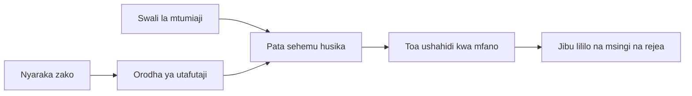

# Fundisha AI Kujibu Maswali Kulingana na Hati Zako:
## Mfululizo 1: RAG, Azure dhidi ya Vifaa Mbadala vya Chanzo Huria, na Wakati wa Kufanya Fine-Tuning Ina Mantiki

> Makala ya kwanza katika mfululizo wa 2026 ukirudia mafunzo yangu ya 2023 ya Azure AI Search + Azure OpenAI ya QA ya hati.

## 1. Utangulizi - Kurudia Mafunzo ya Awali ya RAG

Mnamo 2023, nilifanya kazi kwenye mfululizo wa mafunzo juu ya kufundisha ChatGPT kujibu maswali kutoka kwa hati za PDF kwa kutumia Azure AI Search na Azure OpenAI. Niliandika [toleo la LangChain](https://techcommunity.microsoft.com/blog/educatordeveloperblog/teach-chatgpt-to-answer-questions-using-azure-ai-search--azure-openai-lang-chain/3969713), na pia niliandika kwa pamoja toleo la [Semantic Kernel](https://techcommunity.microsoft.com/blog/educatordeveloperblog/teach-chatgpt-to-answer-questions-using-azure-ai-search--azure-openai-semantic-k/3985395) na [Lee Stott](https://developer.microsoft.com/en-us/advocates/lee-stott), Meneja Mkuu wa Wakili wa Wingu wa Microsoft. Wakati huo, wazo la "ChatGPT juu ya data yako" lilionekana jipya kwa watengenezaji wengi. Mafunzo hayo yalitumia Azure Blob Storage, Azure AI Search, Azure OpenAI, LangChain, Semantic Kernel, na FAISS-style vector retrieval kujibu maswali kutoka kwa faili za PDF.

Makala ile ya awali ilizingatia mtiririko rahisi lakini muhimu: pakia hati, fanya index, chukua maudhui yanayofaa, na muulize modeli kujibu kwa msingi wa maudhui hayo.

Mnamo 2026, mfumo wa RAG umeongezeka sana. Azure AI Search sasa inaunga mkono miundo ya kisasa ya kurejea vector na mchanganyiko, Azure OpenAI ni sehemu ya mfumo mpana wa Microsoft Foundry Models, na API mpya ya toleo la v1 inaweza kutumia mteja wa kawaida wa OpenAI bila kuhitaji mabadiliko ya `api-version` kila mwezi. Wakati huo huo, chaguzi za chanzo huria kama LangGraph, LlamaIndex, Haystack, Qdrant, Milvus, Weaviate, Chroma, Ollama, na vLLM zimekuwa chaguzi halali kwa mifumo halisi ya RAG.

Hilo ndilo sababu nilitaka kurudia mada hii. Swali si tena "Jinsi gani ninajenga RAG?" Kuna njia nyingi sasa za kujenga, na swali muhimu zaidi ni "Nisichague usanifu gani kwa hali yangu?"

Lakini tatizo kuu halijabadilika.

Modeli ya AI haiwezi kujua hati zako moja kwa moja. Ili kujenga mfumo mzuri wa kujibu maswali ya hati, bado unahitaji urejeaji wa kuaminika, msingi, tathmini, na mtiririko wa operesheni.

Makala hii si mafunzo nyingine ya "zungumza na PDF" kutoka mwanzo hadi mwisho. Nataka kuanzisha mfululizo huu uliotengenezwa upya na swali ambalo sasa linanipendeza zaidi: lini unapaswa kuchagua usanifu uliosimamiwa wa Azure, lini unapaswa kuchagua RAG ya chanzo huria, na lini fine-tuning ina mantiki kweli?

Hii ni makala ya kwanza katika mfululizo kuhusu kujenga mifumo ya AI inayotegemea hati. Sehemu hii ya kwanza, tutazingatia maamuzi ya usanifu: kwanini RAG ni muhimu, lini huduma zilizosimamiwa za Azure ni za manufaa, lini chaguzi za chanzo huria zina mantiki, na wapi fine-tuning ina nafasi yake.

Baada ya kujenga na kurudia mifumo ya QA ya hati, nimeanza kupendelea zaidi kuhusu ni usanifu gani utaishi na watumiaji halisi, hati zinavyobadilika, ruhusa, kukosekana, na matengenezo kuliko zana gani inaonekana vizuri kwenye demo.

## 2. Kwa Nini AI Yako Inahitaji Mfumo wa Utafutaji

Mifano mikubwa ya lugha hujifunza kwa kutumia data pana za umma na leseni. Inaweza kujua mengi kuhusu mada za jumla, lakini haiwezi kujua moja kwa moja PDF zako binafsi, sera za ndani, taratibu za shirika, maktaba za utafiti, vifaa vya darasani, maelezo ya msaada wa wateja, au nyaraka zilizosasishwa hivi karibuni.

Njia rahisi ya kufikiria kuhusu RAG ni hii: badala ya kutegemea modeli kukumbuka kila hati, tunampa mfumo wa utafutaji. Mtumiaji anapoomba swali, mfumo kwanza huchukua vipande vya taarifa vinavyohusiana zaidi, kisha huwaambia modeli kama muktadha.

Hii ni muhimu kwa sababu vyanzo vingi halisi vya maarifa ni binafsi, hubadilika mara kwa mara, vinategemea ruhusa, huhifadhiwa katika mifumo mingi, vina iandikwa kwa miundo mingi, na ni vikubwa mno kuvinakili moja kwa moja katika muktadha.

Kwa mfano, ikiwa shule, kampuni, au timu ya utafiti ina hati za ndani 10,000, modeli haiwezi kujibu kwa kuaminika kutoka kwa hati hizo isipokuwa mfumo uchukue sehemu sahihi wakati sahihi.

Hii kwa kawaida husababisha swali linalojirudia:

Kwa nini si fine-tune tu modeli?

Fine-tuning inaweza kuwa na manufaa, lakini mara nyingi si zana ya kwanza inayofaa kwa maarifa ya hati. Ikiwa maarifa hubadilika mara kwa mara, ikiwa marejeo ni muhimu, au ikiwa ruhusa za upatikanaji zinahitajika, RAG mara nyingi ndio msingi mzuri. Fine-tuning ni bora zaidi kwa kufundisha tabia, mtindo, muundo wa matokeo, na mifano ya kazi.

## 3. Usanifu wa RAG Katika Vitendo

Fikiria unajenga msaidizi wa AI kwa shule. Msaidizi anahitaji kujibu maswali kutoka kwa sera za PDF, miongozo ya kozi, kurasa za maswali yanayoulizwa mara nyingi ndani ya shirika, na matangazo yaliyowekwa hivi karibuni.

Kama mwanafunzi auliza, "Naweza kutumia AI ya kizazi kwa kazi yangu ya mwisho?", mfumo usijibu kutoka kumbukumbu ya jumla ya modeli. Kufanya kwanza ni kupata sera inayohusiana ya shule, kuchukua sehemu kuhusu matumizi ya AI, kisha kumuuliza modeli kujibu kwa kutumia ushahidi huo.

Hilo ndilo RAG katika vitendo.

Kiwango cha juu, unaweza kufikiria mtiririko kama huu:

Maelezo yanaweza kuwa ya kina zaidi, lakini wazo msingi ni rahisi: modeli haijibu peke yake. Inajibu kwa ushahidi uliopatikana.

Kwanza, hati huingizwa kutoka mifumo ya kuhifadhi kama Azure Blob Storage, SharePoint, GitHub, au CMS ya ndani. Kisha mfumo huzitafsiri kuwa maandishi huku ukihifadhi muundo muhimu kama vichwa, nambari za kurasa, meza, sehemu, na maeneo ya asili.

Ifuatayo, maudhui hugawanywa katika vipande. Hatua hii inaonekana rahisi, lakini ni mojawapo ya sehemu muhimu za mfumo. Ikiwa kipande ni kidogo mno, kinaweza kupoteza muktadha wa karibu. Ikiwa kipande ni kikubwa mno, kinaweza kujumuisha taarifa zisizohusiana na kufanya urejeaji usielekezwe vizuri.

Baada ya kugawanya vipande, mfumo hutoa embeddings na kuziweka kwenye index inayoweza kutafutwa pamoja na maandishi asilia na metadata kama jina la faili, nambari ya ukurasa, ruhusa, toleo la hati, na URL ya chanzo.

Mtumiaji anapouliza swali, mfumo huchukua vipande vinavyowezekana kwa kutumia utafutaji wa maneno, utafutaji wa vector, au utafutaji mchanganyiko. Reranker inaweza kisha kuupangilia upya mtiririko wa vipande hivyo ili ushahidi muhimu zaidi uwe juu.

Mwishowe, modeli hupokea swali na ushahidi uliopatikana. Jibu linapaswa kuungwa mkono na ushahidi huo na kurudisha marejeo ili mtumiaji aweze kukagua chanzo.

Jambo muhimu ni kwamba RAG si "weka PDF kwenye database ya vector tu." Ubora wa jibu hutegemea mtiririko mzima: kutafsiri, kugawanya vipande, urejeaji, upangilio wa upya, kuamsha, marejeo, na tathmini.

Hii ndiyo sababu muundo wa hati ni muhimu. Katika PDF, kichwa, jedwali, anwani ya mguu, au mpaka wa ukurasa vinaweza kubadilisha maana ya sehemu. Katika Azure, ujuzi wa Mpangilio wa Hati hutumia uwezo wa Azure Document Intelligence wa mpangilio kutoa matokeo yenye ufahamu wa muundo, ambayo yanaweza kuboresha ubora wa kugawanya vipande na urejeaji kwa mifumo ya RAG.

## 4. Nini Kimebadilika Tangu 2023?

Mafunzo ya 2023 yalikuwa mwanzo mzuri kwa wakati wake:

- Azure Blob Storage ilihifadhi faili za PDF.
- Azure AI Search ilifanya index ya maudhui.
- LangChain ilihusisha urejeaji na Azure OpenAI.
- FAISS ilifanya kama hifadhi rahisi ya vector eneo la karibu.
- Mfano ulitumia `gpt-35-turbo` na `text-embedding-ada-002`.

Mnamo 2026, toleo la kisasa linapaswa kuakisi mabadiliko kadhaa.

Kwanza, urejeaji umeimarika. Mnamo 2023, maonyesho mengi yalitumia utafutaji rahisi wa kufanana vector. Leo, urejeaji wa mchanganyiko mara nyingi ni msingi wa kuanza kwa QA halisi ya hati. Azure AI Search inaunga mkono utafutaji wa mchanganyiko kwa kuunganisha maswali ya maneno na vector katika ombi moja na kuunganisha matokeo kwa Reciprocal Rank Fusion. Semantic ranker inaweza kisha kuupangilia upya upande wa maandishi wa matokeo ya maandishi kamili, vector, na mchanganyiko.

Pili, uingizaji una ufanisi zaidi. Badala ya kugawanya kila hati kwa mikono na msimbo wa programu, Azure AI Search inaunga mkono vectorization iliyojumuishwa kwa kugawanya vipande, kutoa embedding, na vectorization wakati wa kuuliza. Kwa kazi nzito za PDF na hati, ujuzi wa Mpangilio wa Hati unaweza kuhifadhi muundo zaidi kuliko vipande vya ukubwa thabiti.

Tatu, usimamizi wa mchakato ni muhimu zaidi. Sehemu ngumu mara nyingi si API ya LLM yenyewe. Sehemu ngumu ni kushughulikia makosa, jaribio la tena, urejeaji wa zamani, ubora wa vipande, workflows zinazochukua muda mrefu, ukaguzi wa binadamu, na tathmini kwa kiwango kikubwa. Hapa ndipo zana za mtiririko kama LangGraph, LlamaIndex workflows, mistari ya Haystack, na zana za tathmini na utambuzi ngazi ya jukwaa zinakuwa muhimu zaidi kuliko mnyororo mmoja mwekundu.

Nne, tathmini si ya hiari tena. Demo inaweza kuonekana nzuri kwa swali moja. Mfumo wa uzalishaji unahitaji seti za majaribio, ukaguzi wa regression, vipimo vya urejeaji, ukaguzi wa msingi, na ufuatiliaji. Bila tathmini, ni vigumu kujua kama mfumo unaboreshwa au kubadilika tu.

## 5. Kuchagua Kati ya Azure na RAG za Chanzo Huria

Sidhani swali muhimu ni "Je, Azure ni bora kuliko chanzo huria?" au "Je, chanzo huria ni bora kuliko Azure?"

Swali muhimu ni: ni mfumo gani unaujenga, nani atauendesha, ni vikwazo gani unavyo, na aina gani za makosa hazikubaliki?

Nilipoanza kujenga mifano ya QA ya hati, nilikuwa nikifikiria zaidi kama urejeaji ulikuwa unafanya kazi. Je, naweza kupakia PDF, kuyatafuta, na kuunda jibu? Hilo lilikuwa mwanzo mzuri.

Baada ya kufanya kazi kupitia workflows za AI halisi, tathmini yangu ilibadilika. Sasa naangalia mambo manne kabla ya kuchagua RAG:

- utambulisho na ruhusa
- ubora wa urejeaji
- kuaminika kwa mtiririko wa kazi
- umiliki wa operesheni

Sehemu hizo nne zilieleza zaidi kuliko kipimo cha modeli peke yake.

Usanifu wa kuongozwa na Azure mara nyingi huonyesha maana wakati mchakato wa ushirikiano wa shirika ni mgumu. Ikiwa timu tayari inategemea Microsoft Entra ID, Microsoft 365, Azure Storage, mitandao binafsi, RBAC, na ufuatiliaji wa Azure, Azure AI Search na Azure OpenAI vinaweza kupunguza urahisi wa uendeshaji. Katika mazingira hayo, Azure si API tu ya modeli. Thamani ni mfumo unaozunguka: utambulisho, utawala, utafutaji ulioendeshwa, usalama, msaada, na uendeshaji wa kawaida.

Usanifu wa chanzo huria mara nyingi huweka maana wakati unahitaji kubadilika. Ikiwa timu inahitaji utabiri wa eneo la karibu, usafiri wa wingu, bomba la urejeaji maalum, upangilio wa reranking maalum, au udhibiti wa moja kwa moja wa database ya vector na tabaka la kuhudumia modeli, stack la chanzo huria linaweza kuwa suluhisho bora. Hasara ni kwamba timu inamiliki zaidi ya kazi za kuaminika: nakala rudufu, ongezeko la kiwango, ucheleweshaji, uhamishaji, ufuatiliaji, na usalama.

Kwa vitendo, mifumo mingi ya AI ya uzalishaji si ya wingu tu au chanzo huria tu. Mara nyingi ni mifumo mchanganyiko inayobadilisha urahisi wa uendeshaji, uhamaji, utawala, na kubadilika kwa uhandisi mtu mmoja mmoja.

Kwa mfano, usingeweza kushangazwa kuona mfumo unatumia Azure OpenAI kwa ufikiaji wa modeli, LangGraph kwa usimamizi wa mtiririko wa kazi, uwekaji wa Azure kwa utoaji, na database ya vector ya chanzo huria kwa mahitaji maalum ya urejeaji. Hilo si mkanganyiko wa usanifu. Hicho ni kuchagua kiwango sahihi cha huduma iliyosimamiwa na udhibiti wa uhandisi kwa kila sehemu ya mfumo.

Napenda usanifu wa mchanganyiko wakati jukwaa lililosimamiwa linatatua matatizo muhimu ya shirika, wakati vipengele vya chanzo huria vinampa timu kubadilika mahali panapohitaji kweli.

## 6. Mwongozo wa Uamuzi wa Kivitendo

Huu ni jedwali la uamuzi ninalotumia na timu kabla ya kuchagua stack la RAG:

| Eneo la Uamuzi | Stack iliyosimamiwa ya Azure huwa na nguvu zaidi wakati... | Stack ya chanzo huria huwa na nguvu zaidi wakati... |
| --- | --- | --- |
| Utambulisho na upatikanaji | Entra ID, RBAC, utambulisho uliosimamiwa, na ruhusa za shirika ni za msingi | uthibitishaji wa kawaida, utambulisho usio wa Microsoft, au mantiki ya upatikanaji maalum ya app huwa mstari wa mbele |
| Operesheni | timu inataka miundombinu iliyosimamiwa, msaada, SLA, na uanzishaji rahisi | timu inaweza kuendesha databases za vector, kuhudumia modeli, nakala rudufu, na ongezeko la kiwango |
| Urejeaji | utafutaji mchanganyiko, upangaji wa kitaalamu, vichujio, na utafutaji wa metadata husuluhisha mahitaji mengi | timu inahitaji urejeaji wa kawaida, upangaji wa reranking maalum, au index ya majaribio |
| Uhamaji | uratibu wa mfumo wa Azure unakubalika au unapendelewa | kuepuka kufungwa na wingu ni sharti ngumu |
| Utabiri | utawala wa Azure OpenAI, mitandao, na udhibiti wa shirika ni muhimu | utabiri wa eneo la karibu, modeli maalum, au huduma binafsi zinahitajika |
| Gharama | kupunguza juhudi za uhandisi na operesheni ni muhimu kuliko urekebishaji wa miundombinu | kiwango ni kikubwa vya kutosha kueleza uboreshaji makini wa miundombinu |
| Maajaribio | utulivu na ushirikiano wa shirika ni muhimu zaidi kuliko kubadilisha vipengele mara kwa mara | timu inabadilisha haraka wakala, zana, kumbukumbu, na workflows za urejeaji |

Kanuni yangu rahisi ni:

- Anza na Azure wakati ushirikiano wa shirika, usalama, na urahisi wa operesheni ndio hatari kuu.
- Anza na chanzo huria wakati uhamaji, usanifu maalum, au udhibiti wa eneo la karibu ni hatari kuu.
- Tumia stack ya mchanganyiko wakati zote mbili ni kweli.

Hii pia ndio sababu sitaanza mfululizo wa RAG wa 2026 na msimbo kwanza. Msimbo ni muhimu, lakini uchaguzi wa usanifu huja kabla ya utekelezaji. Demo rahisi inaweza kuficha chaguzi ngumu zaidi. Mfumo mzuri wa RAG hufanya chaguzi hizo wazi.

## 7. Wapi Fine-Tuning Inaendana

Fine-tuning mara nyingi huzungumzwa pamoja na RAG, lakini nafikiri ni muhimu kutofautisha.

RAG mara nyingi ni chaguo bora wakati mfumo unahitaji maarifa mapya, binafsi, yanayohitaji ruhusa, au msingi wa chanzo. Ikiwa jibu linapaswa kurejea hati, kuonyesha masasisho ya hivi karibuni, au kuheshimu sheria za upatikanaji maalum kwa mtumiaji, urejeaji unapaswa kuwa sehemu ya usanifu.

Fine-tuning ni ya manufaa zaidi wakati maarifa si tatizo kuu. Inaweza kusaidia unapotaka modeli ifuate muundo maalum wa mazao, linganishi mtindo wa jibu wa eneo fulani, fanya kazi thabiti zaidi kwa uthabiti, au punguza kiasi cha maelekezo yanayohitajika kila muktadha.
Kwa vitendo, vyote viwili vinaweza kufanya kazi pamoja. Msaidizi wa msaada anaweza kutumia RAG kupata sera mpya zaidi, wakati mfano uliobadilishwa hujifunza muundo wa jibu unaopendelea wa kampuni na mtindo.

Hitilafu ni kutibu ufine-tuning kama mchimbaji wa hati. Haiondoi haja ya urejeshaji wakati mfumo lazima ujibu kutoka kwa data mpya, binafsi, au nyeti za ruhusa.

## 8. Hili Mfululizo Unaelekea Wapi Ifuatayo

Makala haya ni safu ya kufanya maamuzi. Kabla ya kuandika msimbo, nilitaka kufanya maamuzi hayo wazi: RAG dhidi ya ufine-tuning, Azure dhidi ya chanzo huria, huduma zilizodhibitiwa dhidi ya udhibiti wa uendeshaji.

Kabla ya kuingia katika utekelezaji, nataka kuacha hoja moja hapa: katika mifumo mingi ya AI ya biashara, mfano ni sehemu moja tu. Ubora wa urejeshaji, usimamizi, tathmini, ruhusa, na uaminifu wa uendeshaji mara nyingi ndizo zinazobainisha kama mfumo utafanikiwa zaidi ya kiwango cha maonyesho.

Katika sehemu zinazofuata za mfululizo huu, ninapanga kuingia kwa undani upande wa vitendo wa mifumo ya AI inayotegemea hati: jinsi ya kujenga usanifu unaotegemea Azure, jinsi mbadala za chanzo huria zinavyolinganishwa kwa vitendo, na jinsi ya kutathmini kama mfumo wa RAG kweli unafanya kazi.

Ninaweza kurekebisha mpangilio kadri mfululizo unavyokua, lakini lengo litaendelea kuwa lile lile: kuondoka mitaoni rahisi na kuonyesha jinsi ya kufikiria kuhusu mifumo ya RAG ambayo inaweza kudumishwa, kuthaminiwa, na kuendeshwa.

## 9. Marejeleo na Rasilimali

Mafunzo ya asili:

- [Teach ChatGPT to Answer Questions: Using Azure AI Search & Azure OpenAI (Lang Chain)](https://techcommunity.microsoft.com/blog/educatordeveloperblog/teach-chatgpt-to-answer-questions-using-azure-ai-search--azure-openai-lang-chain/3969713)
- [Teach ChatGPT to Answer Questions: Using Azure AI Search & Azure OpenAI (Semantic Kernel)](https://techcommunity.microsoft.com/blog/educatordeveloperblog/teach-chatgpt-to-answer-questions-using-azure-ai-search--azure-openai-semantic-k/3985395)

Azure:

- [Azure AI Search REST API versions](https://learn.microsoft.com/en-us/rest/api/searchservice/search-service-api-versions)
- [Hybrid search in Azure AI Search](https://learn.microsoft.com/en-us/azure/search/hybrid-search-how-to-query)
- [Integrated vectorization in Azure AI Search](https://learn.microsoft.com/en-us/azure/search/vector-search-integrated-vectorization)
- [Document Layout skill in Azure AI Search](https://learn.microsoft.com/en-us/azure/search/cognitive-search-skill-document-intelligence-layout)
- [Chunk and vectorize by document layout](https://learn.microsoft.com/en-us/azure/search/search-how-to-semantic-chunking)
- [Semantic ranking in Azure AI Search](https://learn.microsoft.com/en-us/azure/search/semantic-search-overview)
- [Azure OpenAI / Microsoft Foundry API version lifecycle](https://learn.microsoft.com/en-us/azure/foundry/openai/api-version-lifecycle)
- [Foundry Models sold by Azure](https://learn.microsoft.com/en-us/azure/foundry/foundry-models/concepts/models-sold-directly-by-azure)
- [Microsoft Foundry fine-tuning considerations](https://learn.microsoft.com/en-us/azure/foundry/openai/concepts/fine-tuning-considerations)
- [Microsoft Foundry observability](https://learn.microsoft.com/en-us/azure/foundry/concepts/observability)
- [Run evaluations in Microsoft Foundry](https://learn.microsoft.com/en-us/azure/foundry/how-to/evaluate-generative-ai-app)

Chanzo huria:

- [LangGraph documentation](https://docs.langchain.com/oss/python/langgraph/overview)
- [LlamaIndex documentation](https://developers.llamaindex.ai/python/framework/)
- [Haystack documentation](https://docs.haystack.deepset.ai/)
- [Qdrant documentation](https://qdrant.tech/documentation/overview/)
- [Milvus documentation](https://milvus.io/docs/overview.md)
- [Weaviate documentation](https://docs.weaviate.io/weaviate/current/)
- [Chroma documentation](https://docs.trychroma.com/docs/overview/introduction)
- [Ollama embeddings](https://docs.ollama.com/capabilities/embeddings)
- [vLLM OpenAI-compatible server](https://docs.vllm.ai/en/latest/serving/openai_compatible_server.html)
- [BGE embedding models](https://huggingface.co/BAAI/bge-large-en-v1.5)
- [E5 embedding models](https://huggingface.co/intfloat/e5-large-v2)
- [Instructor embedding models](https://huggingface.co/hkunlp/instructor-large)

---

<!-- CO-OP TRANSLATOR DISCLAIMER START -->
**Kionyozo**:
Hati hii imetafsiriwa kwa kutumia huduma ya tafsiri ya AI [Co-op Translator](https://github.com/Azure/co-op-translator). Ingawa tunajitahidi kupata usahihi, tafadhali fahamu kwamba tafsiri za kiotomatiki zinaweza kuwa na makosa au upungufu wa usahihi. Hati ya asili katika lugha yake halisi inapaswa kuchukuliwa kama chanzo cha mamlaka. Kwa taarifa muhimu, tafsiri ya kitaalamu inayofanywa na binadamu inapendekezwa. Hatutojibu kwa kuelewa vibaya au tafsiri potofu zinazotokea kutokana na matumizi ya tafsiri hii.
<!-- CO-OP TRANSLATOR DISCLAIMER END -->