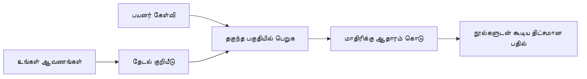

# உங்கள் ஆவணங்களுக்குப் பொருந்தியவாறு கேள்விகளுக்கு பதிலளிக்க AI ஐ பயிற்றுவிக்க:
## தொடர் 1: RAG, Azure மற்றும் திறந்த மூல மாற்றிகள், மற்றும் சிறப்பான-தயாரிப்பின் பொருத்தம் எப்போது

> 2023 Azure AI Search + Azure OpenAI ஆவண QA பயிற்சிகளை மீண்டும் பார்ப்பதாக 2026 தொடரில் முதலாவது கட்டுரை.

தொடர் வழிசெலுத்தல்: [Repository home](../README.md) | அடுத்து: [தொகுதி 2 - உள்ளூர் திறந்த மூல RAG அமைப்பை முடிக்கவும்](./series-2-open-source-rag-end-to-end.md)

## 1. அறிமுகம் - முன்பு RAG பயிற்சியை மீண்டும் பார்வையிடுதல்

2023 இல், நான் Azure AI Search மற்றும் Azure OpenAI பயன்படுத்தி PDF ஆவணங்களில் கேள்விகளுக்கு பதிலளிக்க ChatGPT ஐ பயிற்றுவிப்பதற்கான இரண்டு பயிற்சிகள் üzerinde பணியாற்றினேன். நான் [LangChain பதிப்பு](https://techcommunity.microsoft.com/blog/educatordeveloperblog/teach-chatgpt-to-answer-questions-using-azure-ai-search--azure-openai-lang-chain/3969713) எழுதினேன், மேலும் Microsoft இல் முதன்மை கிளௌட் வழிகாட்டியாளர் மேலாளர் [Lee Stott](https://developer.microsoft.com/en-us/advocates/lee-stott) உடன் இணைந்து [Semantic Kernel பதிப்பு](https://techcommunity.microsoft.com/blog/educatordeveloperblog/teach-chatgpt-to-answer-questions-using-azure-ai-search--azure-openai-semantic-k/3985395) எழுதினோம். அந்த காலத்தில், "உங்கள் தரவின் மீது ChatGPT" என்ற கருத்து பல உருவாக்குநர்களுக்கு புதியதாக இருந்தது. அந்த பயிற்சிகள் Azure Blob Storage, Azure AI Search, Azure OpenAI, LangChain, Semantic Kernel மற்றும் FAISS-பாணி வெக்டர் மீட்பு பயன்படுத்தி PDF கோப்புகளிலிருந்து கேள்விகளுக்கு பதிலளித்தன.

அந்த முந்தைய கட்டுரையின் கவனம் ஒரு எளிய மற்றும் முக்கியமான பணியினை எடுத்துக்கொண்டது: ஆவணங்களை பதிவேற்றுவது, அவற்றை குறியீட்டிடுதல், தொடர்புடைய உள்ளடக்கத்தை மீட்டெடுதல் மற்றும் அதற்கேற்ப ஒரு மாதிரியை கேள்விக்கு பதிலளிக்கக் கேட்குதல்.

2026 இல், RAG சூழல் பெரிதாக வளர்ந்துவிட்டது. Azure AI Search இப்பொழுது நவீன வெக்டர் மற்றும் கலப்பு மீட்பு மாதிரிகளை ஆதரிக்கிறது, Azure OpenAI மைக்ரோசோஃப்ட் Foundry Models சூழலின் பகுதியாக உள்ளது, மற்றும் புதிய v1 API மாதிரியான ஒரு மாதிரியை மாதாந்திர `api-version` மாற்றங்கள் இல்லாமல் சாதாரண OpenAI கிளையண்ட் பயன்படுத்த முடியும். அதே சமயத்தில், LangGraph, LlamaIndex, Haystack, Qdrant, Milvus, Weaviate, Chroma, Ollama, மற்றும் vLLM போன்ற திறந்த மூல விருப்பங்கள் உண்மையான RAG அமைப்புகளுக்கு நடைமுறை தேர்வுகள் ஆனுள்ளன.

இதனால் இந்த தலைப்பை மீண்டும் பார்வையிட விரும்பினேன். கேள்வி தற்போது "எப்படி RAG கட்ட வேண்டும்?" என்று இல்லை. தற்போதுள்ள பல வழிகள் உள்ளன, முக்கியமான கேள்வி "எந்த கட்டமைப்பை எனது சூழலுக்கு தேர்ந்தெடுக்க வேண்டும்?" என்பது ஆகிவிட்டது.

ஆனால் மையப் பிரச்சனை மாற்றம் எதுவும் இல்லை.

ஏ.ஐ மாதிரி உங்கள் ஆவணங்களை தானாக அறியவில்லை. பயனுள்ள ஆவண-கேள்வி-பதிலளிப்பு அமைப்பை கட்ட-build செய்ய, நீங்கள் இன்னும் நம்பகமான மீட்பு, அடிப்படையிடல், மதிப்பீடு மற்றும் செயல்பாட்டு பணிகளை தேவைப்படுத்துகின்றீர்கள்.

இந்த கட்டுரை மற்றொரு முழுமையான "PDF உடன் உரையாடல்" பயிற்சி அல்ல. இப்போது எனக்கு அதிகமாக கவலை கொடுக்கின்ற கேள்வியுடன் இந்த புதுப்பிக்கப்பட்ட தொடரைத் தொடங்க விரும்புகிறேன்: நீங்கள் எப்போது நிர்வகிக்கபடும் Azure கட்டமைப்பைத் தேர்ந்தெடுக்க வேண்டும், எப்போது திறந்த மூல RAG தொகுப்பைத் தேர்ந்தெடுக்க வேண்டும், மற்றும் எப்போது சிறப்புக் கற்றல் உண்மையில் பொருத்தமாக இருக்கும்?

இது ஆவண அடிப்படையிலான AI அமைப்புகள் கட்டோற்கான தொடர் எழுத்தின் முதலாவது கட்டுரை. இந்த முதல் பகுதியாக, நாம் கட்டமைப்பு முடிவுகளை கவனிக்கப் போகிறோம்: ஏன் RAG அவசியம், Azure அடிப்படையிலான நிர்வாக சேவைகள் எப்போது பயனுள்ளன, திறந்த மூல மாற்றிகள் எப்போது பொருத்தமானவை, மற்றும் சிறப்புக் கற்றல் எங்கு பொருந்துகிறது.

ஆவண QA அமைப்புகளை கட்டியதும் மீண்டும் பார்ப்பதும் மூலம், நான் எப்போதும் எந்த சாதனம் டெமோவில் சிறப்பாக தெரிகிறது என்றதில் அக்கறை குறைந்து, உண்மையான பயனாளிகள், மாற்றப்படும் ஆவணங்கள், அனுமதிகள், தோல்விகள் மற்றும் பராமரிப்பு ஆகியவற்றில் எந்த கட்டமைப்பு உயிர்த்தெழுகிறது என்பதைப் பற்றி அதிக கவனமாக ஆவேன்.

## 2. உங்கள் AIக்கு ஒரு தேடல் அமைப்பு ஏன் தேவை

பெரிய மொழி மாதிரிகள் பெரும் பொதுமக்கள் மற்றும் உரிமம் பெற்ற தரவுகளில் பயிற் செய்து வருகின்றன. அவை பொது ವಿಷಯங்களில் நிறைய தெரிந்திருக்கலாம், ஆனால் அவை தானாக உங்கள் தனிப்பட்ட PDFகள், உட்பட கொள்கைகள், நிறுவன நடைமுறைகள், ஆராய்ச்சி ஆவணங்கள், வகுப்பு பொருட்கள், வாடிக்கையாளர் ஆதரவு குறிப்புகள் அல்லது சமீபத்தில் புதுப்பிக்கப்பட்ட ஆவணங்களை அறியவில்லை.

RAG பற்றி எளிமையாக யோசிக்கும் வழி இதுதான்: மாதிரியை ஒவ்வொரு ஆவணத்தையும் நினைவில் வைக்க எதிர்பார்ப்பதைவிட, நாம் அதற்கு தேடல் அமைப்பை கொடுக்கிறோம். பயனர் கேள்வி கேட்டால், அந்த அமைப்பு முதலில் மிகவும் தொடர்புடைய தகவல் துண்டுகளை கண்டுபிடித்து, பின்னர் அந்த துண்டுகளை மாதிரிக்கு சூத்திரமாக வழங்குகிறது.

இது முக்கியம், ஏனெனில் பல உண்மை உலகம் அறிவு மூலங்கள் தனிப்பட்டவை, தொடர்ந்து மாறிக்கொண்டு இருக்கும், அனுமதி-சென்சிட்டிவ், பல அமைப்புகளில் சேமிக்கப்பட்டவை, பல வடிவங்களில் எழுதப்பட்டவை மற்றும் நேரடியாக ஒரு அணியில் வைத்துச் சொல்ல முடியாதவையாக இருக்கும்.

உதாரணமாக, ஒரு பள்ளி, நிறுவனம் அல்லது ஆராய்ச்சி குழுவின் 10,000 உட்புற ஆவணங்கள் இருந்தால், அந்த ஆவணங்களில் இருந்து மாதிரி நம்பகமாக பதிலளிக்க முடியாது, unless அமைப்பு சரியான துண்டுகளை சரியான நேரத்தில் மீட்டெடுக்க முடியும்.

இது இயல்பாக ஒரு பொதுவான கேள்விக்கு வழிவகுக்கிறது:

ஏன் மாதிரியை சிறப்பாகக் கற்றுக்கொள்ள வேண்டாம்?

சிறப்புக் கற்றல் பயனுள்ளதாக இருக்கக்கூடும், ஆனால் இது இணக்கமான ஆவண அறிவுக்கு முதலாவது சரியான கருவி அல்ல. அறிவு அடிக்கடி மாறினால், மேற்கோள்கள் முக்கியமாக இருந்தால் அல்லது அணுகல் அனுமதிகள் முக்கியமாயிருந்தால், RAG பொதுவாக சிறந்த தொடக்க இடமாக இருக்கும். சிறப்புக் கற்றல் நடத்தை, பாணி, வெளியீடு வடிவம் மற்றும் பணி மாதிரிகளை கற்பிப்பதற்கு எளிதாக பொருத்தமாக இருக்கும்.

## 3. நடைமுறையில் RAG கட்டமைப்பு

நீங்கள் ஒரு பள்ளிக்கான AI உதவியாளரை கட்ட-build செய்யும் என்று கற்பனை செய்யுங்கள். அந்த உதவியாளர் கொள்கை PDFகள், பாடநெறி வழிகாட்டிகள், உள்ளக FAQ பக்கங்கள் மற்றும் சமீபத்தில் புதுப்பிக்கப்பட்ட அறிவிப்புகளில் இருந்து கேள்விகளுக்கு பதிலளிக்க வேண்டும்.

ஒரு மாணவர் "என் இறுதி கணக்கெடுப்புக்காக உருவாக்கும் AI பயன்படுத்தலாமா?" என்று கேட்கும் போது, அமைப்பு மாதிரியின் பொதுவான நினைவிலிருந்து பதிலளிக்கக்கூடாது. முதலில் தொடர்புடைய பள்ளிக் கொள்கையை கண்டுபிடித்து, AI பயன்பாடு குறித்த பகுதியை மீட்டெடுத்து, பின்னர் அந்த சான்றுகளை பயன்படுத்தி மாதிரிக்கு கேள்வி கேட்க வேண்டும்.

இது தான் நடைமுறையில் RAG.

உயர் மட்டத்தில், நீங்கள் இந்த பகுதியைப் பற்றி யோசிக்கலாம்:

விவரங்கள் மிகவும் சிக்கலானதாக இருக்கலாம், ஆனால் அடிப்படை யோசனை எளிது: மாதிரி தனக்கே பதிலளிக்காது. அது மீட்டெடுக்கப்பட்ட சான்றுகளுடன் பதிலளிக்கும்.

முதலில், ஆவணங்கள் Azure Blob Storage, SharePoint, GitHub அல்லது உள்ளக CMS போன்ற சேமிப்பு அமைப்பிலிருந்து ஏற்றப்படும். பிறகு அவற்றை தலைப்புகள், பக்கம் எண்கள், அட்டவணைகள், பிரிவுகள் மற்றும் மூல இடங்கள் போன்ற பயனுள்ள கட்டமைப்புகளைத் தக்கவைத்து உரையாகப் பிரிக்கப்படும்.

அடுத்து, உள்ளடக்கம் துண்டுகளாக்கப்படும். இந்த படி எளிதாகத் தோன்றலாம், ஆனால் இது மிகவும் முக்கிய பாகம். துண்டு மிகக் குறுகியதாக இருந்தால், சுற்றியுள்ள சூழலை இழக்கலாம். மிகவும் பெரிய துண்டாக இருந்தால், தொடர்பில்லாத தகவல்களை உள்ளடக்கி மீட்பை குறைவாகச் செய்யலாம்.

துண்டுகளை பிரித்த பிறகு, அமைப்பு வலைப்பின்னல் உருவாக்கி, அவற்றை தேடக்கூடிய குறியீட்டில், அசல் உரை மற்றும் கோப்பு பெயர், பக்கம் எண், அனுமதி, ஆவண பதிப்பு மற்றும் மூல URL போன்ற மெட்டாடேட்டாவுடன் சேர்த்து வைக்கிறது.

பயனர் கேள்வி கேட்டால், கிளவி தேடல், வெக்டர் தேடல் அல்லது கலப்பு தேடலைப் பயன்படுத்தி வேட்பாளரான துண்டுகளை மீட்டெடுக்கிறது. பின்வரிசையாக்கி அவற்றை மீண்டும் ஒழுங்குபடுத்தி மிகவும் பயனுள்ள சான்றுகள் மீது வைக்க முடியும்.

இறுதியில், மாதிரி கேள்வியும் மீட்டெடுக்கப்பட்ட சான்றுகளையும் பெறுகிறது. பதில் அந்த சான்றுகளில் அடிப்படையிலானதாக இருக்க வேண்டும் மற்றும் மேற்கோள்களைத் திரும்ப வழங்க வேண்டும், பயனர் மூலத்தை பரிசோதிக்க முடியும்.

முக்கியமான புள்ளி: RAG என்பது "PDFகளை வெக்டர் தரவுத்தளத்தில் வைக்க" என்பது மட்டுமல்ல. பதிலின் தரம் முழு பணியதிகாரத்தைப் பொருந்தும்: பகுப்பாய்வு, துண்டாக்கல், மீட்பு, மீண்டும் வரிசைப்படுத்தல், தூண்டுதல், மேற்கோள் மற்றும் மதிப்பீடு.

ஆதலால் ஆவணத்திட்டம் முக்கியம். PDFல், தலைப்பு, அட்டவணை, காலடி குறிப்புகள் அல்லது பக்கம் எல்லை ஒரு பகுதியில் பொருளை மாற்றலாம். Azureஇல், Document Layout திறன்கள் Azure Document Intelligence அமைப்பைப் பயன்படுத்தி கட்டமைப்புணர்ச்சியுள்ள வெளியீட்டை உருவாக்குவதால், இது RAG அமைப்புகளுக்கு துண்டாக்கல் மற்றும் மீட்பு தரத்தை மேம்படுத்த உதவும்.

## 4. 2023 இற்குப் பிறகு என்ன மாறியுள்ளது?

2023 பயிற்சி காலத்திற்கு சிறந்த தொடக்கம்:

- Azure Blob Storage PDF கோப்புகளை சேமித்தது.
- Azure AI Search உள்ளடக்கத்தை குறியீட்டிட்டது.
- LangChain மீட்பை Azure OpenAIக்குக் இணைத்தது.
- FAISS எளிய உள்ளக வெக்டர் சேமிப்பகமாக வேலை செய்தது.
- உதாரணம் `gpt-35-turbo` மற்றும் `text-embedding-ada-002` பயன்படுத்தியது.

2026 இல், நவீன பதிப்பு பல மாற்றங்களை பிரதிபலிக்க வேண்டும்.

முதலில், மீட்பு மேம்பட்டுள்ளது. 2023ல் பல டெமோக்கள் எளிய வெக்டர் ஒற்றுமை தேடலைப் பயன்படுத்தியது. இப்போது கலப்பு தேடல் உண்மையான ஆவண QAக்கான இயல்பான தொடக்கம். Azure AI Search ஒற்றை கோரிக்கையில் கிளவி மற்றும் வெக்டர் வினாக்களை ஒருங்கிணைத்து கலப்பு தேடலை ஆதரிக்கிறது மற்றும் Reciprocal Rank Fusion மூலம் முடிவுகளை இணைக்கிறது. Semantic ranker முழு உரை, வெக்டர் மற்றும் கலப்பு முடிவுகளின் உரை பக்கத்தை மீண்டும் வரிசைப்படுத்த முடியும்.

இரண்டாவது, ஏற்றுதல் அதிகமாக திறமையானது. ஒவ்வொரு ஆவணத்தையும் செயலியில் பிரிக்கும் பதிலாக, Azure AI Search துண்டாக்கல், வெக்டர் உருவாக்கல் மற்றும் வினா நேர வெக்டர் உருவாக்கம் ஒருங்கிணைந்தது. PDF மற்றும் ஆவணம் அதிகமான பணி சார்ந்த வேலைகளுக்கு, Document Layout திறன் கட்டமைப்புக்களை நிலையாகக் காப்பாற்றி சிறந்த துண்டாக்கல் மற்றும் மீட்புத் தரத்தை வழங்க முடியும்.

மூன்றாவது, ஒழுங்குப்படுத்தல் மிகவும் முக்கியம். கடினமானது பெரும்பாலும் LLM API அழைப்பு அல்ல. கடினமானது தோல்விகளை கையாள்தல், மீண்டும் முயற்சிகள், பழைய மீட்பு, துண்டு தரம், நீண்டகால பணிகள், மனித ஆய்வு மற்றும் அளவுகோலின் மதிப்பீடு ஆகியவை ஆகும். இங்கு LangGraph, LlamaIndex பணிச்சூடுகள், Haystack குழாய்கள், மற்றும் தள அளவிலான மதிப்பீடு மற்றும் கண்காணிப்பு கருவிகள் ஒரே தொடர் செங்கையில் இருந்ததைவிட அதிக பொருத்தமாகின்றன.

நான்காவது, மதிப்பீடு கூடுதல் விருப்பமாக இல்லை. ஒரு டெமோ ஒரு கேள்வியுடன் பிரமியானதாக தெரியும். உற்பத்தி அமைப்பு சோதனை தொகுப்புகள், மீண்டும் சோதனை சரிபார்ப்புகள், மீட்பு அளவைகள், அடிப்படையிடல் சோதனைகள் மற்றும் கண்காணிப்பு தேவையாகிறது. மதிப்பீடு இல்லாமல், அமைப்பு மேம்படுகிறதா அல்லது மொத்தமும் மாறுகிறதா என்பதை அறிந்து கொள்வது கடினம்.

## 5. Azure மற்றும் திறந்த மூல RAG தொகுப்புகள் இடையேயான தேர்வு

நான் பயனுள்ள கேள்வி "Azure திறந்த மூலத்துடன் உத்தமமா?" அல்லது "திறந்த மூல Azure துணைலா?" என்று நினைக்கவில்லை.

பயனுள்ள கேள்வி: நீங்கள் எந்த வகை அமைப்பை கட்ட-build செய்கிறீர்கள், யார் அதை இயக்குவார், என்ன கட்டுப்பாடுகள் உண்டு, மற்றும் எந்த தோல்வி முறைகள் ஏற்றுக்கொள்ள முடியாது?

ஆவண QA உதாரணங்களை கட்ட-build செய்யத் தொடங்கியபோது, நான் பெரும்பாலும் மீடு வேலை செய்ததா என்பதைப் பற்றி சிந்தித்தேன். PDFகளை பதிவேற்ற முடியுமா, அவற்றை தேடி பதிலளிக்க முடியுமா? இது சாதாரண தொடக்கம்.

மிகவும் உண்மையான ஏ.ஐ பணிக்குழுக்களுடன் பணியாற்றியபின்பு, என் மதிப்பீடு மாறியது. ஒரு RAG தொகுப்பை தேர்வு செய்யும் முன் நான் நான்கு விஷயங்களை பார்க்கிறேன்:

- அடையாளம் மற்றும் அனுமதிகள்
- மீட்பு தரம்
- பணிச்சுழற்சி நம்பகத்தன்மை
- செயல்பாட்டு உரிமை

இந்த நான்கு பகுதியும் மாதிரி தர மதிப்பீடுகள் காட்டும் விட அதிக விஷயங்களை தெரிவிக்கின்றன.

Azure அடிப்படையிலான கட்டமைப்புகள் பொதுவாக நிறுவன ஒருங்கிணைப்பு கடினம் ஆகும் போது பொருத்தமாக இருப்பது. ஒரு குழு ஏற்கனவே Microsoft Entra ID, Microsoft 365, Azure Storage, தனிப்பட்ட நெட்வொர்க்கிங், RBAC மற்றும் Azure கண்காணிப்பில் சார்ந்திருக்கும்போது, Azure AI Search மற்றும் Azure OpenAI பொருள் பெரிதும் செயல்பாட்டுக் கடுமையை குறைக்க முடியும். அந்த சூழலில் Azure மாதிரி API மட்டுமல்ல, சுற்றிய அமைப்பான அடையாளம், ஆட்சிமுறை, நிர்வகிக்கப்பட்ட தேடல், பாதுகாப்பு ஒருங்கிணைப்பு, ஆதரவு மற்றும் பரிச்சயமான செயல்பாடுகள் ஆகியவை மதிப்பாக இருக்கும்.

திறந்த மூல கட்டமைப்புகள் தற்போதைய சூழல் கடினமானபோது பொருத்தமாக இருக்கும். குழுவிற்கு உள்ளூர் முடிவு செய்யும் சக்தி, மேக கடத்தல், தனிப்பயன் மீட்பு குழாய், தனிச்சிறப்பு மீண்டும் வரிசைப்படுத்துதல் அல்லது வெக்டர் தரவுத்தளம் மற்றும் மாதிரி சேவை அடுக்கு மீது நேரடி கட்டுப்பாடு தேவையானால் திறந்த மூல தொகுப்பு சிறந்த தேர்வு ஆகும். வர்த்தகமாக, குழு நம்பகத்தன்மை பணியைச் சுமக்கிறது: காப்புப்பிரதி எடுப்பு, அளவுகோல், தாமதம், மைக்ரேஷன், கண்காணிப்பு மற்றும் பாதுகாப்பு.

வாங்குபங்கில, பல தயாரிப்பு ஏ.ஐ அமைப்புகள் முற்றிலும் மேக-உரிமையுள்ளன அல்லது முற்றிலும் திறந்த மூலவல்லாது. அவை பெரும்பாலும் செயல்பாட்டுச் சுலபம், கடத்தல் திறன், ஆட்சிமுறை மற்றும் பொறியியல் தகுதிகளுக்கு இடையேயான வாரிசுகளாக இருக்கும்.

உதாரணமாக, ஒரு அமைப்பு மாதிரி அணுகலுக்கு Azure OpenAI, பணிச்சுழற்சிக்காக LangGraph, பிரசரிக்க Azure ஹோஸ்டிங் மற்றும் தனிப்பட்ட மீட்பு தேவைக்காக திறந்த மூல வெக்டர் தரவுத்தளத்தைப் பயன்படுத்துவதை நான் ஆச்சரியமாக எண்ணமாட்டேன். இது கட்டமைப்புக் கருத்து முரண்பாடு அல்ல. இது ஒவ்வொரு பகுதியில் நிர்வகிக்கப்பட்ட சேவை மற்றும் பொறியியல் கட்டுப்பாடு சரியான மட்டத்தைத் தேர்வு செய்தல்.

நான் நிர்வகிக்கப்பட்ட தளம் முக்கிய நிறுவனப் பிரச்சனைகளை தீர்க்கும் போது, திறந்த மூல கூறுகள் குழுவுக்கு உண்மையான முக்கியத்துவம் உள்ள இடங்களில் சுதந்திரத்தைக் கொடுக்கும் என்ற பார்வையில் அடலாக கட்டமைப்புகளைக் விரும்புகிறேன்.

## 6. ஒரு நடைமுறை முடிவு வழிகாட்டி

RAG தொகுப்பைத் தேர்வு செய்யும் முன் நான் குழுவுடன் பயன்படுத்துவேன் என்ற முடிவு அட்டவணை இங்கே:

| முடிவு பகுதி | Azure நிர்வகிக்கும் தொகுப்பு வலுவாக இருக்கும் போது... | திறந்த மூல தொகுப்பு வலுவாக இருக்கும் போது... |
| --- | --- | --- |
| அடையாளம் மற்றும் அணுகல் | Entra ID, RBAC, நிர்வகிக்கப்பட்ட அடையாளம் மற்றும் நிறுவன அனுமதிகள் மையமாக இருக்கும் | தனிப்பயன் அங்கீகாரம், Microsoft அல்லாத அடையாளம் அல்லது செயலி-சிறப்பு அணுகல் தெய்வீகம் பிரதானம் |
| செயல்பாடுகள் | குழு நிர்வகிக்கப்பட்ட கட்டமைப்பு, ஆதரவு, SLAகள் மற்றும் எளிதான தொடக்கத்தை விரும்பும் | குழு வெக்டர் தரவுத்தளங்கள், மாதிரி சேவை, காப்புப்பிரதிகள் மற்றும் அளவுகோலை இயக்க முடியும் |
| மீட்பு | கலிப்பு தேடல், பொருளளவு தரவரிசை, வடிகட்டிகள் மற்றும் மெட்டாடேட்டா தேடல் பெரும்பாலான தேவைகளை பூர்த்தி செய்யும் | குழு தனிப்பயன் மீட்பு, தனிச்சிறப்பு மீண்டும் வரிசைப்படுத்தல் அல்லது பரிசோதனை குறியீடு தேவையாகும் |
| கடத்தல் திறன் | Azure சூழல் ஒத்துழைப்பு ஏற்றுக்கொள்ளப்படக்கூடியது அல்லது விரும்பத்தக்கது | மேக அடக்குப்பாட்டைத் தவிர்ப்பது கடினமான தேவை |
| முடிவு | Azure OpenAI ஆட்சிமுறை, நெட்வொர்க்கிங் மற்றும் நிறுவன கட்டுப்பாடுகள் முக்கியம் | உள்ளூர் முடிவு, தனிப்பயன் மாதிரிகள் அல்லது தானாக சேவை வழங்கல் தேவையானவை |
| செலவு | பொறியியல் மற்றும் செயல்பாட்டு முயற்சிகளை குறைப்பது கட்டமைப்பு திருத்தங்களைவிட முக்கியம் | அளவு முழுவதும் கவனமான கட்டமைப்பு மேம்பாட்டிற்கு அர்ப்பணிக்கக் கூடும் |
| பரிசோதனை | நிலைத்தன்மை மற்றும் நிறுவன ஒருங்கிணைப்பு அதிகம் முக்கியம், கூறுகளை அடிக்கடி மாற்ற வேண்டியதல்ல | குழு ஏஜென்கள், கருவிகள், நினைவகம் மற்றும் மீட்பு பணிகள் மீது விரைவாக பகுப்பாய்வு செய்கிறது |

என் ஒற்றுமையான விதி எளிமையானது:

- நிறுவன ஒருங்கிணைப்பு, பாதுகாப்பு மற்றும் செயல்பாட்டு சுலபத்தன்மை முக்கிய ஆபத்துகள் என்றால் Azureயோடு தொடங்கவும்.
- கடத்தல் திறன், தனிப்பயன் அமைப்பு அல்லது உள்ளூர் கட்டுப்பாடு முக்கிய ஆபத்துகள் என்றால் திறந்த மூலத்தோடு தொடங்கவும்.
- இரண்டுமே உண்மையானால் கலப்பு தொகுப்பை பயன்படுத்தவும்.

இந்த காரணத்தாலும் நான் 2026 RAG தொடரினை முதலில் குறியீடு கொண்டு தொடங்க மாட்டேன். குறியீடு முக்கியம், ஆனாலும் கட்டமைப்பு தேர்வு செயலாக்கத்திற்கு முன். எளிய டெமோ கடினமான தேர்வுகளை மறைக்கலாம். ஒரு நல்ல RAG அமைப்பு அந்த தேர்வுகளை தெளிவுபடுத்தும்.

## 7. சிறப்புக் கற்றல் எங்கு பொருந்துகிறது

சிறப்புக் கற்றல் பெரும்பாலும் RAG உடன் சேர்த்து குறிப்பிடப்படுகிறது, ஆனால் அவற்றை பிரித்து பார்க்க வேண்டும் என்று நான் கருதுகிறேன்.

சிஸ்டம் புதிய, தனிப்பட்ட, அனுமதி-சென்சிட்டிவ் அல்லது மூல அடிப்படையிலான அறிவும் தேவைப்படும்போது RAG பொதுவாக சிறந்த தேர்வாக இருக்கும். பதில் ஆவணங்களை மேற்கோள் காட்ட வேண்டும், சமீபத்திய புதுப்பிப்புகளை பிரதிபலிக்க வேண்டும், அல்லது பயனர்-சிறப்பு அணுகல் விதிகளை மதிக்க வேண்டும் என்றால், மீட்பு கட்டமைப்பின் பகுதியாக இருக்க வேண்டும்.
நூர்-திறவுத்திறன் அத்தியாயம் அறிவு முக்கியப் பிரச்சனை இல்லாதபோது மிகவும் பயனுள்ளதாக இருக்கும். இது நீங்கள் விரும்பும் படி ஒரு குறிப்பிட்ட வெளியீட்டு வடிவத்தை பின்பற்ற மாடலை உதவக்கூடும், ஒரு துறைக்கு ஏற்ற பதிலளிப்பு பாணியை பொருந்தக்கூடும், நிலைத்திருந்த பணியை தொடர்ச்சியாக செய்யக்கூடும் அல்லது ஒவ்வொரு கேள்வியிலும் தேவையான உத்தரவிடுவதின் அளவை குறைக்க உதவும்.

செயல்பாட்டில், இரண்டும் ஒன்றாக வேலை செய்யலாம். உதவி உதவியாளர் சமீபத்திய கொள்கையை பெற்றுக்கொள்ள RAG ஐ பயன்படுத்தலாம், அதே சமயம் நூர்-திறவுத்திறன் பெற்ற மாடல் நிறுவனத்தின் விருப்ப பதில் அமைப்பையும் சுரப்புரையும் கற்கலாம்.

தவறு என்பது நூர்-திறவுத்திறனை ஆவணம் சேமிப்பகத்துக்குப் பதிலாக பார்க்கும் பொது ஆகும். புதிய, தனியார் அல்லது அனுமதி-சென்சிட்டிவான தரவுகளிலிருந்து பதில் அளிக்கும்போது திரும்ப பெறுதல் தேவையை இது நீக்காது.

## 8. இந்த தொடர் அடுத்தது எங்கே செல்கிறதென்பது

இந்த கட்டுரை முடிவெடுத்தல் அடுக்காகும். கோடை எழுதுவதற்கு முன்பு, நான் மாற்றுக் கட்டணங்களை தெளிவுபடுத்த விரும்பினேன்: RAG எதிர் நூர்-திறவுத்திறன், Azure எதிர் திறந்த மூல, நிர்வகிக்கப்படும் சேவைகள் எதிர் இயக்கவியல் கட்டுப்பாடு.

நடைமுறை நடைமுறைக்கு செல்லும்முன், நான் இங்கே ஒரு புள்ளியை வைக்க விரும்புகிறேன்: பல நிறுவன AI முறைகளில், மாடல் என்பது ஒரு கூறு மட்டுமே. திரும்ப பெறுதல் தரம், ஒர்செஸ்ட்ரேஷன், மதிப்பீடு, அனுமதிகள் மற்றும் இயக்கநம்பகத்தன்மை ஆகியவை பெரும்பாலும் கண்காட்சிச் கட்டுக்குள் வெற்றி பெறும் நிலையில் அமைவதை தீர்மானிக்கும்.

இந்த தொடரின் அடுத்த பகுதிகளில், ஆவணம் சார்ந்த AI முறைகளின் நடைமுறை பக்கத்தில் நான் ஆழமாக இறங்க திட்டமிட்டுள்ளேன்: முதலில் உள்ளூர் திறந்த மூல RAG பணிச் சுற்றத்தை உருவாக்கி, அப்போது அதே சூழலை Azure AI Search மற்றும் Azure OpenAI உடன் மீண்டும் கட்டியமைத்து, பின்னர் முறையானாக இயங்குகிறதா என்று மதிப்பீடு செய்வேன்.

தொடர் வளர்ச்சியுடன் ஏற்படக்கூடிய திட்டத்தை விகிதாசாரம் செய்யலாம், ஆனால் நோக்கம் ஒரே நிலை மக்கள்:  எளிய கண்காட்சியைக் கடந்து, பராமரிக்கக்கூடிய, மதிப்பீடு செய்யக்கூடிய மற்றும் இயக்கக்கூடிய RAG முறைகள் பற்றி எப்படி சிந்திப்பது என்பதை காண்பிப்பது.

## 9. குறிப்புகள் மற்றும் வளங்கள்

மேற்கோள் தொடக்கநூல்கள்:

- [Teach ChatGPT to Answer Questions: Using Azure AI Search & Azure OpenAI (Lang Chain)](https://techcommunity.microsoft.com/blog/educatordeveloperblog/teach-chatgpt-to-answer-questions-using-azure-ai-search--azure-openai-lang-chain/3969713)
- [Teach ChatGPT to Answer Questions: Using Azure AI Search & Azure OpenAI (Semantic Kernel)](https://techcommunity.microsoft.com/blog/educatordeveloperblog/teach-chatgpt-to-answer-questions-using-azure-ai-search--azure-openai-semantic-k/3985395)

Azure:

- [Azure AI Search REST API versions](https://learn.microsoft.com/en-us/rest/api/searchservice/search-service-api-versions)
- [Hybrid search in Azure AI Search](https://learn.microsoft.com/en-us/azure/search/hybrid-search-how-to-query)
- [Integrated vectorization in Azure AI Search](https://learn.microsoft.com/en-us/azure/search/vector-search-integrated-vectorization)
- [Document Layout skill in Azure AI Search](https://learn.microsoft.com/en-us/azure/search/cognitive-search-skill-document-intelligence-layout)
- [Chunk and vectorize by document layout](https://learn.microsoft.com/en-us/azure/search/search-how-to-semantic-chunking)
- [Semantic ranking in Azure AI Search](https://learn.microsoft.com/en-us/azure/search/semantic-search-overview)
- [Azure OpenAI / Microsoft Foundry API version lifecycle](https://learn.microsoft.com/en-us/azure/foundry/openai/api-version-lifecycle)
- [Foundry Models sold by Azure](https://learn.microsoft.com/en-us/azure/foundry/foundry-models/concepts/models-sold-directly-by-azure)
- [Microsoft Foundry fine-tuning considerations](https://learn.microsoft.com/en-us/azure/foundry/openai/concepts/fine-tuning-considerations)
- [Microsoft Foundry observability](https://learn.microsoft.com/en-us/azure/foundry/concepts/observability)
- [Run evaluations in Microsoft Foundry](https://learn.microsoft.com/en-us/azure/foundry/how-to/evaluate-generative-ai-app)

திறந்த மூலங்கள்:

- [LangGraph documentation](https://docs.langchain.com/oss/python/langgraph/overview)
- [LlamaIndex documentation](https://developers.llamaindex.ai/python/framework/)
- [Haystack documentation](https://docs.haystack.deepset.ai/)
- [Qdrant documentation](https://qdrant.tech/documentation/overview/)
- [Milvus documentation](https://milvus.io/docs/overview.md)
- [Weaviate documentation](https://docs.weaviate.io/weaviate/current/)
- [Chroma documentation](https://docs.trychroma.com/docs/overview/introduction)
- [Ollama embeddings](https://docs.ollama.com/capabilities/embeddings)
- [vLLM OpenAI-compatible server](https://docs.vllm.ai/en/latest/serving/openai_compatible_server.html)
- [BGE embedding models](https://huggingface.co/BAAI/bge-large-en-v1.5)
- [E5 embedding models](https://huggingface.co/intfloat/e5-large-v2)
- [Instructor embedding models](https://huggingface.co/hkunlp/instructor-large)

அடுத்தது: [Series 2 - Build a Local Open-Source RAG System End to End](./series-2-open-source-rag-end-to-end.md)

---

<!-- CO-OP TRANSLATOR DISCLAIMER START -->
**மறுப்பு**:
இந்த ஆவணம் AI மொழிபெயர்ப்பு சேவை [Co-op Translator](https://github.com/Azure/co-op-translator) பயன்படுத்தி மொழிபெயர்க்கப்பட்டுள்ளது. நாங்கள் துல்லியத்திற்காக முயற்சி செய்துள்ளோம், ஆனால் தானாக செய்யப்படும் மொழிபெயர்ப்புகளில் பிழைகள் அல்லது தவறுகள் இருக்கலாம் என்பதை கவனத்தில் கொள்ளவும். அசல் ஆவணம் அதன் தாய்மொழியில் அதிகாரப்பூர்வ ஆதாரமாக கருதப்பட வேண்டும். முக்கியமான தகவல்களுக்கு, தொழில்நுட்பமான மனித மொழிபெயர்ப்பு பரிந்துரைக்கப்படுகிறது. இந்த மொழிபெயர்ப்பைப் பயன்படுத்துவதால் ஏற்படும் எந்த தவறான புரிதல்கள் அல்லது தவறான விளக்கத்திற்கும் நாங்கள் பொறுப்பில்வில்லை.
<!-- CO-OP TRANSLATOR DISCLAIMER END -->