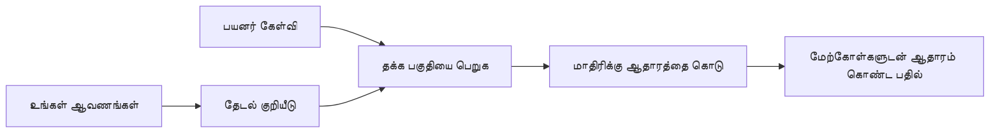

# உங்கள் ஆவணங்களை அடிப்படையாகக் கொண்டு கேள்விகளுக்கு பதில் அளிப்பதற்கான AI ஐ பயிற்றுவிக்கவும்:
## தொடர் 1: RAG, Azure vs Open-Source மாற்றுகள், மற்றும் சிறந்த ஃபைன்-ட்யூனிங் எப்போது பொருந்தும்

> 2026 இல் வெளியிடப்படும் தொடர், என் 2023 Azure AI Search + Azure OpenAI ஆவண கேள்வி-பதில் பயிற்சிகளை மறுபரிசீலிக்கும் முதல் கட்டுரை.

## 1. அறிமுகம் -முன்னொரு RAG பயிற்சியை மறுபரிசீலித்தல்

2023 இல், நான் Azure AI Search மற்றும் Azure OpenAI பயன்படுத்தி PDF ஆவணங்களில் இருந்து கேள்விகளுக்கு பதில் அளிப்பதற்காக ChatGPT ஐ கற்பிப்பதற்கான இரண்டு பயிற்சிகளை உருவாக்கினேன். நான் [LangChain பதிப்பை](https://techcommunity.microsoft.com/blog/educatordeveloperblog/teach-chatgpt-to-answer-questions-using-azure-ai-search--azure-openai-lang-chain/3969713) எழுதியுள்ளேன், மேலும் நான் Microsoft இல் முதன்மை மேக ஆதரவு மேலாளர் லீ ஸ்டாட் உடன் கூடிய [Semantic Kernel பதிப்பையும்](https://techcommunity.microsoft.com/blog/educatordeveloperblog/teach-chatgpt-to-answer-questions-using-azure-ai-search--azure-openai-semantic-k/3985395) இணைத்து எழுதியுள்ளேன். அந்த நேரத்தில், "உங்கள் தரவுகளை அடிப்படையாகக் கொண்ட ChatGPT" என்பது பல டெவலப்பர்களுக்கு புதியதாக இருந்தது. இந்த பயிற்சிகள் Azure Blob Storage, Azure AI Search, Azure OpenAI, LangChain, Semantic Kernel மற்றும் FAISS-மாதிரி வெக்டர் மீட்பை பயன்படுத்தி PDF கோப்புகளிலிருந்து கேள்விகளுக்கு பதிலளித்தன.

முன் கட்டுரை ஒரு எளிய ஆனால் முக்கிய செயல்முறையை கவனித்தது: ஆவணங்களை பதிவேற்று, அவற்றை கண்டறிந்து, தொடர்புடைய உள்ளடக்கங்களை மீட்டெடுத்து, அந்த உள்ளடக்கத்தை அடிப்படையாகக் கொண்டு ஒரு மாதிரியிடம் கேள்விகளை கேட்டல்.

2026 இல் RAG சூழல் பெரிதும் வளர்ந்துள்ளது. Azure AI Search இப்போது நவீன வெக்டர் மற்றும் ஹைப்ரிட் மீட்பு முறைகளை ஆதரிக்கிறது, Azure OpenAI பெரிய Microsoft Foundry Models சூழல் பகுதியை சேர்ந்தது, மற்றும் புதிய v1 API மாதாந்திர `api-version` மாற்றங்களைத் தேவையின்றி OpenAI சாதாரண கிளையண்டை பயன்படுத்த முடியும். அதே நேரத்தில், LangGraph, LlamaIndex, Haystack, Qdrant, Milvus, Weaviate, Chroma, Ollama மற்றும் vLLM போன்ற திறந்த மூல விருப்பங்கள் உண்மையான RAG அமைப்புகளுக்கு நடைமுறை தேர்வாக மாறியுள்ளன.

எனவே இந்த தலைப்பை மீண்டும் பார்க்க விரும்பினேன். கேள்வி இனி "நான் RAG ஐ எப்படி கட்ட வேண்டும்?" என்பது மட்டுமல்ல. உருவாக்குவதற்கு பல குரிய வழிகள் உள்ளன, மேலும் முக்கியமான கேள்வி "எனது சூழலுக்கான கட்டமைப்பை எது தேர்வு செய்ய வேண்டும்?" ஆகிவிட்டது.

ஆனால் முக்கிய பிரச்சனை மாறவில்லை.

ஒரு AI மாதிரி உங்கள் ஆவணங்களை தானாக அறிவதில்லை. பயனுள்ள ஆவண-கேள்வி-பதில் அமைப்பை உருவாக்கும் போது, நீங்கள் இன்னும் நம்பகமான மீட்பு, தரவுத்தளம், மதிப்பீடு மற்றும் செயல்பாட்டு செயல்முறைகளை தேவைப்படுத்துகிறீர்கள்.

இந்தக் கட்டுரை மற்றொரு முழுமையான "PDF உடன் உரையாடல்" பயிற்சி அல்ல. இந்த புதிய தொடரை நான் இப்போது எனக்கு அதிகமாக முக்கியமான கேள்வியுடன் தொடங்க விரும்புகிறேன்: நீங்கள் எப்போது நிர்வகிக்கபபட்ட Azure கட்டமைப்பை தேர்வு செய்ய வேண்டும், எப்போது திறந்த மூல RAG ஸ்டாக்கை தேர்வு செய்ய வேண்டும், மேலும் எப்போது சிறந்த ஃபைன்-ட்யூனிங் உண்மையில் பொருந்தும்?

இது ஆவண அடிப்படையிலான AI அமைப்புகளை கட்டுவதற்கான தொடர் கட்டுரையின் முதல் பகுதி. முதல் பாகத்தில், நாம் கட்டமைப்பு முடிவுகளுக்கு கவனம் செலுத்துவோம்: ஏன் RAG அவசியம், Azure சார்ந்த நிர்வகிக்கப்பட்ட சேவைகள் எப்போது பயனுள்ளதாக இருக்கும், திறந்த மூல மாற்றுகள் எப்போது பொருந்தும், மற்றும் ஃபைன்-ட்யூனிங் எங்கே பொருந்துகிறது என்பதைப் பற்றி.

ஆவண QA அமைப்புகளை உருவாக்கி மீண்டும் பார்க்கும் போது, எந்த கருவி டெமோவில் சிறந்த தோற்றம் தருகிறது என்பதைவிட உண்மையான பயனாளிகள், மாறும் ஆவணங்கள், அனுமதிகள், தோல்விகள் மற்றும் பராமரிப்பு போன்றவற்றைத் தாங்கும் கட்டமைப்பே எனக்கு அதிக ஆர்வமாக இருப்பதாக உணர்ந்துள்ளேன்.

## 2. உங்கள் AIக்கு தேடல் அமைப்பு ஏன் தேவையானது

பெரிய மொழி மாதிரிகள் பொது மற்றும் உரிமையுள்ள தரவு அடிப்படையில் பயிற்றுவிக்கப்படுகின்றன. அவை பொதுவான தலைப்புகளையும் பெரிதும் அறிவதுண்டு, ஆனால் உங்கள் தனிப்பட்ட PDFகள், உள் கொள்கைகள், நிறுவன நடைமுறைகள், ஆராய்ச்சி அலுவலகங்கள், வகுப்பு பொருட்கள், வாடிக்கையாளர் ஆதரவு குறிப்புகள் அல்லது சமீபத்தில் புதுப்பிக்கப்பட்ட ஆவணங்களை தானாகவே அறிவதில்லை.

RAG ஐ எளிய வகையில் புரிந்துகொள்ள இது உதவும்: மாதிரி ஒவ்வொரு ஆவணத்தையும் நினைவில் வைக்குமென்று எதிர்பார்ப்புப் பதிலாக, நமக்கு ஒரு தேடல் அமைப்பு உண்டு. பயனர் கேள்வி கேட்கும் போது, அமைப்பு முதலில் சம்பந்தப்பட்ட தகவல்களைக் கண்டுபிடித்து, பின்னர் அந்தத் துண்டுகளை மாதிரிக்கு சூழலாக வழங்குகிறது.

இது முக்கியம் என்றும் காரணம், பல நிஜ உலக அறிவு ஆதாரங்கள் தனிப்பட்டவை, எப்போதும் மாறுபடும், அனுமதி தொடர்பானதாக இருக்கும், பல்வேறு அமைப்புகளில் சேமிக்கப்பட்டு இருக்கும், பல வடிவங்களில் எழுதப்பட்டிருக்கும் மற்றும் நேரடியாக ஒரு தூண்டுகோளுக்குள் நகலெடுக்க மிகவும் பெரிய அளவிலிருக்கும்.

உதாரணமாக, ஒரு பள்ளி, நிறுவனம் அல்லது ஆராய்ச்சி குழுவிற்கு 10,000 உள் ஆவணங்கள் இருந்தால், மாதிரி அவற்றிலிருந்து நம்பகமாக பதில் அளிக்க முடியாது, ஏனெனில் சரியான பகுதி சரியான நேரத்தில் அமைப்பு மீட்டெடுக்க வேண்டும்.

இது இயற்கையாகவே ஒரு பொதுவான கேள்விக்குச் செல்ல வழிவகுக்கும்:

ஏன் மாதிரியை நேரடியாக ஃபைன்-ட்யூன் செய்யாமல் இருப்பது?

ஃபைன்-ட்யூனிங் பயன்படுதக்கது, ஆனால் பொதுவாக ஆவண அறிவுக்கு முதல் கருவியாக சரியானது அல்ல. அறிவு எப்போதும் மாறும்போது, மேற்கோள்கள் முக்கியமானபோது, அல்லது அணுகல் அனுமதிகள் பரவலாக இருந்தால் RAG ஒரு நிலையான துவக்கக் கட்டமாக இருக்கும். ஃபைன்-ட்யூனிங் செயல்பாடு, பாணி, வெளியீட்டு வடிவம் மற்றும் பணித் திட்டவட்டங்களை கற்பிப்பதில் சிறந்தது.

## 3. நடைமுறையில் RAG கட்டமைப்பு

நீங்கள் ஒரு பள்ளிக்கான AI உதவியாளரை உருவாக்குகிறீர்கள் என்று கற்பனை செய்க. உதவியாளர் கொள்கை PDFகள், பாடக் கையேடுகள், உள்ளடக்கம் FAQ பக்கங்கள் மற்றும் சமீபத்தில் புதுப்பிக்கப்பட்ட அறிவிப்புகளிலிருந்து கேள்விகளுக்கு பதிலளிக்க வேண்டும்.

ஒரு மாணவன் "என் இறுதி பணிக்காக உருவாக்கும் AI ஐப் பயன்படுத்தலாமா?" என்று கேட்டால், அமைப்பு மாதிரி சாதாரண நினைவிலிருந்து பதில் தரக்கூடாது. முதலில் தொடர்புடைய பள்ளி கொள்கையை கண்டுபிடித்து, AI பயன்பாட்டுக்கான பகுதியை மீட்டெடுத்து, பின்னர் அந்த ஆதாரத்தைக் கொண்டாடி மாதிரியைப் பயன்படுத்து பதில் அளிக்க வேண்டும்.

இது RAG நடைமுறையில்.

மேலோட்டமாக, செயல்முறை இவ்வாறு இருக்கும்:

விவரங்கள் இன்னும் மேம்பட்டதாக இருக்கலாம், ஆனால் அடிப்படை கருத்து எளிது: மாதிரி தனியாக பதில் அளிக்காது. மீட்டெடுக்கப்பட்ட ஆதாரத்துடன் பதில் அளிக்கும்.

முதலில், Azure Blob Storage, SharePoint, GitHub அல்லது ஒரு உள் CMS போன்ற சேமிப்பு அமைப்புகளிலிருந்து ஆவணங்கள் பெற்றுக்கொள்ளப்படுகின்றன. பின்னர், அமைப்பு தலைப்புகள், பக்க எண்கள், அட்டவணைகள், பகுதிகள் மற்றும் மூல இடங்களைப் போன்ற பயனுள்ள கட்டமைப்பை பாதுகாத்துக் கொண்டே அவற்றை உரையாக பாகுபடுத்துகிறது.

அடுத்ததாக, உள்ளடக்கம் துண்டுகள் ஆகப் பிரிக்கப்படுகிறது. இந்த படி எளிதாக இருபினாலும், இது அமைப்பின் மிக முக்கியமான பகுதிகளில் ஒன்றாகும். துண்டு மிக சிறியது என்றால் சுற்றியுள்ள சூழல் பொருளை இழக்கலாம். மிகப்பெரியது என்றால் தொடர்பில்லா தகவல்களை உள்ளடக்கி, மீட்பு துல்லியத்தினை குறைக்கலாம்.

துண்டு பிரித்த பிறகு, அமைப்பு உருவான உரை மற்றும் கோப்பு பெயர், பக்க எண், அனுமதிகள், ஆவணம் பதிப்பு, மூல URL ஆகிய மெட்டாடேட்டாவுடன் சேர்த்து தேடும் அடிக்கலிலே சேமிக்க கூடிய ஃபீச்சர்களை உருவாக்குகிறது.

பயனர் கேள்வி கேட்டால், அமைப்பு முக்கிய வார்த்தை தேடல், வெக்டர் தேடல் அல்லது ஹைப்ரிட் தேடலை பயன்படுத்தி விருப்ப துண்டுக்களை மீட்டெடுக்கிறது. மீண்டும் வரிசைப்படுத்துநர் அந்த துண்டுக்களை மறுஆய்வுசெய்து பயனுள்ள ஆதாரங்களை மேலே வைக்க முடியும்.

இறுதியில் மாதிரி கேள்வியும் மீட்டெடுக்கப்பட்ட ஆதாரங்களையும் பெறுகிறது. பதில் அந்த ஆதாரத்தில் அடிப்படையாக்கப்பட்டிருக்கும், மேற்கோள்களுடன் வழங்கப்பட்டிருக்கும், பயனர் மூலத்தை பரிசோதிக்க முடியும்.

முக்கியமானது, RAG என்பது "PDFகளை வெக்டர் தரவுத்தளத்தில் வைக்க வேண்டும்" என்பதற்கே மட்டுமல்ல. பதிலின் தரம் முழு செயல்முறை: உரை பிரித்தல், துண்டுபிரிப்பு, மீட்பு, மறுஆய்வு, தூண்டுதல், மேற்கோள் மற்றும் மதிப்பீடு அனைத்திலும் இருக்கிறது.

ஆவண அமைப்பு என்பதே முக்கியம். PDF இல் தலைப்பு, அட்டவணை, காலடிவைடு அல்லது பக்க எல்லையொன்று ஒரு பகுதிக்கான பொருளைக் மாற்றக்கூடும். Azure இல் Document Layout திறன் Azure Document Intelligence அமைப்பு திறன்களை பயன்படுத்தி கட்டமைப்பு விழிப்புணர்வுடன் வெளிப்பாட்டை வழங்குகிறது, அது RAG அமைப்புகளுக்கு துண்டுபிரிப்பும் மீட்பும் தரத்தை மேம்படுத்தும்.

## 4. 2023 இலிருந்து என்ன மாற்றம்?

2023 பயிற்சி அந்த காலத்திற்கான ஒரு நல்ல துவக்கம்:

- Azure Blob Storage PDFகளை சேமித்தது.
- Azure AI Search உள்ளடக்கத்தை கண்டறிந்தது.
- LangChain மீட்பை Azure OpenAIக்கு இணைத்தது.
- FAISS எளிய உள்ளக வெக்டர் கடையைப் போல செயல்பட்டது.
- எடுத்துக்காட்டில் `gpt-35-turbo` மற்றும் `text-embedding-ada-002` பயன்படுத்தப்பட்டன.

2026 இல், நவீன பதிப்பு பல மாற்றங்களை பிரதிபலிக்க வேண்டும்.

முதலில், மீட்பு மேம்பட்டது. 2023 இல் பல டெமோக்கள் எளிய வெக்டர் ஒத்திசைவு தேடலைப் பயன்படுத்தின. இன்றைய தொழில்முறை ஆவண QAக்கு ஹைப்ரிட் தேடல் பெரும்பாலும் இயல்பான துவக்கம். Azure AI Search ஒரே கோரிக்கையில் முக்கிய வார்த்தை மற்றும் வெக்டர் கேள்விகளை ஒன்றிணைத்து Reciprocal Rank Fusion மூலம் முடிவுகளை சேர்க்க முடியும். பின்னர் Semantic Ranker முழு உரை, வெக்டர் மற்றும் ஹைப்ரிட் முடிவுகளின் உரை பக்கத்தை மறுஆய்வு செய்யும்.

இரண்டாவது, பெறும்திறன் மேம்பட்டது. ஒவ்வொரு ஆவணத்தையும் செயலியில் பிரிக்கும் பதிலாக, Azure AI Search சீரமைக்கப்பட்ட (இன்டிகிரேட்டட்) வெக்டரிசேஷன் மூலம் துண்டுபிரிப்பு, ஃபீச்சர் உருவாக்கும் மற்றும் கேள்வி நேர வெக்டரிசேஷன் ஆதரிக்கிறது. PDFகள் மற்றும் ஆவண பாரமான பணிகளுக்கு Document Layout திறன் நிர்ணய அளவு துண்டுக்களைவிட அதிக கட்டமைப்பைக் காப்பாற்ற முடியும்.

மூன்றாவது, ஒருங்கிணைப்பு அதிக முக்கியம் வாய்ந்தது. கடினமானது பொதுவாக LLM API அழைப்பல்ல. தோல்விகள், மீண்டும் முயற்சிகள், பழைய மீட்பு, துண்டு தரம், நீண்டநாள் சுட்டி, மனித மதிப்பீடு மற்றும் அளவீட்டை நிர்வகிப்பதே கடினம். இதற்காக LangGraph, LlamaIndex வரிசைகள், Haystack குழாய்கள், மற்றும் மேடை மட்ட மதிப்பீடு மற்றும் கண்காணிப்பு கருவிகள் ஒன்று (single linear chain க்குப் பெரிதாக) பொருத்தமானவை.

நான்காவது, மதிப்பீடு இன்றியமையாதது. ஒரே கேள்வியுடன் டெமோ அழகாகத் தோன்றும். உற்பத்தி அமைப்புக்கு சோதனை தொகுதிகள், மறுசீரமைப்பு சோதனைகள், மீட்பு அளவைகள், தரவுத்தள உண்மைத்தன்மை மற்றும் கண்காணிப்பு தேவை. மதிப்பீடு இல்லாமல், அமைப்பு மேம்படுகிறதா அல்லது வெறும் மாற்றமா என்பது அறிய இயலாது.

## 5. Azure மற்றும் திறந்த மூல RAG ஸ்டாக்களுக்கிடையேயான தேர்வு

காரணாதர கலந்திய கேள்வி "Azure திறந்த மூலத்திற்கும் மேல் தானா?" அல்லது "திறந்த மூல் Azureக்கு மேலா?" ஆக இருக்காது என நினைக்கிறேன்.

பயனுள்ள கேள்வி: நீங்கள் எத்தகைய அமைப்பை உருவாக்குகிறீர்கள், அதை யார் இயக்குவார், உங்களிடம் என்ன இருந்துச்சூழல் மற்றும் ஏதேனும் தவறான நிலைகள் ஏவன்? துவக்கத்தில், PDFகளை பதிவேற்று, தேடிய பின் பதில் உருவாக்க முடியுமா என்பதே எனது கவனம்.

காப்புரிமைத் தொகுதி, மீட்பு தரம், செயற்பாட்டுத் நம்பகத்தன்மை, மற்றும் இயக்கப்பதி உரிமை என்ற நான்கு அம்சங்களை நான் தற்போது RAG ஸ்டாக் தேர்வுக்கு முன்னர் கவனிக்கிறேன்.

Azure சார்ந்த கட்டமைப்புகள் பெரும்பாலும் நிறுவன ஒருங்கிணைப்பு கடினமானபோது பொருந்தும். ஒரு குழு Microsoft Entra ID, Microsoft 365, Azure Storage, தனிப்பட்ட நெட்வொர்க்கிங், RBAC மற்றும் Azure கண்காணிப்பில் Already சார்ந்திருந்தால், Azure AI Search மற்றும் Azure OpenAI பெரும் நிர்வாக சிக்கலை குறைக்கும். அங்கு Azure ஒருபோதும் மாதிரி API மட்டுமல்ல; மதிப்பு சுற்றியுள்ள அமைப்பாகும்: அடையாளம், நிர்வாகம், நிர்வகிக்கப்பட்ட தேடல், பாதுகாப்பு ஒருங்கிணைப்பு, ஆதரவு, மற்றும் பழக்கவழக்க நடவடிக்கைகள்.

திறந்த மூல் கட்டமைப்புகள் பெரும்பாலும் நெகதோக்கம் மிகுந்தபோது பொருந்தும். குழு உள்ளக கருத்துக்களை, மேக கடத்தலை, தனிப்பட்ட மீட்பு குழாயை, சிறப்பு மறுஆய்வை அல்லது வெக்டர் தரவுத்தளத்திலோ மாதிரி சேவைக்கும் நேரடியாக கட்டுப்பாட்டை விரும்பினால் திறந்த மூலை தேர்ந்தெடுக்க வேண்டும். பரிமாற்றம் என்னவென்றால் குழு நம்பகத்தன்மையை நிறுத்துவதற்கான பின்நிலை பணி: காப்புப்பிரதிகள், அளவீடு, தாமதம், இடமாற்றங்கள், கண்காணிப்பு மற்றும் பாதுகாப்பா ஆகியவற்றில் வெறுத்துக்கொள்ளவேண்டும்.

நிகழ்காலத்தில்，多முக்கிய AI அமைப்புகள் பூரணமாக மேக மூலதனவோ அல்லது திறந்த மூலமோ அல்ல. அவை பெரும்பாலும் இயக்க பொது எளிமை, கொண்டு செல்வதற்கான வசதி, நிர்வாகம் மற்றும் பொறியியல் நெகசீலோசன் ஆகியவற்றை சமநிலைப்படுத்தும் கலப்புச் சூழலைக் கொண்டிருக்கின்றன.

உதாரணமாக, மாதிரி அணுகல் Azure OpenAI க்கும், ஓர் பணிச்சூழல் ஒருங்கிணைப்பு LangGraph க்கும், வெளியீட்டு ஏற்பாடு Azure வழங்கல் சூழலையும், குறிப்பிட்ட மீட்பு தேவைக்கான திறந்த மூல வெக்டர் தரவுத்தளத்தையும் பயன்படுத்துெள்ள அமைமைவைக் காண்வது விசித்திரமல்ல. அது கட்டமைப்பு முரண்பாடல்ல. அது ஒவ்வொரு பகுதியிலும் நிர்வகிக்கப்பட்ட சேவை மற்றும் பொறியியல் கட்டுப்பாட்டை சரியான அளவுக்குத் தேர்வு செய்தல்.

நிர்வகிக்கப்பட்ட மேடை நிறுவனப் பிரச்சனைகளை தீர்க்கும் போது, திறந்த மூல கூறுகள் உண்மையில் அவசியமான இடத்தில் குழுவுக்கு நெகதி அளிக்கும் என்பதில் கலப்புச் சூழல்கள் எனக்கு பிடிக்கும்.

## 6. நடைமுறை முடிவு வழிகாட்டு

RAG ஸ்டாக் தேர்வுக்கு முன், குழுவுடன் உபயோகிப்பதற்கான முடிவு அட்டவணை:

| முடிவு பகுதி | Azure நிர்வகிக்கப்பட்ட ஸ்டாக் வலிமையானது... | திறந்த மூல ஸ்டாக் வலிமையானது... |
| --- | --- | --- |
| அடையாளமும் அணுகலுமானும் | Entra ID, RBAC, நிர்வகிக்கப்பட்ட அடையாளம், நிறுவன அனுமதிகள் மைய இடத்தில் | தனிப்பயன் அங்கீகாரம், Microsoft அல்லாத அடையாளம், அல்லது செயலி-சார்ந்த அணுகல் நியாயம் முக்கியமானது |
| இயக்கங்கள் | குழு நிர்வகிக்கப்பட்ட இயந்திரவியல், ஆதரவு, SLAகள் மற்றும் எளிதான ஆல்-போர்டிங் விரும்புகிறது | குழு வெக்டர் தரவுத்தளங்கள், மாதிரி சேவை, காப்புப்பிரதிகள் மற்றும் அளவீடு இயக்க முடியும் |
| மீட்பு | ஹைப்ரிட் தேடல், பொருள் தரம், வடிகட்டிகள் மற்றும் மெட்டாடேட்டா தேடல் தேவைகளின் பெரும்பகுதியை பூர்த்தி செய்கிறது | குழு தனிப்பயன் மீட்பு, சிறப்பு மறுஆய்வு அல்லது பரிசோதனை இடுபடியைத் தேவைப்படுத்துகிறது |
| கொண்டு செல் | Azure சூழல் ஒத்துழைப்பு ஏற்றுக்கொள்ளத்தக்கது அல்லது நிலையானது | மேக அடக்கம் தவிர்க்கும் என்பது கடுமையான தேவை |
| கருத்துக் காட்டல் | Azure OpenAI நிர்வாகம், நெட்வொர்க்கிங் மற்றும் நிறுவன கட்டுப்பாடுகள் முக்கியம் | உள்ளக கருத்துகாட்டல், தனிப்பயன் மாதிரிகள் அல்லது தானாக சேவை வழங்கல் தேவை |
| செலவு | பொறியியல் மற்றும் இயக்க முயற்சியை குறைத்துக்கொள்ளுதல் இன்பம் | அளவு பெரியது என்பதால் கவனமாக கட்டமைப்பு மேம்பாடு தேவையாகும் |
| பரிசோதனை | நிலைத்தன்மை மற்றும் நிறுவன ஒருங்கிணைப்பு பல முறை மாற்றங்கள் விட முக்கியம் | குழு வேகமாக முகவர்கள், கருவிகள், நினைவு மற்றும் மீட்பு செயல்முறைகள் மேம்படுத்துகின்றனர் |

எனது வழிகாட்டு முறையே:

- நிறுவன ஒருங்கிணைப்பு, பாதுகாப்பு மற்றும் இயக்க எளிமை முக்கிய ஆபத்துகள் என்பதில் Azureயுடன் துவங்குங்கள்.
- கொண்டு செல், தனிப்பயனாக்கம் அல்லது உள்ளக கட்டுப்பாடு முக்கிய ஆபத்துகள் என்பதில் திறந்த மூலத்துடன் துவங்குங்கள்.
- இரண்டும் உண்மையானவையாக இருந்தால் கலவையான ஸ்டாகை பயன்படுத்துங்கள்.

இதுவே 2026 RAG தொடர் முதலில் குறியீடு மூலம் துவங்காமைக்கு காரணம். குறியீடு முக்கியம், ஆனால் கட்டமைப்பு தேர்வு செயலாக்கத்திற்கு முன்னதாக வேண்டும். எளிய டெமோ கடினமான தேர்வுகளை மறைத்திருக்கலாம். நல்ல RAG அமைப்பு அந்த தேர்வுகளை தெளிவாக்குகிறது.

## 7. ஃபைன்-ட்யூனிங் எங்கே பொருந்துகிறது

ஃபைன்-ட்யூனிங் RAG உடன் இணைந்து குறிப்பிடப்படுவது பொதுவாக உள்ளது, ஆனால் நான் இரண்டையும் பிரித்துப் பார்ப்பது முக்கியம் என்று நினைக்கிறேன்.

RAG பொதுவாக புதிய, தனியார், அனுமதி உணர்ச்சி உடைய அல்லது மூல அடிப்படையிலான அறிவு தேவையான சமயங்களில் சிறந்த தேர்வு. பதில் ஆவணங்களை மேற்கோள் காட்ட வேண்டும், சமீபத்திய புதுப்பிப்புகளை பிரதிபலிக்க வேண்டும், அல்லது பயனர்-சார்ந்த அணுகல் விதிகளை கடைப்பிடிக்க வேண்டும் என்றால், மீட்பு கட்டமைப்பின் ஒரு பகுதியாக இருக்க வேண்டும்.

ஃபைன்-ட்யூனிங் அறிவு முதன்மை சிக்கல் அல்லாத சமயங்களில் பயனாக இருக்கும். மாதிரியை குறிப்பிட்ட வெளியீட்டு வடிவம் பின்பற்ற, துறை சார்ந்த பதில் பாணியை பொருந்த, ஒரு நிலையான பணியை குறைவான வேறுபாடில் செய்ய, அல்லது ஒவ்வொரு தூண்டுதலிலும் தேவையான வழிமுறைகளை குறைக்க பயனுள்ளதாக இருக்கும்.
நடைமுறையில், இரண்டும் ஒன்றாக வேலை செய்யலாம். ஒரு ஆதரவு உதவியாளர் புதிய கொள்கையை பெற RAG ஐ பயன்படுத்தலாம், அதே சமயம் ஒரு நன்றாக மாதிரிகைப்படுத்தப்பட்ட மாதிரி நிறுவனத்தின் விரும்பிய பதில் அமைப்பு மற்றும் தொனியை கற்கிறது.

தப்பாக நினைத்தல் fine-tuning என்பதை ஒரு ஆவணச் சேமிப்பகம் மாற்றமாகக் கருதுவதாகும். இது மாதிரிக்கு புதிய, தனிப்பட்ட அல்லது அனுமதி-சென்சிடிவ் தரவிலிருந்து பதில் வழங்க தேவையான பெறுபடையை அகற்ற does not.

## 8. இந்த தொடர் அடுத்து எங்கு செல்கிறது

இந்த கட்டுரை தீர்மானமேற்ப்பா அடுக்கு ஆகும். குறியீட்டை எழுதுவதற்கு முன், நான் மாற்று தேர்வுகளை தெளிவுபடுத்த விரும்பினேன்: RAG க்கும் fine-tuning க்கும், Azure க்கு எதிரான திறந்த மூலத்திற்கு, மேலாண்மை சேவைகளுக்கும் செயலாக்கக் கட்டுப்பாட்டிற்கு.

இயக்கத்துக்கு முன்னர், நான் இங்கே ஒரு புள்ளி வைக்க விரும்புகிறேன்: பல நிறுவன AI அமைப்புகளில், மாதிரி ஒரு கூறே ஆகும். பெறுபடியின் தரம், ஒர்ச்செஸ்ட்ரேஷன், மதிப்பீடு, அனுமதிகள் மற்றும் தொழில்முறை நம்பகத் தன்மை தான் அமைப்பின் டெமோ நிலையை கடந்த வெற்றியை தீர்மானிக்கக்கூடியவை.

இந்த தொடரின் அடுத்த பகுதிகளில், ஆவணம் அடிப்படையிலான AI அமைப்புகளின் நடைமுறை பக்கத்தில் ஆழமாகப் பார்ப்பதற்கு திட்டமிட்டுள்ளேன்: Azure அடிப்படையிலான அமைப்பை எவ்வாறு கட்டுவது, திறந்த மூல மாற்றுவர்களின் நடைமுறை ஒப்பீடு, மற்றும் RAG அமைப்பு உண்மையில் வேலை செய்கின்றதா என்பதை எப்படி மதிப்பீடு செய்வது.

தொடர் மேம்படும் போது வரிசையை மாற்றக்கூடும், ஆனால் குறிக்கோள் ஒரே மாதிரியே இருக்கும்: ஒரு எளிய டெமோவை தாண்டி, பராமரிக்கப்பட்டு, மதிப்பீடு செய்யப்படக்கூடிய மற்றும் செயல்படுத்தக்கூடிய RAG அமைப்புகளை பற்றி எப்படி நினைப்பது என்பதை தந்து காட்டுவது.

## 9. குறிப்புகளும் வளங்களும்

மூல பாடங்கள்:

- [Teach ChatGPT to Answer Questions: Using Azure AI Search & Azure OpenAI (Lang Chain)](https://techcommunity.microsoft.com/blog/educatordeveloperblog/teach-chatgpt-to-answer-questions-using-azure-ai-search--azure-openai-lang-chain/3969713)
- [Teach ChatGPT to Answer Questions: Using Azure AI Search & Azure OpenAI (Semantic Kernel)](https://techcommunity.microsoft.com/blog/educatordeveloperblog/teach-chatgpt-to-answer-questions-using-azure-ai-search--azure-openai-semantic-k/3985395)

Azure:

- [Azure AI Search REST API versions](https://learn.microsoft.com/en-us/rest/api/searchservice/search-service-api-versions)
- [Hybrid search in Azure AI Search](https://learn.microsoft.com/en-us/azure/search/hybrid-search-how-to-query)
- [Integrated vectorization in Azure AI Search](https://learn.microsoft.com/en-us/azure/search/vector-search-integrated-vectorization)
- [Document Layout skill in Azure AI Search](https://learn.microsoft.com/en-us/azure/search/cognitive-search-skill-document-intelligence-layout)
- [Chunk and vectorize by document layout](https://learn.microsoft.com/en-us/azure/search/search-how-to-semantic-chunking)
- [Semantic ranking in Azure AI Search](https://learn.microsoft.com/en-us/azure/search/semantic-search-overview)
- [Azure OpenAI / Microsoft Foundry API version lifecycle](https://learn.microsoft.com/en-us/azure/foundry/openai/api-version-lifecycle)
- [Foundry Models sold by Azure](https://learn.microsoft.com/en-us/azure/foundry/foundry-models/concepts/models-sold-directly-by-azure)
- [Microsoft Foundry fine-tuning considerations](https://learn.microsoft.com/en-us/azure/foundry/openai/concepts/fine-tuning-considerations)
- [Microsoft Foundry observability](https://learn.microsoft.com/en-us/azure/foundry/concepts/observability)
- [Run evaluations in Microsoft Foundry](https://learn.microsoft.com/en-us/azure/foundry/how-to/evaluate-generative-ai-app)

திறந்த மூல:

- [LangGraph documentation](https://docs.langchain.com/oss/python/langgraph/overview)
- [LlamaIndex documentation](https://developers.llamaindex.ai/python/framework/)
- [Haystack documentation](https://docs.haystack.deepset.ai/)
- [Qdrant documentation](https://qdrant.tech/documentation/overview/)
- [Milvus documentation](https://milvus.io/docs/overview.md)
- [Weaviate documentation](https://docs.weaviate.io/weaviate/current/)
- [Chroma documentation](https://docs.trychroma.com/docs/overview/introduction)
- [Ollama embeddings](https://docs.ollama.com/capabilities/embeddings)
- [vLLM OpenAI-compatible server](https://docs.vllm.ai/en/latest/serving/openai_compatible_server.html)
- [BGE embedding models](https://huggingface.co/BAAI/bge-large-en-v1.5)
- [E5 embedding models](https://huggingface.co/intfloat/e5-large-v2)
- [Instructor embedding models](https://huggingface.co/hkunlp/instructor-large)

---

<!-- CO-OP TRANSLATOR DISCLAIMER START -->
**மறுப்பு**:
இந்த ஆவணம் AI மொழிபெயர்ப்பு சேவை [Co-op Translator](https://github.com/Azure/co-op-translator) பயன்படுத்தி மொழிபெயர்க்கப்பட்டுள்ளது. நாங்கள் துல்லியத்திற்காக முயற்சி செய்துள்ளோம், ஆனால் தானாக செய்யப்படும் மொழிபெயர்ப்புகளில் பிழைகள் அல்லது தவறுகள் இருக்கலாம் என்பதை கவனத்தில் கொள்ளவும். அசல் ஆவணம் அதன் தாய்மொழியில் அதிகாரப்பூர்வ ஆதாரமாக கருதப்பட வேண்டும். முக்கியமான தகவல்களுக்கு, தொழில்நுட்பமான மனித மொழிபெயர்ப்பு பரிந்துரைக்கப்படுகிறது. இந்த மொழிபெயர்ப்பைப் பயன்படுத்துவதால் ஏற்படும் எந்த தவறான புரிதல்கள் அல்லது தவறான விளக்கத்திற்கும் நாங்கள் பொறுப்பில்வில்லை.
<!-- CO-OP TRANSLATOR DISCLAIMER END -->