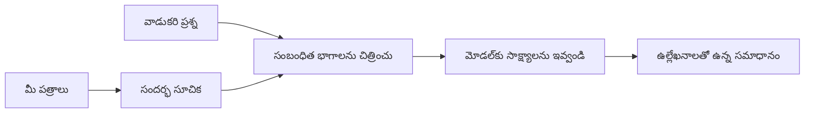

# మీ దస్త్రాల ఆధారంగా ప్రశ్నలకు జవాబులు చెప్పడానికి AI నేర్పడం:
## సిరీస్ 1: RAG, Azure వర్సెస్ ఓపెన్-సోర్స్ ప్రత్యామ్నాయాలు, మరియు ఫైన్-ట్యూనింగ్ చేసినప్పుడు అర్ధం

> 2023 Azure AI Search + Azure OpenAI డాక్యుమెంట్ QA ట్యుటోరియల్స్‌ను తిరిగి చూడే 2026 సిరీస్‌లో మొదటి వ్యాసం.

సిరీస్ నావిగేషన్: [Repository home](../README.md) | తదుపరి: [సిరీస్ 2 - స్థానిక ఓపెన్-సోర్స్ RAG సిస్టమ్‌ను ప్రారంభం నుండి నిర్మించడం](./series-2-open-source-rag-end-to-end.md)

## 1. పరిచయం - మునుపటి RAG ట్యుటోరియల్‌ను తిరిగి చూడడం

2023 లో, నేను Azure AI Search మరియు Azure OpenAI ఉపయోగించి PDF డాక్యుమెంట్ల నుండి ప్రశ్నలకు జవాబివ్వడం నేర్పించే ChatGPT పై రెండు ట్యుటోరియల్స్ పై పని చేశాను. నేను [LangChain వర్షన్](https://techcommunity.microsoft.com/blog/educatordeveloperblog/teach-chatgpt-to-answer-questions-using-azure-ai-search--azure-openai-lang-chain/3969713) రాశాను, మరియు Microsoft లో ప్రిన్సిపల్ క్లౌడ్ అడ్వకేట్ మేనేజర్ అయిన [Lee Stott](https://developer.microsoft.com/en-us/advocates/lee-stott) తో కలిసి [Semantic Kernel వర్షన్](https://techcommunity.microsoft.com/blog/educatordeveloperblog/teach-chatgpt-to-answer-questions-using-azure-ai-search--azure-openai-semantic-k/3985395) కూడా సహ రచన చేసాను. ఆ సమయంలో, "మీ డేటా పై ChatGPT" అనే ఆలోచన చాలామంది డెవలపర్లు కోసం కొత్తగా అనిపించింది. ఆ ట్యుటోరియల్స్ Azure Blob Storage, Azure AI Search, Azure OpenAI, LangChain, Semantic Kernel, మరియు FAISS-స్టైల్ వెక్టర్ రిట్రీవల్ ఉపయోగించి PDF ఫైళ్ల నుండి ప్రశ్నలకు జవాబివ్వగలిగాయి.

ఆ మునుపటి వ్యాసం ఒక సరళమైన కానీ ముఖ్యమైన వర్క్‌ఫ్లోపై దృష్టి పెట్టింది: డాక్యుమెంట్లను అప్లోడ్ చేయడం, వాటిని ఇండెక్స్ చేయడం, సంబంధిత విషయాలను రిట్రీవ్ చేయడం, మరియు ఆ విషయాల ఆధారంగా మోడల్‌ను ప్రశ్నకు జవాబు చెప్పే విధంగా అడిగే పని.

2026 లో, RAG పరిసరాలు బాగా అభివృద్ధి అయ్యాయి. Azure AI Search ఇప్పుడు ఆధునిక వెక్టర్ మరియు హైబ్రిడ్ రిట్రీవల్ నమూనాలను మద్దతు ఇస్తుంది, Azure OpenAI Microsoft Foundry Models పరిసరాల్లో భాగంగా ఉంది, మరియు కొత్త v1 API స్మూత్ గా మాసిక `api-version` మార్పుల అవసరం లేకుండా స్టాండర్డ్ OpenAI క్లయింట్ ఉపయోగిస్తుంది. అదే సమయంలో, LangGraph, LlamaIndex, Haystack, Qdrant, Milvus, Weaviate, Chroma, Ollama, మరియు vLLM వంటి ఓపెన్-సోర్స్ ఎంపికలు నిజమైన RAG సిస్టమ్‌ల కోసం व्यवहारిక ఎంపికలు అయ్యాయి.

అందుకే నేను ఈ అంశాన్ని తిరిగి చూడాలనుకున్నాను. ఇప్పుడు ప్రశ్న "నేను RAG ఎలా నిర్మించాను?" మాత్రమే కాదు. ఇప్పుడు నిర్మించడానికి చాలా మార్గాలు ఉన్నాయి, మరియు ముఖ్యమైన ప్రశ్న "నా పరిస్థితికి సరైన ఆర్కిటెక్చర్ ఏది?" అనే ప్రశ్న అయింది.

కాని ప్రధాన సమస్య మారలేదు.

ఒక AI మోడల్ మీ డాక్యుమెంట్లను 자동ంగా తెలియదు. ఒక ఉపయోగకరమైన డాక్యుమెంట్-ప్రశ్న-జవాబు సిస్టమ్‌ను నిర్మించాలంటే, మీరు ఇంకా విశ్వసనీయ రిట్రీవల్, గ్రౌండింగ్, మూల్యాంకనం మరియు ఆపరేషనల్ వర్క్‌ఫ్లోలను అవసరం.

ఈ వ్యాసం మరొక end-to-end "PDF తో చాట్" ట్యుటోరియల్ కాదు. నేను ఈ నవీకరించబడిన సిరీస్‌ను నేను ఎక్కువగా ఇష్టపడే ప్రశ్నతో మొదలుపెట్టాలనుకుంటున్నాను: మీరు ఎప్పుడు Azure ఆధారిత నిర్వహిత ఆర్కిటెక్చర్ ఎంచుకోవాలి, ఎప్పుడు ఓపెన్-సోర్స్ RAG స్టాక్ ఎంచుకోవాలి, మరియు ఎప్పుడు ఫైన్-ట్యూనింగ్ నిజంగా అర్థం.

ఈ సిరీస్ డాక్యుమెంట్ గ్రౌండెడ్ AI సిస్టమ్స్ ను నిర్మించే గురించి మొదటి వ్యాసం. మొదటి భాగంలో, మేము ఆర్కిటెక్చర్ నిర్ణయాలపై దృష్టి పెడదాము: ఎందుకు RAG ముఖ్యమైనది, ఎప్పుడు Azure ఆధారిత నిర్వహిత సేవలు ఉపయోగకరమైనవి, ఎప్పుడు ఓపెన్-సోర్స్ ప్రత్యామ్నాయాలు అర్థం, మరియు ఫైన్-ట్యూనింగ్ ఎక్కడ సాగే దిశ.

డాక్యుమెంట్ల QA సిస్టమ్స్ నిర్మించి తిరిగి చూసే ప్రక్రియలో, నేను డోర్నా అందమైన టూల్ కన్నా దాని ఆర్కిటెక్చర్ నిజమైన వినియోగదారులు, మారుతున్న డాక్యుమెంట్లు, అనుమతులు, వైఫల్యాలు మరియు నిర్వహణలో ఎలా నిలబడుతుందో తెలుసుకోవడం లో ఎక్కువ ఆసక్తి కనబరిచాను.

## 2. మీ AI కి సెర్చ్ సిస్టమ్ ఎందుకు అవసరం?

పెద్ద భాషా మోడల్లు విస్తృత ప్రజా మరియు లైసెన్స్ పొందిన డేటా పై శిక్షణ పొందతాయి. అవి సాధారణ విషయాల గురించి బాగా తెలుసుకోవచ్చు, కానీ మీ ప్రైవేట్ PDFలు, అంతర్గత విధానాలు, సంస్థా ప్రక్రియలు, పరిశోధనా ఆర్కైవ్‌లు, క్లాస్‌రూమ్ సామగ్రి, కస్టమర్ సపోర్ట్ నోట్లు లేదా ఇటీవల అప్డేట్ అయిన డాక్యుమెంటేషన్ గురించి ఆటోమేటిక్‌గా తెలియదు.

RAG ని ఆలోచించడంలో సులభమైన పద్ధతి ఇది: మోడల్ అన్ని డాక్యుమెంట్లను గుర్తుంచుతుందని ఆశించకుండా, మేము దానికి సెర్చ్ సిస్టమ్ ని ఇస్తాము. ఒక యూజర్ ప్రశ్న అడిగితే, ఆ సిస్టమ్ తగిన సమాచార భాగాలను మొదట కనుగొని, ఆ భాగాలను సదరు మోడల్‌కి సੰਦਰభంగా ఇస్తుంది.

ఇది ముఖ్యమైంది ఎందుకంటే అనేక వాస్తవ ప్రపంచ జ్ఞాన మూలాలు ప్రైవేట్, ఎప్పటికప్పుడు మారుతున్న, అనుమతులకు సున్నితమైనవి, అనేక వ్యవస్థల్లో నిల్వ చేయబడినవి, అనేక ఫార్మాట్లలో వ్రాయబడినవి, మరియు ప్రత్యక్షంగా ప్రాంప్ట్ లోకి చేర్చడానికి చాలా పెద్దవిగా ఉంటాయి.

ఉదాహరణకు, ఒక స్కూల్, కంపెనీ, లేదా పరిశోధనా బృందం 10,000 అంతర్గత డాక్యుమెంట్లు ఉంటే, ఆ డాక్యుమెంట్ల నుండి మోడల్ విశ్వసనీయంగా జవాబు ఇవ్వలేడు unless సిస్టమ్ సరైన భాగాలను సరైన సమయంలో రిట్రీవ్ చేస్తుంది.

ఇది సహజంగానే సాధారణమైన ప్రశ్నకు దారితీస్తుంది:

ఎందుకు కేవలం ఫైన్-ట్యూనింగ్ చేయలేం?

ఫైన్-ట్యూనింగ్ ఉపయోగకరం అయినప్పటికీ, సాధారణంగా డాక్యుమెంట్ జ్ఞానానికి మొదటి సరైన సాధనం కాదు. జ్ఞానం తరచూ మారితే, మూలాలు అవసరమైతే, లేదా యాక్సెస్ అనుమతులు ముఖ్యమైతే, RAG సాధారణంగా మెరుగైన ప్రారంభ బిందువు. ఫైన్-ట్యూనింగ్ ప్రవర్తన, శైలి, అవుట్‌పుట్ ఫార్మాట్, మరియు టాస్క్ నమూనాలను నేర్పడానికి బాగా సరిపోతుంది.

## 3. RAG ఆర్కిటెక్చర్‌ ప్రాక్టీస్‌లో

మీరు ఒక స్కూల్‌కు AI అసిస్టెంట్ తయారు చేస్తున్నారని ఊహించుకోండి. ఆ అసిస్టెంట్ పాలసీ PDFs, కోర్సు గైడ్స్, అంతర్గత FAQ పేజీలు, మరియు ఇటీవల అప్డేట్ అయిన ప్రకటనల నుండి ప్రశ్నలకు జవాబు చెప్పాలి.

ఒక విద్యార్థి అడిగితే, "నా ఫైనల్ అసైన్‌మెంట్ కోసం జనరేటివ్ AI ఉపయోగించవచ్చా?", సిస్టమ్ మోడల్ యొక్క సాధారణ మెమరీ నుండి జవాబు ఇవ్వకూడదు. అది ముందుగా సంబంధిత స్కూల్ పాలసీని కనుగొని, AI వాడకం గురించి భాగాన్ని రిట్రీవ్ చేసి, ఆ సాక్ష్యంతో మోడల్‌కు జవాబు ఇవ్వాలని అడుగుతుంది.

అదే RAG ప్రాక్టీస్.

పూర్తి స్థాయిలో ఈ ప్రవాహాన్ని ఇలా ఊహించవచ్చు:

వివరాలు మరింత క్లిష్టమైనవై కావచ్చు, కాని మౌలిక ఆలోచన సులభం: మోడల్ ఒంటరిగా జవాబు ఇవ్వదు. అది రిట్రీవ్ చేసిన సాక్ష్యంతో జవాబు ఇస్తుంది.

మొదట, డాక్యుమెంట్లు Azure Blob Storage, SharePoint, GitHub, లేదా అంతర్గత CMS వంటి నిల్వ వ్యవస్థల నుండి ఇంటేక్ చేయబడతాయి. తర్వాత సిస్టమ్ వాటిని టెక్స్ట్‌గా పาร์เซ చేసి, హెడ్డింగ్స్, పేజీ నంబర్స్, పట్టికలు, సెక్షన్లు మరియు మూలల స్థానాలు వంటి ఉపయోగకరమైన నిర్మాణాన్ని కోల్పోకుండా ఉంచుతుంది.

తర్వాత, కంటెంట్ ని భాగాలుగా విభజిస్తారు. ఈ దశ సులభంగా అనిపిస్తుంది, కానీ ఇది సిస్టమ్ లో అత్యంత ముఖ్యమైన భాగాలలో ఒకటి. ఒక భాగం చాలా చిన్నదైతే, అది చుట్టూ ఉన్న సੰਦਰభాన్ని కోల్పోవచ్చు. భాగం చాలా పెద్దదైతే, అది అసంబంధిత సమాచారాన్ని కలిగి ఉండవచ్చు మరియు రిట్రీవల్ తక్కువ ఖచ్చితంగా మారుతుంది.

భాగాల విభజన తర్వాత, సిస్టమ్ ఎంబెడింగ్లను సృష్టించి వాటిని మునుపటి టెక్స్ట్ మరియు మెటాడేటాతో, ఉదాహరణకు ఫైల్ పేరు, పేజీ సంఖ్య, అనుమతులు, డాక్యుమెంట్ సంస్కరణ, మరియు మూల URLతో కూడిన సెర్చ్ చేయదగిన ఇండెక్స్‌లో నిల్వ చేస్తుంది.

యూజర్ ప్రశ్న అడిగితే, సిస్టమ్ కీవర్డ్ సెర్చ్, వెక్టర్ సెర్చ్ లేదా హైబ్రిడ్ సెర్చ్ ఉపయోగించి అభ్యర్థి భాగాలను రిట్రీవ్ చేస్తుంది. రీర్యాంకర్ ఆ భాగాలను తిరిగి క్రమబద్ధీకరిస్తుంది, అందువల్ల అత్యంత ఉపయోగకరమైన సాక్ష్యం టాప్ దగ్గర ఉంచబడుతుంది.

చివరగా, మోడల్ ప్రశ్న మరియు రిట్రీవ్ చేసిన సాక్ష్యాన్ని పొందుతుంది. జవాబు ఆ సాక్ష్యంపై ఆధారపడి ఉండాలి మరియు మూలాలను సూచించడం ద్వారా యూజర్ మూలాన్ని పరిశీలించగలుగుతుంది.

ముఖ్యమైన విషయం ఏమిటంటే, RAG అనేది కేవలం "PDFలని వెక్టర్ డాటాబేస్‌లో పెట్టడం" కాదు. జవాబు నాణ్యత మొత్తం వర్క్‌ఫ్లోపై ఆధారపడి ఉంటుంది: పర్సింగ్, భాగాల విభజన, రిట్రీవల్, రీర్యాంకింగ్, ప్రాంప్టింగ్, మూల సూచన, మరియు ఎవాల్యుయేషన్.

కాబట్టి డాక్యుమెంట్ నిర్మాణం ఎందుకు ముఖ్యం అంటే, PDFలో హెడ్డింగ్, పట్టిక, ఫుట్‌నోటు లేదా పేజీ సరిహద్దు ఒక పరిచ్ఛేదం అర్థాన్ని మార్చవచ్చు. Azure లో, Document Layout స్కిల్ Azure Document Intelligence లేఅవుట్ సామర్థ్యాలను ఉపయోగించి నిర్మాణం గమనించగల రీతిలో అవుట్‌పుట్‌ను రూపొందిస్తుంది, ఇది RAG సిస్టమ్స్ కోసం భాగాల విభజన మరియు రిట్రీవల్ నాణ్యతను మెరుగుపరుస్తుంది.

## 4. 2023 తర్వాత ఏమి మారింది?

2023 ట్యుటోరియల్ ఆ సమయంలో మంచి ప్రారంభ బిందువు:

- Azure Blob Storage PDF ఫైళ్లను నిల్వ చేసింది.
- Azure AI Search కంటెంట్‌ను ఇండెక్స్ చేసది.
- LangChain Azure OpenAIకి రిట్రీవల్‌ను కనెక్ట్ చేశింది.
- FAISS సులభమైన స్థానిక వెక్టర్ స్టోర్‌గా పనిచేసింది.
- ఉదాహరణగా `gpt-35-turbo` మరియు `text-embedding-ada-002` వాడారు.

2026 లో, ఆధునిక వర్షన్ చాలా మార్పులను ప్రతిబింబించాలి.

మొదట, రిట్రీవల్ మెరుగుపడింది. 2023 లో చాలాబ్రూప్రదర్శనలలో సింపుల్ వెక్టర్ సాదృశ్య సెర్చ్ ఉపయోగించారు. ఇప్పుడు, హైబ్రిడ్ రిట్రీవల్ గంభీరం డాక్యుమెంట్ QAకు సాధారణ ప్రారంభ బిందువు అయింది. Azure AI Search కీవర్డ్స్ మరియు వెక్టర్ క్వెరీస్‌ను అంశంగా కలిపి ఒకే అభ్యర్థనలో హైబ్రిడ్ సెర్చ్ మద్దతు ఇస్తుంది మరియు రిజల్టులను రిసిప్రోకల్ ర్యాంక్ ఫ్యూజన్ తో విలీనం చేస్తుంది. సెమాంటిక్ ర్యాంకర్ పూర్తైన టెక్స్ట్, వెక్టర్ మరియు హైబ్రిడ్ ఫలితాల టెక్స్ట్ పక్కను తిరిగి ర్యాంక్ చేయగలదు.

రెండవది, ఇంటేక్ మరింత క్లిష్టమై వచ్చింది. ప్రతి డాక్యుమెంట్‌ను మానవీయంగా అప్లికేషన్ కోడ్‌తో విడగొట్టకుండ, Azure AI Search చంకింగ్, ఎంబెడ్డింగ్, మరియు క్వెరీటైం వెక్టరైజేషన్ కోసం సమగ్ర వెక్టరైజేషన్ మద్దతు ఇస్తుంది. PDFs మరియు డాక్యుమెంట్-భారమైన ఉద్యోగాల కోసం Document Layout స్కిల్ ఫిక్స్ చేసిన భాగాల కంటే ఎక్కువ నిర్మాణాన్ని నిలిపివేస్తుంది.

మూడవది, ఆర్కెస్టేషన్ ఎక్కువ ప్రాముఖ్యం పొందింది. కీ క్లిష్టమైనది LLM API కాల్ తానే కాదు. క్లిష్టత వైఫల్యాలు, మళ్లీ ప్రయత్నాలు, పాత రిట్రీవల్, భాగ నాణ్యత, దీర్ఘకాలిక వర్క్‌ఫ్లోలు, మానవ సమీక్ష, మరియు విస్తృత ఎవాల్యుయేషన్ నిర్వహించడం. దీన్నే LangGraph, LlamaIndex వర్క్‌ఫ్లోలు, Haystack పైప్‌లైన్లు, మరియు ప్లాట్‌ఫామ్-స్థాయి ఎవాల్యుయేషన్ మరియు ఆబ్జర్వబిలిటీ టూల్స్ లాంటివి ఒకే సాదా చైన్ కంటే ఎక్కువ ప్రాముఖ్యం పొందుతున్నాయి.

నాల్గవది, ఎవాల్యుయేషన్ ఎంపికలో ఇక లేదని. ఒక ప్రశ్నతో డెమో ఆకట్టుకోవచ్చు. ఉత్పత్తి సిస్టమ్‌కు టెస్ట్ సెట్‌లు, రిగ్రెషన్ చెక్లు, రిట్రీవల్ మెట్రిక్స్, గ్రౌండెడ్‌నెస్ చెక్లు, మరియు మానిటరింగ్ అవసరం. ఎవాల్యుయేషన్ లేకపోతే, సిస్టమ్ మెరుగుపడుతోందా లేదా కేవలం మారుతుందా అనేది తెలియదు.

## 5. Azure మరియు ఓపెన్-సోర్స్ RAG స్టాక్స్ మధ్య ఎంపిక

ఉపయోగకరమైన ప్రశ్న "Azure ఓపెన్ సోర్స్ కన్నా మెరుగ్గా ఉంది?" లేదా "ఓపెన్ సోర్స్ Azure కన్నా మెరుగ్గా ఉంది?" అనేది కాదు.

ఉపయోగకరమైన ప్రశ్న: మీరు ఏ విధమైన సిస్టమ్‌ను నిర్మిస్తున్నారు, దాన్ని ఎవరు నిర్వహిస్తారు, మీకు ఏ పరిమితులు ఉన్నాయి, మరియు ఏ ప్రత్యేక వైఫల్య మోడ్లు అననుకూలమివి?

నేను డాక్యుమెంట్ QA ఉదాహరణలను నిర్మించడం ప్రారంభించినప్పుడు, సాధారణంగా రిట్రీవల్ పనిచేస్తుందా అని ఆలోచించాను. PDFs అప్లోడ్ చేసి, వాటిని సెర్చ్ చేసి, జవాబు సృష్టించగలనా? అది సరైన ప్రారంభం అనిపించింది.

వాస్తవవంతమైన AI వర్క్‌ఫ్లోలతో పని చేసిన తరువాత, నా అంచనా మార్చబడింది. ఇప్పుడు నేను RAG స్టాక్ ఎంచేముందు నాలుగు అంశాలు చూస్తాను:

- గుర్తింపు మరియు అనుమతులు
- రిట్రీవల్ నాణ్యత
- వర్క్‌ఫ్లో నమ్మకదరితం
- ఆపరేషనల్ యాజమాన్యం

ఈ నాలుగు ప్రాంతాలు మోడల్ బెంచ్‌మార్క్ కన్నా చాలా ఎక్కువ సమాచారాన్ని ఇస్తాయి.

కంపెనీ ఆవిర్భావం కష్టం అయినప్పుడు సాధారణంగా Azure ఆధారిత ఆర్కిటెక్చర్లు అర్ధం చేసుకుంటాయి. ఒక బృందం ఇప్పటికే Microsoft Entra ID, Microsoft 365, Azure Storage, ప్రైవేట్ నెట్వర్కింగ్, RBAC, మరియు Azure మానిటరింగ్ పై ఆధారపడితే, Azure AI Search మరియు Azure OpenAI చాలా ఆపరేషనల్ క్లిష్టతను తగ్గిస్తుంది. ఆ వాతావరణంలో, Azure కేవలం మోడల్ API కాకుండా, సరిహద్దు వ్యవస్థల పరిపాలన: గుర్తింపు, గవర్నెన్స్, నిర్వహిత సెర్చ్, భద్రతా సమన్వయం, సపోర్ట్ మరియు పరిచయమైన ఆపరేషన్లు విలువ.

సడలింపును ఆవిష్కరించడం కష్టం అయినప్పుడు ఓపెన్-సోర్స్ ఆర్కిటెక్చర్లు బాగా పనిచేస్తాయి. బృందం స్థానిక ఇన్ఫెరెన్స్, క్లౌడ్ పోర్టబిలిటీ, కస్టమ్ రిట్రీవల్ పైప్‌లైన్, ప్రత్యేక రీర్యాంకింగ్, లేదా వెక్టర్ డాటాబేస్ మరియు మోడల్-సర్వింగ్ లేయర్ పై ప్రత్యక్ష నియంత్రణ కావాలి అంటే ఓపెన్-సోర్స్ స్టాక్ మరింత సరిపోతుంది. దాని ప్రత్యామ్నాయం ఏమిటంటే బృందం నమ్మకదరిత్వ పనుల్ని, బ్యాకప్లు, స్కేలింగ్, లేటెన్సీ, మైగ్రేషన్లు, మానిటరింగ్, మరియు భద్రత నిర్వహణ లో ఎక్కువ బాధ్యత కలిగి ఉంటుంది.

వాస్తవలో, చాలావరకు ఉత్పత్తి AI సిస్టమ్స్ పూర్తిగా క్లౌడ్-నేటివ్ లేదా పూర్తిగా ఓపెన్-సోర్స్ కావు. అవి సాధారణంగా ఆపరేషనల్ సౌలభ్యం, పోర్టబిలిటీ, గవర్నెన్స్, మరియు ఇంజనీరింగ్ సడలింపును సమతుల్యం చేస్తూ హైబ్రిడ్ సిస్టమ్స్ గా ఉంటాయి.

ఉదాహరణకి, నేను ఆశ్చర్యకరంగా అనుకోను అటువంటి సిస్టమ్ Azure OpenAI మోడల్ యాక్సెస్ కోసం, LangGraph వర్క్‌ఫ్లో ఆర్కెస్టేషన్ కోసం, Azure హోస్టింగ్ ఉపయోగించి, మరియు ఓపెన్-సోర్స్ వెక్టర్ డాటాబేస్ ఒక నిర్దిష్ట రిట్రీవల్ అవసరానికి ఉపయోగించునట్లు కనిపించడం. ఇది ఆర్కిటెక్చరల్ అసంఖ్య లో కాదు. ఇది ప్రతీ భాగానికి సరైన స్థాయిలో నిర్వహిత సర్వీస్ మరియు ఇంజనీరింగ్ నియంత్రణను ఎంచుకోవడం.

నాకు హైబ్రిడ్ ఆర్కిటెక్చర్లు ఇష్టం, ఎందుకంటే నిర్వహిత ప్లాట్‌ఫారమ్ ముఖ్య సంస్థ సమస్యలను పరిష్కరించినప్పుడు, ఓపెన్-సోర్స్ భాగాలు నిజానికి ముఖ్యమైన చోట బృందానికి సడలింపును ఇస్తాయి.

## 6. అనువర్తన నిర్ణయ గైడ్

ఇది నేను బృందంతో కలిసి RAG స్టాక్ ఎంచేముందు ఉపయోగించే నిర్ణయ పట్టిక:

| నిర్ణయ విభాగం | Azure నిర్వహిత స్టక్ బలమైనప్పుడు... | ఓపెన్-సోర్స్ స్టక్ బలమైనప్పుడు... |
| --- | --- | --- |
| గుర్తింపు మరియు యాక్సెస్ | Entra ID, RBAC, నిర్వహిత గుర్తింపు, మరియు సంస్థ అనుమతులు కేంద్రంగా ఉంటే | కస్టమ్ ఆయుత్తు, నాన్-Microsoft గుర్తింపు, లేదా యాప్-విశేష యాక్సెస్ లాజిక్ ఆధిక్యం ఉంటే |
| ఆపరేషన్స్ | బృందం నిర్వహణ కలిగిన మౌలిక సదుపాయాలు, మద్దతు, SLAలు, మరియు సులభమైన చేరిక కోరుతుంటే | బృందం వెక్టర్ డేటాబేస్‌లు, మోడల్ సర్వింగ్, బ్యాకప్స్, మరియు స్కేలింగ్ నిర్వహిస్తుంటే |
| రిట్రీవల్ | హైబ్రిడ్ సెర్చ్, సెమాంటిక్ ర్యాంకింగ్, ఫిల్టర్స్, మరియు మెటాడేటా సెర్చ్ అవసరాలు ఎక్కువగా ఉంటే | బృందం కస్టమ్ రిట్రీవల్, ప్రత్యేక రీర్యాంకింగ్, లేదా ప్రయోగాత్మక ఇండెక్సింగ్ అవసరం ఉంటే |
| పోర్టబిలిటీ | Azure పరిసరాలతో సాదాసీదా కలిపే లేదా ప్రాధాన్యత ఉన్నపుడు | క్లౌడ్ లాక్-ఇన్ తప్పించటం కఠినమైన అవసరం అయితే |
| ఇన్ఫెరెన్స్ | Azure OpenAI పాలన, నెట్‌వర్కింగ్, మరియు సంస్థ నియంత్రణలు ముఖ్యమైనప్పుడు | స్థానిక ఇన్ఫెరెన్స్, కస్టమ్ మోడల్స్, లేదా స్వయం-హోస్టెడ్ సర్వింగ్ అవసరమైతే |
| ఖర్చు | ఇంజనీరింగ్ మరియు ఆపరేషన్స్ కృషి తగ్గించడమే లక్ష్యమైతే | పరిమాణం పెద్దదైతే, పరిశీలనాత్మక మౌలిక సదుపాయ ఆప్టిమైజేషన్ అవసరం |
| ప్రయోగం | స్థిరత్వం మరియు సంస్థ సమన్వయం తరచుగా మార్పులకు కన్నా ముఖ్యం అయితే | బృందం ఏజెంట్లు, టూల్స్, మెమరీ, మరియు రిట్రీవల్ వర్క్‌ఫ్లోపై త్వరగా ప్రయోగాలు చేస్తుంటే |

నా సూత్రం సులభం:

- సంస్థ సమన్వయం, భద్రత మరియు ఆపరేషనల్ సౌలభ్యం ప్రధాన ప్రమాదాలైతే Azure తో ప్రారంభించండి.
- పోర్టబిలిటీ, అనుకూలీకరణ, లేదా స్థానిక నియంత్రణ ప్రధాన ప్రమాదాలైతే ఓపెన్ సోర్స్ తో ప్రారంభించండి.
- రెండు సత్యమైతే హైబ్రిడ్ స్టాక్ ఉపయోగించండి.

కోడ్‌తో ప్రారంభించే 2026 RAG సిరీస్ నేను ప్రారంభించకపోవడానికి దీనికి ఇదే కారణం. కోడ్ ముఖ్యం, కానీ ఆర్కిటెక్చర్ ఎంపిక అమలు ముందు వస్తుంది. ఒక సరళమైన డెమో కఠినమైన ఎంపికలను దాచివేస్తుంది. మంచి RAG సిస్టమ్ ఆ ఎంపికలను స్పష్టం చేస్తుంది.

## 7. ఫైన్-ట్యూనింగ్ ఎక్కడ సరిపోతుంది

ఫైన్-ట్యూనింగ్ తరచుగా RAGతో కలిసి ప్రస్తావించబడుతుంది, కానీ నేను వీటిని వేరుగా చూడటం ముఖ్యం అనుకుంటున్నాను.

RAG సాధారణంగా తाजा, ప్రైవేట్, అనుమతులపై ఆధారపడి, లేదా మూలగ్రహిత జ్ఞానాన్ని అవసరమయ్యే సిస్టమ్‌లకు మంచి ఎంపిక. జవాబు డాక్యుమెంట్లను సూచించాలి, ఇటీవల అప్‌డేట్‌లను ప్రతిబింబించాలి, లేదా యూజర్-ప్రత్యేక యాక్సెస్ నిబంధనలను గౌరవించాలి అనిపిస్తే, రిట్రీవల్ ఆర్కిటెక్చర్‌లో భాగంగా ఉండాలి.
మోడల్‌ను ఫైన్-ట్యూన్ చేయడం అత్యంత ఉపయోగకరంగా ఉంటుంది, ముఖ్యంగా విజ్ఞానం ప్రధాన సమస్య కాకపోయే సందర్భాల్లో. మీరు ఒక నిర్దిష్ట అవుట్పుట్ ఫార్మాట్‌ను అనుసరించడం, డొమైన్-ప్రత్యేక ప్రతిస్పందన శైలిని సరిపోల్చడం, స్థిరమైన పనిని మరింత స్థిరంగా నిర్వహించడం లేదా ప్రతి ప్రాంప్ట్‌లో అవసరమైన సూచన పరిమాణాన్ని తగ్గించుకోవడం కోసం ఇది సహాయపడుతుంది.

ప్రాక్టీస్లో, వీటిద్దరూ కలిసి పని చేయవచ్చు. ఒక సపోర్ట్ అసిస్టెంట్ తాజా పాలసీని పొందడానికి RAG ఉపయోగించవచ్చు, మరొక ఫైన్-ట్యూన్డ్ మోడల్ కంపెనీ ఇష్టపడే సమాధాన నిర్మాణం మరియు tonaeను నేర్చుకుంటుంది.

పని తప్పే విషయం ఏమిటంటే, ఫైన్-ట్యూనింగ్‌ను డాక్యుమెంట్ స్టోర్‌కు ప్రత్యామ్నాయం అనుకోవడం. సిస్టమ్ తాజా, వ్యక్తిగత లేదా అనుమతి-సందర్భమైన డేటా నుండి జవాబు ఇవ్వాల్సినప్పుడు రిట్రీవల్ అవసరాన్ని తొలగించదు.

## 8. ఈ సిరీస్ తదుపరి ఎక్కడికి వెళుతుంది

ఈ వ్యాసం నిర్ణయాల తీసుకునే శ్రేణి. కోడ్ రాయడం ముందు, నేను ట్రేడ్-ఆఫ్‌లను స్పష్టంగా చూపించాలని కోరుకున్నాను: RAG వర్సెస్ ఫైన్-ట్యూనింగ్, Azure వర్సెస్ ఓపెన్ సోర్స్, నిర్వహించబడే సేవలు వర్సెస్ ఆపరేషనల్ కంట్రోల్.

అమలు ప్రారంభం ముందు, ఇక్కడ ఒక పాయింట్ వదిలిపెట్టాలనుకుంటున్నాను: అనేక ఎంటర్‌ప్రైజ్ AI సిస్టమ్స్‌లో, మోడల్ ఒక భాగమే. రిట్రీవల్ నాణ్యత, ఆర్కెస్ట్రేషన్, మూల్యాంకనం, అనుమతులు మరియు ఆపరేషనల్ నమ్మకదర్స్థత వల్లే సిస్టమ్ డెమో దశకు మించి విజయవంతమవుతుందని నిర్ణయిస్తాయి.

ఈ సిరీస్ తదుపరి భాగాల్లో, నేను డాక్యుమెంట్-గ్రౌండెడ్ AI సిస్టమ్స్ యొక్క ప్రాయోగిక పక్కన లోతుగా వెళ్లాలని యోచిస్తున్నాను: మొదటా ఒక స్థానిక ఓపెన్-సోర్స్ RAG వర్క్‌ఫ్లో నిర్మించి, ఆ తర్వాత అదే సన్నివేశాన్ని Azure AI Search మరియు Azure OpenAI తో దిద్దుబాటు చేసి, అప్పుడు సిస్టమ్ నిజంగా పనిచేస్తుందో లేదో మూల్యాంకనం చేస్తాను.

సిరీస్ అభివృద్ధి సమయంలో క్రమం మార్చవచ్చు కానీ లక్ష్యం ఒకేచోట ఉంటుంది: సులభమైన డెమో మించి వెళ్లి, నిర్వహించగల, మూల్యాంకించగల, ఆపరేట్ చేయగల RAG సిస్టమ్స్ గురించి ఆలోచించడం నేర్పడం.

## 9. రిఫరెన్సులు మరియు వనరులు

ప్రాథమిక టుటోరియల్స్:

- [Teach ChatGPT to Answer Questions: Using Azure AI Search & Azure OpenAI (Lang Chain)](https://techcommunity.microsoft.com/blog/educatordeveloperblog/teach-chatgpt-to-answer-questions-using-azure-ai-search--azure-openai-lang-chain/3969713)
- [Teach ChatGPT to Answer Questions: Using Azure AI Search & Azure OpenAI (Semantic Kernel)](https://techcommunity.microsoft.com/blog/educatordeveloperblog/teach-chatgpt-to-answer-questions-using-azure-ai-search--azure-openai-semantic-k/3985395)

Azure:

- [Azure AI Search REST API versions](https://learn.microsoft.com/en-us/rest/api/searchservice/search-service-api-versions)
- [Hybrid search in Azure AI Search](https://learn.microsoft.com/en-us/azure/search/hybrid-search-how-to-query)
- [Integrated vectorization in Azure AI Search](https://learn.microsoft.com/en-us/azure/search/vector-search-integrated-vectorization)
- [Document Layout skill in Azure AI Search](https://learn.microsoft.com/en-us/azure/search/cognitive-search-skill-document-intelligence-layout)
- [Chunk and vectorize by document layout](https://learn.microsoft.com/en-us/azure/search/search-how-to-semantic-chunking)
- [Semantic ranking in Azure AI Search](https://learn.microsoft.com/en-us/azure/search/semantic-search-overview)
- [Azure OpenAI / Microsoft Foundry API version lifecycle](https://learn.microsoft.com/en-us/azure/foundry/openai/api-version-lifecycle)
- [Foundry Models sold by Azure](https://learn.microsoft.com/en-us/azure/foundry/foundry-models/concepts/models-sold-directly-by-azure)
- [Microsoft Foundry fine-tuning considerations](https://learn.microsoft.com/en-us/azure/foundry/openai/concepts/fine-tuning-considerations)
- [Microsoft Foundry observability](https://learn.microsoft.com/en-us/azure/foundry/concepts/observability)
- [Run evaluations in Microsoft Foundry](https://learn.microsoft.com/en-us/azure/foundry/how-to/evaluate-generative-ai-app)

ఓపెన్-సోర్స్:

- [LangGraph documentation](https://docs.langchain.com/oss/python/langgraph/overview)
- [LlamaIndex documentation](https://developers.llamaindex.ai/python/framework/)
- [Haystack documentation](https://docs.haystack.deepset.ai/)
- [Qdrant documentation](https://qdrant.tech/documentation/overview/)
- [Milvus documentation](https://milvus.io/docs/overview.md)
- [Weaviate documentation](https://docs.weaviate.io/weaviate/current/)
- [Chroma documentation](https://docs.trychroma.com/docs/overview/introduction)
- [Ollama embeddings](https://docs.ollama.com/capabilities/embeddings)
- [vLLM OpenAI-compatible server](https://docs.vllm.ai/en/latest/serving/openai_compatible_server.html)
- [BGE embedding models](https://huggingface.co/BAAI/bge-large-en-v1.5)
- [E5 embedding models](https://huggingface.co/intfloat/e5-large-v2)
- [Instructor embedding models](https://huggingface.co/hkunlp/instructor-large)

తదుపరి: [Series 2 - Build a Local Open-Source RAG System End to End](./series-2-open-source-rag-end-to-end.md)

---

<!-- CO-OP TRANSLATOR DISCLAIMER START -->
**అస్వీకరణ**:
ఈ పత్రం AI అనువాద సేవ [Co-op Translator](https://github.com/Azure/co-op-translator) ఉపయోగించి అనువదించబడింది. మేము ఖచ్చితత్వానికి ప్రయత్నిస్తున్నప్పటికీ, ఆటోమేటెడ్ అనువాదాలు తప్పులు లేదా అసమగ్రతలను కలిగి ఉండవచ్చు. దాని స్వదేశ భాషలో ఉన్న అసలు పత్రాన్ని అధికారం కలిగిన మూలంగా పరిగణించాలి. కీలకమైన సమాచారం కోసం, ప్రొఫెషనల్ మానవ అనువాదాన్ని సిఫారసు చేస్తాము. ఈ అనువాదం ఉపయోగం వల్ల కలిగే ఏవైనా అపార్థాలు లేదా తప్పుదారులు కోసం మేము బాధ్యత వహించము.
<!-- CO-OP TRANSLATOR DISCLAIMER END -->