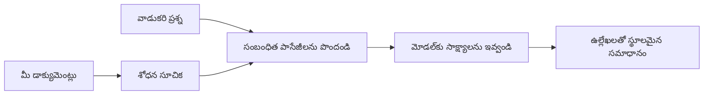

# మీ డాక్యుమెంట్ల ఆధారంగా ప్రశ్నలకు AI సమాధానం చెప్పడాన్ని నేర్పించండి:
## సిరీస్ 1: RAG, Azure vs ఓపెన్-సోర్సు ప్రత్యామ్నాయాలు, మరియు ఫైన్-ట్యూనింగ్ ఎప్పుడు అవసరం

> 2023 లో Azure AI Search + Azure OpenAI డాక్యుమెంట్ QA ట్యూటోరియల్స్ ను తిరిగి పరిశీలించే 2026 సిరీస్‌లో మొదటి వ్యాసం.

## 1. పరిచయం - పూర్వ RAG ట్యూటోరియల్ ను తిరిగి చూడటం

2023లో, నేను Azure AI Search మరియు Azure OpenAI ఉపయోగిస్తూ PDF డాక్యుమెంట్ల నుండి ప్రశ్నలకు ChatGPT ను సమాధానం చెప్పడానికి నేర్పించే ట్యూటోరియల్స్ జంటపై పని చేశాను. నేను [LangChain వెర్షన్](https://techcommunity.microsoft.com/blog/educatordeveloperblog/teach-chatgpt-to-answer-questions-using-azure-ai-search--azure-openai-lang-chain/3969713) రాసి, అలాగే Microsoft లో ప్రిన్సిపల్ క్లౌడ్ అడ్వకేట్ మేనేజర్ అయిన [Lee Stott](https://developer.microsoft.com/en-us/advocates/lee-stott)తో కలిసి సహ-రచయితగా [Semantic Kernel వెర్షన్](https://techcommunity.microsoft.com/blog/educatordeveloperblog/teach-chatgpt-to-answer-questions-using-azure-ai-search--azure-openai-semantic-k/3985395) ను రచించాను. అప్పటిప్పటి వరకు "మీ డేటాపైన ChatGPT" అనే ఆలోచన చాలా అభివృద్ధి చెందలేదు. ఆ ట్యూటోరియల్స్ Azure Blob Storage, Azure AI Search, Azure OpenAI, LangChain, Semantic Kernel, మరియు FAISS-శైలి వెక్టర్ రిట్రీవల్ ఉపయోగించి PDF ఫైళ్ల నుండి ప్రశ్నలకు సమాధానం చెప్పడానికి పనిచేశాయి.

ఆ పూర్వ వ్యాసం ఒక సరళమైన కానీ ముఖ్యమైన వర్క్‌ఫ్లోపై దృష్టి పెట్టింది: డాక్యుమెంట్లు అప్‌లోడ్ చేయడం, వాటిని ఇండెక్స్ చేయడం, సార్ధక సమాచారాన్ని రిట్రీవ్ చేయడం, మరియు ఆ సమాచారంపై ఆధారపడి మోడల్‌కి ప్రశ్న అడగడం.

2026లో, RAG ఎకోసిస్టమ్ గణనీయంగా పెరిగింది. Azure AI Search ఇప్పుడు ఆధునిక వెక్టర్ మరియు హైబ్రిడ్ రిట్రీవల్ నమూనాలను మద్దతు ఇస్తుంది, Azure OpenAI పెద్ద Microsoft Foundry Models ఎకోసిస్టమ్ భాగమైంది, మరియు కొత్త v1 API నెలవారీ `api-version` మార్పులు లేకుండా సాంప్రదాయ OpenAI క్లయింట్‌ని ఉపయోగించగలదు. అదే సమయంలో, LangGraph, LlamaIndex, Haystack, Qdrant, Milvus, Weaviate, Chroma, Ollama, మరియు vLLM వంటి ఓపెన్-సోర్స్ ఎంపికలు నిజమైన RAG సిస్టములకు ఉపయోగకరమైన ఎంపికలు అయ్యాయి.

అందుకే నేను ఈ విషయాన్ని తిరిగి పరిశీలించాలనుకున్నాను. ప్రశ్న ఇపుడు కేవలం "నేను ఎలా RAG ను నిర్మించగలవు?" కాదు. ఇప్పటికీ అనేక మార్గాలు ఉన్నాయి, మరియు ఇంకా ముఖ్యమైన ప్రశ్న "నా పరిస్థితికి ఏ ఆర్కిటెక్చర్ సరిపోతుంది?" అనేది.

కానీ ప్రాథమిక సమస్య అపరివర్తితం.

AI మోడల్ త‌న స్వయంగా మీ డాక్యుమెంట్ల‌ను తెలుసుకోదు. ఒక ఉపయోగకరమైన డాక్యుమెంట్-ప్రశ్న-సమాధాన సిస్టమ్ ను నిర్మించడానికి మీరు ఇంకా నమ్మకమైన రిట్రీవల్, గ్రౌండింగ్, మూల్యాంకనం మరియు ఆపరేషనల్ వర్క్‌ఫ్లోల్ని అవసరం.

ఈ వ్యాసం "PDF తో చాట్" అంత్యాంతపు ట్యూటోరియల్ కాదు. నేను ఈ నవీకరించిన సిరీస్ ను ఇపుడు నాకు ఎక్కువగా పరామర్శించే ప్రశ్నతో ప్రారంభించాలనుకుంటున్నాను: మీరు ఎప్పుడు మేనేజ్‌చేసిన Azure ఆర్కిటెక్చర్‌ను ఎంచుకోవాలి, ఎప్పుడు ఓపెన్-సోర్స్ RAG స్టాక్ ఎంచుకోవాలి, మరియు ఎప్పుడు ఫైన్-ట్యూనింగ్ నిజంగా సరిపోతుంది?

ఇది డాక్యుమెంట్-గ్రౌండెడ్ AI సిస్టమ్స్ నిర్మాణం గురించి సిరీస్‌లో మొదటి వ్యాసం. మొదటి భాగంలో, మనం ఆర్కిటెక్చర్ నిర్ణయాలపై ఫోకస్ చేస్తాము: RAG ఎందుకు ముఖ్యం, ఎప్పుడు Azure ఆధారిత మేనేజ్‌డ్ సర్వీసులు ఉపయోగకరంగా ఉంటాయి, ఎప్పుడు ఓపెన్-సోర్స్ ప్రత్యామ్నాయాలు అవసరమయ్యే పరిస్థితులు, మరియు ఎక్కడ ఫైన్-ట్యూనింగ్ సరిపోతది.

డాక్యుమెంట్ QA సిస్టమ్స్ నిర్మించి, తిరిగి పరిశీలించి, నేను ఏ టూల్ డెమో లో బాగుండదో చూడటం కన్నా ఏ ఆర్కిటెక్చర్ నిజంగా వాడకదారుల, మారుతున్న డాక్యుమెంట్ల, అనుమతులు, విఫలతలు, నిర్వహణను మన్నుకుంటుందో తెలుసుకునే అంశంలో ఎక్కువ ఆసక్తి కలిగి ఉన్నాను.

## 2. మీ AIకి శోధన వ్యవస్థ ఎందుకు అవసరం

వ_STదూప్ర‌చార భాషా మోడళ్లను విస్తృత పబ్లిక్ మరియు లైసెన్స్ పొందిన డేటా పై శిక్షణ ఇస్తారు. అవి సాధారణ విషయాలపై చాలాసార్లు తెలుసుకున్నప్పటికీ, అవి స్వయంచాలకంగా మీ ప్రైవేట్ PDFలు, అంతర్గత విధానాలు, సంస్థా విధానాలు, పరిశోధనా ఆర్కైవ్స్, తరగతి సబ్జెక్టుల మెటీరియల్స్, కస్టమర్ సపోర్ట్ నోట్స్, లేదా తాజాగా నవీకరించిన డాక్యుమెంటేషన్ గురించి తెలియదు.

RAG గురించి సరళంగా ఆలోచించగలిగితే: మోడల్ ప్రతీ డాక్యుమెంట్ ను గుర్తుంచుకోవాలని ఆశించటం కాకుండా, మేము దానికి శోధన వ్యవస్థ ఇస్తాము. యూజర్ ప్రశ్న అడిగితే, వ్యవస్థ మొదట అత్యంత సంబంధిత సమాచారం భాగాలను కనుగొంటుంది, ఆపై ఆ భాగాలను మోడల్ కి సందర్భంగా అందిస్తుంది.

ఇది ముఖ్యమే ఎందుకంటే అనేక నిజజీవిత జ్ఞాన మాధ్యమాలు ప్రైవేటు, నిరంతరం మారుతూ ఉండటం, అనుమతి-సంక్లిష్టతలు ఉండటం, అనేక సిస్టమ్స్‌లో నిల్వ ఉండటం, అనేక ఫార్మాట్లలో ఉంటాయి, మరియు వాటిని ప్రత్యక్షంగా ప్రాంప్ట్‌లో పేస్ట్ చేయడానికి చాలా పెద్దవి.

ఉదాహరణకి, స్కూల్, కంపెనీ, లేదా పరిశోధనా బృందానికి 10,000 అంతర్గత డాక్యుమెంట్‌లు ఉన్నట్లైతే, మోడల్ ఆ డాక్యుమెంట్ల నుండి నిష్టూరంగా సమాధానం ఇవ్వలేడు, కాబట్టి సరైన భాగాలను సరైన సమయంలో రిట్రీవ్ చేయడం అవసరం.

ఇది సహజంగా ఈ ప్రశ్నకు దారితీస్తుంది:

మొదట చాలా fine-tune చేయకూడదా?

ఫైన్-ట్యూనింగ్ ఉపయోగకరంగా ఉండవచ్చు, కానీ ఇది సాధారణంగా డాక్యుమెంట్ జ్ఞానానికి మొదటి సరైన టూల్ కాదు. జ్ఞానం తరచూ మారితే, సూత్రాలు ముఖ్యమైనప్పటికీ లేదా యాక్సెస్ అనుమతులు ముఖ్యం అయితే, RAG దానికన్నా మెరుగైన ప్రారంభంగా ఉండుతుంది. ఫైన్-ట్యూనింగ్ ప్రవర్తన, శైలి, అవుట్‌పుట్ ఫార్మాట్, మరియు టాస్క్ నమూనాలను నేర్పడానికి బాగుంటుంది.

## 3. RAG ఆర్కిటెక్చర్ అనుభవంలో

మీరు ఒక స్కూల్ కోసం AI సహాయకుడిని నిర్మిస్తున్నట్టు ఊహించండి. ఆ సహాయకుడు విధాన PDFs, కోర్సు గైడ్స్, అంతర్గత FAQ పేజీలు, మరియు ఇటీవల అప్డేట్ చేసిన ప్రకటనల నుండి ప్రశ్నలకు సమాధానం చెప్పాలి.

ఒక విద్యార్థి అడిగితే, "నాకు ఫైనల్ అసైన్మెంట్ కోసం జనరేటివ్ AI ను ఉపయోగించవచ్చా?", ఆ సిస్టమ్ సాధారణ మోడల్ జ్ఞానంతో సమాధానం చెప్పకూడదు. ముందుగా సంబంధిత స్కూల్ విధానాన్ని కనుగొని, AI వాడకం గురించి భాగాన్ని రిట్రీవ్ చేసి, ఆ ఆధారంతో మోడల్ లో అడగాలి.

ఇదే RAG అనుభవంలో.

పెద్ధ స్థాయిలో, మీరు ఈ ఇంతకుంది చూడొచ్చు:

వివరాలు మరింత సున్నితంగా ఉండవచ్చు, కానీ ప్రాథమిక ఆలోచన సరళం: మోడల్ ఒంటరిగా సమాధానం ఇవ్వదు. అది రిట్రీవ్ చేసిన ఆధారంతో సమాధానం ఇస్తుంది.

మొదట, డాక్యుమెంట్లు Azure Blob Storage, SharePoint, GitHub, లేదా అంతర్గత CMS లాంటి నిల్వ వ్యవస్థల నుండి అందులోకి తీసుకోబడతాయి. ఆపై వ్యవస్థ వాటిని టెక్ట్స్‌గా మార్చి, హెడ్డింగ్స్, పేజీ నంబర్లు, పట్టికలు, విభాగాలు, మూలస్థలాల వంటి ఉపయోగకరమైన నిర్మాణాన్ని పరిరక్షిస్తుంది.

తర్వాత, కంటెంట్‌ను చిన్న భాగాలుగా విభజిస్తారు. ఇది సరళంగా కనిపించినా, ఇది సిస్టమ్‌లో అత్యంత ముఖ్యమైన భాగాలలో ఒకటిగా ఉంటుంది. ఒక భాగం చాలా చిన్నదైతే, చుట్టుపక్కల సందర్భం కోల్పోతుంది. భాగం చాలా పెద్దదైతే, అసంబంధిత సమాచారం ఉండి రిట్రీవల్ ఖచ్చితత్వాన్ని తగ్గిస్తుంది.

చంకింగ్ తర్వాత, వ్యవస్థly embeddings ని సృష్టించి, వాటిని అసలు టెక్ట్స్ మరియు మెటాడేటాతో పాటు ఫైలు పేరు, పేజీ నంబర్, అనుమతులు, డాక్యుమెంట్ వెర్షన్, మూల URL వంటి సమాచారం తో కూడిన శోధించదగిన ఇండెక్స్లో నిల్వ చేస్తుంది.

యూజర్ ఒక ప్రశ్న అడిగినప్పుడు, వ్యవస్థ కీవర్డ్ శోధన, వెక్టర్ శోధన, లేదా హైబ్రిడ్ శోధన ద్వారా అభ్యర్థి భాగాలను రిట్రీవ్ చేస్తుంది. రీ-రాంకర్ ఆ భాగాలను తిరగబెట్టును, అత్యంత ఉపయోగకరమైన ఆధారం పై భాగాలు ముందుగా వుంటాయి.

చివరిగా, మోడల్ ప్రశ్న మరియు రిట్రీవ్ చేసిన ఆధారాన్ని అందుకుంటుంది. సమాధానం ఆ ఆధారంలో స్థిరపడాలి మరియు మూలాన్ని యూజర్ పరిశీలన చేయడం కోసం సూచనలను ఇవ్వాలి.

ముఖ్య విషయం ఏమిటంటే RAG కేవలం "PDFలను వెక్టర్ డేటాబేస్ లో పెట్టటం" కాదు. సమాధానం నాణ్యత మొత్తం వర్క్‌ఫ్లో మీద ఆధారపడి ఉంటుంది: పార్సింగ్, చంకింగ్, రిట్రీవల్, రీ-రాంకింగ్, ప్రాంప్టింగ్, సూచన, మరియు మూల్యాంకనం.

డాక్యుమెంట్ నిర్మాణం కాబట్టి ముఖ్యం. PDFలో హెడ్డింగ్, పట్టిక, ఫూట్‌నోట్, లేదా పేజీ సరిహద్దు ఒక భాగం అర్థాన్ని మార్చగలదు. Azureలో Document Layout స్కిల్ Azure Document Intelligence నిర్మాణ సామర్థ్యాలను ఉపయోగించి నిర్మాణ-అWare అవుట్పుట్ ఇస్తుంది, ఇది RAG వ్యవస్థల కోసం చంకింగ్ మరియు రిట్రీవల్ నాణ్యతను మెరుగుపరుస్తుంది.

## 4. 2023 నుండి ఏమి మారింది?

2023 ట్యూటోరియల్ ఆ కాలంలో మంచి ప్రారంభం అయ్యింది:

- Azure Blob Storage PDF ఫైళ్లను నిల్వ చేసింది.
- Azure AI Search కంటెంట్ ఇండెక్స్ చేసింది.
- LangChain రిట్రీవల్ ను Azure OpenAIతో కనెక్ట్ చేసింది.
- FAISS స్థానికంగా సరళ వెక్టర్ స్టోర్ గా పనిచేసింది.
- ఉదాహరణగా `gpt-35-turbo` మరియు `text-embedding-ada-002` వాడారు.

2026 లో ఆధునిక వెర్షన్ ఈ మార్పులను ప్రతిబింబించాలి.

మొదటగా, రిట్రీవల్ మెరుగైంది. 2023లో అనేక డెమోలు సరళ వెక్టర్ సార్థకత శోధన ఉపయోగించాయి. నేటి రోజుల్లో, హైబ్రిడ్ రిట్రీవల్ సాధారణ డాక్యుమెంట్ QA కోసం డిఫాల్ట్ ప్రారంభమైనది. Azure AI Search కీవర్డ్ మరియు వెక్టర్ క్వెరీలను ఒకే అభ్యర్థనలో కలిపి Reciprocal Rank Fusion తో ఫలితాలను విలీనం చేస్తుంది. సిమాంటిక్ ర్యాంకర్ పూర్తి టెక్ట్స్, వెక్టర్, మరియు హైబ్రిడ్ ఫలితాలను తిరిగి శ్రేణీకరించవచ్చు.

రెండవది, ఇంజెక్షన్ మరింత సున్నితమైనది. ప్రతి డాక్యుమెంట్ ను మానవీయంగా కోడ్ తో విభజించకుండా Azure AI Search ఇంటిగ్రేటెడ్ వెక్టర్‌వైజేషన్ ను చంకింగ్, ఎన్బెడ్డింగ్, మరియు క్వెరీ-సమయ వెక్టర్‌వైజేషన్ కొరకు మద్దతు ఇస్తుంది. PDFs మరియు డాక్యుమెంట్-భారం ఉన్న పనుల కొరకు Document Layout స్కిల్ స్థిర పరిమాణపు చంక్ల కంటే ఇంకా ఎక్కువ నిర్మాణం ఉంచగలదు.

మూడవది, ఆర్కస్ట్రేషన్ ఎక్కువ ముఖ్యం. LLM API కాల్ తగలేదు. కష్టమే విఫలతలు, పునఃప్రయత్నాలు, పాత రిట్రీవల్, చంక్ నాణ్యత, దీర్ఘకాలిక వర్క్‌ఫ్లోల నిర్వహణ, మానవ సమీక్ష మరియు భారీ పరిధిలో మూల్యాంకనం నిర్వహించడం. ఇది LangGraph, LlamaIndex వర్క్‌ఫ్లోలు, Haystack పైప్లైన్లు, మరియు ప్లాట్‌ఫారమ్-స్థాయిలో మూల్యాంకన మరియు పరిశీలన సాధనాల ఉపయోగం మరింత ప్రాముఖ్యం పొందింది.

నాలుగవది, మూల్యాంకనం కంటే ఆప్షనల్ కాదు. ఒక ప్రశ్నతో మాత్రమే డెమో ఆకర్షణీయంగా ఉండవచ్చు. ఉత్పత్తి సిస్టమ్‌కు పరీక్షా సమితులు, రిగ్రెషన్ తనిఖీలు, రిట్రీవల్ మీట్రిక్స్, స్థిరత్వ తనిఖీలు, మరియు మానిటరింగ్ అవసరం. మూల్యాంకనం లేకుండానే, సిస్టమ్ మెరుగవుతుందా లేక కేవలం మారుతుందో ज्ञానం ఉండదు.

## 5. Azure మరియు ఓపెన్-సోర్స్ RAG స్టాక్‌ల మధ్య ఎంచుకోవడం

నేను "Azure ఓపెన్-సోర్స్ కంటే మెరుగ్గా ఉందా?" లేదా "ఓపెన్-సోర్స్ Azure కంటే మెరుగ్గా ఉందా?" అనే ప్రశ్న అనవసరం అనుకుంటాను.

సరైన ప్రశ్న: మీరు ఏ రకమైన సిస్టమ్ నిర్మిస్తున్నారు, దాన్ని ఎవరు ఆపరేట్ చేస్తారు, ఏ పరిమితులు ఉన్నాయి, మరియు ఎలాంటి విఫలతలు అంగీకారయోగ్యంగా లేవు?

నేను డాక్యుమెంట్ QA ఉదాహరణలు మొదలు పెట్టినప్పుడు, సాధారణంగా రిట్రీవల్ పనిచేస్తుందా అన్నదానిపై మాత్రమే ఆలోచించాను. PDFs అప్‌లోడ్ చేసి, వాటిలో శోధించి, సమాధానం తేల్చగలనా? అదేమొక సరైన ప్రారంభం.

అయితే, అనుభవజ్ఞులైన AI వర్క్‌ఫ్లోలతో పని చేయడం ద్వారా నాకు నాలుగు ముఖ్యమైన అంశాలు తెలివి:

- గుర్తింపు మరియు అనుమతులు
- రిట్రీవల్ నాణ్యత
- వర్క్‌ఫ్లో నమ్మకం
- ఆపరేషనల్ యాజమాన్యం

ఆ నాలుగు ప్రాంతాలు మోడల్ బెంచ్‌మార్క్ కన్నా ఎక్కువ సమాచారం ఇస్తాయి.

ఎంటర్ప్రైజ్ ఇంటిగ్రేషన్ కష్టం అయితే Azure ఆధారిత ఆర్కిటెక్చర్లు ఎక్కువగా సరిపోతాయి. ఒక టీం ఇప్పటికే Microsoft Entra ID, Microsoft 365, Azure Storage, ప్రైవేట్ నెట్వర్కింగ్, RBAC, మరియు Azure మానిటరింగ్ పై ఆధారపడితే, Azure AI Search మరియు Azure OpenAI ఆపరేషన్ సంక్లిష్టతను తక్కువ చేస్తాయి. ఆ వాతావరణంలో Azure కేవలం మోడల్ API మాత్రమే కాదు. మూల్యమే, చుట్టుపక్కల సిస్టమ్: గుర్తింపు, పాలనా, మేనేజ్‌డ్ శోధన, భద్రతా ఇన్‌స్టాలేషన్, సపోర్ట్, మరియు పరిచయ ఆపరేషన్లు.

ఓపెన్-సోర్స్ ఆర్కిటెక్చర్లు మరింత సౌలభ్యం కోసం ఉపయోగపడతాయి. స్థానిక ఇన్ఫిరెన్స్ అవసరం, క్లౌడ్ పోర్టబైల్టీ అవసరం, కస్టమ్ రిట్రీవల్ పైప్లైన్, ప్రత్యేక రీ-రాంకింగ్, లేదా వెక్టర్ డేటాబేస్ మరియు మోడల్ సర్వింగ్ పై నేరుగా నియంత్రణ అవసరమైతే, ఓపెన్-సోర్స్ స్టాక్ మంచిది. దాని ట్రేడ్-ఆఫ్ అని, టీం మరింత నమ్మకంగా ఉండే పనులు: బ్యాకప్స్, స్కేలింగ్, లేటెన్సీ, మైగ్రేషన్‌లు, మానిటరింగ్, మరియు భద్రత నిర్వహణ నిర్వర్తించాలి.

ప్రయోగంలో అనేక ఉత్పత్తి AI సిస్టమ్స్ పూర్తిగా క్లౌడ్-నేటివ్ లేదా సర్వంగా ఓపెన్-సోర్స్ కాదంటూ, అవి తరచుగా ఆపరేషన్ సరళత, పోర్టబిలిటీ, పాలన, మరియు ఇంజినీరింగ్ సౌలభ్యాల సమతుల్యత కలిగిన హైబ్రిడ్ సిస్టమ్స్.

ఉదాహరణకు, ఒక సిస్టమ్ Azure OpenAI మోడల్ యాక్సెస్ కోసం, LangGraph వర్క్‌ఫ్లో ఆర్కస్ట్రేషన్ కోసం, Azure హోస్టింగ్ డిప్లాయ్‌మెంట్ కోసం, మరియు ఒక నిర్దిష్ట రిట్రీవల్ అవసరానికి ఓపెన్-సోర్స్ వెక్టర్ డేటాబేస్ ఉపయోగిస్తుందనే సన్నివేశం ఆశ్చర్యకరం కాదు. అది ఆర్కిటెక్చరల్ అసమ్మతి కాదు. అర్థం, సిస్టమ్ యొక్క ప్రతీ భాగానికి సరైన స్థాయిలో మేనేజ్‌డ్ సర్వీస్ మరియు ఇంజినీరింగ్ నియంత్రణ ఎంచుకోవడం.

నేను హైబ్రిడ్ ఆర్కిటెక్చర్లను ఇష్టపడతాను, ఎందుకంటే మేనేజ్‌డ్ ప్లాట్‌ఫారమ్ ముఖ్యమైన సంస్థా సమస్యలను పరిష్కరిస్తుంది, అదే సమయంలో ఓపెన్-సోర్స్ భాగాలు టీంకి నిజంగా అవసరమైన చోట సౌలభ్యాన్ని ఇస్తాయి.

## 6. ఒక ప్రొయెక్త వ్యూహ నిర్ణయ గైడ్

ఇదిగో, RAG స్టాక్ ఎంచుకోక ముందు టీమ్‌తో చర్చించేందుకు నేను ఉపయోగించే నిర్ణయ పట్టిక:

| నిర్ణయ ప్రాంతం | Azure మేనేజ్‌డ్ స్టాక్ బలంగా ఉందని... | ఓపెన్-సోర్స్ స్టాక్ బలంగా ఉందని... |
| --- | --- | --- |
| గుర్తింపు మరియు యాక్సెస్ | Entra ID, RBAC, మేనేజ్‌డ్ ఐడెంటిటీ, మరియు సంస్థ అనుమతులు ముఖ్యమైనప్పుడు | కస్టమ్ ఆథ్, Microsoft కాని గుర్తింపు, లేదా యాప్-స్పెసిఫిక్ యాక్సెస్ లాజిక్ అధికంగా ఉన్నప్పుడు |
| ఆపరేషన్స్ | టీమ్ మేనేజ్‌డ్ ఇన్ఫ్రాస్ట్రక్చర్, సపోర్ట్, SLAల్నీ, మరియు సులభమైన ఆన్‌బోర్డింగ్ కావాలనుకునే పరిస్థితిలో | టీమ్ వెక్టర్ డేటాబేస్‌లు, మోడల్ సర్వింగ్, బ్యాకప్స్, మరియు స్కేలింగ్ నిర్వహించగలిగితే |
| రిట్రీవల్ | హైబ్రిడ్ శోధన, సిమాంటిక్ ర్యాంకింగ్, ఫిల్టర్లు, మరియు మెటాడేటా శోధన ఎక్కువ అవసరాలు కవరైతే | టీమ్ కస్టమ్ రిట్రీవల్, ప్రత్యేక రీ-రాంకింగ్, లేదా ప్రయోగాత్మక ఇండెక్సింగ్ అవసరమైతే |
| పోర్టబిలిటీ | Azure ఎకోసిస్టమ్ అనుగుణంగా ఉండటం లేదా ఇష్టమైన పరిస్థితిలో | క్లౌడ్ లాక్-ఇన్ నుండి తప్పించుకోవడం కఠినమైన అవసరమైతే |
| ఇన్ఫిరెన్స్ | Azure OpenAI పాలన, నెట్వర్కింగ్, మరియు ఎంటర్ప్రైజ్ నియంత్రణలు ముఖ్యం అయితే | స్థానిక ఇన్ఫిరెన్స్, కస్టమ్ మోడల్స్, లేదా స్వీయ-హోస్టెడ్ సర్వింగ్ అవసరమైతే |
| ఖర్చు | ఇంజినీరింగ్ మరియు ఆపరేషన్స్ శ్రమ తగ్గించడం ఇన్ఫ్రాస్ట్రక్చర్ ట్యూనింగ్ కంటే ముఖ్యం అయితే | ზომ పెద్దదిగా ఉండి ఇన్ఫ్రాస్ట్రక్చర్ ఆప్టిమైజేషన్ జాగ్రత్తగా చేయాల్సిన అవసరం ఉన్నప్పుడు |
| ప్రయోగాలు | స్థిరత్వం మరియు సంస్థా ఇంటిగ్రేషన్ భాగాల మార్పుల కంటే ముఖ్యమైతే | టీమ్ ఏజెంట్లు, టూల్స్, మెమరీ, మరియు రిట్రీవల్ వర్క్‌ఫ్లోలు వేగంగా మారుస్తున్నప్పుడు |

నా సులభమైన నియమం:

- సంస్థా ఇంటిగ్రేషన్, భద్రత, మరియు ఆపరేషనల్ సరళత ప్రధాన ప్రమాదాలు అయినప్పుడు Azureతో మొదలు పెట్టండి.
- పోర్టబిలిటీ, అనుకూలీకరణ, లేదా స్థానిక నియంత్రణ ప్రధాన ప్రమాదాలు అయినప్పుడు ఓపెన్-సోర్స్‌తో మొదలు పెట్టండి.
- రెండింటినీ అనుభవించాలనుకుంటే హైబ్రిడ్ స్టాక్ ఉపయోగించండి.

ఈ కారణంగా, నేను 2026 RAG సిరీస్‌ను కోడ్‌తో మొదలు పెట్టటానికి ఆసక్తి లేకుండా ఉంటాను. కోడ్ ముఖ్యం అయినప్పటికీ, ఆర్కిటెక్చర్ ఎంపిక అమలు ముందే ఉంటుంది. ఒక సరళమైన డెమో కష్టమైన నిర్ణయాలను దాచిపెట్టవచ్చు. మంచి RAG సిస్టమ్ ఆ నిర్ణయాలను స్పష్టంగా చేస్తుంది.

## 7. ఫైన్-ట్యూనింగ్ ఎక్కడ సరిపోతుంది

ఫైన్-ట్యూనింగ్ తరచుగా RAGతో పాటు పేర్కొంటారు, కానీ నేను వీటిని వేరు చేయడం ముఖ్యం అనుకుంటాను.

ఉత్సవం, ఫ్రెష్, ప్రైవేట్, అనుమతి-సున్నితమైన, లేదా మూల ఆధారిత జ్ఞానం అవసరమైనప్పుడు RAG సాధారణంగా మంచి ఎంపిక. సమాధానం డాక్యుమెంట్లను సూచించాలి, ఇటీవలి నవీకరణలను ప్రతిబింబించాలి లేదా యూజర్-నొప్పర్ల యాక్సెస్ నియమాలను గౌరవించాలి అంటే రిట్రీవల్ ఆర్కిటెక్చర్ లో భాగం కావాలి.

ఫైన్-ట్యూనింగ్ ఉపయోగకరమవుతుంది అది జ్ఞానం ప్రధాన సమస్య కానప్పుడు. మీరు మోడల్ నిర్దిష్ట అవుట్‌పుట్ ఫార్మాట్ అనుసరించాలని, డొమెయిన్-స్పెసిఫిక్ స్పందన శైలీకి సరిపోాలని, స్థిరమైన టాస్క్ మరింత స్థిరంగా చేయాలని, లేదా ప్రతి ప్రాంప్ట్ లో అవసరమైన సూచన మొత్తాన్ని తగ్గించాలని అనుకుంటే ఫైన్-ట్యూనింగ్ సహాయపడుతుంది.
ప్రాక్టీస్‌లో, ఈ ఇద్దరూ కలిసి పని చేయవచ్చు. ఒక మద్దతు సహాయకుడు తాజా విధానాన్ని పునరుద్ధరించడానికి RAG ఉపయోగించవచ్చు, అదే సమయంలో ఒక ఫైన్-ట్యూన్డ్ మోడల్ కంపెనీ ఇష్టపడే సమాధాన నిర్మాణం మరియు శైలిని నేర్చుకుంటుంది.

తప్పు ఏమిటంటే, ఫైన్-ట్యూనింగ్‌ను డాక్యుమెంట్ స్టోర్‌కు భర్తీగా భావించడం. వ్యవస్థ తాజా, ప్రైవేట్ లేదా అనుమతి సున్నితమైన డేటా నుండి జవాబివ్వాల్సినప్పుడు పునరుద్ధరణ అవసరమే ఉపసంహరించదు.

## 8. ఈ సిరీస్ తదుపరి ఎక్కడ వెళ్తుంది

ఈ వ్యాసం నిర్ణయ తయారీ పొర. కోడ్ రాయడానికి ముందుగా, నేను వ్యత్యాసాలను స్పష్టంగా చేయాలనుకున్నాను: RAG వర్సెస్ ఫైన్-ట్యూనింగ్, Azure వర్సెస్ ఓపెన్ సోర్స్, నిర్వహిత సేవల వర్సెస్ నిర్వహణ నియంత్రణ.

అమలు పాఠం ప్రారంభించే ముందు, నేను ఇక్కడ ఒక పాయింట్ వదిలి పెట్టాలనుకుంటున్నాను: అనేక ఎంటర్ప్రైజ్ AI వ్యవస్థల్లో, మోడల్ కేవలం ఒక భాగం మాత్రమే. పునరుద్ధరణ నాణ్యత, ఆర్కెస్ట్‌రేషన్, మూల్యాంకనం, అనుమతులు, మరియు నిర్వహణ నమ్మకాయత వ్యవస్థ డెమో దశకు మించి విజయవంతమా కాదామో నిర్ణయించే అంశాలు అవుతాయి.

ఈ సిరీస్ తదుపరి భాగాల్లో, నేను డాక్యుమెంట్-గ్రౌండెడ్ AI వ్యవస్థల ప్రాక్టికల్ వైపుకి లోతుగా వెళ్ళాలని ప్లాన్ చేస్తున్నాను: Azure ఆధారిత ఆర్కిటెచర్ ఎలా నిర్మించాలి, ఓపెన్-సోర్స్ ప్రత్యామ్నాయాలు ప్రాక్టీస్‌లో ఎలా పోల్చబడతాయి, మరియు RAG వ్యవస్థ నిజంగా పని చేస్తోందా కాదా ఎలా మూల్యాంకనం చేయాలి.

సిరీస్ అభివృద్ధి చెందుతున్నప్పటికీ నేను ఆర్డర్ మార్చవచ్చు, కానీ లక్ష్యం అదే ఉంటుంది: ఒక సాడా డెమో దాటి నిల్వ, మూల్యాంకనం, నిర్వహణ చేయగల RAG వ్యవస్థలను గురించి ఎలా ఆలోచించాలో చూపించడం.

## 9. సూచనలు మరియు వనరులు

అసలు ట్యుటోరియల్స్:

- [Teach ChatGPT to Answer Questions: Using Azure AI Search & Azure OpenAI (Lang Chain)](https://techcommunity.microsoft.com/blog/educatordeveloperblog/teach-chatgpt-to-answer-questions-using-azure-ai-search--azure-openai-lang-chain/3969713)
- [Teach ChatGPT to Answer Questions: Using Azure AI Search & Azure OpenAI (Semantic Kernel)](https://techcommunity.microsoft.com/blog/educatordeveloperblog/teach-chatgpt-to-answer-questions-using-azure-ai-search--azure-openai-semantic-k/3985395)

Azure:

- [Azure AI Search REST API versions](https://learn.microsoft.com/en-us/rest/api/searchservice/search-service-api-versions)
- [Hybrid search in Azure AI Search](https://learn.microsoft.com/en-us/azure/search/hybrid-search-how-to-query)
- [Integrated vectorization in Azure AI Search](https://learn.microsoft.com/en-us/azure/search/vector-search-integrated-vectorization)
- [Document Layout skill in Azure AI Search](https://learn.microsoft.com/en-us/azure/search/cognitive-search-skill-document-intelligence-layout)
- [Chunk and vectorize by document layout](https://learn.microsoft.com/en-us/azure/search/search-how-to-semantic-chunking)
- [Semantic ranking in Azure AI Search](https://learn.microsoft.com/en-us/azure/search/semantic-search-overview)
- [Azure OpenAI / Microsoft Foundry API version lifecycle](https://learn.microsoft.com/en-us/azure/foundry/openai/api-version-lifecycle)
- [Foundry Models sold by Azure](https://learn.microsoft.com/en-us/azure/foundry/foundry-models/concepts/models-sold-directly-by-azure)
- [Microsoft Foundry fine-tuning considerations](https://learn.microsoft.com/en-us/azure/foundry/openai/concepts/fine-tuning-considerations)
- [Microsoft Foundry observability](https://learn.microsoft.com/en-us/azure/foundry/concepts/observability)
- [Run evaluations in Microsoft Foundry](https://learn.microsoft.com/en-us/azure/foundry/how-to/evaluate-generative-ai-app)

ఓపెన్-సోర్స్:

- [LangGraph documentation](https://docs.langchain.com/oss/python/langgraph/overview)
- [LlamaIndex documentation](https://developers.llamaindex.ai/python/framework/)
- [Haystack documentation](https://docs.haystack.deepset.ai/)
- [Qdrant documentation](https://qdrant.tech/documentation/overview/)
- [Milvus documentation](https://milvus.io/docs/overview.md)
- [Weaviate documentation](https://docs.weaviate.io/weaviate/current/)
- [Chroma documentation](https://docs.trychroma.com/docs/overview/introduction)
- [Ollama embeddings](https://docs.ollama.com/capabilities/embeddings)
- [vLLM OpenAI-compatible server](https://docs.vllm.ai/en/latest/serving/openai_compatible_server.html)
- [BGE embedding models](https://huggingface.co/BAAI/bge-large-en-v1.5)
- [E5 embedding models](https://huggingface.co/intfloat/e5-large-v2)
- [Instructor embedding models](https://huggingface.co/hkunlp/instructor-large)

---

<!-- CO-OP TRANSLATOR DISCLAIMER START -->
**అస్వీకరణ**:
ఈ పత్రం AI అనువాద సేవ [Co-op Translator](https://github.com/Azure/co-op-translator) ఉపయోగించి అనువదించబడింది. మేము ఖచ్చితత్వానికి ప్రయత్నిస్తున్నప్పటికీ, ఆటోమేటెడ్ అనువాదాలు తప్పులు లేదా అసమగ్రతలను కలిగి ఉండవచ్చు. దాని స్వదేశ భాషలో ఉన్న అసలు పత్రాన్ని అధికారం కలిగిన మూలంగా పరిగణించాలి. కీలకమైన సమాచారం కోసం, ప్రొఫెషనల్ మానవ అనువాదాన్ని సిఫారసు చేస్తాము. ఈ అనువాదం ఉపయోగం వల్ల కలిగే ఏవైనా అపార్థాలు లేదా తప్పుదారులు కోసం మేము బాధ్యత వహించము.
<!-- CO-OP TRANSLATOR DISCLAIMER END -->