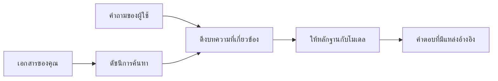

# สอน AI ให้ตอบคำถามตามเอกสารของคุณ:
## ชุดที่ 1: RAG, Azure กับทางเลือกแบบโอเพนซอร์ส และเมื่อต้องใช้การปรับแต่งเฉพาะ

> บทความแรกในชุดปี 2026 ที่กลับมาทบทวนบทเรียนสอน Azure AI Search + Azure OpenAI วิเคราะห์คำถามตามเอกสารจากปี 2023

นำทางชุดบทความ: [หน้าโฮมเก็บต้นฉบับ](../README.md) | ถัดไป: [ชุดที่ 2 - สร้างระบบ RAG แบบโอเพนซอร์สในเครื่องตั้งแต่ต้นจนจบ](./series-2-open-source-rag-end-to-end.md)

## 1. บทนำ - ทบทวนบทเรียน RAG ก่อนหน้า

ในปี 2023 ผมได้ทำงานกับบทเรียนสองบทเกี่ยวกับการสอน ChatGPT ให้ตอบคำถามจากเอกสาร PDF โดยใช้ Azure AI Search และ Azure OpenAI ผมเขียนเวอร์ชัน [LangChain](https://techcommunity.microsoft.com/blog/educatordeveloperblog/teach-chatgpt-to-answer-questions-using-azure-ai-search--azure-openai-lang-chain/3969713) และร่วมเขียนเวอร์ชัน [Semantic Kernel](https://techcommunity.microsoft.com/blog/educatordeveloperblog/teach-chatgpt-to-answer-questions-using-azure-ai-search--azure-openai-semantic-k/3985395) ร่วมกับ [Lee Stott](https://developer.microsoft.com/en-us/advocates/lee-stott) ผู้จัดการหลักฝ่ายสนับสนุน Cloud Advocate ที่ Microsoft ในเวลานั้นแนวคิด "ChatGPT บนข้อมูลของคุณ" ยังคงรู้สึกใหม่สำหรับนักพัฒนาหลายคน บทเรียนนี้ใช้ Azure Blob Storage, Azure AI Search, Azure OpenAI, LangChain, Semantic Kernel และการสืบค้นเวกเตอร์แบบ FAISS เพื่อให้ตอบคำถามจากไฟล์ PDF

บทความก่อนหน้านั้นเน้นไปที่กระบวนการง่าย ๆ แต่สำคัญ: อัปโหลดเอกสาร, ทำดัชนี, สืบค้นเนื้อหาที่เกี่ยวข้อง, และขอให้โมเดลตอบคำถามจากเนื้อหานั้น

ในปี 2026 ระบบนิเวศ RAG เติบโตขึ้นมาก Azure AI Search สนับสนุนรูปแบบการสืบค้นเวกเตอร์และแบบไฮบริดสมัยใหม่แล้ว Azure OpenAI เป็นส่วนหนึ่งของระบบโมเดล Microsoft Foundry ที่กว้างขึ้น และ API v1 ที่ใหม่กว่าใช้ไคลเอนต์ OpenAI มาตรฐานโดยไม่ต้องเปลี่ยนแปลง `api-version` ทุกเดือน ขณะเดียวกันทางเลือกแบบโอเพนซอร์ส เช่น LangGraph, LlamaIndex, Haystack, Qdrant, Milvus, Weaviate, Chroma, Ollama และ vLLM ก็กลายเป็นตัวเลือกที่ใช้งานได้สำหรับระบบ RAG จริง

นี่คือเหตุผลที่ผมอยากกลับมาพูดคุยหัวข้อนี้อีกครั้ง คำถามไม่ใช่แค่ "จะสร้าง RAG ได้อย่างไร?" ตอนนี้มีหลายวิธีที่จะสร้าง และคำถามที่สำคัญกว่าคือ "ควรเลือกสถาปัตยกรรมแบบไหนสำหรับสถานการณ์ของผม?"

แต่ปัญหาหลักยังไม่เปลี่ยนแปลง

โมเดล AI ไม่ได้รู้จักเอกสารของคุณโดยอัตโนมัติ เพื่อสร้างระบบตอบคำถามตามเอกสารที่ใช้งานได้จริง คุณยังต้องการระบบสืบค้น ข้อมูลอ้างอิง การประเมิน และกระบวนการปฏิบัติการที่เชื่อถือได้

บทความนี้ไม่ใช่บทเรียนแบบ end-to-end "แชทกับ PDF" อีกรอบ ผมต้องการเริ่มชุดบทความที่อัปเดตด้วยคำถามที่ผมสนใจมากขึ้นตอนนี้ว่า เมื่อใดควรเลือกสถาปัตยกรรม Azure แบบจัดการ, เมื่อใดควรเลือกสแตก RAG แบบโอเพนซอร์ส และเมื่อใดการปรับแต่งเฉพาะ (fine-tuning) คือสิ่งที่เหมาะสมจริง ๆ

นี่คือบทความแรกในชุดเกี่ยวกับการสร้างระบบ AI ที่อิงกับเอกสาร ในส่วนแรกนี้ เราจะเน้นที่การตัดสินใจด้านสถาปัตยกรรม: ทำไม RAG จึงสำคัญ, เมื่อไหร่บริการที่จัดการบน Azure มีประโยชน์, เมื่อไหร่ทางเลือกแบบโอเพนซอร์สมีเหตุผล และที่ปรับแต่งเฉพาะเข้ามาตรงไหน

หลังจากสร้างและทบทวนระบบตอบคำถามจากเอกสาร ผมสนใจน้อยลงว่าสิ่งใดดูดีที่สุดในเดโม แต่สนใจว่าสถาปัตยกรรมใดอยู่รอดต่อผู้ใช้จริง เอกสารที่เปลี่ยนแปลง การอนุญาต ความล้มเหลว และการบำรุงรักษาได้ดีกว่า

## 2. ทำไม AI ของคุณจึงต้องการระบบสืบค้น

โมเดลภาษาใหญ่ได้รับการฝึกจากข้อมูลสาธารณะและข้อมูลที่มีใบอนุญาตหลากหลาย พวกมันอาจรู้เกี่ยวกับหัวข้อทั่วไปมากมาย แต่ไม่ได้รู้จัก PDF ส่วนตัว นโยบายภายใน ขั้นตอนองค์กร แหล่งข้อมูลงานวิจัย สื่อการเรียนการสอน โน้ตการสนับสนุนลูกค้า หรือเอกสารที่อัปเดตล่าสุดโดยอัตโนมัติ

วิธีคิดง่าย ๆ เกี่ยวกับ RAG คือ แทนที่จะคาดหวังให้โมเดลจำเอกสารทุกฉบับ เราจะให้มันใช้ระบบค้นหา เมื่อผู้ใช้ถามคำถาม ระบบนี้จะค้นหาข้อมูลที่เกี่ยวข้องที่สุดก่อน แล้วให้ข้อมูลเหล่านั้นกับโมเดลเป็นบริบท

เรื่องนี้สำคัญเพราะแหล่งความรู้หลายแห่งในโลกจริงมีความเป็นส่วนตัว เปลี่ยนแปลงเสมอ มีความละเอียดอ่อนเรื่องสิทธิ์ เก็บอยู่ในหลายระบบ เขียนในหลายรูปแบบ และข้อมูลมีขนาดใหญ่เกินกว่าจะใส่ลงในพรอมต์โดยตรง

เช่น ถ้าสถาบันการศึกษา บริษัท หรือทีมวิจัยมีเอกสารภายใน 10,000 ฉบับ โมเดลไม่สามารถตอบคำถามจากเอกสารเหล่านั้นได้อย่างน่าเชื่อถือหากไม่มีระบบสืบค้นส่วนที่เหมาะสมในเวลาที่เหมาะสม

นี่จึงนำไปสู่คำถามทั่วไป:

ทำไมไม่ปรับแต่งโมเดลเลย?

การปรับแต่งเฉพาะ (fine-tuning) อาจมีประโยชน์ แต่โดยทั่วไปไม่ใช่เครื่องมือแรกที่ถูกต้องสำหรับความรู้จากเอกสาร หากความรู้เปลี่ยนแปลงบ่อย หากการอ้างอิงมีความสำคัญ หรือหากสิทธิ์การเข้าถึงเป็นเรื่องสำคัญ RAG มักเป็นจุดเริ่มต้นที่ดีกว่า ส่วนการปรับแต่งเหมาะกับการสอนพฤติกรรม สไตล์ รูปแบบผลลัพธ์ และรูปแบบงานมากกว่า

## 3. สถาปัตยกรรม RAG ในทางปฏิบัติ

ลองนึกภาพว่าคุณกำลังสร้างผู้ช่วย AI สำหรับโรงเรียน ผู้ช่วยต้องตอบคำถามจาก PDF นโยบาย คู่มือหลักสูตร หน้า FAQ ภายใน และประกาศที่อัปเดตล่าสุด

ถ้านักเรียนถามว่า "ผมสามารถใช้ AI สร้างสรรค์ทำงานส่งท้ายเทอมได้ไหม?" ระบบไม่ควรตอบจากความทรงจำทั่วไปของโมเดล แต่ควรค้นหานโยบายโรงเรียนที่เกี่ยวข้อง ดึงส่วนที่พูดถึงการใช้ AI แล้วถามโมเดลเพื่อให้ตอบโดยใช้หลักฐานจากส่วนนี้

นี่คือ RAG ในทางปฏิบัติ

ในภาพรวม คุณอาจคิดให้เป็นการไหลของข้อมูลแบบนี้:

รายละเอียดอาจซับซ้อนขึ้น แต่แนวคิดพื้นฐานง่าย ๆ คือ โมเดลไม่ตอบคำถามคนเดียว มันตอบคำถามโดยใช้หลักฐานที่สืบค้น

อันดับแรก เอกสารถูกนำเข้าจากระบบเก็บข้อมูลเช่น Azure Blob Storage, SharePoint, GitHub หรือ CMS ภายใน จากนั้นระบบจะแปลงให้อยู่ในรูปข้อความ โดยเก็บโครงสร้างที่เป็นประโยชน์เช่น หัวข้อ หมายเลขหน้า ตาราง ส่วนต่าง ๆ และที่มา

ขั้นตอนถัดไป เนื้อหาจะถูกแบ่งเป็นชิ้นเล็ก ๆ ขั้นตอนนี้ดูเหมือนง่ายแต่ถือเป็นส่วนสำคัญที่สุดของระบบ หากชิ้นเล็กเกินไป อาจสูญเสียบริบทรอบข้าง หากชิ้นใหญ่เกินไป อาจรวมข้อมูลที่ไม่เกี่ยวข้องและทำให้การสืบค้นไม่แม่นยำ

หลังจากแบ่งชิ้น ระบบจะสร้าง embedding แล้วจัดเก็บในดัชนีที่ค้นหาได้พร้อมข้อความต้นฉบับและข้อมูลเมตา เช่น ชื่อไฟล์ หมายเลขหน้า สิทธิ์ เวอร์ชันเอกสาร และ URL แหล่งที่มา

เมื่ผู้ใช้ถามคำถาม ระบบจะสืบค้นชิ้นข้อมูลที่มีศักยภาพโดยใช้การค้นหาคำสำคัญ การค้นหาแบบเวกเตอร์ หรือการค้นหาแบบไฮบริด จากนั้นระบบจัดอันดับซ้ำเพื่อจัดเรียงชิ้นข้อมูลเหล่านั้นใหม่ให้หลักฐานที่มีประโยชน์ที่สุดอยู่ข้างบน

สุดท้าย โมเดลจะได้รับคำถามพร้อมหลักฐานที่สืบค้น คำตอบควรอิงตามหลักฐานนั้นและคืนข้อมูลอ้างอิงเพื่อให้ผู้ใช้ตรวจสอบแหล่งที่มาได้

ประเด็นสำคัญคือ RAG ไม่ใช่แค่ "ใส่ PDF ลงในฐานข้อมูลเวกเตอร์" คุณภาพคำตอบขึ้นอยู่กับกระบวนการทั้งหมด: การแปลง การแบ่งชิ้น การสืบค้น การจัดอันดับซ้ำ การขอข้อมูล อ้างอิง และการประเมินผล

นี่คือเหตุผลที่โครงสร้างของเอกสารสำคัญ ใน PDF หัวเรื่อง ตาราง คำอธิบายท้ายหน้า หรือขอบเขตหน้า สามารถเปลี่ยนความหมายของข้อความได้ บน Azure สกิล Document Layout ใช้ความสามารถ Document Intelligence ในการผลิตผลลัพธ์ที่รับรู้โครงสร้าง ซึ่งช่วยปรับปรุงคุณภาพการแบ่งชิ้นและการสืบค้นสำหรับระบบ RAG

## 4. มีอะไรเปลี่ยนไปตั้งแต่ปี 2023?

บทเรียนปี 2023 เป็นจุดเริ่มต้นที่ดีในเวลานั้น:

- Azure Blob Storage เก็บไฟล์ PDF
- Azure AI Search สร้างดัชนีเนื้อหา
- LangChain เชื่อมต่อการสืบค้นกับ Azure OpenAI
- FAISS ใช้งานเป็นฐานข้อมูลเวกเตอร์พื้นฐานในเครื่อง
- ตัวอย่างใช้โมเดล `gpt-35-turbo` และ `text-embedding-ada-002`

ในปี 2026 เวอร์ชันสมัยใหม่ควรสะท้อนหลายการเปลี่ยนแปลง

อย่างแรก การสืบค้นเติบโตขึ้นมาก ในปี 2023 หลายเดโมใช้แค่การค้นหาเวกเตอร์โดยเปรียบเทียบความคล้าย วันนี้ การสืบค้นแบบไฮบริดมักเป็นจุดเริ่มต้นสำหรับระบบตอบคำถามจากเอกสารอย่างจริงจัง Azure AI Search สนับสนุนไฮบริดเสิร์ชโดยผสมผสานคำค้นและการค้นหาเวกเตอร์ในคำขอเดียว และรวมผลลัพธ์ด้วย Reciprocal Rank Fusion พร้อมทั้ง Semantic ranker สามารถจัดอันดับซ้ำด้านข้อความจากผลการค้นหาแบบเต็มข้อความ เวกเตอร์ และไฮบริด

อย่างที่สอง การนำเข้าข้อมูลซับซ้อนขึ้น แทนที่จะแบ่งเอกสารทุกฉบับด้วยโค้ดแอป Azure AI Search สนับสนุนการแปลงเวกเตอร์ในตัวสำหรับการแบ่งชิ้น สร้าง embedding และแปลงเวกเตอร์เวลาค้นหา สำหรับงานหนักด้าน PDF และเอกสาร สกิล Document Layout จะเก็บโครงสร้างได้มากกว่าการแบ่งชิ้นขนาดคงที่

อย่างที่สาม การจัดการกระบวนการสำคัญขึ้น ส่วนที่ยากมักไม่ใช่การเรียก API ของ LLM แต่คือการจัดการความล้มเหลว การลองใหม่ การสืบค้นที่ล้าสมัย คุณภาพชิ้นข้อมูล กระบวนการยาว การตรวจสอบของมนุษย์ และการประเมินผลในระดับใหญ่ จุดนี้เครื่องมือโฟกัสที่กระบวนการเช่น LangGraph, workflow ของ LlamaIndex, ระบบงานของ Haystack และแพลตฟอร์มประเมินผล-สังเกตการณ์มีบทบาทมากกว่าการเรียงลำดับเชนแบบเชิงเส้น

อย่างที่สี่ การประเมินผลไม่ใช่ตัวเลือกอีกต่อไป เดโมดูน่าประทับใจด้วยคำถามเดียว ระบบจริงต้องมีชุดทดสอบ ตรวจสอบความถดถอย ตัวชี้วัดการสืบค้น ตรวจสอบความเป็นจริง และการตรวจสอบ การไม่มีการประเมินทำให้ยากจะรู้ว่าระบบดีขึ้นหรือแค่เปลี่ยนไป

## 5. การเลือกสแตก RAG ระหว่าง Azure กับโอเพนซอร์ส

ผมไม่คิดว่าคำถามที่ถูกต้องคือ "Azure ดีกว่าโอเพนซอร์สไหม?" หรือ "โอเพนซอร์สดีกว่า Azure ไหม?"

คำถามที่เหมาะสมคือ: คุณกำลังสร้างระบบแบบไหน ใครจะเป็นผู้ดูแล รู้ข้อจำกัดอะไรบ้าง และโหมดของความล้มเหลวแบบใดที่ไม่สามารถยอมรับได้?

ตอนเริ่มสร้างตัวอย่าง QA จากเอกสาร ผมสนใจว่าการสืบค้นทำงานไหม อัปโหลด PDF ค้นหา และสร้างคำตอบได้ไหม นั่นเป็นจุดเริ่มต้นที่สมเหตุสมผล

หลังจากผ่านหลายกระบวนการ AI ที่สมจริงขึ้น การประเมินของผมเปลี่ยนไป ผมดู 4 ด้านก่อนเลือกสแตก RAG:

- ตัวตนและสิทธิ์การเข้าถึง
- คุณภาพการสืบค้น
- ความน่าเชื่อถือของกระบวนการ
- ความรับผิดชอบด้านปฏิบัติการ

ทั้ง 4 ข้อนี้ให้ข้อมูลมากกว่าการวัดผลโมเดลเพียงอย่างเดียว

สถาปัตยกรรมบน Azure มักเหมาะเมื่อการผนวกรวมองค์กรเป็นเรื่องยาก หากทีมพึ่งพา Microsoft Entra ID, Microsoft 365, Azure Storage, เครือข่ายส่วนตัว, RBAC และ Azure monitoring อยู่แล้ว Azure AI Search และ Azure OpenAI ช่วยลดความซับซ้อนด้านปฏิบัติการมาก ในสภาพแวดล้อมนี้ Azure ไม่ได้เป็นแค่ API โมเดล แต่เป็นระบบรอบตัว: ตัวตน การกำกับดูแล การจัดการการค้นหา การผนวกรวมด้านความปลอดภัย การสนับสนุน และการดำเนินงานที่คุ้นเคย

สถาปัตยกรรมโอเพนซอร์สมักเหมาะเมื่อความยืดหยุ่นเป็นเรื่องยาก ถ้าทีมต้องการการอนุมานในเครื่อง, ความสามารถพกพาบนคลาวด์, ท่อสืบค้นที่กำหนดเอง, การจัดอันดับซ้ำพิเศษ หรือการควบคุมฐานข้อมูลเวกเตอร์และชั้นให้บริการโมเดลโดยตรง สแตกโอเพนซอร์สอาจเหมาะกว่า ข้อแลกเปลี่ยนคือทีมต้องรับผิดชอบงานความน่าเชื่อถือมากขึ้น เช่น การสำรองข้อมูล การขยายระบบ ความหน่วง การโยกย้าย การตรวจสอบ และความปลอดภัย

ในทางปฏิบัติ ระบบ AI หลายระบบในผลิตจริงไม่ใช่แค่คลาวด์เนทีฟหรือโอเพนซอร์สล้วน พวกมันมักเป็นระบบไฮบริดที่สมดุลระหว่างความเรียบง่ายในการปฏิบัติการ ความพกพา การกำกับดูแล และความยืดหยุ่นด้านวิศวกรรม

เช่น ผมก็ไม่แปลกใจถ้าเห็นระบบใช้งาน Azure OpenAI ในการเข้าถึงโมเดล, LangGraph สำหรับจัดการ workflow, โฮสต์บน Azure, และฐานข้อมูลเวกเตอร์โอเพนซอร์สสำหรับความต้องการสืบค้นเฉพาะ นี่ไม่ใช่ความไม่สอดคล้องทางสถาปัตยกรรม แต่เป็นการเลือกบริการที่จัดการและควบคุมวิศวกรรมที่เหมาะสมสำหรับส่วนต่าง ๆ ของระบบ

ผมชอบสถาปัตยกรรมไฮบริดเมื่อแพลตฟอร์มที่จัดการแก้ปัญหาองค์กรสำคัญได้ ขณะเดียวกันส่วนประกอบโอเพนซอร์สช่วยให้ทีมมีความยืดหยุ่นตรงจุดที่จำเป็นจริง ๆ

## 6. คู่มือการตัดสินใจเชิงปฏิบัติ

นี่คือตารางตัดสินใจที่ผมจะใช้กับทีมก่อนเลือกสแตก RAG:

| ด้านการตัดสินใจ | สแตกที่จัดการบน Azure แข็งแกร่งกว่าเมื่ิอ... | สแตกโอเพนซอร์ส แข็งแกร่งกว่าเมื่ิอ... |
| --- | --- | --- |
| ตัวตนและการเข้าถึง | Entra ID, RBAC, managed identity, และสิทธิ์ระดับองค์กรมีบทบาทสำคัญ | ระบบยืนยันตัวตนแบบกำหนดเอง, ตัวตนที่ไม่ใช่ Microsoft, หรือกฎการเข้าถึงเฉพาะแอปเป็นหลัก |
| ปฏิบัติการ | ทีมต้องการโครงสร้างพื้นฐานจัดการ, การสนับสนุน, SLA, และการเริ่มต้นใช้งานที่ง่ายขึ้น | ทีมสามารถดูแลฐานข้อมูลเวกเตอร์, ให้บริการโมเดล, สำรองข้อมูล, และขยายระบบได้ |
| การสืบค้น | การค้นหาแบบไฮบริด, การจัดอันดับเชิงความหมาย, ตัวกรอง และการค้นหาข้อมูลเมตาครอบคลุมความต้องการส่วนใหญ่ | ทีมต้องการท่อสืบค้นกำหนดเอง, การจัดอันดับซ้ำเฉพาะทาง หรือการทำดัชนีสำหรับการทดลอง |
| ความพกพา | ระบบนิเวศ Azure ตอบโจทย์หรือเป็นที่ต้องการ | การหลีกเลี่ยงการล็อกกับคลาวด์เป็นความจำเป็น |
| การอนุมาน | การกำกับดูแล Azure OpenAI, เครือข่าย และการควบคุมระดับองค์กรมีความสำคัญ | ต้องการการอนุมานในเครื่อง, โมเดลเฉพาะ, หรือการให้บริการเซิร์ฟเวอร์ที่โฮสต์เอง |
| ค่าใช้จ่าย | ลดงานทางวิศวกรรมและปฏิบัติการสำคัญกว่าการปรับโครงสร้างพื้นฐาน | ขนาดระบบใหญ่พอที่จะคุ้มกับการปรับแต่งโครงสร้างพื้นฐานอย่างระมัดระวัง |
| การทดลอง | ความมั่นคงและการผนวกรวมองค์กรสำคัญกว่าการเปลี่ยนส่วนประกอบบ่อย ๆ | ทีมทดลองเร็วกับเอเจนต์, เครื่องมือ, หน่วยความจำ และกระบวนการสืบค้น |

กฎง่าย ๆ ของผมคือ:

- เริ่มด้วย Azure เมื่อการผนวกรวมองค์กร ความปลอดภัย และความเรียบง่ายในการปฏิบัติการเป็นความเสี่ยงหลัก
- เริ่มด้วยโอเพนซอร์สเมื่ ความพกพา การปรับแต่ง หรือการควบคุมในเครื่องเป็นความเสี่ยงหลัก
- ใช้สแตกไฮบริดเมื่อทั้งสองข้อเป็นจริง

นี่คือเหตุผลที่ผมไม่เริ่มชุด RAG ปี 2026 ด้วยโค้ดก่อน โค้ดสำคัญ แต่การเลือกสถาปัตยกรรมมาก่อนการนำไปใช้งาน เดโมง่าย ๆ อาจซ่อนการตัดสินใจที่ยาก ระบบ RAG ที่ดีทำให้การตัดสินใจเหล่านั้นชัดเจน

## 7. ที่มาของการปรับแต่งเฉพาะ (Fine-Tuning)

การปรับแต่งเฉพาะมักพูดถึงพร้อมกับ RAG แต่ผมคิดว่าควรแยกสองเรื่องนี้อย่างชัดเจน

RAG มักเป็นทางเลือกที่ดีกว่าเมื่อระบบต้องการความรู้ที่สดใหม่ เป็นส่วนตัว มีความละเอียดอ่อนเรื่องสิทธิ์ หรือข้อมูลต้องอิงแหล่งที่มาชัดเจน หากคำตอบควรอ้างอิงเอกสาร สะท้อนการอัปเดตล่าสุด หรือต้องเคารพกฎสิทธิ์เฉพาะผู้ใช้ การสืบค้นควรเป็นส่วนหนึ่งของสถาปัตยกรรม
การปรับแต่งโมเดลเฉพาะทางมีประโยชน์มากขึ้นเมื่อความรู้ไม่ใช่ปัญหาหลัก มันสามารถช่วยเมื่อคุณต้องการให้โมเดลปฏิบัติตามรูปแบบผลลัพธ์เฉพาะ, ตรงกับสไตล์การตอบสนองที่เฉพาะด้าน, ทำงานที่เสถียรได้อย่างสม่ำเสมอมากขึ้น หรือ ลดปริมาณคำสั่งที่จำเป็นในทุกคำถาม

ในทางปฏิบัติ ทั้งสองสามารถทำงานร่วมกันได้ ผู้ช่วยสนับสนุนอาจใช้ RAG เพื่อดึงนโยบายล่าสุด ในขณะที่โมเดลที่ปรับแต่งเฉพาะทางจะเรียนรู้โครงสร้างและน้ำเสียงคำตอบที่บริษัทต้องการ

ความผิดพลาดคือการมองว่าการปรับแต่งโมเดลเฉพาะทางเป็นตัวแทนของการจัดเก็บเอกสาร มันไม่ได้ลดความจำเป็นในการค้นคืนข้อมูลเมื่อระบบต้องตอบจากข้อมูลใหม่ ส่วนตัว หรือข้อมูลที่มีการจำกัดสิทธิ์

## 8. จุดที่ซีรีส์นี้จะไปต่อ

บทความนี้เป็นชั้นของการตัดสินใจ ก่อนที่จะเขียนโค้ด ผมต้องการทำให้ข้อแลกเปลี่ยนชัดเจน: RAG กับ การปรับแต่งเฉพาะทาง, Azure กับ โอเพนซอร์ส, บริการจัดการกับการควบคุมการดำเนินงาน

ก่อนย้ายไปสู่การใช้งานจริง ผมอยากฝากประเด็นหนึ่งไว้ที่นี่ว่าในหลายระบบ AI สำหรับองค์กร โมเดลเป็นเพียงส่วนประกอบเดียว คุณภาพการค้นคืน การประสานงาน การประเมิน สิทธิ์ และความน่าเชื่อถือในการดำเนินงาน มักเป็นสิ่งที่กำหนดว่าว่าระบบจะประสบความสำเร็จเกินกว่าขั้นตอนสาธิตหรือไม่

ในส่วนต่อไปของซีรีส์นี้ ผมวางแผนจะเจาะลึกด้านปฏิบัติของระบบ AI ที่อิงเอกสาร: เริ่มต้นด้วยการสร้างเวิร์กโฟลว์ RAG โอเพนซอร์สในเครื่องก่อน จากนั้นสร้างสถานการณ์เดียวกันด้วย Azure AI Search และ Azure OpenAI และจากนั้นประเมินว่าระบบทำงานได้จริงหรือไม่

ผมอาจปรับลำดับเนื้อหาเมื่อซีรีส์ดำเนินไป แต่วัตถุประสงค์ยังคงเหมือนเดิม คือ การก้าวข้ามขั้นตอนสาธิตง่ายๆ และแสดงวิธีคิดเกี่ยวกับระบบ RAG ที่สามารถดูแล ประเมิน และดำเนินงานได้

## 9. เอกสารอ้างอิงและแหล่งข้อมูล

บทเรียนต้นฉบับ:

- [สอน ChatGPT ตอบคำถาม: การใช้ Azure AI Search & Azure OpenAI (Lang Chain)](https://techcommunity.microsoft.com/blog/educatordeveloperblog/teach-chatgpt-to-answer-questions-using-azure-ai-search--azure-openai-lang-chain/3969713)
- [สอน ChatGPT ตอบคำถาม: การใช้ Azure AI Search & Azure OpenAI (Semantic Kernel)](https://techcommunity.microsoft.com/blog/educatordeveloperblog/teach-chatgpt-to-answer-questions-using-azure-ai-search--azure-openai-semantic-k/3985395)

Azure:

- [เวอร์ชัน REST API ของ Azure AI Search](https://learn.microsoft.com/en-us/rest/api/searchservice/search-service-api-versions)
- [การค้นหาผสมใน Azure AI Search](https://learn.microsoft.com/en-us/azure/search/hybrid-search-how-to-query)
- [การแปลงเวกเตอร์แบบบูรณาการใน Azure AI Search](https://learn.microsoft.com/en-us/azure/search/vector-search-integrated-vectorization)
- [ทักษะการจัดวางเอกสารใน Azure AI Search](https://learn.microsoft.com/en-us/azure/search/cognitive-search-skill-document-intelligence-layout)
- [การแบ่งส่วนและแปลงเวกเตอร์ตามการจัดวางเอกสาร](https://learn.microsoft.com/en-us/azure/search/search-how-to-semantic-chunking)
- [การจัดอันดับเชิงความหมายใน Azure AI Search](https://learn.microsoft.com/en-us/azure/search/semantic-search-overview)
- [วงจรชีวิตเวอร์ชัน API ของ Azure OpenAI / Microsoft Foundry](https://learn.microsoft.com/en-us/azure/foundry/openai/api-version-lifecycle)
- [โมเดล Foundry ที่จำหน่ายโดย Azure](https://learn.microsoft.com/en-us/azure/foundry/foundry-models/concepts/models-sold-directly-by-azure)
- [ข้อควรพิจารณาในการปรับแต่งโมเดล Microsoft Foundry](https://learn.microsoft.com/en-us/azure/foundry/openai/concepts/fine-tuning-considerations)
- [ความสามารถในการสังเกตการณ์ของ Microsoft Foundry](https://learn.microsoft.com/en-us/azure/foundry/concepts/observability)
- [การประเมินใน Microsoft Foundry](https://learn.microsoft.com/en-us/azure/foundry/how-to/evaluate-generative-ai-app)

โอเพนซอร์ส:

- [เอกสาร LangGraph](https://docs.langchain.com/oss/python/langgraph/overview)
- [เอกสาร LlamaIndex](https://developers.llamaindex.ai/python/framework/)
- [เอกสาร Haystack](https://docs.haystack.deepset.ai/)
- [เอกสาร Qdrant](https://qdrant.tech/documentation/overview/)
- [เอกสาร Milvus](https://milvus.io/docs/overview.md)
- [เอกสาร Weaviate](https://docs.weaviate.io/weaviate/current/)
- [เอกสาร Chroma](https://docs.trychroma.com/docs/overview/introduction)
- [การฝังข้อมูล Ollama](https://docs.ollama.com/capabilities/embeddings)
- [เซิร์ฟเวอร์ vLLM ที่รองรับ OpenAI](https://docs.vllm.ai/en/latest/serving/openai_compatible_server.html)
- [โมเดล BGE embedding](https://huggingface.co/BAAI/bge-large-en-v1.5)
- [โมเดล E5 embedding](https://huggingface.co/intfloat/e5-large-v2)
- [โมเดล Instructor embedding](https://huggingface.co/hkunlp/instructor-large)

ต่อไป: [ซีรีส์ 2 - สร้างระบบ RAG โอเพนซอร์สในเครื่องครบวงจร](./series-2-open-source-rag-end-to-end.md)

---

<!-- CO-OP TRANSLATOR DISCLAIMER START -->
**ปฏิเสธความรับผิดชอบ**:
เอกสารนี้ได้รับการแปลโดยใช้บริการแปลภาษา AI [Co-op Translator](https://github.com/Azure/co-op-translator) ขณะที่เราพยายามให้ความถูกต้อง โปรดทราบว่าการแปลโดยอัตโนมัติอาจมีข้อผิดพลาดหรือความไม่ถูกต้อง เอกสารต้นฉบับในภาษาต้นทางควรถูกพิจารณาเป็นแหล่งข้อมูลที่เชื่อถือได้ สำหรับข้อมูลที่สำคัญ แนะนำให้ใช้การแปลโดยมนุษย์มืออาชีพ เราไม่รับผิดชอบต่อความเข้าใจผิดหรือการตีความที่ผิดพลาดที่เกิดขึ้นจากการใช้การแปลนี้
<!-- CO-OP TRANSLATOR DISCLAIMER END -->