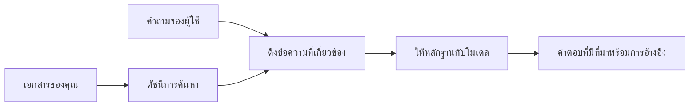

# สอน AI ให้ตอบคำถามตามเอกสารของคุณ:
## ชุดที่ 1: RAG, Azure vs ตัวเลือกแบบโอเพนซอร์ส, และเมื่อใดที่การปรับแต่งแบบละเอียดเหมาะสม

> บทความแรกในชุดปี 2026 ที่กลับมาทบทวนบทแนะนำการใช้งาน Azure AI Search + Azure OpenAI สำหรับการถามตอบเอกสารในปี 2023 ของผม

## 1. บทนำ - ทบทวนบทแนะนำ RAG ก่อนหน้า

ในปี 2023 ผมทำงานเกี่ยวกับบทแนะนำสองชิ้นเกี่ยวกับการสอน ChatGPT ให้ตอบคำถามจากเอกสาร PDF โดยใช้ Azure AI Search และ Azure OpenAI ผมเขียน [เวอร์ชัน LangChain](https://techcommunity.microsoft.com/blog/educatordeveloperblog/teach-chatgpt-to-answer-questions-using-azure-ai-search--azure-openai-lang-chain/3969713) และยังร่วมเขียนเวอร์ชันคู่ขนาน [Semantic Kernel](https://techcommunity.microsoft.com/blog/educatordeveloperblog/teach-chatgpt-to-answer-questions-using-azure-ai-search--azure-openai-semantic-k/3985395) กับ [Lee Stott](https://developer.microsoft.com/en-us/advocates/lee-stott) ผู้จัดการคลาวด์แอดโวเคตหลักที่ Microsoft ขณะนั้น แนวคิดเรื่อง "ChatGPT บนข้อมูลของคุณ" ยังรู้สึกใหม่สำหรับนักพัฒนาหลายคน บทแนะนำใช้ Azure Blob Storage, Azure AI Search, Azure OpenAI, LangChain, Semantic Kernel และการค้นคืนเวกเตอร์สไตล์ FAISS เพื่อให้ตอบคำถามจากไฟล์ PDF

บทความก่อนหน้ามุ่งเน้นที่เวิร์กโฟลว์ง่ายๆ แต่สำคัญ: อัปโหลดเอกสาร, ทำดัชนี, ค้นคืนเนื้อหาที่เกี่ยวข้อง แล้วถามโมเดลเพื่อให้ตอบตามเนื้อหานั้น

ในปี 2026 ระบบนิเวศ RAG เติบโตอย่างมาก Azure AI Search รองรับรูปแบบเวกเตอร์และไฮบริดสมัยใหม่แล้ว Azure OpenAI เป็นส่วนหนึ่งของระบบนิเวศ Microsoft Foundry Models และ API v1 ใหม่สามารถใช้ไคลเอนต์ OpenAI มาตรฐานโดยไม่ต้องเปลี่ยน `api-version` รายเดือน ในขณะเดียวกันตัวเลือกโอเพนซอร์สอย่าง LangGraph, LlamaIndex, Haystack, Qdrant, Milvus, Weaviate, Chroma, Ollama และ vLLM กลายเป็นทางเลือกที่ใช้งานได้จริงสำหรับระบบ RAG จริงจัง

นั่นคือเหตุผลที่ผมอยากกลับมาพูดคุยหัวข้อนี้อีกครั้ง คำถามไม่ใช่แค่ "ฉันจะสร้าง RAG ยังไง?" อีกต่อไป แต่มีหลายวิธีในการสร้าง และคำถามที่สำคัญกว่าคือ "สถาปัตยกรรมแบบไหนที่เหมาะกับสถานการณ์ของฉัน?"

แต่ปัญหาหลักยังไม่เปลี่ยนแปลง

โมเดล AI ไม่ได้รู้จักเอกสารของคุณโดยอัตโนมัติ เพื่อสร้างระบบถามตอบจากเอกสารที่มีประโยชน์ คุณยังต้องมีการค้นคืนที่เชื่อถือได้ การอิงข้อมูล การประเมินผล และเวิร์กโฟลว์การดำเนินงาน

บทความนี้ไม่ใช่บทแนะนำ "แชทกับ PDF" แบบครบวงจรอีกบทหนึ่ง ผมอยากเริ่มชุดอัปเดตนี้ด้วยคำถามที่ผมให้ความสำคัญมากขึ้น: เมื่อใดที่ควรเลือกใช้สถาปัตยกรรมแบบจัดการของ Azure เมื่อใดที่เลือกใช้สแตก RAG แบบโอเพนซอร์ส และเมื่อใดที่การปรับแต่งแบบละเอียดเหมาะสมจริงๆ?

นี่คือบทความแรกในชุดเกี่ยวกับการสร้างระบบ AI ที่อิงกับเอกสาร ในส่วนแรกนี้เราจะโฟกัสที่การตัดสินใจด้านสถาปัตยกรรม: ทำไม RAG ถึงสำคัญ เมื่อไรที่บริการจัดการบน Azure มีประโยชน์ เมื่อใดที่ตัวเลือกโอเพนซอร์สเหมาะสม และการปรับแต่งแบบละเอียดเข้ากันได้อย่างไร

หลังจากสร้างและทบทวนระบบถามตอบเอกสาร ผมสนใจน้อยลงในเครื่องมือที่ดูดีในการสาธิต และสนใจมากขึ้นในสถาปัตยกรรมที่ผ่านการใช้งานจริง, เอกสารที่เปลี่ยนแปลง, สิทธิ์การเข้าถึง, ความล้มเหลว และการบำรุงรักษา

## 2. ทำไม AI ของคุณต้องมีระบบค้นหา

โมเดลภาษาใหญ่ฝึกบนข้อมูลสาธารณะและได้รับอนุญาตในวงกว้าง พวกมันอาจรู้มากเกี่ยวกับหัวข้อทั่วไป แต่ไม่ได้รู้จัก PDF ส่วนตัวของคุณ นโยบายภายใน ขั้นตอนองค์กร ห้องสมุดวิจัย วัสดุห้องเรียน บันทึกสนับสนุนลูกค้า หรือเอกสารที่อัปเดตล่าสุดโดยอัตโนมัติ

วิธีคิดง่ายๆ เกี่ยวกับ RAG คือ แทนที่จะหวังให้โมเดลจำเอกสารทั้งหมด เราให้มันใช้ระบบค้นหา เมื่อผู้ใช้ถามคำถาม ระบบจะค้นหาข้อมูลที่เกี่ยวข้องที่สุดก่อน แล้วส่งข้อมูลเหล่านั้นไปให้โมเดลเป็นบริบท

เรื่องนี้สำคัญเพราะแหล่งความรู้จริงจำนวนมากเป็นข้อมูลส่วนตัว เปลี่ยนแปลงตลอดเวลา ต้องระมัดระวังเรื่องสิทธิ์เก็บในหลายระบบ เขียนในฟอร์แมตต่างๆ และใหญ่เกินกว่าที่จะใส่เข้าไปในพรอมต์โดยตรง

เช่น ถ้าโรงเรียน บริษัท หรือทีมวิจัยมีเอกสารภายใน 10,000 ฉบับ โมเดลจะตอบจากเอกสารเหล่านั้นอย่างน่าเชื่อถือไม่ได้ เว้นแต่ระบบจะดึงส่วนที่เหมาะสมในเวลาที่เหมาะสมได้

นี่ทำให้เกิดคำถามที่พบบ่อย:

ทำไมไม่ปรับแต่งโมเดลโดยตรงไปเลย?

การปรับแต่งละเอียดอาจมีประโยชน์ แต่โดยมากไม่ใช่เครื่องมือแรกที่เหมาะกับความรู้ในเอกสาร หากข้อมูลเปลี่ยนบ่อย มีความสำคัญเรื่องการอ้างอิง หรือเรื่องสิทธิ์เข้าถึง RAG มักจะเป็นจุดเริ่มต้นที่ดีกว่า การปรับแต่งละเอียดเหมาะกับการสอนพฤติกรรม สไตล์ รูปแบบผลลัพธ์ และรูปแบบงาน

## 3. สถาปัตยกรรม RAG ในทางปฏิบัติ

ลองนึกภาพคุณสร้างผู้ช่วย AI สำหรับโรงเรียน ผู้ช่วยต้องตอบคำถามจากนโยบาย PDF คู่มือหลักสูตร หน้า FAQ ภายใน และประกาศที่อัปเดตล่าสุด

ถ้านักเรียนถามว่า "ฉันใช้ AI สร้างสรรค์เพื่อทำงานส่งสุดท้ายได้ไหม?" ระบบไม่ควรตอบจากความทรงจำทั่วไปของโมเดล แต่ควรค้นหานโยบายโรงเรียนที่เกี่ยวข้อง ดึงส่วนที่พูดถึงการใช้ AI แล้วถามโมเดลตอบโดยใช้หลักฐานนี้

นั่นคือ RAG ในทางปฏิบัติ

ในภาพรวม คุณสามารถคิดถึงขั้นตอนแบบนี้:

รายละเอียดอาจซับซ้อนกว่านี้ได้ แต่แนวคิดพื้นฐานคือ โมเดลไม่ตอบคำถามด้วยตัวเอง แต่มันตอบโดยใช้หลักฐานที่ดึงมา

เริ่มแรก เอกสารถูกนำเข้าจากระบบจัดเก็บ เช่น Azure Blob Storage, SharePoint, GitHub หรือ CMS ภายใน จากนั้นระบบจะแยกวิเคราะห์เป็นข้อความโดยรักษาโครงสร้างที่มีประโยชน์ เช่น หัวเรื่อง, หมายเลขหน้า, ตาราง, ส่วนต่างๆ และตำแหน่งที่มาของแหล่งข้อมูลไว้

ต่อมา เนื้อหาจะแบ่งเป็นชิ้นๆ ขั้นตอนนี้ดูเหมือนง่าย แต่มีความสำคัญมาก หากชิ้นเล็กเกินไป อาจเสียบริบทรอบข้างไป หากชิ้นใหญ่เกินไป อาจมีข้อมูลที่เกี่ยวข้องน้อยและทำให้การค้นคืนไม่แม่นยำ

หลังจากแบ่งเป็นชิ้น ระบบจะสร้าง embedding และเก็บในดัชนีที่ค้นหาได้พร้อมกับข้อความต้นฉบับและเมตาดาต้า เช่น ชื่อไฟล์, หมายเลขหน้า, สิทธิ์เข้าถึง, เวอร์ชันเอกสาร และ URL แหล่งที่มา

เมื่อผู้ใช้ถามคำถาม ระบบจะค้นหาชิ้นที่เป็นไปได้โดยใช้การค้นหาด้วยคำสำคัญ, การค้นหารูปแบบเวกเตอร์ หรือการค้นหาแบบไฮบริด จากนั้นตัวจัดอันดับซ้ำจะเรียงลำดับชิ้นข้อมูลนั้นใหม่เพื่อให้หลักฐานที่ดีที่สุดอยู่บนสุด

สุดท้าย โมเดลจะได้รับคำถามพร้อมหลักฐานที่ดึงมา คำตอบควรอิงกับหลักฐานนั้นและแสดงการอ้างอิงเพื่อให้ผู้ใช้ตรวจสอบแหล่งข้อมูลได้

จุดสำคัญคือ RAG ไม่ใช่แค่ "ใส่ PDFs ลงในฐานข้อมูลเวกเตอร์" คุณภาพของคำตอบขึ้นกับเวิร์กโฟลว์ทั้งหมด: การแยกวิเคราะห์, การแบ่งชิ้น, การค้นคืน, การจัดอันดับซ้ำ, การตั้งพรอมต์, การอ้างอิง และการประเมินผล

นี่คือเหตุผลว่าทำไมโครงสร้างของเอกสารจึงมีความสำคัญ ใน PDF หัวเรื่อง ตาราง บันทึกท้ายหน้า หรือขอบหน้าสามารถเปลี่ยนความหมายของข้อความ ใน Azure ทักษะ Document Layout ใช้ความสามารถของ Azure Document Intelligence ในการสร้างผลลัพธ์ที่รับรู้โครงสร้าง ซึ่งช่วยปรับปรุงคุณภาพการแบ่งชิ้นและค้นคืนสำหรับระบบ RAG

## 4. อะไรเปลี่ยนไปตั้งแต่ปี 2023?

บทแนะนำปี 2023 เป็นจุดเริ่มต้นที่ดีในเวลานั้น:

- Azure Blob Storage ใช้เก็บไฟล์ PDF
- Azure AI Search ทำดัชนีเนื้อหา
- LangChain เชื่อมการค้นคืนกับ Azure OpenAI
- FAISS ทำงานเป็นที่เก็บเวกเตอร์ท้องถิ่นอย่างง่าย
- ตัวอย่างใช้ `gpt-35-turbo` และ `text-embedding-ada-002`

ในปี 2026 เวอร์ชันสมัยใหม่ควรสะท้อนการเปลี่ยนแปลงหลายอย่าง

อันดับแรก การค้นคืนโตเต็มที่ ในปี 2023 การสาธิตหลายรายการใช้แค่การค้นหาเวกเตอร์แบบความคล้ายกันง่ายๆ วันนี้ การค้นหาแบบไฮบริดมักเป็นจุดเริ่มต้นที่จริงจังสำหรับถามตอบเอกสาร Azure AI Search รองรับการค้นหาแบบไฮบริดโดยรวมคำค้นหาด้วยคำสำคัญและเวกเตอร์ในคำขอเดียว และรวมผลลัพธ์ด้วย Reciprocal Rank Fusion ตัวจัดอันดับความหมายสามารถจัดอันดับข้อความด้านผลลัพธ์เต็มข้อความ, เวกเตอร์, และไฮบริดใหม่

อันดับสอง การนำเข้าข้อมูลซับซ้อนขึ้น แทนที่จะแบ่งเอกสารทุกชิ้นด้วยโค้ดแอปพลิเคชัน Azure AI Search รองรับการเวกเตอร์ไรเซชันแบบรวมเพื่อแบ่งชิ้น, สร้าง embedding และเวกเตอร์ในเวลาคิวรี สำหรับ PDF และงานหนักเอกสาร ทักษะ Document Layout สามารถรักษาโครงสร้างมากกว่าการแบ่งชิ้นขนาดคงที่

อันดับสาม การจัดการเวิร์กโฟลว์มีความสำคัญขึ้นมาก ส่วนที่ยากมักไม่ใช่การเรียก API LLM แต่คือการจัดการความล้มเหลว, การลองใหม่, การค้นคืนเก่า, คุณภาพชิ้น, เวิร์กโฟลว์ระยะยาว, การตรวจสอบของมนุษย์ และการประเมินผลระดับใหญ่ ที่นี่เครื่องมือเวิร์กโฟลว์เช่น LangGraph, เวิร์กโฟลว์ LlamaIndex, ท่อของ Haystack และเครื่องมือระดับแพลตฟอร์มสำหรับประเมินและสังเกตการณ์มีความเกี่ยวข้องมากกว่าการต่อเนื่องเชิงเส้นชุดเดียว

อันดับสี่ การประเมินผลไม่เลือกได้อีกต่อไป การสาธิตดูน่าประทับใจด้วยคำถามเดียว แต่ระบบจริงต้องมีชุดทดสอบ, ตรวจสอบถอยหลัง, เมตริกค้นคืน, เช็คความมีเหตุผล และมอนิเตอร์ หากไม่มีการประเมินจะยากรู้ว่าระบบกำลังดีขึ้นหรือแค่เปลี่ยนไป

## 5. การเลือกใช้งานระหว่าง Azure และสแตก RAG แบบโอเพนซอร์ส

ผมไม่คิดว่าคำถามที่มีประโยชน์คือ "Azure ดีกว่าโอเพนซอร์สไหม?" หรือ "โอเพนซอร์สดีกว่า Azure ไหม?"

คำถามที่มีประโยชน์คือ: คุณกำลังสร้างระบบประเภทใด ใครจะเป็นผู้ใช้งาน ข้อจำกัดมีอะไร และรูปแบบความล้มเหลวใดที่รับไม่ได้?

ตอนผมเริ่มสร้างตัวอย่างถามตอบเอกสาร ผมคิดแค่ว่าการค้นคืนทำงานได้ไหม ผมจะอัปโหลด PDFs, ค้นหาได้ และสร้างคำตอบได้ไหม นั่นเป็นจุดเริ่มต้นที่สมเหตุสมผล

หลังจากทำงานผ่านเวิร์กโฟลว์ AI ที่สมจริงมากขึ้น การประเมินของผมเปลี่ยนไป ผมดูสี่เรื่องก่อนเลือกสแตก RAG:

- ตัวตนและสิทธิ์การเข้าถึง
- คุณภาพการค้นคืน
- ความเชื่อถือได้ของเวิร์กโฟลว์
- ความเป็นเจ้าของการดำเนินงาน

สี่ด้านนี้บอกอะไรได้มากกว่าแค่เบนช์มาร์กโมเดลเพียงอย่างเดียว

สถาปัตยกรรมบน Azure มักสมเหตุสมผลเมื่อการผสานเข้ากับองค์กรเป็นเรื่องยาก หากทีมพึ่งพา Microsoft Entra ID, Microsoft 365, Azure Storage, เครือข่ายส่วนตัว, RBAC และมอนิเตอร์ Azure อยู่แล้ว Azure AI Search และ Azure OpenAI สามารถลดความซับซ้อนในการดำเนินงานได้มาก ในสภาพแวดล้อมนี้ Azure ไม่ใช่แค่ API โมเดล แต่คุณค่าคือระบบโดยรอบ: ตัวตน, การกำกับดูแล, การค้นหาที่จัดการ, การรวมความปลอดภัย, การสนับสนุน และการดำเนินงานที่คุ้นเคย

สถาปัตยกรรมแบบโอเพนซอร์สมักเหมาะเมื่อความยืดหยุ่นเป็นเรื่องยาก หากทีมต้องการการอนุมานในเครื่อง, ความคล่องตัวในคลาวด์, ท่อค้นคืนแบบกำหนดเอง, การจัดอันดับซ้ำเฉพาะทาง หรือการควบคุมโดยตรงกับฐานข้อมูลเวกเตอร์และเลเยอร์การให้บริการโมเดล สแตกโอเพนซอร์สอาจเหมาะกว่า ข้อแลกเปลี่ยนคือทีมต้องรับผิดชอบงานความน่าเชื่อถือมากขึ้น เช่น การสำรองข้อมูล, สเกล, ระยะหน่วง, การโยกย้าย, มอนิเตอร์ และความปลอดภัย

ในทางปฏิบัติ ระบบ AI สำหรับผลิตภัณฑ์หลายระบบไม่ได้เป็นโพรงคลาวด์แท้ๆ หรือต้นแบบโอเพนซอร์สบริสุทธิ์ โดยทั่วไปเป็นระบบไฮบริดที่สมดุลระหว่างความง่ายในการดำเนินงาน, ความคล่องตัว, การกำกับดูแล และความยืดหยุ่นทางวิศวกรรม

เช่น ผมไม่แปลกใจถ้าเห็นระบบใช้ Azure OpenAI เพื่อเข้าถึงโมเดล, LangGraph สำหรับการประสานเวิร์กโฟลว์, โฮสติ้งบน Azure สำหรับการปรับใช้งาน และฐานข้อมูลเวกเตอร์โอเพนซอร์สสำหรับข้อกำหนดการค้นคืนเฉพาะ นั่นไม่ใช่ความขัดแย้งด้านสถาปัตยกรรม แต่มันคือการเลือกระดับบริการที่จัดการและการควบคุมวิศวกรรมที่เหมาะสมในแต่ละส่วนของระบบ

ผมชอบสถาปัตยกรรมไฮบริดเมื่อแพลตฟอร์มที่จัดการแก้ไขปัญหาองค์กรที่สำคัญได้ ในขณะที่ส่วนประกอบโอเพนซอร์สให้ทีมมีความยืดหยุ่นในส่วนที่สำคัญจริงๆ

## 6. คู่มือการตัดสินใจเชิงปฏิบัติ

นี่คือตารางการตัดสินใจที่ผมใช้กับทีมก่อนเลือกสแตก RAG:

| ด้านการตัดสินใจ | สแตกจัดการของ Azure แข็งแกร่งเมื่อ... | สแตกโอเพนซอร์สแข็งแกร่งเมื่อ... |
| --- | --- | --- |
| ตัวตนและการเข้าถึง | Entra ID, RBAC, ตัวตนที่จัดการ และสิทธิ์องค์กรเป็นศูนย์กลาง | ระบบยืนยันตัวตนเฉพาะทาง, ตัวตนที่ไม่ใช่ Microsoft หรือการจัดการสิทธิ์เฉพาะแอปเด่นชัด |
| การดำเนินงาน | ทีมต้องการโครงสร้างจัดการ, การสนับสนุน, SLA, และการเริ่มต้นใช้งานที่ง่ายกว่า | ทีมสามารถดำเนินการฐานข้อมูลเวกเตอร์, บริการโมเดล, การสำรองข้อมูล, และขยายระบบ |
| การค้นคืน | การค้นหาไฮบริด, การจัดอันดับความหมาย, ตัวกรอง และค้นหาด้วยเมตาดาต้าครอบคลุมความต้องการส่วนใหญ่ | ทีมต้องการการค้นคืนแบบกำหนดเอง, การจัดอันดับซ้ำเฉพาะทาง, หรือการทำดัชนีแบบทดลอง |
| ความคล่องตัว | การสอดคล้องกับระบบนิเวศ Azure ยอมรับได้หรือเป็นที่ต้องการ | การหลีกเลี่ยงการล็อกอินในคลาวด์เป็นข้อกำหนดที่เข้มงวด |
| การอนุมาน | การกำกับดูแล Azure OpenAI, เครือข่าย และการควบคุมองค์กรสำคัญ | ต้องการอนุมานในเครื่อง, โมเดลเฉพาะทาง หรือการให้บริการแบบโฮสต์เอง |
| ค่าใช้จ่าย | ลดความพยายามด้านวิศวกรรมและการดำเนินงานสำคัญกว่าการปรับแต่งโครงสร้างพื้นฐาน | ขนาดใหญ่พอที่จะต้องเพิ่มประสิทธิภาพโครงสร้างพื้นฐานอย่างละเอียด |
| การทดลอง | ความเสถียรและการผสานเข้ากับองค์กรสำคัญกว่าการเปลี่ยนส่วนประกอบบ่อยๆ | ทีมเปลี่ยนแปลงอย่างรวดเร็วในตัวแทน, เครื่องมือ, หน่วยความจำ, และเวิร์กโฟลว์ค้นคืน |

กฎง่ายๆ ของผมคือ:

- เริ่มต้นด้วย Azure เมื่อการผสานองค์กร ความปลอดภัย และความง่ายของการดำเนินงานเป็นความเสี่ยงหลัก
- เริ่มต้นด้วยโอเพนซอร์สเมื่อความคล่องตัว การปรับแต่ง หรือการควบคุมในเครื่องเป็นความเสี่ยงหลัก
- ใช้สแตกไฮบริดเมื่อทั้งสองข้อเป็นจริง

นี่คือเหตุผลที่ผมไม่เริ่มชุดบทความ RAG ปี 2026 ด้วยโค้ดก่อน โค้ดสำคัญ แต่การเลือกสถาปัตยกรรมมาก่อนการลงมือทำ การสาธิตอย่างง่ายอาจซ่อนการตัดสินใจที่ยาก ระบบ RAG ที่ดีทำให้การตัดสินใจเหล่านั้นชัดเจน

## 7. การปรับแต่งแบบละเอียดเหมาะกับส่วนไหน

การปรับแต่งละเอียดมักถูกพูดถึงควบคู่กับ RAG แต่ผมคิดว่าสองอย่างนี้ควรแยกจากกัน

RAG มักเป็นทางเลือกที่ดีกว่าเมื่อต้องการความรู้ที่สดใหม่ เป็นส่วนตัว มีความละเอียดอ่อนเรื่องสิทธิ์ หรืออิงแหล่งข้อมูล หากคำตอบควรอ้างอิงเอกสาร สะท้อนการอัปเดตล่าสุด หรือต้องเคารพกฎการเข้าถึงของผู้ใช้เฉพาะ การค้นคืนควรเป็นส่วนหนึ่งของสถาปัตยกรรม

การปรับแต่งแบบละเอียดมีประโยชน์เมื่อความรู้ไม่ใช่ปัญหาหลัก มันช่วยได้เมื่อต้องการให้โมเดลปฏิบัติตามรูปแบบผลลัพธ์เฉพาะ, ตรงกับสไตล์ตอบกลับเฉพาะโดเมน, ทำงานที่มีความเสถียรได้สม่ำเสมอขึ้น หรือช่วยลดจำนวนคำสั่งในแต่ละพรอมต์
ในทางปฏิบัติ ทั้งสองสามารถทำงานร่วมกันได้ ผู้ช่วยสนับสนุนอาจใช้ RAG เพื่อดึงนโยบายล่าสุด ในขณะที่โมเดลที่ผ่านการปรับแต่งจะเรียนรู้โครงสร้างคำตอบและโทนเสียงที่บริษัทต้องการ

ความผิดพลาดคือการถือว่าการปรับแต่งเป็นตัวแทนของร้านเอกสาร ซึ่งไม่ได้ตัดความจำเป็นในการดึงข้อมูลเมื่อระบบต้องตอบจากข้อมูลใหม่ ส่วนตัว หรือข้อมูลที่ต้องได้รับอนุญาต

## 8. จุดต่อไปของซีรีส์นี้

บทความนี้เป็นชั้นการตัดสินใจ ก่อนเขียนโค้ด ผมต้องการทำให้ข้อแลกเปลี่ยนชัดเจน: RAG กับการปรับแต่ง, Azure กับโอเพ่นซอร์ส, บริการที่จัดการกับการควบคุมการปฏิบัติการ

ก่อนที่จะเข้าสู่การนำไปใช้ ผมอยากฝากประเด็นหนึ่งไว้ที่นี่: ในหลายระบบ AI ระดับองค์กร โมเดลเป็นเพียงส่วนประกอบหนึ่ง คุณภาพของการดึงข้อมูล การประสานงาน การประเมินผล สิทธิ์ และความน่าเชื่อถือในการปฏิบัติการ มักเป็นปัจจัยที่กำหนดว่าระบบจะประสบความสำเร็จเกินกว่าระดับการสาธิตหรือไม่

ในส่วนต่อ ๆ ไปของซีรีส์นี้ ผมตั้งใจจะเจาะลึกด้านปฏิบัติของระบบ AI ที่อิงกับเอกสาร: วิธีการสร้างสถาปัตยกรรมบน Azure, การเปรียบเทียบตัวเลือกโอเพ่นซอร์สในทางปฏิบัติ และวิธีการประเมินว่าระบบ RAG นั้นใช้งานได้จริงหรือไม่

ผมอาจปรับลำดับเนื้อหาในระหว่างการพัฒนา แต่เป้าหมายจะเหมือนเดิม คือก้าวข้ามการสาธิตง่าย ๆ และแสดงให้เห็นถึงวิธีคิดเกี่ยวกับระบบ RAG ที่สามารถดูแลประเมิน และปฏิบัติการได้

## 9. เอกสารอ้างอิงและแหล่งข้อมูล

บทเรียนต้นฉบับ:

- [สอน ChatGPT ตอบคำถาม: ใช้ Azure AI Search & Azure OpenAI (Lang Chain)](https://techcommunity.microsoft.com/blog/educatordeveloperblog/teach-chatgpt-to-answer-questions-using-azure-ai-search--azure-openai-lang-chain/3969713)
- [สอน ChatGPT ตอบคำถาม: ใช้ Azure AI Search & Azure OpenAI (Semantic Kernel)](https://techcommunity.microsoft.com/blog/educatordeveloperblog/teach-chatgpt-to-answer-questions-using-azure-ai-search--azure-openai-semantic-k/3985395)

Azure:

- [Azure AI Search REST API versions](https://learn.microsoft.com/en-us/rest/api/searchservice/search-service-api-versions)
- [การค้นหาแบบไฮบริดใน Azure AI Search](https://learn.microsoft.com/en-us/azure/search/hybrid-search-how-to-query)
- [การเวกเตอร์แบบบูรณาการใน Azure AI Search](https://learn.microsoft.com/en-us/azure/search/vector-search-integrated-vectorization)
- [ทักษะการจัดวางเอกสารใน Azure AI Search](https://learn.microsoft.com/en-us/azure/search/cognitive-search-skill-document-intelligence-layout)
- [การแบ่งส่วนและเวกเตอร์ตามการจัดวางเอกสาร](https://learn.microsoft.com/en-us/azure/search/search-how-to-semantic-chunking)
- [การจัดอันดับเชิงความหมายใน Azure AI Search](https://learn.microsoft.com/en-us/azure/search/semantic-search-overview)
- [วงจรชีวิตของ API รุ่น Azure OpenAI / Microsoft Foundry](https://learn.microsoft.com/en-us/azure/foundry/openai/api-version-lifecycle)
- [โมเดล Foundry ที่ขายโดย Azure](https://learn.microsoft.com/en-us/azure/foundry/foundry-models/concepts/models-sold-directly-by-azure)
- [ข้อพิจารณาการปรับแต่ง Microsoft Foundry](https://learn.microsoft.com/en-us/azure/foundry/openai/concepts/fine-tuning-considerations)
- [การสังเกต Microsoft Foundry](https://learn.microsoft.com/en-us/azure/foundry/concepts/observability)
- [การรันประเมินใน Microsoft Foundry](https://learn.microsoft.com/en-us/azure/foundry/how-to/evaluate-generative-ai-app)

โอเพ่นซอร์ส:

- [เอกสาร LangGraph](https://docs.langchain.com/oss/python/langgraph/overview)
- [เอกสาร LlamaIndex](https://developers.llamaindex.ai/python/framework/)
- [เอกสาร Haystack](https://docs.haystack.deepset.ai/)
- [เอกสาร Qdrant](https://qdrant.tech/documentation/overview/)
- [เอกสาร Milvus](https://milvus.io/docs/overview.md)
- [เอกสาร Weaviate](https://docs.weaviate.io/weaviate/current/)
- [เอกสาร Chroma](https://docs.trychroma.com/docs/overview/introduction)
- [Ollama embeddings](https://docs.ollama.com/capabilities/embeddings)
- [vLLM เซิร์ฟเวอร์ที่เข้ากันได้กับ OpenAI](https://docs.vllm.ai/en/latest/serving/openai_compatible_server.html)
- [โมเดลฝังตัว BGE](https://huggingface.co/BAAI/bge-large-en-v1.5)
- [โมเดลฝังตัว E5](https://huggingface.co/intfloat/e5-large-v2)
- [โมเดลฝังตัว Instructor](https://huggingface.co/hkunlp/instructor-large)

---

<!-- CO-OP TRANSLATOR DISCLAIMER START -->
**ปฏิเสธความรับผิดชอบ**:
เอกสารนี้ได้รับการแปลโดยใช้บริการแปลภาษา AI [Co-op Translator](https://github.com/Azure/co-op-translator) ขณะที่เราพยายามให้ความถูกต้อง โปรดทราบว่าการแปลโดยอัตโนมัติอาจมีข้อผิดพลาดหรือความไม่ถูกต้อง เอกสารต้นฉบับในภาษาต้นทางควรถูกพิจารณาเป็นแหล่งข้อมูลที่เชื่อถือได้ สำหรับข้อมูลที่สำคัญ แนะนำให้ใช้การแปลโดยมนุษย์มืออาชีพ เราไม่รับผิดชอบต่อความเข้าใจผิดหรือการตีความที่ผิดพลาดที่เกิดขึ้นจากการใช้การแปลนี้
<!-- CO-OP TRANSLATOR DISCLAIMER END -->