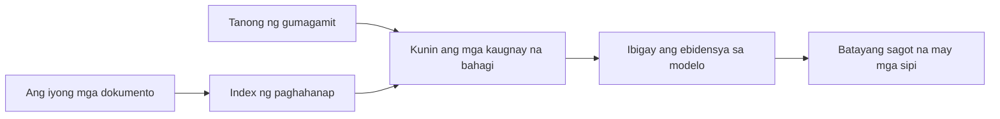

# Turuan ang AI na Sumagot ng Mga Tanong Batay sa Iyong Mga Dokumento:
## Series 1: RAG, Azure vs Open-Source na Mga Alternatibo, at Kailan may Katuturan ang Fine-Tuning

> Ang unang artikulo sa isang serye noong 2026 na muling binibisita ang aking 2023 Azure AI Search + Azure OpenAI dokumentong QA tutorial.

Navigasyon ng serye: [Repository home](../README.md) | Susunod: [Series 2 - Build a Local Open-Source RAG System End to End](./series-2-open-source-rag-end-to-end.md)

## 1. Intro - Muling Pagtingin sa Isang Naunang RAG Tutorial

Noong 2023, nagtrabaho ako sa isang pares ng mga tutorial tungkol sa pagtuturo sa ChatGPT na sumagot ng mga tanong mula sa mga PDF na dokumento gamit ang Azure AI Search at Azure OpenAI. Sinulat ko ang [LangChain na bersyon](https://techcommunity.microsoft.com/blog/educatordeveloperblog/teach-chatgpt-to-answer-questions-using-azure-ai-search--azure-openai-lang-chain/3969713), at nakipag-akda rin ako ng kasamang [Semantic Kernel na bersyon](https://techcommunity.microsoft.com/blog/educatordeveloperblog/teach-chatgpt-to-answer-questions-using-azure-ai-search--azure-openai-semantic-k/3985395) kasama si [Lee Stott](https://developer.microsoft.com/en-us/advocates/lee-stott), isang Principal Cloud Advocate Manager sa Microsoft. Noong panahong iyon, ang ideya ng "ChatGPT sa iyong data" ay tila bago pa para sa maraming developer. Ginamit ng mga tutorial ang Azure Blob Storage, Azure AI Search, Azure OpenAI, LangChain, Semantic Kernel, at FAISS-style vector retrieval upang sumagot ng mga tanong mula sa mga PDF file.

Ang naunang artikulo ay nakatuon sa isang simple ngunit mahalagang workflow: i-upload ang mga dokumento, i-index ang mga ito, kunin ang kaugnay na nilalaman, at tanungin ang modelo na sumagot base sa nilalamang iyon.

Noong 2026, malaki na ang paglago ng ecosystem ng RAG. Sinusuportahan na ngayon ng Azure AI Search ang mga modernong pattern ng vector at hybrid retrieval, bahagi na ang Azure OpenAI ng mas malawak na Microsoft Foundry Models ecosystem, at ang mas bagong v1 API ay maaaring gumamit ng standard na OpenAI client nang hindi nangangailangan ng buwanang `api-version` na mga pagbabago. Kasabay nito, ang mga open-source na opsyon tulad ng LangGraph, LlamaIndex, Haystack, Qdrant, Milvus, Weaviate, Chroma, Ollama, at vLLM ay naging praktikal na mga pagpipilian para sa totoong mga RAG system.

Iyon ang dahilan kung bakit nais kong muling talakayin ang paksang ito. Hindi na ang tanong ay "Paano ako gagawa ng RAG?" Maraming paraan na ngayon upang gawin ito, at mas mahalagang tanong ay "Aling arkitektura ang dapat kong piliin para sa aking sitwasyon?"

Ngunit hindi pa rin nagbago ang pangunahing problema.

Hindi awtomatikong alam ng AI model ang iyong mga dokumento. Upang makabuo ng kapaki-pakinabang na sistema ng tanong-sagot sa dokumento, kailangan mo pa rin ng maaasahang retrieval, grounding, evaluation, at operational workflows.

Ang artikulong ito ay hindi isa pang end-to-end na tutorial ng "chat with PDF." Nais kong simulan ang na-update na serye na ito sa tanong na ngayon ay mas mahalaga para sa akin: kailan dapat kang pumili ng managed Azure architecture, kailan open-source RAG stack ang piliin, at kailan talaga may katuturan ang fine-tuning?

Ito ang unang artikulo sa isang serye tungkol sa pagbuo ng mga AI system na naka-ground sa dokumento. Sa unang bahaging ito, magtutuon tayo sa mga desisyon sa arkitektura: bakit mahalaga ang RAG, kailan kapaki-pakinabang ang Azure-based managed services, kailan may katuturan ang open-source alternatives, at saan pumapasok ang fine-tuning.

Pagkatapos magtayo at muling suriin ang mga document QA system, mas nabawasan ang aking interes sa kung aling tool ang pinakamaganda sa demo at mas naging interesado ako sa kung aling arkitektura ang nakatatagal sa totoong mga gumagamit, pabago-bagong dokumento, mga permiso, pagkabigo, at pagpapanatili.

## 2. Bakit Kailangan ng Iyong AI ang Isang Search System

Ang malalaking language model ay sinanay gamit ang malawak na pampubliko at may lisensyang data. Maaring marami silang alam sa mga pangkalahatang paksa, ngunit hindi nila awtomatikong alam ang iyong mga pribadong PDF, mga panloob na patakaran, mga proseso ng kumpanya, mga archive ng pananaliksik, mga materyales sa silid-aralan, mga tala ng customer support, o mga bagong update na dokumentasyon.

Isang simpleng paraan upang isipin ang RAG ay ganito: sa halip na asahan ang modelo na maalala bawat dokumento, bibigyan natin ito ng isang search system. Kapag may nagtatanong, hahanapin ng sistema ang mga pinaka-kaugnay na piraso ng impormasyon, at ibibigay ang mga ito sa modelo bilang konteksto.

Mahalaga ito dahil maraming totoong pinagkukunan ng kaalaman ang pribado, palaging nagbabago, may sensitibong permiso, nakaimbak sa iba't ibang mga sistema, nakasulat sa maraming format, at masyadong malaki upang direktang ipaste sa prompt.

Halimbawa, kung ang isang paaralan, kumpanya, o pangkat ng pananaliksik ay may 10,000 panloob na dokumento, hindi makakasagot ang modelo mula sa mga dokumentong iyon nang maaasahan maliban kung ang sistema ay nakakakuha ng tamang bahagi sa tamang oras.

Ito ay natural na nagdadala sa isang karaniwang tanong:

Bakit hindi na lang i-fine-tune ang modelo?

Puwedeng maging kapaki-pakinabang ang fine-tuning, ngunit hindi ito kadalasang tamang unang kasangkapan para sa kaalaman sa dokumento. Kung ang kaalaman ay madalas magbago, kung mahalaga ang mga sipi, o kung mahalaga ang mga access permission, kadalasang mas mainam ang RAG bilang panimulang punto. Mas angkop ang fine-tuning para sa pagtuturo ng pag-uugali, estilo, format ng output, at mga pattern sa gawain.

## 3. RAG Architecture sa Praktis

Isipin na nagtatayo ka ng AI assistant para sa isang paaralan. Kailangan ng assistant na sumagot ng mga tanong mula sa mga policy PDF, course guides, internal FAQ pages, at mga bagong anunsyo.

Kung magtatanong ang isang estudyante, "Puwede ko bang gamitin ang generative AI para sa aking final assignment?", hindi dapat sumagot ang sistema mula sa pangkalahatang memorya ng modelo. Dapat muna nitong hanapin ang kaugnay na patakaran ng paaralan, kunin ang seksyon tungkol sa paggamit ng AI, at pagkatapos ay tanungin ang modelo na sumagot gamit ang ebidensyang iyon.

Iyan ang RAG sa praktis.

Sa mataas na antas, maaari mong isipin ang daloy na ganito:

Maaring maging mas sopistikado ang mga detalye, ngunit simple lang ang pangunahing ideya: hindi nag-iisa ang sagot ng modelo. Sumagot ito gamit ang nakuhang ebidensya.

Una, kinukuha mula sa mga storage system tulad ng Azure Blob Storage, SharePoint, GitHub, o internal CMS ang mga dokumento. Pagkatapos ay pinoproseso ng sistema ang mga ito sa teksto habang pinapanatili ang mahalagang istruktura tulad ng mga heading, numero ng pahina, mga talahanayan, mga seksyon, at lokasyon ng pinagmulan.

Susunod, hinahati ang nilalaman sa mga chunk. Simple lang ang tunog ng hakbang na ito, ngunit isa ito sa pinakamahalagang bahagi ng sistema. Kung masyadong maliit ang isang chunk, maaring mawala ang konteksto sa paligid. Kung masyadong malaki naman, maaring isama nito ang mga hindi kaugnay na impormasyon at maging hindi gaanong tumpak ang retrieval.

Pagkatapos ng chunking, gumagawa ang sistema ng embeddings at iniimbak ito sa isang searchable na index kasama ng orihinal na teksto at metadata tulad ng pangalan ng file, numero ng pahina, mga permiso, bersyon ng dokumento, at URL ng pinagmulan.

Kapag may nagtanong, nakakakuha ang sistema ng mga candidate chunks gamit ang keyword search, vector search, o hybrid search. Puwedeng i-rerank ng reranker ang mga chunk na iyon upang ang pinaka-kapaki-pakinabang na ebidensya ay mailagay sa itaas.

Sa huli, natatanggap ng modelo ang tanong at ang nakuha nitong ebidensya. Dapat naka-ground ang sagot sa ebidensyang iyon at magbalik ng mga citation upang ma-inspect ng user ang pinagmulan.

Ang mahalagang punto ay hindi lang basta "ipinapasok ang mga PDF sa vector database" ang RAG. Nakadepende ang kalidad ng sagot sa buong workflow: parsing, chunking, retrieval, reranking, prompting, citation, at evaluation.

Kaya mahalaga ang istruktura ng dokumento. Sa PDF, maaring mabago ng isang heading, talahanayan, footnote, o hangganan ng pahina ang kahulugan ng isang bahagi. Sa Azure, ginagamit ng Document Layout skill ang mga kakayahan ng Azure Document Intelligence layout upang makabuo ng structure-aware output, na nakakapagpahusay ng kalidad ng chunking at retrieval para sa mga RAG system.

## 4. Ano ang Nagbago Mula 2023?

Ang tutorial noong 2023 ay isang magandang panimulang punto sa panahong iyon:

- Nag-imbak ang Azure Blob Storage ng mga PDF file.
- Nag-index ang Azure AI Search ng nilalaman.
- Kinonekta ng LangChain ang retrieval sa Azure OpenAI.
- Gumana ang FAISS bilang simpleng local vector store.
- Ginamit sa halimbawa ang `gpt-35-turbo` at `text-embedding-ada-002`.

Noong 2026, ang isang modernong bersyon ay dapat magpakita ng ilang pagbabago.

Una, mas umunlad na ang retrieval. Noong 2023, maraming demo ang gumamit ng simpleng vector similarity search. Ngayon, hybrid retrieval ang madalas na default na panimulang punto para sa seryosong document QA. Sinusuportahan ng Azure AI Search ang hybrid search sa pamamagitan ng pagsasama ng keyword at vector queries sa isang request at pagsasama ng mga resulta gamit ang Reciprocal Rank Fusion. Maari ring i-rerank ng semantic ranker ang bahagi ng teksto mula sa full-text, vector, at hybrid na resulta.

Pangalawa, mas sopistikado na ang ingestion. Sa halip na manu-manong paghati-hatiin ang bawat dokumento gamit ang application code, sinusuportahan ng Azure AI Search ang integrated vectorization para sa chunking, embedding, at vectorization sa oras ng query. Para sa mga PDF at mga gawain na maraming dokumento, puwedeng panatilihin ng Document Layout skill ang mas maraming istruktura kaysa sa fixed-size chunks.

Pangatlo, mas mahalaga na ang orchestration. Kadalasan, hindi ang LLM API call ang mahirap. Ang mahirap ay ang paghawak ng mga pagkabigo, pag-ulit, stale retrieval, kalidad ng chunk, mga workflow na tumatagal, pagsusuri ng tao, at evaluation sa malaking sukat. Dito nagiging mas mahalaga ang mga workflow-oriented na tool tulad ng LangGraph, mga workflow ng LlamaIndex, mga pipeline ng Haystack, at mga platform-level na tools para sa evaluation at observability kaysa sa isang linear chain lang.

Pang-apat, hindi na opsyonal ang evaluation. Puwedeng magmukhang kahanga-hanga ang demo sa isang tanong lang. Kailangan ng production system ng mga test sets, regression checks, retrieval metrics, groundedness checks, at monitoring. Kung walang evaluation, mahirap malaman kung ang sistema ay umuunlad o basta nagbabago lang.

## 5. Pagpili sa Gitna ng Azure at Open-Source RAG Stacks

Hindi sa palagay ko ang tanong ay "Mas maganda ba ang Azure kaysa open source?" o "Mas maganda ba ang open source kaysa Azure?"

Ang kapaki-pakinabang na tanong ay: anong uri ng sistema ang iyong binubuo, sino ang gagamit nito, ano ang mga limitasyon mo, at anong mga paraan ng pagkabigo ang hindi katanggap-tanggap?

Nang sinimulan kong gumawa ng mga halimbawa ng document QA, kadalasang iniisip ko kung gumagana ba ang retrieval. Maaari ba akong mag-upload ng mga PDF, hanapin ang mga ito, at makabuo ng sagot? Isang makatwirang panimulang punto iyon.

Pagkatapos gamitin ang mas makatotohanang mga AI workflow, nagbago ang aking pagsusuri. Ngayon ay tinatanaw ko ang apat na bagay bago pumili ng RAG stack:

- pagkakakilanlan at mga permiso
- kalidad ng retrieval
- pagiging maaasahan ng workflow
- responsibilidad sa operasyon

Mas maraming sinasabi ang apat na larangang iyon kaysa sa benchmark lang ng modelo.

Kadalasan, may katuturan ang mga Azure-based na arkitektura kapag mahirap ang enterprise integration. Kung ang isang team ay umaasa na sa Microsoft Entra ID, Microsoft 365, Azure Storage, private networking, RBAC, at Azure monitoring, puwedeng mabawasan ng Azure AI Search at Azure OpenAI ang maraming komplikasyon sa operasyon. Sa ganoong kapaligiran, hindi lang modelo ang Azure API. Ang halaga ay nasa paligid ng sistema: identity, governance, managed search, security integration, suporta, at pamilyar na operasyon.

Kadalasan rin, may katuturan ang open-source architectures kapag mahirap ang flexibility. Kung ang team ay nangangailangan ng lokal na inference, portability sa cloud, custom retrieval pipeline, specialized reranking, o direktang kontrol sa vector database at model-serving layer, ang open-source stack ang mas angkop. Ang kapalit nito ay mas marami ang responsibilidad ng team sa reliability work: backups, scaling, latency, migrations, monitoring, at seguridad.

Sa praktis, maraming production AI system ang hindi purong cloud-native o purong open-source. Kadalasan ay hybrid systems ang ginagamit upang balansehin ang operational simpleness, portability, governance, at engineering flexibility.

Halimbawa, hindi ako magtataka na makita ang sistema na gumagamit ng Azure OpenAI para sa model access, LangGraph para sa workflow orchestration, Azure hosting para sa deployment, at open-source vector database para sa isang partikular na retrieval requirement. Hindi iyon arkitektural na inconsistency. Iyon ay pagpili ng tamang antas ng managed service at engineering control para sa bawat bahagi ng sistema.

Gusto ko ang hybrid architectures kapag ang managed platform ay nakalulutas ng mahahalagang enterprise problems, habang ang open-source components ay nagbibigay ng flexibility sa team kung saan talaga ito mahalaga.

## 6. Isang Praktikal na Gabay sa Pagdedesisyon

Narito ang talahanayan ng desisyon na gagamitin ko kasama ang isang team bago pumili ng RAG stack:

| Larangan ng Desisyon | Mas malakas ang Azure managed stack kapag... | Mas malakas ang open-source stack kapag... |
| --- | --- | --- |
| Pagkakakilanlan at access | Sentral ang Entra ID, RBAC, managed identity, at enterprise permissions | Namamayani ang custom auth, non-Microsoft identity, o app-specific access logic |
| Operasyon | Gusto ng team ng managed infrastructure, suporta, SLAs, at mas madaling onboarding | Kaya ng team na patakbuhin ang vector databases, model serving, backups, at scaling |
| Retrieval | Saklaw ng hybrid search, semantic ranking, filters, at metadata search ang karamihan ng pangangailangan | Kailangan ng team ng custom retrieval, specialized reranking, o experimental indexing |
| Portability | Tinatanggap o mas gusto ang Azure ecosystem alignment | Mahigpit ang pag-iwas sa cloud lock-in |
| Inference | Mahalaga ang Azure OpenAI governance, networking, at enterprise controls | Kailangan ang lokal na inference, custom models, o self-hosted serving |
| Gastos | Mas mahalaga ang pagbabawas sa engineering at operations effort kaysa tunning ng infrastruktura | Malaki ang scale kaya kailangan ang maingat na optimisasyon ng infrastruktura |
| Eksperimento | Mas mahalaga ang katatagan at enterprise integration kaysa madalas na pagbabago ng mga component | Mabilis mag-iterate ang team sa mga agent, tools, memory, at retrieval workflows |

Simple lang ang aking panuntunan:

- Magsimula sa Azure kapag ang enterprise integration, seguridad, at pagiging simple ng operasyon ang pangunahing panganib.
- Magsimula sa open source kapag portability, customization, o lokal na kontrol ang pangunahing panganib.
- Gumamit ng hybrid stack kapag pareho ang mga ito.

Iyon din ang dahilan kung bakit hindi ko sisimulan ang 2026 RAG series sa code muna. Mahalaga ang code, ngunit nauuna ang pagpili ng arkitektura bago ang implementasyon. Maaaring maitago ng simpleng demo ang pinakamahirap na mga pagpipilian. Ginagawa ng magandang RAG system ang mga pagpili na iyon na maliwanag.

## 7. Saan Pumapasok ang Fine-Tuning

Madalas na binabanggit ang fine-tuning kasabay ng RAG, pero mahalagang paghiwalayin ang dalawa.

Kadalasan, mas mainam ang RAG kapag kailangan ng sistema ng sariwa, pribado, may sensitibong permiso, o pinagmulan na kaalaman. Kung ang sagot ay dapat magbanggit ng mga dokumento, sumalamin sa mga bagong update, o sundin ang mga user-specific access rules, dapat isama ang retrieval sa arkitektura.
Mas kapaki-pakinabang ang fine-tuning kapag ang kaalaman ay hindi ang pangunahing problema. Maaari itong makatulong kapag nais mong sundin ng modelo ang isang tiyak na format ng output, tumugma sa isang istilo ng tugon na espesipiko sa domain, magsagawa ng isang matatag na gawain nang mas pare-pareho, o bawasan ang dami ng instruksyon na kailangan sa bawat prompt.

Sa praktika, maaaring magtulungan ang dalawa. Maaaring gamitin ng isang support assistant ang RAG upang kunin ang pinakabagong patakaran, habang natututo ang isang fine-tuned na modelo ng ginustong estruktura at tono ng sagot ng kumpanya.

Ang pagkakamali ay ituring ang fine-tuning bilang kapalit ng isang document store. Hindi nito tinatanggal ang pangangailangan sa retrieval kapag ang sistema ay kailangang sumagot mula sa bagong, pribado, o sensitibong data na may pahintulot.

## 8. Saan Pa Papunta ang Seryeng Ito

Ang artikulong ito ay ang layer ng paggawa ng pasya. Bago sumulat ng code, nais kong gawing malinaw ang mga tradeoff: RAG vs fine-tuning, Azure vs open source, managed services vs operational control.

Bago pumasok sa pagpapatupad, nais kong iwan dito ang isang punto: sa maraming enterprise AI system, ang modelo ay isa lamang sangkap. Ang kalidad ng retrieval, orkestrasyon, pagsusuri, mga pahintulot, at pagiging maaasahan sa operasyon ang madalas na tumutukoy kung magtatagumpay ang sistema lampas sa demo na yugto.

Sa mga susunod na bahagi ng seryeng ito, balak kong talakayin nang mas malalim ang praktikal na bahagi ng mga document-grounded AI system: una ay gumawa ng lokal na open-source RAG workflow, pagkatapos ay muling buuin ang parehong senaryo gamit ang Azure AI Search at Azure OpenAI, at pagsunod ay tasahin kung aktwal na gumagana ang sistema.

Maaaring baguhin ko ang pagkakasunod-sunod habang umuunlad ang serye, ngunit mananatili ang layunin: lumampas sa isang simpleng demo at ipakita kung paano mag-isip tungkol sa mga RAG system na maaaring mapanatili, masuri, at paandarin.

## 9. Mga Sanggunian at Resources

Orihinal na mga tutorial:

- [Teach ChatGPT to Answer Questions: Using Azure AI Search & Azure OpenAI (Lang Chain)](https://techcommunity.microsoft.com/blog/educatordeveloperblog/teach-chatgpt-to-answer-questions-using-azure-ai-search--azure-openai-lang-chain/3969713)
- [Teach ChatGPT to Answer Questions: Using Azure AI Search & Azure OpenAI (Semantic Kernel)](https://techcommunity.microsoft.com/blog/educatordeveloperblog/teach-chatgpt-to-answer-questions-using-azure-ai-search--azure-openai-semantic-k/3985395)

Azure:

- [Azure AI Search REST API versions](https://learn.microsoft.com/en-us/rest/api/searchservice/search-service-api-versions)
- [Hybrid search in Azure AI Search](https://learn.microsoft.com/en-us/azure/search/hybrid-search-how-to-query)
- [Integrated vectorization in Azure AI Search](https://learn.microsoft.com/en-us/azure/search/vector-search-integrated-vectorization)
- [Document Layout skill in Azure AI Search](https://learn.microsoft.com/en-us/azure/search/cognitive-search-skill-document-intelligence-layout)
- [Chunk and vectorize by document layout](https://learn.microsoft.com/en-us/azure/search/search-how-to-semantic-chunking)
- [Semantic ranking in Azure AI Search](https://learn.microsoft.com/en-us/azure/search/semantic-search-overview)
- [Azure OpenAI / Microsoft Foundry API version lifecycle](https://learn.microsoft.com/en-us/azure/foundry/openai/api-version-lifecycle)
- [Foundry Models sold by Azure](https://learn.microsoft.com/en-us/azure/foundry/foundry-models/concepts/models-sold-directly-by-azure)
- [Microsoft Foundry fine-tuning considerations](https://learn.microsoft.com/en-us/azure/foundry/openai/concepts/fine-tuning-considerations)
- [Microsoft Foundry observability](https://learn.microsoft.com/en-us/azure/foundry/concepts/observability)
- [Run evaluations in Microsoft Foundry](https://learn.microsoft.com/en-us/azure/foundry/how-to/evaluate-generative-ai-app)

Open-source:

- [LangGraph documentation](https://docs.langchain.com/oss/python/langgraph/overview)
- [LlamaIndex documentation](https://developers.llamaindex.ai/python/framework/)
- [Haystack documentation](https://docs.haystack.deepset.ai/)
- [Qdrant documentation](https://qdrant.tech/documentation/overview/)
- [Milvus documentation](https://milvus.io/docs/overview.md)
- [Weaviate documentation](https://docs.weaviate.io/weaviate/current/)
- [Chroma documentation](https://docs.trychroma.com/docs/overview/introduction)
- [Ollama embeddings](https://docs.ollama.com/capabilities/embeddings)
- [vLLM OpenAI-compatible server](https://docs.vllm.ai/en/latest/serving/openai_compatible_server.html)
- [BGE embedding models](https://huggingface.co/BAAI/bge-large-en-v1.5)
- [E5 embedding models](https://huggingface.co/intfloat/e5-large-v2)
- [Instructor embedding models](https://huggingface.co/hkunlp/instructor-large)

Susunod: [Series 2 - Build a Local Open-Source RAG System End to End](./series-2-open-source-rag-end-to-end.md)

---

<!-- CO-OP TRANSLATOR DISCLAIMER START -->
**Pagtatanggi**:
Ang dokumentong ito ay isinalin gamit ang serbisyo ng AI translation na [Co-op Translator](https://github.com/Azure/co-op-translator). Bagama't nagsusumikap kami para sa katumpakan, pakatandaan na ang awtomatikong pagsasalin ay maaaring maglaman ng mga pagkakamali o hindi pagkakatugma. Ang orihinal na dokumento sa orihinal nitong wika ang dapat ituring na pangunahing sanggunian. Para sa mahahalagang impormasyon, inirerekomenda ang propesyonal na pagsasalin ng tao. Hindi kami mananagot sa anumang maling pagkakaintindi o maling interpretasyon na nagmula sa paggamit ng pagsasaling ito.
<!-- CO-OP TRANSLATOR DISCLAIMER END -->