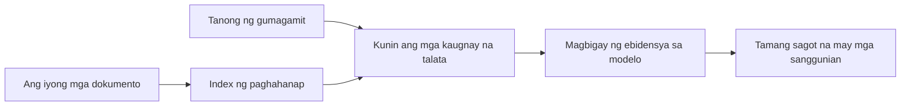

# Turuan ang AI na Sumagot ng Mga Tanong Batay sa Iyong Mga Dokumento:
## Serye 1: RAG, Azure vs Mga Open-Source na Alternatibo, at Kung Kailan May Katuturan ang Fine-Tuning

> Ang unang artikulo sa isang serye noong 2026 na muling tinatalakay ang aking 2023 Azure AI Search + Azure OpenAI dokumento QA na mga tutorial.

## 1. Panimula - Muling Pagsusuri ng Naunang Tutorial sa RAG

Noong 2023, gumawa ako ng dalawang magkasunod na tutorial tungkol sa pagtuturo sa ChatGPT na sumagot ng mga tanong mula sa PDF na mga dokumento gamit ang Azure AI Search at Azure OpenAI. Isinulat ko ang [LangChain na bersyon](https://techcommunity.microsoft.com/blog/educatordeveloperblog/teach-chatgpt-to-answer-questions-using-azure-ai-search--azure-openai-lang-chain/3969713), at ako rin ay naging co-author ng kasamang [Semantic Kernel na bersyon](https://techcommunity.microsoft.com/blog/educatordeveloperblog/teach-chatgpt-to-answer-questions-using-azure-ai-search--azure-openai-semantic-k/3985395) kasama si [Lee Stott](https://developer.microsoft.com/en-us/advocates/lee-stott), isang Principal Cloud Advocate Manager sa Microsoft. Noong panahong iyon, ang ideya ng "ChatGPT sa iyong data" ay bago pa para sa maraming developer. Ginamit ng mga tutorial ang Azure Blob Storage, Azure AI Search, Azure OpenAI, LangChain, Semantic Kernel, at FAISS-style vector retrieval para sumagot mula sa mga PDF file.

Ang naunang artikulo ay nakatuon sa isang simpleng ngunit mahalagang workflow: i-upload ang mga dokumento, i-index ang mga ito, kunin ang mahahalagang nilalaman, at itanong sa modelo na sumagot batay sa nilalamang iyon.

Noong 2026, malaki na ang paglago ng ekosistema ng RAG. Sinusuportahan na ng Azure AI Search ang mga modernong vector at hybrid retrieval patterns, bahagi na ang Azure OpenAI ng mas malawak na Microsoft Foundry Models ecosystem, at ang mas bagong v1 API ay maaaring gumamit ng standard na OpenAI client nang hindi na kailangan ng buwanang `api-version` na pagbabago. Kasabay nito, ang mga open-source na opsyon tulad ng LangGraph, LlamaIndex, Haystack, Qdrant, Milvus, Weaviate, Chroma, Ollama, at vLLM ay naging praktikal na pagpipilian para sa totoong mga RAG na sistema.

Kaya nais kong muling ihanay ang paksang ito. Hindi na ang tanong ay "Paano ako gagawa ng RAG?" Marami na ngayong paraan para buuin ito, at ang mas mahalagang tanong ay "Aling arkitektura ang dapat kong piliin para sa aking sitwasyon?"

Ngunit ang pangunahing problema ay hindi nagbago.

Hindi awtomatikong alam ng AI model ang iyong mga dokumento. Upang makabuo ng kapaki-pakinabang na dokumento-pagsagot-sa-tanong na sistema, kailangan mo pa rin ng maaasahang retrieval, grounding, pagsusuri, at mga operational workflow.

Ang artikulong ito ay hindi isa pang end-to-end na "chat with PDF" na tutorial. Nais kong simulan ang na-update na seryeng ito sa tanong na higit kong pinahahalagahan ngayon: kailan mo dapat piliin ang isang managed Azure architecture, kailan mo dapat piliin ang open-source na stack ng RAG, at kailan talaga may katuturan ang fine-tuning?

Ito ang unang artikulo sa isang serye tungkol sa paggawa ng mga document-grounded AI na sistema. Sa unang bahaging ito, tututok tayo sa mga desisyon sa arkitektura: bakit mahalaga ang RAG, kailan kapaki-pakinabang ang mga Azure-based na managed services, kailan may katuturan ang mga open-source na alternatibo, at saan pumapasok ang fine-tuning.

Matapos bumuo at muling suriin ang mga document QA system, naging mas interesado na ako hindi sa kung aling tool ang pinakamaganda sa demo kundi sa arkitekturang kayang tiisin ang totoong mga gumagamit, pabago-bagong mga dokumento, permiso, pagkabigo, at pagpapanatili.

## 2. Bakit Kailangan ng Iyong AI ang Isang Search System

Ang mga malalaking language model ay sinanay sa malawak na pampubliko at lisensiyadong datos. Maaring may alam sila tungkol sa mga pangkalahatang paksa, pero hindi nila awtomatikong alam ang iyong mga pribadong PDF, panloob na mga patakaran, mga proseso ng kumpanya, mga research archive, mga materyales sa klase, mga tala ng customer support, o mga bagong updated na dokumentasyon.

Isang simpleng paraan upang isipin ang RAG ay ganito: sa halip na asahan ang modelo na tandaan ang bawat dokumento, binibigyan natin ito ng isang search system. Kapag may nagtanong, unang hahanapin ng sistema ang pinaka-relevante na mga piraso ng impormasyon, saka ibibigay ang mga pirasong iyon sa modelo bilang konteksto.

Mahalaga ito dahil maraming totoong pinagkukunan ng kaalaman ang pribado, patuloy na nagbabago, sensitibo sa permiso, nakaimbak sa maraming sistema, nakasulat sa iba’t ibang format, at masyadong malaki para direktang ipaste sa prompt.

Halimbawa, kung ang isang paaralan, kumpanya, o research team ay may 10,000 panloob na dokumento, hindi makakatiyak ang modelo ng tamang sagot mula sa mga dokumentong iyon maliban kung makuha ng sistema ang tamang bahagi sa tamang oras.

Ito ay nagdadala ng isang karaniwang tanong:

Bakit hindi na lang i-fine-tune ang modelo?

Maaari maging kapaki-pakinabang ang fine-tuning, pero karaniwan hindi ito ang tamang unang tool para sa kaalaman sa dokumento. Kung madalas magbago ang kaalaman, kung mahalaga ang mga sipi, o kung mahalaga ang mga patakaran sa akses, karaniwan mas mabuting simula ang RAG. Mas angkop ang fine-tuning para turuan ang ugali, estilo, format ng output, at mga pattern ng gawain.

## 3. Arkitektura ng RAG sa Praktis

Isipin mong gumagawa ka ng AI assistant para sa isang paaralan. Kailangan ng assistant na sumagot sa mga tanong mula sa mga policy PDF, course guides, internal FAQ pages, at mga bagong updated na anunsyo.

Kung may estudyante na magtatanong, "Pwede ko bang gamitin ang generative AI para sa final assignment ko?", hindi dapat sagutin ito ng sistema mula sa pangkalahatang memorya ng modelo. Dapat munang hanapin ang may kaugnayang patakaran ng paaralan, kunin ang seksyon tungkol sa paggamit ng AI, at saka tanungin ang modelo na sagutin gamit ang ebidensyang iyon.

Ganoon ang RAG sa praktis.

Sa mataas na antas, ganito mo maaring isipin ang daloy:

Maaring maging mas sopistikado ang mga detalye, pero simple lang ang pangunahing ideya: hindi nag-iisa ang modelo sa pagsagot. Sumagot ito gamit ang narekober na ebidensya.

Una, kinukuha ang mga dokumento mula sa mga storage system tulad ng Azure Blob Storage, SharePoint, GitHub, o internal CMS. Pagkatapos ay pinoproseso ang mga ito sa teksto habang pinapanatili ang mga kapaki-pakinabang na istruktura tulad ng mga heading, numero ng pahina, mga talahanayan, mga seksyon, at mga pinagmulan.

Sunod, hinahati ang nilalaman sa mga bahagi. Para itong simpleng hakbang, ngunit ito ay isa sa pinakamahalagang bahagi ng sistema. Kung sobrang liit ng bahagi, maaaring mawala ang kalapit na konteksto. Kung masyadong malaki, maaaring maisama ang hindi kaugnay na impormasyon na nagpapababa sa katumpakan ng retrieval.

Pagkatapos ng pag-chunking, lumilikha ang sistema ng mga embedding at iniimbak ito sa isang searchable index kasama ng orihinal na teksto at metadata tulad ng pangalan ng file, numero ng pahina, mga permiso, bersyon ng dokumento, at source URL.

Kapag may tanong ang gumagamit, ni-reretrieve ng sistema ang mga kandidatong bahagi gamit ang keyword search, vector search, o hybrid search. Isang reranker ang maaaring muling ayusin ang mga bahagi upang mailagay ang pinaka-kapaki-pakinabang na ebidensya sa unahan.

Sa huli, natatanggap ng modelo ang tanong at ang narekober na ebidensya. Dapat nakabase ang sagot sa ebidensya at magbalik ito ng mga sipi upang mapag-aralan ng gumagamit ang pinagmulan.

Ang mahalagang punto ay hindi lang "ilagay ang mga PDF sa vector database" ang RAG. Ang kalidad ng sagot ay nakasalalay sa buong workflow: parsing, chunking, retrieval, reranking, prompting, citation, at evaluation.

Ito ang dahilan kung bakit mahalaga ang istruktura ng dokumento. Sa isang PDF, ang heading, talahanayan, footnote, o hangganan ng pahina ay maaaring makaapekto sa kahulugan ng isang bahagi. Sa Azure, ginagamit ng Document Layout skill ang Azure Document Intelligence na kakayahan para gumawa ng output na may kamalayan sa istruktura, na maaaring mapabuti ang kalidad ng chunking at retrieval para sa mga RAG system.

## 4. Ano ang Nagbago Mula Noong 2023?

Maganda ang 2023 tutorial bilang panimulang punto sa panahon nito:

- Azure Blob Storage ang nag-imbak ng mga PDF file.
- Azure AI Search ang nag-index ng nilalaman.
- LangChain ang nagkonekta ng retrieval sa Azure OpenAI.
- FAISS ang gumana bilang simpleng lokal na vector store.
- Ginamit sa halimbawa ang `gpt-35-turbo` at `text-embedding-ada-002`.

Noong 2026, dapat ipakita ng modernong bersyon ang ilang pagbabago.

Una, mas tumibay ang retrieval. Noong 2023, maraming demo ang gumagamit ng simple vector similarity search. Ngayon, hybrid retrieval na madalas ang panimulang punto para sa seryosong document QA. Sinusuportahan ng Azure AI Search ang hybrid search na pinaghalo ang keyword at vector queries sa isang request at pinag-sama ang resulta gamit ang Reciprocal Rank Fusion. Maaaring i-rerank ulit ng semantic ranker ang bahagi ng teksto mula sa full-text, vector, at hybrid na resulta.

Pangalawa, mas sopistikado ang ingestion. Sa halip na mano-manong paghati ng bawat dokumento gamit ang application code, sinusuportahan na ng Azure AI Search ang integrated vectorization para sa chunking, embedding, at query-time vectorization. Para sa mga PDF at mga workload na maraming dokumento, kayang mapanatili ng Document Layout skill ang higit na istruktura kaysa sa mga fixed-size chunks.

Pangatlo, mas mahalaga ang orchestration. Hindi palaging ang LLM API call ang pinakamahirap. Mas mahirap ang paghawak ng mga pagkabigo, pag-uulit, stale retrieval, kalidad ng chunk, mga workflow na tumatagal ng matagal, pagsusuri ng tao, at pagsusuri sa malaking sukat. Dito mas mahalaga ang mga workflow-oriented tool tulad ng LangGraph, LlamaIndex workflows, Haystack pipelines, at platform-level evaluation at observability tools kaysa sa isang linear chain lang.

Pang-apat, hindi na opsyonal ang evaluation. Maaaring kahanga-hanga ang demo sa isang tanong. Kailangan ng production system ng mga test set, regression check, mga metric sa retrieval, groundedness check, at monitoring. Kung walang evaluation, mahirap malaman kung gumagana o basta nagbabago lang ang sistema.

## 5. Pagpili sa Pagitan ng Azure at Open-Source RAG Stack

Hindi sa palagay ko ang kapaki-pakinabang na tanong ay "Mas maganda ba ang Azure kaysa open source?" o "Mas maganda ba ang open source kaysa Azure?"

Ang kapaki-pakinabang na tanong ay: anong klase ng sistema ang binubuo mo, sino ang magpapatakbo nito, ano ang mga limitasyon mo, at anong mga senaryo ng pagkabigo ang hindi matatanggap?

Noong sinimulan kong gumawa ng mga halimbawa ng document QA, iniisip ko lang kung gumagana ang retrieval. Maaari ba akong mag-upload ng PDF, maghanap, at gumawa ng sagot? Mabuti ito bilang panimula.

Pagkatapos ng pagtrabaho sa mas makatotohanang AI workflow, nagbago ang aking pagsusuri. Ngayon, tinitingnan ko ang apat na bagay bago pumili ng RAG stack:

- pagkakakilanlan at mga permiso
- kalidad ng retrieval
- pagiging maaasahan ng workflow
- pagmamay-ari sa operasyon

Mas masabi ng apat na aspetong iyon kaysa sa benchmark ng modelo lang.

Karaniwan, mas may katuturan ang mga Azure-based na arkitektura kapag ang integrasyon sa enterprise ang mahirap na bahagi. Kung umaasa ang koponan sa Microsoft Entra ID, Microsoft 365, Azure Storage, private networking, RBAC, at Azure monitoring, maaaring mabawasan ng Azure AI Search at Azure OpenAI ang maraming operational complexity. Sa ganitong kapaligiran, hindi lang modelo API ang Azure. Ang halaga ay nasa nakapaligid na sistema: pagkakakilanlan, pamamahala, managed search, integrasyon sa seguridad, suporta, at pamilyar na operasyon.

Karaniwan, mas may katuturan ang mga open-source na arkitektura kapag ang flexibility ang pinakamahirap na bagay. Kung kailangan ng koponan ang local inference, cloud portability, customized retrieval pipeline, specialized reranking, o direktang kontrol sa vector database at modelo-serving layer, maaaring mas babagay ang open-source stack. Ang kalakip na gastusin ay pag-aari ng koponan ang mas maraming gawain sa pagiging maaasahan: backups, scaling, latency, migrations, monitoring, at seguridad.

Sa praktis, maraming production AI system ay hindi ganap na cloud-native o ganap na open-source. Madalas silang hybrid na sistema na nagpapantay ng operational simplicity, portability, governance, at engineering flexibility.

Halimbawa, hindi ako magtataka kung makakita ng sistema na gumagamit ng Azure OpenAI para sa access ng modelo, LangGraph para sa workflow orchestration, Azure hosting para sa deployment, at open-source vector database para sa partikular na pangangailangan sa retrieval. Hindi ito arkitekturang hindi magkasundo. Ito ay pagpili ng tamang antas ng managed service at engineering control para sa bawat bahagi ng sistema.

Gusto ko ang hybrid na arkitektura kapag nalulutas ng managed platform ang mahahalagang problema sa enterprise, habang nagbibigay naman ng flexibility ang open-source na mga bahagi kung saan ito mahalaga talaga.

## 6. Praktikal na Gabay sa Pagpapasya

Narito ang talahanayan ng desisyon na gagamitin ko kasama ang koponan bago pumili ng RAG stack:

| Lugar ng Desisyon | Mas malakas ang Azure managed stack kung... | Mas malakas ang Open-source stack kung... |
| --- | --- | --- |
| Pagkakakilanlan at akses | Sentral ang Entra ID, RBAC, managed identity, at enterprise permissions | Namamayani ang custom auth, non-Microsoft identity, o app-specific access logic |
| Operasyon | Gusto ng koponan ang managed infrastructure, suporta, SLAs, at mas simpleng onboarding | Kaya ng koponan patakbuhin ang vector databases, model serving, backups, at scaling |
| Retrieval | Sinasaklaw ng hybrid search, semantic ranking, filters, at metadata search ang karamihan ng pangangailangan | Kailangan ng koponan ang custom retrieval, specialized reranking, o experimental indexing |
| Portability | Katanggap-tanggap o gusto ang Azure ecosystem alignment | Mahalaga ang pag-iwas sa cloud lock-in |
| Inference | Mahalaga ang Azure OpenAI governance, networking, at enterprise controls | Kailangan ang local inference, custom models, o self-hosted serving |
| Gastos | Mas mahalaga ang pagbawas ng engineering at operational na trabaho kaysa tuning ng imprastraktura | Malaki ang scale upang pagbigyan ang maingat na optimization ng imprastruktura |
| Eksperimento | Mas mahalaga ang katatagan at integrasyon sa enterprise kaysa madalas palitan ang mga bahagi | Mabilis ang iterasyon ng koponan sa agents, tools, memory, at retrieval workflows |

Simple ang aking panuntunan:

- Magsimula sa Azure kapag integrasyon sa enterprise, seguridad, at operational simplicity ang mga pangunahing panganib.
- Magsimula sa open source kapag portability, customization, o lokal na kontrol ang mga pangunahing panganib.
- Gumamit ng hybrid stack kapag totoo ang pareho.

Ito rin ang dahilan kung bakit hindi ko sisimulan ang isang 2026 RAG serye sa code agad. Mahalaga ang code, pero nauuna ang pagpili ng arkitektura bago ang implementasyon. Maaaring itago ng simpleng demo ang pinakamahirap na mga pagpipilian. Isang mahusay na RAG sistema ang nagpapalinaw ng mga pagbabagong iyon.

## 7. Saan Pumapasok ang Fine-Tuning

Madalas nababanggit ang fine-tuning kasabay ng RAG, pero sa tingin ko mahalagang paghiwalayin ang dalawa.

Karaniwan mas mabuting piliin ang RAG kapag kailangan ng sistema ng sariwa, pribado, sensitibo sa permiso, o nakabatay sa pinagmulan na kaalaman. Kung kailangang mag-sipi ng dokumento ang sagot, magpakita ng mga bagong update, o igalang ang mga patakaran sa akses ng gumagamit, dapat bahagi ng arkitektura ang retrieval.

Mas kapaki-pakinabang ang fine-tuning kapag hindi kaalaman ang pangunahing problema. Maaari itong makatulong kapag gusto mong sundan ng modelo ang partikular na format ng output, tumugma sa domain-specific na estilo ng tugon, mas matatag na tapusin ang isang gawain, o bawasan ang dami ng instruksyon sa bawat prompt.
Sa praktika, maaaring magtulungan ang dalawa. Ang isang support assistant ay maaaring gumamit ng RAG upang kunin ang pinakabagong polisiya, habang ang isang fine-tuned na modelo ay natututo ng nais na istruktura at tono ng sagot ng kumpanya.

Ang pagkakamali ay ituring ang fine-tuning bilang kapalit ng isang document store. Hindi nito inaalis ang pangangailangan para sa retrieval kapag kailangang sumagot ang sistema mula sa sariwa, pribado, o sensitibo sa permiso na data.

## 8. Saan Pumupunta ang Serieng Ito Susunod

Ang artikulong ito ay ang decision-making layer. Bago magsulat ng code, gusto kong gawing malinaw ang mga tradeoffs: RAG vs fine-tuning, Azure vs open source, managed services vs operational control.

Bago lumipat sa implementasyon, nais kong iwan ang isang punto dito: sa maraming enterprise AI system, ang modelo ay isa lamang bahagi. Kalidad ng retrieval, orchestration, evaluation, permissions, at operational reliability ang madalas na nagtutukoy kung magtatagumpay ang sistema higit pa sa demo stage.

Sa mga susunod na bahagi ng seriang ito, plano kong magpalalim sa praktikal na aspeto ng document-grounded AI systems: paano bumuo ng Azure-based architecture, paano kumpara sa praktika ang open-source alternatives, at paano suriin kung epektibo ba ang isang RAG system.

Maaring baguhin ko ang pagkakasunod-sunod habang umuunlad ang serye, ngunit ang layunin ay mananatiling pareho: lumagpas sa simpleng demo at ipakita kung paano mag-isip tungkol sa mga RAG system na maaaring mapanatili, masuri, at mapatakbo.

## 9. Mga Sanggunian at Mga Mapagkukunan

Orihinal na mga tutorial:

- [Teach ChatGPT to Answer Questions: Using Azure AI Search & Azure OpenAI (Lang Chain)](https://techcommunity.microsoft.com/blog/educatordeveloperblog/teach-chatgpt-to-answer-questions-using-azure-ai-search--azure-openai-lang-chain/3969713)
- [Teach ChatGPT to Answer Questions: Using Azure AI Search & Azure OpenAI (Semantic Kernel)](https://techcommunity.microsoft.com/blog/educatordeveloperblog/teach-chatgpt-to-answer-questions-using-azure-ai-search--azure-openai-semantic-k/3985395)

Azure:

- [Azure AI Search REST API versions](https://learn.microsoft.com/en-us/rest/api/searchservice/search-service-api-versions)
- [Hybrid search in Azure AI Search](https://learn.microsoft.com/en-us/azure/search/hybrid-search-how-to-query)
- [Integrated vectorization in Azure AI Search](https://learn.microsoft.com/en-us/azure/search/vector-search-integrated-vectorization)
- [Document Layout skill in Azure AI Search](https://learn.microsoft.com/en-us/azure/search/cognitive-search-skill-document-intelligence-layout)
- [Chunk and vectorize by document layout](https://learn.microsoft.com/en-us/azure/search/search-how-to-semantic-chunking)
- [Semantic ranking in Azure AI Search](https://learn.microsoft.com/en-us/azure/search/semantic-search-overview)
- [Azure OpenAI / Microsoft Foundry API version lifecycle](https://learn.microsoft.com/en-us/azure/foundry/openai/api-version-lifecycle)
- [Foundry Models sold by Azure](https://learn.microsoft.com/en-us/azure/foundry/foundry-models/concepts/models-sold-directly-by-azure)
- [Microsoft Foundry fine-tuning considerations](https://learn.microsoft.com/en-us/azure/foundry/openai/concepts/fine-tuning-considerations)
- [Microsoft Foundry observability](https://learn.microsoft.com/en-us/azure/foundry/concepts/observability)
- [Run evaluations in Microsoft Foundry](https://learn.microsoft.com/en-us/azure/foundry/how-to/evaluate-generative-ai-app)

Open-source:

- [LangGraph documentation](https://docs.langchain.com/oss/python/langgraph/overview)
- [LlamaIndex documentation](https://developers.llamaindex.ai/python/framework/)
- [Haystack documentation](https://docs.haystack.deepset.ai/)
- [Qdrant documentation](https://qdrant.tech/documentation/overview/)
- [Milvus documentation](https://milvus.io/docs/overview.md)
- [Weaviate documentation](https://docs.weaviate.io/weaviate/current/)
- [Chroma documentation](https://docs.trychroma.com/docs/overview/introduction)
- [Ollama embeddings](https://docs.ollama.com/capabilities/embeddings)
- [vLLM OpenAI-compatible server](https://docs.vllm.ai/en/latest/serving/openai_compatible_server.html)
- [BGE embedding models](https://huggingface.co/BAAI/bge-large-en-v1.5)
- [E5 embedding models](https://huggingface.co/intfloat/e5-large-v2)
- [Instructor embedding models](https://huggingface.co/hkunlp/instructor-large)

---

<!-- CO-OP TRANSLATOR DISCLAIMER START -->
**Pagtatanggi**:
Ang dokumentong ito ay isinalin gamit ang serbisyo ng AI translation na [Co-op Translator](https://github.com/Azure/co-op-translator). Bagama't nagsusumikap kami para sa katumpakan, pakatandaan na ang awtomatikong pagsasalin ay maaaring maglaman ng mga pagkakamali o hindi pagkakatugma. Ang orihinal na dokumento sa orihinal nitong wika ang dapat ituring na pangunahing sanggunian. Para sa mahahalagang impormasyon, inirerekomenda ang propesyonal na pagsasalin ng tao. Hindi kami mananagot sa anumang maling pagkakaintindi o maling interpretasyon na nagmula sa paggamit ng pagsasaling ito.
<!-- CO-OP TRANSLATOR DISCLAIMER END -->