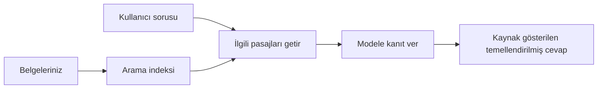

# Yapay Zekaya Belgeleriniz Bazlı Soruları Yanıtlamayı Öğretin:
## Seri 1: RAG, Azure ve Açık Kaynak Alternatifleri ile İncelenmesi, ve İnce Ayar Ne Zaman Anlamlıdır

> 2023 Azure AI Search + Azure OpenAI belge SSS eğitimlerimi yeniden ele alan 2026 yılındaki serinin ilk makalesi.

Seri navigasyonu: [Depo anasayfası](../README.md) | Sonraki: [Seri 2 - Yerel Açık Kaynak RAG Sistemini Baştan Sona Kur](./series-2-open-source-rag-end-to-end.md)

## 1. Giriş - Önceki Bir RAG Eğitimi Üzerine Tekrar Bakış

2023 yılında, ChatGPT’ye PDF belgelerinden soruları yanıtlamayı öğretmek için Azure AI Search ve Azure OpenAI kullanan iki eğitim üzerinde çalıştım. [LangChain versiyonunu](https://techcommunity.microsoft.com/blog/educatordeveloperblog/teach-chatgpt-to-answer-questions-using-azure-ai-search--azure-openai-lang-chain/3969713) ben yazdım ve aynı zamanda Microsoft’ta Baş Bulut Savunucusu Müdürü olan [Lee Stott](https://developer.microsoft.com/en-us/advocates/lee-stott) ile beraber yürüttüğümüz [Semantic Kernel versiyonunu](https://techcommunity.microsoft.com/blog/educatordeveloperblog/teach-chatgpt-to-answer-questions-using-azure-ai-search--azure-openai-semantic-k/3985395) da beraber kaleme aldık. O zamanlar "Verileriniz Üzerinde ChatGPT" fikri birçok geliştirici için hala yeniydi. Eğitimler, PDF dosyalarından soruları yanıtlamak için Azure Blob Storage, Azure AI Search, Azure OpenAI, LangChain, Semantic Kernel ve FAISS tarzı vektör alımını kullandı.

Bu önceki makale basit ama önemli bir iş akışına odaklandı: belgeleri yükleyin, dizinleyin, ilgili içerikleri alın ve modelden o içeriklere dayalı yanıt isteyin.

2026’da RAG ekosistemi önemli ölçüde gelişti. Azure AI Search artık modern vektör ve hibrit alma yöntemlerini destekliyor, Azure OpenAI Microsoft Foundry Models ekosisteminin bir parçası oldu ve yeni v1 API standart OpenAI istemcisini aylık `api-version` değişikliklerine ihtiyaç olmadan kullanabiliyor. Aynı zamanda LangGraph, LlamaIndex, Haystack, Qdrant, Milvus, Weaviate, Chroma, Ollama ve vLLM gibi açık kaynak seçenekleri gerçek RAG sistemleri için pratik tercihler haline geldi.

Bu yüzden bu konuyu tekrar ele almak istedim. Soru artık sadece “RAG nasıl kurulur?” değil. Artık birçok inşa yolu var ve asıl önemli soru “Durumuma göre hangi mimariyi seçmeliyim?” oldu.

Ama temel problem değişmedi.

Bir yapay zeka modeli belgelerinizi otomatik olarak bilmez. Yararlı belge-soru-yanıt sistemi kurmak için hâlâ güvenilir alma, temellendirme, değerlendirme ve operasyonel iş akışları gerekir.

Bu makale başka bir uçtan uca “PDF ile sohbet et” eğitimi değildir. Bu güncellenmiş serinin başlangıcını şimdi daha çok önem verdiğim bir soruyla yapmak istiyorum: ne zaman yönetilen Azure mimarisi seçilmeli, ne zaman açık kaynaklı RAG yığını tercih edilmeli ve ince ayar gerçekten ne zaman anlamlı?

Bu, belge temelli yapay zeka sistemleri kurma dizisinin ilk makalesidir. Bu ilk bölümde, mimari kararlar üzerinde duracağız: neden RAG önemlidir, ne zaman Azure tabanlı yönetilen hizmetler faydalıdır, ne zaman açık kaynak alternatifler mantıklıdır ve ince ayar nerede uyar.

Belge SSS sistemleri kurup tekrar gözden geçirdikten sonra, artık hangi aracın demoda daha iyi göründüğüyle değil, gerçek kullanıcılar, değişen belgeler, izinler, hatalar ve bakım ortamlarında hangi mimarinin ayakta kaldığıyla daha çok ilgileniyorum.

## 2. Neden Yapay Zekanızın Bir Arama Sistemine İhtiyacı Var

Büyük dil modelleri geniş genel ve lisanslı verilerle eğitildi. Genel konular hakkında çok şeyi bilebilirler, ancak OTOMATİK olarak özel PDF’leriniz, dahili politikalar, kurumsal prosedürler, araştırma arşivleri, sınıf materyalleri, müşteri destek notları veya yakın zamanda güncellenmiş dokümantasyonunuzu bilmezler.

RAG’yi basitçe şöyle düşünebilirsiniz: modelden her belgeyi hatırlamasını beklemek yerine bir arama sistemi veriyoruz. Kullanıcı soru sorduğunda sistem önce en alakalı bilgi parçalarını bulur, sonra bu parçaları modele bağlam olarak verir.

Bu önemlidir çünkü birçok gerçek dünya bilgi kaynağı özeldir, sürekli değişir, izinlere tabidir, birden fazla sistemde tutulur, birçok formatta yazılmıştır ve doğrudan bir isteme yapıştırmak için çok büyüktür.

Örneğin, bir okulda, şirkette veya araştırma ekibinde 10.000 dahili belge varsa, model bu belgelerden güvenilir şekilde yanıt veremez, sistem doğru zamanda doğru parçaları alamazsa.

Bu doğal olarak şu yaygın soruya yol açar:

Neden sadece ince ayar yapmıyoruz?

İnce ayar faydalı olabilir, ama genellikle belge bilgisi için ilk doğru araç değildir. Bilgi sık sık değişiyorsa, atıflar önemliyse veya erişim izinleri önemliyse, RAG genellikle daha iyi bir başlangıçtır. İnce ayar daha çok davranış, stil, çıktı formatı ve görev kalıplarını öğretmek için uygundur.

## 3. RAG Mimarisi Uygulamada

Bir okul için yapay zeka asistanı kurduğunuzu hayal edin. Asistan, politika PDF’lerinden, ders kılavuzlarından, dahili SSS sayfalarından ve yakın zamanda güncellenen duyurulardan soruları yanıtlamalı.

Bir öğrenci "Final ödevim için üretken yapay zeka kullanabilir miyim?" diye sorarsa, sistem modelin genel hafızasından yanıt vermemeli. Önce ilgili okul politikasını bulmalı, AI kullanımıyla ilgili bölümü almalı ve sonra modeli bu kanıtı kullanarak yanıt vermeye yönlendirmeli.

İşte bu uygulamada RAG’dir.

Genel hatlarıyla işlemi şöyle düşünebilirsiniz:

Detaylar daha karmaşık olabilir, ama temel fikir basittir: model tek başına yanıt vermez. Alınan kanıtla yanıt verir.

Önce belgeler Azure Blob Storage, SharePoint, GitHub veya dahili CMS gibi depolama sistemlerinden alınır. Sonra sistem faydalı yapıyı koruyarak başlıklar, sayfa numaraları, tablolar, bölümler ve kaynak konumları gibi yapıları metne dönüştürür.

Sonra içerik parçalara ayrılır. Bu adım basit görünse de sistemin en önemli parçalarından biridir. Çok küçük parça çevresel bağlamı kaybedebilir, çok büyük parça ise alakasız bilgileri kapsayabilir ve alma hassasiyetini azaltabilir.

Parçalara ayırdıktan sonra sistem gömme (embedding) oluşturur ve bunları orijinal metin ve dosya adı, sayfa numarası, izinler, belge versiyonu, kaynak URL gibi meta verilerle birlikte aranabilir dizinde saklar.

Kullanıcı soru sorduğunda sistem anahtar kelime, vektör veya hibrit arama ile aday parçaları alır. Bir yeniden sıralayıcı bu parçaları tekrar düzenleyerek en faydalı kanıtları üst sıralara yerleştirebilir.

Son olarak, model soru ve alınan kanıtla beslenir. Yanıt o kanıta dayandırılmalı ve kullanıcı kaynağı inceleyebilmesi için atıflar dönmelidir.

Önemli nokta RAG’nin sadece “PDF’leri vektör veritabanına koymak” olmadığıdır. Yanıt kalitesi tüm iş akışına bağlıdır: ayrıştırma, parçalara ayırma, alma, yeniden sıralama, istemleme, atıf ve değerlendirme.

İşte bu yüzden belge yapısı önemlidir. Bir PDF’de başlık, tablo, dipnot ya da sayfa sınırı bir pasajın anlamını değiştirebilir. Azure’da Document Layout becerisi Azure Document Intelligence yapılandırma yeteneklerini kullanarak yapı farkındalıklı çıktı üretir, bu da RAG sistemlerinde parçalara ayırma ve alma kalitesini artırır.

## 4. 2023’ten Beri Neler Değişti?

2023 öğreticisi zamanına göre iyi bir başlangıçtı:

- Azure Blob Storage PDF dosyalarını depoladı.
- Azure AI Search içeriği dizinledi.
- LangChain alma işlemini Azure OpenAI ile bağladı.
- FAISS basit lokal vektör deposu olarak çalıştı.
- Örnek `gpt-35-turbo` ve `text-embedding-ada-002` kullandı.

2026’da modern bir versiyonda birkaç değişiklik olmalı.

İlk olarak, alma olgunlaştı. 2023’te birçok demo basit vektör benzerliği araması kullanıyordu. Bugün ciddi belge SSS için hibrit alma genellikle varsayılan başlangıçtır. Azure AI Search anahtar kelime ile vektör sorgularını tek istekte birleştirerek hibrit aramayı destekler ve Reciprocal Rank Fusion ile sonuçları birleştirir. Semantic ranker tam metin, vektör ve hibrit sonuçların metin tarafını yeniden sıralayabilir.

İkincisi, alım daha sofistike. Her belgeyi manuel parçalara ayırmak yerine Azure AI Search entegre vektörleştirme ile parçalama, gömme ve sorgu zamanı vektörleştirmeyi destekler. PDF’ler ve belge yoğun iş yükleri için Document Layout yeteneği sabit boyut parçalarından daha fazla yapı koruyabilir.

Üçüncüsü, orkestrasyon daha önemli. Zor kısım genellikle LLM API çağrısı değil. Zor olan hata yönetimi, tekrar deneme, eski alma, parça kalitesi, uzun çalışma iş akışları, insan incelemesi ve ölçeklendirilmiş değerlendirmedir. İşte burada LangGraph, LlamaIndex iş akışları, Haystack boru hatları ve platform seviyesinde izleme/değerlendirme araçları lineer zincirden daha önemli olur.

Dördüncüsü, değerlendirme artık isteğe bağlı değildir. Bir demo bir soruda etkileyici görünebilir. Üretim sistemi test setleri, regresyon kontrolü, alma metrikleri, temellendirme kontrolleri ve izleme ister. Değerlendirme olmadan sistemin iyileşip iyileşmediğini anlamak zordur.

## 5. Azure ve Açık Kaynak RAG Yığınları Arasında Seçim

Yeni RAG yığını seçerken “Azure mu açık kaynak mı daha iyi?” veya “Açık kaynak mı Azure mu daha iyi?” değil bence asıl faydalı soru şöyledir:

Hangi tür sistemi kuruyorsunuz, kim kullanacak, kısıtlarınız neler ve hangi hata türleri kabul edilemez?

Belge SSS örnekleri kurmaya başladığımda genellikle alma çalışıyor mu diye düşünüyordum. PDF’leri yükleyebilir, arayabilir ve yanıt oluşturabilir miyim? Bu makul bir başlangıçtı.

Gerçekçi AI iş akışlarını deneyimledikten sonra değerlendirmem değişti. Artık RAG yığını seçmeden önce dört şeye bakıyorum:

- kimlik ve izinler
- alma kalitesi
- iş akışı güvenilirliği
- operasyonel sahiplenme

Bu dört alan model kıyaslamasından çok daha fazla bilgi verir.

Azure tabanlı mimariler genellikle kurumsal entegrasyonun zor olduğu durumlarda mantıklıdır. Bir ekip Microsoft Entra ID, Microsoft 365, Azure Storage, özel ağlar, RBAC ve Azure izleme üzerine kuruluysa Azure AI Search ve Azure OpenAI operasyonel karmaşıklığı önemli ölçüde azaltabilir. Böyle bir ortamda Azure sadece model API’si değildir. Değer etrafında aydınlatma sağlar: kimlik, yönetim, yönetilen arama, güvenlik entegrasyonu, destek ve bilinen operasyonlar.

Açık kaynak mimariler genellikle esnekliğin kritik olduğu durumlarda mantıklıdır. Ekip lokal çıkarım, bulut taşınabilirliği, özel alma boru hattı, özelleşmiş yeniden sıralama veya vektör veritabanı ve model servis katmanı üzerinde doğrudan kontrol isterse açık kaynak yığın daha uygun olabilir. Ancak ekip güvenilirlik işleri: yedekler, ölçeklendirme, gecikme, göç, izleme ve güvenlik üzerinde daha fazla sahiplenir.

Pratikte, birçok prodüksiyon yapay zeka sistemi saf bulut yerel veya sadece açık kaynak değildir. Genellikle operasyonel sadelik, taşınabilirlik, yönetişim ve mühendislik esnekliği arasında denge kuran hibrit sistemlerdir.

Örneğin, bir sistemin model erişimi için Azure OpenAI, iş akışı orkestrasyonu için LangGraph, dağıtım için Azure barındırma ve özel alma gereksinimi için açık kaynak vektör veritabanı kullandığını görmek beni şaşırtmaz. Bu mimari uyumsuzluk değil. Sistemin her parçası için doğru yönetilen hizmet ve mühendislik kontrolü seviyesini seçmektir.

Yönetilen platform kritik kurumsal problemleri çözdüğünde, ve açık kaynak bileşenler gerçekten önemli alanlarda ekip esnekliği sağladığında hibrit mimarileri beğeniyorum.

## 6. Pratik Bir Karar Rehberi

RAG yığını seçmeden önce bir ekip ile kullanacağım karar tablosu şöyle:

| Karar alanı | Azure yönetilen yığın daha güçlüdür... | Açık kaynak yığın daha güçlüdür... |
| --- | --- | --- |
| Kimlik ve erişim | Entra ID, RBAC, yönetilen kimlik ve kurumsal izinler merkezidir | özel kimlik doğrulama, Microsoft dışı kimlik veya uygulama bazlı erişim hakimdir |
| Operasyonlar | ekip yönetilen altyapı, destek, SLA’lar ve daha kolay başlangıç ister | ekip vektör veritabanları, model servis, yedek ve ölçekleme yürütebilir |
| Alma | hibrit arama, semantik sıralama, filtreler ve meta veri arama çoğu ihtiyacı karşılar | ekip özel alma, uzman yeniden sıralama veya deneysel dizinleme ister |
| Taşınabilirlik | Azure ekosistemi uyumluluğu kabul edilebilir ya da tercih edilir | bulut kilitlenmesinden kaçınmak zorunlu bir şarttır |
| Çıkarım | Azure OpenAI yönetişimi, ağ ve kurumsal kontroller önemlidir | lokal çıkarım, özel modeller veya kendi barındırdığı servis gerekir |
| Maliyet | mühendislik ve operasyon çabasını azaltmak altyapı ayarından daha önemli | ölçek altyapı optimizasyonunu haklı çıkaracak kadar büyüktür |
| Deneyler | kararlılık ve kurumsal entegrasyon bileşen değişiminden daha önemli | ekip ajanslar, araçlar, hafıza ve alma iş akışlarını hızlı iterasyonla geliştiriyor |

Benim temel prensibim basittir:

- Kurumsal entegrasyon, güvenlik ve operasyonel sadelik ana risk ise Azure ile başlayın.
- Taşınabilirlik, özelleştirme veya lokal kontrol ana risk ise açık kaynakla başlayın.
- Her ikisi de önemliyse hibrit yığın kullanın.

İşte bu yüzden 2026 RAG serisine kodla başlamam. Kod önemli ama mimari seçimi uygulamadan önce gelir. Basit demo en zor seçimleri gizleyebilir. İyi bir RAG sistemi o seçimleri açıkça belirtir.

## 7. İnce Ayar Nerede Uyar

İnce ayardan genellikle RAG ile birlikte bahsedilir ama benim için ikisini ayırmak önemli.

RAG genellikle sistem taze, özel, izinlere duyarlı veya kaynak temelli bilgiye ihtiyaç duyduğunda daha iyi seçenektir. Yanıt belgeleri atıf yapmalı, son güncellemeleri yansıtmalı veya kullanıcıya özel erişim kurallarına saygı göstermeli ise alma mimarinin parçası olmalıdır.
Ayar yapma, bilginin ana sorun olmadığı durumlarda daha kullanışlıdır. Modelin belirli bir çıktı formatını takip etmesini, alan spesifik bir yanıt tarzını eşlemesini, sabit bir görevi daha tutarlı bir şekilde yerine getirmesini veya her istemde gereken talimat miktarını azaltmasını istediğinizde yardımcı olabilir.

Pratikte, ikisi birlikte çalışabilir. Bir destek asistanı en son politikayı almak için RAG kullanabilirken, ayarlanmış bir model şirketin tercih ettiği cevap yapısını ve tonu öğrenir.

Hata, ayarlamayı bir belge deposunun yerine geçirmek olarak görmek. Sistem taze, özel veya izin gerektiren verilerden yanıt vermek zorunda olduğunda alma ihtiyacını ortadan kaldırmaz.

## 8. Bu Serinin Sonraki Aşamaları

Bu makale karar verme katmanıdır. Kod yazmadan önce, takasları açıkça belirtmek istedim: RAG vs ayarlama, Azure vs açık kaynak, yönetilen hizmetler vs operasyonel kontrol.

Uygulamaya geçmeden önce burada bir noktayı belirtmek istiyorum: birçok kurumsal yapay zeka sisteminde model sadece bir bileşendir. Alma kalitesi, orkestrasyon, değerlendirme, izinler ve operasyonel güvenilirlik genellikle sistemin demo aşamasını geçip geçemeyeceğini belirler.

Bu serinin sonraki bölümlerinde, belgeye dayalı yapay zeka sistemlerinin pratik yanına daha derinlemesine girmeyi planlıyorum: önce yerel açık kaynaklı bir RAG iş akışı oluşturmak, sonra aynı senaryoyu Azure AI Search ve Azure OpenAI ile yeniden kurmak ve ardından sistemin gerçekten çalışıp çalışmadığını değerlendirmek.

Seri geliştikçe sıralamayı değiştirebilirim, ancak hedef aynı kalacak: basit bir demoyu aşmak ve bakım yapılabilir, değerlendirilebilir ve işletilebilir RAG sistemlerini düşünmeyi göstermek.

## 9. Kaynaklar ve Referanslar

Orijinal dersler:

- [Teach ChatGPT to Answer Questions: Using Azure AI Search & Azure OpenAI (Lang Chain)](https://techcommunity.microsoft.com/blog/educatordeveloperblog/teach-chatgpt-to-answer-questions-using-azure-ai-search--azure-openai-lang-chain/3969713)
- [Teach ChatGPT to Answer Questions: Using Azure AI Search & Azure OpenAI (Semantic Kernel)](https://techcommunity.microsoft.com/blog/educatordeveloperblog/teach-chatgpt-to-answer-questions-using-azure-ai-search--azure-openai-semantic-k/3985395)

Azure:

- [Azure AI Search REST API sürümleri](https://learn.microsoft.com/en-us/rest/api/searchservice/search-service-api-versions)
- [Azure AI Search'te hibrit arama](https://learn.microsoft.com/en-us/azure/search/hybrid-search-how-to-query)
- [Azure AI Search'te entegre vektörleştirme](https://learn.microsoft.com/en-us/azure/search/vector-search-integrated-vectorization)
- [Azure AI Search'te belge düzeni becerisi](https://learn.microsoft.com/en-us/azure/search/cognitive-search-skill-document-intelligence-layout)
- [Belge düzenine göre parçalama ve vektörleştirme](https://learn.microsoft.com/en-us/azure/search/search-how-to-semantic-chunking)
- [Azure AI Search'te anlamsal sıralama](https://learn.microsoft.com/en-us/azure/search/semantic-search-overview)
- [Azure OpenAI / Microsoft Foundry API sürüm yaşam döngüsü](https://learn.microsoft.com/en-us/azure/foundry/openai/api-version-lifecycle)
- [Azure tarafından satılan Foundry Modelleri](https://learn.microsoft.com/en-us/azure/foundry/foundry-models/concepts/models-sold-directly-by-azure)
- [Microsoft Foundry ince ayar düşünceleri](https://learn.microsoft.com/en-us/azure/foundry/openai/concepts/fine-tuning-considerations)
- [Microsoft Foundry gözlemlenebilirliği](https://learn.microsoft.com/en-us/azure/foundry/concepts/observability)
- [Microsoft Foundry'de değerlendirme çalıştırma](https://learn.microsoft.com/en-us/azure/foundry/how-to/evaluate-generative-ai-app)

Açık kaynak:

- [LangGraph dokümantasyonu](https://docs.langchain.com/oss/python/langgraph/overview)
- [LlamaIndex dokümantasyonu](https://developers.llamaindex.ai/python/framework/)
- [Haystack dokümantasyonu](https://docs.haystack.deepset.ai/)
- [Qdrant dokümantasyonu](https://qdrant.tech/documentation/overview/)
- [Milvus dokümantasyonu](https://milvus.io/docs/overview.md)
- [Weaviate dokümantasyonu](https://docs.weaviate.io/weaviate/current/)
- [Chroma dokümantasyonu](https://docs.trychroma.com/docs/overview/introduction)
- [Ollama gömme](https://docs.ollama.com/capabilities/embeddings)
- [vLLM OpenAI uyumlu sunucu](https://docs.vllm.ai/en/latest/serving/openai_compatible_server.html)
- [BGE gömme modelleri](https://huggingface.co/BAAI/bge-large-en-v1.5)
- [E5 gömme modelleri](https://huggingface.co/intfloat/e5-large-v2)
- [Instructor gömme modelleri](https://huggingface.co/hkunlp/instructor-large)

Sonraki: [Seri 2 - Yerel Açık Kaynak RAG Sistemini Baştan Sona İnşa Et](./series-2-open-source-rag-end-to-end.md)

---

<!-- CO-OP TRANSLATOR DISCLAIMER START -->
**Feragatname**:
Bu belge, AI çeviri hizmeti [Co-op Translator](https://github.com/Azure/co-op-translator) kullanılarak çevrilmiştir. Doğruluk için çaba sarf etsek de, otomatik çevirilerin hata veya yanlışlık içerebileceğini lütfen unutmayınız. Orijinal belge, kendi dilinde yetkili kaynak olarak kabul edilmelidir. Kritik bilgiler için profesyonel insan çevirisi önerilir. Bu çevirinin kullanımı sonucu ortaya çıkabilecek yanlış anlamalardan veya yanlış yorumlamalardan sorumlu değiliz.
<!-- CO-OP TRANSLATOR DISCLAIMER END -->