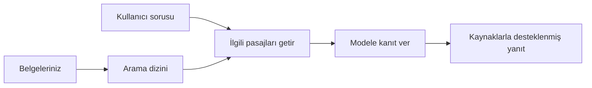

# Belgelere Dayalı Sorulara Yanıt Vermeyi Yapay Zekaya Öğretin:
## Seri 1: RAG, Azure vs Açık Kaynak Alternatifler ve İnce Ayarın Ne Zaman Anlamlı Olduğu

> 2023 Azure AI Search + Azure OpenAI belge SSS eğitimlerimi yeniden ele alan 2026 serisinin ilk makalesi.

## 1. Giriş - Önceki Bir RAG Eğitimini Yeniden Ziyaret Etmek

2023 yılında, ChatGPT'ye Azure AI Search ve Azure OpenAI kullanarak PDF belgelerden sorulara yanıt vermeyi öğretmeye yönelik iki eğitim üzerinde çalıştım. [LangChain sürümünü](https://techcommunity.microsoft.com/blog/educatordeveloperblog/teach-chatgpt-to-answer-questions-using-azure-ai-search--azure-openai-lang-chain/3969713) ben yazdım, ayrıca Microsoft'ta Baş Bulut Savunucusu Müdürü olan [Lee Stott](https://developer.microsoft.com/en-us/advocates/lee-stott) ile birlikte [Semantic Kernel sürümünün](https://techcommunity.microsoft.com/blog/educatordeveloperblog/teach-chatgpt-to-answer-questions-using-azure-ai-search--azure-openai-semantic-k/3985395) ortak yazarlığını yaptım. O zamanlar, "verileriniz üzerinde ChatGPT" fikri birçok geliştirici için hâlâ yeniydi. Eğitimlerde PDF dosyalarından soru yanıtlamak için Azure Blob Storage, Azure AI Search, Azure OpenAI, LangChain, Semantic Kernel ve FAISS tarzı vektör arama kullanıldı.

O önceki makale basit ama önemli bir iş akışına odaklanmıştı: belgeleri yüklemek, dizinlemek, ilgili içeriği almak ve modelden o içeriğe dayanarak yanıt istemek.

2026'da RAG ekosistemi önemli ölçüde büyüdü. Azure AI Search artık modern vektör ve karma arama desenlerini destekliyor, Azure OpenAI Microsoft Foundry Modeller ekosisteminin parçası ve yeni v1 API standart OpenAI istemcisini kullanarak aylık `api-version` değişikliklerine gerek duymuyor. Aynı zamanda LangGraph, LlamaIndex, Haystack, Qdrant, Milvus, Weaviate, Chroma, Ollama ve vLLM gibi açık kaynak seçenekleri gerçek RAG sistemleri için pratik tercihler haline geldi.

İşte bu yüzden bu konuyu yeniden ele almak istedim. Artık soru sadece "RAG nasıl kurarım?" değil. Artık onu kurmanın birçok yolu var ve daha önemli soru "Durumuma hangi mimari uygundur?"

Ancak temel problem değişmedi.

Bir yapay zeka modeli otomatik olarak belgelerinizi bilmez. Kullanışlı bir belge-temelli soru-cevap sistemi kurmak için hâlâ güvenilir alma, temel oluşturma, değerlendirme ve operasyonel iş akışlarına ihtiyaç vardır.

Bu makale başka bir baştan sona "PDF ile sohbet" eğitimi değildir. Bu güncellenmiş seriye şu soruyla başlamak istiyorum: ne zaman yönetilen Azure mimarisini seçmelisiniz, ne zaman açık kaynak RAG yığını tercih edilmeli, ve ince ayar ne zaman gerçekten anlamlıdır?

Bu, belgeye dayalı yapay zeka sistemleri kurmayla ilgili bir serinin ilk makalesidir. İlk bölümde mimari kararlar üzerinde duracağız: neden RAG önemli, ne zaman Azure tabanlı yönetilen hizmetler faydalı, ne zaman açık kaynak seçenekler anlamlı ve ince ayar nerede yer alır.

Belge SSS sistemleri kurup onları tekrar gözden geçirdikten sonra demo için en iyi görünen araçla değil, gerçek kullanıcılar, değişen belgeler, izinler, hatalar ve bakım karşısında hangi mimarinin ayakta kaldığıyla daha çok ilgileniyorum.

## 2. Yapay Zekanızın Bir Arama Sistemine Neden İhtiyacı Var?

Büyük dil modelleri geniş kamuya açık ve lisanslı verilerle eğitilir. Genel konular hakkında çok şey biliyor olabilirler, ancak özel PDF'lerinizi, dahili politikaları, kurumsal prosedürleri, araştırma arşivlerini, sınıf materyallerini, müşteri destek notlarını veya son güncellenen dokümantasyonları otomatik olarak bilmezler.

RAG'yi basitçe şöyle düşünebilirsiniz: modeli her belgeyi hatırlaması beklentisini bırakıp ona bir arama sistemi veririz. Kullanıcı soruyu sorduğunda sistem önce en ilgili bilgi parçalarını bulur, sonra o parçaları modeli bağlam olarak kullanması için verir.

Bu önemlidir çünkü birçok gerçek dünya bilgi kaynağı özel, sürekli değişen, izinlere duyarlı, birden çok sistemde saklanan, birçok formatta yazılmış ve doğrudan isteme yapıştırılamayacak kadar büyük olabilir.

Örneğin bir okul, şirket veya araştırma ekibinin 10.000 dahili belgesi varsa, model ancak sistem doğru parçaları doğru zamanda alırsa o belgelerden güvenilir yanıt verebilir.

Bu doğal olarak yaygın bir soruyu doğurur:

Neden sadece ince ayar yapmıyoruz?

İnce ayar faydalı olabilir, ancak belge bilgisi için genellikle doğru ilk araç değildir. Bilgi sık sık değişiyorsa, atıflar önemliyse veya erişim izinleri önemliyse RAG çoğunlukla daha iyi bir başlangıçtır. İnce ayar davranış, stil, çıktı formatı ve görev örüntülerini öğretmede daha uygundur.

## 3. RAG Mimarisi Pratikte

Diyelim ki bir okul için AI asistanı geliştiriyorsunuz. Asistan politika PDF'lerinden, ders rehberlerinden, dahili SSS sayfalarından ve yakın zamanda güncellenen duyurulardan sorulara yanıt vermeli.

Bir öğrenci "Final ödevimde üretken yapay zeka kullanabilir miyim?" diye sorarsa, sistem modelin genel belleğinden yanıt vermemeli. Önce ilgili okul politikasını bulmalı, yapay zeka kullanımıyla ilgili kısmı almalı ve sonra modeli o kanıtı kullanarak yanıt vermesi için yönlendirmeli.

Buna RAG denir.

Yüksek seviyede iş akışı şöyle olabilir:

Detaylar daha karmaşık hale gelebilir, ancak temel fikir basittir: model tek başına yanıt vermez. Getirilen kanıtla yanıt verir.

Önce belgeler Azure Blob Storage, SharePoint, GitHub veya dahili CMS gibi depolama sistemlerinden alınır. Sonra başlıklar, sayfa numaraları, tablolar, bölümler ve kaynak konumları gibi faydalı yapılar korunarak metne ayrıştırılır.

Sonra içerik parçalara ayrılır. Bu adım basit görünür ama sistemin en önemli parçalarından biridir. Parçalar çok küçükse çevre bağlam kaybolabilir. Parçalar çok büyükse ilgisiz bilgi dahil edilir ve alma doğruluğu düşer.

Parçaladıktan sonra sistem embedding oluşturur ve bunları orijinal metin ile dosya adı, sayfa numarası, izinler, belge versiyonu ve kaynak URL gibi metadata ile birlikte aranabilir bir dizine kaydeder.

Kullanıcı soru sorduğunda sistem anahtar kelime araması, vektör araması veya karma arama ile aday parçaları getirir. Bir yeniden sıralayıcı o parçaları en yararlı kanıt en üste gelecek şekilde yeniden düzenleyebilir.

Son olarak model soruyu ve getirilen kanıtı alır. Yanıt o kanıta dayalı olmalı ve kullanıcı kaynağı inceleyebilsin diye alıntılar içermelidir.

Önemli nokta, RAG'nin sadece "PDF'leri vektör veritabanına koymak" olmadığıdır. Yanıt kalitesi tüm iş akışına bağlıdır: ayrıştırma, parçalama, alma, yeniden sıralama, isteme, atıf ve değerlendirme.

Bu yüzden belge yapısı önemlidir. Bir PDF'de başlık, tablo, dipnot veya sayfa sınırı bir pasajın anlamını değiştirebilir. Azure üzerinde Document Layout becerisi Azure Document Intelligence düzen yeteneklerini kullanarak yapı farkındalıklı çıktı üretir, bu da RAG sistemleri için parçalama ve alma kalitesini artırabilir.

## 4. 2023'ten Beri Neler Değişti?

2023 eğitimi o zaman için iyi bir başlangıçtı:

- Azure Blob Storage PDF dosyaları sakladı.
- Azure AI Search içeriği dizinledi.
- LangChain alma işlemini Azure OpenAI’ye bağladı.
- FAISS basit bir lokal vektör deposu olarak çalıştı.
- Örnekte `gpt-35-turbo` ve `text-embedding-ada-002` kullanıldı.

2026'da modern bir sürüm birçok değişikliği yansıtmalı.

Öncelikle alma olgunlaştı. 2023'te birçok demo basit vektör benzerlik araması kullandı. Bugün ciddi belge SSS için karma alma çoğunlukla varsayılan başlangıçtır. Azure AI Search karma aramayı anahtar kelime ve vektör sorgularını tek bir istekte birleştirerek destekler ve sonuçları Karşılıklı Sıra Füzyonu ile birleştirir. Semantik sıralayıcı tam metin, vektör ve karma sonuçların metin tarafını yeniden sıralayabilir.

İkincisi, alma işlemi daha sofistike. Her belgeyi elle bölmek yerine Azure AI Search entegre vektörleştirme destekler; bu parçalama, embedding ve sorgu zamanı vektörleştirme içerir. PDF ve belge yoğun iş yüklerinde Document Layout becerisi sabit boyutlu parçalar yerine daha fazla yapı koruyabilir.

Üçüncüsü, orkestrasyon daha önemli. Zor kısım genellikle LLM API çağrısı değil. Zor olan hatalarla başa çıkmak, denemeler, eski almalar, parça kalitesi, uzun iş akışları, insan incelemesi ve ölçekli değerlendirmedir. Bu yüzden LangGraph, LlamaIndex iş akışları, Haystack hatları ve platform düzeyi değerlendirme ile gözlemlenebilirlik araçları tek bir doğrusal zincir yerine daha önemli hale gelir.

Dördüncüsü, değerlendirme artık isteğe bağlı değil. Bir demo tek soru ile etkileyici görünebilir. Üretim sistemi test setleri, regresyon kontrolleri, alma metrikleri, temel kontrolü ve izleme ister. Değerlendirme olmadan sistemin gerçekten gelişip gelişmediğini anlamak zor.

## 5. Azure ile Açık Kaynak RAG Yığınları Arasında Seçim

Faydalı soru "Azure açık kaynaktan daha mı iyi?" ya da "Açık kaynak Azure’dan daha mı iyi?" değildir.

Faydalı soru şudur: ne tür bir sistem kuruyorsunuz, kim işletiyor, hangi kısıtlamalar var ve hangi hata türleri kabul edilemez?

Belge SSS örnekleri geliştirmeye başladığımda çoğunlukla alma çalışıyor mu diye düşünürdüm. PDF yükleyebiliyor muyum, arama yapabiliyor muyum, yanıt oluşturabiliyor muyum? Makul bir başlangıçtı.

Daha gerçekçi AI iş akışları üzerinde çalışınca değerlendirmem değişti. Artık RAG yığını seçmeden önce dört şeye bakıyorum:

- kimlik ve izinler
- alma kalitesi
- iş akışı güvenilirliği
- operasyonel sahiplik

Bu dört alan tek bir model kıyaslamasından çok daha fazlasını söyler.

Azure tabanlı mimariler genellikle kurumsal entegrasyon zor olduğunda mantıklıdır. Bir ekip zaten Microsoft Entra ID, Microsoft 365, Azure Storage, özel ağ, RBAC ve Azure izleme kullanıyorsa Azure AI Search ve Azure OpenAI operasyonel karmaşıklığı önemli ölçüde azaltabilir. O ortamda Azure sadece model API'si değil; değer etrafındaki sistemdedir: kimlik, yönetişim, yönetilen arama, güvenlik entegrasyonu, destek ve tanıdık operasyonlar.

Açık kaynak mimariler genellikle esneklik zor olduğunda mantıklıdır. Ekip lokal çıkarım, bulut taşınabilirliği, özel alma hattı, özelleşmiş yeniden sıralama veya vektör veritabanı ve model sunum katmanı üzerinde doğrudan kontrol istiyorsa açık kaynak daha uygun olabilir. Ticaret-off olarak ekip güvenilirlik işlerini daha çok sahiplenir: yedekler, ölçekleme, gecikme, geçişler, izleme ve güvenlik.

Pratikte birçok üretim yapay zeka sistemi saf bulut yerli veya tamamen açık kaynak değildir. Genellikle operasyonel basitlik, taşınabilirlik, yönetişim ve mühendislik esnekliği arasında denge kuran hibrit sistemlerdir.

Örneğin benim şaşırmayacağım bir sistem Azure OpenAI’yi model erişimi için, LangGraph’ı iş akışı orkestrasyonu için, Azure barındırmayı dağıtım için ve belirli bir alma gereksinimi için açık kaynak vektör veritabanı kullanabilir. Bu mimari tutarsızlık değildir. Bu sistemin her parçası için doğru yönetilen hizmet ve mühendislik kontrolünü seçmektir.

Hibrit mimarileri severim çünkü yönetilen platform önemli kurumsal sorunları çözerken açık kaynak bileşenleri ekibe gerçekten önemli yerde esneklik sağlar.

## 6. Pratik Bir Karar Kılavuzu

Bir ekip ile RAG yığını seçmeden önce kullanacağım karar tablosu şudur:

| Karar alanı | Azure yönetilen yığın daha güçlüdür... | Açık kaynak yığın daha güçlüdür... |
| --- | --- | --- |
| Kimlik ve erişim | Entra ID, RBAC, yönetilen kimlik ve kurumsal izinler merkezi | özel kimlik doğrulama, Microsoft dışı kimlik veya uygulama özel erişim mantığı baskın |
| Operasyonlar | ekip yönetilen altyapı, destek, SLA'lar ve kolay onboarding ister | ekip vektör veritabanlarını, model sunumunu, yedekleri ve ölçeklemeyi işletebilir |
| Alma | karma arama, semantik sıralama, filtreler ve metadata araması çoğu ihtiyacı karşılar | ekip özel alma, özelleşmiş yeniden sıralama veya deneysel dizinleme gerekir |
| Taşınabilirlik | Azure ekosistemiyle uyum kabul edilebilir veya tercih edilir | bulut bağımlılığından kaçınmak zorunludur |
| Çıkarım | Azure OpenAI yönetişimi, ağ ve kurumsal kontroller önemlidir | lokal çıkarım, özel modeller veya kendi sunum gerekli |
| Maliyet | mühendislik ve operasyon çabasını azaltmak altyapı ayarından daha önemli | ölçek yapıyorsa altyapı optimizasyonu gerekçelidir |
| Deney | kararlılık ve kurumsal entegrasyon sık değişen bileşenlerden daha önemli | ekip ajanlar, araçlar, bellek ve alma iş akışlarını hızlı iterasyonla geliştiriyor |

Benim genel kuralım basittir:

- Kurumsal entegrasyon, güvenlik ve operasyonel sadelik ana riskler olduğunda Azure ile başlayın.
- Taşınabilirlik, özelleştirme veya yerel kontrol ana riskler olduğunda açık kaynak ile başlayın.
- İkisi de geçerliyse hibrit yığın kullanın.

Bu yüzden 2026 RAG serisine önce kodla başlamam. Kod önemli ama mimari seçimi uygulamadan önce gelir. Basit bir demo en zor seçimleri gizleyebilir. İyi bir RAG sistemi bu seçimleri açıkça ortaya koyar.

## 7. İnce Ayarın Yeri

İnce ayar genellikle RAG ile beraber anılır ama ikisini ayırmanın önemli olduğunu düşünüyorum.

RAG genellikle sistemin taze, özel, izinlere duyarlı veya kaynak dayanaklı bilgiye ihtiyacı olduğunda daha iyi seçimdir. Eğer yanıtlar belgelere atıf yapmalı, son güncellemeleri yansıtmalı veya kullanıcıya özel erişim kurallarına saygı göstermeli ise almak mimarinin bir parçası olmalıdır.

İnce ayar bilgi ana problem olmadığında daha faydalıdır. Modelin belirli çıktı formatını takip etmesini, alan-spesifik yanıt stilini yakalamasını, kararlı bir görevi daha tutarlı yapmasını veya her istemde gereken talimat miktarını azaltmasını istediğinizde yardımcı olabilir.
Pratikte, ikisi birlikte çalışabilir. Bir destek asistanı en son politikayı almak için RAG kullanabilirken, ince ayarlı bir model şirketin tercih edilen cevap yapısını ve tonunu öğrenir.

Hata, ince ayarı bir belge deposunun yerine koymak olarak görmek. Sistem güncel, özel veya izin gerektiren verilerden cevap vermek zorundayken alma ihtiyacını ortadan kaldırmaz.

## 8. Bu Serinin Sonraki Adımları

Bu makale karar verme katmanıdır. Kod yazmadan önce, takasları açıkça yapmak istedim: RAG vs ince ayar, Azure vs açık kaynak, yönetilen hizmetler vs operasyonel kontrol.

Uygulamaya geçmeden önce burada bir noktayı bırakmak istiyorum: birçok kurumsal AI sisteminde model yalnızca bir bileşendir. Alma kalitesi, orkestrasyon, değerlendirme, izinler ve operasyonel güvenilirlik genellikle sistemin demo aşamasının ötesinde başarılı olup olmayacağını belirler.

Bu serinin sonraki bölümlerinde, belge tabanlı AI sistemlerinin pratik tarafına daha derinlemesine inmeyi planlıyorum: Azure tabanlı bir mimarinin nasıl inşa edileceği, açık kaynak alternatiflerin pratikte nasıl kıyaslandığı ve bir RAG sisteminin gerçekten çalışıp çalışmadığının nasıl değerlendirileceği.

Sıralamayı seri geliştikçe ayarlayabilirim, ancak hedef aynı kalacak: basit bir demoyu aşmak ve sürdürülebilir, değerlendirilebilir ve işletilebilir RAG sistemleri hakkında düşünmeyi göstermek.

## 9. Referanslar ve Kaynaklar

Orijinal öğreticiler:

- [Teach ChatGPT to Answer Questions: Using Azure AI Search & Azure OpenAI (Lang Chain)](https://techcommunity.microsoft.com/blog/educatordeveloperblog/teach-chatgpt-to-answer-questions-using-azure-ai-search--azure-openai-lang-chain/3969713)
- [Teach ChatGPT to Answer Questions: Using Azure AI Search & Azure OpenAI (Semantic Kernel)](https://techcommunity.microsoft.com/blog/educatordeveloperblog/teach-chatgpt-to-answer-questions-using-azure-ai-search--azure-openai-semantic-k/3985395)

Azure:

- [Azure AI Search REST API sürümleri](https://learn.microsoft.com/en-us/rest/api/searchservice/search-service-api-versions)
- [Azure AI Search'te hibrit arama](https://learn.microsoft.com/en-us/azure/search/hybrid-search-how-to-query)
- [Azure AI Search'te entegre vektörleştirme](https://learn.microsoft.com/en-us/azure/search/vector-search-integrated-vectorization)
- [Azure AI Search'te Belge Düzeni becerisi](https://learn.microsoft.com/en-us/azure/search/cognitive-search-skill-document-intelligence-layout)
- [Belge düzenine göre parçalama ve vektörleştirme](https://learn.microsoft.com/en-us/azure/search/search-how-to-semantic-chunking)
- [Azure AI Search'te Anlamsal sıralama](https://learn.microsoft.com/en-us/azure/search/semantic-search-overview)
- [Azure OpenAI / Microsoft Foundry API sürüm yaşam döngüsü](https://learn.microsoft.com/en-us/azure/foundry/openai/api-version-lifecycle)
- [Azure tarafından satılan Foundry Modelleri](https://learn.microsoft.com/en-us/azure/foundry/foundry-models/concepts/models-sold-directly-by-azure)
- [Microsoft Foundry ince ayar göz önünde bulundurulması](https://learn.microsoft.com/en-us/azure/foundry/openai/concepts/fine-tuning-considerations)
- [Microsoft Foundry gözlemlenebilirliği](https://learn.microsoft.com/en-us/azure/foundry/concepts/observability)
- [Microsoft Foundry'de değerlendirmeleri çalıştırma](https://learn.microsoft.com/en-us/azure/foundry/how-to/evaluate-generative-ai-app)

Açık kaynak:

- [LangGraph dokümantasyonu](https://docs.langchain.com/oss/python/langgraph/overview)
- [LlamaIndex dokümantasyonu](https://developers.llamaindex.ai/python/framework/)
- [Haystack dokümantasyonu](https://docs.haystack.deepset.ai/)
- [Qdrant dokümantasyonu](https://qdrant.tech/documentation/overview/)
- [Milvus dokümantasyonu](https://milvus.io/docs/overview.md)
- [Weaviate dokümantasyonu](https://docs.weaviate.io/weaviate/current/)
- [Chroma dokümantasyonu](https://docs.trychroma.com/docs/overview/introduction)
- [Ollama gömme](https://docs.ollama.com/capabilities/embeddings)
- [vLLM OpenAI uyumlu sunucu](https://docs.vllm.ai/en/latest/serving/openai_compatible_server.html)
- [BGE gömme modelleri](https://huggingface.co/BAAI/bge-large-en-v1.5)
- [E5 gömme modelleri](https://huggingface.co/intfloat/e5-large-v2)
- [Instructor gömme modelleri](https://huggingface.co/hkunlp/instructor-large)

---

<!-- CO-OP TRANSLATOR DISCLAIMER START -->
**Feragatname**:
Bu belge, AI çeviri hizmeti [Co-op Translator](https://github.com/Azure/co-op-translator) kullanılarak çevrilmiştir. Doğruluk için çaba sarf etsek de, otomatik çevirilerin hata veya yanlışlık içerebileceğini lütfen unutmayınız. Orijinal belge, kendi dilinde yetkili kaynak olarak kabul edilmelidir. Kritik bilgiler için profesyonel insan çevirisi önerilir. Bu çevirinin kullanımı sonucu ortaya çıkabilecek yanlış anlamalardan veya yanlış yorumlamalardan sorumlu değiliz.
<!-- CO-OP TRANSLATOR DISCLAIMER END -->