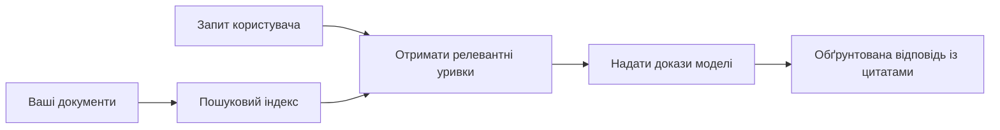

# Навчання ШІ відповідати на запитання на основі ваших документів:
## Серія 1: RAG, Azure проти відкритих альтернатив та коли має сенс донавчання

> Перша стаття серії 2026 року, що переглядає мої навчальні посібники по Azure AI Search + Azure OpenAI для запитання-відповіді з документів 2023 року.

Навігація серією: [Головна репозиторію](../README.md) | Наступна: [Серія 2 - Створення локальної RAG-системи з відкритим кодом від початку до кінця](./series-2-open-source-rag-end-to-end.md)

## 1. Вступ – повернення до попереднього посібника по RAG

У 2023 році я працював над парою навчальних посібників про те, як навчити ChatGPT відповідати на запитання з PDF-документів за допомогою Azure AI Search та Azure OpenAI. Я написав [версію на LangChain](https://techcommunity.microsoft.com/blog/educatordeveloperblog/teach-chatgpt-to-answer-questions-using-azure-ai-search--azure-openai-lang-chain/3969713), а також був співавтором супровідної [версії на Semantic Kernel](https://techcommunity.microsoft.com/blog/educatordeveloperblog/teach-chatgpt-to-answer-questions-using-azure-ai-search--azure-openai-semantic-k/3985395) разом із [Lee Stott](https://developer.microsoft.com/en-us/advocates/lee-stott), менеджером Principal Cloud Advocate в Microsoft. Тоді ідея "ChatGPT на ваших даних" все ще здавалася новою для багатьох розробників. Навчальні посібники використовували Azure Blob Storage, Azure AI Search, Azure OpenAI, LangChain, Semantic Kernel та FAISS-подібне векторне витягання для відповідей на питання з PDF-файлів.

Той раніший матеріал зосереджувався на простому, але важливому робочому процесі: завантаження документів, індексація, витяг релевантного вмісту та запит моделі на відповідь на основі цього вмісту.

У 2026 році екосистема RAG значно зросла. Azure AI Search тепер підтримує сучасні векторні та гібридні схеми витягання, Azure OpenAI є частиною ширшої екосистеми Microsoft Foundry Models, а новіший API версії v1 може використовувати стандартний клієнт OpenAI без потреби щомісячних змін `api-version`. Водночас альтернативи з відкритим кодом, такі як LangGraph, LlamaIndex, Haystack, Qdrant, Milvus, Weaviate, Chroma, Ollama та vLLM стали практичними варіантами для справжніх RAG-систем.

Ось чому я вирішив повернутися до цієї теми. Запитання вже не просто "Як побудувати RAG?" Тепер існує багато способів його побудувати, і більш важливе запитання — "Яку архітектуру вибрати для своєї ситуації?"

Але основна проблема не змінилась.

Штучний інтелект не знає автоматично ваших документів. Щоб побудувати корисну систему запитання-відповіді по документах, вам все ще потрібні надійне витягання, підґрунтя, оцінка та операційні робочі процеси.

Ця стаття — не ще один посібник "чат з PDF" від початку до кінця. Я хочу почати цю оновлену серію з питання, яке тепер мене цікавить більше: коли слід вибирати керовану архітектуру Azure, коли — стек RAG з відкритим кодом, і коли справді має сенс донавчання?

Це перша стаття серії про побудову штучного інтелекту, що грунтується на документах. У цій першій частині ми зосередимося на прийнятті архітектурних рішень: чому RAG має значення, коли корисні керовані сервіси Azure, коли доречні відкриті альтернативи, і де у цю схему вписується донавчання.

Після побудови та перегляду систем QA по документах я став менш зацікавленим у тому, який інструмент найкраще виглядає в демо, і більше цікавлюся, яка архітектура витримує реальних користувачів, змінні документи, дозволи, збої та технічне обслуговування.

## 2. Чому вашому ШІ потрібна система пошуку

Великі мовні моделі навчені на широких публічних і ліцензованих даних. Вони можуть багато знати про загальні теми, але вони не знають автоматично ваші приватні PDF, внутрішні політики, корпоративні процедури, архіви досліджень, навчальні матеріали, нотатки підтримки клієнтів або недавно оновлену документацію.

Простий спосіб уявити RAG: замість того, щоб очікувати, що модель запам’ятає кожен документ, ми даємо їй систему пошуку. Коли користувач ставить запитання, система спочатку знаходить найбільш релевантні фрагменти інформації, а потім передає ці фрагменти моделі як контекст.

Це важливо, тому що багато реальних джерел знань — приватні, постійно змінюються, чутливі до дозволів, зберігаються в різних системах, написані в багатьох форматах і надто великі, щоб вставити їх у підказку напряму.

Наприклад, якщо у школи, компанії чи дослідницької групи є 10 000 внутрішніх документів, модель не зможе надійно відповідати з них, якщо система не витягне вчасно правильні частини.

Це веде до поширеного питання:

Чому ж не донавчити модель?

Донавчання може бути корисним, але зазвичай це не перший інструмент для роботи з знаннями документів. Якщо знання часто змінюються, якщо важливі джерела, або якщо мають значення дозволи на доступ, RAG зазвичай кращий старт. Донавчання краще підходить для навчання поведінки, стилю, формату виводу та патернів завдань.

## 3. Архітектура RAG на практиці

Уявіть, що ви створюєте AI-помічника для школи. Помічник повинен відповідати на запитання з політик у PDF, навчальних програм, внутрішніх FAQ-сторінок і нещодавно оновлених оголошень.

Якщо студент запитає: "Чи можна використовувати генеративний AI для мого підсумкового завдання?", система не повинна відповідати із загальної пам’яті моделі. Спочатку вона має знайти відповідну політику школи, витягнути розділ про використання AI, а потім попросити модель відповісти, спираючись на ці докази.

Це і є RAG на практиці.

На високому рівні можна уявити потік так:

Деталі можуть бути складнішими, але основна ідея проста: модель не відповідає сама по собі. Вона відповідає з витягнутими доказами.

Спочатку документи завантажуються із сховищ, як-от Azure Blob Storage, SharePoint, GitHub або внутрішнього CMS. Потім система перетворює їх у текст із збереженням корисної структури, такої як заголовки, номери сторінок, таблиці, розділи та розташування джерел.

Далі контент розбивається на частини. Цей крок звучить просто, але є одним із найважливіших у системі. Якщо частина занадто мала, вона може втратити контекст. Якщо занадто велика — містити нерелевантну інформацію й знижувати точність витягання.

Після розбиття система створює вбудови (embedding) і зберігає їх у пошуковому індексі разом із оригінальним текстом і метаданими, як-от назва файлу, номер сторінки, дозволи, версія документа та URL джерела.

Коли користувач ставить питання, система витягує кандидатські частини за допомогою пошуку за ключовими словами, векторного пошуку або гібридного пошуку. Перережисер (reranker) може переставити ці частини так, щоб найкорисніші докази були ближче до верху.

Нарешті, модель отримує питання і витягнуті докази. Відповідь має базуватися на цих доказах і повертати посилання, щоб користувач міг перевірити джерело.

Важливо: RAG — це не просто "покласти PDF у векторну базу даних". Якість відповіді залежить від усього робочого процесу: парсингу, розбиття, витягання, перережисування, підказок, посилань та оцінки.

Ось чому структурована будова документа має значення. У PDF заголовок, таблиця, примітка або межа сторінки можуть змінити значення тексту. В Azure навичка Document Layout використовує можливості Azure Document Intelligence для структурування, що може покращити якість розбиття та витягання для систем RAG.

## 4. Що змінилося з 2023 року?

Навчальний посібник 2023 року був хорошою відправною точкою для свого часу:

- PDF-файли зберігалися в Azure Blob Storage.
- Azure AI Search індексував контент.
- LangChain з’єднував витягання з Azure OpenAI.
- FAISS працював як просте локальне векторне сховище.
- Приклади використовували `gpt-35-turbo` та `text-embedding-ada-002`.

У 2026 році сучасна версія має відображати кілька змін.

По-перше, витягання стало розвинутішим. У 2023 році багато демонстрацій показували простий векторний пошук за схожістю. Сьогодні гібридне витягання часто є стандартною відправною точкою для серйозного QA по документах. Azure AI Search підтримує гібридний пошук, поєднуючи ключові слова та векторні запити в одному запиті і об’єднуючи результати за допомогою Reciprocal Rank Fusion. Семантичний ранжир може переставити результати текстового, векторного та гібридного запиту.

По-друге, інгестія стала більш складною. Замість ручного розбиття кожного документа кодом програми Azure AI Search підтримує інтегровану векторизацію для розбиття, створення вбудов і векторизації під час запиту. Для PDF і великих документів навичка Document Layout може зберегти більше структури, ніж розбиття на фіксовані частини.

По-третє, оркестрація має більше значення. Складність часто не в самому виклику LLM API. Складність полягає у обробці збоїв, повторних спроб, застарілого витягання, якості частин, довготривалих робочих процесів, людського контролю та масштабної оцінки. Ось тут істотною стають орієнтовані на робочі процеси інструменти, такі як LangGraph, робочі процеси LlamaIndex, конвеєри Haystack, а також інструменти оцінки та спостереження на рівні платформи, які стають важливішими за простий лінійний ланцюжок.

По-четверте, оцінка перестала бути опційною. Демонстрація може вразити одним питанням. Промислова система потребує тестових наборів, перевірок регресії, показників витягання, перевірок підґрунтя відповідей і моніторингу. Без оцінки важко зрозуміти, чи система покращується, чи просто змінюється.

## 5. Вибір між Azure і RAG зі відкритим кодом

Я не вважаю корисним запитанням "Чи Azure кращий за відкритий код?" або "Чи відкритий код кращий за Azure?"

Корисне запитання: яку систему ви будуєте, хто нею керуватиме, які обмеження маєте та які режими відмов є неприйнятними?

Коли я починав будувати приклади QA по документах, я здебільшого думав, чи працює витягання. Чи можу я завантажити PDF, шукати в них і згенерувати відповідь? Це була раціональна відправна точка.

Проте, пройшовши через більш реалістичні AI-робочі процеси, моя оцінка змінилась. Тепер я дивлюся на чотири аспекти перед вибором RAG-стеку:

- ідентичність і дозволи
- якість витягання
- надійність робочого процесу
- операційна відповідальність

Ці чотири напрямки говорять набагато більше, ніж просте порівняння моделей.

Архітектури на базі Azure зазвичай доцільні, коли складність підприємства — ключова проблема. Якщо команда вже залежить від Microsoft Entra ID, Microsoft 365, Azure Storage, приватних мереж, RBAC та моніторингу Azure, Azure AI Search і Azure OpenAI можуть суттєво спростити операційну складність. В такому середовищі Azure — це не просто API моделі. Цінність — у навколишній системі: ідентичності, управлінні, керованому пошуку, інтеграції безпеки, підтримці та знайомих операціях.

Архітектури з відкритим кодом зазвичай доцільні, коли гнучкість — головна складність. Якщо команді потрібен локальний інференс, портативність у хмарі, кастомний пайплайн витягання, спеціалізоване перережисування або прямий контроль над векторною базою і сервером моделей, відкритий код може бути кращим вибором. Перевага – команда сама відповідає за надійність: бекапи, масштабування, затримки, міграції, моніторинг і безпеку.

На практиці багато промислових AI-систем — не суто хмарні або суто відкриті. Це часто гібридні системи, що балансують простоту операцій, портативність, управління та інженерну гнучкість.

Наприклад, я не здивуюсь, якщо побачу систему, що використовує Azure OpenAI для доступу до моделі, LangGraph для оркестрації робочого процесу, розгортання на Azure та відкриту векторну базу для специфічного запиту. Це не архітектурна непослідовність. Це вибір правильного рівня керованого сервісу й контролю розробки для кожної частини системи.

Мені подобаються гібридні архітектури, коли керована платформа вирішує важливі корпоративні задачі, а компоненти з відкритим кодом дають команді гнучкість там, де вона справді важлива.

## 6. Практичний посібник із вибору

Ось таблиця рішень, яку я використовую з командою перед вибором RAG-стека:

| Сфера прийняття рішень | Керований стек Azure кращий, коли... | Стек з відкритим кодом кращий, коли... |
| --- | --- | --- |
| Ідентичність і доступ | Entra ID, RBAC, керована ідентичність і корпоративні дозволи є центральними | домінує кастомна аутентифікація, не Microsoft-ідентичність або логіка доступу, специфічна для додатку |
| Операції | команда хоче керовану інфраструктуру, підтримку, SLA та простіше залучення | команда може керувати векторними базами, сервером моделей, бекапами та масштабуванням |
| Витягання | гібридний пошук, семантичне ранжування, фільтри й пошук по метаданих покривають більшість потреб | команді потрібен кастомний пошук, спеціалізоване перережисування або експериментальний індекс |
| Портативність | синхронізація з екосистемою Azure прийнятна або бажана | уникнення прив’язки до хмари є суворою вимогою |
| Інференс | керування Azure OpenAI, мережі і корпоративні контролі важливі | потрібен локальний інференс, кастомні моделі або самостійне хостинґове обслуговування |
| Вартість | зниження зусиль інженерії та операцій важливіше за тонке налаштування інфраструктури | масштаби великі, щоб виправдати ретельну оптимізацію інфраструктури |
| Експерименти | стабільність і корпоративна інтеграція важливіші за часту зміну компонентів | команда швидко ітерує агенти, інструменти, пам’ять і робочі процеси витягання |

Моє правило просте:

- Починайте з Azure, якщо основні ризики — інтеграція підприємства, безпека та операційна простота.
- Починайте з відкритого коду, якщо основні ризики — портативність, кастомізація або локальний контроль.
- Використовуйте гібридний стек, якщо обидва пункти справедливі.

Ось чому я не починав би серію RAG 2026 року з коду. Код важливий, але вибір архітектури — перш за все. Простий демо-приклад може сховати найскладніші рішення. Хороша RAG-система робить ці рішення явними.

## 7. Де доречно донавчання

Донавчання часто згадується разом із RAG, але я вважаю важливим розділяти їх.

RAG зазвичай кращий вибір, коли системі потрібні свіжі, приватні, чутливі до дозволів або з підтвердженим джерелом знання. Якщо відповідь має посилатися на документи, відображати недавні оновлення або дотримуватися користувацьких правил доступу, витягання має бути частиною архітектури.
Тонке налаштування є більш корисним, коли знання не є головною проблемою. Воно може допомогти, якщо ви хочете, щоб модель дотримувалася певного формату виходу, відповідала в стилі, специфічному для певної сфери, більш стабільно виконувала завдання або зменшувала обсяг інструкцій у кожному запиті.

На практиці ці два підходи можуть працювати разом. Асистент підтримки може використовувати RAG для отримання останньої політики, а тонко налаштована модель вчиться структурі та тону відповіді, які переважають у компанії.

Помилкою є розгляд тонкого налаштування як заміни для сховища документів. Воно не усуває потреби у пошуку інформації, коли система має відповідати на основі свіжих, приватних або даних із обмеженим доступом.

## 8. Куди далі розвиватиметься ця серія

Ця стаття є шаром прийняття рішень. Перед тим, як писати код, я хотів зробити явними компроміси: RAG проти тонкого налаштування, Azure проти відкритого коду, керовані сервіси проти операційного контролю.

Перед тим як перейти до реалізації, я хочу залишити тут одну думку: у багатьох корпоративних AI-системах модель є лише одним компонентом. Якість пошуку, оркестрація, оцінювання, права доступу та операційна надійність часто визначають, чи матиме система успіх за межами демонстраційного рівня.

У наступних частинах цієї серії я планую докладніше розглянути практичну сторону AI-систем, заснованих на документах: спершу побудувати локальний відкритий RAG-воркфлоу, потім відтворити той самий сценарій із Azure AI Search і Azure OpenAI, а потім оцінити, чи справді система працює.

Я можу змінити порядок подачі матеріалу під час розвитку серії, але мета залишиться незмінною: перейти за межі простої демонстрації та показати, як думати про RAG-системи, які можна підтримувати, оцінювати та експлуатувати.

## 9. Посилання та ресурси

Оригінальні навчальні матеріали:

- [Навчіть ChatGPT відповідати на питання: використання Azure AI Search та Azure OpenAI (Lang Chain)](https://techcommunity.microsoft.com/blog/educatordeveloperblog/teach-chatgpt-to-answer-questions-using-azure-ai-search--azure-openai-lang-chain/3969713)
- [Навчіть ChatGPT відповідати на питання: використання Azure AI Search та Azure OpenAI (Semantic Kernel)](https://techcommunity.microsoft.com/blog/educatordeveloperblog/teach-chatgpt-to-answer-questions-using-azure-ai-search--azure-openai-semantic-k/3985395)

Azure:

- [Версії REST API Azure AI Search](https://learn.microsoft.com/en-us/rest/api/searchservice/search-service-api-versions)
- [Гібридний пошук в Azure AI Search](https://learn.microsoft.com/en-us/azure/search/hybrid-search-how-to-query)
- [Інтегрована векторизація в Azure AI Search](https://learn.microsoft.com/en-us/azure/search/vector-search-integrated-vectorization)
- [Навик Document Layout в Azure AI Search](https://learn.microsoft.com/en-us/azure/search/cognitive-search-skill-document-intelligence-layout)
- [Розбір на частини та векторизація за розміткою документа](https://learn.microsoft.com/en-us/azure/search/search-how-to-semantic-chunking)
- [Семантичне ранжування в Azure AI Search](https://learn.microsoft.com/en-us/azure/search/semantic-search-overview)
- [Життєвий цикл версії API Azure OpenAI / Microsoft Foundry](https://learn.microsoft.com/en-us/azure/foundry/openai/api-version-lifecycle)
- [Моделі Foundry, що продаються Azure](https://learn.microsoft.com/en-us/azure/foundry/foundry-models/concepts/models-sold-directly-by-azure)
- [Розгляд тонкого налаштування в Microsoft Foundry](https://learn.microsoft.com/en-us/azure/foundry/openai/concepts/fine-tuning-considerations)
- [Обсервабельність Microsoft Foundry](https://learn.microsoft.com/en-us/azure/foundry/concepts/observability)
- [Запуск оцінювання в Microsoft Foundry](https://learn.microsoft.com/en-us/azure/foundry/how-to/evaluate-generative-ai-app)

Відкритий код:

- [Документація LangGraph](https://docs.langchain.com/oss/python/langgraph/overview)
- [Документація LlamaIndex](https://developers.llamaindex.ai/python/framework/)
- [Документація Haystack](https://docs.haystack.deepset.ai/)
- [Документація Qdrant](https://qdrant.tech/documentation/overview/)
- [Документація Milvus](https://milvus.io/docs/overview.md)
- [Документація Weaviate](https://docs.weaviate.io/weaviate/current/)
- [Документація Chroma](https://docs.trychroma.com/docs/overview/introduction)
- [Ембеддинги Ollama](https://docs.ollama.com/capabilities/embeddings)
- [Сервер vLLM, сумісний з OpenAI](https://docs.vllm.ai/en/latest/serving/openai_compatible_server.html)
- [Моделі ембеддингів BGE](https://huggingface.co/BAAI/bge-large-en-v1.5)
- [Моделі ембеддингів E5](https://huggingface.co/intfloat/e5-large-v2)
- [Моделі ембеддингів Instructor](https://huggingface.co/hkunlp/instructor-large)

Далі: [Серія 2 — Побудова локальної відкритої RAG-системи від початку до кінця](./series-2-open-source-rag-end-to-end.md)

---

<!-- CO-OP TRANSLATOR DISCLAIMER START -->
**Відмова від відповідальності**:
Цей документ було перекладено за допомогою сервісу штучного інтелекту для перекладу [Co-op Translator](https://github.com/Azure/co-op-translator). Хоча ми прагнемо до точності, будь ласка, майте на увазі, що автоматичні переклади можуть містити помилки або неточності. Оригінальний документ рідною мовою слід вважати авторитетним джерелом. Для критично важливої інформації рекомендується професійний людський переклад. Ми не несемо відповідальності за будь-які непорозуміння або неправильні тлумачення, що виникли внаслідок використання цього перекладу.
<!-- CO-OP TRANSLATOR DISCLAIMER END -->