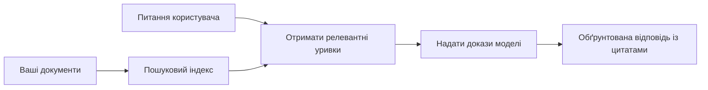

# Навчіть ШІ Відповідати на Питання на Основі Ваших Документів:
## Серія 1: RAG, Azure проти Відкритих Альтернатив, і Коли Моделювання має Сенс

> Перший матеріал серії 2026 року, що переглядає мої туторіали 2023 року по Azure AI Search + Azure OpenAI для документального QA.

## 1. Вступ - Повторний Огляд Ранішого Туторіалу RAG

У 2023 році я працював над парою туторіалів про навчання ChatGPT відповідати на запитання з PDF-документів, використовуючи Azure AI Search і Azure OpenAI. Я написав [версію LangChain](https://techcommunity.microsoft.com/blog/educatordeveloperblog/teach-chatgpt-to-answer-questions-using-azure-ai-search--azure-openai-lang-chain/3969713), а також був співавтором супровідної [версії Semantic Kernel](https://techcommunity.microsoft.com/blog/educatordeveloperblog/teach-chatgpt-to-answer-questions-using-azure-ai-search--azure-openai-semantic-k/3985395) разом із [Lee Stott](https://developer.microsoft.com/en-us/advocates/lee-stott), керівником з питань хмарної підтримки у Microsoft. Тоді ідея "ChatGPT на ваших даних" була новою для багатьох розробників. Туторіали використовували Azure Blob Storage, Azure AI Search, Azure OpenAI, LangChain, Semantic Kernel і FAISS-подібне векторне пошукове відтворення для відповідей на запитання з PDF-файлів.

Той раніший матеріал зосереджувався на простому, але важливому робочому процесі: завантаження документів, їх індексація, пошук релевантного контенту та запит моделі на відповідь на основі цього контенту.

У 2026 році екосистема RAG значно зросла. Azure AI Search тепер підтримує сучасні векторні та гібридні шаблони пошуку, Azure OpenAI є частиною ширшої екосистеми Microsoft Foundry Models, а новіший API v1 може використовувати стандартного OpenAI клієнта без щомісячних змін `api-version`. Водночас відкриті рішення, такі як LangGraph, LlamaIndex, Haystack, Qdrant, Milvus, Weaviate, Chroma, Ollama та vLLM, стали практичними варіантами для справжніх систем RAG.

Ось чому я хотів знову повернутися до цієї теми. Питання вже не просто "Як побудувати RAG?" Тепер існує безліч способів його створення, а головне питання — "Яку архітектуру обрати під мої потреби?"

Але основна проблема не змінилася.

Модель ШІ не знає ваші документи автоматично. Щоби побудувати корисну систему питань-відповідей за документами, все ще потрібні надійні механізми пошуку, ув’язка, оцінка та операційні робочі процеси.

Ця стаття — не ще один покроковий туторіал "чат з PDF". Я хочу почати цю оновлену серію з питання, яке мене тепер більше цікавить: коли варто вибирати керовану архітектуру Azure, коли — стек відкритого коду RAG, а коли навпаки має сенс фактичне тонке налаштування?

Це перша стаття серії про побудову систем ШІ, заснованих на документах. У цій першій частині ми зосередимося на виборі архітектури: чому RAG важливий, коли корисні керовані служби Azure, коли мають сенс відкриті альтернативи і де знаходиться місце тонкому налаштуванню.

Після побудови та повторного огляду систем документального QA я став менш зацікавлений у тому, який інструмент краще виглядає у демонстрації, і більше зацікавлений у тому, яка архітектура витримує справжніх користувачів, змінні документи, дозволи, відмови та обслуговування.

## 2. Чому Ваш ШІ Потребує Системи Пошуку

Великі мовні моделі навчені на широкому публічному та ліцензованому контенті. Вони можуть багато чого знати про загальні теми, але вони не знають автоматично ваші приватні PDF, внутрішні політики, корпоративні процедури, архіви досліджень, навчальні матеріали, нотатки служби підтримки чи нещодавно оновлену документацію.

Простий спосіб уявити RAG: замість того, щоб очікувати, що модель пам’ятає кожний документ, ми даємо їй систему пошуку. Коли користувач ставить запитання, система спершу знаходить найбільш релевантні частини інформації, а потім передає ці частини моделі як контекст.

Це важливо, бо багато реальних джерел знань є приватними, постійно змінюються, чутливі до дозволів, зберігаються в різних системах, написані у різних форматах і занадто великі, щоб вставляти їх просто у запит.

Наприклад, якщо школа, компанія або дослідницька команда має 10 000 внутрішніх документів, модель не зможе надійно відповідати, якщо система не витягне правильні частини в потрібний момент.

Це природно породжує поширене питання:

Чому не просто тонко налаштувати модель?

Тонке налаштування може бути корисним, але зазвичай це не перший правильний інструмент для знань у документах. Якщо знання часто змінюються, якщо важливі посилання або якщо має значення доступ за дозволами, RAG зазвичай кращий початок. Тонке налаштування краще підходить для навчання поведінки, стилю, формату виводу або шаблонів завдань.

## 3. Архітектура RAG на Практиці

Уявіть, що ви будуєте AI-асистента для школи. Асистент має відповідати на запитання з PDF політик, навчальних програм, внутрішніх FAQ-сторінок і нещодавно оновлених оголошень.

Якщо студент питає: "Чи можу я використовувати генеративний ШІ для свого фінального завдання?", система не повинна відповідати зі спільної пам’яті моделі. Спершу вона має знайти релевантну шкільну політику, витягти розділ про використання ШІ, а потім попросити модель відповісти на основі цих даних.

Ось що означає RAG на практиці.

На високому рівні потік виглядає так:

Деталі можуть ставати складнішими, але базова ідея проста: модель не відповідає сама по собі. Вона відповідає з витягнутими доказами.

Спершу документи завантажуються з систем зберігання, таких як Azure Blob Storage, SharePoint, GitHub або внутрішній CMS. Потім система розбирає їх у текст, зберігаючи корисну структуру, як-от заголовки, номери сторінок, таблиці, розділи та місця джерел.

Після цього контент розбивається на шматки. Цей крок здається простим, але є одним із найважливіших у системі. Якщо шматок занадто маленький, він може втратити навколишній контекст. Якщо занадто великий — може містити нерелевантну інформацію й ускладнити пошук.

Після поділу система створює ембеддинги та зберігає їх у пошуковому індексі разом із оригінальним текстом і метаданими, такими як ім’я файлу, номер сторінки, дозволи, версія документа і URL джерела.

Коли користувач ставить запитання, система шукає кандидатські шматки за допомогою пошуку за ключовими словами, векторного пошуку або гібридного пошуку. Після цього ранжувальник може переставити ці шматки так, щоб найкорисніша інформація була на початку.

Нарешті, модель отримує запитання і витягнуті докази. Відповідь має базуватися на цих доказах і містити посилання, щоб користувач міг перевірити джерело.

Головне, що RAG — це не просто "покласти PDF у векторну базу". Якість відповіді залежить від усього робочого процесу: розбору, поділу, пошуку, перепорядкування, формування запиту, посилань і оцінки.

Ось чому структура документа важлива. У PDF заголовок, таблиця, примітка підряд або межа сторінки можуть змінити сенс уривка. В Azure навичка Document Layout використовує можливості Azure Document Intelligence для створення структуранозумілого виводу, що покращує якість поділу і пошуку у RAG-системах.

## 4. Що Змінено з 2023?

Туторіал 2023 був гарною відправною точкою на свій час:

- Azure Blob Storage зберігав PDF-файли.
- Azure AI Search індексував контент.
- LangChain зв’язував пошук із Azure OpenAI.
- FAISS слугував простою локальною векторною базою.
- Приклад використовував `gpt-35-turbo` і `text-embedding-ada-002`.

У 2026 сучасна версія має віддзеркалювати кілька змін.

По-перше, пошук став розвинутішим. У 2023 багато демонстрацій використовували простий векторний пошук за схожістю. Сьогодні гібридний пошук часто є стандартним початком для серйозного документального QA. Azure AI Search підтримує гібридний пошук, поєднуючи ключові слова і векторні запити в одному запиті та об’єднуючи результати Reciprocal Rank Fusion. Семантичний ранжувальник може перепорядковувати текстові результати повнотекстового, векторного й гібридного пошуку.

По-друге, обробка стала складнішою. Замість ручного поділу кожного документа в ап- коді, Azure AI Search підтримує інтегровану векторизацію для поділу, ембеддингу та векторизації під час запиту. Для PDF і навантажень з великою кількістю документів навичка Document Layout зберігає більше структури, ніж фіксовані шматки.

По-третє, оркестрація стала важливішою. Найскладніше часто не виклик API LLM. Найскладніше – це обробка відмов, повторні спроби, застарілий пошук, якість шматків, довготривалі робочі процеси, людський перегляд і оцінка в масштабі. Ось чому орієнтовані на робочі процеси інструменти, такі як LangGraph, LlamaIndex workflows, Haystack pipelines, а також системи оцінки і моніторингу, стають важливішими за просту лінійну цепочку.

По-четверте, оцінка вже не є необов’язковою. Демонстрація може вразити одним питанням. Продуктова система потребує тестових наборів, перевірок регресії, метрик пошуку, перевірок обґрунтованості і моніторингу. Без оцінки важко зрозуміти, чи система покращується, чи просто змінюється.

## 5. Вибір Між Azure і Відкритим Стеком RAG

Я не вважаю корисним питання "Чи Azure кращий за відкрите?" або навпаки "Чи відкрите краще за Azure?"

Корисніше спитати: яку систему ви будуєте, хто її буде експлуатувати, які у вас обмеження і які режими відмов неприйнятні?

Коли я починав створювати приклади документального QA, я в основному думав про те, чи працює пошук. Чи можу я завантажити PDF, знайти відповідь і згенерувати її? Це був логічний початок.

Після роботи з більш реалістичними AI-робочими процесами моя оцінка змінилася. Тепер я дивлюся на чотири аспекти перед вибором стеку RAG:

- ідентичність і дозволи
- якість пошуку
- надійність робочих процесів
- операційна відповідальність

Ці чотири чинники кажуть набагато більше, ніж просто показники моделі.

Архітектури на основі Azure зазвичай мають сенс, коли складна інтеграція підприємства — головна складність. Якщо команда вже використовує Microsoft Entra ID, Microsoft 365, Azure Storage, приватні мережі, RBAC та моніторинг Azure, Azure AI Search і Azure OpenAI можуть значно знизити операційну складність. В такому середовищі Azure — це не просто API моделі. Цінність у навколишній системі: ідентичність, управління, керований пошук, інтеграція безпеки, підтримка й знайомі операції.

Архітектури з відкритим кодом зазвичай мають сенс, коли складність у гнучкості. Якщо команді потрібен локальний висновок, портативність на хмару, кастомний пайплайн пошуку, спеціалізований перепорядкувач або пряма відповідальність за векторну базу і шар сервінгу моделей, відкритий стек може бути кращим вибором. Обмін — команда бере на себе більше роботи з надійності: резервне копіювання, масштабування, затримки, міграції, моніторинг і безпека.

Насправді багато продуктивних систем AI — не виключно хмарні або виключно відкриті. Вони часто гібридні, балансуючи простоту експлуатації, портативність, управління і гнучкість інженерії.

Наприклад, мене не здивує, якщо система використовує Azure OpenAI для доступу до моделей, LangGraph для оркестрації робочих процесів, хостинг Azure для розгортання і відкриту векторну базу для специфічних завдань пошуку. Це не архітектурна невідповідність. Це вибір правильного рівня керованої служби і контролю інженерії для кожного компонента системи.

Мені подобаються гібридні архітектури, коли керована платформа вирішує важливі проблеми підприємства, а відкриті компоненти дають команді гнучкість там, де це справді важливо.

## 6. Практичний Путівник для Прийняття Рішень

Ось таблиця рішень, яку я б використовував із командою перед вибором стеку RAG:

| Область рішення | Керований стек Azure кращий коли... | Відкритий стек кращий коли... |
| --- | --- | --- |
| Ідентичність і доступ | Entra ID, RBAC, керовані ідентичності та корпоративні дозволи є центральними | домінує користувацька автентифікація, не Microsoft ідентичність або специфічна логіка доступу |
| Операції | команда хоче керовану інфраструктуру, підтримку, SLA і спрощене підключення | команда може управляти векторними базами, сервінгом моделей, резервним копіюванням і масштабуванням |
| Пошук | гібридний пошук, семантичне ранжування, фільтри і метадані покривають більшість потреб | команді потрібен кастомний пошук, спеціалізований перепорядкувач або експериментальний індекс |
| Портативність | прийнятна або бажана узгодженість з екосистемою Azure | уникнення хмарної прив’язки є жорсткою вимогою |
| Висновок | має значення управління, мережа і корпоративний контроль Azure OpenAI | потрібен локальний висновок, кастомні моделі або самостійний сервіс |
| Вартість | більше важить зниження інженерних і операційних зусиль, ніж налаштування інфраструктури | масштаб достатньо великий, щоб виправдати оптимізацію інфраструктури |
| Експерименти | стабільність і інтеграція підприємства важливіші за часту зміну компонентів | команда швидко ітеративно працює з агентами, інструментами, пам’яттю та робочими процесами пошуку |

Моє просте правило:

- Починайте з Azure, коли головний ризик — інтеграція підприємства, безпека та простота операцій.
- Починайте з відкритого коду, коли головний ризик — портативність, кастомізація чи локальний контроль.
- Використовуйте гібридний стек, якщо актуальні обидва підходи.

Ось чому я не починав би серію RAG 2026 з коду. Код важливий, але вибір архітектури випереджає реалізацію. Проста демонстрація може приховати найскладніші вибори. Хороша RAG-система робить ці вибори явними.

## 7. Де Знаходиться Тонке Налаштування

Тонке налаштування часто згадують разом із RAG, але я вважаю важливим розділити їх.

RAG зазвичай кращий вибір, коли системі потрібні свіжі, приватні, чутливі до дозволів або джерельно обґрунтовані знання. Якщо відповідь має містити посилання на документи, відображати нещодавні оновлення або дотримуватися правил доступу конкретного користувача, пошук має бути частиною архітектури.

Тонке налаштування корисніше, коли знання не є основною проблемою. Воно допомагає, коли хочете, щоб модель дотримувалась конкретного формату виводу, відповідала стилю доменної області, стабільно виконувала завдання або зменшила обсяг інструкцій у кожному запиті.
На практиці обидва підходи можуть працювати разом. Асистент служби підтримки може використовувати RAG для отримання останньої версії політики, тоді як модель з донавчанням вивчає улюблену структуру й тон відповіді компанії.

Помилкою є вважати донавчання заміною сховища документів. Воно не усуває необхідність пошуку, коли система має відповідати на основі свіжих, приватних або чутливих до прав даних.

## 8. Куди ця серія рухається далі

Ця стаття розглядає шар прийняття рішень. Перед написанням коду я хотів чітко відобразити компроміси: RAG проти донавчання, Azure проти відкритого коду, керовані сервіси проти операційного контролю.

Перед переходом до реалізації хочу залишити тут одну думку: у багатьох корпоративних AI-системах модель — це лише один компонент. Якість пошуку, оркестрація, оцінка, дозволи та операційна надійність часто визначають, чи вийде система за межі демонстраційного рівня.

У наступних частинах цієї серії я планую глибше заглибитися в практичну сторону AI-систем на основі документів: як побудувати архітектуру на базі Azure, як на практиці порівнюються альтернативи з відкритим кодом і як оцінити, чи справді працює система RAG.

Я можу змінити порядок із розвитком серії, але мета залишиться тією самою: вийти за межі простої демонстрації і показати, як мислити про RAG-системи, які можна підтримувати, оцінювати й експлуатувати.

## 9. Посилання і ресурси

Оригінальні навчальні посібники:

- [Teach ChatGPT to Answer Questions: Using Azure AI Search & Azure OpenAI (Lang Chain)](https://techcommunity.microsoft.com/blog/educatordeveloperblog/teach-chatgpt-to-answer-questions-using-azure-ai-search--azure-openai-lang-chain/3969713)
- [Teach ChatGPT to Answer Questions: Using Azure AI Search & Azure OpenAI (Semantic Kernel)](https://techcommunity.microsoft.com/blog/educatordeveloperblog/teach-chatgpt-to-answer-questions-using-azure-ai-search--azure-openai-semantic-k/3985395)

Azure:

- [Azure AI Search REST API versions](https://learn.microsoft.com/en-us/rest/api/searchservice/search-service-api-versions)
- [Hybrid search in Azure AI Search](https://learn.microsoft.com/en-us/azure/search/hybrid-search-how-to-query)
- [Integrated vectorization in Azure AI Search](https://learn.microsoft.com/en-us/azure/search/vector-search-integrated-vectorization)
- [Document Layout skill in Azure AI Search](https://learn.microsoft.com/en-us/azure/search/cognitive-search-skill-document-intelligence-layout)
- [Chunk and vectorize by document layout](https://learn.microsoft.com/en-us/azure/search/search-how-to-semantic-chunking)
- [Semantic ranking in Azure AI Search](https://learn.microsoft.com/en-us/azure/search/semantic-search-overview)
- [Azure OpenAI / Microsoft Foundry API version lifecycle](https://learn.microsoft.com/en-us/azure/foundry/openai/api-version-lifecycle)
- [Foundry Models sold by Azure](https://learn.microsoft.com/en-us/azure/foundry/foundry-models/concepts/models-sold-directly-by-azure)
- [Microsoft Foundry fine-tuning considerations](https://learn.microsoft.com/en-us/azure/foundry/openai/concepts/fine-tuning-considerations)
- [Microsoft Foundry observability](https://learn.microsoft.com/en-us/azure/foundry/concepts/observability)
- [Run evaluations in Microsoft Foundry](https://learn.microsoft.com/en-us/azure/foundry/how-to/evaluate-generative-ai-app)

Відкритий код:

- [LangGraph documentation](https://docs.langchain.com/oss/python/langgraph/overview)
- [LlamaIndex documentation](https://developers.llamaindex.ai/python/framework/)
- [Haystack documentation](https://docs.haystack.deepset.ai/)
- [Qdrant documentation](https://qdrant.tech/documentation/overview/)
- [Milvus documentation](https://milvus.io/docs/overview.md)
- [Weaviate documentation](https://docs.weaviate.io/weaviate/current/)
- [Chroma documentation](https://docs.trychroma.com/docs/overview/introduction)
- [Ollama embeddings](https://docs.ollama.com/capabilities/embeddings)
- [vLLM OpenAI-compatible server](https://docs.vllm.ai/en/latest/serving/openai_compatible_server.html)
- [BGE embedding models](https://huggingface.co/BAAI/bge-large-en-v1.5)
- [E5 embedding models](https://huggingface.co/intfloat/e5-large-v2)
- [Instructor embedding models](https://huggingface.co/hkunlp/instructor-large)

---

<!-- CO-OP TRANSLATOR DISCLAIMER START -->
**Відмова від відповідальності**:
Цей документ було перекладено за допомогою сервісу штучного інтелекту для перекладу [Co-op Translator](https://github.com/Azure/co-op-translator). Хоча ми прагнемо до точності, будь ласка, майте на увазі, що автоматичні переклади можуть містити помилки або неточності. Оригінальний документ рідною мовою слід вважати авторитетним джерелом. Для критично важливої інформації рекомендується професійний людський переклад. Ми не несемо відповідальності за будь-які непорозуміння або неправильні тлумачення, що виникли внаслідок використання цього перекладу.
<!-- CO-OP TRANSLATOR DISCLAIMER END -->