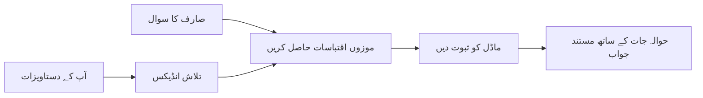

# اپنے دستاویزات کی بنیاد پر AI کو سوالات کے جواب دینا سکھائیں:
## سلسلہ 1: RAG، Azure بمقابلہ اوپن سورس کے متبادل، اور کب فائن ٹوننگ معنی رکھتی ہے

> 2026 کے ایک سلسلے میں پہلا مضمون جو میرے 2023 کے Azure AI سرچ + Azure OpenAI دستاویزی QA ٹیوٹوریلز کا دوبارہ جائزہ لیتا ہے۔

سلسلہ نیویگیشن: [ریپوزیٹری ہوم](../README.md) | اگلا: [سلسلہ 2 - مقامی اوپن سورس RAG نظام شروع سے آخر تک بنائیں](./series-2-open-source-rag-end-to-end.md)

## 1. تعارف - ایک پہلے کے RAG ٹیوٹوریل کا دوبارہ جائزہ

2023 میں، میں نے PDF دستاویزات سے سوالات کے جواب دینے کے لئے Azure AI سرچ اور Azure OpenAI استعمال کرتے ہوئے ChatGPT کو تربیت دینے کے بارے میں دو ٹیوٹوریلز پر کام کیا۔ میں نے [LangChain ورژن](https://techcommunity.microsoft.com/blog/educatordeveloperblog/teach-chatgpt-to-answer-questions-using-azure-ai-search--azure-openai-lang-chain/3969713) لکھا، اور میں نے [Lee Stott](https://developer.microsoft.com/en-us/advocates/lee-stott)، جو Microsoft میں پرنسپل کلاؤڈ ایڈوکیٹ مینیجر ہے، کے ساتھ ساتھی [Semantic Kernel ورژن](https://techcommunity.microsoft.com/blog/educatordeveloperblog/teach-chatgpt-to-answer-questions-using-azure-ai-search--azure-openai-semantic-k/3985395) بھی لکھا۔ اُس وقت، "آپ کے ڈیٹا پر ChatGPT" کا خیال بہت سے ڈویلپرز کے لئے نیا محسوس ہوتا تھا۔ یہ ٹیوٹوریلز Azure Blob Storage، Azure AI Search، Azure OpenAI، LangChain، Semantic Kernel، اور FAISS-طرز ویکٹر بازیافت کو استعمال کرتے ہوئے PDF فائلوں سے سوالات کے جواب دیتے تھے۔

وہ پرانا مضمون ایک سادہ مگر اہم ورک فلو پر توجہ دیتا تھا: دستاویزات اپ لوڈ کریں، انڈیکس کریں، متعلقہ مواد حاصل کریں، اور ایک ماڈل سے اس مواد کی بنیاد پر جواب طلب کریں۔

2026 میں، RAG ماحولیاتی نظام بہت زیادہ بڑھ چکا ہے۔ Azure AI Search اب جدید ویکٹر اور ہائبرڈ بازیافت کے نمونے سپورٹ کرتا ہے، Azure OpenAI مائیکروسافٹ فاؤنڈری ماڈلز کے بڑے ماحولیاتی نظام کا حصہ ہے، اور نیا v1 API بغیر ماہانہ `api-version` تبدیلیوں کے معیاری OpenAI کلائنٹ استعمال کر سکتا ہے۔ اسی وقت، اوپن سورس آپشنز جیسے LangGraph, LlamaIndex, Haystack, Qdrant, Milvus, Weaviate, Chroma, Ollama، اور vLLM حقیقی RAG سسٹمز کے لئے عملی انتخاب بن چکے ہیں۔

اسی لئے میں نے اس موضوع کا دوبارہ جائزہ لینا چاہا۔ سوال اب محض "میں RAG کیسے بناؤں؟" نہیں رہا۔ اب اسے بنانے کے بہت طریقے ہیں، اور اہم تر سوال یہ ہے کہ "میرے حالات کے لئے کون سا آرکیٹیکچر منتخب کرنا چاہئے؟"

لیکن بنیادی مسئلہ بدلا نہیں ہے۔

ایک AI ماڈل خود بہ خود آپ کے دستاویزات کو نہیں جانتا۔ ایک مفید دستاویزی سوال-جواب نظام بنانے کے لئے، آپ کو اب بھی قابل اعتماد بازیافت، گراؤنڈنگ، جانچ، اور آپریشنل ورک فلو کی ضرورت ہے۔

یہ مضمون کوئی دوسرا مکمل "PDF کے ساتھ چیٹ" ٹیوٹوریل نہیں ہے۔ میں اس تازہ کاری شدہ سلسلے کا آغاز اس سوال سے کرنا چاہتا ہوں جس کی مجھے اب زیادہ فکر ہے: کب آپ کو ایک منظم شدہ Azure آرکیٹیکچر منتخب کرنا چاہئے، کب اوپن سورس RAG اسٹیک منتخب کرنا چاہئے، اور کب فائن ٹوننگ حقیقتاً معنی رکھتی ہے؟

یہ آرٹیکل دستاویزی گراؤنڈڈ AI سسٹمز بنانے کے بارے میں ایک سلسلہ ہے۔ اس پہلے حصے میں، ہم آرکیٹیکچر کے فیصلوں پر توجہ مرکوز کریں گے: کیوں RAG اہم ہے، کب Azure پر مبنی منظم خدمات مفید ہیں، کب اوپن سورس متبادل معنی رکھتے ہیں، اور فائن ٹوننگ کہاں فٹ ہوتی ہے۔

دستاویزی QA سسٹمز بنانے اور دوبارہ دیکھنے کے بعد، میں اس بات میں کم دلچسپی رکھتا ہوں کہ کون سا ٹول ڈیمو میں سب سے بہتر دکھتا ہے اور زیادہ دلچسپی رکھتا ہوں کہ کون سا آرکیٹیکچر حقیقی صارفین، بدلتے ہوئے دستاویزات، اجازتناموں، ناکامیوں، اور دیکھ بھال میں زندہ رہتا ہے۔

## 2. آپ کے AI کو سرچ سسٹم کی ضرورت کیوں ہے

بڑے زبان کے ماڈلز وسیع عوامی اور لائسنس یافتہ ڈیٹا پر تربیت یافتہ ہوتے ہیں۔ وہ عمومی موضوعات پر بہت کچھ جان سکتے ہیں، لیکن وہ خود بہ خود آپ کے نجی PDFs، اندرونی پالیسیاں، انٹرپرائز طریقہ کار، تحقیقی آرکائیوز، کلاس روم مواد، کسٹمر سپورٹ نوٹس، یا حال ہی میں اپ ڈیٹ شدہ دستاویزات کو نہیں جانتے۔

RAG کو سمجھنے کا ایک آسان طریقہ یہ ہے: ماڈل سے توقع رکھنے کے بجائے کہ وہ ہر دستاویز یاد رکھے، ہم اسے ایک سرچ سسٹم دیتے ہیں۔ جب صارف کوئی سوال کرتا ہے، تو سسٹم پہلے سب سے متعلقہ معلومات تلاش کرتا ہے، پھر وہ معلومات ماڈل کو بطور سیاق و سباق دیتا ہے۔

یہ اس لئے اہم ہے کیونکہ بہت سے حقیقی دنیا کے علم کے مصادر نجی، مسلسل بدلتے رہنے والے، اجازت حساس، متعدد سسٹمز میں ذخیرہ شدہ، مختلف فارمیٹس میں تحریر شدہ، اور اتنے بڑے ہوتے ہیں کہ انہیں براہ راست پرامپٹ میں پیسٹ کرنا مشکل ہوتا ہے۔

مثال کے طور پر، اگر کسی اسکول، کمپنی، یا تحقیقی ٹیم کے پاس 10,000 اندرونی دستاویزات ہیں، تو ماڈل ان دستاویزات سے قابل اعتماد جواب نہیں دے سکتا جب تک کہ سسٹم وقت پر صحیح حصے بازیافت نہ کرے۔

یہ ایک عام سوال کی طرف لے جاتا ہے:

چاہے ماڈل کی فائن ٹوننگ کیوں نہ کریں؟

فائن ٹوننگ مفید ہو سکتی ہے، لیکن عام طور پر دستاویزی معلومات کے لئے یہ پہلا صحیح آلہ نہیں ہوتی۔ اگر علم اکثر بدلتا ہے، اگر حوالہ جات معنی رکھتے ہیں، یا اگر رسائی کی اجازتیں اہم ہیں، تو RAG عام طور پر بہتر نقطہ آغاز ہوتا ہے۔ فائن ٹوننگ زیادہ تر رویے، انداز، آؤٹ پٹ فارمیٹ، اور کام کے نمونے سکھانے کے لیے موزوں ہوتی ہے۔

## 3. RAG آرکیٹیکچر عملی طور پر

تصور کریں کہ آپ ایک اسکول کے لئے AI معاون بنا رہے ہیں۔ اس معاون کو پالیسی PDFs، کورس گائیڈز، اندرونی FAQ صفحات، اور حال ہی میں اپڈیٹ شدہ اعلانات سے سوالات کے جواب دینے کی ضرورت ہے۔

اگر کوئی طالب علم پوچھے، "کیا میں اپنی آخری اسائنمنٹ کے لیے جنریٹو AI استعمال کر سکتا ہوں؟"، تو سسٹم کو ماڈل کی عمومی یادداشت سے جواب نہیں دینا چاہئے۔ اسے پہلے متعلقہ اسکول کی پالیسی تلاش کرنی چاہیے، AI کے استعمال کے متعلق سیکشن بازیافت کرنا چاہیے، اور پھر ماڈل سے وہ ثبوت استعمال کرتے ہوئے جواب طلب کرنا چاہیے۔

یہی RAG عملی طور پر ہے۔

ایک اعلی سطح پر، آپ اس فلو کو اس طرح سمجھ سکتے ہیں:

تفصیلات زیادہ پیچیدہ ہوسکتی ہیں، لیکن بنیادی خیال سادہ ہے: ماڈل اکیلا جواب نہیں دیتا۔ یہ بازیافت شدہ ثبوت کے ساتھ جواب دیتا ہے۔

سب سے پہلے، دستاویزات کو ذخیرہ کرنے والے نظام جیسے Azure Blob Storage، SharePoint، GitHub، یا اندرونی CMS سے انٹیک کیا جاتا ہے۔ پھر سسٹم انہیں ٹیکسٹ میں تبدیل کرتا ہے جبکہ مفید ساخت جیسے سرخیاں، صفحہ نمبر، ٹیبلز، سیکشنز، اور ماخذ کے مقامات کو محفوظ رکھا جاتا ہے۔

اس کے بعد مواد کو چنکس میں تقسیم کیا جاتا ہے۔ یہ قدم سادہ لگتا ہے، لیکن یہ سسٹم کے سب سے اہم حصوں میں سے ایک ہے۔ اگر چنک بہت چھوٹا ہو تو آس پاس کا سیاق و سباق ضائع ہو سکتا ہے۔ اگر چنک بہت بڑا ہو تو غیر متعلقہ معلومات شامل ہو سکتی ہے اور بازیافت کی درستگی کم ہو سکتی ہے۔

چنکس بنانے کے بعد، سسٹم ایمبیڈنگز تخلیق کرتا ہے اور انہیں ایک سرچ ایبل انڈیکس میں اصل متن اور میٹا ڈیٹا جیسے فائل کا نام، صفحہ نمبر، اجازت نامے، دستاویز کا ورژن، اور ماخذ URL کے ساتھ ذخیرہ کرتا ہے۔

جب صارف سوال کرتا ہے، تو سسٹم کی ورڈ سرچ، ویکٹر سرچ، یا ہائبرڈ سرچ کا استعمال کرتے ہوئے ممکنہ چنکس بازیافت کرتا ہے۔ پھر ری رینکر ان چنکس کو دوبارہ ترتیب دے سکتا ہے تاکہ سب سے مفید ثبوت اوپر آ جائے۔

آخر میں، ماڈل سوال اور بازیافت شدہ ثبوت وصول کرتا ہے۔ جواب کو اس ثبوت پر قائم ہونا چاہیے اور حوالہ جات واپس کرنے چاہئیں تاکہ صارف ماخذ کا معائنہ کر سکے۔

اہم بات یہ ہے کہ RAG صرف "PDFs کو ویکٹر ڈیٹا بیس میں ڈالنا" نہیں ہے۔ جواب کا معیار پورے ورک فلو پر منحصر ہے: پارسنگ، چنکنگ، بازیافت، ری رینکنگ، پرامپٹنگ، حوالہ، اور جانچ۔

اسی وجہ سے دستاویزی ساخت اہم ہے۔ PDF میں، ایک سرخی، ٹیبل، فوٹ نوٹ، یا صفحہ کی حد ایک عبارت کا مطلب بدل سکتی ہے۔ Azure پر، Document Layout skill Azure Document Intelligence کی لے آؤٹ صلاحیتوں کا استعمال کرتے ہوئے ساخت سے آگاہ آؤٹ پٹ تیار کرتا ہے، جو RAG سسٹمز کے لئے چنکنگ اور بازیافت کے معیار کو بہتر بنا سکتا ہے۔

## 4. 2023 سے کیا بدلا؟

2023 کا ٹیوٹوریل اپنے وقت کے لئے ایک اچھا آغاز تھا:

- Azure Blob Storage نے PDF فائلیں ذخیرہ کیں۔
- Azure AI Search نے مواد کا انڈیکس بنایا۔
- LangChain نے بازیافت کو Azure OpenAI سے جوڑا۔
- FAISS نے بطور سادہ مقامی ویکٹر اسٹور کام کیا۔
- مثال میں `gpt-35-turbo` اور `text-embedding-ada-002` استعمال ہوئے۔

2026 میں، ایک جدید ورژن کئی تبدیلیوں کی عکاسی کرنی چاہیے۔

سب سے پہلے، بازیافت میں نکھار آیا ہے۔ 2023 میں، بہت سے مظاہرے سادہ ویکٹر امتیازی سرچ استعمال کرتے تھے۔ آج، ہائبرڈ بازیافت عام طور پر سنجیدہ دستاویزی QA کے لئے ابتدائی نقطہ ہوتا ہے۔ Azure AI Search کی ورڈ اور ویکٹر کو یکجا کرکے ہائبرڈ سرچ کی حمایت کرتا ہے اور Reciprocal Rank Fusion سے نتائج کو ملاتا ہے۔ Semantic ranker پھر مکمل متن، ویکٹر، اور ہائبرڈ نتائج کے متنی پہلو کو ری رینک کر سکتا ہے۔

دوسرا، انٹیک زیادہ پیچیدہ ہے۔ ہر دستاویز کو دستی طور پر ہر بار تقسیم کرنے کے بجائے، Azure AI Search انٹیگریٹڈ ویکٹرائزیشن پیش کرتا ہے چنکنگ، ایمبیڈنگ، اور کوئری وقت کی ویکٹرائزیشن کے لیے۔ PDFs اور دستاویزات کے بھاری کاموں کے لئے، Document Layout skill مقررہ سائز کے چنکس سے زیادہ ساخت کو محفوظ رکھ سکتا ہے۔

تیسرا، آرکیسٹیشن زیادہ اہم ہے۔ مشکل حصہ اکثر LLM API کال خود نہیں ہوتی۔ مشکل حصہ ناکامیوں کو ہینڈل کرنا، دوبارہ کوششیں، پرانی بازیافت، چنک کی معیار، طویل چلنے والے ورک فلو، انسانی جائزہ، اور بڑے پیمانے پر جانچ ہوتا ہے۔ یہاں ورک فلو پر مبنی ٹولز جیسے LangGraph، LlamaIndex ورک فلو، Haystack پائپ لائنز، اور پلیٹ فارم کی سطح پر جانچ اور مشاہدے کے آلات ایک ہی لائنر چین سے زیادہ متعلقہ ہو جاتے ہیں۔

چوتھا، جانچ اب اختیاری نہیں رہی۔ ایک ڈیمو ایک سوال کے ساتھ متاثر کن لگ سکتا ہے۔ ایک پروڈکشن سسٹم کو ٹیسٹ سیٹس، ریگریشن چیکس، بازیافت میٹرکس، گراؤنڈڈنس چیکس، اور مانیٹرنگ کی ضرورت ہوتی ہے۔ بغیر جانچ کے، معلوم کرنا مشکل ہوتا ہے کہ سسٹم بہتر ہو رہا ہے یا صرف بدلا جا رہا ہے۔

## 5. Azure اور اوپن سورس RAG اسٹیک کے درمیان انتخاب

میں نہیں سمجھتا کہ مفید سوال یہ ہے "کیا Azure اوپن سورس سے بہتر ہے؟" یا "کیا اوپن سورس Azure سے بہتر ہے؟"

مفید سوال یہ ہے: آپ کس قسم کا نظام بنا رہے ہیں، کون اسے آپریٹ کرے گا، کیا پابندیاں ہیں، اور کون سی ناکامی کی حالتیں ناقابل قبول ہیں؟

جب میں نے دستاویزی QA کی مثالیں بنانی شروع کیں، میں زیادہ تر سوچتا تھا کہ آیا بازیافت کام کر رہی ہے۔ کیا میں PDFs اپ لوڈ کر سکتا ہوں، انہیں سرچ کر سکتا ہوں، اور جواب تیار کر سکتا ہوں؟ یہ ایک معقول نقطہ آغاز تھا۔

حقیقی AI ورک فلو کو سمجھنے کے بعد، میری جانچ تبدیل ہوئی۔ اب میں RAG اسٹیک منتخب کرنے سے پہلے چار چیزوں پر نظر رکھتا ہوں:

- شناخت اور اجازتنامے
- بازیافت کا معیار
- ورک فلو کی قابلِ اعتمادیت
- آپریشنل ملکیت

یہ چار علاقے آپ کو صرف ماڈل بنچ مارک سے کہیں زیادہ بتاتے ہیں۔

Azure پر مبنی آرکیٹیکچر عام طور پر اس وقت معنی رکھتے ہیں جب انٹرپرائز انٹیگریشن مشکل ہو۔ اگر ٹیم پہلے سے Microsoft Entra ID، Microsoft 365، Azure Storage، پرائیویٹ نیٹ ورکنگ، RBAC، اور Azure مانیٹرنگ پر منحصر ہے، تو Azure AI Search اور Azure OpenAI بہت سی آپریشنل پیچیدگی کو کم کر سکتے ہیں۔ اس ماحول میں، Azure صرف ایک ماڈل API نہیں ہے۔ قدر گرد ونواح کا نظام ہے: شناخت، حکمرانی، منظم شدہ سرچ، سیکیورٹی انٹیگریشن، سپورٹ، اور واقف آپریشنز۔

اوپن سورس آرکیٹیکچر عام طور پر اس وقت معنی رکھتے ہیں جب لچک مسئلہ ہو۔ اگر ٹیم کو مقامی انفرنس، کلاؤڈ پورٹیبلٹی، کسٹم بازیافت پائپ لائن، مخصوص ری رینکنگ، یا ویکٹر ڈیٹا بیس اور ماڈل-سروئنگ پرت پر براہِ راست کنٹرول کی ضرورت ہو، تو اوپن سورس اسٹیک بہتر فٹ ہو سکتا ہے۔ نقصان یہ ہے کہ ٹیم کو زیادہ قابلِ اعتماد کاموں کی ملکیت لینا پڑتی ہے: بیک اپس، اسکیلنگ، تاخیر، مائگریشنز، مانیٹرنگ، اور سیکیورٹی۔

عملی طور پر، بہت سے پروڈکشن AI سسٹمز خالص کلاؤڈ-نیٹو یا مکمل اوپن سورس نہیں ہوتے۔ وہ اکثر ہائبرڈ سسٹمز ہوتے ہیں جو آپریشنل سادگی، پورٹیبلٹی، حکمرانی، اور انجینئرنگ لچک کو متوازن کرتے ہیں۔

مثال کے طور پر، مجھے حیرت نہیں ہوگی اگر کوئی نظام Azure OpenAI کو ماڈل تک رسائی کے لیے، LangGraph کو ورک فلو آرکیسٹیشن کے لیے، Azure ہوسٹنگ کو ڈیپلائمنٹ کے لیے، اور ایک مخصوص بازیافت کی ضرورت کے لیے اوپن سورس ویکٹر ڈیٹا بیس کو استعمال کرتا ہو۔ یہ آرکیٹیکچرل تضاد نہیں ہے۔ یہ نظام کے ہر حصے کے لیے درست سطح کی منظم خدمت اور انجینئرنگ کنٹرول کا انتخاب ہے۔

میں ہائبرڈ آرکیٹیکچر کو پسند کرتا ہوں جب منظم پلیٹ فارم اہم انٹرپرائز مسائل حل کرتا ہے، جبکہ اوپن سورس اجزاء ٹیم کو وہاں لچک دیتے ہیں جہاں اس کی واقعی ضرورت ہو۔

## 6. ایک عملی فیصلہ گائیڈ

یہ فیصلہ ٹیبل ہے جو میں RAG اسٹیک منتخب کرنے سے پہلے ٹیم کے ساتھ استعمال کروں گا:

| فیصلہ کا شعبہ | Azure منظم اسٹیک اس وقت مضبوط ہوتا ہے کہ... | اوپن سورس اسٹیک اس وقت مضبوط ہوتا ہے کہ... |
| --- | --- | --- |
| شناخت اور رسائی | Entra ID، RBAC، منظم شناخت، اور انٹرپرائز اجازتیں مرکزی ہوں | کسٹم آتھ، غیر Microsoft شناخت، یا مخصوص ایپ کی رسائی کا منطق غالب ہو |
| آپریشنز | ٹیم منظم انفراسٹرکچر، سپورٹ، SLA، اور آسان آن بورڈنگ چاہتی ہو | ٹیم ویکٹر ڈیٹا بیس، ماڈل سروئنگ، بیک اپ، اور اسکیلنگ چلا سکتی ہو |
| بازیافت | ہائبرڈ سرچ، سیمنٹک رینکنگ، فلٹرز، اور میٹا ڈیٹا سرچ زیادہ تر ضروریات کو پورا کرتے ہوں | ٹیم کو کسٹم بازیافت، مخصوص ری رینکنگ، یا تجرباتی انڈیکسنگ چاہیے ہو |
| پورٹیبلٹی | Azure ماحولیاتی نظام کی ہم آہنگی قابل قبول یا ترجیح دی جائے | کلاؤڈ لاک ان سے بچنا سخت شرط ہو |
| انفرنس | Azure OpenAI حکمرانی، نیٹ ورکنگ، اور انٹرپرائز کنٹرول اہم ہوں | مقامی انفرنس، کسٹم ماڈلز، یا خود ہوسٹڈ سروئنگ چاہیے ہو |
| لاگت | انجینئرنگ اور آپریشنز کی کوشش کم کرنا بنیادی ہو | اسکیل اتنا بڑا ہو کہ انفراسٹرکچر کی احتیاطی اصلاح جائز ہو |
| تجربہ کاری | استحکام اور انٹرپرائز انٹیگریشن اکثر جزو کی تبدیلی سے زیادہ معنی رکھتی ہو | ٹیم ایجنٹس، ٹولز، میموری، اور بازیافت ورک فلو پر تیزی سے تجربہ کر رہی ہو |

میری اصولی ہدایت سادہ ہے:

- جب انٹرپرائز انٹیگریشن، سیکیورٹی، اور آپریشنل سادگی بڑے خطرات ہوں تو Azure سے شروع کریں۔
- جب پورٹیبلٹی، تخصیص، یا مقامی کنٹرول بڑے خطرات ہوں تو اوپن سورس سے شروع کریں۔
- جب دونوں درست ہوں تو ہائبرڈ اسٹیک استعمال کریں۔

اسی لیے میں 2026 کے RAG سلسلے کا آغاز پہلی بار کوڈ سے نہیں کروں گا۔ کوڈ اہم ہے، لیکن آرکیٹیکچر کا انتخاب نفاذ سے پہلے آتا ہے۔ ایک سادہ ڈیمو مشکل ترین انتخاب کو چھپا سکتا ہے۔ ایک اچھا RAG نظام ان انتخاب کو واضح کرتا ہے۔

## 7. فائن ٹوننگ کہاں فٹ ہوتی ہے

فائن ٹوننگ عموماً RAG کے ساتھ ذکر ہوتی ہے، لیکن میں سمجھتا ہوں کہ ان دونوں کو الگ کرنا ضروری ہے۔

RAG عام طور پر بہتر انتخاب ہے جب نظام کو تازہ، نجی، اجازت حساس، یا ماخذ پر مبنی علم کی ضرورت ہو۔ اگر جواب دستاویزات کا حوالہ دے، حالیہ اپ ڈیٹس کی عکاسی کرے، یا صارف مخصوص رسائی کے قواعد کی پاسداری کرے، تو بازیافت کو آرکیٹیکچر کا حصہ ہونا چاہیے۔
فائن ٹیوننگ اس وقت زیادہ مفید ہوتی ہے جب علم مرکزی مسئلہ نہ ہو۔ یہ اس وقت مدد کر سکتی ہے جب آپ چاہتے ہیں کہ ماڈل ایک مخصوص آؤٹ پٹ فارمیٹ کی پیروی کرے، ایک مخصوص ڈومین کے جواب دینے کے انداز سے میل کھائے، ایک مستحکم کام کو مزید مسلسل انجام دے، یا ہر پرامپٹ میں دیے جانے والے ہدایت کی مقدار کو کم کرے۔

عملی طور پر، دونوں ایک ساتھ کام کر سکتے ہیں۔ ایک سپورٹ اسسٹنٹ تازہ ترین پالیسی حاصل کرنے کے لیے RAG استعمال کر سکتا ہے، جبکہ ایک فائن ٹیونڈ ماڈل کمپنی کے پسندیدہ جواب کے انداز اور لہجے کو سیکھتا ہے۔

غلطی یہ ہے کہ فائن ٹیوننگ کو دستاویز اسٹور کی جگہ سمجھنا۔ جب سسٹم کو تازہ، ذاتی، یا اجازت سے حساس ڈیٹا سے جواب دینا ہو تو بازیافت کی ضرورت ختم نہیں ہوتی۔

## 8. اس سلسلے کا اگلا مرحلہ کہاں ہے

یہ مضمون فیصلہ سازی کی پرت ہے۔ کوڈ لکھنے سے پہلے، میں نے تجارتی امور کو واضح کرنا چاہا: RAG بمقابلہ فائن ٹیوننگ، Azure بمقابلہ اوپن سورس، مینیجڈ سروسز بمقابلہ آپریشنل کنٹرول۔

عملدرآمد میں جانے سے پہلے، میں یہاں ایک بات چھوڑنا چاہتا ہوں: بہت سے انٹرپرائز AI سسٹمز میں، ماڈل صرف ایک جزو ہوتا ہے۔ بازیافت کی کوالٹی، تنظیم، جانچ، اجازتیں، اور آپریشنل استحکام اکثر یہ تعین کرتے ہیں کہ سسٹم ڈیمو مرحلے سے آگے کامیاب ہوتا ہے یا نہیں۔

اس سلسلے کے اگلے حصوں میں، میرا ارادہ ہے کہ دستاویز پر مبنی AI سسٹمز کی عملی پہلوؤں میں گہرا غوطہ لگاؤں: پہلے ایک لوکل اوپن سورس RAG ورک فلو بناؤں گا، پھر اسی منظرنامے کو Azure AI Search اور Azure OpenAI کے ساتھ دوبارہ بناؤں گا، اور پھر یہ جانچوں گا کہ سسٹم واقعی کام کر رہا ہے یا نہیں۔

میں جیسے جیسے یہ سلسلہ تیار ہوگا، ترتیب تبدیل کر سکتا ہوں، لیکن مقصد ایک جیسا رہے گا: ایک سادہ ڈیمو سے آگے بڑھنا اور دکھانا کہ RAG سسٹمز کے بارے میں کیسے سوچا جائے جنہیں برقرار رکھا جا سکے، جانچا جا سکے، اور آپریٹ کیا جا سکے۔

## 9. حوالہ جات اور ذرائع

اصل ٹیوٹوریلز:

- [Teach ChatGPT to Answer Questions: Using Azure AI Search & Azure OpenAI (Lang Chain)](https://techcommunity.microsoft.com/blog/educatordeveloperblog/teach-chatgpt-to-answer-questions-using-azure-ai-search--azure-openai-lang-chain/3969713)
- [Teach ChatGPT to Answer Questions: Using Azure AI Search & Azure OpenAI (Semantic Kernel)](https://techcommunity.microsoft.com/blog/educatordeveloperblog/teach-chatgpt-to-answer-questions-using-azure-ai-search--azure-openai-semantic-k/3985395)

Azure:

- [Azure AI Search REST API versions](https://learn.microsoft.com/en-us/rest/api/searchservice/search-service-api-versions)
- [Hybrid search in Azure AI Search](https://learn.microsoft.com/en-us/azure/search/hybrid-search-how-to-query)
- [Integrated vectorization in Azure AI Search](https://learn.microsoft.com/en-us/azure/search/vector-search-integrated-vectorization)
- [Document Layout skill in Azure AI Search](https://learn.microsoft.com/en-us/azure/search/cognitive-search-skill-document-intelligence-layout)
- [Chunk and vectorize by document layout](https://learn.microsoft.com/en-us/azure/search/search-how-to-semantic-chunking)
- [Semantic ranking in Azure AI Search](https://learn.microsoft.com/en-us/azure/search/semantic-search-overview)
- [Azure OpenAI / Microsoft Foundry API version lifecycle](https://learn.microsoft.com/en-us/azure/foundry/openai/api-version-lifecycle)
- [Foundry Models sold by Azure](https://learn.microsoft.com/en-us/azure/foundry/foundry-models/concepts/models-sold-directly-by-azure)
- [Microsoft Foundry fine-tuning considerations](https://learn.microsoft.com/en-us/azure/foundry/openai/concepts/fine-tuning-considerations)
- [Microsoft Foundry observability](https://learn.microsoft.com/en-us/azure/foundry/concepts/observability)
- [Run evaluations in Microsoft Foundry](https://learn.microsoft.com/en-us/azure/foundry/how-to/evaluate-generative-ai-app)

اوپن سورس:

- [LangGraph documentation](https://docs.langchain.com/oss/python/langgraph/overview)
- [LlamaIndex documentation](https://developers.llamaindex.ai/python/framework/)
- [Haystack documentation](https://docs.haystack.deepset.ai/)
- [Qdrant documentation](https://qdrant.tech/documentation/overview/)
- [Milvus documentation](https://milvus.io/docs/overview.md)
- [Weaviate documentation](https://docs.weaviate.io/weaviate/current/)
- [Chroma documentation](https://docs.trychroma.com/docs/overview/introduction)
- [Ollama embeddings](https://docs.ollama.com/capabilities/embeddings)
- [vLLM OpenAI-compatible server](https://docs.vllm.ai/en/latest/serving/openai_compatible_server.html)
- [BGE embedding models](https://huggingface.co/BAAI/bge-large-en-v1.5)
- [E5 embedding models](https://huggingface.co/intfloat/e5-large-v2)
- [Instructor embedding models](https://huggingface.co/hkunlp/instructor-large)

اگلا: [Series 2 - Build a Local Open-Source RAG System End to End](./series-2-open-source-rag-end-to-end.md)

---

<!-- CO-OP TRANSLATOR DISCLAIMER START -->
**ڈس کلیمر**:
یہ دستاویز AI ترجمہ سروس [Co-op Translator](https://github.com/Azure/co-op-translator) کے ذریعے ترجمہ کی گئی ہے۔ جبکہ ہم درستگی کے لیے کوشاں ہیں، براہ کرم اس بات سے آگاہ رہیں کہ خودکار ترجمے میں غلطیاں یا عدم درستیاں ہو سکتی ہیں۔ اصل دستاویز اپنے مادری زبان میں مستند ماخذ سمجھی جائے گی۔ حساس معلومات کے لیے پیشہ ور انسانی ترجمہ کی سفارش کی جاتی ہے۔ اس ترجمے کے استعمال سے پیدا ہونے والی کسی بھی غلط فہمی یا غلط تشریح کی ذمہ داری ہم قبول نہیں کرتے۔
<!-- CO-OP TRANSLATOR DISCLAIMER END -->