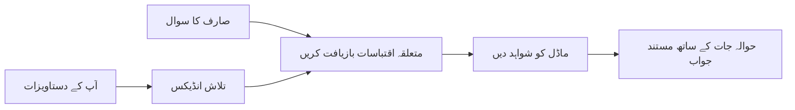

# اپنے دستاویزات کی بنیاد پر AI کو سوالات کا جواب دینا سکھائیں:
## سیریز 1: RAG, Azure بمقابلہ اوپن سورس متبادل، اور کب Fine-Tuning معنی رکھتی ہے

> 2026 کی ایک سیریز کا پہلا مضمون جو میرے 2023 Azure AI Search + Azure OpenAI دستاویز QA ٹیوٹوریلز کو نئے سرے سے دیکھ رہا ہے۔

## 1. تعارف - ایک پہلے کے RAG ٹیوٹوریل پر دوبارہ نظر ڈالنا

2023 میں، میں نے دو ٹیوٹوریلز پر کام کیا جس میں ChatGPT کو Azure AI Search اور Azure OpenAI استعمال کرتے ہوئے PDF دستاویزات سے سوالات کا جواب دینا سکھایا گیا۔ میں نے [LangChain ورژن](https://techcommunity.microsoft.com/blog/educatordeveloperblog/teach-chatgpt-to-answer-questions-using-azure-ai-search--azure-openai-lang-chain/3969713) لکھا، اور میں نے اس کے ساتھ ساتھ [Semantic Kernel ورژن](https://techcommunity.microsoft.com/blog/educatordeveloperblog/teach-chatgpt-to-answer-questions-using-azure-ai-search--azure-openai-semantic-k/3985395) [لی اسٹوٹ](https://developer.microsoft.com/en-us/advocates/lee-stott) کے ساتھ مشترکہ طور پر تحریر کیا، جو مائیکروسافٹ میں پرنسپل کلاؤڈ ایڈووکیٹ مینیجر ہیں۔ اس وقت، "ChatGPT آپ کے ڈیٹا پر" کا تصور بہت سے ڈیویلپرز کے لیے نیا محسوس ہوتا تھا۔ ان ٹیوٹوریلز میں Azure Blob Storage, Azure AI Search, Azure OpenAI, LangChain, Semantic Kernel, اور FAISS-طرز کی ویکٹر ریٹریول استعمال کی گئی تاکہ PDF فائلوں سے سوالات کے جوابات دیے جا سکیں۔

وہ پرانا مضمون ایک سادہ مگر اہم ورک فلو پر مرکوز تھا: دستاویزات اپ لوڈ کریں، ان کا انڈیکس بنائیں، متعلقہ مواد بازیافت کریں، اور ماڈل سے وہی مواد استعمال کرتے ہوئے جواب طلب کریں۔

2026 میں، RAG ماحولیاتی نظام نے کافی ترقی کی ہے۔ Azure AI Search اب جدید ویکٹر اور ہائبریڈ ریٹریول پیٹرنز کی حمایت کرتا ہے، Azure OpenAI مائیکروسافٹ Foundry Models کے وسیع ماحولیاتی نظام کا حصہ ہے، اور نیا v1 API معیاری OpenAI کلائنٹ استعمال کر سکتا ہے بغیر ماہانہ `api-version` تبدیلیوں کی ضرورت کے۔ اسی وقت، اوپن سورس آپشنز جیسے LangGraph، LlamaIndex، Haystack، Qdrant، Milvus، Weaviate، Chroma، Ollama، اور vLLM حقیقی RAG سسٹمز کے لیے عملی انتخاب بن چکے ہیں۔

اسی لیے میں اس موضوع پر دوبارہ غور کرنا چاہتا تھا۔ سوال اب صرف "میں RAG کیسے بناؤں؟" نہیں رہا۔ اب اسے بنانے کے کئی طریقے ہیں، اور زیادہ اہم سوال یہ ہے کہ "میری صورتحال کے لیے کون سا آرکیٹیکچر منتخب کروں؟"

لیکن بنیادی مسئلہ بدلا نہیں ہے۔

AI ماڈل خودبخود آپ کی دستاویزات نہیں جانتا۔ ایک مفید دستاویزاتی سوال و جواب سسٹم بنانے کے لیے، آپ کو ابھی بھی قابل اعتماد ریٹریول، گراؤنڈنگ، تشخیص، اور آپریشنل ورک فلو کی ضرورت ہے۔

یہ مضمون ایک اور "پی ڈی ایف کے ساتھ چیٹ" کا مکمل ٹیوٹوریل نہیں ہے۔ میں اس سیریز کو ایسے سوال کے ساتھ شروع کرنا چاہتا ہوں جو اب میرے لیے زیادہ اہم ہے: آپ کب منظم شدہ Azure آرکیٹیکچر منتخب کریں، کب اوپن سورس RAG اسٹیک چنیں، اور کب fine-tuning واقعی معنی رکھتی ہے؟

یہ دستاویز پر مبنی AI سسٹمز بنانے کے بارے میں سیریز کا پہلا مضمون ہے۔ اس ابتدائی حصے میں، ہم آرکیٹیکچر کے فیصلوں پر توجہ دیں گے: کیوں RAG اہم ہے، کب Azure پر مبنی مینیجڈ سروسز مفید ہیں، کب اوپن سورس متبادل معنی رکھتے ہیں، اور fine-tuning کا مقام کہاں ہے۔

دستاویز QA سسٹمز بنانے اور دوبارہ جاکر دیکھنے کے بعد، میں اس بات میں کم دلچسپی رکھنے لگا ہوں کہ کون سا آلہ ڈیمو میں بہتر دکھتا ہے اور زیادہ دلچسپی رکھتا ہوں کہ کون سا آرکیٹیکچر حقیقی صارفین، دستاویزات کی تبدیلی، پرمیشنز، ناکامیوں، اور دیکھ بھال کو برداشت کرتا ہے۔

## 2. آپ کے AI کو سرچ سسٹم کی ضرورت کیوں ہے

بڑے زبان کے ماڈل وسیع عوامی اور لائسنس یافتہ ڈیٹا پر تربیت دیے جاتے ہیں۔ وہ عمومی موضوعات کے بارے میں بہت کچھ جان سکتے ہیں، لیکن وہ خودبخود آپ کی نجی PDFs، اندرونی پالیسیاں، کاروباری طریقہ کار، تحقیق کے آرکائیوز، کلاس روم کے مواد، کسٹمر سپورٹ نوٹس، یا حال ہی میں اپ ڈیٹ ہونے والی دستاویزات کو نہیں جانتے۔

RAG کے بارے میں آسان طریقے سے سوچیں: ماڈل سے توقع کرنے کی بجائے کہ وہ ہر دستاویز کو یاد رکھے، ہم اسے ایک سرچ سسٹم دیتے ہیں۔ جب کوئی صارف سوال کرتا ہے، تو سسٹم سب سے متعلقہ معلومات کے ٹکڑے تلاش کرتا ہے، پھر ماڈل کو وہ ٹکڑے سیاق و سباق کے طور پر دیتا ہے۔

یہ اس لیے اہم ہے کیونکہ بہت سے حقیقی علم کے وسائل نجی، مستقل تبدیلی پذیر، اجازت حساس، متعدد نظاموں میں ذخیرہ شدہ، مختلف فارمیٹس میں لکھے ہوئے، اور اتنے بڑے ہوتے ہیں کہ انہیں براہ راست پرامپٹ میں شامل نہیں کیا جا سکتا۔

مثال کے طور پر، اگر اسکول، کمپنی، یا تحقیقاتی ٹیم کے 10,000 اندرونی دستاویزات ہیں، ماڈل ان دستاویزات سے قابل اعتبار جواب نہیں دے سکتا جب تک کہ سسٹم صحیح وقت پر صحیح حصے بازیافت نہ کرے۔

یہ خود بخود ایک عام سوال کی طرف لے جاتا ہے:

کیوں نہ ماڈل کو fine-tune کیا جائے؟

Fine-tuning مفید ہو سکتی ہے، لیکن یہ عموماً دستاویزی علم کے لیے پہلا اور درست آلہ نہیں ہوتا۔ اگر علم اکثر تبدیل ہوتا ہے، اگر حوالہ جات اہم ہیں، یا اگر رسائی کی اجازتیں اہم ہیں، تو RAG عام طور پر بہتر نقطہ آغاز ہے۔ Fine-tuning زیادہ تر رویے، انداز، آؤٹ پٹ فارمیٹ، اور کام کے نمونوں کی تعلیم کے لیے زیادہ مناسب ہے۔

## 3. RAG آرکیٹیکچر عملی طور پر

فرض کریں آپ ایک اسکول کے لیے AI اسسٹنٹ بنا رہے ہیں۔ اس اسسٹنٹ کو پالیسی PDFs، کورس گائیڈز، اندرونی FAQ صفحات، اور حال ہی میں اپ ڈیٹ شدہ اعلانات سے سوالات کے جواب دینے ہوں گے۔

اگر کوئی طالب علم پوچھے، "کیا میں اپنی فائنل اسائنمنٹ کے لیے generative AI استعمال کر سکتا ہوں؟"، تو سسٹم کو ماڈل کی عمومی یادداشت سے جواب نہیں دینا چاہیے۔ اسے پہلے متعلقہ اسکول کی پالیسی تلاش کرنی چاہیے، AI کے استعمال کے متعلق سیکشن بازیافت کرنا چاہیے، اور پھر ماڈل سے اس ثبوت کی بنیاد پر جواب دینا چاہیے۔

یہی RAG عملی طور پر ہے۔

اعلی سطح پر، آپ اس بہاؤ کو اس طرح سوچ سکتے ہیں:

تفصیلات مزید پیچیدہ ہو سکتی ہیں، لیکن بنیادی خیال سادہ ہے: ماڈل اکیلا جواب نہیں دیتا۔ وہ بازیافت شدہ ثبوت کے ساتھ جواب دیتا ہے۔

سب سے پہلے، دستاویزات ذخیرہ کاری کے نظاموں جیسے Azure Blob Storage، SharePoint، GitHub، یا اندرونی CMS سے حاصل کی جاتی ہیں۔ پھر سسٹم انہیں متن میں تبدیل کرتا ہے جبکہ ہیڈنگز، صفحہ نمبر، جدولیں، سیکشنز، اور ماخذ لوکیشنز جیسی مفید ساخت کو برقرار رکھتا ہے۔

اس کے بعد، مواد کو ٹکڑوں میں تقسیم کیا جاتا ہے۔ یہ مرحلہ آسان لگتا ہے، لیکن سسٹم کے سب سے اہم حصوں میں سے ایک ہے۔ اگر ٹکڑا بہت چھوٹا ہو تو اس کے اردگرد کا سیاق ضائع ہو سکتا ہے۔ اگر ٹکڑا بہت بڑا ہو تو غیر متعلقہ معلومات شامل ہو سکتی ہیں اور بازیافت کم درست ہو جاتی ہے۔

ٹکڑوں کے بعد، سسٹم ایمبیڈنگز بناتا ہے اور انہیں ایک قابل تلاش انڈیکس میں اصل متن اور میٹا ڈیٹا جیسے فائل کا نام، صفحہ نمبر، اجازتیں، دستاویز کا ورژن، اور ماخذ URL کے ساتھ ذخیرہ کرتا ہے۔

جب صارف سوال کرتا ہے، تو سسٹم کی ورڈ سرچ، ویکٹر سرچ، یا ہائبریڈ سرچ کے ذریعے ممکنہ ٹکڑے بازیافت کرتا ہے۔ پھر ایک ریرینکر ان ٹکڑوں کو دوبارہ ترتیب دے سکتا ہے تاکہ سب سے مفید ثبوت اوپر ہو۔

آخر میں، ماڈل سوال اور بازیافت کردہ ثبوت وصول کرتا ہے۔ جواب کو اس ثبوت کی بنیاد پر ہونا چاہیے اور حوالہ جات واپس کرنے چاہئیں تاکہ صارف ماخذ کو دیکھ سکے۔

اہم بات یہ ہے کہ RAG صرف "PDFs کو ویکٹر ڈیٹا بیس میں ڈالنا" نہیں ہے۔ جواب کی کوالٹی پورے ورک فلو پر منحصر ہے: پارسنگ، ٹکڑے بندی، بازیافت، ریرینکنگ، پرامپٹنگ، حوالہ، اور تشخیص۔

اسی لیے دستاویز کی ساخت اہم ہے۔ PDF میں، ایک ہیڈنگ، جدول، فوٹ نوٹ، یا صفحہ کی حد کسی عبارت کے معنی بدل سکتی ہے۔ Azure پر، Document Layout skill Azure Document Intelligence کی لے آؤٹ صلاحیت استعمال کرتی ہے تاکہ ساخت سے باخبر نتیجہ پیدا کیا جا سکے، جو RAG سسٹمز کے لیے ٹکڑے بندی اور بازیافت کی کوالٹی بہتر بنا سکتا ہے۔

## 4. 2023 سے کیا بدلا؟

2023 کا ٹیوٹوریل اس وقت کے لیے اچھا آغاز تھا:

- Azure Blob Storage PDF فائلیں ذخیرہ کرتا تھا۔
- Azure AI Search مواد کا انڈیکس بناتا تھا۔
- LangChain نے ریٹریول کو Azure OpenAI سے جوڑا تھا۔
- FAISS ایک سادہ مقامی ویکٹر اسٹور کے طور پر کام کرتا تھا۔
- مثال میں `gpt-35-turbo` اور `text-embedding-ada-002` استعمال ہوئے تھے۔

2026 میں ایک جدید ورژن کو کئی تبدیلیوں کی عکاسی کرنی چاہیے۔

سب سے پہلے، ریٹریول بہتر ہوا ہے۔ 2023 میں، بہت سے ڈیمو سادہ ویکٹر سمائلریٹی سرچ استعمال کرتے تھے۔ آج کل، ہائبریڈ ریٹریول عام طور پر سنجیدہ دستاویزی QA کے لیے باضابطہ نقطہ آغاز ہے۔ Azure AI Search کی ورڈ اور ویکٹر سوالات کو ایک درخواست میں ملا کر اور نتائج کو Reciprocal Rank Fusion سے ضم کر کے ہائبریڈ سرچ کی حمایت کرتا ہے۔ Semantic ranker پھر فل-ٹیکسٹ، ویکٹر، اور ہائبریڈ نتائج کے ٹیکسٹ سائڈ کو ریرینک کر سکتا ہے۔

دوسرا، انجییکشن زیادہ ماہر ہو گئی ہے۔ ہر دستاویز کو دستی طور پر ایپلیکیشن کوڈ سے تقسیم کرنے کے بجائے، Azure AI Search چنکنگ، ایمبیڈنگ، اور سوال کے وقت ویکٹرائزیشن کے لیے مربوط ویکٹرائزیشن کی حمایت کرتا ہے۔ PDFs اور دستاویز بھاری کام کے بوجھ کے لیے، Document Layout skill مقررہ سائز کے ٹکڑوں کے مقابلے میں زیادہ ساخت برقرار رکھ سکتا ہے۔

تیسرا، آرکیسٹریشن زیادہ اہم ہے۔ مشکل حصہ اکثر LLM API کال خود نہیں ہوتا۔ مشکل حصہ ناکامیوں کا ہینڈلنگ، دوبارہ کوشش، پرانے ریٹریول، ٹکڑے کی کوالٹی، طویل دورانیے کے ورک فلو، انسانی نظرثانی، اور پیمانے پر تشخیص ہوتا ہے۔ یہ جگہ ہے جہاں ورک فلو اورینٹڈ ٹولز جیسے LangGraph، LlamaIndex ورک فلو، Haystack پائپ لائنز، اور پلیٹ فارم سطح کی تشخیص و آبزرویبیلیٹی کے ٹولز ایک ہی لکیری چین کے مقابلے میں زیادہ متعلقہ ہو جاتے ہیں۔

چوتھا، تشخیص اب اختیاری نہیں رہی۔ ایک ڈیمو ایک سوال کے ساتھ متاثر کن لگ سکتا ہے۔ پیداواری نظام کو ٹیسٹ سیٹ، ریگریشن چیکس، ریٹریول میٹرکس، گراؤنڈڈنس چیکس، اور مانیٹرنگ کی ضرورت ہوتی ہے۔ بغیر تشخیص کے، یہ جاننا مشکل ہے کہ نظام بہتر ہو رہا ہے یا صرف تبدیل ہو رہا ہے۔

## 5. Azure اور اوپن سورس RAG اسٹیکس کے درمیان انتخاب

مجھے نہیں لگتا کہ کارآمد سوال یہ ہے کہ "کیا Azure اوپن سورس سے بہتر ہے؟" یا "کیا اوپن سورس Azure سے بہتر ہے؟"

کارآمد سوال یہ ہے: آپ کس قسم کا نظام بنا رہے ہیں، کون اسے چلائے گا، آپ کے کیا محدودیتیں ہیں، اور کون سے ناکامی کے طریقے ناقابل قبول ہیں؟

جب میں دستاویز QA کی مثالیں بنانا شروع کیا تھا، تو میں زیادہ تر اس بات پر غور کرتا تھا کہ آیا ریٹریول کام کرتا ہے۔ کیا میں PDFs اپ لوڈ کر سکتا ہوں، انہیں تلاش کر سکتا ہوں، اور جواب پیدا کر سکتا ہوں؟ یہ ایک معقول نقطہ آغاز تھا۔

حقیقی AI ورک فلو کے ذریعے کام کرنے کے بعد، میری تشخیص بدل گئی۔ اب میں RAG اسٹیک منتخب کرنے سے پہلے چار چیزوں کو دیکھتا ہوں:

- شناخت اور اجازتیں
- بازیافت کی کوالٹی
- ورک فلو کی قابل اعتباریت
- آپریشنل ملکیت

یہ چار شعبے آپ کو صرف ماڈل کے معیار کے مقابلے میں بہت زیادہ معلومات دیتے ہیں۔

Azure پر مبنی آرکیٹیکچرز عام طور پر اس وقت سمجھ میں آتے ہیں جب انٹرپرائز انٹیگریشن مشکل ہو۔ اگر ایک ٹیم پہلے ہی Microsoft Entra ID، Microsoft 365، Azure Storage، پرائیویٹ نیٹ ورکنگ، RBAC، اور Azure مانیٹرنگ پر انحصار کرتی ہے، تو Azure AI Search اور Azure OpenAI آپریشنل پیچیدگی کو کم کر سکتے ہیں۔ اس ماحول میں، Azure صرف ماڈل API نہیں ہے۔ قدر گردونواح کے نظام میں ہے: شناخت، حکمرانی، منظم شدہ تلاش، سیکیورٹی انٹیگریشن، سپورٹ، اور مانوس آپریشنز۔

اوپن سورس آرکیٹیکچرز عام طور پر اس وقت سمجھ میں آتے ہیں جب لچک مشکل ہو۔ اگر ٹیم کو لوکل انفیرنس، کلاؤڈ پورٹیبلٹی، کسٹم ریٹریول پائپ لائن، مخصوص ریرینکنگ، یا ویکٹر ڈیٹا بیس اور ماڈل سرونگ لیئر پر براہ راست کنٹرول کی ضرورت ہو، تو اوپن سورس اسٹیک بہتر فٹ ہو سکتا ہے۔ اس کا مطلب یہ بھی ہے کہ ٹیم زیادہ قابل اعتباریت کا کام خود کرتی ہے: بیک اپ، اسکیلنگ، لیٹنسی، مائگریشن، مانیٹرنگ، اور سیکیورٹی۔

عملی طور پر، کئی پیداواری AI سسٹمز مکمل طور پر کلاؤڈ نیٹو یا مکمل طور پر اوپن سورس نہیں ہوتے۔ وہ اکثر ہائبریڈ سسٹمز ہوتے ہیں جو آپریشنل سادگی، پورٹیبلٹی، حکمرانی، اور انجینئرنگ کی لچک کو متوازن کرتے ہیں۔

مثال کے طور پر، مجھے حیرت نہیں ہوگی اگر کسی نظام میں ماڈل تک رسائی کے لیے Azure OpenAI، ورک فلو آرکیسٹریشن کے لیے LangGraph، تعیناتی کے لیے Azure ہوسٹنگ، اور ایک مخصوص بازیافت کی ضرورت کے لیے اوپن سورس ویکٹر ڈیٹا بیس استعمال ہو۔ یہ آرکیٹیکچرل تضاد نہیں بلکہ ہر حصے کے لیے درست سطح کا منظم شدہ سروس اور انجینئرنگ کنٹرول منتخب کرنا ہے۔

جب منظم شدہ پلیٹ فارم اہم انٹرپرائز مسائل حل کرتا ہے، اور اوپن سورس کمپونینٹس ٹیم کو وہ جگہ لچک دیتے ہیں جہاں حقیقت میں ضرورت ہو، تو مجھے ہائبریڈ آرکیٹیکچرز پسند ہیں۔

## 6. ایک عملی فیصلہ گائیڈ

یہ فیصلہ ٹیبل ہے جو میں ٹیم کے ساتھ RAG اسٹیک منتخب کرنے سے پہلے استعمال کروں گا:

| فیصلہ کا شعبہ | جب Azure منیجڈ اسٹیک زیادہ مضبوط ہوتا ہے... | جب اوپن سورس اسٹیک زیادہ مضبوط ہوتا ہے... |
| --- | --- | --- |
| شناخت اور رسائی | Entra ID، RBAC، منیجڈ شناخت، اور انٹرپرائز اجازتیں مرکزی ہوں | کسٹم آتھنٹیکیشن، غیر مائیکروسافٹ شناخت، یا ایپ مخصوص رسائی منطق غالب ہو |
| آپریشنز | ٹیم منیجڈ انفراسٹرکچر، سپورٹ، SLAز، اور آسان آن بورڈنگ چاہتی ہو | ٹیم ویکٹر ڈیٹا بیس، ماڈل سرونگ، بیک اپ، اور اسکیلنگ چلا سکتی ہو |
| بازیافت | ہائبریڈ سرچ، سیمانٹک رینکنگ، فلٹرز، اور میٹا ڈیٹا سرچ زیادہ تر ضروریات پوری کرے | ٹیم کو کسٹم ریٹریول، خصوصی ریرینکنگ، یا تجرباتی انڈیکسنگ کی ضرورت ہو |
| پورٹیبلٹی | Azure ماحولیاتی نظام کے ساتھ مطابقت یا ترجیح قابل قبول ہو | کلاؤڈ لاک ان سے بچنا سخت شرط ہو |
| انفیرنس | Azure OpenAI کی حکمرانی، نیٹ ورکنگ، اور انٹرپرائز کنٹرولز اہم ہوں | لوکل انفیرنس، کسٹم ماڈلز، یا خود میزبان سرونگ کی ضرورت ہو |
| لاگت | انجینئرنگ اور آپریشنز کی کوشش کم کرنا انفراسٹرکچر ٹیوننگ سے زیادہ اہم ہو | اسکیل اتنا بڑا ہو کہ انفراسٹرکچر کی احتیاطی بہترکاری جائز ہو |
| تجربہ کاری | استحکام اور انٹرپرائز انٹیگریشن اکثر کمپونینٹس بدلنے سے زیادہ اہم ہوں | ٹیم ایجنٹس، ٹولز، میموری، اور ریٹریول ورک فلو پر تیزی سے کام کر رہی ہو |

میرا اصول آسان ہے:

- جب انٹرپرائز انٹیگریشن، سیکیورٹی، اور آپریشنل سادگی اہم خطرات ہوں تو Azure سے شروع کریں۔
- جب پورٹیبلٹی، تخصیص کاری، یا مقامی کنٹرول اہم خطرات ہوں تو اوپن سورس سے شروع کریں۔
- جب دونوں درست ہوں تو ہائبریڈ اسٹیک استعمال کریں۔

اسی لیے میں 2026 کی RAG سیریز کو کوڈ سے شروع نہیں کروں گا۔ کوڈ اہم ہے، لیکن آرکیٹیکچر کا انتخاب نفاذ سے پہلے آتا ہے۔ ایک سادہ ڈیمو مشکل ترین انتخابات چھپا سکتا ہے۔ ایک اچھا RAG سسٹم ان انتخابات کو واضح کرتا ہے۔

## 7. Fine-Tuning کا مقام

Fine-tuning اکثر RAG کے ساتھ ذکر کی جاتی ہے، لیکن میں سمجھتا ہوں کہ دونوں کو الگ کرنا ضروری ہے۔

جب نظام کو تازہ، نجی، اجازت حساس، یا ماخذ پر مبنی علم کی ضرورت ہو، تو RAG عام طور پر بہتر انتخاب ہے۔ اگر جواب دستاویزات کا حوالہ دینا چاہیے، حالیہ اپ ڈیٹس کی عکاسی کرنی چاہیے، یا صارف مخصوص رسائی قواعد کی تعمیل کرنی چاہیے، تو بازیافت آرکیٹیکچر کا حصہ ہونی چاہیے۔

Fine-tuning زیادہ کارآمد ہے جب علم بنیادی مسئلہ نہ ہو۔ یہ اس وقت مددگار ہو سکتی ہے جب آپ چاہتے ہیں کہ ماڈل مخصوص آؤٹ پٹ فارمیٹ پر عمل کرے، ڈومین مخصوص ردعمل کے انداز سے میل کھائے، مستحکم کام زیادہ مستقل طور پر کرے، یا ہر پرامپٹ میں ہدایات کی مقدار کم کرے۔
عمل میں، دونوں ایک ساتھ کام کر سکتے ہیں۔ ایک سپورٹ اسسٹنٹ تازہ ترین پالیسی بازیافت کرنے کے لیے RAG استعمال کر سکتا ہے، جبکہ ایک فائن ٹون ماڈل کمپنی کے ترجیحی جواب کے ڈھانچے اور لہجے کو سیکھتا ہے۔

غلطی یہ ہے کہ فائن ٹوننگ کو دستاویز اسٹور کے متبادل کے طور پر سمجھنا۔ جب نظام کو تازہ، نجی، یا اجازت سے متعلق حساس ڈیٹا سے جواب دینا ہو تو بازیافت کی ضرورت باقی رہتی ہے۔

## 8. یہ سلسلہ آگے کہاں جاتا ہے

یہ مضمون فیصلہ سازی کی تہہ ہے۔ کوڈ لکھنے سے پہلے، میں نے ٹریڈ آف کو واضح کرنا چاہا: RAG بمقابلہ فائن ٹوننگ، Azure بمقابلہ اوپن سورس، منظم خدمات بمقابلہ عملی کنٹرول۔

عمل درآمد میں جانے سے پہلے، میں یہاں ایک بات چھوڑنا چاہتا ہوں: کئی انٹرپرائز AI نظاموں میں، ماڈل صرف ایک جزو ہوتا ہے۔ بازیافت کی کوالٹی، آرکیسٹریشن، تشخیص، اجازتیں، اور عملی اعتباریت اکثر یہ تعین کرتے ہیں کہ نظام ڈیمو مرحلے سے آگے کامیاب ہوتا ہے یا نہیں۔

اس سلسلے کے اگلے حصوں میں، میں دستاویزی بنیاد پر AI نظاموں کے عملی پہلو کو گہرائی سے بیان کرنے کا ارادہ رکھتا ہوں: Azure پر مبنی فن تعمیر کیسے بنایا جائے، عملی طور پر اوپن سورس متبادل کیسے موازنہ کرتے ہیں، اور یہ کیسے جانچا جائے کہ کیا RAG نظام واقعی کام کر رہا ہے۔

سلسلے کی ترقی کے ساتھ ساتھ میں ترتیب میں تبدیلی کر سکتا ہوں، لیکن مقصد ایک ہی رہے گا: ایک سادہ ڈیمو سے آگے بڑھنا اور دکھانا کہ ایسے RAG نظام کے بارے میں کیسے سوچا جائے جسے برقرار رکھا جا سکتا ہے، جانچا جا سکتا ہے، اور چلایا جا سکتا ہے۔

## 9. حوالہ جات اور وسائل

اصل ٹیوٹوریلز:

- [Teach ChatGPT to Answer Questions: Using Azure AI Search & Azure OpenAI (Lang Chain)](https://techcommunity.microsoft.com/blog/educatordeveloperblog/teach-chatgpt-to-answer-questions-using-azure-ai-search--azure-openai-lang-chain/3969713)
- [Teach ChatGPT to Answer Questions: Using Azure AI Search & Azure OpenAI (Semantic Kernel)](https://techcommunity.microsoft.com/blog/educatordeveloperblog/teach-chatgpt-to-answer-questions-using-azure-ai-search--azure-openai-semantic-k/3985395)

Azure:

- [Azure AI Search REST API versions](https://learn.microsoft.com/en-us/rest/api/searchservice/search-service-api-versions)
- [Hybrid search in Azure AI Search](https://learn.microsoft.com/en-us/azure/search/hybrid-search-how-to-query)
- [Integrated vectorization in Azure AI Search](https://learn.microsoft.com/en-us/azure/search/vector-search-integrated-vectorization)
- [Document Layout skill in Azure AI Search](https://learn.microsoft.com/en-us/azure/search/cognitive-search-skill-document-intelligence-layout)
- [Chunk and vectorize by document layout](https://learn.microsoft.com/en-us/azure/search/search-how-to-semantic-chunking)
- [Semantic ranking in Azure AI Search](https://learn.microsoft.com/en-us/azure/search/semantic-search-overview)
- [Azure OpenAI / Microsoft Foundry API version lifecycle](https://learn.microsoft.com/en-us/azure/foundry/openai/api-version-lifecycle)
- [Foundry Models sold by Azure](https://learn.microsoft.com/en-us/azure/foundry/foundry-models/concepts/models-sold-directly-by-azure)
- [Microsoft Foundry fine-tuning considerations](https://learn.microsoft.com/en-us/azure/foundry/openai/concepts/fine-tuning-considerations)
- [Microsoft Foundry observability](https://learn.microsoft.com/en-us/azure/foundry/concepts/observability)
- [Run evaluations in Microsoft Foundry](https://learn.microsoft.com/en-us/azure/foundry/how-to/evaluate-generative-ai-app)

اوپن سورس:

- [LangGraph documentation](https://docs.langchain.com/oss/python/langgraph/overview)
- [LlamaIndex documentation](https://developers.llamaindex.ai/python/framework/)
- [Haystack documentation](https://docs.haystack.deepset.ai/)
- [Qdrant documentation](https://qdrant.tech/documentation/overview/)
- [Milvus documentation](https://milvus.io/docs/overview.md)
- [Weaviate documentation](https://docs.weaviate.io/weaviate/current/)
- [Chroma documentation](https://docs.trychroma.com/docs/overview/introduction)
- [Ollama embeddings](https://docs.ollama.com/capabilities/embeddings)
- [vLLM OpenAI-compatible server](https://docs.vllm.ai/en/latest/serving/openai_compatible_server.html)
- [BGE embedding models](https://huggingface.co/BAAI/bge-large-en-v1.5)
- [E5 embedding models](https://huggingface.co/intfloat/e5-large-v2)
- [Instructor embedding models](https://huggingface.co/hkunlp/instructor-large)

---

<!-- CO-OP TRANSLATOR DISCLAIMER START -->
**ڈس کلیمر**:
یہ دستاویز AI ترجمہ سروس [Co-op Translator](https://github.com/Azure/co-op-translator) کے ذریعے ترجمہ کی گئی ہے۔ جبکہ ہم درستگی کے لیے کوشاں ہیں، براہ کرم اس بات سے آگاہ رہیں کہ خودکار ترجمے میں غلطیاں یا عدم درستیاں ہو سکتی ہیں۔ اصل دستاویز اپنے مادری زبان میں مستند ماخذ سمجھی جائے گی۔ حساس معلومات کے لیے پیشہ ور انسانی ترجمہ کی سفارش کی جاتی ہے۔ اس ترجمے کے استعمال سے پیدا ہونے والی کسی بھی غلط فہمی یا غلط تشریح کی ذمہ داری ہم قبول نہیں کرتے۔
<!-- CO-OP TRANSLATOR DISCLAIMER END -->